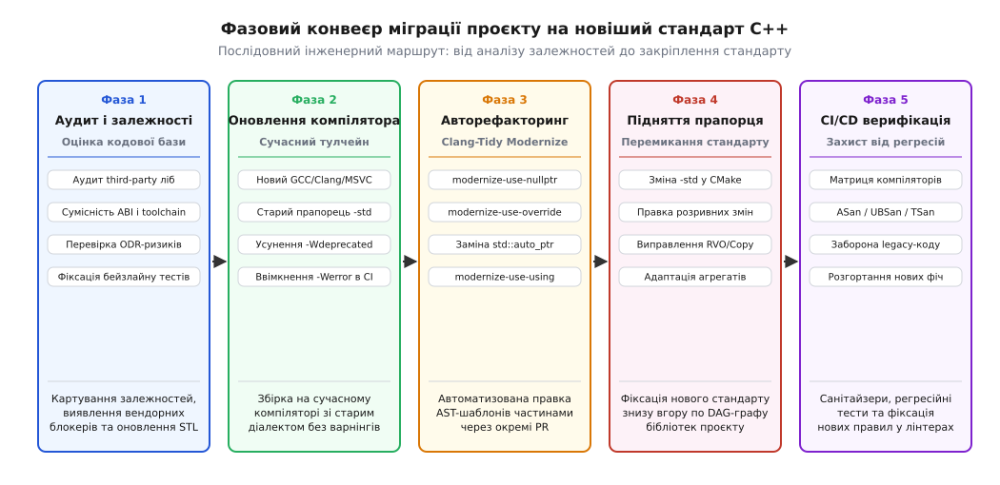
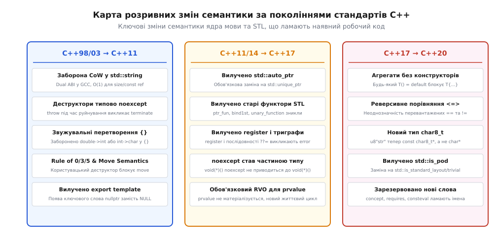
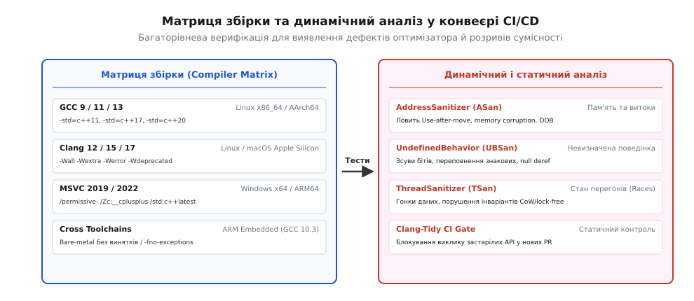

# Перехід проєкту на новіший стандарт: стратегії, інструменти, семантичні пастки

<preknowlist>
- [Підтримка стандартів компіляторами й прапорці](root:sys-plang-cpp/compiler-support) — як встановлюються прапорці `-std=c++11`, `-std=c++17`, `-std=c++20` і як компілятори вмикають нові діалекти.
- [Семантика переміщення](root:sys-plang-cpp/move-semantics) — як rvalue-посилання та `std::move` змінили правила володіння ресурсами.
- [Розумні вказівники: std::unique_ptr](root:sys-plang-cpp/unique-ptr) — чому `std::auto_ptr` став небезпечним і як відбувся перехід на монопольне володіння.
- [Гарантоване опущення копіювання (RVO)](root:sys-plang-cpp/copy-elision) — як C++17 змінив модель обчислення prvalue і коли конструктори копіювання/переміщення більше не викликаються.
- [Стабільність ABI у C++](root:sys-plang-cpp/abi-stability-cpp) — чому зміна внутрішньої структури `std::string` та стандартних контейнерів ламає бінарну сумісність.
</preknowlist>

Коли інженерна команда змінює в конфігурації системи збірки прапорець `-std=c++11` на `-std=c++17` або `-std=c++20` у кодовій базі на пів мільйона рядків, компілятор не просто відкриває доступ до нових ключових слів чи зручних контейнерів стандартної бібліотеки. Він активує принципово інший набір правил аналізу абстрактного синтаксичного дерева, змінює модель пам'яті, посилює оптимізації на основі невизначеної поведінки та видаляє застарілі компоненти, на яких десятиліттями трималися архітектурні шари системи.

Спроба виконати такий перехід «в один день» зазвичай закінчується сотнями помилок компіляції (`error: no template named 'auto_ptr'`, `error: ISO C++20 considers aggregate initialization invalid`), каскадними розривами лінкування через несумісність сторонніх залежностей та прихованими збоями часу виконання (англ. *runtime silent breaks*). Модернізація великої кодової бази вимагає системної інженерної стратегії, автоматизованого рефакторингу на базі компіляторних дерев та багаторівневого захисту від регресій.

## Стратегії модернізації: «Великий вибух» проти інкрементального конвеєра

Найпоширенішою помилкою при оновленні стандарту є підхід «Великого вибуху» (англ. *Big Bang Migration*). Розробник створює окрему гілку `feature/cxx20-upgrade`, змінює глобальний прапорець збірки і починає вручну правити тисячі виявлених помилок. Оскільки решта команди паралельно продовжує щодня вливати новий бізнес-код у гілку `master`, через кілька місяців гілка міграції накопичує катастрофічну кількість конфліктів злиття (merge conflicts), стає непротестованою і врешті-решт закривається без результату.

Життєздатною альтернативою є архітектурна стратегія поступового заміщення (англ. *Strangler Fig Pattern*), адаптована для C++ систем. Вона розбиває процес на п'ять строго ізольованих фаз:



*Послідовний інженерний маршрут: від аналізу залежностей та оновлення тулчейну до фіксації стандарту в CI/CD.*

### Фаза 1: Аудит сторонніх залежностей та дерева DAG

Перш ніж змінювати власні файли, необхідно дослідити граф залежностей (Directed Acyclic Graph, DAG). Будь-яка зовнішня бібліотека, підключена у вигляді бінарного файлу (`.so`, `.dll`, `.a`, `.lib`), скомпільована попередньою версією компілятора або старим стандартом, може експортувати структури даних, розмір або вирівнювання яких змінилися в новому стандарті. 

Аудит починається зі сканування всіх зовнішніх інтерфейсів на наявність експортованих STL-типів (`std::string`, `std::vector`, `std::function`). Необхідно зафіксувати всі залежності, оновити сторонні пакунки через менеджери (Conan, vcpkg) або спланувати їхню ізоляцію за інтерфейсними бар'єрами. Якщо постачальник закритої бібліотеки не надає збірку під новий стандарт, таку бібліотеку поміщають у карантинний модуль з C-сумісним API.

### Фаза 2: Оновлення компілятора без зміни прапорця стандарту

Ключовий тактичний крок: спочатку в системі збірки оновлюють компілятор до сучасної версії (наприклад, перехід із GCC 7 на GCC 13 або перехід на сучасний Clang/MSVC), але **залишають старий прапорець стандарту** (наприклад, `-std=c++11`). 

Сучасний компілятор у режимі сумісності зі старим стандартом забезпечує:
1. Попередження про застарілі конструкції (`-Wdeprecated`, `-Wdeprecated-declarations`), які будуть фізично видалені в наступних стандартах.
2. Суворішу діагностику помилок систем типів (`-Wall -Wextra -Wpedantic`).
3. Виявлення застарілих розширень компілятора (GNU Extensions), які суперечать стандарту ISO.
4. Можливість усунути всі попередження в коді та зафіксувати прапорець `-Werror` у конвеєрі CI до того, як буде змінено сам стандарт мови.

### Фаза 3: Автоматизована трансформація сирців через Clang-Tidy

Масове виправлення синтаксичних конструкцій виконується не вручну, а пакетними утилітами AST-трансформації. Застосування перевірок модуля `modernize-*` розбивається на окремі правила (`use-nullptr`, `use-override`, `replace-auto-ptr`), кожне з яких вливається в основну гілку `master` окремим атомарним запитом на злиття (Pull Request). Завдяки цьому кодова база поступово наближається до нового стандарту без блокування щоденної розробки.

### Фаза 4: Підняття стандарту знизу вгору по дереву модулів

У системі збірки CMake перемикання стандарту здійснюється не глобальною змінною `CMAKE_CXX_STANDARD`, а на рівні таргетів (`target_compile_features`). Спершу на новий стандарт переводяться базові незалежні бібліотеки (математика, утиліти, парсери), потім модулі бізнес-логіки, і лише в самому кінці — фінальні виконувані файли та високорівневі сервіси.

### Фаза 5: Закріплення в CI/CD та динамічна верифікація

Після успішної компіляції всіх модулів у CI вмикається матриця збірки на кількох компіляторах, забороняється використання застарілих практик за допомогою лінтерів, а тестовий набір запускається під санітайзерами (ASan, UBSan, TSan) для виявлення дефектів, що виникають через нові оптимізації компілятора.

---

## Семантичні пастки та розривні зміни за поколіннями

Стандарти ISO C++ прагнуть зберігати зворотну сумісність, проте регулярний технічний аудит вилучає небезпечні механізми. [Історія розривних змін у стандартах C++](root:sys-plang-cpp/migrating-standards/hist-breaking-changes-evolution.md) показує, що кожне покоління мови містить критичні розриви семантики:



*Ключові зміни семантики ядра мови та STL, що ламають наявний робочий код при переході на новіші стандарти.*

### Перехід C++98/03 → C++11

Перехід на C++11 був найрадикальнішим стрибком в історії мови, оскільки ввів формальну багатопотокову модель пам'яті та семантику переміщення.

#### 1. Заборона Copy-On-Write (CoW) для std::string та криза Dual ABI

У C++98 більшість реалізацій стандартної бібліотеки (зокрема GNU `libstdc++`) оптимізували роботу з рядками через спільний буфер із лічильником посилань (Copy-On-Write). Копіювання рядка було дешевою операцією копіювання вказівника, а реальне виділення пам'яті відбувалося лише в момент виклику неконстантного оператора модифікації `s[0] = 'a'`.

Стандарт C++11 ввів жорсткі вимоги:
- Одночасне читання рядка з кількох потоків через константні методи або константний `operator[]` не має права викликати стан гонитви даних (Data Race) або змінювати спільний лічильник посилань.
- Метод `std::string::size()` зобов'язаний виконуватися за строгий час `O(1)`.
- Неконстантні методи не повинні інвалідувати ітератори для інших екземплярів рядка.

Це зробило схему CoW незаконною, змусивши бібліотеки перейти на оптимізацію малих рядків (Small String Optimization, SSO), де малі рядки (до 15–22 байтів) зберігаються безпосередньо всередині структури без звернення до купи. У GCC це спричинило фундаментальний розрив бінарної сумісності (ABI Break) у версії 5.1: об'єкти `std::string` та `std::list` змінили свій внутрішній розмір та розташування полів. 

Якщо одна бібліотека скомпільована зі старим ABI (`_GLIBCXX_USE_CXX11_ABI=0`), а інша з новим (`_GLIBCXX_USE_CXX11_ABI=1`), спроба передати рядок між ними через межі функцій викликає миттєве падіння лінкера з помилкою відсутності символу (Undefined Symbol) через манглювання імен `std::__cxx11::basic_string` або крах пам'яті під час виконання.

#### 2. Еволюція алокаторів та поширення стану контейнерів

У C++98 алокатори STL формально мали бути безстановими (stateless), а вираз `a1 == a2` завжди вважався істинним. У C++11 стандарт ввів повноцінну підтримку алокаторів зі станом (stateful allocators) через концепцію трейтів `std::allocator_traits`.

Це змінило правила переміщення контейнерів (`std::vector`, `std::list`, `std::map`). Якщо два екземпляри контейнера мають різні алокатори, які не є еквівалентними, операція переміщення `v1 = std::move(v2)` не може просто виконати обмін внутрішніми покажчиками за час `O(1)`. Якщо прапорець `propagate_on_container_move_assignment` встановлено у `false`, контейнер зобов'язаний виконувати поелементне виділення нової пам'яті та копіювання/переміщення елементів за час `O(N)`. Застарілий код пулів пам'яті, який не враховував правила `allocator_traits`, стикається з несподіваними падіннями продуктивності або пошкодженням пам'яті при спробі звільнити буфер чужим алокатором.

#### 3. Деструктори за замовчуванням стали noexcept(true)

У C++98 деструктор міг генерувати винятки, якщо це не було явно заборонено. У C++11 усі деструктори за замовчуванням мають неявну специфікацію `noexcept(true)` (якщо тільки поля або базові класи не мають деструкторів із `noexcept(false)`). 

Якщо застарілий код генерує виняток у деструкторі під час очищення ресурсів:
```cpp
struct DatabaseSession {
    ~DatabaseSession() {
        if (!flush()) {
            throw std::runtime_error("Не вдалося зберегти транзакцію"); // C++98: передача в catch
                                                                        // C++11: std::terminate()!
        }
    }
};
```
У C++11 виникнення винятку всередині функції з `noexcept(true)` призводить до негайного виклику `std::terminate()`, що миттєво аварійно завершує весь процес без розгортання стека (stack unwinding).

#### 4. Правило п'яти та неявне пригнічення переміщення

У C++98 діяло «Правило трьох»: якщо класу був потрібен користувацький деструктор, конструктор копіювання чи оператор присвоєння копіюванням, розробник мав оголосити всі три. У C++11 з'явилися конструктор і оператор переміщення. 

Компілятор генерує конструктор переміщення автоматично **лише тоді**, коли в класі **немає жодного** користувацького конструктора копіювання, оператора копіювання чи деструктора. Якщо клас у C++98 містив тривіальний деструктор `~Widget() { delete ptr_; }`, у C++11 цей деструктор блокує автоматичну генерацію переміщення. Коли новий код викликає `std::move(widget)` або повертає об'єкт із функції, компілятор тихо відкочується до виклику конструктора копіювання, що непомітно знищує очікувану оптимізацію продуктивності.

#### 5. Заборона звужувальних перетворень (Narrowing) у списках ініціалізації

Уніфікована ініціалізація фігурними дужками `{}` у C++11 забороняє перетворення типів із потенційною втратою точності:
```cpp
int a = 3.14;   // C++98/11: компілюється (неявне відсікання дробової частини)
int b{3.14};   // C++11: помилка компіляції (narrowing conversion from double to int)
char c{300};   // C++11: помилка компіляції (значення 300 не вміщується в signed char)
```

---

### Перехід C++11/14 → C++17

Стандарт C++17 провів першу повномасштабну зачистку накопиченого за два десятиліття технічного боргу.

#### 1. Фізичне вилучення std::auto_ptr та старих функторів STL

У C++17 остаточно вилучено шаблон `std::auto_ptr`. Будь-який вихідний файл або заголовок сторонньої бібліотеки, що містить `std::auto_ptr<T>`, призводить до фатальної зупинки компіляції. Заміна на `std::unique_ptr<T>` вимагає зміни семантики передачі володіння: замість неявного копіювання необхідно явно вказувати `std::move()`.

Разом із `auto_ptr` з мови вилучили:
- Функціональні адаптери C++98: `std::bind1st`, `std::bind2nd`, `std::ptr_fun`, `std::mem_fun`.
- Базові класи функторів: `std::unary_function`, `std::binary_function`.
- Генератор псевдовипадкових чисел `std::random_shuffle` (замінений на `std::shuffle`, що приймає сучасні генератори з `<random>`).

#### 2. Вилучення ключового слова register та триграфів

Ключове слово `register` позбавлене будь-якого значення і викликає помилку компілятора при використанні як специфікатор класу пам'яті. Триграфи (комбінації `??=`, `??/`, `??'`) більше не розпізнаються препроцесором як заміна спеціальних символів.

#### 3. noexcept як частина системи типів

У C++11 специфікатор `noexcept` був властивістю оголошення функції, але не входив до її типу. У C++17 наявність `noexcept` є невіддільною частиною типу функції.

Це ламає старий код роботи з покажчиками на функції:
```cpp
void safe_action() noexcept;

// Тип покажчика: void (*)() noexcept
// Очікуваний тип: void (*)()
void (*func_ptr)() = safe_action; // C++11: компілюється
                                  // C++17: помилка компіляції (неможливо перетворити
                                  //        покажчик на noexcept-функцію у покажчик без noexcept)
```
Якщо сторонній фреймворк або інтерфейс зворотного виклику (callback) приймає `void (*)(void*)`, передача функції, оголошеної як `noexcept`, призведе до помилки невідповідності типів.

#### 4. Обов'язкове опущення копіювання (Guaranteed Copy Elision)

До C++17 повернення об'єкта за значенням із функції або ініціалізація тимчасовим об'єктом формально вимагали наявності доступного конструктора копіювання чи переміщення, навіть якщо компілятор оптимізував виклик (RVO, Return Value Optimization).

У C++17 вираз категорії prvalue (pure rvalue) більше не є готовим тимчасовим об'єктом — це лише інструкція для ініціалізації цільової пам'яті:
```cpp
struct NonMovableServer {
    NonMovableServer() = default;
    NonMovableServer(const NonMovableServer&) = delete;
    NonMovableServer(NonMovableServer&&) = delete;
};

NonMovableServer create_server() {
    return NonMovableServer(); // C++14: помилка компіляції (конструктор переміщення видалено!)
                               // C++17: валідний код (гарантоване опущення копіювання)
}
```
Це відкрило можливість створювати фабрики для некопійованих і непереміщуваних типів (наприклад, `std::mutex`), проте змінило правила перевірки доступності спеціальних функцій-членів.

#### 5. Уточнення порядку обчислення виразів (Order of Evaluation)

До стандарту C++17 порядок обчислення операндів у виразах на кшталт `f(a(), b())` або `v[i] = i++` був повністю невизначеним. Компілятор мав право обчислювати вирази у довільному чергуванні інструкцій.

У C++17 комітет зафіксував строгі правила послідовності (англ. *sequencing rules*):
- У виразі присвоєння `E1 = E2` та складеного присвоєння `E1 += E2` правий операнд `E2` обчислюється раніше за лівий `E1`.
- У виразі звернення до елемента `E1[E2]` вираз `E1` обчислюється раніше за `E2`.
- У виразі виклику методу `E1.f(E2)` вираз об'єкта `E1` обчислюється раніше за аргументи `E2`.
- У ланцюжках операторів зсуву `std::cout << a() << b()` вирази обчислюються строго зліва направо: спочатку викликається `a()`, а потім `b()`.

Якщо старий код неявно покладався на специфічний порядок обчислень оптимізатора конкретного компілятора, результат виконання складних виразів може змінитися.

#### 6. Словникові типи std::optional та std::variant замість покажчиків і тегованих об'єднань

C++17 надав фундаментальні типи `std::optional`, `std::variant` та `std::any`, що кардинально спростили архітектуру програм. Під час рефакторингу застарілих функцій, які повертали нульовий покажчик `nullptr` або спеціальний код помилки для позначення відсутності результату, перехід на `std::optional` усуває неоднозначність володіння пам'яттю.

Заміна поліморфних ієрархій або небезпечних об'єднань `union` у стилі C на `std::variant` із функціональним візитором `std::visit` дозволяє створювати закриті алгебраїчні типи даних із перевіркою всіх гілок під час компіляції:

```cpp
#include <variant>
#include <string>
#include <iostream>

// Патерн перевантаження для std::visit
template<class... Ts> struct overloaded : Ts... { using Ts::operator()...; };
template<class... Ts> overloaded(Ts...) -> overloaded<Ts...>;

using Command = std::variant<int, std::string, double>;

void process_command(const Command& cmd) {
    std::visit(overloaded {
        [](int val) { std::cout << "Команда скидання: " << val << "\n"; },
        [](const std::string& str) { std::cout << "Текстова команда: " << str << "\n"; },
        [](double timeout) { std::cout << "Таймаут: " << timeout << "с\n"; }
    }, cmd);
}
```

Крайовим випадком для `std::variant` є стан `valueless_by_exception`: якщо під час зміни типу об'єкта конструктор згенерував виняток, варіант може втратити значення, а спроба звернення до нього викликає `std::bad_variant_access`.

---

### Перехід C++17 → C++20

Стандарт C++20 ввів монументальні нововведення (модулі, концепти, корутини, діапазони) і водночас суттєво переглянув фундаментальні правила ядра мови.

#### 1. Нові правила агрегатної ініціалізації

У C++17 агрегатом вважався тип, який не має користувацьких конструкторів, приватних нестатичних полів, віртуальних методів та віртуальних базових класів. Додавання конструктора за замовчуванням у стилі `Point() = default;` дозволяло використовувати як ініціалізацію за замовчуванням `Point p;`, так і агрегатну ініціалізацію `Point p{10, 20};`.

У C++20 правило змінено: **будь-який оголошений користувачем конструктор (навіть `= default` або `= delete`) дискваліфікує клас зі статусу агрегата**:
```cpp
struct Configuration {
    int port;
    int timeout;

    Configuration() = default; // У C++20 це "user-declared constructor"!
};

Configuration cfg{8080, 30};   // C++17: компілюється (агрегатна ініціалізація)
                               // C++20: error: no matching constructor for initialization
```
Це розривна зміна №1 при переході на C++20: бібліотеки, де конструктори були явно оголошені як `= default` «для наочності», раптово втрачають можливість ініціалізуватися списком значень у фігурних дужках.

#### 2. Переписування операторів порівняння та оператор <=>

У C++20 введено тристоронній оператор порівняння `<=>` (Spaceship) та нові правила резолюції перевантажень для операторів `==` та `!=`. Компілятор автоматично генерує симетричні переписані кандидати: якщо визначено лише `bool operator==(const MyType&, int)`, вираз `10 == obj` автоматично переписується компілятором у `obj == 10`.

Це створює неоднозначності в застарілому коді з неявними приведеннями типів:
```cpp
struct CustomIndex {
    int value;
    // Неявне приведення до int
    operator int() const { return value; }
    
    // Старе перевантаження C++98
    bool operator==(const CustomIndex& rhs) const { return value == rhs.value; }
};

CustomIndex a{5}, b{5};
bool eq = (a == b); // C++17: викликає CustomIndex::operator==
                    // C++20: ambiguity error!
                    // Компілятор бачить двох рівноцінних кандидатів:
                    // 1) operator==(a, b)
                    // 2) переписаний варіант через operator int(): (int)a == (int)b
```

#### 3. Модулі C++20 та перехідний період із заголовними файлами

Введення модулів C++20 (`import`, `export module`) кардинально змінює модель збірки. На відміну від заголовків, модулі не експортують препроцесорні макроси та не залежать від порядку підключення. 

Під час міграції виникають специфічні труднощі:
- **Фрагмент глобального модуля (Global Module Fragment):** застарілі заголовки мови C або системні заголовки операційної системи (наприклад, `<windows.h>` або `<sys/socket.h>`), що містять макроси, повинні розміщуватися виключно на початку файлу модуля у блоці `module; ... #include <...>`.
- **Одиниці заголовків (Header Units):** конструкція `import <vector>;` парсить стандартний заголовок як окрему бінарну одиницю інтерфейсу (BMI, Binary Module Interface). Це прискорює компіляцію, проте вимагає сучасної системи збірки (CMake 3.28+ з генератором Ninja), яка вміє динамічно сканувати граф залежностей модулів перед початком компіляції.

#### 4. Багатопоточність C++20: std::jthread та атомарні типи з рухомою комою

У C++11 клас `std::thread` мав серйозний дефект дизайну: якщо потік не було явно приєднано через `join()` або від'єднано через `detach()` до моменту знищення об'єкта, його деструктор викликав фатальний `std::terminate()`.

У C++20 введено клас `std::jthread` (Cooperative Joining Thread). Він автоматично надсилає сигнал зупинки через вбудований токен `std::stop_token` та виконує `join()` у своєму деструкторі, запобігаючи аварійним падінням під час розгортання винятків. Крім того, додано спеціалізації атомарних операцій для чисел із рухомою комою `std::atomic<float>` та атомарні розумні вказівники `std::atomic<std::shared_ptr<T>>`, що усуває необхідність у саморобних неблокувальних структурах.

#### 5. Вилучення std::is_pod та оновлення трейтів типів

Трейт `std::is_pod` оголошено застарілим у C++20 через неточність терміна. Замість нього необхідно використовувати `std::is_standard_layout` (гарантія безпечного розташування полів у пам'яті для передачі у C-бібліотеки) та `std::is_trivial` (гарантія безпечного копіювання через `memcpy`).

Також вилучено спеціалізацію `std::allocator<void>`, метод `allocate(size, hint)` та допоміжний ітератор `std::raw_storage_iterator`, що вимагає оновлення користувацьких контейнерів на використання `std::allocator_traits`.

#### 6. Новий тип char8_t для рядків UTF-8

У C++20 літерали UTF-8 `u8"Привіт"` мають тип `const char8_t[N]`, а не `const char[N]`. Старий код, який передавав `u8"..."` безпосередньо у функції, що приймають `const char*` або `std::string`, перестає компілюватися без явного перетворення типів (`reinterpret_cast`) або переходу на `std::u8string`.

---

## Автоматизований рефакторинг через Clang-Tidy

Ручне внесення правок у великих проєктах неминуче призводить до помилок. Пакетний інструмент `clang-tidy` використовує компіляторний фронтенд Clang для побудови повного абстрактного синтаксичного дерева (AST) кожної одиниці трансляції. Завдяки зіставленню вузлів AST за допомогою декларативних правил (AST Matchers) інструмент генерує точні текстові виправлення (Fix-It Hints).

Повний перелік перевірок, синтаксис конфігурації та матрицю прапорців компіляторів наведено у [довіднику правил Clang-Tidy та інструментів міграції](root:sys-plang-cpp/migrating-standards/api-migration-tooling.md).

### Ключові перевірки модуля modernize:

1. **`modernize-use-nullptr`:** знаходить усі цілочисельні літерали `0` та макроси `NULL` у контексті вказівників і замінює їх на типобезпечне ключове слово `nullptr`.
2. **`modernize-use-override`:** аналізує поліморфні ієрархії класів, додає специфікатор `override` до всіх віртуальних методів-нащадків і видаляє зайве слово `virtual`. Це запобігає прихованим багам, коли зміна сигнатури методу базового класу перетворює перевизначення на нове перевантаження.
3. **`modernize-use-using`:** замінює застарілий синтаксис `typedef Type Alias;` на сучасні псевдоніми `using Alias = Type;`, що підтримують параметризацію шаблонами.
4. **`modernize-replace-auto-ptr`:** автоматично замінює заборонений тип `std::auto_ptr` на `std::unique_ptr`, додаючи необхідні заголовки `<memory>`.
5. **`modernize-make-unique` та `modernize-make-shared`:** замінює небезпечні явні виклики `std::unique_ptr<T>(new T(...))` на фабричні функції, що забезпечують безпеку щодо винятків (Exception Safety) та компактну алокацію пам'яті.
6. **`modernize-loop-convert`:** перетворює заплутані індексні цикли `for (size_t i = 0; i < v.size(); ++i)` та ітераторні конструкції на читабельні цикли на основі діапазонів `for (const auto& item : v)`.
7. **`modernize-use-nodiscard`:** додає атрибут `[[nodiscard]]` до методів без побічних ефектів, змушуючи компілятор попереджати про проігноровані результати.

### Ризики сліпого авторефакторингу:

- **Проксі-типи та `modernize-use-auto`:** Правило `modernize-use-auto` не можна бездумно застосовувати до бібліотек лінійної алгебри на шаблонах виразів (наприклад, Eigen) або спеціалізацій на кшталт `std::vector<bool>`. Вираз `auto val = matrix_a * matrix_b;` створює проксі-об'єкт із посиланнями на тимчасові змінні, що призводить до падіння пам'яті (Use-After-Free) при спробі використати результат на наступному рядку.
- **Гонки запису у спільні заголовки:** Паралельний запуск `clang-tidy -fix` на декількох файлах `.cpp`, що підключають один заголовок `common.hpp`, призводить до пошкодження тексту файлу. Необхідно застосовувати двофазну схему злиття виправлень через `clang-apply-replacements`.
- **Передача за значенням непереміщуваних типів:** Правило `modernize-pass-by-value` замінює `const T&` на передачу за значенням `T` та `std::move`. Якщо тип не має дешевого конструктора переміщення (наприклад, масив фіксованого розміру `std::array<double, 1024>`), така заміна призводить до зайвого копіювання та сповільнення критичних шляхів коду.

---

## Гібридні кодові бази та макроси тестування можливостей

У багатьох сценаріях (наприклад, розробка публічної бібліотеки з відкритим кодом або перехідний період в інфраструктурі великої компанії) кодова база повинна одночасно компілюватися кількома стандартами (наприклад, C++14 у виробничому оточенні та C++20 у тестовому).

### Небезпека перевірки версії компілятора та порятунок через SD-6

Історично розробники перевіряли підтримку можливостей через препроцесорні макроси версій компіляторів:
```cpp
// Антипатерн: крихка прив'язка до версій компіляторів
#if defined(__GNUC__) && (__GNUC__ > 7)
    #include <string_view>
    using MyStringView = std::string_view;
#else
    #include "custom_string_view.hpp"
    using MyStringView = custom::string_view;
#endif
```
Такий код швидко ламається на нових версіях Clang або MSVC, які впроваджують можливості стандарту в іншому порядку.

Сучасний підхід спирається на стандартизовані **макроси тестування можливостей (Feature Test Macros за стандартом SD-6)**, які повертають числове значення дати ухвалення ревізії:
```cpp
// Сучасний надійний шаблон сумісності
#if defined(__has_include)
    #if __has_include(<version>)
        #include <version>
    #endif
#endif

#if defined(__cpp_lib_string_view) && (__cpp_lib_string_view >= 201606L)
    #include <string_view>
    namespace compat {
        using string_view = std::string_view;
    }
#else
    #include "compat/fallback_string_view.hpp"
    namespace compat {
        using string_view = compat::fallback_string_view;
    }
#endif
```

### Проблема порушення правила одного визначення (ODR)

Якщо заголовний файл містить різну структуру даних залежно від прапорця стандарту:
```cpp
struct PacketHeader {
    uint32_t id;
#if __cplusplus >= 201703L
    std::string_view tag; // Розмір: 16 байтів у C++17
#else
    std::string tag;      // Розмір: 32 байти у C++11 (SSO)
#endif
};
```
Якщо одна одиниця трансляції скомпільована як C++11, а інша як C++17, структура `PacketHeader` матиме різний розмір та різне зміщення полів у пам'яті. Передача покажчика `PacketHeader*` між ними призведе до катастрофічного порушення правила одного визначення (One Definition Rule, ODR), мовчазного пошкодження пам'яті та краху програми, який неможливо відстежити звичайним налагоджувачем.

Для усунення ризиків ODR застосовують внутрішні простори назв (Inline Namespaces) або ховають внутрішню структуру типів за патерном PIMPL (Pointer to Implementation).

---

## Аудит залежностей та ізоляція застарілих бібліотек

Якщо в проєкті використовується закрита стороння бібліотека, зібрана під C++03, включення її заголовків у C++20 код неможливе через синтаксичні розриви. 

Єдиним надійним архітектурним шаблоном є створення **адаптера з C-сумісним або непрозорим RAII-інтерфейсом**:

```cpp
// legacy_adapter.hpp — чистий C++20 інтерфейс
#pragma once
#include <memory>
#include <string>
#include <string_view>

namespace modern_app {

class LegacyDatabaseBridge {
public:
    LegacyDatabaseBridge();
    ~LegacyDatabaseBridge();

    LegacyDatabaseBridge(const LegacyDatabaseBridge&) = delete;
    LegacyDatabaseBridge& operator=(const LegacyDatabaseBridge&) = delete;
    LegacyDatabaseBridge(LegacyDatabaseBridge&&) noexcept;
    LegacyDatabaseBridge& operator=(LegacyDatabaseBridge&&) noexcept;

    [[nodiscard]] bool connect(std::string_view connection_string);
    [[nodiscard]] std::string execute(std::string_view query);

private:
    struct Impl;
    std::unique_ptr<Impl> pimpl_;
};

} // namespace modern_app
```

Файл реалізації `legacy_adapter.cpp` компілюється в окремій одиниці трансляції зі старим прапорцем стандарту або транслює старі типи (`char*`, `std::auto_ptr`) у сучасні контейнери, гарантуючи, що жоден застарілий тип STL не просочиться у глобальний простір імен клієнтського коду.

### Діагностика розривів ABI за допомогою утиліт Linux

Якщо під час лінкування виникають помилки відсутності символів між різними версіями компіляторів, для аудиту використовують утиліту `nm` з деманглюванням імен:

```bash
# Перевірка наявності символів старого або нового ABI у бінарній бібліотеці
nm -C libvendor_engine.a | grep "std::basic_string"
```

Якщо у виводі з'являються символи без суфікса `[abi:cxx11]`, бібліотека використовує старий формат рядків GCC 4.x (CoW). Спроба зв'язати її з проєктом на GCC 5+ без прапорця `-D_GLIBCXX_USE_CXX11_ABI=0` гарантовано зламає лінкування.

---

## Налаштування матричного CI/CD та динамічна верифікація

Нові версії компіляторів оснащені значно агресивнішими модулями оптимізації на базі SSA-форм (Static Single Assignment) та аналізу діапазонів значень. Якщо старий код містив приховану невизначену поведінку (Undefined Behavior, UB) — наприклад, переповнення знакових цілих чисел, вихід за межі масиву на 1 байт або доступ до пам'яті після переміщення (Use-After-Move) — старий компілятор на рівні `-O0` міг генерувати код, що «випадково працював».

Сучасний оптимізатор при компіляції з прапорцями `-std=c++20 -O3` вважає, що невизначена поведінка неможлива в принципі, і просто видаляє цілі гілки коду, що призводить до загадкових збоїв у виробничому середовищі.

Для захисту від регресій використовується матричний конвеєр верифікації:



*Багаторівнева верифікація для виявлення дефектів оптимізатора й розривів сумісності.*

### Обов'язкові рівні контролю в CI/CD:

1. **AddressSanitizer (ASan) + LeakSanitizer (LSan):** прапорці `-fsanitize=address,leak -fno-omit-frame-pointer`. Перехоплюють читання після звільнення (Use-After-Free), використання об'єкта після виклику `std::move` та витоки ресурсів.
2. **UndefinedBehaviorSanitizer (UBSan):** прапорець `-fsanitize=undefined`. Фіксує розіменування нульових покажчиків, некоректні бітові зсуви, переповнення знакових типів та порушення правил приведення вказівників на структури (Strict Aliasing).
3. **ThreadSanitizer (TSan):** прапорець `-fsanitize=thread`. Обов'язковий при міграції з C++98 на C++11/17 для виявлення гонок даних, що виникають через зміну поведінки внутрішніх блокувань STL та заміну Copy-On-Write рядків.
4. **Матриця компіляторів:** кожен Pull Request збирається трьома основними рушіями (GCC, Clang, MSVC). Це гарантує, що код не спирається на фірмові розширення компілятора і суворо відповідає тексту стандарту ISO.

Повну програмну реалізацію транзакційного конвеєра міграції з інтеграцією `git bisect` та автоматичним відкатом збійних правил наведено у [проєктній вставці конвеєра автоматизованої модернізації](root:sys-plang-cpp/migrating-standards/proj-migration-pipeline.md).

---

## Інженерний висновок

Перехід кодової бази на новіший стандарт C++ — це не одноразова технічна ревізія, а регулярна дисципліна управління технічним боргом. Трирічний цикл випуску стандартів ISO WG21 означає, що ігнорування нових релізів протягом десятиліття перетворює наступне оновлення на непосильний проект із високим ризиком для бізнесу.

Послідовний інженерний підхід — розділення оновлення тулчейну та підняття стандарту, автоматизована трансформація AST через Clang-Tidy, ізоляція сторонніх залежностей за непрозорими інтерфейсними бар'єрами та тотальний динамічний контроль санітайзерами — перетворює міграцію з хаотичної кризи на передбачуваний, безпечний та контрольований інженерний процес.
