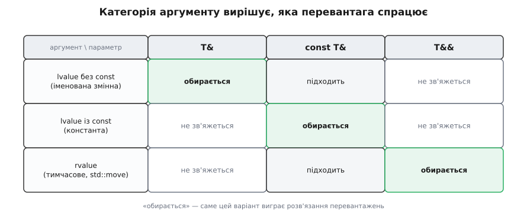
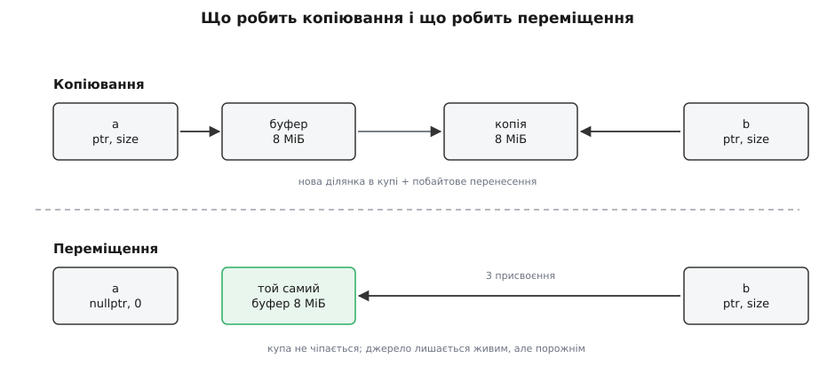
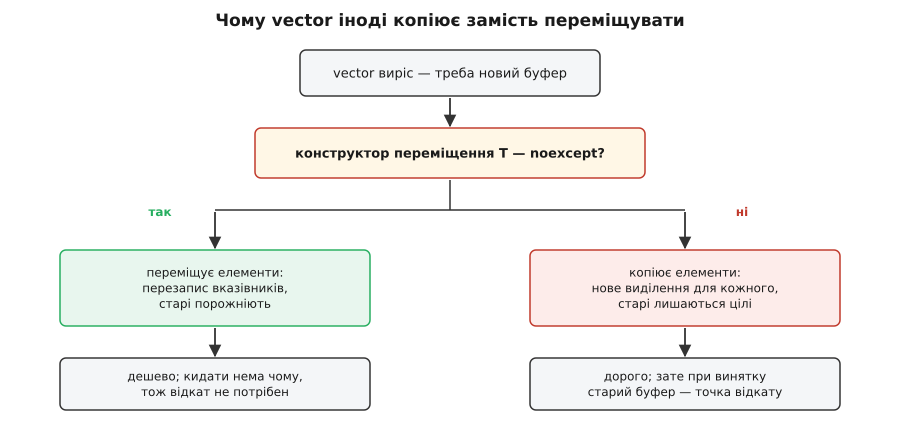

# Семантика переміщення і rvalue-посилання

<preknowlist>
- [Категорії значень: lvalue, prvalue, xvalue](root:sys-plang-cpp/value-categories) — кожен вираз має не лише тип, а й категорію: чи має він ім'я і чи переживе він поточний вираз.
- [RAII: ресурс прив'язаний до часу життя](root:sf-lang/raii) — конструктор захоплює ресурс, деструктор звільняє його рівно один раз.
- [Глибока й поверхнева копія](root:sf-lang/deep-shallow-copy) — копіювати вказівник чи те, на що він показує.
- [Купа](root:sf-lang/heap-dynamic-memory) — звідки береться динамічна пам'ять і чому виділення коштує на порядки дорожче за присвоєння.
- [Адреси й покажчики](root:sf-lang/addresses-pointers) — об'єкт може бути крихітним сам по собі й водночас володіти величезним шматком пам'яті поза собою.
- [Розв'язання перевантажень](root:sys-plang-cpp/overload-resolution) — як компілятор із кількох однойменних функцій обирає одну.
</preknowlist>

## Копія, якої ніхто не побачить

Функція зібрала рядок і повертає його; викликач кладе результат у свою змінну. Між цими двома реченнями в C++98 відбувалося таке: у купі виділялася нова ділянка, туди побайтово переписувалися всі символи, а через мить джерело знищувалося і його ділянка поверталася купі. Дані, які щойно старанно продублювали, зникали разом з оригіналом. Робота була виконана в порожнечу.

Компілятор при цьому не робив нічого дурного — він робив єдине, що йому дозволено. Конструктор копіювання приймає джерело як `const T&` і зобов'язаний лишити його незмінним, бо не має жодного способу дізнатися, чи звернуться до цього джерела ще раз. Порівняйте два рядки:

```cpp
std::string a = build();   // джерело — безіменний тимчасовий об'єкт
std::string b = a;         // джерело — жива змінна, її ще читатимуть
```

Обидва запускають той самий конструктор копіювання з тим самим типом аргументу. Відмінність між ними не в типі й не в значенні, а в **майбутньому джерела**: у першому рядку тимчасовий об'єкт помре в кінці цього ж виразу, і його буфер усе одно піде в купу; у другому `a` житиме далі, і забрати в нього буфер було б катастрофою.

Отже, бракує не самої інформації — компілятор чудово знає, що `build()` дає безіменне тимчасове значення, а `a` — іменовану змінну. Бракує **каналу**, яким ця відмінність дійшла б до вибору функції.

## Канал: посилання, що чіпляється лише за приречене

Єдиний механізм, яким у C++ той самий синтаксис виклику веде до різного коду, — розв'язання перевантажень: серед кількох однойменних функцій компілятор обирає ту, чий параметр найкраще пасує до аргументу. Тож канал мусив бути новим **типом параметра** — таким, що приймає приречені значення й відмовляється приймати живі.

Наявне `const T&` для цього не годиться: воно зв'язується геть з усім — з іменованими змінними, з константами, з тимчасовими. Саме ця всеїдність колись і зробила його зручним, і саме вона позбавляє його розрізнювальної сили.

Тому в мову ввели друге посилання, яке пишеться двома амперсандами й зв'язується **лише** з тим, що ось-ось помре:

```cpp
void take(const std::string& s);   // джерело поживе далі — не чіпаємо
void take(std::string&& s);        // джерело приречене — можна розібрати на частини
```

`T&&` називають rvalue-посиланням; сама назва «rvalue» дісталася в спадок від старого правила «праворуч від знака присвоєння може стояти будь-який вираз, ліворуч — лише той, що позначає об'єкт із адресою» (англ. *right value* — значення справа). Уся семантика переміщення стоїть на одному крихітному додатку до правил зв'язування:



*Для тимчасового значення `T&&` — точніше збігання, ніж `const T&`, тому виграє воно; іменована змінна з `T&&` не зв'язується взагалі, тому для неї лишається звичне копіювання.*

Читати таблицю варто з правого нижнього кута. Виклик `take(build())` передає тимчасовий об'єкт: обидві перевантаги здатні його прийняти, але `std::string&&` збігається точніше, і компілятор бере її. Виклик `take(a)` передає іменовану змінну: `std::string&&` з нею не зв'язується, лишається `const std::string&`. Один і той самий текст виклику — дві різні функції, і жодного рішення в час виконання.

> 🔧 **Навіщо це.** Розділення відбувається повністю на етапі компіляції: у машинному коді немає ні перевірки прапорця, ні гілки «а це часом не тимчасове?». Тому переміщення можна вживати в найгарячіших місцях — у контейнерах, у поверненні значень, у перекладанні буферів між шарами — не платячи за саму диспетчеризацію нічого.

Ідея, що виглядає очевидною заднім числом, визрівала близько десятиліття: спершу її намагалися зробити бібліотечними хитрощами на кшталт `auto_ptr`, і лише коли ті хитрощі зайшли в глухий кут, дійшли до зміни самої мови. [Як народилося rvalue-посилання](root:sys-plang-cpp/move-semantics/hist-move-proposal.md) — про папір N1377 (2002) і про те, які саме невдачі бібліотеки штовхнули комітет змінити правила зв'язування; корисно, щоб бачити, від чого рятує кожне з нинішніх правил.

### Іменоване rvalue-посилання — це lvalue

Тут зачаїлося правило, яке спершу здається суперечністю, а насправді тримає всю конструкцію. Усередині функції

```cpp
void take(std::string&& s) {
    consume(s);              // ← сюди піде КОПІЯ
    consume(std::move(s));   // ← а сюди переміщення
}
```

вираз `s` — це **lvalue**, хоча тип змінної `s` є rvalue-посиланням. Тип змінної й категорія виразу, що її називає, — різні речі: щойно в об'єкта з'явилося ім'я, до нього можна звернутися ще раз, а отже, він більше не приречений.

Необхідність цього правила видно, коли уявити протилежне. Якби `s` лишалося rvalue, то кожне вживання `s` у тілі функції було б «забиранням нутрощів»: перше `consume(s)` спорожнило б рядок, а друге отримало б пустку — і компілятор би про це нічого не сказав. Правило «усе, що має ім'я, — lvalue» робить кожне забирання видимим у тексті: воно завжди позначене явним `std::move`.

### У шаблоні ті самі два амперсанди означають інше

Ще одна річ, яку легко прочитати неправильно. Два амперсанди утворюють rvalue-посилання лише тоді, коли тип **уже відомий**. Якщо `T` — параметр шаблону, який виводиться з аргументу, то `T&&` перетворюється на зовсім інший інструмент:

```cpp
void take(std::string&& s);      // rvalue-посилання: лише тимчасові

template <class T>
void relay(T&& x);               // НЕ rvalue-посилання: приймає геть усе
```

У другому випадку `T` підбирається так, щоб параметр підійшов до будь-якого аргументу: для іменованої змінної виводиться `T = std::string&`, і `T&&` після згортання посилань стає `std::string&`; для тимчасового виводиться `T = std::string`, і параметр лишається `std::string&&`. Такий параметр зветься універсальним (або передавальним) посиланням, і працює він за іншими правилами, ніж усе описане тут: [ідеальне передавання й універсальні посилання](root:sys-plang-cpp/perfect-forwarding). Ознака проста: якщо ліворуч від `&&` стоїть параметр шаблону, що виводиться з цього ж аргументу, — це не rvalue-посилання.

## Що саме робить конструктор переміщення

Візьмімо клас, який володіє шматком пам'яті, — найчистіший випадок, де переміщення має сенс:

```cpp
class Buffer {
    std::byte*  data_ = nullptr;
    std::size_t size_ = 0;

public:
    explicit Buffer(std::size_t n)
        : data_(new std::byte[n]), size_(n) {}

    ~Buffer() { delete[] data_; }

    Buffer(const Buffer& other)                       // копіювання
        : data_(new std::byte[other.size_]), size_(other.size_) {
        std::memcpy(data_, other.data_, size_);
    }

    Buffer(Buffer&& other) noexcept                   // переміщення
        : data_(other.data_), size_(other.size_) {
        other.data_ = nullptr;
        other.size_ = 0;
    }
};
```

Конструктор копіювання просить у купи нову ділянку й переносить туди байти: його ціна росте з розміром даних. Конструктор переміщення не звертається до купи взагалі — він переписує два поля й обнуляє джерело. Його ціна стала й дорівнює кільком присвоєнням, скільки б мегабайтів не лежало за вказівником.



*Переміщення не зачіпає купу: буфер лишається на тому самому місці, змінюється тільки те, хто на нього показує.*

Два останні рядки конструктора переміщення — не косметика й не гігієна, а умова коректності. Деструктор джерела **все одно виконається**: `other` — це нормальний об'єкт зі своїм часом життя, і ніхто його не скасовував. Якби `other.data_` лишився старим вказівником, `delete[]` спрацював би на тому самому блоці двічі — спершу з джерела, потім із приймача. Тому переміщення завжди складається з двох половин: забрати ресурс і **лишити джерело в стані, який його деструктор переживе**.

Повний клас із перевіркою всіх шляхів — конструктор, присвоєння, самоприсвоєння, підрахунок реальних викликів кожної операції — розібраний окремо: [власний тип із переміщенням, крок за кроком](root:sys-plang-cpp/move-semantics/proj-buffer-move.md). Там же видно, скільки саме викликів яких операцій робить контейнер, коли ви кладете в нього такий об'єкт.

## Стан того, з кого перемістили

Джерело після переміщення живе далі. Питання «а що в ньому тепер?» стандарт розв'язує формулою: об'єкти типів стандартної бібліотеки після переміщення перебувають у **дійсному, але не уточненому стані** (англ. *valid but unspecified*).

Формула виглядає ухильною, але вона точна й розпадається на два конкретні дозволи. «Дійсний» означає, що всі інваріанти класу тримаються: деструктор відпрацює правильно, присвоєння нового значення відпрацює правильно, і взагалі спрацює будь-яка операція, **яка не має передумов**. «Не уточнений» означає, що конкретне значення не гарантоване: для `std::string` після переміщення ви маєте право спитати `size()` і отримати відповідь — але яку саме, стандарт не обіцяє.

Звідси практичне правило: після `std::move(s)` дозволено `s.clear()`, `s = "нове"`, `s.empty()`, знищення `s`; не дозволено `s.front()`, `s.back()`, `s.pop_back()` — усе, що вимагає непорожності.

Кілька типів мають сильнішу гарантію, і вона прописана явно: `std::unique_ptr` після переміщення гарантовано порожній, `std::shared_ptr` — теж. Це не випадковість, а необхідність: сенс цих типів у тому, що володіння одноосібне, тож «не уточнений стан» тут означав би «можливо, ще володіє», а це вже подвійне звільнення.

Для власного типу вибір стану — ваше проєктне рішення, і його треба **записати в документації типу**. Найпростіший і найчастіший вибір — стан порожнього, щойно сконструйованого об'єкта; він рівно тому й зручний, що для нього вже все продумано.

Спокуса, якої варто уникнути: зробити «переміщення», яке насправді копіює й лишає джерело недоторканим. Формально це законно — джерело лишається дійсним. Практично це пастка: користувач вашого типу побачить у сигнатурі `T&&`, повірить, що ресурс перейшов, і десь у коді утвориться два власники одного ресурсу.

## `std::move` нічого не переміщує

Найгірше названа функція стандартної бібліотеки не виконує жодного переміщення. Ось вона повністю:

```cpp
template <class T>
constexpr std::remove_reference_t<T>&& move(T&& t) noexcept {
    return static_cast<std::remove_reference_t<T>&&>(t);
}
```

Це зведення типу — і більше нічого. `std::move(x)` бере вираз будь-якої категорії й повертає rvalue того самого об'єкта; жодні байти не рухаються, жодна пам'ять не звільняється. Точніша назва була б `rvalue_cast`: це не дія, а **дозвіл**, обіцянка «мені цей об'єкт більше не потрібен у нинішньому вигляді».

Саме переміщення стається пізніше й в іншому місці — коли отримане rvalue потрапляє аргументом у конструктор чи оператор присвоєння, що має перевантагу з `T&&`. Якщо такої перевантаги немає, `std::move` просто нічого не змінить, і виконається звичайне копіювання. Мовчки.

Ця мовчазність породжує дві найчастіші пастки.

**Перша: `const` вбиває переміщення.** `std::move` над константним об'єктом дає `const T&&`. Така категорія існує, але жоден конструктор переміщення її не бере — вони приймають `T&&` без `const`, бо мусять псувати джерело. Лишається `const T&`, тобто копіювання:

```cpp
class Person {
    const std::string name_;   // ← через цей const весь клас копіюється
    std::vector<int> data_;
};
```

Клас із константним полем може мати згенерований конструктор переміщення, і той навіть викличеться — але поле `name_` він скопіює. Для довгого рядка це виглядає як «переміщення чомусь повільне».

**Друга: не з кожного типу є що переміщувати.** Для `int`, для сирого вказівника, для `std::array<int, 256>` переміщення тотожне копіюванню: у цих типів немає нічого поза власним тілом, тож єдиний спосіб перенести дані — скопіювати байти. `std::move` на них не помилка, а просто нуль ефекту. Виграш дає лише той тип, у якого **тіло маленьке, а володіння велике**.

## Присвоєння переміщенням

Конструктор будує об'єкт на порожньому місці. Оператор присвоєння працює з об'єктом, який **уже чимось володіє**, — і саме звідси беруться його додаткові обов'язки:

```cpp
Buffer& operator=(Buffer&& other) noexcept {
    if (this == &other) return *this;   // самоприсвоєння
    delete[] data_;                     // звільнити своє
    data_ = other.data_;                // забрати чуже
    size_ = other.size_;
    other.data_ = nullptr;
    other.size_ = 0;
    return *this;
}
```

Перший рядок легко вважати параноєю — доки не простежити, що без нього робить `v = std::move(v)`. `this` і `&other` вказують на той самий об'єкт; `delete[] data_` звільняє буфер; наступний рядок читає `other.data_`, тобто той самий щойно звільнений вказівник, і присвоює його собі. Об'єкт лишається з висячим вказівником, а деструктор потім звільнить його вдруге.

Пряме самоприсвоєння в живому коді трапляється рідко, зате опосередковане — легко: `v[i] = std::move(v[j])` всередині циклу сортування або перестановки, де індекси іноді збігаються. Стандарт вимагає від типів бібліотеки лише того, щоб після самопереміщення об'єкт лишався дійсним, тож `std::vector` після `v = std::move(v)` не зламається, але його вміст непередбачуваний.

Є й спосіб узагалі не думати про цей випадок: побудувати переміщенням тимчасовий об'єкт і обмінятися з ним нутрощами, лишивши тимчасовому старий ресурс — деструктор тимчасового його й прибере. Такий варіант коротший і безпечніший, але робить одну зайву пару обмінів, тож у гарячому коді частіше пишуть явну перевірку.

Пару «забрати чуже — обнулити джерело» варто писати однією операцією. `std::exchange` присвоює змінній нове значення й повертає старе, тож обидві половини переміщення стають одним виразом і жодну з них не можна забути:

```cpp
Buffer(Buffer&& other) noexcept
    : data_(std::exchange(other.data_, nullptr)),
      size_(std::exchange(other.size_, 0)) {}
```

Це не оптимізація, а захист від найтиповішої помилки в написаних вручну конструкторах переміщення: забрати вказівник і не обнулити його.

## Де переміщення трапляється саме, без `std::move`

Найважливіші переміщення в реальній програмі ніхто не пише руками — їх робить компілятор.

**Повернення локальної змінної.** У `return local;` операнд спершу розглядається так, ніби він rvalue, і лише якщо конструктора переміщення немає — як lvalue. Тому

```cpp
std::vector<int> collect() {
    std::vector<int> result;
    result.push_back(1);
    return result;      // переміщення, а не копія — навіть без std::move
}
```

Правила цього неявного переміщення розширювалися з релізами: C++11 дав його локальним об'єктам і параметрам за значенням; C++20 (папір P1825) поширив на змінні-rvalue-посилання, на `throw`-вирази й на випадки, коли тип повернення відрізняється від типу змінної; C++23 (папір P2266) переписав саме правило через поняття «придатний до переміщення» ідентифікатор, який у `return` трактується як xvalue, і заодно полагодив функції, що повертають посилання.

**Пастка навпаки: `return std::move(local);`.** Явний `std::move` тут не пришвидшує, а гальмує. Без нього компілятор має право взагалі не будувати проміжний об'єкт — сконструювати `result` одразу в пам'яті викликача, тобто зробити нуль конструкторів замість одного. `std::move` перетворює операнд на вираз, який уже не є простим ім'ям змінної, усунення копії стає неможливим, і ви платите за переміщення, якого могло не бути. Це найпоширеніша «оптимізація», що робить гірше; докладніше про механізм — [усунення копій і гарантований RVO](root:sys-plang-cpp/copy-elision).

**Тимчасові як аргументи.** `v.push_back(make_item())` бере перевантагу `push_back(T&&)`, і елемент опиняється в контейнері без копіювання. Так само поводяться `insert`, `emplace`, `std::swap` і майже вся бібліотека.

## `noexcept`: обіцянка, від якої залежить, чи переміщення взагалі станеться

Тепер найнеочевидніший наслідок, через який слово `noexcept` у конструкторі переміщення з поради перетворюється на вимогу.

`std::vector` при вичерпанні місткості виділяє більший блок і переносить туди елементи. Він зобов'язаний зробити це з **сильною гарантією**: якщо десь усередині вилетить виняток, вектор має лишитися рівно таким, яким був. Порівняйте, як ця гарантія тримається за двох способів переносу.

Копіюванням вона тримається завжди: старі елементи цілі, тож при винятку досить знищити те, що вже встигли скопіювати, звільнити новий блок і відступити. Переміщенням — не тримається взагалі: якщо виняток вилетів на п'ятому з десяти елементів, перші чотири вже випотрошені, а зібрати їх назад нізвідки. Відкату не існує.

Тому вектор питає в типу: чи оголошено його конструктор переміщення як `noexcept`? Якщо так — переміщує, бо кидати нема чому й відкат не знадобиться. Якщо ні — копіює. Механізм оформлений як `std::move_if_noexcept`, і він же враховує другий випадок: якщо тип узагалі не копіюється, вибору немає й вектор переміщує, жертвуючи сильною гарантією.



*Відсутність `noexcept` не робить код неправильним — вона мовчки повертає його до копіювання.*

**Умова: `std::vector<Buffer>` з чотирма елементами по 8 МіБ додає п'ятий; місткість подвоюється з 4 до 8.**

```
переміщення (конструктор оголошено noexcept):
  виділити масив на 8 елементів     = 1 виділення
  перенести 4 елементи              = 4 × (2 присвоєння + 2 обнулення)
  скопійовано байтів даних          = 0
  разом звернень до купи            = 1 виділення + 1 звільнення

копіювання (noexcept забули):
  виділити масив на 8 елементів     = 1 виділення
  сконструювати 4 копії             = 4 виділення по 8 МіБ
  скопійовано байтів даних          = 4 × 8 МіБ = 32 МіБ
  знищити 4 старі елементи          = 4 звільнення
  разом звернень до купи            = 5 виділень + 5 звільнень
```

Одне пропущене слово в оголошенні — і кожне зростання вектора тягне 32 МіБ побайтового переносу замість шістнадцяти присвоєнь. Компілятор не попередить: обидва варіанти цілком коректні, різниця лише в ціні. Звідси й правило, з якого починають усі керівництва зі стилю: конструктор переміщення й переміщувальне присвоєння оголошуємо `noexcept`, а якщо вони не можуть його дотримати — це сигнал, що тип спроєктовано невдало. Що саме обіцяє це слово й чим карає за порушення — [noexcept: обіцянка й наслідки](root:sys-plang-cpp/noexcept).

## Коли переміщення непомітно зникає

Три випадки, у яких код виглядає як переміщувальний, а працює як копіювальний.

**Тип не отримав конструктора переміщення автоматично.** Компілятор генерує його лише тоді, коли клас не оголошує жодного з: деструктора, конструктора копіювання, копіювального присвоєння, переміщувального присвоєння. Достатньо дописати порожній `~Widget() {}` — і згенерований конструктор переміщення зникає, а копіювальний лишається. Клас і далі компілюється, `std::move` на ньому і далі пишеться, тільки виконується копіювання. Це головна причина, чому правило «або визначай усі п'ять, або жодної» існує в такому категоричному вигляді: [правило п'яти й правило нуля](root:sys-plang-cpp/rule-of-five-zero).

**Оголошення конструктора переміщення прибирає копіювання.** Симетричний бік тієї ж медалі: щойно ви оголосили в класі конструктор переміщення, неявний конструктор копіювання оголошується видаленим. Тип стає таким, що лише переміщується, — саме так влаштований `std::unique_ptr`, і саме так у сигнатурі функції з'являється можливість сказати «я забираю володіння» самим типом параметра: [володіння в сигнатурі](root:sys-plang-cpp/ownership-semantics).

**Переміщувати нічого.** Коротка стрічка в `std::string` живе всередині самого об'єкта завдяки оптимізації малих рядків, тож її переміщення — це копіювання тих самих байтів. `std::array<T, N>` переміщує поелементно й нічого не виграє на тривіальних типах. Виграш дає не тип операції, а наявність зовнішнього ресурсу за вказівником.

## Що з цього вийшло для дизайну

Найпомітніше змінився вигляд функції, яка приймає значення й лишає його собі. Раніше для неї писали дві перевантаги — з `const T&` для копії й з `T&&` для тимчасового, — і так для кожного параметра, що давало комбінаторний вибух. Тепер такий параметр беруть **за значенням** і всередині переміщують:

```cpp
void Widget::set_name(std::string name) {   // копія або переміщення — вирішує викликач
    name_ = std::move(name);                // одне переміщення всередині
}
```

Викликач із іменованою змінною платить одну копію (як і платив), викликач із тимчасовим — жодної, бо тимчасовий переміститься в параметр. Одна функція замість двох, а зайвих виділень немає в жодному зі шляхів.

Поки повернення великого об'єкта коштувало копії, інтерфейси писали навиворіт: результат віддавали через вихідний параметр, контейнери передавали за посиланням, а «повертати за значенням» вважалося ознакою недосвідченості. Переміщення прибрало саму причину — і повернення за значенням стало нормою, бо ціна перестала залежати від розміру даних.

Другий, глибший наслідок: володіння стало виражатися типом. До появи `T&&` єдиним способом сказати «ця функція забирає ресурс собі» був коментар над сигнатурою; тепер тип, який лише переміщується, робить цю умову перевіркою компілятора — передати такий об'єкт кудись, не відмовившись від нього явно, просто не вдасться. Мова, що дозволяла коментарями описувати правила володіння, дістала змогу описувати їх кодом — і саме на цьому фундаменті стоять сучасні розумні вказівники, потоки, файлові дескриптори й усе, що ховає ресурс за об'єктом.

