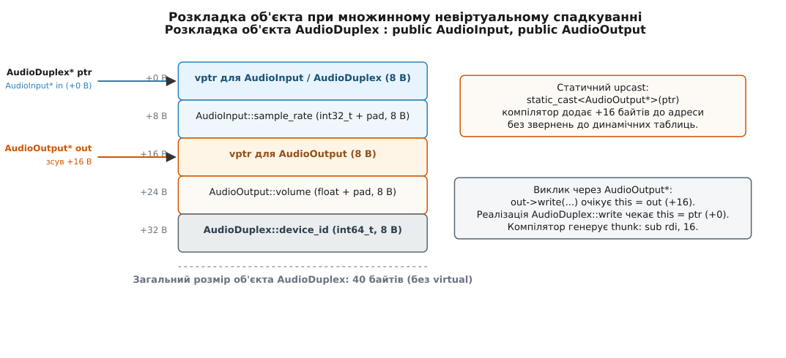
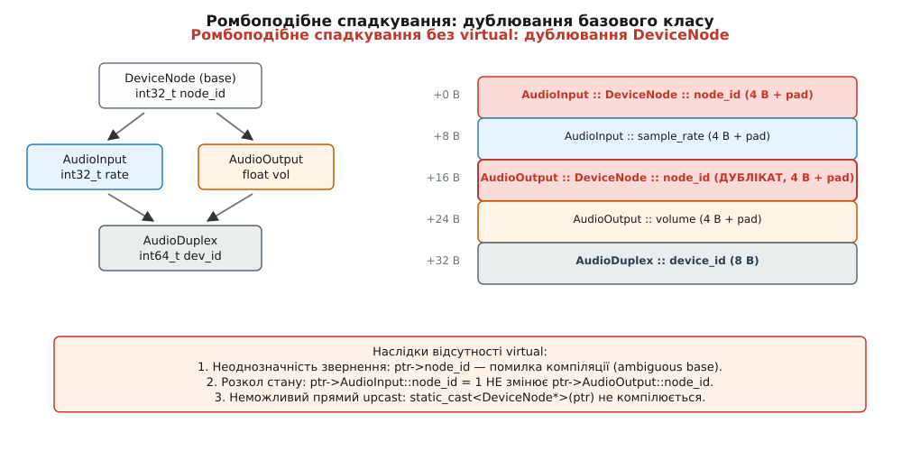
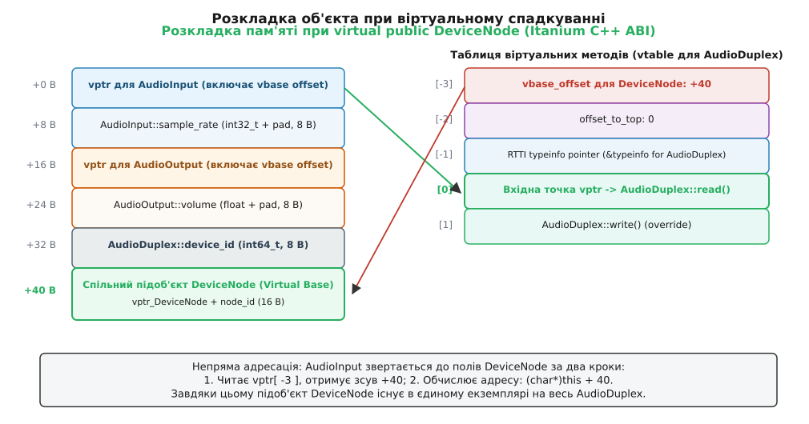
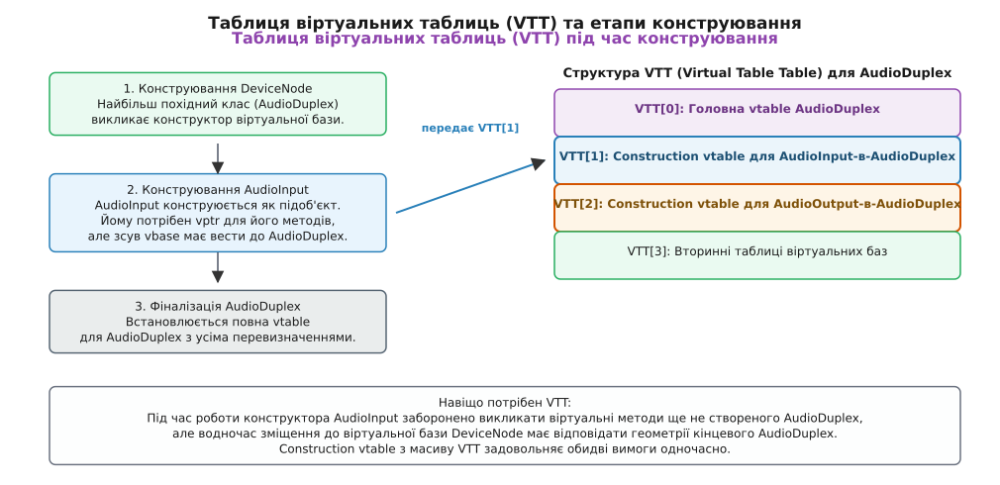

# Множинне й віртуальне спадкування: розкладка підобʼєктів

<preknowlist>
- [Спадкування](root:sf-lang/inheritance) — похідний клас містить у собі підоб'єкт базового як частину себе.
- [Таблиця віртуальних методів C++](root:sf-devices/virtual-dispatch-cpp) — у поліморфному об'єкті лежить прихований вказівник на таблицю функцій його типу.
- [Оператори приведення](root:sys-plang-cpp/cast-operators) — `static_cast`, `reinterpret_cast`, `const_cast`: правила перерахунку адрес та гарантії типів.
- [RTTI: typeid і dynamic_cast](root:sys-plang-cpp/rtti-and-dynamic-cast) — як об'єкт знаходить свій повний тип і виконує бічні переходи між гілками.
- [Оптимізація порожньої бази й [[no_unique_address]]](root:sys-plang-cpp/empty-base-optimization) — правила розміщення підоб'єктів без власного стану за нульовим зміщенням.
- [Життєвий цикл об'єктів і тривалість зберігання](root:sys-plang-cpp/object-lifetime) — порядок конструювання та руйнування підоб'єктів від баз до нащадків.
</preknowlist>

Двоспрямований аудіо-пристрій `AudioDuplexDevice` у мультимедійному рушії повинен одночасно читати вхідні семпли через інтерфейс `AudioInput` та відправляти оброблений звук через інтерфейс `AudioOutput`. Обидва класи мають власні внутрішні буфери, лічильники кадрів та набір віртуальних методів керування потоком.

Коли компілятор створює екземпляр такого класу, виникає фундаментальне геометричне завдання: як розташувати підоб'єкти двох незалежних батьківських типів усередині єдиного нерозривного блоку оперативної пам'яті? Якщо передати вказівник на `AudioDuplexDevice` у функцію, яка очікує `AudioOutput*`, адреса вказівника фізично не може залишатися незмінною, оскільки поля `AudioOutput` не можуть займати ті самі байти, що й поля `AudioInput`.

На відміну від одиночного спадкування, де адреса нащадка та адреса його предка завжди збігаються, множинне спадкування перетворює роботу з вказівниками на безперервну арифметику адресних зміщень. Якщо ж обидва проміжні класи додатково походять від спільного предка `DeviceNode`, виникає класична проблема ромбоподібного спадкування, яка вимагає принципово іншого механізму динамічної адресації — віртуальних баз.

## Множинне невіртуальне спадкування: склеювання підоб'єктів

При одиночному спадкуванні розкладка об'єкта в пам'яті тривіальна: поля похідного класу просто дописуються після полів базового класу. Поліморфний нащадок повторно використовує вказівник на віртуальну таблицю (`vptr`) своєї єдиної бази.

У випадку множинного невіртуального спадкування клас оголошує кілька прямих предків:

```cpp
struct AudioInput {
    virtual ~AudioInput() = default;
    virtual void read_samples();
    int32_t sample_rate{48000};
};

struct AudioOutput {
    virtual ~AudioOutput() = default;
    virtual void write_samples();
    float volume{1.0f};
};

struct AudioDuplexDevice : public AudioInput, public AudioOutput {
    void read_samples() override;
    void write_samples() override;
    int64_t device_id{42};
};
```

Компілятор не може об'єднати поля `AudioInput` та `AudioOutput` в одну структуру без збереження їхньої внутрішньої цілісності. Кожен із цих типів повинен залишатися повноцінним, автономним об'єктом, здатним працювати через звичайний вказівник свого типу.

Тому компілятор послідовно «склеює» підоб'єкти в пам'яті один за одним за порядком їхнього оголошення в списку спадкування:

1. **Первинна база (Primary Base):** перший поліморфний базовий клас (`AudioInput`) розміщується за нульовим зсувом (`+0` байтів) від початку об'єкта `AudioDuplexDevice`. Його віртуальна таблиця розширюється новими віртуальними методами похідного класу, а його `vptr` стає спільним `vptr` для всього об'єкта.
2. **Вторинна база (Secondary Base):** другий базовий клас (`AudioOutput`) розміщується слідом, за зміщенням, що дорівнює невіртуальному розміру першої бази з урахуванням вирівнювання (на 64-бітній платформі це зазвичай `+16` байтів). Цей підоб'єкт містить **власний окремий `vptr`**, налаштований на спеціальну вторинну віртуальну таблицю.
3. **Власні поля нащадка:** поля `AudioDuplexDevice` (поле `device_id`) розміщуються після всіх базових підоб'єктів (за зсувом `+32` байти).



*Об'єкт із двома базами містить два незалежні vptr. Первинна база лежить за зсувом 0, а вторинна — зі зміщенням +16 байтів, що вимагає коригування вказівника при приведенні типів.*

Повний розмір такого об'єкта становить суму розмірів усіх його базових підоб'єктів, власних полів та байтів вирівнювання. На 64-бітній системі `sizeof(AudioDuplexDevice)` складе 40 байтів:
- `0..7`: `vptr` для `AudioInput` та `AudioDuplexDevice`.
- `8..11`: поле `sample_rate` + 4 байти tail padding для вирівнювання до 8 байтів.
- `16..23`: `vptr` для вторинної бази `AudioOutput`.
- `24..27`: поле `volume` + 4 байти tail padding.
- `32..39`: поле `device_id`.

## Зсув покажчика this (Pointer Adjustment)

Головний наслідок наявності кількох базових підоб'єктів полягає в тому, що **один і той самий об'єкт має різні числові адреси залежно від типу вказівника, через який до нього звертаються**.

Розглянемо створення екземпляра та приведення типів:

```cpp
auto* duplex = new AudioDuplexDevice();
AudioInput*  in_ptr  = duplex; // Upcast до першої бази
AudioOutput* out_ptr = duplex; // Upcast до другої бази
```

Значення адрес у пам'яті будуть різними:
- Вказівник `duplex` має адресу, наприклад, `0x1000`.
- Вказівник `in_ptr` має адресу `0x1000` (зсув `+0` байтів), оскільки `AudioInput` є первинною базою.
- Вказівник `out_ptr` отримує адресу `0x1010` (`0x1000 + 16` байтів).

Компілятор виконує це перетворення повністю статично. Під час висхідного приведення (upcast) `out_ptr = duplex` компілятор додає до адреси константу `16`. Під час зворотного низхідного приведення (downcast) через `static_cast<AudioDuplexDevice*>(out_ptr)` компілятор віднімає `16` від адреси.

```
Арифметика вказівників при множинному спадкуванні:
  AudioDuplexDevice* ──[ +0 B ]─────────────────► 0x1000 (початок об'єкта, AudioInput)
  AudioOutput*       ──[ static_cast: +16 B ]───► 0x1010 (підоб'єкт AudioOutput)
  AudioDuplexDevice* ◄──[ static_cast: -16 B ]─── 0x1010 (повернення до повного типу)
```

Звідси випливає критична небезпека оператора `reinterpret_cast`:
```cpp
auto* bad_out = reinterpret_cast<AudioOutput*>(duplex);
bad_out->write_samples(); // НЕВИЗНАЧЕНА ПОВЕДІНКА!
```
`reinterpret_cast` копіює біти адреси без змін (`0x1000`). Метод `AudioOutput::write_samples()` отримає вказівник `this`, який вказує на початок `AudioInput`. Робота з полями призведе до читання чужих даних (наприклад, поле `volume` буде читати байти поля `sample_rate`), руйнуючи пам'ять програми.

### Коригування нульового вказівника (nullptr adjustment)

Крайовий випадок арифметики покажчиків — це приведення `nullptr`. Якщо просто додати `16` до нульової адреси, вийде адреса `0x00000010`, яка не є нульовою, але вказує на захищену область пам'яті.

Тому стандарт C++ вимагає, щоб компілятор генерував приховану умовну перевірку при будь-якому приведенні покажчиків із ненульовим зміщенням:

```cpp
AudioOutput* safe_cast(AudioDuplexDevice* ptr) {
    // Згенерований компілятором код:
    return (ptr != nullptr) ? reinterpret_cast<AudioOutput*>(reinterpret_cast<char*>(ptr) + 16) : nullptr;
}
```

Якщо вхідний покажчик дорівнює нулю, перетворення завжди повертає `nullptr` без виконання арифметики.

## Коригувальні перехідники (Thunks)

Що відбувається, коли віртуальний метод викликається через вказівник на вторинну базу?

```cpp
AudioOutput* out = duplex;
out->write_samples();
```

1. Метод `write_samples()` перевизначено в класі `AudioDuplexDevice`.
2. Реалізація `AudioDuplexDevice::write_samples()` розраховує на те, що неявний аргумент `this` вказує на початок повного об'єкта `AudioDuplexDevice` (адреса `0x1000`).
3. Проте той, хто викликає метод через `out`, передає в регістр першого аргументу адресу `0x1010` (адресу підоб'єкта `AudioOutput`).

Якби вторинна віртуальна таблиця містила пряму адресу `AudioDuplexDevice::write_samples`, функція отримала б неправильний `this`, зміщений на 16 байтів уперед, і будь-яке звернення до власних полів `device_id` читало б пам'ять за межами об'єкта.

Для розв'язання цієї колізії компілятор генерує **коригувальний перехідник** (англ. *thunk* або *adjustor thunk*). Це мікроскопічний фрагмент машинного коду, який змінює значення регістра `this` перед передачею керування в основне тіло методу.

На архітектурі x86-64 вторинна віртуальна таблиця для `AudioOutput` містить адресу thunk-функції:

```asm
# Thunk для AudioDuplexDevice::write_samples() при виклику через AudioOutput*
_ZThn16_N17AudioDuplexDevice13write_samplesEv:
    subq    $16, %rdi                  # Віднімаємо 16 від регістра this (%rdi)
    jmp     _ZN17AudioDuplexDevice13write_samplesEv  # Безумовний стрибок до реалізації
```

Такий підхід забезпечує нульові накладні витрати для первинної бази (яка викликає функцію напряму) і додає рівно одну інструкцію `subq` та один стрибок `jmp` для вторинних баз, не вимагаючи створення нового кадру стека.

Детальний аналіз та історію розвитку цих механізмів можна знайти у вставці про [історію виникнення множинного та віртуального спадкування](root:sys-plang-cpp/multiple-and-virtual-inheritance/hist-multiple-inheritance.md).

## Коваріантні типи повернення та подвійне коригування

Особливий випадок виникає, коли перевизначений віртуальний метод змінює тип повернення на більш спеціалізований — так звані **коваріантні типи повернення** (англ. *covariant return types*).

Розглянемо фабричний метод створення копії об'єкта (`clone`):

```cpp
struct ChannelSource {
    virtual ChannelSource* clone() const = 0;
    virtual ~ChannelSource() = default;
};

struct ChannelSink {
    virtual ChannelSink* clone() const = 0;
    virtual ~ChannelSink() = default;
};

struct DuplexChannel : public ChannelSource, public ChannelSink {
    // Одне перевизначення повертає точний тип DuplexChannel*
    DuplexChannel* clone() const override {
        return new DuplexChannel(*this);
    }
};
```

Коли клієнт викликає `sink->clone()` через інтерфейс `ChannelSink*`, виникає подвійний конфлікт зміщень:
1. **Коригування вхідного `this`:** покажчик `sink` зміщений на `+16` байтів відносно початку `DuplexChannel`. Компілятор повинен відняти 16, щоб передати коректний `this` у `DuplexChannel::clone()`.
2. **Коригування значення, що повертається:** метод `DuplexChannel::clone()` повертає адресу `DuplexChannel*` (зсув `0`). Проте клієнт очікує отримати вказівник типу `ChannelSink*` (зсув `+16`).

Для розв'язання цього завдання компілятор генерує **коваріантний перехідник повернення** (англ. *covariant return thunk*):

```asm
# Коваріантний перехідник для виклику clone() через ChannelSink*
_ZTch0_h16_NK13DuplexChannel5cloneEv:
    call    _ZNK13DuplexChannel5cloneEv  # Викликаємо основний метод clone()
    testq   %rax, %rax                  # Перевіряємо, чи повернутий покажчик не є nullptr
    je      .Ldone
    addq    $16, %rax                   # Додаємо +16 байтів до поверненої адреси (%rax)
.Ldone:
    ret                                 # Повертаємо скоригований покажчик ChannelSink*
```

Таким чином, мова C++ підтримує сувору типобезпеку поліморфних повернень, автоматично вставляючи необхідні зміщення у машинний код без участі програміста.

## Бічний перехід (side-cast) через dynamic_cast

У множинному спадкуванні нерідко виникає потреба перейти від однієї базової гілки до сусідньої — наприклад, маючи вказівник `AudioInput*`, отримати `AudioOutput*`, знаючи, що реальним динамічним об'єктом є `AudioDuplexDevice`.

Оператор `static_cast` тут безсилий: класи `AudioInput` та `AudioOutput` не пов'язані відношенням батько-нащадок, і компілятор не знає їхнього взаємного розташування. Спроба написати `static_cast<AudioOutput*>(in_ptr)` викличе помилку компіляції.

Для виконання бічного переходу використовується `dynamic_cast`:

```cpp
AudioOutput* out_ptr = dynamic_cast<AudioOutput*>(in_ptr);
```

### Покроковий механізм роботи бічного переходу в рантаймі:
1. За допомогою `vptr` вхідного об'єкта `in_ptr` середовище виконання зчитує поле `offset-to-top` (знаходиться за від'ємним зсувом `vtable[-2]`).
2. Оскільки `AudioInput` є первинною базою, `offset-to-top` дорівнює `0`. Середовище виконання отримує точну адресу найбільш похідного об'єкта `AudioDuplexDevice`.
3. За вказівником `vtable[-1]` система зчитує глобальний дескриптор `std::type_info` повного об'єкта `AudioDuplexDevice`.
4. Дескриптор RTTI містить повний граф базових класів із зазначенням їхніх статичних зміщень. Середовище виконання знаходить у графі тип `AudioOutput` зі зміщенням `+16` байтів.
5. Функція `__dynamic_cast` додає `16` до адреси повного об'єкта і повертає валідний вказівник `AudioOutput*`.

Якщо об'єкт насправді не був екземпляром `AudioDuplexDevice` (а, наприклад, був чистим `AudioInput`), `dynamic_cast` безпечно повертає `nullptr`.

## Ромбоподібне спадкування (The Diamond Problem)

Проблема ромбоподібного спадкування виникає, коли два класи мають спільного предка, а третій клас успадковує їх обидва.

Розглянемо типову архітектурну структуру:

```cpp
struct DeviceNode {
    virtual ~DeviceNode() = default;
    int32_t node_id{1};
};

struct AudioInput : public DeviceNode {
    int32_t sample_rate{48000};
};

struct AudioOutput : public DeviceNode {
    float volume{1.0f};
};

struct AudioDuplexDevice : public AudioInput, public AudioOutput {
    int64_t device_id{100};
};
```

У цій схемі клас `DeviceNode` успадковується невіртуально. Оскільки компілятор розміщує кожен базовий клас як незалежний підоб'єкт, `AudioDuplexDevice` отримує **два абсолютно окремі екземпляри `DeviceNode`**:
- Перший екземпляр `DeviceNode` вкладений усередину підоб'єкта `AudioInput` (за зсувом `+0` байтів).
- Другий екземпляр `DeviceNode` вкладений усередину підоб'єкта `AudioOutput` (за зсувом `+16` байтів).



*Без віртуального спадкування об'єкт містить дві незалежні копії DeviceNode. Зміна node_id в одній гілці не впливає на іншу, а пряме звернення блокується компілятором через неоднозначність.*

Таке компонування призводить до двох серйозних дефектів:

### 1. Розкол стану (State Duplication)
Кожна гілка має власну незалежну копію поля `node_id`. Якщо код змінює ідентифікатор через інтерфейс `AudioInput`:
```cpp
duplex.AudioInput::node_id = 999;
```
значення `duplex.AudioOutput::node_id` залишається рівним `1`. Концепція єдиного вузла пристрою руйнується: об'єкт фізично містить два різних ідентифікатори.

### 2. Неоднозначність звернення (Ambiguity Error)
Пряме звернення до членів спільної бази викликає помилку компіляції:
```cpp
duplex.node_id = 5; // ПОМИЛКА: request for member 'node_id' is ambiguous
```
Компілятор не знає, до якої саме копії `DeviceNode` звертається програміст — лівої чи правої. Щоб зняти неоднозначність, розробник змушений явно вказувати шлях: `duplex.AudioInput::node_id`.

Спроба виконати неявне висхідне приведення до базового типу також блокується:
```cpp
DeviceNode* node = &duplex; // ПОМИЛКА: 'DeviceNode' is an ambiguous base of 'AudioDuplexDevice'
```
Компілятор не може вирішити, яку саме адресу присвоїти покажчику — `0x1000` (ліву копію) чи `0x1010` (праву копію).

## Віртуальне спадкування: спільний базовий підоб'єкт

Щоб гарантувати, що базовий клас буде існувати в єдиному екземплярі незалежно від кількості проміжних класів у графі спадкування, використовується **віртуальне спадкування** (англ. *virtual base class*):

```cpp
struct DeviceNode {
    virtual ~DeviceNode() = default;
    int32_t node_id{1};
};

// Обидва проміжні класи вказують virtual public
struct AudioInput : virtual public DeviceNode {
    int32_t sample_rate{48000};
};

struct AudioOutput : virtual public DeviceNode {
    float volume{1.0f};
};

struct AudioDuplexDevice : public AudioInput, public AudioOutput {
    int64_t device_id{100};
};
```

Ключове слово `virtual` у списку спадкування змінює фундаментальний контракт: клас заявляє, що його предок `DeviceNode` є спільною сутністю, яка повинна бути розділена з усіма іншими класами ієрархії.

### Геометричний парадокс віртуального спадкування

При невіртуальному спадкуванні компілятор завжди знає точне статичне зміщення базового класу відносно нащадка під час компіляції. Наприклад, усередині методів `AudioInput` поле `node_id` завжди лежить за зміщенням `+8` байтів від `this`.

При віртуальному спадкуванні ця гарантія повністю зникає:
- Якщо створюється окремий самостійний екземпляр `AudioInput`, його віртуальна база `DeviceNode` лежить одразу за його полями (наприклад, за зсувом `+16`).
- Якщо створюється екземпляр `AudioDuplexDevice`, спільна база `DeviceNode` не може одночасно лежати всередині `AudioInput` і всередині `AudioOutput`. Вона виноситься в самий кінець об'єкта `AudioDuplexDevice` (наприклад, за зсувом `+40`).
- Якщо згодом з'явиться клас `SuperDuplex : public AudioDuplexDevice, public NetworkSync`, база `DeviceNode` переміститься ще далі — за зсувом `+72`.

Внаслідок цього код усередині методів `AudioInput` **більше не знає статичного зміщення до `DeviceNode` під час компіляції**. Зсув залежить від того, екземпляр якого найбільш похідного класу конструюється під час виконання програми.



*При віртуальному спадкуванні спільна база DeviceNode виноситься в кінець об'єкта. Доступ до її полів зсередини AudioInput здійснюється через vbase_offset у віртуальній таблиці.*

## Непряма адресація: vbase_offset та vbtbl

Для знаходження спільного підоб'єкта віртуальної бази під час виконання компілятори використовують таблиці зміщень.

### 1. Модель Itanium C++ ABI (GCC, Clang)
В Itanium C++ ABI компілятор не додає до об'єкта нових спеціальних покажчиків. Замість цього використовуються **від'ємні зміщення у віртуальній таблиці (`vtable`)**.

Перед точкою входу у віртуальну таблицю (перед `offset-to-top` та дескриптором `RTTI`) компілятор резервує слоти під **зсуви віртуальних баз** (`vbase_offset`):
- `vtable[-1]`: вказівник на `std::type_info`.
- `vtable[-2]`: `offset-to-top` (зсув до початку об'єкта `AudioDuplexDevice`).
- `vtable[-3]`: `vbase_offset` (зміщення в байтах від поточного підоб'єкта до спільного `DeviceNode`, наприклад `+40`).

Коли метод `AudioInput::read_samples()` звертається до поля `node_id`, процесор виконує непряму адресацію за три кроки:
```asm
movq    (%rdi), %rax        # 1. Завантажуємо vptr з об'єкта (%rax = *this)
movq    -24(%rax), %rax     # 2. Читаємо vbase_offset з vtable[-3]
movl    8(%rdi,%rax), %eax  # 3. Читаємо поле node_id за адресою (%rdi + vbase_offset + 8)
```

### 2. Модель Microsoft Visual C++ (MSVC ABI)
Компілятор MSVC реалізує віртуальні бази через окремий механізм:
- У кожен підоб'єкт додається спеціальний прихований покажчик — `vbptr` (Virtual Base Table Pointer).
- Цей покажчик веде до окремої таблиці **`vbtbl` (Virtual Base Table)**, яка містить масив цілих чисел зі зміщеннями до кожної віртуальної бази.

Точні двійкові структури обох моделей описані у [довіднику правил Itanium C++ ABI та MSVC](root:sys-plang-cpp/multiple-and-virtual-inheritance/api-abi-layout-rules.md).

## Правило домінування у віртуальному спадкуванні (Dominance Rule)

У ромбоподібних ієрархіях віртуальне спадкування запроваджує спеціальне семантичне правило розв'язання конфліктів віртуальних методів — **правило домінування** (англ. *dominance rule*).

Розглянемо випадок, коли спільний віртуальний предок оголошує метод, а лише одна з проміжних гілок його перевизначає:

```cpp
struct DeviceNode {
    virtual void reset() {
        std::cout << "DeviceNode::reset\n";
    }
    virtual ~DeviceNode() = default;
};

struct AudioInput : virtual public DeviceNode {
    void reset() override {
        std::cout << "AudioInput::reset\n";
    }
};

struct AudioOutput : virtual public DeviceNode {
    // Метод reset() НЕ перевизначено в AudioOutput
};

struct AudioDuplexDevice : public AudioInput, public AudioOutput {
    // reset() не перевизначено явно в AudioDuplexDevice
};
```

Здавалося б, звернення `duplex.reset()` мало б викликати неоднозначність, оскільки метод доступний через дві різні гілки (`AudioInput` та `AudioOutput`).

Проте за правилом домінування:
1. Перевизначення `AudioInput::reset` походить від класу `AudioInput`, який є прямим нащадком `DeviceNode`.
2. Базова реалізація `DeviceNode::reset` оголошена у `DeviceNode`, який є предком для `AudioInput`.
3. Оскільки `AudioInput` знаходиться в ієрархії нижче за `DeviceNode`, реалізація `AudioInput::reset` **домінує** (англ. *dominates*) над версією `DeviceNode::reset`.

Тому виклик `duplex.reset()` успішно й однозначно скомпілюється і викличе `AudioInput::reset`.

Якщо ж обидві гілки (`AudioInput` і `AudioOutput`) одночасно перевизначать метод `reset()`, жодна з них не домінуватиме над іншою. У такому разі виникне помилка компіляції неоднозначності, і клас `AudioDuplexDevice` буде зобов'язаний надати власне явне перевизначення методу `reset()`.

## Конструювання та таблиця віртуальних таблиць (VTT)

Під час створення поліморфного об'єкта виникає складна дилема конструювання:
1. За стандартом C++, коли працює конструктор `AudioInput`, віртуальні виклики повинні викликати методи `AudioInput`, а не `AudioDuplexDevice` (оскільки поля `AudioDuplexDevice` ще не створені).
2. Але водночас будь-яке звернення до віртуальної бази `DeviceNode` з конструктора `AudioInput` має використовувати геометричне зміщення кінцевого класу `AudioDuplexDevice` (зсув `+40`, а не `+16`).

Звичайна віртуальна таблиця `AudioInput` не підходить (вона розрахована на автономний об'єкт із зсувом `+16`). Фінальна віртуальна таблиця `AudioDuplexDevice` також не підходить (вона спрямує віртуальні виклики у методи ще не сконструйованого нащадка).

Для розв'язання цієї суперечності Itanium ABI генерує **Construction Virtual Tables** (проміжні таблиці конструювання), а адреси цих таблиць передаються в конструктори через спеціальний масив — **VTT (Virtual Table Table)**.



*Під час створення проміжного підоб'єкта конструктор отримує адресу Construction vtable з масиву VTT. Це дозволяє безпечно диспетчеризувати віртуальні виклики та одночасно знаходити віртуальну базу за правильною кінцевою адресою.*

Конструктор `AudioInput` компілюється у двох варіантах:
1. `AudioInput(AudioInput* this)` — для створення автономного екземпляра.
2. `AudioInput(AudioInput* this, const void* const* vtt)` — для створення підоб'єкта всередині нащадка. Конструктор отримує адресу `VTT` і встановлює в об'єкт тимчасовий `vptr`, налаштований на Construction vtable.

## Порядок ініціалізації: правило Most Derived Class

У звичайному одиночному та множинному спадкуванні кожен клас відповідає за ініціалізацію своїх прямих предків. Проте для віртуальних баз це правило змінюється:

> **Залізне правило C++:** Усі віртуальні базові класи ініціалізуються **безпосередньо найбільш похідним класом (Most Derived Class)**, екземпляр якого створюється.

Якщо створюється екземпляр `AudioDuplexDevice`, саме його конструктор зобов'язаний явно викликати конструктор `DeviceNode`:

```cpp
struct AudioDuplexDevice : public AudioInput, public AudioOutput {
    // Явний виклик конструктора віртуальної бази DeviceNode
    AudioDuplexDevice(int id, int rate, float vol)
        : DeviceNode(id), AudioInput(rate), AudioOutput(vol) {}
};
```

Якщо конструктор `AudioDuplexDevice` не викличе `DeviceNode(...)` явно, компілятор викличе конструктор за замовчуванням `DeviceNode()`. Виклики конструктора `DeviceNode`, зазначені у списках ініціалізації проміжних класів `AudioInput` та `AudioOutput`, **повністю ігноруються**.

### Порядок виконання конструкторів:
1. **Віртуальні бази:** спочатку конструюються всі віртуальні базові класи графа успадкування в порядку їхнього першого обходу зліва направо вглиб (depth-first left-to-right).
2. **Невіртуальні прямі бази:** конструюються прямі невіртуальні базові класи в порядку їхнього оголошення в заголовку нащадка (`AudioInput`, потім `AudioOutput`).
3. **Нестатичні члени:** конструюються поля самого класу `AudioDuplexDevice`.
4. **Тіло конструктора:** виконується код у фігурних дужках конструктора `AudioDuplexDevice`.

Деструктори викликаються у **строго зворотному порядку**: спочатку тіло нащадка, потім його поля, потім прямі невіртуальні бази, і на самомуприкінці деструктор найбільш похідного класу викликає деструктори віртуальних баз.

## Підводні камені копіювання та зрізання об'єктів (Object Slicing)

Віртуальне спадкування суттєво ускладнює роботу з операціями копіювання та переміщення.

Якщо клас із віртуальними базами не використовує згенеровані компілятором оператори копіювання, а визначає власний `operator=`, виникає небезпека багаторазового присвоєння спільного стану:

```cpp
struct DeviceNode {
    int32_t node_id;
    DeviceNode& operator=(const DeviceNode& other) {
        std::cout << "Copying DeviceNode\n";
        node_id = other.node_id;
        return *this;
    }
};

struct AudioInput : virtual public DeviceNode {
    int32_t sample_rate;
    AudioInput& operator=(const AudioInput& other) {
        DeviceNode::operator=(other); // Присвоєння віртуальної бази
        sample_rate = other.sample_rate;
        return *this;
    }
};

struct AudioOutput : virtual public DeviceNode {
    float volume;
    AudioOutput& operator=(const AudioOutput& other) {
        DeviceNode::operator=(other); // Ще одне присвоєння тієї самої віртуальної бази!
        volume = other.volume;
        return *this;
    }
};

struct AudioDuplexDevice : public AudioInput, public AudioOutput {
    AudioDuplexDevice& operator=(const AudioDuplexDevice& other) {
        AudioInput::operator=(other);  // Викличе DeviceNode::operator= перший раз
        AudioOutput::operator=(other); // Викличе DeviceNode::operator= ДРУГИЙ раз!
        return *this;
    }
};
```

У цьому коді оператор присвоєння `DeviceNode::operator=` буде виконано двічі. Якщо базовий клас володіє динамічними ресурсами (наприклад, файловими дескрипторами чи виділеною пам'яттю), подвійне копіювання може призвести до витоків або пошкодження стану.

**Як писати коректне копіювання з віртуальними базами:**
- У проміжних класах виносити присвоєння власних полів у захищені допоміжні методи (`assign_members`), які не чіпають віртуальну базу.
- У найбільш похідному класі самостійно викликати присвоєння віртуальної бази рівно один раз, після чого викликати `assign_members` для кожної проміжної гілки.

## Оптимізація порожньої бази (EBO) та [[no_unique_address]]

При проектуванні шаблонних бібліотек класи часто успадковують допоміжні структури-маркери без полів стану (наприклад, `std::allocator`, теги стратегій або mixin-інтерфейси).

За стандартом C++ будь-який самостійний об'єкт повинен мати розмір не менше 1 байта, щоб гарантувати унікальність його адреси в пам'яті. Проте при множинному спадкуванні вмикається **оптимізація порожньої бази** (англ. *Empty Base Optimization*, EBO):

```cpp
struct AllocatorPolicy {}; // sizeof = 1
struct ThreadingPolicy {}; // sizeof = 1

struct AudioBuffer : public AllocatorPolicy, public ThreadingPolicy {
    int32_t* data;
    size_t size;
};
```

Завдяки EBO компілятор розміщує обидві порожні бази за нульовим зміщенням (`offset 0`), суміщаючи їхні адреси з початком поля `data`. Розмір `AudioBuffer` залишається рівним 16 байтам на 64-бітній платформі, не витрачаючи жодного зайвого байта на порожні класи.

Починаючи з C++20, атрибут `[[no_unique_address]]` дозволяє досягти аналогічного ефекту для полів-членів класу, усуваючи необхідність вдаватися до множинного спадкування лише заради оптимізації порожніх структур.

## Покажчики на члени даних та методи (Pointers-to-Members)

Розкладка пам'яті безпосередньо впливає на двійкове представлення покажчиків на члени класу (`Member Pointers`):

```cpp
int32_t AudioDuplexDevice::*member_ptr = &AudioInput::sample_rate;
void (AudioDuplexDevice::*method_ptr)() = &AudioOutput::write_samples;
```

Для невіртуальних баз `member_ptr` є простим цілочисельним зміщенням у байтах від початку об'єкта. Проте для членів віртуальної бази `int32_t AudioDuplexDevice::*vmember_ptr = &DeviceNode::node_id` статичного зміщення не існує.

Тому на платформах із підтримкою повної моделі спадкування (зокрема в MSVC ABI) розмір покажчика на член класу збільшується з 8 до 24 байтів і містить:
1. Адресу або зміщення поля.
2. Зміщення вказівника на таблицю віртуальних баз `vbptr`.
3. Індекс відповідної віртуальної бази у таблиці `vbtbl`.

В Itanium C++ ABI покажчик на віртуальний метод завжди має фіксований розмір 16 байтів (`ptr` і `adj`), де `adj` зберігає значення зміщення `this`, що застосовується перед викликом.

## Практичний зразок: архітектура потоків std::basic_iostream

Найвідомішим прикладом правильного застосування віртуального спадкування в інженерній практиці є стандартна бібліотека потоків C++ (IOStreams).

Ієрархія класів потоків введення-виведення побудована за схемою віртуального ромба:

```
Ієрархія стандартних потоків C++:
                std::ios_base (базовий стан прапорців)
                      ▲
                      │
               std::basic_ios<CharT> (стан буфера потоку)
                 ▲                ▲
     virtual     │                │     virtual
   public Base   │                │   public Base
                 │                │
    std::basic_istream<CharT>   std::basic_ostream<CharT>
                 ▲                ▲
                 │                │
                 └───────┬────────┘
                         │
             std::basic_iostream<CharT>
```

### Чому basic_ios успадковується віртуально?
1. **Єдиний стан форматування:** потік `iostream` має ділити між операціями читання та запису єдиний набір прапорців стану (`good()`, `eof()`, `fail()`, `bad()`).
2. **Єдиний буфер потоку (`rdbuf`):** потік читання `istream` і потік запису `ostream` повинні взаємодіяти з одним і тим самим спільним об'єктом буфера `std::basic_streambuf`.
3. **Порядок створення:** коли створюється `std::stringstream` або `std::fstream`, найбільш похідний клас першим ініціалізує спільну базу `basic_ios`, гарантуючи, що буфер і стан будуть готові до того, як почнуть працювати конструктори `istream` та `ostream`.

Якби `basic_ios` успадковувався невіртуально, `iostream` отримав би два різних буфери та два різні прапорці помилок, що унеможливило б узгоджену роботу двоспрямованого потоку.

## Оптимізація та девіртуалізація компілятором

Хоча віртуальне спадкування вводить непряму адресацію через `vbase_offset`, сучасні компілятори оптимізують доступ у випадках, коли динамічний тип об'єкта відомий статично.

### 1. Локальні змінні та статичний аналіз
Якщо об'єкт створюється як локальна змінна на стеку або як глобальний об'єкт:
```cpp
AudioDuplexDevice local_dev;
local_dev.read_samples();
local_dev.node_id = 42;
```
Компілятор точно знає, що динамічним типом є `AudioDuplexDevice`. Оптимізатор виконує **девіртуалізацію зміщень** (англ. *offset devirtualization*): він ігнорує таблицю `vbase_offset` і генерує прямий машинний доступ із фіксованим зміщенням `movl $42, 48(%rsp)`.

### 2. Класи з позначкою final
Якщо клас оголошено з ключовим словом `final`:
```cpp
struct FinalDuplex final : public AudioInput, public AudioOutput {};
```
Компілятор гарантує, що від `FinalDuplex` не може бути створено нових нащадків. Геометрична розкладка віртуальної бази стає фіксованою назавжди, що дозволяє оптимізатору замінити всі непрямі звернення до бази всередині методів `FinalDuplex` на прямі зміщення.

### 3. Вплив на міжмодульну оптимізацію (LTO)
Якщо поліморфний об'єкт передається через посилання на проміжну базу `AudioInput& in` у сторонню функцію, компілятор у загальному випадку не може знати найбільш похідний тип. Тут оптимізація можлива лише за наявності повної міжмодульної оптимізації (англ. *Link-Time Optimization*, LTO), коли лінкувальник бачить усі одиниці трансляції програми й може довести, що єдиним нащадком `AudioInput` у системі є `AudioDuplexDevice`.

Практичні експерименти з порядком конструювання та діагностикою розкладки зібрані у [практичному інспекторі двійкової розкладки та зсувів вказівників](root:sys-plang-cpp/multiple-and-virtual-inheritance/proj-layout-inspector.md).

## Ціна множинного та віртуального спадкування

Принцип нульових накладних витрат у C++ гарантує: ви платите лише за те, що реально використовуєте. Проте використання множинного та особливо віртуального спадкування несе відчутні накладні витрати.

### 1. Накладні витрати пам'яті
- **Збільшення розміру об'єкта:** кожен невіртуальний поліморфний предок вимагає власного `vptr` (по 8 байтів на кожну вторинну базу). У MSVC додаються покажчики `vbptr`.
- **Розриви вирівнювання (padding):** множинні підоб'єкти вимагають вирівнювання за межами машинних слів, що створює невикористані байти між полями.
- **Розмір коду та метаданих:** генерація масивів `VTT`, Construction vtables, thunk-функцій та розширених дескрипторів RTTI суттєво збільшує розмір сегментів `.rodata` та `.text` у виконуваному файлі.

### 2. Накладні витрати процесорного часу
- **Непряма адресація полів:** кожне звернення до полів віртуальної бази вимагає завантаження `vptr`, читання `vbase_offset` з від'ємного індексу та адресної суми (3 інструкції замість 1).
- **Втрата кеш-локальності:** якщо віртуальна таблиця витіснена з кешу L1, непряме читання `vbase_offset` спричиняє затримку доступу до оперативної пам'яті.
- **Неможливість статичного downcast:** стандарт C++ прямо **забороняє** використання `static_cast` для приведення вказівника від віртуальної бази до її нащадка:
  ```cpp
  DeviceNode* vbase = duplex;
  auto* d = static_cast<AudioDuplexDevice*>(vbase); // ПОМИЛКА КОМПІЛЯЦІЇ!
  auto* dyn_d = dynamic_cast<AudioDuplexDevice*>(vbase); // Обов'язково dynamic_cast
  ```
  Приведення можливе виключно через `dynamic_cast`, який вимагає повного обходу графа типів у рантаймі через функцію `__dynamic_cast`.

> 🔧 **Навіщо це.**
> У реальній системній розробці слід дотримуватися чітких архітектурних правил:
> 1. **Множинне спадкування інтерфейсів — безпечне та ефективне:** якщо базові класи є чисто абстрактними (не містять полів даних і складаються виключно з чистих віртуальних методів), проблема ромба стану зникає. Розкладка об'єкта залишається компактною, а компілятор генерує тривіальні thunks.
> 2. **Віртуальне спадкування — лише там, де спільний стан неминучий:** класичний приклад — архітектура `std::basic_iostream`, де `istream` і `ostream` ділять спільний стан буфера `std::basic_ios`. В інших випадках замість віртуального спадкування стану слід надавати перевагу **композиції** (вбудовування об'єкта як члена) або шаблонним концептам C++20.
> 3. **Уникайте глибоких ромбів:** ромбоподібні ієрархії глибиною більше двох рівнів із полями даних створюють експоненційне зростання таблиць VTT і роблять супровід коду вкрай складним.
> 4. **Статичний поліморфізм замість динамічного:** у високонавантажених підсистемах (GameDev, HFT, DSP-обробка аудіо) множинне поліморфне спадкування часто замінюють на CRTP (Curiously Recurring Template Pattern) або концептуальні інтерфейси C++20 (`concepts`). Це повністю виключає віртуальні таблиці, зміщення `this` та таблиці `VTT` з двійкового коду, переносячи всі перевірки на етап компіляції.
