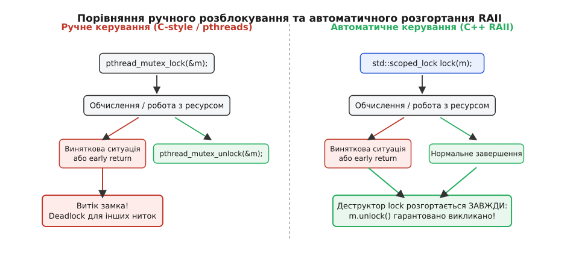
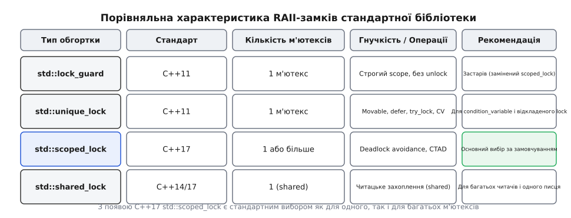
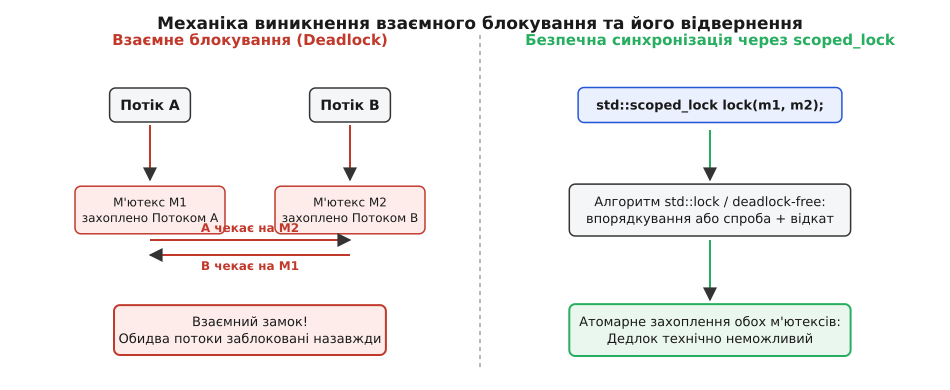

# М'ютекс і RAII-замки

<preknowlist>
- [Коректність за const](root:sys-plang-cpp/const-correctness) — чому `mutable std::mutex` потрібен для зчитування в `const`-методах.
- [Гарантії безпеки винятків](root:sys-plang-cpp/exception-safety-guarantees) — збереження інваріантів під час розгортання стеку.
- [Правило п'яти й правило нуля](root:sys-plang-cpp/rule-of-five-zero) — некопійовність `std::mutex` і розробка класів зі спільним станом.
</preknowlist>

Коли дві або більше ниток у програмі паралельно модифікують один і той самий масив, лічильник чи зв'язаний список у пам'яті, результати стають передбачуваними лише до першого перемикання процесорного контексту. Якщо потік A зчитує лічильник зі значенням `10`, щоб збільшити його на одиницю, а в цей самий мікросекундний момент потік B записує туди значення `20`, один із записів буде мовчно втрачено.

У мовній моделі пам'яті C++ така ситуація називається гонитвою даних (англ. *Data Race*) і призводить до невизначеної поведінки (Undefined Behavior — UB). Компілятор та процесор більше не зобов'язані гарантувати цілісність даних, оптимізувальні трансформації руйнують послідовність виконання, а програма може видати довільне сміття в оперативній пам'яті або впасти з помилкою сегментації.

Для захисту спільних ресурсів від гонитви даних використовується взаємне виключення (англ. *mutual exclusion*) — механізм, який гарантує, що в будь-який момент часу лише одна нитка виконання має право знаходитися всередині критичної секції коду.

---

## 1. Анатомія гонитви даних та небезпека сирих системних замків

На найнижчому рівні операційної системи взаємне виключення забезпечується об'єктом **м'ютекса** (англ. *mutex*, скорочення від *mutual exclusion* — взаємне виключення). М'ютекс працює як прихований двопозиційний прапор із двома основними операціями: захопити (англ. *lock*) та відпустити (англ. *unlock*).

Якщо потік A викликає `lock()`, а м'ютекс вільно відкритий, потік A стає його власником і продовжує виконання. Якщо після цього потік B викликає `lock()` на тому самому м'ютексі, операційна система призупиняє потік B і ставить його в чергу очікування. Потік B відновлює роботу лише тоді, коли потік A завершить роботу з ресурсом і викличе `unlock()`.

У мові C та традиційних системних API (POSIX Threads) операції з м'ютексами реалізовані через сирі функції `pthread_mutex_lock()` і `pthread_mutex_unlock()`. Погляньмо, як це виглядає на практиці:

:::tabs
```c
#include <pthread.h>
#include <stdio.h>
#include <stdlib.h>

typedef struct {
    int balance;
    pthread_mutex_t lock;
} BankAccount;

void deposit(BankAccount* account, int amount) {
    pthread_mutex_lock(&account->lock);
    
    if (amount <= 0) {
        // Помилка! Раннє повернення без звільнення м'ютекса
        return; 
    }
    
    account->balance += amount;
    
    pthread_mutex_unlock(&account->lock);
}
```
```cpp
#include <mutex>
#include <stdexcept>

struct BankAccount {
    int balance = 0;
    std::mutex mtx;

    void deposit_naive(int amount) {
        mtx.lock();

        if (amount <= 0) {
            // Забутий unlock перед генерацією винятку або поверненням
            throw std::invalid_argument("Сума повинна бути додатною");
        }

        balance += amount;

        mtx.unlock(); // До цього рядка код може ніколи не дійти!
    }
};
```
:::

У наведеному привабливо простому коді заховано фундаментальну небезпеку: **витік замка** (англ. *lock leak*). Якщо функція завершує роботу достроково через оператор `return`, або якщо всередині критичної секції генерується виняток (у C++), виклик `unlock()` оминається.

М'ютекс залишається назавжди заблокованим в операційній системі. Будь-який інший потік, який спробує викликати `deposit()` пізніше, буде заблокований назавжди. Програма зависає у стані взаємного блокування.

Детальніше про те, як розробники обчислювальних систем вирішували проблему небезпечних сирих замків протягом останніх сорока років, описує [історія виникнення взаємного виключення](root:sys-plang-cpp/mutex-and-raii-locks/hist-mutex-origins.md).

---

## 2. Принцип RAII у синхронізації: Автоматичне розгортання та гарантії

У мові C++ вирішення проблеми витоку ресурсів базується на ідіомі **RAII** (Resource Acquisition Is Initialization — отримання ресурсу є ініціалізацією). Суть RAII полягає в прив'язці тривалості життя ресурсу (у даному разі — прапора захоплення м'ютекса) до часу життя локального об'єкта на стеку.

Принцип роботи RAII-обгортки замка залежить від автоматичних викликів конструкторів і деструкторів:
1. **У конструкторі** локального об'єкта-замка приймається посилання на м'ютекс і викликається метод `lock()`.
2. **У деструкторі** цього об'єкта автоматично викликається метод `unlock()`.

Оскільки в мові C++ деструктори локальних об'єктів викликаються **завжди** при виході з області видимості (scope) — незалежно від того, чи відбувся вихід через звичайний `return`, `break`, `continue` або внаслідок розгортання стеку під час виклику винятку (англ. *stack unwinding*), — витік замка стає технічно неможливим.


*Порівняння шляхів виконання програми при ручному керуванні м'ютексом та при використанні RAII-обгортки.*

Завдяки RAII код стає строго стійким до винятків ([гарантії безпеки винятків](root:sys-plang-cpp/exception-safety-guarantees)): навіть якщо всередині критичної секції станеться збій пам'яті чи кидок винятку, стек розгорнеться, деструктор замка відпрацює і м'ютекс гарантовано повернеться у вільний стан.

### Модель пам'яті та ефекти впорядкування (Happens-Before)
Захоплення та звільнення м'ютекса дають не лише взаємне виключення, а й суворі гарантії **видимості змін у пам'яті** між нитками (Memory Barriers):
- Успішний виклик `unlock()` працює як семантика **Release**: усі записи в пам'ять, здійснені ниткою-власником до `unlock()`, примусово скидаються в кеш-ієрархію та стають видимими для інших ниток.
- Наступний успішний виклик `lock()` на тому самому м'ютексі працює як семантика **Acquire**: усі закешовані значення у регістрах та L1-кеші викликальної нитки інвалідуються, змушуючи її прочитати найсвіжіші дані з пам'яті.

Отже, між операцією `unlock()` у нитці A та операцією `lock()` у нитці B встановлюється формальне співвідношення **Happens-Before** (передування у часі). Без цих бар'єрів процесор або комбінатор мали б право поміняти місцями записи всередині критичної секції з викликом розблокування.

---

## 3. Еволюція RAII-замків у C++: `std::lock_guard`, `std::unique_lock`, `std::scoped_lock`

Починаючи з C++11, стандартна бібліотека надає кілька типів RAII-обгорток, кожна з яких призначена для свого сценарію використання.


*Зведена таблиця характеристик та сфер застосування стандартних RAII-замків.*

### 1. `std::lock_guard` (C++11) — Легкий та простий scope-замок
`std::lock_guard` — найпростіша обгортка. Вона приймає м'ютекс у конструкторі, одразу його блокує й утримує до руйнування самого `lock_guard`.

```cpp
void safe_deposit(BankAccount& account, int amount) {
    // Конструктор lock_guard викликає account.mtx.lock()
    std::lock_guard<std::mutex> lock(account.mtx);

    if (amount <= 0) {
        throw std::invalid_argument("Сума повинна бути додатною");
    } // При викиді винятку деструктор lock викликає account.mtx.unlock()

    account.balance += amount;
} // При виході з функції деструктор lock автоматично викликає account.mtx.unlock()
```

`std::lock_guard` є некопійованим і непереміщуваним об'єктом. У нього відсутні методи `unlock()` або `lock()` для ручного керування — він повністю підпорядкований точній області видимості (scope), у якій оголошений. Це дає нульові накладні витрати (Zero-overhead abstraction): скомпільований машиний код `lock_guard` ідентичний двом прямим викликам `lock()` та `unlock()`.

### 2. `std::unique_lock` (C++11) — Гнучке управління та відкладене захоплення
`std::lock_guard` має один недолік: він надто жорсткий. Якщо м'ютекс потрібно тимчасово розблокувати посеред функції, або якщо замок потрібно передати з однієї функції в іншу (повернути за значенням), `lock_guard` цього зробити не дозволяє.

Для таких задач створено `std::unique_lock`. Він підтримує повну семантику переміщення (Movable-only) та надає багатий інтерфейс керування:

```cpp
#include <mutex>
#include <chrono>

void complex_processing(std::mutex& mtx) {
    // 1. Відкладене захоплення: м'ютекс запам'ятовано, але lock() ще НЕ викликано
    std::unique_lock<std::mutex> lock(mtx, std::defer_lock);

    // Виконання довгої підготовки БЕЗ захоплення замка
    do_heavy_setup();

    // 2. Явне захоплення замка у потрібний момент
    lock.lock();

    // Робота з критичною секцією
    modify_shared_resource();

    // 3. Дострокове тимчасове розблокування для звільнення ниток-конкурентів
    lock.unlock();

    do_unrelated_work();

    // 4. Спроба повторного захоплення з таймаутом
    if (lock.try_lock_for(std::chrono::milliseconds(100))) {
        // Успішно захоплено знову
    }
} // Деструктор unique_lock перевіряє, чи захоплено м'ютекс, і якщо так — викликає unlock()
```

Накладні витрати `std::unique_lock` трохи вищі за `lock_guard`: він зберігає всередині булевий прапорець (`owns_lock`), щоб у деструкторі знати, чи потрібно насправді викликати `unlock()`.

Крім того, `std::unique_lock` є **обов'язковим** для роботи зі змінними умов (`std::condition_variable`), які вимагають здатності атомарно відпускати м'ютекс під час переходу нитки в стан сну і знову захоплювати його при прокиданні.

### 3. `std::scoped_lock` (C++17) — Універсальний замок із захистом від дедлоків
У C++17 з'явився `std::scoped_lock`, який замінив `std::lock_guard` у більшості сучасних кодових баз. 

Головна перевага `std::scoped_lock` полягає в тому, що він є **варіативним шаблоном** (Variadic Template). Він здатний приймати не лише один, а й **кілька м'ютексів одночасно**, атомарно захоплюючи їх за допомогою алгоритму запобігання дедлокам (`std::lock`).

Крім того, завдяки механізму виведення аргументів шаблонів класів (CTAD — Class Template Argument Deduction) у C++17 більше не потрібно явно вказувати типи м'ютексів у кутових дужках:

```cpp
std::mutex m1;
std::mutex m2;

void safe_swap_data() {
    // C++17: Автоматичне виведення типів і бездедлокне захоплення двох м'ютексів!
    std::scoped_lock lock(m1, m2);

    // Обидва м'ютекси гарантовано захоплені без ризику взаємного блокування
    swap_subsystems(m1, m2);
} // Обидва м'ютекси гарантовано звільняються у зворотному порядку
```

Повний список методів, прапорців конструкторів (`std::adopt_lock`, `std::defer_lock`, `std::try_to_lock`) та сигнатур для всіх обгорткових типів містить [довідник інтерфейсу м'ютексів та замків](root:sys-plang-cpp/mutex-and-raii-locks/api-locks-reference.md).

---

## 4. Класи м'ютексів у C++: `std::mutex`, `std::recursive_mutex`, `std::timed_mutex`, `std::shared_mutex`

Стандартна бібліотека C++ пропонує кілька реалізацій м'ютексів, призначених для різних шаблонів доступу до даних.

### 1. `std::mutex` — Базовий системний замок
Основний ексклюзивний м'ютекс. Реалізований як найлегша обгортка над системними примітивами (наприклад, `futex` в ОС Linux або `SRWLock` в ОС Windows). 
- **Не є рекурсивним**: Спроба захопити один і той самий `std::mutex` двічі з однієї нитки викликає **невизначену поведінку (UB)** (часто призводить до вічного дедлоку само з собою).
- **Власність**: Звільнити м'ютекс через `unlock()` має право **тільки та нитка, яка його захопила**. Виклик `unlock()` з іншої нитки — **UB**.

### 2. `std::recursive_mutex` — Рекурсивний замок та його пастки
`std::recursive_mutex` дозволяє одній і тій самій нитці викликати `lock()` багаторазово поспіль без виникнення дедлоку. М'ютекс веде внутрішній лічильник глибини захоплення. Замок буде остаточно звільнений для інших ниток лише тоді, коли нитка-власник виконає відповідну кількість викликів `unlock()`.

```cpp
#include <mutex>

class DataStructure {
    std::recursive_mutex r_mtx_;
    int value_ = 0;

public:
    void set_value(int v) {
        std::lock_guard<std::recursive_mutex> lock(r_mtx_);
        value_ = v;
    }

    void update_and_log(int v) {
        std::lock_guard<std::recursive_mutex> lock(r_mtx_);
        set_value(v); // Повторне захоплення того самого рекурсивного м'ютекса в тій самій нитці!
    }
};
```

> 🔧 **Навіщо це і чому це вважається шкідливою звичкою.**
> Потреба в `std::recursive_mutex` майже завжди сигналізує про проблеми в архітектурі класу. Якщо публічний метод змушений викликати інший публічний метод того самого класу під замком, правильною архітектурною декомпозицією є виділення приватних внутрішніх методів-помічників (наприклад, `set_value_unlocked()`), які припускають, що м'ютекс вже захоплено зовні.
> 
> Крім того, `std::recursive_mutex` коштує дорожче за звичайний `std::mutex` через необхідність перевіряти ID нитки-власника та підтримувати лічильник при кожному захопленні, і він не працює зі `std::condition_variable_any` так само ефективно.

### 3. `std::shared_mutex` (C++17) — Шаблон «Багато читачів, один писець»
Більшість структур даних у реальних системах зчитуються значно частіше, ніж змінюються. Якщо 100 ниток лише зчитують дані з таблиці, їм немає потреби блокувати одна одну. Блокування потрібне лише тоді, коли хоча б одна нитка вирішує записати нові дані.

Для цього використовується `std::shared_mutex` та відповідна RAII-обгортка `std::shared_lock`:
- **Читачі (Shared access)**: Викликають `lock_shared()` або використовують `std::shared_lock<std::shared_mutex>`. Багато ниток можуть перебувати у критичній секції читання одночасно.
- **Писці (Exclusive access)**: Викликають `lock()` або використовують `std::scoped_lock<std::shared_mutex>`. Тільки одна нитка запису може перебувати у критичній секції, блокуючи всіх читачів і писців.

```cpp
#include <shared_mutex>
#include <string>
#include <unordered_map>

class PhoneBook {
    mutable std::shared_mutex rw_mtx_;
    std::unordered_map<std::string, std::string> contacts_;

public:
    // Багато ниток можуть читати телефонну книгу одночасно!
    std::string find_number(const std::string& name) const {
        std::shared_lock<std::shared_mutex> lock(rw_mtx_);
        auto it = contacts_.find(name);
        return (it != contacts_.end()) ? it->second : "";
    }

    // Тільки один писець має ексклюзивний доступ для додавання запису
    void add_contact(const std::string& name, const std::string& number) {
        std::scoped_lock lock(rw_mtx_); // Ексклюзивне захоплення
        contacts_[name] = number;
    }
};
```

> ⚠️ **Ціна `std::shared_mutex`.** 
> Не варто ставити `std::shared_mutex` всюди за замовчуванням. Спільне захоплення на читання все одно вимагає атомарної зміни лічильника читачів усередині м'ютекса. На коротких критичних секціях (у кілька наносекунд) постійне скидання кеш-ліній процесора при оновленні лічильника читачів може зробити `std::shared_mutex` **повільнішим** за звичайний ексклюзивний `std::mutex`.

---

## 5. Механіка дедлоків та стратегії їх уникнення

Взаємне блокування (**Deadlock**) виникає тоді, коли дві або більше ниток чекають на звільнення ресурсів, які утримуються одна одною, утворюючи замкнене коло очікування.


*Причина виникнення перехресного дедлоку (ліворуч) та його відвернення через атомарне захоплення (праворуч).*

Класична ситуація:
1. Потік 1 захоплює `Mutex A` і готується захопити `Mutex B`.
2. Потік 2 одночасно захоплює `Mutex B` і готується захопити `Mutex A`.
3. Потік 1 чекає на `Mutex B`, який утримується Потоком 2.
4. Потік 2 чекає на `Mutex A`, який утримується Потоком 1.

Виконання обох ниток зупиняється назавжди.

### Чотири умови Коффмана для виникнення дедлоку:
Взаємне блокування можливе лише тоді, коли виконуються одночасно всі 4 умови Едварда Коффмана (1971):
1. **Взаємне виключення**: Ресурс не може використовуватися кількома нитками одночасно.
2. **Утримання та очікування**: Нитка утримує один ресурс, чекаючи на інший.
3. **Відсутність примусового вилучення (No preemption)**: Ресурс не може бути примусово забрано у нитки до завершення її роботи.
4. **Кругове очікування**: Існує замкнений ланцюг ниток `T1 -> T2 -> ... -> Tn -> T1`.

Усунення хоча б однієї з цих умов робить дедлок неможливим.

### Стратегії запобігання дедлокам у C++:
1. **Глобальне впорядкування м'ютексів (Lock Ordering)**: Якщо у всій системі домовитися завжди захоплювати м'ютекси у строго визначеному порядку (наприклад, спочатку з меншою адресою в пам'яті, потім із більшою), кругове очікування стане математично неможливим.
2. **Використання `std::scoped_lock` (C++17)**: Замість послідовних викликів `lock()` використовуйте `std::scoped_lock lock(m1, m2);`. Всередині реалізовано спеціальний алгоритм запобігання дедлокам (Deadlock Avoidance Algorithm): він спробує захопити всі м'ютекси, а якщо один із них виявиться зайнятим — мовчки відпустить уже захоплені замки, поступаючись ресурсом, і спробує знову.

Детальний практичний розбір розв'язання дедлоків із замірами продуктивності наведений у матеріалі [проєкт запобігання дедлокам при переказі коштів](root:sys-plang-cpp/mutex-and-raii-locks/proj-bank-transfer.md).

---

## 6. Продуктивність, ціна синхронізації та проектування класів

Захоплення м'ютекса — це не безкоштовна операція. Розуміння того, із чого складається ціна синхронізації, дозволяє будувати високопродуктивні багатопотокові системи.

### Вартість захоплення `std::mutex` складається з двох шляхів:
1. **Швидкий шлях (Uncontended Fast Path)**: Якщо м'ютекс вільний і за нього немає суперництва між нитками, захоплення виконується в просторі користувача (User-Space) за допомогою однієї атомарної інструкції процесора (`LOCK CMPXCHG` на x86-64 або `LDREX/STREX` на ARM) із бар'єром пам'яті. Це коштує приблизно **10–25 наносекунд**.
2. **Повільний шлях (Contended Slow Path)**: Якщо м'ютекс виявляється зайнятим іншою ниткою, процесор не може чекати у нескінченному циклі (це б даремно спалювало електроенергію). Нитка робить системний виклик до ядра ОС (`sys_futex` у Linux або `WaitOnAddress` у Windows). Ядро ОС переводить нитку в стан сну та планує контекстне перемикання на іншу задачу. Це коштує **від 1 до 10 мікросекунд** (в 100–1000 разів дорожче за швидкий шлях!).

### `mutable std::mutex` у `const`-методах
У мові C++ метод класу, оголошений як `const`, обіцяє не змінювати логічний стан об'єкта. Однак захоплення м'ютекса усередині `const`-методу змінює внутрішній стан самого `std::mutex` (його атомарний прапор утримування).

Щоб мати можливість захоплювати м'ютекс у `const`-методах для безпечного читання даних, поле м'ютекса завжди оголошують із ключовим словом `mutable` ([коректність за const](root:sys-plang-cpp/const-correctness)):

```cpp
#include <mutex>
#include <string>

class ThreadSafeLogger {
    // mutable дозволяє змінювати стан mtx_ навіть усередині const-методів
    mutable std::mutex mtx_;
    std::string last_log_message_;

public:
    std::string get_last_message() const {
        std::lock_guard<std::mutex> lock(mtx_); // Зміна mutable поля mtx_ у const-методі!
        return last_log_message_;
    }
};
```

### Вплив м'ютекса на спеціальні функції класу
Тип `std::mutex` є некопійованим і непереміщуваним об'єктом. Як наслідок, якщо додати поле `std::mutex` до свого класу, компілятор мовчки **вилучить** неявний конструктор копіювання, оператор копіювального присвоєння та переміщувальні операції для всього класу.

Це означає, що клас зі спільним станом перестає бути простим тип-значенням (Value Type). Якщо для такого класу дійсно потрібні копіювання чи переміщення, їх доведеться реалізувати вручну з дотриманням [правила п'яти](root:sys-plang-cpp/rule-of-five-zero), обов'язково захоплюючи м'ютекс об'єкта-джерела під час створення копії.
