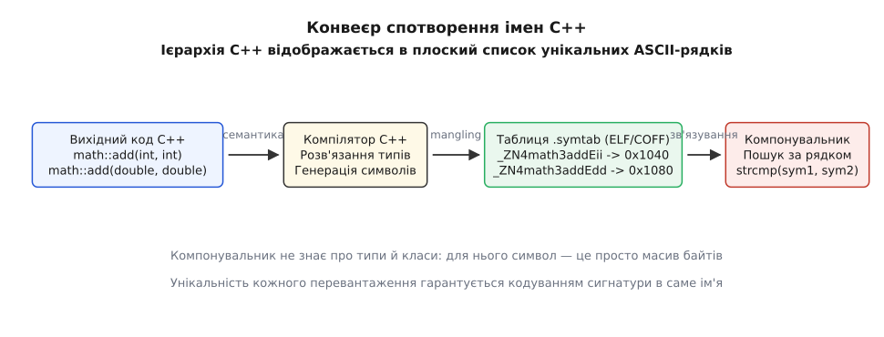
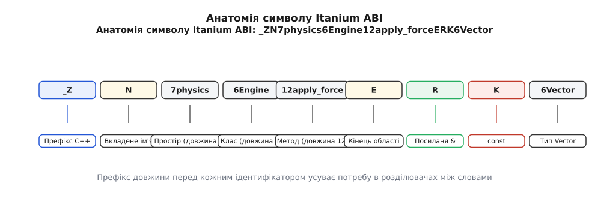
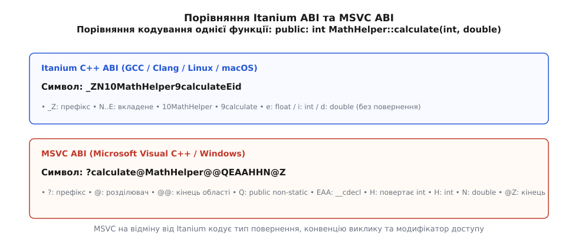
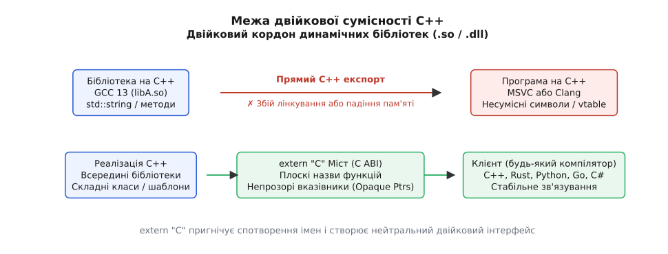

# Спотворення імен: як символ несе сигнатуру

<preknowlist>
- [Зв'язування та правило одного визначення (ODR)](root:sys-plang-cpp/odr-and-linkage) — як компілятор і компонувальник узгоджують символи між різними одиницями трансляції.
- [Розв'язання перевантажень](root:sys-plang-cpp/overload-resolution) — як семантичний аналізатор обирає одну функцію з багатьох однойменних за типами фактичних аргументів.
- [Простори імен і пошук Кеніга (ADL)](root:sys-plang-cpp/namespaces-and-adl) — як ієрархії назв і контексти типів ізолюють функції від колізій у вихідному коді.
- [Основи шаблонів](root:sys-plang-cpp/templates-basics) — як параметризація типами й константами породжує окремі сутності з одного опису.
- [Коректність за const](root:sys-plang-cpp/const-correctness) — чому константні та неконстантні методи одного класу мають принципово різний тип прихованого параметра this.
</preknowlist>

У вихідному коді на C++ оголошено дві функції з однаковим іменем, але різними типами аргументів:

```cpp
int calculate(int x);
double calculate(double x);
```

Для семантичного аналізатора компілятора це дві абсолютно різні сутності: вони мають окремі типи, окремі вузли в абстрактному синтаксичному дереві (AST) і викликаються за різними правилами [розв'язання перевантажень](root:sys-plang-cpp/overload-resolution). Проте компілятор не створює кінцеву виконувану програму самостійно. Він транслює окрему одиницю трансляції у двійковий об'єктний файл (формату ELF у Linux, COFF у Windows або Mach-O в macOS) і передає завдання остаточного зшивання системному компонувальнику (Linker).

Тут виникає фундаментальний історичний конфлікт між мовою високого рівня та низькорівневою інфраструктурою операційної системи. Формати об'єктних файлів та таблиці символів (`.symtab`, `.dynsym`) створювалися в 1970-х роках для мов Асемблер та C. У цій двійковій моделі символ — це звичайний плоский масив байтів ASCII, зіставлений із числовим зміщенням машинного коду в секції `.text`. Системний компонувальник не має жодного уявлення про типи даних, списки параметрів, класи, структури чи [простори імен](root:sys-plang-cpp/namespaces-and-adl). Алгоритм пошуку компонувальника — це звичайне порозрядне зіставлення рядків (`strcmp`).

Якби компілятор записав обидві функції в об'єктний файл під вихідним іменем `calculate`, таблиця символів отримала б два ідентичні записи. Компонувальник негайно зупинив би збирання з фатальною помилкою повторного визначення символу згідно з [правилом одного визначення (ODR)](root:sys-plang-cpp/odr-and-linkage).

Щоб подолати цю невідповідність між багатою системою типів C++ і пласкою моделлю компонувальника без заміни системних компонувальників усієї операційної системи, компілятор розв'язує проблему локально: він кодує всю семантичну інформацію (простори імен, ієрархію класів, типи параметрів, константність методів та параметри шаблонів) безпосередньо в текстовий рядок імені символу. Цей механізм називається спотворенням імен (англ. *name mangling* або *name decoration*).

## Чому компонувальник не знає про типи: конфлікт двох епох

Щоб зрозуміти неминучість спотворення імен, розглянемо фізичну структуру об'єктного файлу. Секція таблиці символів ELF містить масив структур `Elf64_Sym`. Кожен запис фіксує числове зміщення в рядковій таблиці `.strtab`, значення адреси `st_value`, розмір `st_size` та тип зв'язування `st_info`. У цій структурі немає жодного поля для збереження типів параметрів або кількості аргументів.



*Ієрархічні конструкції мови C++ (простори імен, перевантаження, шаблони) компілятор перетворює на плоскі унікальні рядки символів, які системний компонувальник зіставляє звичайним текстовим порівнянням.*

Компонувальник є мовно-нейтральним інструментом: він одночасно зшиває об'єктні файли, отримані з C++, C, Fortran, Rust та Асемблера. Його єдина функція — знайти для кожної невирішеної референції (Unresolved Reference) символ із точним збігом рядка імені у визначених символах інших об'єктних файлів чи бібліотек.

Математично задача компілятора зводиться до побудови **ін'єктивного відображення**:
```text
f: Повна сигнатура сутності C++ -> Унікальний ідентифікатор ASCII
```

Якщо дві різні сутності мови C++ отримають однаковий ідентифікатор (колізія), компонувальник або зшиє виклик не з тією функцією, або видасть помилку ODR. Якщо ж алгоритм спотворення змінюється хоча б на один байт між двома компіляторами, компонувальник не знайде функцію і повідомить про `undefined reference`. Детальніше про те, як ця система еволюціонувала від перших простих схем 1980-х років до єдиних сучасних стандартів, розповідає [історія еволюції спотворення імен](root:sys-plang-cpp/name-mangling/hist-mangling-evolution.md).

## Анатомія Itanium C++ ABI: стандарт відкритого світу

Сьогодні переважна більшість операційних систем (Linux, macOS, iOS, Android, FreeBSD, QNX) та компіляторів (GCC, Clang, Intel OneAPI) використовують відкриту специфікацію **Itanium C++ ABI**.

Усі спотворені символи за цим стандартом починаються з обов'язкового глобального префікса `_Z`. У мові C ідентифікатори, що починаються з підкреслення та великої літери, зарезервовані за системною реалізацією компілятора, тому такий префікс унеможливлює випадковий збіг із призначеними для користувача C-функціями.



*Анатомія символу Itanium ABI: символ розбивається на чіткі граматичні токени з числовими префіксами довжини та однолітерними кодами типів.*

### Кодування базових типів даних

Для примітивних типів Itanium ABI використовує компактну однолітерну систему кодування:

| Тип C++ | Код Itanium ABI | Приклад функції | Спотворений символ |
| :--- | :--- | :--- | :--- |
| `void` | `v` | `void reset()` | `_Z5resetv` |
| `bool` | `b` | `bool toggle(bool)` | `_Z6toggleb` |
| `char` | `c` | `void put(char)` | `_Z3putc` |
| `signed char` | `a` | `void put(signed char)` | `_Z3puta` |
| `unsigned char` | `h` | `void put(unsigned char)` | `_Z3puth` |
| `short` | `s` | `void set(short)` | `_Z3sets` |
| `unsigned short` | `t` | `void set(unsigned short)` | `_Z3sett` |
| `int` | `i` | `int add(int, int)` | `_Z3addii` |
| `unsigned int` | `j` | `void set(unsigned int)` | `_Z3setj` |
| `long` | `l` | `void set(long)` | `_Z3setl` |
| `unsigned long` | `m` | `void set(unsigned long)` | `_Z3setm` |
| `long long` | `x` | `void set(long long)` | `_Z3setx` |
| `unsigned long long` | `y` | `void set(unsigned long long)` | `_Z3sety` |
| `float` | `f` | `float sqrt_f(float)` | `_Z6sqrt_ff` |
| `double` | `d` | `double sqrt_d(double)` | `_Z6sqrt_dd` |

### Модифікатори типів: покажчики, посилання та кваліфікатори

Модифікатори типів ставляться як префікси перед відповідним типом аргументу:
- `P` — покажчик (`Pointer`): `int*` кодується як `Pi`.
- `R` — lvalue-посилання (`Reference`): `int&` кодується як `Ri`.
- `O` — rvalue-посилання: `int&&` кодується як `Oi`.
- `K` — кваліфікатор `const`: `const int*` кодується як `PKi` (покажчик на константний `int`), а `int* const` як `KPi` (константний покажчик на `int`).
- `V` — кваліфікатор `volatile`.

Розглянемо покрокове кодування складної сигнатури:
```text
void update(const int*& ptr, double&& factor);
```
1. Префікс функції: `_Z`
2. Ім'я функції з префіксом довжини: `6update`
3. Перший параметр (`const int*&`): посилання `R` на покажчик `P` на константу `K` типу `int` `i` -> `RPKi`
4. Другий параметр (`double&&`): rvalue-посилання `O` на `double` `d` -> `Od`
5. Кінцевий символ: `_Z6updateRPKiOd`

### Префікси довжини та вкладені області видимості (N...E)

Ключове інженерне рішення Itanium ABI — **префікс довжини перед кожним ідентифікатором**. Замість використання спеціальних символів-розділювачів (наприклад, крапок або двокрапок, які заборонені в багатьох системних асемблерах), компілятор записує десяткову кількість символів безпосередньо перед словом: `4math` або `12apply_forces`. Парсер точно знає, скільки байтів належить поточному слову, що виключає неоднозначність читання.

Коли функція або змінна знаходиться всередині простору імен або класу, використовується синтаксис вкладеного імені (Nested Name):
- `N` — початок складеного ідентифікатора;
- Послідовність компонентів із префіксами довжини;
- `E` — термінатор складеного ідентифікатора (End).

```cpp
namespace geometry {
    class Vector3D {
    public:
        void scale(double factor);
        double length() const;
        void normalize() &;
        Vector3D normalized() &&;
        explicit operator bool() const;
    };
}
```

Метод `geometry::Vector3D::scale(double)` кодується так:
- `_Z` — префікс C++;
- `N` — початок складеного імені;
- `8geometry` — простір імен довжиною 8 символів;
- `8Vector3D` — клас довжиною 8 символів;
- `5scale` — назва методу довжиною 5 символів;
- `E` — завершення складеного імені;
- `d` — тип параметра `double`.
Результат: `_ZN8geometry8Vector3D5scaleEd`.

Якщо метод оголошено з кваліфікатором `const` ([коректність за const](root:sys-plang-cpp/const-correctness)), кваліфікатор `K` ставиться **перед** назвою методу після літери `N`:
`geometry::Vector3D::length() const` кодується як `_ZNK8geometry8Vector3D6lengthEv`.

Якщо метод має посилальні кваліфікатори (Ref-qualifiers `&` або `&&`), вони кодуються суфіксами `R` або `O` після назви методу:
- `geometry::Vector3D::normalize() &` -> `_ZN8geometry8Vector3D9normalizeEvR`
- `geometry::Vector3D::normalized() &&` -> `_ZN8geometry8Vector3D10normalizedEvO`

### Оператори приведення типів (Conversion Operators)

Користувацькі оператори приведення типів (`operator T()`) мають особливий синтаксис кодування: оскільки вони не мають звичайного імені, використовується префікс `cv` (від *Conversion*), після якого слідує цільовий тип:
- Метод `Vector3D::operator bool() const` кодується як `_ZNK8geometry8Vector3DcvbEv` (`cv` + `b` для `bool`).
- Метод `Vector3D::operator double*()` кодується як `_ZN8geometry8Vector3DcvPdv` (`cv` + `Pd` для `double*`).

### Покажчики на функції-члени (Pointers to Members)

Коли функція приймає вказівник на метод класу (наприклад, у системах реєстрації зворотних викликів або слотів GUI), Itanium ABI використовує маркер покажчика на член `M`:
- `M` — початок типу покажчика на член класу;
- Тип класу-власника (наприклад, `8Worker`);
- Сигнатура функції або типу поля.

Функція `void set_callback(void (Worker::*handler)(int))` кодується як:
`_Z12set_callbackM6WorkerFviE`.

### Спеціальні імена: конструктори, деструктори та оператори

Конструктори та деструктори не мають звичайного текстового імені. Itanium ABI виділяє для них фіксовані дволітерні коди:
- `C1` — повний конструктор об'єкта (Complete Object Constructor);
- `C2` — базовий конструктор об'єкта (Base Object Constructor, без ініціалізації віртуальних базових класів);
- `D1` — повний деструктор об'єкта;
- `D2` — базовий деструктор об'єкта;
- `D0` — видаляючий деструктор (Deleting Destructor, викликає `operator delete` після знищення полів).

Перевантажені оператори мають власні короткі коди:
- `pl` — `operator+`
- `mi` — `operator-`
- `ml` — `operator*`
- `dv` — `operator/`
- `eq` — `operator==`
- `ix` — `operator[]`
- `cl` — `operator()`

Наприклад, метод `Vector3D::operator+(const Vector3D&)` у просторі `geometry` отримає ім'я `_ZN8geometry8Vector3DplERKS0_`.

### Чому тип повернення зазвичай не кодується?

У звичайних функціях тип повернення не входить до спотвореного імені. Причина в тому, що в мові C++ [розв'язання перевантажень](root:sys-plang-cpp/overload-resolution) виконується виключно за типами аргументів, а не за типом результату. Оголошення двох функцій із однаковими аргументами, але різними типами повернення (`int get()` та `double get()`), є помилкою компіляції.

Винятком є **шаблони функцій** та **оператори перетворення типів** (`operator T()`). У шаблонах тип повернення може залежати від параметрів шаблону і впливати на перевантаження (наприклад, через SFINAE або концепції), тому в шаблонних функціях тип повернення обов'язково кодується одразу після термінатора `E`.

## Кодування шаблонів та нетипових параметрів (NTTP)

Коли функція чи клас є інстанціацією шаблону ([основи шаблонів](root:sys-plang-cpp/templates-basics)), спотворене ім'я повинно нести повний список аргументів шаблону, оскільки кожна конкретна інстанціація породжує окрему двійкову сутність у машинному коді.

В Itanium ABI список аргументів шаблону обрамляється парою токенів:
- `I` — відкриття списку аргументів шаблону (Template Argument List);
- Послідовність закодованих типів або нетипових параметрів (Non-Type Template Parameters, NTTP);
- `E` — закриття списку аргументів шаблону.

### 1. Шаблони типів

Розглянемо функцію:
```cpp
template <typename T>
T process_data(T value);
```
Для інстанціації `process_data<int>(int)` компілятор генерує ім'я:
```text
_Z12process_dataIiET_S0_
```
- `_Z12process_data` — базове ім'я функції;
- `I` — початок аргументів шаблону;
- `i` — аргумент шаблону типу `int`;
- `E` — завершення аргументів шаблону;
- `T_` — тип повернення функції (посилання на перший параметр шаблону `T`);
- `S0_` — тип першого аргументу (підстановка типу `int`).

### 2. Нетипові параметри шаблонів (NTTP)

Якщо параметр шаблону є константою цілого числа або переліку (наприклад, розміром буфера у `std::array<double, 64>`), він кодується за допомогою маркера літерала `L`:
- `L` — початок літеральної константи;
- Код типу константи (наприклад, `i` для `int` або `m` для `unsigned long`);
- Значення константи в десятковому форматі (для від'ємних чисел перед значенням ставиться префікс `n`);
- `E` — завершення літеральної константи.

Символ для `Buffer<float, 256>::clear()` набуває вигляду:
`_ZN6BufferIfLi256EE5clearEv`.

### 3. Варіативні шаблони та згортання пакетів (Parameter Packs)

Для функцій зі змінною кількістю аргументів шаблону (Variadic Templates) використовується маркер розпакування пакета `Dp`:
```cpp
template <typename... Args>
void log_events(Args... args);
```
Інстанціація `log_events<int, double, const char*>` кодується як список аргументів шаблону `IidPKcE`, за яким слідують типи відповідних параметрів виклику `idPKc`.

## Стиснення символів (Substitutions): захист від експоненційного роздування

З появою узагальненого програмування та бібліотеки STL виникла загроза гігантського роздування імен. Якщо функція приймає аргумент типу:
```cpp
std::map<std::string, std::vector<std::string>>
```
Повне нестиснене ім'я цього типу з усіма просторами імен, параметрами шаблонів за замовчуванням та алокаторами містить сотні символів. Якщо такий тип зустрічається у функції тричі (у параметрах та поверненому значенні), спотворене ім'я досягало б кількох кілобайтів.

Щоб запобігти роздуванню об'єктних файлів, Itanium C++ ABI реалізує алгоритм компресії на основі динамічної таблиці підстановок (Substitutions).

Компілятор, скануючи сигнатуру зліва направо, записує кожен новий складений тип або простір імен у словник підстановок:
- Перша сутність у словнику отримує код `S_`;
- Друга сутність отримує код `S0_`;
- Третя — `S1_`;
- N-та — `S<N-2>_` (індексація використовує основу 36: цифри `0-9`, далі великі літери `A-Z`).

Крім того, найчастіші стандартні сутності отримали зарезервовані одно- та дволітерні скорочення:
- `St` — простір імен `::std` (еквівалент `3std`);
- `Sa` — стандартний алокатор `std::allocator`;
- `Sb` — `std::basic_string`;
- `Ss` — `std::string` (скорочення для `std::basic_string<char, std::char_traits<char>, std::allocator<char>>`);
- `Si` — `std::istream`;
- `So` — `std::ostream`;
- `Sd` — `std::iostream`.

### Покроковий приклад підстановки

Розглянемо функцію:
```cpp
void merge(const std::string& a, const std::string& b);
```
1. Префікс: `_Z5merge`
2. Перший аргумент (`const std::string&`):
   - Посилання `R`, константа `K`, тип `std::string` `Ss` -> `RKSs`
   - Компілятор додає тип `std::string` у словник підстановок під індексом 0 (`S_`).
3. Другий аргумент (`const std::string&`):
   - Посилання `R`, константа `K`, а замість повторного запису типу `std::string` вставляється маркер `S_` -> `RKS_`
4. Результуючий символ: `_Z5mergeRKSsRKS_`

Замість дублювання складного опису рядка компілятор використав 3 байти `S_`. У глибоких шаблонах це зменшує розмір об'єктних файлів у 5–10 разів.

## Віртуальні таблиці, RTTI та службові символи компілятора

Спотворення імен охоплює не лише функції, а й приховані структури даних, які компілятор створює для підтримки об'єктно-орієнтованого поліморфізму та обробки винятків:

1. **Таблиці віртуальних методів (`vtable`):** Для кожного класу з віртуальними функціями компілятор генерує глобальну таблицю покажчиків із префіксом `_ZTV` (Vtable Table). Символ таблиці для `geometry::Vector3D` має назву `_ZTVN8geometry8Vector3DE`.
2. **Таблиці віртуальних таблиць (`VTT`):** У разі складного віртуального успадкування генерується допоміжна таблиця `_ZTT` для ініціалізації базових підб'єктів.
3. **Дескриптори динамічної типізації (RTTI Typeinfo):** Для кожного типу, що використовується в `typeid` або `dynamic_cast`, компілятор створює структуру дескриптора з префіксом `_ZTI` (`_ZTIN8geometry8Vector3DE`) та нуль-термінований рядок його назви з префіксом `_ZTS` (Typeinfo String).
4. **Змінні захисту статичної ініціалізації (Guard Variables):** Для локальних статичних змінних усередині функцій (`static Logger instance;`) генерується атомарний прапорець ініціалізації з префіксом `_ZGV` (Guard Variable), який гарантує безпечну одноразову ініціалізацію в багатопотоковому середовищі.
5. **Статичні змінні-члени класів:** Змінні екземпляра класу (`this->x`) не породжують символів у таблиці, оскільки зміщення обчислюються під час компіляції. Натомість статичні поля (`static int total_instances;`) кодуються як повноцінні змінні зі структурою вкладеного імені: `_ZN8geometry8Vector3D15total_instancesE`.

## Анонімні простори імен, лямбда-вирази та локальні символи

Окремою проблемою для компонувальника є сутності, які мають діяти локально в межах однієї одиниці трансляції, але вимагають повного дотримання семантики мови C++:

### 1. Анонімні простори імен

Коли клас чи функцію оголошено всередині безіменного простору `namespace { ... }`, стандарт мови вимагає, щоб ці сутності мали внутрішнє зв'язування (Internal Linkage), тобто були недоступні з інших файлів. Проте, на відміну від C-специфікатора `static`, типи з анонімного простору можуть передаватися як аргументи шаблонів або брати участь у пошуку імен ADL.

Щоб запобігти колізіям між однаковими анонімними сутностями з різних `.cpp` файлів, компілятор генерує для кожного файлу штучний унікальний ідентифікатор простору імен:
- В Itanium ABI генерується синтетичний префікс `_GLOBAL__N_1` (або унікальний хеш шляху до файлу): `_ZN12_GLOBAL__N_110LocalClass7executeEv`.
- У результаті однакові класи `LocalClass` у двох різних одиницях трансляції отримують різні двійкові імена, усуваючи конфлікт при статичному зв'язуванні.

### 2. Лямбда-вирази та замикання (Closures)

Кожен лямбда-вираз породжує унікальний анонімний функціональний об'єкт (Closure Class) із власним перевантаженим `operator()`. Спотворене ім'я такого оператора включає контекст, у якому оголошено лямбду, та спеціальний маркер замикання:
- В Itanium ABI використовується маркер `Ul` (Unnamed Lambda) з числовим індексом: `_ZZ4mainENKUlvE_clEv` (метод `cl` безіменної лямбди `Ul`, оголошеної всередині функції `main`).
- Якщо лямбда захоплює змінні за посиланням або значенням, типи полів замикання автоматично впливають на її внутрішні методи.

### 3. Локальні статичні змінні у вбудованих функціях

Якщо `inline`-функція або метод шаблону містить локальну статичну змінну:
```cpp
inline int get_next_id() {
    static int counter = 0;
    return ++counter;
}
```
[Правило одного визначення (ODR)](root:sys-plang-cpp/odr-and-linkage) гарантує, що незалежно від кількості одиниць трансляції, які включили цей заголовок, у пам'яті програми існуватиме **рівно один спільний екземпляр змінної `counter`**.

Щоб компонувальник міг об'єднати дублікати локальної змінної з різних об'єктних файлів (за допомогою секцій `COMDAT` або `linkonce`), компілятор спотворює ім'я локальної статичної змінної, вшиваючи в нього повну сигнатуру функції-власника:
- `_ZZ11get_next_idvE7counter` — символ самої змінної `counter` всередині `get_next_id()`;
- `_ZGVZ11get_next_idvE7counter` — супутня атомарна змінна захисту ініціалізації (Guard Variable).

## Особливості компіляторів: Clang, GCC та емуляція MSVC (clang-cl)

Цікавою інженерною особливістю сучасного тулчейну Clang/LLVM є його здатність змінювати алгоритм спотворення імен залежно від цільової платформи:
- Під час складання під Linux (`clang++ -target x86_64-linux-gnu`) Clang генерує символи стандарту Itanium C++ ABI, що забезпечує 100% сумісність із GCC.
- Під час складання на Windows через драйвер `clang-cl` компілятор повністю перемикається на MSVC ABI. Інженери LLVM реалізували алгоритм манглінгу Microsoft до найменших деталей (включаючи відомі історичні баги MSVC), що дозволяє змішувати об'єктні файли `clang-cl` з бібліотеками, скомпільованими оригінальним `cl.exe`.
- На платформі Apple macOS компілятор Apple Clang використовує Itanium ABI, але додає обов'язковий провідний символ підкреслення `_` згідно з традиціями двійкового формату Mach-O (перетворюючи `_Z` на `__Z`).

## MSVC ABI: світ Windows і декорація імен Microsoft

В операційній системі Windows компілятор Microsoft Visual C++ (MSVC) використовує власну схему декорації імен для двійкового формату PE/COFF.

Схема MSVC побудована на інших фундаментальних принципах:
1. Спотворені імена починаються зі знака питання `?`.
2. Як розділювач між компонентами використовується символ `@`.
3. Подвійний символ `@@` позначає кінець списку просторів імен або класів.
4. Символ обов'язково кодує **тип повернення**, **рівень доступу** (`public`, `protected`, `private`) та **конвенцію виклику** (`__cdecl`, `__stdcall`, `__thiscall`, `__fastcall`).



*Порівняння кодування методу `public: int MathHelper::calculate(int, double)` між Itanium ABI та MSVC ABI.*

### Розбір анатомії символу MSVC

Розглянемо метод класу на 64-бітній платформі Windows:
```cpp
class MathHelper {
public:
    int calculate(int a, double b);
};
```
Скомпільований символ у MSVC має вигляд:
```text
?calculate@MathHelper@@QEAAHHN@Z
```

Розкладемо цей рядок на елементи:
- `?` — обов'язковий префікс C++ символу MSVC;
- `calculate` — назва методу;
- `@MathHelper` — клас, якому належить метод;
- `@@` — завершення списку областей видимості;
- `Q` — модифікатор доступу `public` для звичайного нестатичного методу;
- `E` — константність покажчика `this` (у цьому випадку звичайний неконстантний метод);
- `AA` — конвенція виклику `__cdecl` на архітектурі x64;
- `H` — тип повернення функції (`int`);
- `H` — перший аргумент типу `int`;
- `N` — другий аргумент типу `double`;
- `@Z` — термінатор списку параметрів.

### Чому MSVC кодує тип повернення та конвенцію виклику?

У той час як розробники Itanium ABI намагалися зробити символ мінімально необхідним для розрізнення перевантажень, інженери Microsoft переслідували іншу мету: **раннє виявлення помилок узгодження сигнатур під час компонування**.

Якщо в одному заголовковому файлі функцію було оголошено як `int get()`, а в іншій одиниці трансляції помилково як `double get()`, компілятор Itanium ABI згенерує однаковий символ `_Z3getv`, і програма скомпонується, що призведе до невизначеної поведінки під час читання регістрів повернення (`RAX` проти `XMM0`). Компілятор MSVC згенерує різні символи (`?get@@YAHXZ` та `?get@@YANXZ`), і компонувальник Windows миттєво зупинить збирання з помилкою `unresolved external symbol`.

Аналогічно, кодування конвенції виклику захищає 32-бітний код від катастрофічного пошкодження стеку при змішуванні `__cdecl` (де стек очищає викликач) та `__stdcall` (де стек очищає викликана функція).

## Зворотний шлях: деманґлінг у налагодженні та середовищі виконання

Хоча спотворені імена ідеально підходять для машинної обробки компонувальником, для людини вони нечитабельні. Коли програма зазнає аварійного завершення (Crash Dump), профілюється інструментами аналізу продуктивності або викидає необроблений виняток, системні утиліти повинні перетворити сирі символи назад у вихідний вигляд. Цей зворотний процес називається **деманґлінгом** (Demangling або Undecoration).

### Консольні утиліти

У терміналі системний деманґлінг виконується штатними інструментами розробника:
- **`c++filt`** (GNU Binutils) та **`llvm-cxxfilt`** (LLVM):
  ```bash
  # Розшифрувати окремий символ Itanium ABI:
  c++filt _ZN8geometry8Vector3D5scaleEd
  # Вивід: geometry::Vector3D::scale(double)

  # Перегляд таблиці символів динамічної бібліотеки:
  nm -D --defined-only libengine.so | c++filt
  ```
- **`undname.exe`** (Microsoft Visual Studio):
  ```cmd
  undname ?calculate@MathHelper@@QEAAHHN@Z
  :: Вивід: public: int __cdecl MathHelper::calculate(int,double)
  ```

### Програмні API середовища виконання

Під час роботи програми розробник може викликати деманґлер програмно:
1. **На системах POSIX / Itanium ABI:** Системна функція `abi::__cxa_demangle` із заголовка `<cxxabi.h>`.
2. **На платформі Windows:** Функція `UnDecorateSymbolName` із бібліотеки `DbgHelp.dll` (`<dbghelp.h>`).

Повний перелік параметрів, кодів повернення, правил керування пам'яттю та інваріантів потокобезпеки для обох функцій наведено в окремому [довіднику API деманґлінгу](root:sys-plang-cpp/name-mangling/api-demangle.md).

Практичний приклад побудови кросплатформного модуля захоплення стек-трейсів та деманґлінгу кадрів реалізовано у [практичному проєкті символьного деманґлера](root:sys-plang-cpp/name-mangling/proj-symbol-demangler.md).

## extern "C": придушення спотворення для сумісності з C

Ключове слово `extern "C"` — це механізм мови C++, який вказує компілятору використовувати **угоду про зв'язування мови C (C Linkage)** для оголошених сутностей.

```cpp
extern "C" {
    int add_numbers(int a, int b);
    void reset_system(void);
}
```

Головний фізичний наслідок `extern "C"` — **повне вимкнення спотворення імен**. Компілятор записує символ у таблицю об'єктного файлу в його прямому, незміненому вигляді: `add_numbers` замість `_Z11add_numbersii`.

### Що насправді змінює extern "C"

Існує поширена хибна думка, що `extern "C"` змушує компілятор компілювати код за правилами чистої мови C. Це не так:
1. `extern "C"` змінює виключно **спотворення імені** та **конвенцію виклику на рівні ABI**.
2. Усередині тіла функції діють **усі можливості C++**: можна створювати класи, використовувати шаблони, виділяти пам'ять через `new` та ловити винятки.

:::tabs
```c
/* Заголовок my_math.h, придатний для використання і в C, і в C++ */
#ifndef MY_MATH_H
#define MY_MATH_H

#ifdef __cplusplus
extern "C" {
#endif

int fast_multiply(int a, int b);

#ifdef __cplusplus
}
#endif

#endif
```
```cpp
/* Реалізація my_math.cpp на повноцінному C++ */
#include "my_math.h"
#include <vector>
#include <numeric>

extern "C" int fast_multiply(int a, int b) {
    // Усередині дозволені будь-які конструкції C++
    std::vector<int> factors = {a, b};
    return std::accumulate(factors.begin(), factors.end(), 1, [](int x, int y) {
        return x * y;
    });
}
```
:::

### Чому extern "C" забороняє перевантаження?

Прямим наслідком вимкнення спотворення імен є те, що **в межах одного простору імен заборонено перевантажувати функції з зв'язуванням `extern "C"`**:

```cpp
extern "C" void print_value(int x);
extern "C" void print_value(double x); // ✗ Помилка компіляції!
```

Оскільки обидві функції мали б бути експортовані під однаковим неспотвореним символом `print_value`, компонувальник не зміг би розрізнити їх у таблиці символів. Компілятор C++ виявляє цей конфлікт ще на етапі аналізу вихідного коду і видає помилку повторного оголошення символу зв'язування C.

## Крихкість двійкових інтерфейсів (ABI Fragility) та кордони бібліотек

Спотворення імен є лише зовнішнім фасадом загального двійкового інтерфейсу (ABI). Різниця в алгоритмах манглінгу унеможливлює пряме лінкування об'єктних файлів, скомпільованих різними компіляторами (наприклад, неможливо злінкувати `.obj` від MSVC із `.o` від GCC).

Проте значно серйозніша проблема виникає тоді, коли змінюється внутрішній ABI **одного й того самого компілятора**.



*Експорт сирих C++ типів через межу динамічної бібліотеки ламається при невідповідності ABI, тоді як extern "C" міст забезпечує повну двійкову ізоляцію.*

### Історичний перехід GCC 4 -> GCC 5 та подвійний ABI

Яскравим прикладом крихкості ABI стала зміна стандарту в компіляторі GCC версії 5.1 (2015 рік). У стандарті C++98 клас `std::string` у бібліотеці `libstdc++` використовував реалізацію з підрахунком посилань і копіюванням при записі (Copy-On-Write, COW). Стандарт C++11 заборонив COW-рядки (вимагаючи прямої гарантії часу життя ітераторів та швидкої оптимізації малих рядків, SSO) та зажадав, щоб метод `std::list::size()` працював за постійний час `O(1)`.

Щоб виконати вимоги C++11, розробники GCC змінили внутрішню структуру пам'яті `std::string` та `std::list`. Якби скомпільований код GCC 4 (COW) спробував передати об'єкт рядка у функцію, скомпільовану GCC 5 (SSO), програма зазнала б миттєвого збою пам'яті через несумісне розташування полів у структурі.

Щоб запобігти тихому пошкодженню пам'яті, розробники `libstdc++` використали спотворення імен як захисний бар'єр:
- Нова реалізація рядка була поміщена у вбудований простір імен (Inline Namespace) `std::__cxx11::basic_string`.
- Спотворене ім'я функції `process(const std::string&)` змінилося:
  - Старий GCC 4 ABI: `_Z7processRKSs`
  - Новий GCC 5 ABI: `_Z7processRKNSt7__cxx1112basic_stringIcSt11char_traitsIcESaIcEEE`

Завдяки цьому компонувальник миттєво відхиляв спробу змішування несумісних об'єктних файлів із повідомленням `undefined reference`, рятуючи систему від невизначеної поведінки під час виконання.

### C ABI як універсальний міст сумісності

Через те, що C++ не має стабільного міжкомпіляторного ABI, розповсюдження скомпільованих динамічних бібліотек (`.so` / `.dll`) із прямими C++ інтерфейсами є вкрай ризикованим: клієнт зобов'язаний використовувати ту саму версію компілятора, ті самі прапорці оптимізації та ту саму стандартну бібліотеку.

Тому загальноприйнятим стандартом індустрії для створення плагінів (наприклад, у графічних рушіях чи аудіо-плагінах VST) та інтерфейсів взаємодії з іншими мовами (FFI у Python, Rust, C#, Go) є **C ABI міст**:
1. Усі експортовані функції позначаються як `extern "C"`.
2. Замість складних класів C++ через межу бібліотеки передаються примітивні типи або непрозорі покажчики на структури (Opaque Handles).
3. Усі винятки C++ перехоплюються всередині реалізації й транслюються в цілочисельні коди помилок.

## C++20 Модулі та майбутнє спотворення імен

У стандарті C++20 з'явився механізм модулів (`module`, `export`), покликаний замінити архаїчну модель текстового включення заголовкових файлів `#include`.

Модулі ізолюють імена на рівні семантичного аналізу компілятора: неекспортовані функції з одного модуля невидимі в інших одиницях трансляції. Проте на рівні кінцевого лінкування об'єктні файли все одно повинні розрізняти однойменні функції з різних модулів.

Для підтримки модулів стандарт Itanium C++ ABI було розширено спеціальним префіксом модуля `W`:
- Якщо функція `process()` належить модулю `network`, її спотворене ім'я містить назву модуля: `_ZW7network7processv`.
- Це гарантує повну ізоляцію символів на рівні компонувальника без потреби в штучних анонімних просторах імен.

Спотворення імен залишається фундаментальним мостом, що зв'язує розвинену мову C++ із класичними системними форматами двійкового виконання.
