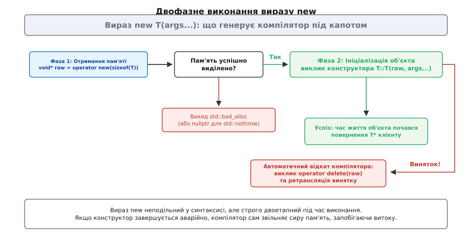
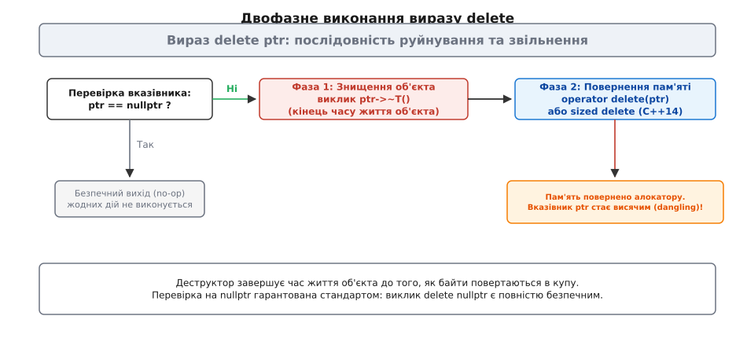
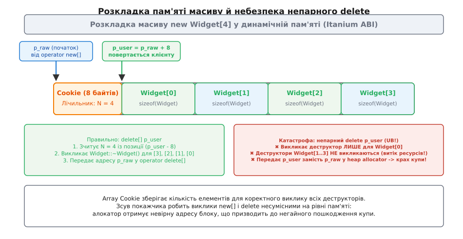
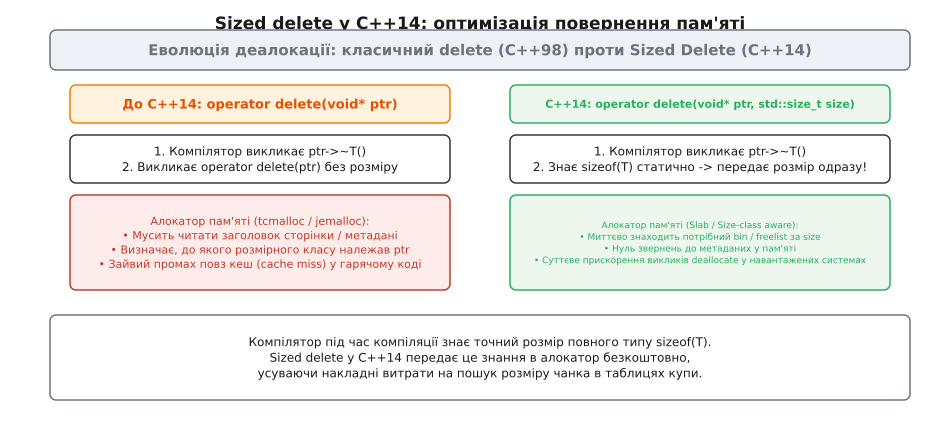
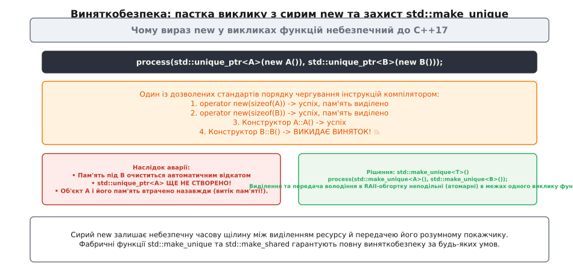

# new, delete й шляхи виділення пам'яті

<preknowlist>
- [Адреси й покажчики](root:sf-lang/addresses-pointers) — що таке адреса в пам'яті та чому числовий покажчик сам по собі не знає про життєвий цикл ресурсу.
- [Купа й динамічна пам'ять](root:sf-lang/heap-dynamic-memory) — сегмент адресної пам'яті, що виділяється та повертається за явним запитом програми під час виконання.
- [Конструктор і деструктор](root:sf-lang/constructors-destructors) — спеціальні функції-члени, які створюють інваріанти об'єкта та очищають зайняті ним ресурси.
- [Час життя об'єкта](root:sys-plang-cpp/object-lifetime) — відмінність між тривалістю зберігання сирих байтів і проміжком повноцінного життя типізованого об'єкта.
- [Семантика володіння](root:sys-plang-cpp/ownership-semantics) — правила призначення відповідальності за звільнення ресурсів.
- [Вирівнювання та placement new](root:sys-plang-cpp/alignment-placement-new) — вимоги процесора до кратних адрес даних і розміщення об'єктів у наперед виділеній пам'яті.
- [Механізм винятків](root:sys-plang-cpp/exceptions-mechanism) — розкрутка стека та поведінка програми при виникненні аварійних ситуацій.
</preknowlist>

Коли програма на мові C виділяє пам'ять під структуру через `malloc(sizeof(Node))`, вона отримує неініціалізований блок байтів. Якщо всередині структури є покажчик на інший ресурс, поле залишається заповненим випадковим сміттям, доки окремий виклик функції ініціалізації не запише туди валідну адресу. Якщо між виділенням байтів і викликом функції трапиться помилка чи аварійне повернення, утворюється напівстворений ресурс, спроба звільнення якого через `free()` призведе до аварійного завершення процесу або витоку пам'яті.

У C++ конструкція `new Node(args...)` виглядає як неподільна атомарна операція, але насправді вона об'єднує два принципово різні механізми: низькорівневе виділення нетипізованої пам'яті в купі та високорівневе конструювання об'єкта із запуском його інваріантів. Якщо під час роботи конструктора виникає виняток, середовище виконання мусить самостійно повернути щойно отримані байти системі, інакше кожен невдалий виклик створював би невиправний витік сирої пам'яті.

Розуміння того, де закінчується робота алокатора і починається час життя об'єкта, відділяє передбачувану системну архітектуру від прихованого розпаду пам'яті. Синтаксис `new` і `delete` керує не просто байтами в оперативній пам'яті, а складним ланцюгом взаємодії між компілятором, функціями розподілу, таблицями віртуальних методів і механізмом розкрутки стека.

## Двофазна природа виразу new

Ключова плутанина навколо динамічної пам'яті в C++ походить із того, що слово `new` позначає одночасно дві різні сутності: **вираз створення об'єкта** (англ. *new-expression*) та **функцію виділення пам'яті** (англ. *allocation function*, `operator new`).

Вираз `new` — це синтаксична конструкція мови. Ви не можете змінити її внутрішню логіку чи перевизначити її синтаксис. Коли компілятор зустрічає рядок `Widget* w = new Widget(42, "sensor");`, він транслює цей єдиний рядок у строго визначену послідовність низькорівневих кроків.


*Компілятор розділяє вираз new на запит сирих байтів і конструювання об'єкта, гарантуючи деалокацію при аварії.*

Ця послідовність складається з двох послідовних фаз:

1. **Фаза 1: Отримання сирої пам'яті.** Компілятор обчислює розмір типу `sizeof(Widget)` і викликає функцію виділення пам'яті `operator new(sizeof(Widget))`. Ця функція не знає нічого про типи, конструктори чи поля: вона працює як системний розподільник і повертає нетипізований покажчик `void*` на блок пам'яті потрібного розміру й вирівнювання. Якщо пам'яті немає, функція кидає виняток `std::bad_alloc`.
2. **Фаза 2: Ініціалізація та початок часу життя.** Якщо пам'ять успішно виділено, компілятор викликає конструктор `Widget::Widget(42, "sensor")`, передаючи отриману адресу як прихований покажчик `this`. Тільки після успішного завершення конструктора байти перетворюються на живий об'єкт, а типізований покажчик `Widget*` повертається у змінну `w`.

Головна перевага цієї схеми виявляється в момент аварії. Уявімо, що конструктор `Widget` виділяє мережевий сокет або відкриває файл і зазнає невдачі, викидаючи виняток `std::runtime_error`. Сам об'єкт так і не народився: його [час життя](root:sys-plang-cpp/object-lifetime) не розпочався, а деструктор `~Widget()` викликатися не має права, бо знищувати ще нічого.

Якби компілятор просто передав виняток вище по стеку, блок сирої пам'яті, отриманий на першому кроці, назавжди завис би в купі без жодного покажчика на нього. Щоб запобігти цьому, компілятор загортає фазу конструювання у неявний блок перехоплення винятків.

```cpp
// Концептуальний псевдокод того, що генерує компілятор для: Widget* w = new Widget(42);
Widget* w = nullptr;
void* raw_memory = ::operator new(sizeof(Widget)); // Крок 1: виділення пам'яті

try {
    // Крок 2: виклик конструктора на отриманій сирій пам'яті
    w = static_cast<Widget*>(raw_memory);
    w->Widget::Widget(42); // виклик конструктора
} catch (...) {
    // Автоматичний відкат: звільнення сирої пам'яті, якщо конструктор дав збій
    ::operator delete(raw_memory);
    throw; // ретрансляція спійманого винятку
}
```

Якщо конструктор завершується винятком, згенерований код негайно викликає парну функцію звільнення пам'яті `operator delete(raw_memory)`, повертає сирі байти алокатору і лише після цього ретранслює вихідний виняток у зовнішній контекст. Жодного витоку пам'яті під сам об'єкт не виникає.

### Парний placement delete та пастка кастомних форм new

Особливо тонка поведінка виникає, коли вираз `new` викликається з додатковими аргументами розміщення, наприклад, через кастомну функцію `operator new(std::size_t size, MemoryArena& arena)`.

Якщо конструктор об'єкта під час такого виклику викине виняток, компілятор шукатиме парну функцію звільнення з **точно такою самою сигнатурою аргументів розміщення**: `operator delete(void* ptr, MemoryArena& arena)`. 

Якщо розробник оголосив кастомний `operator new` із додатковими параметрами, але забув надати відповідний `operator delete` із тими самими параметрами, компілятор під час винятку в конструкторі **не викличе жодної функції звільнення взагалі**! Пам'ять арени залишиться неповернутою, а компілятор лише видасть попередження про відсутність парного placement delete.

## Анатомія та парність виразу delete

Дзеркалом до виразу `new` виступає вираз `delete` (англ. *delete-expression*), який не слід плутати з функцією деалокації `operator delete`. Вираз `delete w;` також не є просто викликом системного `free()`, а виконує суворо впорядкований зворотний двофазний процес.


*Вираз delete спочатку руйнує об'єкт через деструктор, і лише потім віддає байти системному розподільнику.*

Коли виконується операція `delete w;`, відбуваються такі кроки:

1. **Перевірка на нульовий покажчик.** Стандарт мови гарантує: якщо переданий покажчик дорівнює `nullptr`, вираз `delete` негайно завершує роботу без жодних дій. Перевіряти `if (w != nullptr) delete w;` у вихідному коді програми абсолютно безглуздо — ця перевірка вже вбудована компілятором у машинний код.
2. **Фаза 1: Знищення об'єкта.** Компілятор викликає деструктор `w->~Widget()`. У цей момент [час життя об'єкта](root:sys-plang-cpp/object-lifetime) офіційно завершується. Усередині деструктора об'єкт закриває дескриптори файлів, звільняє власні внутрішні буфери та очищає члени класу.
3. **Фаза 2: Звільнення сирої пам'яті.** Після завершення деструктора викликається функція деалокації `operator delete(static_cast<void*>(w))`, яка повертає байти в розпорядження розподільника купи.

:::tabs
```c
// Виділення та звільнення пам'яті у стилі C
struct Device {
    int id;
    char* buffer;
};

struct Device* dev = (struct Device*)malloc(sizeof(struct Device));
if (!dev) {
    return;
}
dev->id = 1;
dev->buffer = (char*)malloc(256); // Ручне конструювання полів

// Ручне очищення перед звільненням структури
free(dev->buffer);
free(dev);
```
```cpp
// Виділення та звільнення у C++ через вирази new / delete
struct Device {
    int id;
    std::string buffer;

    Device(int device_id, std::size_t buf_size)
        : id(device_id), buffer(buf_size, '\0') {}
    ~Device() = default; // std::string звільнить свою пам'ять автоматично
};

// Вираз new: operator new(sizeof(Device)) + конструктор Device
Device* dev = new Device(1, 256);

// Вираз delete: деструктор ~Device() + operator delete(dev)
delete dev;
```
:::

Якщо тип `Widget` є поліморфним і містить віртуальні функції, знищення через покажчик на базовий клас `Base* b = new Derived(); delete b;` вимагає обов'язкової наявності [віртуального деструктора](root:sys-plang-cpp/virtual-destructor) у `Base`. 

Без віртуального деструктора компілятор згенерує статичний виклик `Base::~Base()` замість dynamic dispatch до `Derived::~Derived()`. У результаті поля похідного класу не будуть очищені, а в `operator delete` буде передано некоректний статичний розмір `sizeof(Base)` замість реального розміру `sizeof(Derived)`, що є прямим порушенням стандарту та призводить до незворотного пошкодження внутрішніх таблиць розподільника пам'яті.

Після виконання виразу `delete w;` пам'ять повертається купі, але сама змінна `w` все ще зберігає стару числову адресу. Такий покажчик стає висячим (англ. *dangling pointer*). Будь-яке звернення за цією адресою або повторний виклик `delete w;` (англ. *double free*) миттєво руйнує структури даних розподільника або призводить до критичної вразливості системи.

## Відмінність між звичайним new та Placement new

Щоб остаточно закріпити різницю між керуванням пам'яттю та керуванням об'єктом, корисно зіставити звичайний `new` із механізмом **placement new** (виділення за адресою).

Placement new використовується тоді, коли байти пам'яті вже виділені заздалегідь — наприклад, на стеку, у статичному масиві або у складі кастомного пулу:

```cpp
#include <new>
#include <string>
#include <iostream>

alignas(std::string) char storage[sizeof(std::string)]; // Сирий буфер

// Фаза 1 відсутня: пам'ять уже є. Виконується лише Фаза 2 (конструктор)
std::string* s = new (storage) std::string("Конфігурація");

std::cout << *s << '\n';

// КАТАСТРОФА: виклик delete s спробує звільнити стековий буфер у купі!
// delete s; // Невизначена поведінка (крах процесу)

// ПРАВИЛЬНО: явний виклик деструктора без деалокації пам'яті
s->~basic_string();
```

У разі placement new функції деалокації взагалі не існує. Вираз `new (ptr) T` викликає стандартну функцію `operator new(std::size_t, void* ptr) noexcept`, яка просто повертає переданий покажчик `ptr` без жодних дій. Знищення такого об'єкта вимагає прямого виклику деструктора `s->~T()`, оскільки спроба передати стековий покажчик у звичайний вираз `delete` призведе до негайного падіння програми.

Саме на цьому принципі побудовані всі високоефективні структури стандартної бібліотеки: `std::vector`, `std::optional` та `std::variant` виділяють сиру пам'ять під свої елементи, а потім за потреби створюють і знищують об'єкти на місці через placement new та явні виклики деструкторів.

## Масиви об'єктів: new[], delete[] та механізм Array Cookie

Динамічне виділення масиву виразом `Widget* arr = new Widget[count];` якісно відрізняється від виділення одного об'єкта. Компілятор зобов'язаний виділити пам'ять під усі `count` елементів поспіль, а потім послідовно викликати конструктор за замовчуванням для кожного елемента з індексами `0, 1, ..., count - 1`.

Якщо під час конструювання, наприклад, 15-го елемента виникає виняток, середовище C++ гарантує симетричне очищення: деструктори викликаються у зворотному порядку для вже створених елементів від 14-го до 0-го, після чого вся виділена пам'ять звільняється через `operator delete[]`.

Головна інженерна загадка виникає пізніше, коли настає час виконати `delete[] arr;`. Змінна `arr` — це звичайний сирий покажчик `Widget*`, який вказує на нульовий елемент. У виразі `delete[] arr` кількість елементів не вказується. Звідки середовище виконання знає, скільки саме деструкторів `~Widget()` потрібно викликати?

Для типів із нетривіальним деструктором компілятори застосовують механізм, відомий як **заголовок масиву** або **cookie масиву** (англ. *array cookie*).


*Array Cookie зберігає кількість елементів перед нульовим об'єктом, зсуваючи адресу для користувача.*

Під час виконання виразу `new Widget[N]` розподільник запитує блок розміром `sizeof(Widget) * N + sizeof(std::size_t)`. За реалізацією Itanium C++ ABI (яку використовують GCC та Clang на Linux і macOS):

1. Функція `operator new[](total_bytes)` виділяє блок і повертає початкову адресу `p_raw`.
2. На початку цього блоку (за адресою `p_raw`) компілятор записує ціле число `N` — точну кількість елементів масиву.
3. Адреса зсувається вперед на розмір cookie (зазвичай 8 байтів на 64-бітних платформах): `p_user = p_raw + sizeof(std::size_t)`.
4. Елементи `Widget[0] ... Widget[N-1]` конструюються починаючи з адреси `p_user`.
5. Клієнтському коду повертається значення `p_user`.

Коли виконується парний вираз `delete[] p_user`, компілятор зчитує лічильник елементів за адресою `*(reinterpret_cast<std::size_t*>(p_user) - 1)`. Отримавши точне значення `N`, він викликає `N` деструкторів у зворотному порядку від останнього до першого, віднімає розмір cookie від адреси `p_user` й передає оригінальну адресу `p_raw` у функцію `operator delete[](p_raw)`.

Якщо для типу, що має деструктор, масив виділено через `new[]`, а звільнено через звичайний `delete p_user`, виникає подвійна катастрофа:

* Деструктор викличеться лише для одного-єдиного нульового елемента. Решта `N - 1` елементів залишаться незруйнованими, спричиняючи витік їхніх внутрішніх ресурсів.
* Функція деалокації `operator delete` отримає адресу `p_user` замість оригінальної адреси `p_raw` (яка зміщена на 8 байтів назад). Оскільки системний алокатор очікує точний початок свого виділеного блоку, передача зміщеної адреси миттєво пошкоджує службові метадані купи (англ. *heap corruption*) і веде до аварійного завершення програми (`SIGSEGV` або `abort`).

Для тривіальних типів (наприклад, `int`, `double` або структур POD без деструкторів) компіляторам не потрібно викликати деструктори, тому array cookie для них часто оптимізується й не виділяється взагалі. Проте змішування `new[]` із `delete` або `new` із `delete[]` є безумовним порушенням стандарту для будь-яких типів.

### Пастка поліморфних масивів (Polymorphic Arrays)

Ще одна небезпечна пастка пов'язана зі спробою використовувати поліморфізм разом із динамічними масивами:

```cpp
struct Base {
    int x;
    virtual ~Base() = default;
};

struct Derived : Base {
    int y;
    int z;
};

Base* array = new Derived[10]; // Небезпечно!
```

Хоча покажчик `Derived*` неявно перетворюється на `Base*`, покажчикова арифметика для масивів спирається на статичний тип покажчика. Коли програма звертається до елемента `array[i]`, компілятор обчислює адресу як `reinterpret_cast<char*>(array) + i * sizeof(Base)`.

Оскільки `sizeof(Derived)` (16 байтів) значно більший за `sizeof(Base)` (8 байтів), починаючи з індексу `1` компілятор потрапляє у середину об'єкта замість його початку, що веде до руйнування пам'яті. А наступний виклик `delete[] array` призведе до зчитування неправильного заголовка cookie та виклику деструкторів за хибними зміщеннями.

Детальний аналіз історичної еволюції цього синтаксису, старих правил мови Cfront та компромісів стандартизації викладено у вставці [📜 Історія еволюції операторів виділення масивів та array cookies](root:sys-plang-cpp/new-delete-allocation/hist-array-cookies-evolution.md).

## Глобальне та класове перевантаження операторів виділення

C++ дозволяє розробникам повністю контролювати процес виділення та повернення сирої пам'яті, розділяючи функції алокації на два рівні: глобальні змінні функції та функції-члени окремих класів.

### Замінні глобальні функції (Replaceable Global Allocation Functions)

Стандартна бібліотека C++ надає базові реалізації функцій `::operator new` та `::operator delete`. Програма має право надати власні визначення цих функцій безпосередньо у глобальному просторі імен, і компонувальник автоматично замінить ними стандартні реалізації для всього виконуваного модуля.

За стандартом, правильна реалізація глобального `operator new` зобов'язана виконувати такі умови:
* Якщо переданий розмір дорівнює нулю (`size == 0`), функція все одно зобов'язана виділити блок розміром щонайменше 1 байт, щоб повернути унікальну ненульову адресу.
* Виділення має відбуватися в нескінченному циклі. Якщо виділити пам'ять не вдалося, функція перевіряє наявність встановленого `new_handler`. Якщо обробник є — викликає його; якщо немає — викидає `std::bad_alloc`.

```cpp
#include <cstddef>
#include <cstdlib>
#include <new>
#include <iostream>

// Глобальне перехоплення стандартного operator new
void* operator new(std::size_t size) {
    if (size == 0) {
        size = 1; // Стандарт вимагає повернення унікальної адреси для 0 байтів
    }
    while (true) {
        if (void* ptr = std::malloc(size)) {
            return ptr;
        }
        // Якщо malloc повернув nullptr, перевіряємо наявність new-handler
        std::new_handler handler = std::get_new_handler();
        if (!handler) {
            throw std::bad_alloc();
        }
        handler(); // Спроба звільнити пам'ять і повторити ітерацію виділення
    }
}

// Глобальне перехоплення стандартного operator delete
void operator delete(void* ptr) noexcept {
    std::free(ptr);
}
```

Глобальне перевантаження використовується для підключення оптимізованих алокаторів загального призначення (таких як jemalloc або TCMalloc), профілювання профілю пам'яті всієї системи або діагностики витоків.

### Перевантаження на рівні класу

Якщо певний клас створюється й знищується мільйони разів на секунду (наприклад, вузли AST-дерева, елементи зв'язного списку чи повідомлення мережевого брокера), виділення кожного екземпляра через загальну купу створює неприйнятні накладні витрати на блокування м'ютексів розподільника й спричиняє сильну фрагментацію пам'яті. Для таких типів функції виділення оголошують безпосередньо всередині класу:

```cpp
class PacketNode {
public:
    explicit PacketNode(int priority) : priority_level(priority) {}

    // Статичні методи виділення пам'яті для конкретного класу
    static void* operator new(std::size_t size) {
        return PoolAllocator::allocate(size);
    }

    static void operator delete(void* ptr, std::size_t size) noexcept {
        PoolAllocator::deallocate(ptr, size);
    }

    // Класові версії для масивів
    static void* operator new[](std::size_t size) {
        return ::operator new(size); // Масиви відправляємо у стандартну купу
    }

    static void operator delete[](void* ptr) noexcept {
        ::operator delete(ptr);
    }

private:
    int priority_level;
};
```

Хоча ключове слово `static` перед операторами `operator new` і `operator delete` у класі можна опустити, ці методи **завжди** є неявно статичними: вони викликаються до того, як об'єкт створено (немає покажчика `this`), і після того, як його знищено.

Якщо клієнтський код викликає вираз `new PacketNode(1)`, компілятор спочатку перевіряє область видимості класу `PacketNode` і знаходить класовий метод виділення. Якщо ж потрібно примусово використати глобальну купу, синтаксис C++ дозволяє явно вказати глобальний простір імен: `PacketNode* p = ::new PacketNode(1);`.

### Sized Delete у C++14

До стандарту C++14 функція `operator delete` приймала лише один аргумент — покажчик `void* ptr`. Розподільник пам'яті не знав, блок якого саме розміру повертається. Сучасні високоефективні алокатори (Slab-алокатори) поділяють пам'ять на розмірні класи (наприклад, кошики для блоків по 16, 32, 64, 128 байтів). Щоб повернути блок у правильний кошик, алокатор мусив читати службові заголовки сторінки пам'яті за адресою покажчика, що призводило до промахів повз кеш процесора (англ. *cache misses*) у найбільш навантажених циклах деалокації.


*Sized delete передає відомий компілятору розмір типу безпосередньо в деалокатор, заощаджуючи такти процесора.*

Стандарт C++14 ввів форму **розмірного звільнення** (англ. *sized deallocation*):

```cpp
void operator delete(void* ptr, std::size_t size) noexcept;
void operator delete[](void* ptr, std::size_t size) noexcept;
```

Оскільки для повних типів компілятор уже під час компіляції знає вираз `sizeof(T)`, він передає це значення другим аргументом у `operator delete`. Алокатор миттєво спрямовує покажчик у потрібний пул без жодного додаткового звернення до пам'яті.

> ⚠️ **Взаємодія sized delete з віртуальними деструкторами:** Якщо базовий клас не має віртуального деструктора, виклик `delete base_ptr` для об'єкта похідного класу передасть `sizeof(Base)` замість `sizeof(Derived)` у функцію `operator delete(void*, std::size_t)`. Slab-алокатор спробує повернути блок у кошик для меншого розміру, що миттєво зламає списки вільних блоків алокатора. Наявність віртуального деструктора гарантує, що компілятор візьме динамічний розмір із таблиці віртуальних методів.

### Aligned Allocation у C++17

Із широким розповсюдженням векторних інструкцій AVX-256 та AVX-512 виникла потреба розміщувати структури даних за адресами, кратними 32 або 64 байтам. Стандартні системні алокатори гарантують базове вирівнювання пам'яті (зазвичай 8 або 16 байтів, що відповідає значенню константи `__STDCPP_DEFAULT_NEW_ALIGNMENT__` або `alignof(std::max_align_t)`). 

Якщо тип мав специфікатор `alignas(64)`, виклик `new` до C++17 повертав пам'ять із недостатнім вирівнюванням, що призводило до апаратних винятків (`General Protection Fault`) при спробі виконання векторних інструкцій завантаження пам'яті.

У C++17 введено перевантаження для типів із перевищеним вирівнюванням (англ. *over-aligned types*), які приймають тип-перелік `std::align_val_t`:

```cpp
void* operator new(std::size_t size, std::align_val_t alignment);
void operator delete(void* ptr, std::size_t size, std::align_val_t alignment) noexcept;
```

Якщо `alignof(T) > __STDCPP_DEFAULT_NEW_ALIGNMENT__`, компілятор автоматично обирає форму з `std::align_val_t`, викликаючи під капотом спеціалізовані системні функції типу `posix_memalign`, `aligned_alloc` або `_aligned_malloc`.

Повний перелік усіх 24 варіацій операторів виділення пам'яті стандарту C++20 зібрано у довіднику [📋 Повна довідка сигнатур operator new і operator delete](root:sys-plang-cpp/new-delete-allocation/api-allocation-functions.md).

Практичну реалізацію діагностичного перехоплювача виділень із перевіркою вирівнювання та підрахунком активних байтів розібрано у практикумі [⚙️ Практикум: трекер виділення пам'яті та аудит витоків](root:sys-plang-cpp/new-delete-allocation/proj-custom-tracking-allocator.md).

## Багатопотоковість, фрагментація та системні алокатори

Робота динамічної пам'яті у високонавантажених серверних застосунках тісно пов'язана з архітектурою операційної системи та апаратного кешу процесора.

### Глобальне блокування купи проти Thread-Local Caching

Стандартні реалізації `malloc` і `operator new` у системних бібліотеках минулих поколінь використовували єдиний глобальний м'ютекс для захисту списків вільних блоків купи. У багатопотоковому середовищі із сотнями робочих потоків спроба кожного потоку виконати `new` або `delete` призводила до катастрофічного падіння продуктивності через блокування шини (англ. *lock contention*).

Сучасні розподільники (TCMalloc, jemalloc, mimalloc) вирішують цю проблему через багаторівневу ієрархію:
1. **Thread-Local Cache (локальний кеш потоку):** кожен потік володіє власним неблокуючим пулом малих об'єктів. Виділення та звільнення пам'яті виконуються без жодної атомарної операції та без синхронізації між ядрами процесора.
2. **Central Cache (центральний кеш арени):** якщо локальний кеш вичерпано, потік забирає пачку блоків із центральної арени ядра, мінімізуючи частоту синхронізацій.
3. **Системні сторінки:** великі об'єкти (понад кілька мегабайтів) виділяються безпосередньо через системний виклик ядра `mmap`, повертаючись операційній системі через `munmap`.

### Внутрішня та зовнішня фрагментація

Динамічне виділення багатьох дрібних об'єктів створює дві форми фрагментації:
* **Внутрішня фрагментація:** алокатор округлює запитаний розмір до найближчого розмірного класу (наприклад, запит на 18 байтів отримує чанк на 32 байти; 14 байтів втрачаються марно).
* **Зовнішня фрагментація:** після чергування сотень виділень і звільнень пам'ять перетворюється на «решето». Сумарно в програмі може бути вільно 2 ГБ пам'яті, але найбільший неперервний блок становить лише 4 КБ. Спроба виділити масив на 1 МБ зазнає поразки й викине `std::bad_alloc`.

Крім того, кожен виділений чанк потребує службових метаданих (розмір блоку, прапори зайнятості). Для об'єкта розміром 4 байти службовий заголовок може займати 8–16 байтів, збільшуючи реальне споживання пам'яті у кілька разів. Саме тому для дрібних однотипних об'єктів завжди слід віддавати перевагу аренам пам'яті або пулам фіксованого розміру.

## Обробка помилок нестачі пам'яті

Коли системна пам'ять вичерпується, поведінка C++ кардинально відрізняється від мови C. Функція `malloc` сигналізує про помилку поверненням `nullptr`. Оператор `new` за замовчуванням **ніколи не повертає nullptr**.

### Виняток std::bad_alloc

За стандартом, невдала спроба виділення пам'яті призводить до викидання винятку типу `std::bad_alloc` (або класу, успадкованого від нього).

```cpp
try {
    // Спроба виділити неприпустимо великий масив
    std::size_t huge_size = static_cast<std::size_t>(-1) / 2;
    char* data = new char[huge_size];
} catch (const std::bad_alloc& ex) {
    std::cerr << "Помилка виділення пам'яті: " << ex.what() << '\n';
}
```

Спроба писати код перевірки у стилі C після звичайного `new` є грубою помилкою:

```cpp
Widget* w = new Widget();
if (w == nullptr) { // МЕРТВИЙ КОД! Умова ніколи не буде істинною
    handle_oom();
}
```

Якщо пам'ять не вдасться виділити, керування перейде у найближчий обробник `catch`, а рядок із перевіркою `if` взагалі не виконається. Якщо ж `new` успішно завершився, покажчик гарантовано не є нульовим.

### Форма std::nothrow

Для систем із вимкненими винятками (`-fno-exceptions`) або специфічного системного програмування C++ пропонує перевантаження, що повертає нульовий покажчик:

```cpp
#include <new>

// Використання маркера std::nothrow
Widget* w = new (std::nothrow) Widget(100);
if (!w) {
    // Пам'ять не виділено, обробляємо помилку вручну
    return false;
}
```

Важливе застереження: форма `std::nothrow` гарантує відсутність винятків **лише на кроці виділення пам'яті**. Якщо сам конструктор `Widget::Widget(100)` викине виняток під час ініціалізації полів, цей виняток полетить нагору за стандартними правилами розкрутки стека.

### Механізм std::set_new_handler

Коли `operator new` не може знайти вільний блок потрібного розміру, він не здається одразу. Перш ніж викинути `std::bad_alloc`, функція перевіряє, чи встановлено глобальний обробник відмови — функцію типу `std::new_handler`.

```cpp
#include <new>
#include <iostream>
#include <cstdlib>

// Резервний буфер пам'яті для екстрених ситуацій
char* emergency_reserve = new char[1024 * 1024 * 16]; // 16 МБ

void out_of_memory_handler() {
    if (emergency_reserve) {
        delete[] emergency_reserve;
        emergency_reserve = nullptr;
        std::cerr << "[ПОПЕРЕДЖЕННЯ] Вичерпано пам'ять! Звільнено аварійний резерв.\n";
        return; // Повернення: operator new спробує виділити пам'ять ще раз!
    }
    std::cerr << "[КРИТИЧНО] Аварійний резерв вичерпано. Зупинка процесу.\n";
    std::set_new_handler(nullptr); // Видалення обробника -> наступний крок кидає bad_alloc
}

int main() {
    std::set_new_handler(out_of_memory_handler);
    // Робота програми...
}
```

Коректно написаний `new_handler` має виконати одну з чотирьох дій:

1. **Звільнити пам'ять** (наприклад, очистити внутрішні кеші або аварійний резерв) і завершити виконання. Тоді `operator new` повторить спробу виділення в нескінченному циклі.
2. **Встановити інший обробник** через `std::set_new_handler(next_handler)`.
3. **Видалити обробник** через `std::set_new_handler(nullptr)`, щоб наступна ітерація циклу в `operator new` згенерувала `std::bad_alloc`.
4. **Викинути виняток** `std::bad_alloc` або викликати функцію завершення `std::terminate()` / `std::abort()`.

### Реалії сучасних ОС: Linux Memory Overcommit та OOM Killer

У сучасних операційних системах сімейства Linux поведінка за замовчуванням включає механізм оптимістичного виділення пам'яті (англ. *memory overcommit*). Коли програма просить 10 ГБ пам'яті, ядро виділяє віртуальні сторінки адреси, але не призначає їм реальні фізичні фрейми RAM.

Як наслідок, вираз `new` успішно завершується, повертаючи ненульовий покажчик. Реальний дефіцит виникає пізніше, коли програма починає записувати дані в ці сторінки. Якщо фізична пам'ять і розділ підкачування (swap) вичерпані, ядро не може згенерувати виняток `std::bad_alloc`, а натомість запускає Out-Of-Memory (OOM) Killer, який надсилає процесу сигнал `SIGKILL`.

Для критичних серверних та вбудованих систем захистом від цієї проблеми є вимкнення overcommit (`sysctl vm.overcommit_memory=2`) або попередня ініціалізація статичних пулів пам'яті на етапі старту програми.

## Чому сирі new та delete є антипатерном

Пряме використання виразів `new` та `delete` у прикладному коді сучасної мови C++ розглядається як серйозний архітектурний дефект (англ. *code smell*). Причина полягає не в неефективності самого розподільника, а у порушенні [семантики володіння](root:sys-plang-cpp/ownership-semantics) та законів виняткобезпеки.

### 1. Небезпека витоків при винятках і розгалуженнях

У коді з ручним керуванням пам'яттю будь-яке непередбачене відхилення від прямого потоку виконання призводить до витоку:

```cpp
void process_transaction() {
    Transaction* tx = new Transaction();
    
    if (!tx->validate()) {
        // Забули написати delete tx! Витік пам'яті при ранньому return
        return; 
    }
    
    tx->execute(); // Якщо тут виникне виняток, рядок delete tx буде пропущено!
    
    delete tx;
}
```

### 2. Пастка невизначеного порядку обчислення аргументів до C++17

Класична пастка мови C++ до прийняття стандарту C++17 виникала при передачі декількох динамічних об'єктів у функцію:

```cpp
void handle(std::unique_ptr<A> a, std::unique_ptr<B> b);

// Виклик здається безпечним, але це ілюзія:
handle(std::unique_ptr<A>(new A()), std::unique_ptr<B>(new B()));
```


*Чергування операцій створення об'єктів до C++17 могло спричинити витік навіть за наявності розумних покажчиків.*

До C++17 компілятор мав право чергувати інструкції обчислення аргументів у довільному порядку:
1. `operator new` для `A`
2. `operator new` для `B`
3. Конструктор `A::A()`
4. Конструктор `B::B()` — **викидає виняток!**

У цій точці `std::unique_ptr<A>` ще не встиг взяти у володіння створений об'єкт `A`. Як наслідок, деструктор `~A()` ніколи не викличеться, а виділена під нього пам'ять витече назавжди.

### 3. Сучасне рішення: RAII та фабричні функції

Фундаментальний принцип сучасного C++ полягає в тому, що ресурси повинні негайно зв'язуватися з автоматичним часом життя об'єктів на стеку через ідіому RAII (англ. *Resource Acquisition Is Initialization*).

Для динамічної пам'яті замість операторів `new` і `delete` застосовуються стандартні розумні покажчики та їхні фабричні функції:

* [std::unique_ptr](root:sys-plang-cpp/unique-ptr) та `std::make_unique<T>(args...)` (з C++14) — для виключного монопольного володіння. Фабрична функція `std::make_unique` гарантує атомарність створення ресурсу та передачі його в обгортку, повністю ліквідуючи можливість витоку.
* [std::shared_ptr](root:sys-plang-cpp/shared-weak-ptr) та `std::make_shared<T>(args...)` (з C++11) — для спільного володіння. Крім безпеки, `std::make_shared` об'єднує контрольний блок лічильників і сам об'єкт `T` в **один спільний блок пам'яті**, зменшуючи кількість звернень до системного алокатора з двох до одного.
* Стандартні динамічні контейнери `std::vector<T>` та `std::string` замість динамічних масивів `new T[N]`.

Прямі виклики `operator new` та `operator delete` сьогодні мають право жити виключно всередині низькорівневих бібліотек керування пам'яттю, кастомних контейнерів або реалізацій спеціалізованих алокаторів. Увесь прикладний код високого рівня повинен оперувати виключно об'єктами з чітко вираженою семантикою володіння.

## Порівняння з іншими системними мовами

Концепція розділення низькорівневого виділення пам'яті та конструктора є характерною рисою C++. У мовах зі збиранням сміття (Java, C#, Go) операція створення об'єкта завжди нерозривно пов'язана з середовищем виконання (managed heap), де деструктори замінені непередбачуваними фіналізаторами, а вирівнювання контролюється віртуальною машиною.

У сучасних системних мовах без збирача сміття підхід до пам'яті еволюціонував далі:
* **Rust** повністю відмовився від концепції конструкторів як спеціальних функцій-членів. Пам'ять виділяється явно через структури `Box::new()`, а ініціалізація є просто поверненням значення структури з фабричної функції. Звільнення пам'яті прив'язане до типажу `Drop`, який виконує роль деструктора C++.
* **Zig** зробив виділення пам'яті максимально явним: жодна функція чи структура не може виділити пам'ять у купі приховано. Кожен контейнер чи фабрика зобов'язані приймати покажчик на екземпляр `Allocator` як явний параметр, ліквідуючи поняття неявного глобального оператора `new`.

Модель C++ залишається унікальним компромісом: вона надає розробнику повний контроль над замінними глобальними функціями, класовими пулами пам'яті та вирівнюванням, одночасно зберігаючи виразний об'єктний синтаксис та строгі гарантії автоматичного виклику деструкторів.
