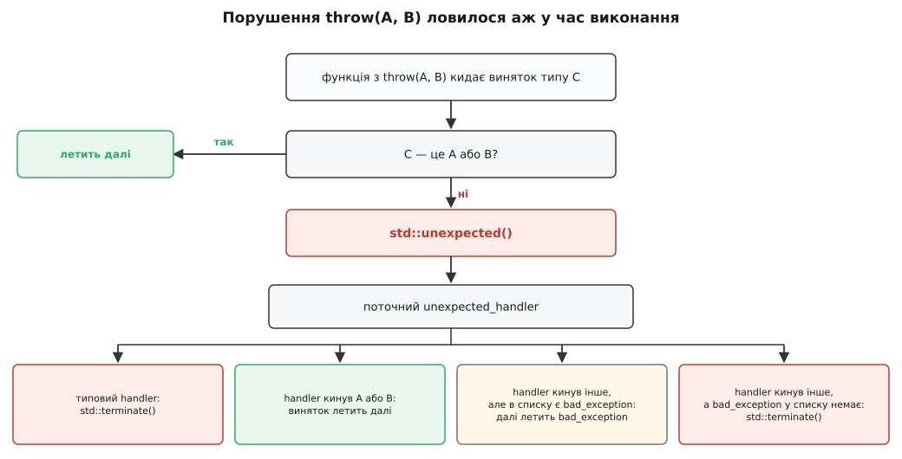

# 📜 Як мова двічі намагалася описати винятки в сигнатурі

C++ двічі вписувала в оголошення функції обіцянку про винятки — і перша спроба, `throw(A, B)`, виявилася настільки невдалою, що мова викреслила її з себе разом із цілим шматком стандартної бібліотеки. Ця історія варта уваги не заради дат: обидві спроби починалися з тієї самої розумної думки — «нехай тип функції каже, що з неї може вилетіти», — а розійшлися в одному-єдиному рішенні, **коли саме перевіряти обіцянку**. Одна відповідь дала синтаксис, що коштував тактів і не давав нічого; друга — слово, на якому тримається переїзд `std::vector`.

## Ідея, старша за C++

Думка описувати винятки в сигнатурі народилася не в C++. Її перше втілення — мова CLU Барбари Лісков (Barbara Liskov) з MIT, кінець 1970-х: процедура перелічувала в своєму типі сигнали, які може подати, і подати щось не з переліку не могла — усе стороннє автоматично перетворювалося на єдиний загальний збій. Наприкінці 1980-х ту саму ідею з жорсткішою перевіркою взяла Modula-3 (DEC SRC) — там клауза `RAISES` перевірялася компілятором.

Приваба очевидна. Сигнатура — це договір між автором функції й тим, хто її кличе; типи параметрів і результату в договорі вже є, а от найцікавіше — «що станеться, коли не вийде» — досі жило в коментарях. Логічно дописати це в договір і змусити компілятор стежити за дотриманням.

Коли Ендрю Кеніг (Andrew Koenig) і Бʼярне Страуструп (Bjarne Stroustrup) готували механізм винятків для C++ (пропозиція 1989 року, доповідь на конференції USENIX C++ 1990-го), ідея специфікацій увійшла в проєкт разом із самим `throw`. У стандарт вона потрапила в тому вигляді, який згодом і став відомий як **динамічна специфікація винятків** — ISO/IEC 14882:1998, §15.4.

```cpp
void save(const Doc& d) throw(IoError, OutOfSpace);  // C++98
void tick() throw();                                 // «не кидає взагалі»
```

Читається як обіцянка: із `save` вилетить або `IoError`, або `OutOfSpace`, і нічого іншого; з `tick` не вилетить нічого.

## Обіцянка, за дотриманням якої стежили в час виконання

Ключове рішення комітету — і корінь усіх подальших бід — полягало в тому, що **компілятор цю обіцянку не перевіряв**. Ви могли написати `throw(IoError)` над функцією, яка в другому рядку кличе щось, здатне кинути `std::bad_alloc`, і жоден діагностичний рядок не зʼявився б. Замість перевірки компілятор **вставляв код**: на межі функції виникала застава, яка в час виконання дивилася на тип вилітаючого винятку й вирішувала, чи він у списку.

Якщо не в списку — керування йшло не назовні, а в бібліотечну функцію `std::unexpected()`. Далі починався сюжет, який мало хто тримав у голові повністю.



*Порушений договір не був помилкою компіляції — він був подією часу виконання з чотирма можливими кінцівками.*

`std::unexpected()` кликала поточний обробник — той, що його можна було підмінити через `std::set_unexpected()`. Типовий обробник просто викликав `std::terminate()`, тобто програма вмирала. Підмінений міг сам кинути виняток — і тоді все залежало від того, чи новий тип є у порушеній специфікації: якщо є, виняток летів далі як законний; якщо ні, але в специфікації згадано `std::bad_exception`, вилітаючий виняток **підмінявся** на `std::bad_exception`; якщо ні того ні того — знову `std::terminate()`.

Погляньте на цю машинерію очима людини, яка хотіла лише одного: щоб компілятор сказав «ти обіцяв не кидати, а кидаєш». Замість перевірки вона отримала маленьку віртуальну машину на межі кожної функції зі специфікацією, глобальний змінюваний обробник і окремий тип-замінник для випадків, які взагалі не мали статися.

## Чому це коштувало, а не заощаджувало

Найгірше в динамічній специфікації те, що вона **додавала роботи процесору саме тоді, коли обіцяла її зняти**. Обіцянка «звідси нічого не вилетить» на позір мала б давати оптимізатору свободу: не будувати шляхи розкрутки, вільніше переставляти код. Але оскільки стандарт вимагав, щоб порушення обіцянки було спіймане й перетворене на виклик `unexpected()`, компілятор мусив цю можливість передбачити — а отже, породити навколо тіла функції обгортку, здатну перехопити будь-що. Обгортка була межею: через неї важко інлайнити, за нею губиться контекст, у ній живе перевірка типу під час польоту винятку.

Саме це через двадцять років і записали в папір про скасування — сухо, трьома пунктами. Дуг Ґреґор (Doug Gregor) у **N3051 «Deprecating Exception Specifications»** (2010-03-12) назвав їх так: специфікації перевіряються в час виконання, а не компіляції, тож жодної гарантії програмісту не дають; перевірка в час виконання змушує компілятор породжувати додатковий код і заважає оптимізаціям; і, нарешті, у [шаблонному](topic:sys-plang-cpp/templates-basics) коді специфікацію взагалі неможливо написати чесно — автор `std::vector` не знає наперед, що вміє кидати операція над чужим типом-параметром.

Третій пункт добиває ідею остаточно. Мова, чия бібліотека побудована на шаблонах, не може мати механізм опису винятків, який у шаблоні не виражається.

> 🔧 **Навіщо це.** Порівняйте дві обіцянки на тій самій функції. `throw()` у C++98 означало: «якщо звідси щось полетить, тебе спіймають і, найпевніше, уб'ють програму» — тобто код перехоплення мусив існувати. Сучасне `noexcept` означає: «звідси нічого не полетить, а якщо полетить — програма гине без обіцянок про розкрутку». Друга обіцянка нічого не перевіряє під час польоту, і тому вона безкоштовна.

На практиці до цього додався розгардіяш у компіляторах: реалізації по-різному ставилися до порожньої специфікації. Компілятор Microsoft роками тлумачив `throw()` просто як «ця функція не кидає, вір мені» — без жодної перевірки в час виконання, тобто не за стандартом (це зафіксовано в його власній документації як відома розбіжність). Тож той самий вихідний код давав різний машинний код і різну поведінку на різних платформах.

## Java як доказ, а не як зразок

Часто кажуть, що специфікації винятків C++ прийшли з Java. Хронологія цього не дозволяє: перевірювані винятки Java стали публічно відомі 1995 року (Java 1.0 — січень 1996), а специфікації винятків уже були в проєкті C++ 1989–1990 років і в довіднику мови. Обидві мови незалежно черпали з одного джерела — CLU й Modula-3, — а Java додала те, чого C++ свідомо не зробила: **перевірку компілятором**. Пункт «перевірювані винятки Java вплинули на C++98» — це поширений переказ заднім числом, а не документований факт.

Зате Java справді стала аргументом — але пізніше й у зворотний бік. Поки комітет C++ вагався, чи не додати таки статичну перевірку, індустрія отримала десятиліття практики з мовою, де ця перевірка є. Присуд виявився непривабливим, і найчіткіше його сформулював Андерс Гейлсберґ (Anders Hejlsberg), головний архітектор C#, у розмові з Брюсом Екелем і Біллом Веннерсом 2003 року — пояснюючи, чому C# перевірюваних винятків не має.

Його претензій було три. **Версійність:** додати новий тип винятку в клаузу `throws` наступної версії бібліотеки означає зламати весь код, що її кличе. **Масштаб:** якщо кожна підсистема оголошує від чотирьох до десяти винятків, то система з кількох підсистем починає тягнути через себе десятки типів у кожній сигнатурі. **Обхід:** зіткнувшись із цим, люди не починають обробляти винятки — вони пишуть порожній `catch {}` з наміром «повернуся пізніше» й не повертаються, тобто перевірка не додає надійності, а вимиває її.

Для C++ висновок був подвійний. Статична перевірка **множини** типів не окупається навіть там, де її зробили як слід. А динамічна перевірка тієї самої множини не окупається тим більше — вона має всі витрати й жодної гарантії.

Лишалося помітити те, що ховалося за спором увесь час: на практиці корисних відповідей не так багато, як типів винятків. Той самий N3051 каже це прямо — програмі майже завжди досить розрізняти два випадки: «може кинути будь-що» і «не кидає нічого». Перелік між цими двома полюсами майже нікому не потрібен.

## Друга спроба починається з переїзду вектора

Друга спроба виросла не з бажання полагодити `throw()`, а зі зовсім конкретної біди в бібліотеці, яку принесли [rvalue-посилання й переміщення](topic:sys-plang-cpp/move-semantics) — забирання нутрощів у приреченого обʼєкта замість копіювання його вмісту.

**N2855 «Rvalue References and Exception Safety»** (Даґ Ґреґор і Дейв Абрагамс, 2009-03-23) описав пастку так: код, цілком правильний за C++03, стає небезпечним після перекомпіляції за C++0x. Тип на кшталт `std::pair<std::string, legacy_type>` **автоматично** отримує конструктор переміщення; якщо цей конструктор здатний кинути, то `vector::push_back` при переїзді буфера втрачає сильну гарантію — обіцянку «або вийшло, або все лишилося як було» (докладніше про рівні цих обіцянок — [гарантії безпеки винятків](topic:sys-plang-cpp/exception-safety-guarantees)). Автор коду при цьому не змінив жодного рядка.

Ліки, які пропонував N2855, були суворі: заборонити конструкторам переміщення кидати взагалі — оголосити їх (і майже всі деструктори) неявно такими, що не кидають. І саме в цьому папері вперше зʼявляється слово, яким мову хотіли навчити казати «не кидає»: **`noexcept`**.

Сувора заборона не пережила обговорення. За нею — **N2983 «Allowing Move Constructors to Throw»** (Дейв Абрагамс, Рані Шароні, Даґ Ґреґор, 2009-11-09) із протилежною позицією: не варто накладати цей тягар на кожного автора класу; є типи, чиє переміщення чесно може кинути, і краще дати бібліотеці спосіб розібратися вибірково. Замість заборони папір приніс три речі, які й дожили до стандарту:

- специфікатор `noexcept(constant-expression)` та його скорочення `noexcept` (тобто `noexcept(true)`) — обіцянку в сигнатурі, тепер двійкову, без списку типів;
- **оператор** `noexcept(вираз)` — спосіб для іншого коду **прочитати** цю обіцянку в час компіляції, не обчислюючи самого виразу;
- `std::move_if_noexcept()` і риси на кшталт `nothrow_move_constructible` — інструмент, яким контейнер сам обирає розвилку: якщо переміщення типу не кидає, віддати rvalue й переміщувати; якщо кидає, а копіювання є — віддати lvalue й копіювати.

Це і є розвʼязка суперечки. Той, хто пише клас, більше не мусить нічого доводити комітетові — він просто каже правду про свій тип. Той, хто пише контейнер, більше не мусить обирати наосліп між швидкістю й гарантією — він питає тип і обирає щоразу. Обіцянка з предмета контролю перетворилася на **дані для рішення** — і саме тому її стало досить читати в час компіляції.

**N3050** (ті самі автори, 2010-03-12) — перегляд N2983, і в ньому дописано останню важливу деталь. У попередній редакції виліт винятку з `noexcept`-функції був невизначеною поведінкою; N3050 замінив це на вимогу викликати `std::terminate()`. І одразу ж провів межу з минулим: динамічні специфікації ведуть до `std::unexpected()`, `noexcept` — до `std::terminate()`. Різниця не косметична. `unexpected()` був точкою, де програміст міг втрутитися й повернути виняток у політ, тож компілятор мусив тримати весь шлях розкрутки живим. `terminate()` втручання не передбачає — і саме тому реалізації дозволено навіть не розкручувати стек.

Тоді ж, того самого дня, лягає на стіл і N3051 про застарівання старого механізму. Дві половини однієї роботи: одна дає заміну, друга оголошує оригінал непотрібним. У C++11 динамічні специфікації стали **deprecated** — синтаксис ще працює, але офіційно приречений.

## Викреслення

Позначка «deprecated» протрималася два стандарти. Прибрав її **P0003R5 «Removing Deprecated Exception Specifications from C++17»** (Алісдер Мередіт / Alisdair Meredith, 2016-11-11) — папір, який довів справу до кінця й забрав із мови та бібліотеки все сімейство:

- сам синтаксис `throw(A, B)` зі списком типів;
- `std::unexpected()` і тип `std::unexpected_handler`;
- `std::set_unexpected()` та `std::get_unexpected()`;
- усю машинерію, що викликала `unexpected()` при порушенні договору.

Мотив у папері сформульовано одним рядком: динамічні специфікації були застарілою можливістю, складною й ламкою у вжитку.

Одне вціліло. `throw()` — порожня специфікація, найуживаніша з усіх, — лишилася, але **перестала бути собою**: із C++17 це строго синонім `noexcept(true)`, і в ньому вже немає ні `unexpected()`, ні перевірки типу під час польоту. Це компроміс заради старих вихідників: мільйони рядків із `throw()` мали й далі компілюватися, просто тепер вони означали сучасну обіцянку. Синонім лишили позначеним як застарілий.

Останній крок зробив **P0619 «Reviewing Deprecated Facilities of C++17 for C++20»** (Алісдер Мередіт зі співавторами; редакція R4 — 2018-06-08) — ревізія всього, що C++17 лишив на позначці «застаріле». Про порожню специфікацію там стоїть обережна, «слабка» рекомендація: прибрати останні сліди застарілого синтаксису, — з мотивом позбутися шуму, що майже нічого не додає стандартові, тим паче що ніхто не заважає реалізаціям і далі приймати `throw()` як власне розширення. Комітет цю слабку рекомендацію ухвалив. Із C++20 `throw()` у мові немає.

```cpp
// C++98/03: перевірка в час виконання, unexpected() при порушенні
void save(const Doc&) throw(IoError, OutOfSpace);   // прибрано в C++17
void tick() throw();                                // синонім у C++17, прибрано в C++20

// C++11 і далі: двійкова обіцянка, читається в час компіляції
void tick() noexcept;
static_assert(noexcept(tick()), "");
```

## Що з цього лишилося

Від першої спроби лишився урок, вартий більше за сам синтаксис. Обіцянка в сигнатурі корисна рівно тією мірою, якою її **може прочитати інший код у час компіляції**. Динамічна специфікація описувала багатше — множину типів замість «так/ні» — і саме через це багатство не давала прочитати нічого: множина перевірялася аж тоді, коли виняток уже летів, тобто в мить, коли жодне рішення в коді змінити було вже неможливо.

Друга спроба почала з протилежного кінця. Питання ставили не «як точніше описати винятки», а «яку відповідь бібліотека справді використає в розгалуженні». Відповідь виявилася двійкова, і механізм під неї вийшов беззатратний — тому що читати `true`/`false` в час компіляції коштує нуль. Тим-то `noexcept` — це не покращена версія `throw()`, а інша конструкція, яка відповідає на інше питання; те, що вона зайняла місце попередниці, — побічний наслідок.

**Джерела.** Усі номери, дати й авторства звірені з паперами робочої групи WG21 на open-std.org: [N2855](https://www.open-std.org/jtc1/sc22/wg21/docs/papers/2009/n2855.html), [N2983](https://www.open-std.org/jtc1/sc22/wg21/docs/papers/2009/n2983.html), [N3050](https://www.open-std.org/jtc1/sc22/wg21/docs/papers/2010/n3050.html), [N3051](https://www.open-std.org/jtc1/sc22/wg21/docs/papers/2010/n3051.html), [P0003R5](https://www.open-std.org/jtc1/sc22/wg21/docs/papers/2016/p0003r5.html), [P0619R4](https://www.open-std.org/jtc1/sc22/wg21/docs/papers/2018/p0619r4.html) — статус цих даних документальний. Про те, як такі папери проходять шлях від чернетки до стандарту, — [процес стандартизації](topic:sys-plang-cpp/standardization-process). Претензії до перевірюваних винятків наведено за [інтервʼю Андерса Гейлсберґа](https://www.artima.com/articles/the-trouble-with-checked-exceptions) (Artima, 2003) — це свідчення учасника, а не вимір. Походження ідеї від CLU й Modula-3 — усталене твердження історії мов програмування; твердження «C++98 узяв специфікації з Java» спростовується хронологією і статусу факту не має.
