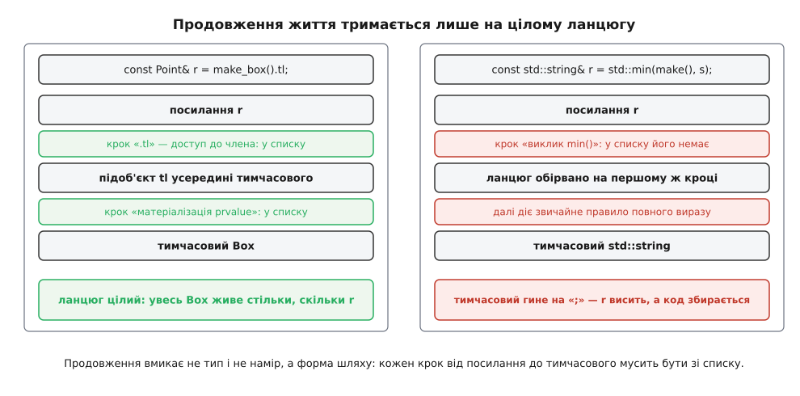

# 🧾 Продовження життя тимчасових: де діє й де ні

Це повний перелік форм, через які посилання «дотягується» до тимчасового об'єкта й забирає його життя собі, і контекстів, у яких стандарт цю дію вимикає. Довідка потрібна тому, що жодного сигналу тут немає: правильна й хибна форма виглядають однаково, обидві збираються, а різниця виявляється лише в тому, читаєте ви далі живий об'єкт чи мертву адресу.

## Правило як процедура з двох перевірок

**Перевірка 1 — що саме зв'язали.** Продовження стосується **тільки ініціалізації посилання**. Зв'язали вказівник, ітератор, `string_view`, `span` чи будь-який інший невласницький вид — правило не вмикається взагалі, хоч би яким був решта виразу.

**Перевірка 2 — яким шляхом посилання дійшло до тимчасового.** Стандарт перелічує форми, через які може бути отриманий glvalue ([class.temporary]/6), і шлях мусить складатися **лише** з них. Один крок поза списком — продовження не відбувається, а попередження при цьому не обов'язкове.

Обидві перевірки говорять мовою категорій значень: тимчасовий виникає тоді, коли [prvalue](root:sys-plang-cpp/value-categories) — вираз-значення без адреси, як-от результат функції — доводиться матеріалізувати в об'єкт, щоб було з чим зв'язати посилання. Саме різниця між prvalue й glvalue вирішує, чи є в цьому виразі тимчасовий узагалі.

Одна деталь із самого формулювання варта окремої уваги: продовжується життя **повного об'єкта**, а не того підоб'єкта, з яким зв'язали посилання. `const Point& r = make_box().tl;` тримає живим увесь `Box`, хоч посилання дивиться на один його кут.


*Продовження вмикає форма шляху, а не тип результату й не намір автора.*

## Прозорі кроки: ланцюг тримається

| Форма кроку | Приклад | Уточнення |
|---|---|---|
| матеріалізація prvalue | `const T& r = f();` | базовий випадок — prvalue стає тимчасовим об'єктом |
| дужки | `const T& r = (f());` | нічого не міняють |
| індексація **масиву**-операнда | `const int& r = Wrap{}.arr[2];` | саме вбудований масив: `v[0]` контейнера — виклик функції |
| `.` — доступ до нестатичного члена-даних | `const Point& r = make_box().tl;` | член має бути **не посилального** типу |
| `.*` — покажчик на член-дані | `const int& r = make_box().*pm;` | так само лише дані, не функція |
| `const_cast`, `static_cast`, `dynamic_cast`, `reinterpret_cast` | `const Base& b = static_cast<const Base&>(Derived{});` | без користувацького перетворення |
| явне перетворення функційного запису до типу посилання | `using Ref = const T&; const T& r = Ref(T{});` | у живому коді трапляється рідко |
| тернарний оператор, що є glvalue | `const T& r = cond ? f() : g();` | продовжується та гілка, що виконалася |
| кома, що є glvalue | `const T& r = (log(), f());` | значення дає права гілка |

Зв'язування з базовим підоб'єктом (`const Base& b = Derived{};`) окремого пункту не потребує: правило говорить про повний об'єкт, тож живим лишається весь `Derived`. Так само поводиться масив-підклад `std::initializer_list`: `std::initializer_list<T> il = {a, b, c};` продовжує йому життя точно за тими самими правилами, що й зв'язування посилання.

## Кроки, що рвуть ланцюг

Спільна причина в усіх рядках одна: **виклик функції не входить до списку**. Мова не заглядає в тіло функції й не знає, звідки взялося те посилання, яке вона повернула, тож не має підстав продовжувати щось конкретне.

| Що в коді | Приклад | Що виходить |
|---|---|---|
| функція, що повертає посилання | `const std::string& r = std::min(make(), s);` | тимчасовий гине на «;» |
| метод, що повертає посилання на нутрощі | `const T& r = make_vec().front();` | те саме |
| `operator[]`, `*it`, `.at()`, `.value()` | `const T& r = make_vec()[0];` | те саме |
| `std::move`, `std::forward` | `T&& r = std::move(make());` | це теж виклики функцій — продовження немає |
| користувацьке перетворення `operator T&` | `const T& r = Proxy{};` | немає: посилання прийшло з тіла оператора |
| зв'язали не посилання | `const char* p = make().c_str();` | правило не вмикається |
| член посилального типу | `const T& r = make_wrapper().ref;` | посилання дивиться на чужий об'єкт |
| повторне зв'язування | `const T& a = f(); const T& b = a;` | `b` нічого не продовжує: строк уже визначив перший зв'язок |

Останній рядок часто розуміють навпаки. Продовження не «передається далі» й не подовжується вдруге: момент смерті тимчасового зафіксовано тим першим посиланням, з яким його зв'язали, і всі наступні посилання просто дивляться на об'єкт із чужим строком.

## Контексти, у яких стандарт вимикає продовження

| Контекст | Скільки живе тимчасовий | Примітка |
|---|---|---|
| параметр-посилання у виклику | до кінця повного виразу з викликом | тому продовжити життя «через свою обгортку» неможливо в принципі |
| `new`-ініціалізатор | до кінця повного виразу з `new` | об'єкт у купі переживе тимчасовий і лишиться з висячим посиланням |
| агрегат, ініціалізований **круглими** дужками | до кінця повного виразу | `S s(T{})`; з фігурними `S s{T{}}` продовження діє |
| посилання-член у списку ініціалізації конструктора | — | форма **некоректна** (ill-formed) з CWG 1696 |
| посилання-член у типовому ініціалізаторі члена | — | так само некоректна |
| `return` у функції, що повертає посилання | до кінця повного виразу в `return` | з C++26 така форма — помилка компіляції |
| ініціалізатор `for` за діапазоном | до C++23 — до «;» самого ініціалізатора | з C++23 живе весь цикл |

Два останні рядки варто прочитати уважно. `return` — це найпоширеніший спосіб зробити висяче посилання, яке компілятор до недавнього часу приймав мовчки. А [цикл `for` за діапазоном](root:sys-plang-cpp/range-based-for) розгортається в приховану змінну-посилання на діапазон, і до C++23 усе, що не було самим діапазоном, — обгортка, тимчасовий контейнер, проміжний вираз — гинуло ще до першої ітерації: `for (int x : make_map().keys())` читав мертву пам'ять весь цикл.

## Що змінювалося за версіями

| Стандарт | Зміна | Підтримка |
|---|---|---|
| C++11 | правило сформульоване в теперішньому вигляді | — |
| C++14, CWG 1696 | посилання-член, зв'язане з тимчасовим, стало некоректним; як дефект застосовується й до попередніх версій | компілятори здебільшого лише попереджають |
| C++17 | гарантоване [усунення копій](root:sys-plang-cpp/copy-elision) — частина тимчасових просто перестала виникати | усі |
| C++20 | ініціалізація агрегатів круглими дужками додала окремий виняток | — |
| C++23, P2718R0 | тимчасові в ініціалізаторі `for` за діапазоном живуть увесь цикл | GCC 15, Clang 20 |
| C++26, P2748R5 | повернення посилання, зв'язаного з тимчасовим, — помилка | GCC 14, Clang 19 |

Розбіжність дат прийняття й дат реалізації тут не дрібниця: правило C++26 компілятори підхопили раніше за правило C++23, тож стандарт у прапорцях збірки й фактична поведінка збігаються не завжди ([підтримка стандартів компіляторами](root:sys-plang-cpp/compiler-support)).

## Діагностика

| Прапорець або атрибут | Що ловить |
|---|---|
| GCC `-Wdangling-reference` (з 13-ї, входить у `-Wall`) | посилання, зв'язане з тимчасовим через функцію, що повертає посилання |
| Clang `-Wdangling-gsl` | вказівник або вид, узятий з тимчасового власника: `c_str()`, `string_view` |
| Clang `-Wdangling-field` | посилання-член, зв'язане з тимчасовим |
| Clang `-Wdangling-initializer-list` | масив-підклад `initializer_list`, що пережив свій повний вираз |
| Clang `-Wreturn-stack-address` | повернення посилання на локальний об'єкт або тимчасовий |
| `[[clang::lifetimebound]]`, `[[msvc::lifetimebound]]` на параметрі | вмикає ті самі перевірки крізь **ваші** функції: «результат позичає в цього аргументу» |
| `-fsanitize=address -fsanitize-address-use-after-scope` | ловить під час виконання — але лише на тому шляху, який справді виконався |

Атрибут `lifetimebound` — єдиний спосіб пробити ту саму стіну, об яку розбивається продовження: мова не бачить крізь виклик, а атрибут дає їй те, чого бракує. Позначте ним параметр своєї функції, що повертає посилання чи вид у його нутрощі, — і компілятор попереджатиме про [висячі посилання](root:sys-plang-cpp/dangling-references) на межі вашого API так само, як на межі стандартної бібліотеки.

## Мінімальна перевірка

Продовження не видно ні в типі, ні в назві. Але його видно в порядку друку, якщо покласти рядок у деструктор:

```cpp
#include <cstdio>

struct Loud { ~Loud() { std::puts("  ~Loud"); } };

Loud make()                     { return Loud{}; }
const Loud& pass(const Loud& x) { return x; }        // ланцюг рветься тут

int main() {
    { std::puts("A:"); const Loud& r = make();       std::puts("  після крапки з комою"); }
    { std::puts("B:"); const Loud& r = pass(make()); std::puts("  після крапки з комою"); }
}
```

```
A:
  після крапки з комою
  ~Loud
B:
  ~Loud
  після крапки з комою
```

У випадку **A** деструктор іде останнім: продовження спрацювало, `r` показує на живий об'єкт до кінця блока. У випадку **B** тимчасовий помирає ще до друку — він був зв'язаний із параметром `pass`, а це один із контекстів, де продовження вимкнене, — і решта блока працює з висячим посиланням. У вихідному тексті між цими випадками різниці на одне слово.
