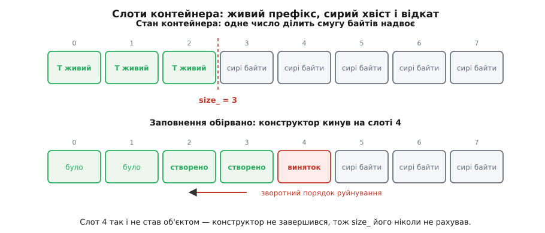

# ⚙️ Контейнер, у якому сховище й час життя розведені руками

Зберемо `StaticVector<T, N>` — вектор із наперед відомою місткістю, що тримає елементи у власному масиві байтів і жодного разу не звертається до купи. Цікавий він не економією на виділенні пам'яті, а тим, що змушує зробити руками обидві дії, які `new` і `delete` роблять одним рухом: окремо здобути сховище й окремо почати час життя, окремо закінчити час життя й окремо віддати байти.

## Задача

Місткість `N` відома під час компіляції, кількість живих елементів — ні. Отже, з `N · sizeof(T)` байтів частина в будь-який момент є об'єктами, а частина — просто байтами. Контейнер мусить точно знати, де межа: `operator[]` має право читати лише ліворуч від неї, деструктор мусить викликати `~T()` рівно стільки разів, скільки конструкторів відпрацювало, а заповнення, урване винятком посеред дороги, зобов'язане лишити контейнер у стані, який можна безпечно зруйнувати.

Очевидне рішення `T buf_[N];` не годиться, і причина не в стилі. Такий масив збудує всі `N` об'єктів одразу, вимагатиме від `T` конструктора без аргументів і зробить час життя елемента рівним часу життя контейнера — тобто заборонить саме те, заради чого контейнер існує.

## Ідея

Три рішення, і кожне прямо випливає з того, що сховище й час життя — різні проміжки.

**Сховище** — масив `std::byte`, вирівняний так, як вимагає сам `T`: `alignas(T) std::byte buf_[N * sizeof(T)]`. Байти сирі, жоден конструктор по них не пробігав. Роками це саме писали через `std::aligned_storage`, але в C++23 його оголошено застарілим (папір P1413R3, реалізовано в GCC, Clang і MSVC ще 2022 року) — саме тому, що він змушував до розсипу `reinterpret_cast` і не давав жодної гарантії на розмір результату.

**Час життя** починає [розміщувальний `new`](topic:sys-plang-cpp/alignment-placement-new) на адресі потрібного слоту, а закінчує явний виклик деструктора. Пам'ять при цьому не виділяється й не звільняється: байти весь час на місці й належать контейнеру.

**Межа** — одне число `size_`, і в ньому вся коректність класу. `size_` означає не «скільки я збираюся мати», а «скільки конструкторів **уже** повернулися нормально». Тому збільшувати його вільно лише після того, як розміщувальний `new` відпрацював. Пересуньте `++size_` рядком вище — і виняток із конструктора лишить у лічильнику слот, у якому об'єкта ніколи не було, а деструктор контейнера сумлінно викличе `~T()` на сирих байтах.


*Ліворуч від межі — об'єкти, праворуч — сховище без об'єктів. Уся робота контейнера зводиться до того, щоб межа завжди казала правду.*

## Код

```cpp
#include <cstddef>      // std::byte, std::size_t
#include <memory>       // std::destroy_at
#include <new>          // розміщувальний new, std::launder
#include <stdexcept>
#include <utility>

template <class T, std::size_t N>
class StaticVector {
public:
    StaticVector() noexcept = default;
    ~StaticVector() { clear(); }

    StaticVector(const StaticVector&)            = delete;   // чому — нижче
    StaticVector& operator=(const StaticVector&) = delete;

    std::size_t size() const noexcept { return size_; }
    static constexpr std::size_t capacity() noexcept { return N; }

    template <class... Args>
    T& emplace_back(Args&&... args) {
        if (size_ == N)
            throw std::length_error("StaticVector: місткість вичерпано");

        T* p = ::new (raw(size_)) T(std::forward<Args>(args)...);  // 1. час життя почався
        ++size_;                                                   // 2. і лише тепер він наш
        return *p;
    }

    void pop_back() noexcept {
        --size_;                       // спершу знімаємо з обліку
        std::destroy_at(at(size_));    // потім закінчуємо час життя; байти лишаються
    }

    void clear() noexcept {
        while (size_ != 0) pop_back();  // зворотний порядок — як у блоці
    }

    template <class It>
    void append(It first, It last);

    T&       operator[](std::size_t i)       noexcept { return *at(i); }
    const T& operator[](std::size_t i) const noexcept { return *at(i); }

private:
    void* raw(std::size_t i) noexcept { return buf_ + i * sizeof(T); }

    T* at(std::size_t i) noexcept {
        return std::launder(reinterpret_cast<T*>(buf_ + i * sizeof(T)));
    }
    const T* at(std::size_t i) const noexcept {
        return std::launder(reinterpret_cast<const T*>(buf_ + i * sizeof(T)));
    }

    alignas(T) std::byte buf_[N * sizeof(T)];
    std::size_t size_ = 0;
};
```

Два місця варті окремого слова. `::new (адреса) T(...)` — це не виділення пам'яті, а лише команда «почни тут час життя»; глобальна `::` потрібна, щоб перевантажений `operator new` самого класу `T` не перехопив виклик. А [`std::launder`](topic:sys-plang-cpp/std-launder) розв'язує тонкість, яку легко пропустити: вираз `reinterpret_cast<T*>(buf_ + i * sizeof(T))` за буквою стандарту дає вказівник на елемент **масиву байтів**, а не на створений у ньому об'єкт, і компілятор має право спиратися на цю різницю під час оптимізації. `std::launder` каже «перевидай мені вказівник на те, що тут живе зараз».

> 🔧 **Навіщо це.** Крім відсутності купи, такий контейнер дає властивість, якої `std::vector` дати не може: адреси елементів не змінюються ніколи. Сховище виділено один раз і не переїжджає, тож вказівник чи посилання на елемент лишається дійсним, доки цей елемент живий, — а не «доки не сталося переростання» ([інвалідація ітераторів](topic:sys-plang-cpp/iterator-invalidation)). Для вбудованих систем і гарячих шляхів це часто важить більше за швидкість.

## Заповнення з відкотом

Тепер найцікавіше: додати відразу кілька елементів так, щоб виняток посеред дороги не лишив по собі напівзаповнений контейнер.

```cpp
template <class T, std::size_t N>
template <class It>
void StaticVector<T, N>::append(It first, It last) {
    const std::size_t mark = size_;         // позначка: стан «до»
    try {
        for (; first != last; ++first)
            emplace_back(*first);           // може кинути на будь-якій ітерації
    } catch (...) {
        while (size_ != mark) pop_back();   // відкат рівно до позначки
        throw;                              // помилку віддаємо далі незміненою
    }
}
```

Ця коротка обгортка дає [сильну гарантію](topic:sys-plang-cpp/exception-safety-guarantees): або додано всі елементи, або контейнер точнісінько такий, як був. І тримається вона не на `try`, а на тому, що `size_` увесь час каже правду. Коли конструктор кинув, лічильник ще не встиг зрости, тож невдалий слот сам собою опинився за межею — його не треба ні пам'ятати, ні окремо обробляти. Цикл відкоту просто зменшує розмір до позначки, руйнуючи по дорозі ті об'єкти, які встигли ожити, у порядку, зворотному до створення.

## Як це видно на очі

Найкоротший спосіб переконатися, що межа справді тримається, — узяти тип, який голосно повідомляє про кожну свою подію, і зламати його четвертий конструктор.

```cpp
#include <cstdio>
#include <iterator>

struct Noisy {
    int id;
    explicit Noisy(int i) : id(i) {
        if (i == 4) throw std::runtime_error("конструктор 4 не вдався");
        std::printf("  + збудовано %d\n", id);
    }
    ~Noisy() { std::printf("  - зруйновано %d\n", id); }
    Noisy(const Noisy&) = delete;
};

int main() {
    StaticVector<Noisy, 8> v;
    v.emplace_back(0);
    v.emplace_back(1);

    const int rest[] = {2, 3, 4, 5};
    try {
        v.append(std::begin(rest), std::end(rest));
    } catch (const std::exception& e) {
        std::printf("спіймано: %s; size = %zu\n", e.what(), v.size());
    }
}                                   // ← тут спрацює деструктор контейнера
```

```
  + збудовано 0
  + збудовано 1
  + збудовано 2
  + збудовано 3
  - зруйновано 3
  - зруйновано 2
спіймано: конструктор 4 не вдався; size = 2
  - зруйновано 1
  - зруйновано 0
```

У цьому виводі варто прочитати те, чого в ньому **немає**. Немає рядка «зруйновано 4» — і не через якусь особливу перевірку в коді, а тому, що об'єкта з таким номером не існувало жодної миті: конструктор не повернувся, час життя не почався, руйнувати нема чого. Немає й слідів слотів 4–7 у деструкторі контейнера: `clear()` іде лише до межі. А руйнування 3 і 2 стоять **перед** словом «спіймано» — відкат відбувається всередині `append`, до того як виняток вийде назовні, тож зовнішній код бачить уже цілий контейнер.

## Складність і пастки

`emplace_back` — O(1) без жодних «у середньому»: переростання не буває, отже не буває й перенесення вже створених елементів. Разом із перенесенням зникає й ціле питання, від якого залежить швидкість `std::vector`: чи [позначено переміщувальний конструктор як `noexcept`](topic:sys-plang-cpp/noexcept). Тут це не важить зовсім. `append` — O(k) за кількістю доданих, відкат — O(k) у найгіршому разі. Пам'ять — завжди повні `N · sizeof(T)` плюс лічильник, незалежно від того, чи використано хоч один слот; за брак гнучкості платимо саме тут.

**Одне `alignas` на весь масив — і цього досить.** Без нього `std::byte buf_[…]` має вирівнювання 1, тобто адреса нульового слоту може виявитися будь-якою. Розміщувальний `new` за недостатньо вирівняною адресою — невизначена поведінка, і вона не гіпотетична: на ARM і RISC-V невирівняне звернення до широкого типу дає пастку процесора, а на x86 вирівняні SSE-інструкції завершуються помилкою навіть там, де звичайне читання пройшло б. Чому ж вистачає одного `alignas(T)` на початок масиву, коли слотів `N`? Бо `sizeof(T)` за побудовою кратний `alignof(T)`: якщо нульовий слот вирівняно, то й кожен наступний, зсунутий на ціле число розмірів, вирівняно теж. Ще одна дрібниця на користь `alignas(T)` замість числа: для типу, оголошеного з розширеним вирівнюванням (скажімо, `alignas(64)` заради окремого рядка кешу), запис `alignas(T)` підхопить його сам.

**Тривіальний деструктор — і цикл зникає.** Коли `~T()` нічого не робить, `std::destroy_at` розгортається в порожнечу, і оптимізатор зазвичай згортає весь цикл `clear()` у присвоєння нуля. «Зазвичай» — слово незручне для гарячого шляху, тож у справжніх реалізаціях межу ставлять явно: `if constexpr (!std::is_trivially_destructible_v<T>) { … }`, після чого циклу немає вже в тексті програми, а не лише в оптимізованому виводі ([риси типів](topic:sys-plang-cpp/type-traits)).

**Копіювання контейнера — міна.** Якби `= delete` вище не стояло, компілятор згенерував би копіювальний конструктор, який просто скопіює масив байтів. Вийде `size_` об'єктів, чиї конструктори копіювання ніколи не викликалися, зате деструктори виконаються двічі — по разу на кожен примірник. Справжнє копіювання — це цикл `emplace_back` по елементах джерела, з тим самим відкотом ([правило п'яти](topic:sys-plang-cpp/rule-of-five-zero)).

**Деструктор `T` не має кидати.** Якщо `~T()` кине під час відкоту, ми будемо всередині обробки першого винятку — і другий, що вийшов із деструктора, дасть `std::terminate`. Починаючи з C++11 деструктор і так `noexcept` за замовчуванням, тож зусиль тут не треба — треба лише не скасовувати це навмисно.

**Хвіст — не пам'ять для гри.** `std::memset` по всьому `buf_`, `std::fill` на повну місткість, побайтове порівняння контейнерів — усе це чіпає байти, які об'єктами не є, і для нетривіальних `T` ламає живі об'єкти в префіксі.

**Куди стандарт суворіший за практику.** Метод `data()`, що повертає `T*` на весь масив (щоб віддати [`span`](topic:sys-plang-cpp/span-contiguous)), потребує арифметики над вказівниками через об'єкти, створені окремо один від одного, — а це формально не те саме, що масив. Це відома щілина між буквою стандарту й тим, як влаштована кожна реальна реалізація `std::vector`; частково її закрив папір P0593R6 у C++20 (неявне створення об'єктів), а `std::start_lifetime_as` із C++23 (P2590R2) дав явний інструмент — щоправда, лише для типів із неявним часом життя, тобто не для тих, задля яких увесь цей код і писався.

І остання чесна деталь: у `constexpr`-обчисленнях такий контейнер не працює — масив байтів не вміє тримати об'єкти під час компіляції. Саме тому стандартний `std::inplace_vector`, ухвалений до C++26 (папір P0843R14), тримає елементи в об'єднанні з масивом `T`, а не в сирих байтах — і навіть це зажадало окремого паперу про тривіальні об'єднання (P3074), щоб контейнер справді працював під час компіляції. Якщо ваш компілятор його вже має, беріть готове; якщо ні — код вище і є той самий контейнер, лише без права жити в [обчисленнях під час компіляції](topic:sys-plang-cpp/constexpr-and-consteval).
