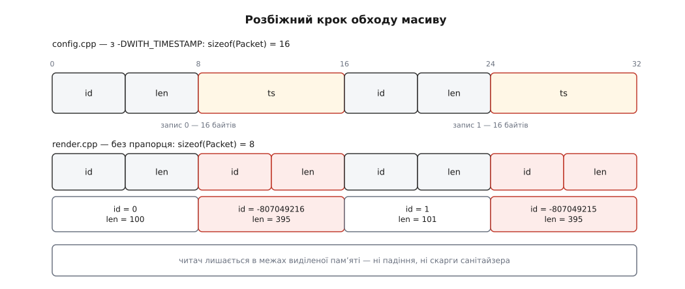

# ⚙️ Зламати ODR навмисне і зловити злам інструментами

Три файли, які збираються без жодного попередження, запускаються й друкують неправду: одна одиниця трансляції бачить у пакеті поле мітки часу, друга його не бачить, а масив між ними спільний. Зібравши це власноруч, ви побачите порушення правила одного визначення зсередини — а тоді перевірите на ньому кожен інструмент, що обіцяє такі речі ловити, і з'ясуєте, котрий саме на цьому зламі мовчить.

## Заголовок, який міняється від прапорця

```cpp
// packet.hpp
#pragma once
#include <cstddef>

struct Packet {
    int id;
    int len;
#ifdef WITH_TIMESTAMP
    long long ts;                 // ← поле є лише в частині збірки
#endif
    static std::size_t stride() { return sizeof(Packet); }   // inline
};

Packet* make_batch(int n);        // визначено в config.cpp
void    free_batch(Packet* p);
```

Поле `ts` є або немає — залежно від того, чи стояв `-DWITH_TIMESTAMP` у момент компіляції саме цього файла. Розмір структури від цього стрибає з 8 байтів на 16: два `int` дають рівно 8, а `long long` вимагає адреси, кратної восьми, тож компілятор кладе його на зсув 8 і доводить розмір до 16. Звідки беруться такі зсуви й додаткові порожні байти, розбирає [Вирівнювання в пам'яті](root:sf-apps/memory-alignment).

```cpp
// config.cpp — збирається З -DWITH_TIMESTAMP
#include "packet.hpp"

Packet* make_batch(int n) {
    Packet* p = new Packet[n];
    for (int i = 0; i < n; ++i) {
        p[i].id  = i;
        p[i].len = 100 + i;
#ifdef WITH_TIMESTAMP
        p[i].ts  = 1700000000000LL + i;
#endif
    }
    return p;
}

void free_batch(Packet* p) { delete[] p; }
```

```cpp
// render.cpp — збирається БЕЗ прапорця
#include "packet.hpp"
#include <cstdio>

int main() {
    std::printf("render: sizeof=%zu stride()=%zu\n",
                sizeof(Packet), Packet::stride());

    Packet* p = make_batch(4);
    for (int i = 0; i < 4; ++i)
        std::printf("  [%d] id=%d len=%d\n", i, p[i].id, p[i].len);
    free_batch(p);
}
```

Масив заповнює `config.cpp`, обходить його `render.cpp`, а спільного тексту між ними — один-єдиний заголовок. Прапорець розходиться в одному місці: у командному рядку.

## Збірка й показання

```sh
g++ -std=c++20 -O2 -DWITH_TIMESTAMP -c config.cpp -o config.o
g++ -std=c++20 -O2                  -c render.cpp -o render.o
g++ config.o render.o -o demo
./demo
```

Жодного попередження — ні від компілятора на кожному з двох проходів, ні від лінкера. Програма друкує:

```
render: sizeof=8 stride()=8
  [0] id=0 len=100
  [1] id=-807049216 len=395
  [2] id=1 len=101
  [3] id=-807049215 len=395
```

Рядки правди й сміття чергуються, і це не випадковість. Письменник кладе записи через кожні 16 байтів, читач знімає їх через кожні 8 — тож кожне друге «вікно» читача припадає рівно на мітку часу попереднього запису, розрізану навпіл.

```
запис 0 письменника: [0..3] id=0   [4..7] len=100   [8..15] ts=1700000000000
вікно 1 читача:      [8..11] → id                   [12..15] → len

1700000000000 = 0x0000018B_CFE56800   (порядок байтів — молодшими вперед)
молодші 4 байти  0xCFE56800 = 3487918080 → як int: 3487918080 − 2³² = −807049216
старші  4 байти  0x0000018B = 395
```



*Кожне друге вікно читача лягає на мітку часу попереднього запису — і її половинки стають «числом пакета» й «довжиною».*

Найгірше тут те, чого **не** сталося. Читач вибрав 4 × 8 = 32 байти з 64 виділених — він ніде не вийшов за межі буфера. Ні падіння, ні скарги від засобів контролю пам'яті: програма спокійно рахує далі по зіпсованих числах, а помилка спливе за півгодини й в іншому модулі.

## Той самий рядок дає два різні числа

Перезберіть ту саму пару з `-O0` замість `-O2` — і перший рядок зміниться:

```
render: sizeof=8 stride()=16
```

`sizeof(Packet)` компілятор порахував просто в `render.cpp` і дістав 8. А `Packet::stride()` на `-O0` не вбудовується: обидві одиниці трансляції поклали в себе окрему копію її тіла під одним злитним символом, і лінкер лишив ту, що трапилася першою в командному рядку, — з `config.o`. Переставте `config.o` і `render.o` місцями, і число стане 8. Жодна специфікація такого порядку не обіцяє: це просто те, як поводиться конкретний лінкер із конкретним списком файлів. Одна функція, один рядок вихідного тексту — і дві різні відповіді залежно від рівня оптимізації.

## Як упізнати це в чужому проєкті

Коли така поведінка трапляється не в навчальному прикладі, а в робочому коді, найшвидша перевірка — не інструмент, а один рядок. Додайте в підозрілий заголовок друк розміру з кожного модуля або тимчасовий `static_assert(sizeof(Packet) == 16);` і зберіть як є: якщо ствердження впаде рівно в частині файлів, діагноз готовий. Далі лишається знайти, звідки взялася розбіжність, — `g++ -E` на обох `.cpp` і порівняння вкладеного тексту заголовка показує це буквально, рядок у рядок.

## Хто це ловить

**Оптимізація на етапі лінкування.** Поки компілятор бачить по одному файлу, порівнювати нема з чим; під LTO обидві одиниці потрапляють до нього разом, і тоді розбіжність стає видимою (про сам режим — [Оптимізація на етапі лінкування (LTO)](root:sf-lang/link-time-optimization)):

```sh
g++ -std=c++20 -O2 -flto -DWITH_TIMESTAMP -c config.cpp -o config.o
g++ -std=c++20 -O2 -flto                  -c render.cpp -o render.o
g++ -O2 -flto config.o render.o -o demo
```

```
packet.hpp:5:8: warning: type 'struct Packet' violates the C++ One Definition Rule [-Wodr]
packet.hpp:5:8: note: a type with different number of fields is defined in another translation unit
```

Просити `-Wodr` окремо не треба, GCC тримає його ввімкненим; `-Werror=odr` перетворює попередження на відмову зібрати. Це найближче до справжньої перевірки правила, що взагалі буває у звичайній збірці, — але й воно не всесильне: розбіжні **тіла** двох однакових за сигнатурою `inline`-функцій LTO не помічає, бо звіряє типи, а не код. І ціна за перевірку своя: під LTO компілятор ті розбіжні типи ще й **зливає** в один, після чого програма поводиться інакше, ніж без прапорця. Тобто `-flto` тут не режим спостереження, а інша збірка — попередження варте уваги саме тому, що мовчазний варіант уже не той самий двійковий файл.

**AddressSanitizer.** На проєкті в тому вигляді, як він написаний вище, санітайзер не скаже нічого: він реєструє глобальні змінні, а глобальних змінних тут немає. Додаймо до заголовка річ, яку в такий модуль додають не змовляючись, — спільний «останній оброблений пакет»:

```cpp
inline Packet last_seen{};        // C++17: один об'єкт на всю програму
```

Тепер обидві одиниці трансляції реєструють у санітайзері глобальну змінну з тим самим іменем і різними розмірами, і звіт приходить ще до `main`:

```sh
g++ -std=c++20 -g -fsanitize=address -DWITH_TIMESTAMP -c config.cpp -o config.o
g++ -std=c++20 -g -fsanitize=address                  -c render.cpp -o render.o
g++ -fsanitize=address config.o render.o -o demo && ./demo
```

```
==4711==ERROR: AddressSanitizer: odr-violation (0x000000404860):
  [1] size=16 'last_seen' packet.hpp
  [2] size=8 'last_seen' packet.hpp
These globals were registered at these points:
  [1]: ... in _GLOBAL__sub_I_config.cpp
  [2]: ... in _GLOBAL__sub_I_render.cpp
```

Рівень задає `ASAN_OPTIONS=detect_odr_violation`: `0` — вимкнено, `1` — сварити лише на різні розміри, `2` — стандартний, ловить і однакові за розміром, але різні за типом. Тривога тут не формальна: об'єкт у програмі лишиться один, розміром із ту копію, яку взяв лінкер, — і якщо це 8 байтів, то присвоєння `last_seen = p[n-1]` з боку `config.cpp` запише 16 байтів у восьмибайтовий об'єкт, зачепивши сусіда. Докладніше про сам інструмент — [AddressSanitizer](root:sf-release/address-sanitizer).

**Лінкер gold.** Його `--detect-odr-violations` іде евристикою: серед [спотворених імен](root:sys-plang-cpp/name-mangling) шукає пару слабких визначень із різними розмірами тіла й дивиться в налагоджувальну інформацію, чи вказують вони на різні місця у вихідному тексті. На нашому зламі gold мовчить, і мовчить закономірно: обидві копії `Packet::stride()` прийшли з одного рядка одного `packet.hpp`, тож «різних місць» немає. Евристика націлена на інший випадок — коли дві бібліотеки принесли власні класи з однаковим іменем із власних заголовків. Плюс сам gold оголошено застарілим: із binutils 2.44 (лютий 2025) його вихідні тексти виїхали в окремий архів, а lld і mold такої перевірки не мають узагалі.

**MSVC.** Нативний лінкер поводиться так само, як GNU ld, — злитні визначення зводить за іменем і мовчить. Виняток один: під `/clr` типи потрапляють у метадані CLR, а там два різні типи з одним іменем недопустимі, і збірка падає з `LNK2022: metadata operation failed ... Inconsistent layout information in duplicated types`. Тобто в C++ порушення видно лише тоді, коли поруч опиняється середовище з чеснішою моделлю типів.

## Щоб воно просто не збиралося

Порушення народилося не в заголовку, а в системі збірки, тож і лікувати треба там. Джерело правди про прапорець має бути одне — а найнадійніше, коли це не прапорець, а породжений файл, який читають усі без винятку:

```cmake
option(WITH_TIMESTAMP "Тримати мітку часу в пакеті" OFF)
configure_file(packet_config.hpp.in packet_config.hpp @ONLY)   # #cmakedefine WITH_TIMESTAMP
```

`packet.hpp` вкладає `packet_config.hpp`, і зібрати одну ціль інакше за іншу вже нема як — окремої ручки на цілі не існує. Про сам механізм підстановки — [Породжені заголовки: configure_file](root:sys-bsystem/configure-file-templates). Якщо прапорець усе ж лишається прапорцем, він мусить приходити з однієї інтерфейсної цілі, до якої приєднані всі, хто вкладає заголовок, а не виписуватися руками кожній.

Друге виправлення прибирає саму можливість: у заголовку не має бути нічого, чия **розкладка** залежить від `#ifdef`. Або поле є завжди (вісім байтів рідко варті такої ціни), або змінна частина ховається за інтерфейс і живе в одному `.cpp` — класичний прийом розбирає [Pimpl: винесення реалізації](root:sys-plang-cpp/pimpl). Туди ж, у `.cpp`, і тільки туди, належить безіменний простір імен: у заголовку він дає кожній одиниці трансляції власну сутність під спільним іменем, тобто ламає правило тихо й без жодного `#ifdef`.

І третє — зробити рештковий ризик гучним. Ідея та сама, якою libstdc++ від GCC 5.1 розводить дві несумісні реалізації `std::string`: варіанти кладуть у різні вбудовані простори імен, і символи від того дістають різні імена. Заголовок міняється на кілька рядків:

```cpp
#ifdef WITH_TIMESTAMP
inline namespace abi_ts {
#else
inline namespace abi_plain {
#endif
    struct Packet { /* ... */ };
    Packet* make_batch(int n);
    void    free_batch(Packet* p);
}
```

Вбудований простір імен не змінює жодного місця виклику — `make_batch` як писався без уточнення, так і пишеться. Зате `render.o` тепер просить `abi_plain::make_batch(int)`, а `config.o` дає `abi_ts::make_batch(int)`, і збірка зупиняється на `undefined reference` замість того, щоб піти в діло. Ціна питання — те саме розділення інтерфейсів, про яке йдеться в [Стабільність ABI в C++](root:sys-plang-cpp/abi-stability-cpp). У MSVC той самий ефект дає одна директива в заголовку:

```cpp
#ifdef WITH_TIMESTAMP
#  pragma detect_mismatch("packet_layout", "ts")
#else
#  pragma detect_mismatch("packet_layout", "plain")
#endif
```

Лінкер порівнює пари «ім'я — значення» з усіх об'єктних файлів і на розбіжності видає `LNK2038: mismatch detected for 'packet_layout': value 'ts' doesn't match value 'plain'`.

Директиву цю Microsoft вигадала не для чужих проєктів, а для власних заголовків — і саме тому вона того варта. Найчастіший ODR-злам у житті стоїть не на самописній структурі, а на стандартній бібліотеці: `_ITERATOR_DEBUG_LEVEL` міняє розкладку контейнерів MSVC, `_GLIBCXX_DEBUG` — розкладку контейнерів libstdc++, `NDEBUG` вимикає перевірки в чиємусь `inline`-методі, а різні `-std=` дають різні визначення того самого класу зі стандартної бібліотеки. Механізм щоразу той самий, що й у нашому `packet.hpp`: заголовок один, а текст після препроцесора різний. Різниця лише в тому, що бібліотечні заголовки MSVC оголошують свої `detect_mismatch` самі, тож змішати бібліотеку налагоджувальної збірки з випусковою просто не вийде — LNK2038 прийде раніше.

Отже, жоден із двох останніх прийомів не перевіряє правило одного визначення. Вони роблять інше й дешевше: змушують розбіжність прапорців проявитися там, де її ще можна виправити безкоштовно — на етапі лінкування, а не на роботі з даними.
