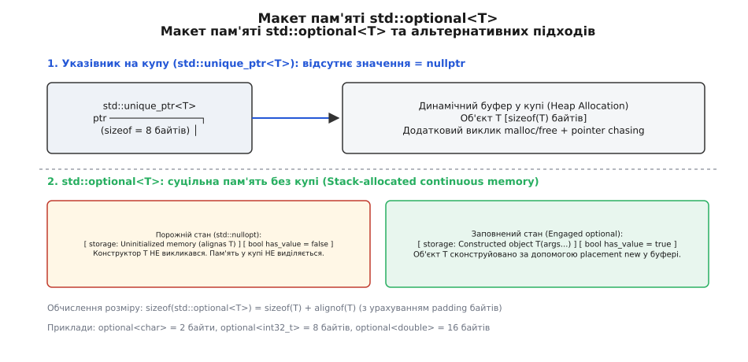
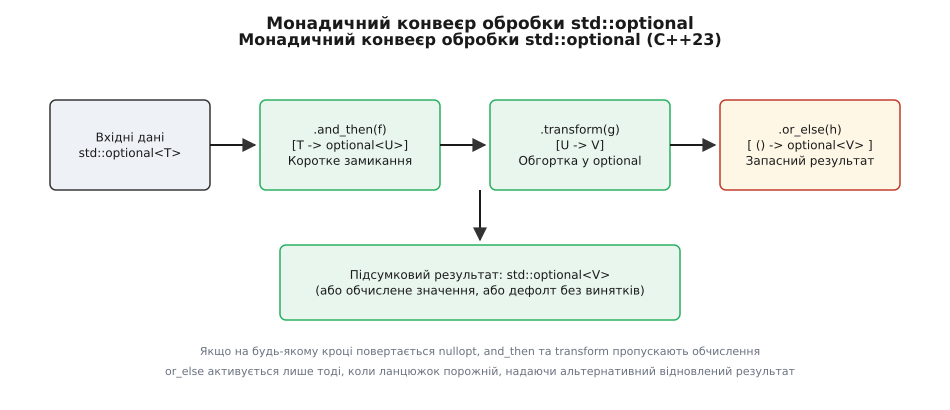

# std::optional: вираження опціонального стану без динамічної пам'яті

<preknowlist>
- [Динамічна пам'ять і купа](topic:sf-lang/heap-dynamic-memory) — як працює виділення пам'яті через malloc/new, чому виклики алокатора повільні та що таке фрагментація.
- [RAII та час життя об'єктів](topic:sf-lang/raii) — зв'язування виклику деструктора з виходом об'єкта з області видимості.
- [Категорії значень: lvalue, prvalue, xvalue](topic:sys-plang-cpp/value-categories) — семантика rvalue та тимчасових об'єктів.
- [Семантика переміщення і rvalue-посилання](topic:sys-plang-cpp/move-semantics) — передача ресурсів без додаткового копіювання.
- [Правило п'яти й правило нуля](topic:sys-plang-cpp/rule-of-five-zero) — керування спеціальними членами класу та тривіальна деструкція.
</preknowlist>

Коли підсистема обробки мережевих запитів шукає сесійний токен у базі даних або розбирає конфігураційний параметр, результат обчислення може бути відсутнім. Намагання виразити відсутність результату через сторожові значення на кшталт `-1`, `nullptr` або порожній рядок `""` змушує розробника резервувати допустимі комбінації бітів, що регулярно призводить до важковловимих помилок типізації. Спроба ж віддати результат через динамічний вказівник `std::unique_ptr<T>` змушує програму виконувати виклик алокатора `malloc` у купі, що коштує сотні тактів процесора на кожен запит та руйнує локальність даних у кеші.

Клас `std::optional<T>` (походить від лат. *optio* — вибір, вільне рішення; англ. *optional* — необов'язковий, вибірковий), введений у стандарту C++17, вирішує цю проблему на рівні системи типів компілятора. Він виражає стан «значення є» або «значення відсутнє» без жодної алокації динамічної пам'яті у купі, розміщуючи ресурс безпосередньо у суцільному стековому макеті й гарантуючи ліниве конструювання об'єкта.

## 1. Ціна відсутнього значення: чому сторожові значення та вказівники зазнають поразки

У системному програмуванні на мовах C та ранньому C++ склалися три основні підходи до обробки опціональних даних, кожен з яких містить критичні інженерні компроміси:

1. **Сторожові значення (англ. *sentinel values*)**: резервування спеціального елемента діапазону (наприклад, `std::string::npos`, `nullptr`, `-1`, `EOF`). Якщо функція обчислює коефіцієнт підсилення або повертає виміряну температуру, будь-яке число з діапазону `float` чи `int` є цілком коректним результатом. Використання `-1` для сигналізації про помилку створює ситуацію, коли значення помилки перетинається з дійсними даними. Компілятор не здатний проконтролювати, чи перевірив викликач повернуте значення, що призводить до передачі невалідних даних у наступні обчислювальні блоки. Більше того, у 32-бітних і 64-бітних архітектурах перевищення розмірів констант на кшталт `npos` (яка дорівнює `size_t(-1)`) може викликати неочікуване зведення типів при порівнянні з від'ємними знаковими числами `int`. Використання глобальної змінної `errno` для збереження коду помилки у C створює додаткові ризики у багатопотоковому середовищі, оскільки звернення до `errno` потребує потоково-локального сховища (TLS) та руйнує оптимізації компілятора довкола бар'єрів пам'яті.
2. **Динамічні вказівники (`T*`, `std::unique_ptr<T>`)**: передача відсутності значення через `nullptr`. Цей підхід забезпечує точну семантику наявності стану, але змушує зберігати об'єкт `T` у динамічній пам'яті купи. Створення `std::unique_ptr<T>` вимагає виклику `operator new`, який шукає вільний блок у таблицях алокатора пам'яті, бере м'ютекси у багатопотоковому середовищі та спричиняє фрагментацію. Додатково виникає проблема погоні за вказівниками (англ. *pointer chasing*): об'єкт вказівника лежить на стеку, а самі дані — у купі, що призводить до промахів у кеші процесора L1/L2.
3. **Пара прапорця та об'єкта (`std::pair<bool, T>`)**: зберігання прапорця успіху поруч із значенням. Цей підхід уникає виділення купи, але має серйозний недолік: конструктор `T` викликається **завжди** — під час створення самої пари `std::pair`, навіть якщо прапорець `bool` дорівнює `false`. Якщо тип `T` не має деструктора за замовчуванням або його конструювання вимагає важких ресурсів (наприклад, відкриття файла чи з'єднання з сокетом), використання `std::pair` стає неприпустимим.

Розробку безпечного та безвитратного інструменту, що привів до створення `std::optional`, детально висвітлено у статті [Від сторожових значень до std::optional: еволюція опціональних типів у C++](topic:sys-plang-cpp/optional/hist-optional-origin.md).

`std::optional<T>` усуває всі три вади одночасно: він не виділяє пам'яті у купі, виражає стан на рівні типізації компілятора та конструює об'єкт `T` ліниво — лише тоді, коли значення дійсно передається.

## 2. Анатомія макету пам'яті, вирівнювання та розміщувальний new

Внутрішня структура `std::optional<T>` розроблена так, щоб гарантувати розміщення об'єкта `T` безпосередньо всередині байтового буфера самого класу `optional`. Для цього реалізації стандартної бібліотеки (libstdc++, libc++, MSVC STL) використовують неіменований союз (`union`) або вирівняне необроблене сховище (`aligned storage`).

Концептуально макет пам'яті `std::optional<T>` можна уявити наступною структурою:

```cpp
template <typename T>
class optional {
private:
    union {
        char dummy; // Активний член, коли optional порожній (нічого не конструюється)
        T    value; // Активний член, коли optional заповнений
    } storage;

    bool m_has_value; // Прапорець стану: true = заповнений, false = порожній
};
```

Оскільки союз (`union`) не викликає конструктори своїх членів автоматично при створенні самого союзу, `std::optional` отримує можливість точного контролю над часом життя об'єкта `T`.


*Макет пам'яті std::optional<T>: розміщення буфера на стеку поруч із прапорцем стану m_has_value у порівнянні з динамічним вказівником.*

### Вирівнювання пам'яті та обчислення sizeof(std::optional<T>)

Розмір об'єкта `std::optional<T>` у пам'яті складається з розміру самого об'єкта `sizeof(T)`, розміру прапорця `sizeof(bool)` (1 байт) та байтів набивки (англ. *padding bytes*), необхідних для збереження вимог до вирівнювання `alignof(T)`.

Формула розрахунку розміру структури виглядає наступним чином:

```
sizeof(std::optional<T>) = align_up(sizeof(T) + sizeof(bool), alignof(T))
```

Розглянемо конкретні приклади обчислення розмірів у 64-бітній архітектурі:

1. **`std::optional<char>`**: `sizeof(char) = 1`, `alignof(char) = 1`. Об'єкт містить 1 байт під `char` та 1 байт під `bool`. Підсумковий розмір `sizeof(std::optional<char>) = 2` байти.
2. **`std::optional<int32_t>`**: `sizeof(int32_t) = 4`, `alignof(int32_t) = 4`. Об'єкт містить 4 байти під `int32_t`, 1 байт під `bool` та 3 байти набивки для вирівнювання адреси за межею 4 байтів. Підсумковий розмір `sizeof(std::optional<int32_t>) = 8` байтів.
3. **`std::optional<double>`**: `sizeof(double) = 8`, `alignof(double) = 8`. Об'єкт містить 8 байтів під `double`, 1 байт під `bool` та 7 байтів набивки. Підсумковий розмір `sizeof(std::optional<double>) = 16` байтів.
4. **`std::optional<std::string>`**: `sizeof(std::string) = 32` (у 64-бітному MSVC/GCC), `alignof = 8`. Об'єкт містить 32 байти внутрішнього буфера рядка, 1 байт прапорця `bool` та 7 байтів набивки. Підсумковий розмір `sizeof(std::optional<std::string>) = 40` байтів.

Наявність байтів набивки означає, що при створенні масиву `std::vector<std::optional<int32_t>>` кожен елемент буде займати 8 байтів замість 5. Це плата за вирівнювання адреси `int32_t` на межу, кратну 4 байтам, що є необхідним для ефективної роботи векторних інструкцій процесора (AVX/SSE).

### Механіка розміщувального new (Placement new) та виклику деструктора

При створенні порожнього об'єкта `std::optional<T> opt;` прапорець `m_has_value` встановлюється у `false`, а внутрішній союз активує порожнє поле `dummy`. Ніякі методи або конструктори класу `T` не викликаються. Пам'ять на стеку виділяється за один крок разом із рештою локальних змінних функції.

Коли програма записує значення у порожній `optional` (наприклад, через виклик `opt.emplace(args...)` або присвоєння `opt = T(args...)`), виконується операція розміщувального створення (`placement new`):

```cpp
// Конструювання об'єкта T безпосередньо у внутрішньому буфері storage (у C++20 через std::construct_at)
::new (static_cast<void*>(&storage.value)) T(std::forward<Args>(args)...);
m_has_value = true;
```

У C++20 виклик розміщувального new всередині `std::optional` замінено на стандартний алгоритм `std::construct_at`, що дозволило зробити операцію конструювання об'єктів у буфері доступною у контексті `constexpr` під час компіляції.

Коли об'єкт `std::optional` переходить із заповненого стану у порожній (виклики `opt.reset()` або `opt = std::nullopt`), або коли виконується деструктор самого `~optional()`, виконується явний виклик деструктора збереженого типу (у C++20 через `std::destroy_at`):

```cpp
if (m_has_value) {
    storage.value.~T(); // Явний виклик деструктора (у C++20: std::destroy_at(&storage.value))
    m_has_value = false;
}
```

Завдяки цьому ресурси, які утримував об'єкт `T` (наприклад, динамічний буфер `std::vector` або файловий хендл), звільняються негайно в момент переходу у порожній стан, не чекаючи знищення самого контейнера `optional`.

## 3. Спеціальні члени класу, умовна тривіальність та гарантії noexcept

Однією з найважливіших архітектурних особливостей `std::optional` у сучасному C++ є підтримка **умовної тривіальності** (англ. *conditional triviality*) та збереження гарантій `noexcept`.

### Метапрограмування та збереження тривіальності

Якщо збережений тип `T` є тривіально копійованим (`std::is_trivially_copyable_v<T> == true`) та тривіально деструктовним (`std::is_trivially_destructible_v<T> == true`), стандартна бібліотека гарантує, що `std::optional<T>` також стає тривіально копійованим та тривіально деструктовним.

Реалізація цього механізму у бібліотеках libstdc++ та MSVC STL досягається за допомогою часткової спеціалізації базових метапрограмувальних класів `std::_Optional_base`:

```cpp
// Концептуальна реалізація умовного деструктора у бібліотеці STL
template <typename T, bool = std::is_trivially_destructible_v<T>>
struct _Optional_destruct_base {
    // Нетривіальний деструктор для типів із власними ресурсами
    ~_Optional_destruct_base() {
        if (this->_M_has_value) {
            this->_M_payload.~T();
        }
    }
};

// Спеціалізація для тривіальних типів (int, double, просто структури)
template <typename T>
struct _Optional_destruct_base<T, true> {
    // Тривіальний деструктор за замовчуванням = default!
    ~_Optional_destruct_base() = default;
};
```

Аналогічна метапрограмувальна ієрархія будується для конструктора копіювання `_Optional_copy_base`, конструктора переміщення `_Optional_move_base` та операторів присвоєння.

Коли розробник створює `std::optional<int>`, компілятор бачить, що деструктор `_Optional_destruct_base` оголошено як `= default`. Це означає, що при виході з області видимості деструктор `~optional<int>()` перетворюється на порожню інструкцію (0 тактів CPU). Більше того, згідно з ABI System V x86_64, тривіально копійовані об'єкти малого розміру (такі як `std::optional<int>` розміром 8 байтів) можуть передаватися між функціями **безпосередньо через процесорні регістри `RAX`/`RDI`**, оминаючи стековий фрейм пам'яті!

### Гарантії noexcept при переміщенні

Конструктор переміщення та оператор присвоєння переміщенням `std::optional<T>` оголошені зі специфікатором `noexcept`, що залежить від властивостей самого типу `T`:

```cpp
constexpr optional(optional&& rhs) noexcept(std::is_nothrow_move_constructible_v<T>);
```

Якщо конструктор переміщення `T(T&&)` не кидає винятків (`noexcept`), то й переміщення `std::optional<T>` гарантовано є `noexcept`. Це дозволяє стандартним контейнерам (таким як `std::vector<std::optional<T>>`) використовувати ефективну семантику переміщення замість копіювання при перерозподілі пам'яті в `reserve()` чи `push_back()`.

> ⚠️ **Критичне зауваження щодо стану після переміщення**:
> Виконання виклику `std::optional<T> b = std::move(a);` **НЕ робить джерело `a` порожнім**! Прапорець `a.has_value()` залишається дорівнювати `true`. Всередині об'єкта `a` продовжує жити екземпляр `T`, але він перебуває у стані після переміщення (moved-from state). Спроба прочитати значення з `a` повернула б переміщений об'єкт (наприклад, порожній рядок `std::string`). Якщо ви бажаєте скинути джерело у порожній стан після переміщення, слід виконати явний виклик:
> ```cpp
> std::optional<std::string> b = std::move(a);
> a.reset(); // Тепер a.has_value() == false
> ```

## 4. Безпека доступу, Undefined Behavior та конструювання на місці

Класичний інтерфейс доступу до вмісту `std::optional` розділений на три категорії за рівнем перевірки та гарантіями безпеки.

```cpp
std::optional<int> opt = parse_number("42");

// 1. Незахищений доступ (Unchecked access) — 0 тактів, але UB якщо opt порожній!
int val1 = *opt;
int val2 = opt.value(); // Захищений доступ — кидає std::bad_optional_access

// 2. Безумовний доступ із підстановкою дефолту
int val3 = opt.value_or(0);
```

Детальний систематичний виклад усіх сигнатур, методів, модифікаторів та таблиць складності наведено у висвітленні [Довідник API std::optional](topic:sys-plang-cpp/optional/api-optional-ops.md).

### Незахищений доступ (Unchecked Access)

Оператори `operator*()` та `operator->()` створені для використання у гарячих обчислювальних циклах, де продуктивність є критичною. Вони **не виконують жодної перевірки** прапорця `has_value()` і відмічені як `noexcept`. 

При використанні `-O3` компілятор транслює виклик `*opt` безпосередньо у розіменування адреси буфера `storage` (0 додаткових інструкцій). Проте виклик `operator*` або `operator->` над порожнім `std::optional` призводить до **неокресленої поведінки (Undefined Behavior)**. Програма може вичитати неініціалізоване сміття з пам'яті або зазнати збою адресації `Segmentation Fault`. 

Незахищений доступ слід застосовувати лише після явного аналізу умови `if (opt.has_value())` або `if (opt)`:

```cpp
if (auto opt = read_sensor()) {
    process_data(*opt); // Абсолютно безпечно: прапорець перевірено в if
}
```

### Захищений доступ (Checked Access)

Метод `.value()` перед поверненням посилання виконує явну перевірку прапорця `has_value()`. Якщо прапорець дорівнює `false`, метод кидає виняток `std::bad_optional_access`. Це корисно на межах системних модулів або при аналізі зовнішніх конфігурацій, де відсутність значення свідчить про критичну помилку формату, яку необхідно передати вище по стеку викликів.

### Оптимізація конструювання на місці: std::in_place

Спроба створити заповнений `std::optional` для складного типу через звичайний конструктор може призвести до створення тимчасових об'єктів:

```cpp
// Неоптимально: створюється тимчасовий std::vector, який потім переміщується у буфер:
std::optional<std::vector<int>> opt = std::vector<int>{1, 2, 3, 4, 5};
```

Щоб повністю усунути створення тимчасових об'єктів, C++17 надає теговий тип `std::in_place_t` та константу `std::in_place`. Передача `std::in_place` першим аргументом конструктора вказує `std::optional` передати решту аргументів безпосередньо конструктору `T` всередині власного буфера:

```cpp
// Оптимально: вектор з 5 елементів конструюється одразу всередині storage!
std::optional<std::vector<int>> opt(std::in_place, {1, 2, 3, 4, 5});
```

Аналогічно працює метод `opt.emplace(arg1, arg2)`, який знищує старий вміст (якщо він був) і конструює новий об'єкт `T` на тому ж місці за допомогою розміщувального `new`.

## 5. Монадичні операції у C++23 (Monadic Operations)

У стандартах C++17/C++20 обробка послідовності функцій, кожна з яких може повернути `std::optional`, вимагала написання виснажливих вкладених умовних гілок:

```cpp
// Підхід C++17: виснажлива драбина з вкладених if
std::optional<User> user = find_user(user_id);
if (user) {
    std::optional<Config> config = load_config(*user);
    if (config) {
        std::optional<Session> session = start_session(*config);
        if (session) {
            session->run();
        }
    }
}
```

Цей паттерн відомий як «драбина піраміди жаху» (англ. *pyramid of doom*). Вона ускладнює читання коду, збільшує цикломатичну складність та створює ризик пропустити перевірку на одному з рівнів.

У C++23 (пропозиція P0798R8) до `std::optional` було додано три монадичні операції, запозичені з функціонального програмування: `.and_then()`, `.transform()` та `.or_else()`.


*Схема передачі даних у монадичному конвеєрі C++23: автоматичне коротке замикання (short-circuiting) при появі nullopt.*

### 1. Метод .and_then() (Monadic Bind / flatMap)

Метод `.and_then(f)` приймає функцію або лямбду `f`, яка приймає вміст `T` і повертає **новий `std::optional<U>`**.

- Якщо поточний `optional` заповнений, метод викликає `f(*this)` і повертає його результат (`std::optional<U>`).
- Якщо поточний `optional` порожній, функція `f` **не викликається**, а метод миттєво повертає порожній `std::optional<U>(std::nullopt)`.

З точки зору теорії категорій, операція `and_then` задовольняє законам монад (Monad Laws):
1. **Ліва тотожність (Left Identity)**: `make_optional(x).and_then(f)` дорівнює `f(x)`.
2. **Права тотожність (Right Identity)**: `m.and_then(make_optional)` дорівнює `m`.
3. **Асоціативність (Associativity)**: `m.and_then(f).and_then(g)` дорівнює `m.and_then([&](auto x){ return f(x).and_then(g); })`.

### 2. Метод .transform() (Monadic Map)

Метод `.transform(f)` приймає функцію `f`, яка приймає вміст `T` і повертає **звичайне значення `U`** (а не `optional`).

- Якщо поточний `optional` заповнений, метод викликає `f(*this)` і автоматично обгортає повернутий результат у заповнений `std::optional<U>`.
- Якщо поточний `optional` порожній, функція `f` не викликається, і метод повертає порожній `std::optional<U>(std::nullopt)`.

### 3. Метод .or_else() (Fallback / Recovery)

Метод `.or_else(f)` приймає функцію `f` без аргументів (`()`), яка повинна повернути альтернативний `std::optional<T>`.

- Якщо поточний `optional` заповнений, метод повертає його як є, а функцію `f` не викликає.
- Якщо поточний `optional` порожній, метод викликає `f()` для отримання резервного джерела даних.

### Елегантний конвеєр обробки у C++23

Завдяки монадичним операціям увесь попередній багатоступеневий розбір у C++23 записується в єдиний виразний ланцюжок:

```cpp
// Підхід C++23: лінійний монадичний конвеєр без жодного if!
find_user(user_id)
    .and_then(load_config)
    .and_then(start_session)
    .transform([](auto session) { return session.run(); })
    .or_else([]() -> std::optional<int> {
        log_error("Не вдалося запустити сесію користувача");
        return std::nullopt;
    });
```

Кожен крок ланцюжка виконує коротке замикання: якщо `find_user` повертає `std::nullopt`, виклики `load_config` та `start_session` пропускаються автоматично на рівні виконання методу `and_then`.

Потокову реалізацію подібного конвеєра для розбору конфігураційних файлів із вимірами швидкості наведено у висвітленні [Практичний проєкт: безпечний конвеєр парсингу конфігурації через std::optional](topic:sys-plang-cpp/optional/proj-optional-pipeline.md).

## 6. Пастки, крайові випадки та обмеження дизайну

Незважаючи на потужні гарантії продуктивності, використання `std::optional` вимагає розуміння кількох специфічних крайових випадків мови C++.

### Пастка std::optional<bool>

Спеціалізація `std::optional<bool>` створює тип, що має **три можливі стани**: `true`, `false` та `std::nullopt`. Головна пастка полягає у використанні об'єкта в умовних операторах `if`:

```cpp
std::optional<bool> opt_flag = false;

// ПАСТКА! Неявне зведення до bool перевіряє has_value(), а не значення усередині!
if (opt_flag) {
    // Цей блок ВИКОНАЄТЬСЯ, тому що opt_flag МІСТИТЬ значення (нехай і false!)
}

// Коректна перевірка значення усередині optional<bool>:
if (opt_flag.value_or(false)) {
    // Виконається лише тоді, коли opt_flag заповнений І дорівнює true
}
```

Неявне перетворення `explicit operator bool()` перевіряє лише наявність значення (`has_value()`). Тому `std::optional<bool>`, який містить `false`, перетворюється на значення `true` під час умовного аналізу `if (opt_flag)`.

### Заборона посилань std::optional<T&>

У мовах на кшталт Rust або Swift опціональні типи можуть легко містити посилання. Проте у C++17/C++20 шаблон `std::optional<T&>` є некоректним і викликає помилку компіляції:

```cpp
int x = 10;
std::optional<int&> opt_ref = x; // Помилка компіляції у C++17/C++20!
```

Причина відмови комітету стандартизації полягає в неоднозначності семантики оператора присвоєння `operator=`. У C++ посилання не можна перезв'язати на іншу змінну після ініціалізації. Виклик `opt_ref = y` міг би означати або перезв'язування самого посилання на змінну `y`, або перезапис значення змінної `x` значенням `y`.

Щоб працювати з посиланнями без виділення пам'яті, у C++17 використовують обгортку `std::reference_wrapper`:

```cpp
int x = 10;
std::optional<std::reference_wrapper<int>> opt_ref = std::ref(x);

if (opt_ref) {
    opt_ref->get() = 20; // Модифікує змінну x
}
```

### Вкладені опціональні типи std::optional<std::optional<T>>

У гетерогенних структурах даних або при пошуку в ієрархічних таблицях можуть виникати вкладені типи `std::optional<std::optional<T>>`. Вони виражають два принципово різних рівні відсутності даних:

1. `opt == std::nullopt`: сам запит не вдалося виконати (наприклад, ключа немає у таблиці).
2. `opt.has_value() && *opt == std::nullopt`: ключ знайдено у таблиці, але збережене під цим ключем значення сам по собі є порожнім.

Під час розгортання таких типів слід бути уважним з операторами `**opt`, щоб не переплутати зовнішній прапорець із внутрішнім.

## 7. Практичні рекомендації та інженерний синтез

Використання `std::optional` підпорядковується чітким інженерним правилам, які визначають межі його застосування у промислових системах.

> 🔧 **Навіщо це.**
> - **Сфера застосування**: Використовуйте `std::optional<T>` як тип повернення функцій, результати яких можуть бути відсутні за нормальних умов виконання (пошук у контейнері, розбір тексту, зчитування датчика). Це робить контракт функції самодокументованим і змушує викликача обробити порожній стан на рівні компіляції.
> - **Уникайте у вхідних параметрах**: Не використовуйте `const std::optional<T>&` як вхідні параметри функцій для вираження «необов'язкових аргументів». Замість цього застосовуйте перевантаження функцій (англ. *function overloading*) або передачу за значенням зі дефолтними аргументами. Це позбавляє викликача необхідності створювати тимчасові об'єкти `optional`.
> - **Уникайте у великих масивах**: Якщо вам потрібно зберегти мільйон елементів, більшість із яких є порожніми, масив `std::vector<std::optional<T>>` буде неефективним через витрати на padding-байти прапорця `has_value()` (наприклад, `optional<double>` займає 16 байтів замість 8). Для таких задач краще застосовувати спарсені масиви (Sparse Sets) або хеш-таблиці `std::unordered_map<size_t, T>`.
> - **Альтернативи у системі типів**:
>   - Якщо відсутність значення супроводжується **детальною інформацією про помилку** (кодом помилки або текстовим описом), використовуйте `std::expected<T, E>` (C++23) замість `std::optional<T>`.
>   - Якщо результат може бути одним із кількох **конкретних типів**, використовуйте `std::variant<T1, T2, T3>`.

`std::optional` перетворив обробку відсутніх даних у C++ з небезпечного джерела системних багів на строгий, виразний та математично перевірений інструмент з нульовими накладними витратами на динамічну пам'яті.
