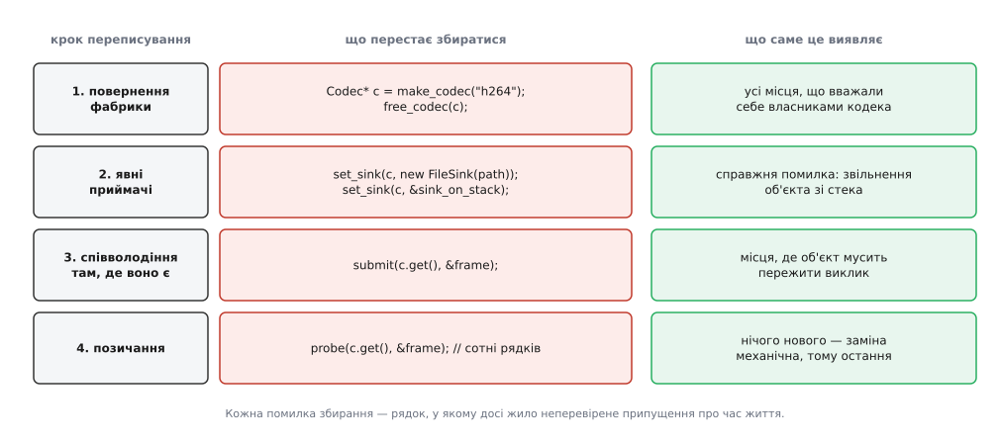

# ⚙️ Переписати старий API під явне володіння

Це розбір справжньої роботи: узяти заголовок, у якому всі параметри — сирі вказівники, і перекласти його на типи, що самі кажуть, хто кого видаляє. Найцінніше тут не остаточний вигляд заголовка, а порядок кроків і те, що після кожного кроку перестає збиратися.

## Що переписуємо

```cpp
// media.h, 2009 рік. Коментарі — увесь контракт, який був.
struct Codec;
struct Frame;
struct Sink;

Codec* make_codec(const char* fourcc);      // 0, якщо кодек невідомий
void   free_codec(Codec* c);
void   set_sink(Codec* c, Sink* s);         // «sink лишається за вами»
bool   probe(Codec* c, const Frame* f);     // f можна 0
void   submit(Codec* c, const Frame* f);    // декодує в робочому потоці
Codec* current_codec();                     // 0, поки нічого не відкрито
```

Шість рядків не відповідають на три питання: хто зобов'язаний викликати `free_codec`, чи запам'ятовує бібліотека передані адреси і доки чинне те, що повертає `current_codec`. Коментарі щось про це кажуть — але коментар не збирається разом з кодом і старіє мовчки.

## Крок 0: аудит, у якому джерело правди — тіло, а не коментар

Для кожного оголошення треба відповісти на одне питання: що станеться з аргументом після повернення керування. Відповідь дає реалізація, тож її і відкривають.

`set_sink` виконує `c->sink = s`, а розбирання кодека — `free_sink(c->sink)`. Кодек забирає sink собі; коментар «лишається за вами» — неправда, і кожен, хто йому повірив і звільнив sink власноруч, живе з подвійним звільненням. `submit` кладе в чергу робочого потоку пару «вказівник на кодек, копія кадру»: кодек потрібен після повернення, причому потрібен незалежно від того, що вирішить робити далі викликач. `probe` читає поля й нічого не запам'ятовує. `current_codec` віддає адресу елемента внутрішнього реєстру, чинну, доки реєстр не перебудують.

Там, де тіло не дає відповіді, її визначають місця виклику: пошук по `free_codec(` показує, хто вважає себе власником. Цей перелік і є карта володіння, якої в заголовку немає. Уся подальша робота — перенести карту в типи.

## Крок 1: починати з повернень

Володіння входить у програму в одному місці — там, де об'єкт створюється. Тому фабрика йде першою: щойно вона віддає власницький тип, кожен нащадок її результату нижче за течією зобов'язаний назватися.

```cpp
struct CodecDeleter {
    void operator()(Codec* c) const noexcept { free_codec(c); }
};
using CodecPtr = std::unique_ptr<Codec, CodecDeleter>;

CodecPtr make_codec(std::string_view fourcc);   // порожній — кодек невідомий
```

Кодек звільняє не `delete`, а `free_codec`, тож [`unique_ptr`](topic:sys-plang-cpp/unique-ptr) дістає власного видаляча. Видаляч зроблено класом без полів навмисно: порожня база місця не займає, і `CodecPtr` лишається завбільшки з голий вказівник. Передали б видаляча вказівником на функцію (`decltype(&free_codec)`) — об'єкт став би удвічі більший, бо адресу довелося б зберігати в кожному примірнику; механіка цієї безкоштовності — [оптимізація порожньої бази](topic:sys-plang-cpp/empty-base-optimization).

Ламається рівно те, що мало: `Codec* c = make_codec("h264");` більше не збирається, і `free_codec(c)` над результатом фабрики — теж. Це не прикрість, а результат кроку: перелік помилок і є перелік місць, які вважали себе власниками. Тепер він у виводі компілятора, а не в чиїйсь пам'яті.

## Крок 2: приймачі, які й так забирали

```cpp
void set_sink(Codec& c, std::unique_ptr<Sink> s);
void set_sink(Codec&, Sink*) = delete;          // старий виклик падає з іменем функції
```

Перше оголошення вимовляє те, що функція робила весь час. Друге варте окремого слова. Спокуса на цьому кроці — лишити поруч стару форму з `Sink*`, «щоб нічого не зламалося», але саме вона поверне мовчання, заради усунення якого все й затіяли: старі місця виклику збиратимуться далі й далі означатимуть невідомо що. Видалене перевантаження дає протилежне — те саме місце виклику падає, і падає з назвою функції в тексті помилки замість плутанини про відсутнє перетворення.

Дві старі форми виклику падають по-різному, і друга — знахідка:

```cpp
set_sink(*c, new FileSink(path));   // ✗ механічна правка: std::make_unique<FileSink>(path)
set_sink(*c, &sink_on_stack);       // ✗ і добре: кодек звільняв би об'єкт зі стека
```

Другий рядок збирався десять років і рівно стільки ж був дефектом, якого ніхто не бачив: звучав він аварією в іншому місці й у інший час.

## Крок 3: співволодіння лише там, де воно справжнє

`submit` віддає кодек у чергу чужого потоку, тож функції потрібна власна гарантія життя, а не обіцянка викликача.

```cpp
void submit(std::shared_ptr<Codec> c, Frame f);
```

Копія за значенням, не `const shared_ptr<Codec>&`: сенс саме в тому, щоб лічильник виріс на час, поки чергу не розгребли — інакше [спільне володіння](topic:sys-plang-cpp/shared-weak-ptr) не дає нічого. `Frame` за значенням теж не забаганка: копія кадру відбувалася й раніше, просто всередині, а тепер вона видима в типі.

Тут стає видно, чому фабрика повертає саме `unique_ptr`, хоч частина викликачів потребує спільного володіння.

```cpp
// синхронний шлях: власник один, платити нема за що
CodecPtr c = make_codec("h264");
if (c && probe(*c, &first))
    decode_here(*c, first);

// асинхронний шлях: розширюємо форму один раз, при створенні
std::shared_ptr<Codec> shared = make_codec("h264");  // unique → shared, видаляч переїжджає
submit(shared, first);                               // лічильник = 2, черга тримає своє
```

Перехід `unique_ptr` → `shared_ptr` дозволено й відбувається сам, а зворотного немає: із `shared_ptr` не дістати одноосібного володіння, бо ніхто не знає, чи ти останній власник. Тому вужча форма на поверненні — не суворість заради суворості, а єдиний порядок, за якого вибір лишається у викликача.

## Крок 4: позичання наприкінці

```cpp
bool probe(const Codec& c, const Frame* f);   // обов'язковий; необов'язковий
```

Правка на місцях виклику суто механічна: `probe(c.get(), f)` перетворюється на `probe(*c, f)`. Саме тому крок останній — він дає найбільший діф і найменше знань. Сотні однакових замін нічого не з'ясовують про програму, зате чудово ховають у собі десяток значущих помилок кроків 1–3, якби їх зробили одночасно.

`current_codec` лишається `Codec*`: це позичання, віддане назовні, і тип для нього був правильний із самого початку. Змінюється не тип, а те, що строк чинності нарешті записано. Машинно такі строки закріплюють розміткою — `not_null` з [бібліотеки підтримки настанов](topic:sys-plang-cpp/gsl-support-library) або атрибутом `[[clang::lifetimebound]]` на параметрі, після якого компілятор попереджає, коли повернене посилання переживає те, з чого воно взялося:

```cpp
const std::string& codec_name(const Codec& c [[clang::lifetimebound]]);

const std::string& n = codec_name(*make_codec("h264"));  // ⚠ попередження: джерело вже мертве
```



*Значущих помилок мало, механічних багато; порядок кроків обрано так, щоб перші не потонули в других.*

## Чому зламане місце виклику — вигода

Заперечення на рев'ю звучить завжди однаково: переписування ламає триста місць виклику. Ламає — і це те, за що платять.

Візьмімо рядок `free_codec(c);` у старому коді. Він перебуває в одному з трьох станів: правильний; зайвий, бо об'єкт уже звільнили деінде; відсутній там, де мав би бути. Усі три виглядають абсолютно однаково — це буквально той самий текст. Тесту, який їх розрізняє, не існує, бо неправильні спрацьовують лише на певному порядку подій, а падають далеко від причини, вже [зверненням до мертвої пам'яті](topic:sys-plang-cpp/dangling-references).

Переписування цих помилок не створює. Воно перетворює їх на список — скінченний, перелічуваний, з номерами рядків, отриманий за час збирання й на власній машині. Обмін тут чесний і дуже вигідний: невідома кількість помилок часу виконання йде за відому кількість помилок часу збирання.

Зворотне так само правдиве. Єдиний спосіб нічого не зламати — лишити шлях, яким старий аргумент проходить мовчки: сумісне перевантаження, неявне перетворення з сирого вказівника, `.get()` у виклику. Тоді старі місця збираються — і далі не кажуть нічого. Звідси проста перевірка кроку: якщо після зміни сигнатури все зібралося з першого разу, контракт не змінився, змінилися назви типів.

## Ціна й пастки

Форма цифр у такому переписуванні майже не залежить від проєкту, і в ній уся підказка про порядок:

```
бібліотека середнього розміру, ≈300 місць виклику

крок 1  повернення      ≈ 40 помилок  →  40 окремих рішень «хто власник»
крок 2  приймачі        ≈  7 помилок  →   1 справжній дефект
крок 3  співволодіння   ≈ 10 помилок  →  10 місць, де об'єкт переживає виклик
крок 4  позичання       ≈300 помилок  →   0 рішень, заміна .get() → *
```

**Двійкова сумісність.** Змінена сигнатура — це змінене спотворене ім'я символу, тож стара скомпільована програма з новою бібліотекою не злінкується. Усередині одного дерева вихідних текстів це не коштує нічого, а для бібліотеки, яку постачають бінарно, переписування їде разом із мажорною версією — ширше про це у [стабільності ABI](topic:sys-plang-cpp/abi-stability-cpp).

**Межа з C.** Через [`extern "C"`](topic:sys-plang-cpp/extern-c-interop) власницькі типи не проходять — там лишається сирий вказівник, і це законно. Правило просте: сирий вказівник живе рівно один рядок — перший рядок обгортки, де його всиновлює `unique_ptr`, або останній, де його віддають через `release()`.

**Неповний тип.** `CodecPtr` як член класу вимагає, щоб `Codec` був повним там, де компілюється деструктор власника, — тому деструктор оголошують у заголовку, а визначають у `.cpp`. Це та сама механіка, на якій тримається [PIMPL](topic:sys-plang-cpp/pimpl), і найчастіша причина незрозумілої помилки одразу після кроку 1.

**Поліморфне видалення.** Тут його немає, бо звільняє `free_codec`, але у звичайному `unique_ptr<Base>` видалення похідного об'єкта через базовий вказівник вимагає [віртуального деструктора](topic:sys-plang-cpp/virtual-destructor) — інакше переписування додає нову тиху помилку замість того, щоб прибирати старі.

**Коли ламати одразу не можна.** Якщо заголовок публічний і споживачі живуть поза твоїм деревом текстів, різати в одному коміті нема як. Чесний поетапний шлях один: нове ім'я з новим контрактом поруч зі старим, позначеним `[[deprecated]]`, і викидання старого через реліз. Саме нове ім'я, а не перевантаження старого — попередження про застарілість теж називає місце виклику поіменно, тоді як перевантаження мовчки лишає його в старому світі.

**Найпоширеніша хибна економія.** Замінити всі сирі вказівники на `shared_ptr` — це переписування, яке збирається з першого разу й не з'ясовує нічого. Невідомий час життя нікуди не дівається: він стає невизначеним, зате без падінь, а натомість з'являються цикли посилань і місця знищення, які неможливо назвати наперед.
