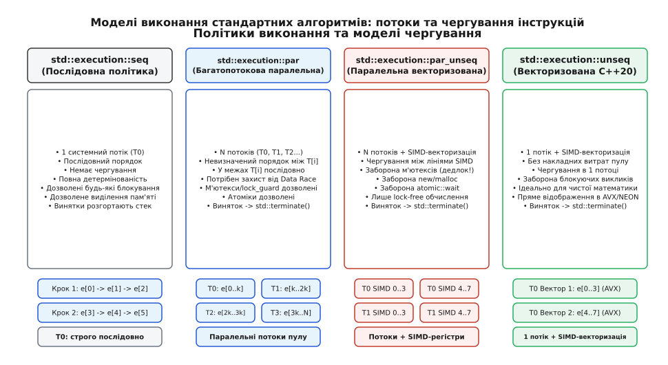
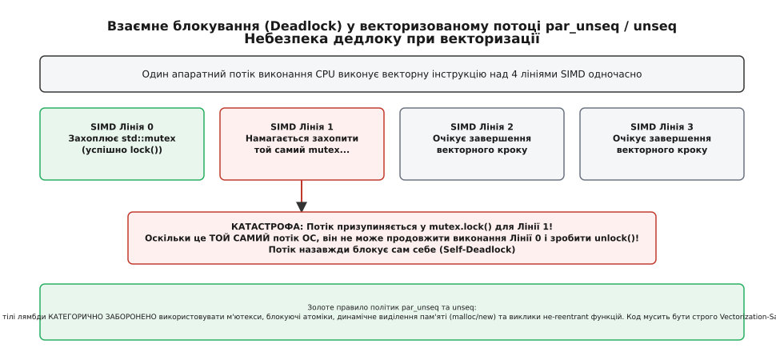
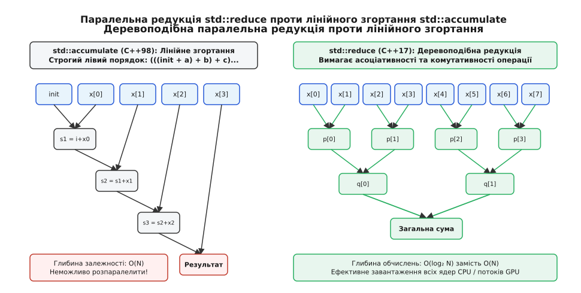
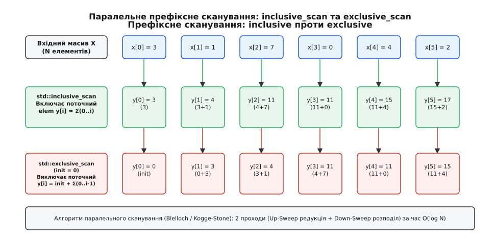

# Політики виконання й паралельні алгоритми

<preknowlist>
- [Алгоритми STL](topic:sys-plang-cpp/stl-algorithms) — класична модель узагальнених алгоритмів Степанова та робота з ітераторами.
- [thread і jthread: запуск, приєднання, скасування](topic:sys-plang-cpp/std-thread-jthread) — низькорівнева модель системних потоків C++11/C++20.
- [М'ютекси й RAII-блокування](topic:sys-plang-cpp/mutex-and-raii-locks) — синхронізація доступу до спільних ресурсів та взаємні виключення.
</preknowlist>

Коли стандартний алгоритм (від латинізованого імені середньовічного перського математика аль-Хорезмі) на кшталт `std::sort`, `std::transform` або `std::find` запускається на масиві зі ста мільйонів 64-бітних цілих чисел на сучасному серверному процесорі з 64 фізичними ядрами, операційна система виділяє для його обчислення рівно одне апаратне ядро. Це єдине ядро вичитує дані з оперативної пам'яті з реальною швидкістю близько 3–4 ГБ/с, виконуючи інструкції строго послідовно одна за одною. Решта 63 ядер, а також широкі 256-бітні та 512-бітні векторні регістри SIMD (Single Instruction, Multiple Data; вектор від лат. *vector* — той, що несе) на всіх ядрах, залишаються абсолютно нерухомими, хоча апаратна шина пам'яті здатна прокачувати понад 200 ГБ/с.

Причина такого простою криється в базовому контракті, закладеному в стандартну бібліотеку шаблонів (STL) ще у 1994 році: кожен класичний алгоритм гарантував строго детермінований, послідовний порядок обходу елементів від початку до кінця. Щоб подолати цей розрив між архітектурою багатоядерного кремнію та абстрактною машиною мови, стандарт C++17 ввів у заголовки `<execution>`, `<algorithm>` та `<numeric>` модель політик виконання (Execution Policies; політика від грец. *πολιτική* — мистецтво управління, паралельний від грец. *παράλληλος* — той, що йде поруч). Передача тегу політики першим аргументом дозволяє розробнику явно дозволити компілятору та runtime-бібліотеці відмовитися від фіксованого порядку викликів, розбити вхідний діапазон на незалежні порції, розподілити їх між пулом потоків ОС та задіяти векторні лінії процесора.

Шлях, який пройшла мова від зовнішніх бібліотек OpenMP та Intel TBB до стандартизації політик у C++17 і додавання суто векторного режиму у C++20, детально висвітлює [історичний огляд еволюції паралельних обчислень](topic:sys-plang-cpp/parallel-algorithms/hist-parallel-algorithms.md).

---

## 1. Архітектура заголовка `<execution>`: типи та глобальні об'єкти політик

Політика виконання (Execution Policy) у C++ є класом-тегом без власного внутрішнього стану (stateless type). Її єдине завдання — на етапі компіляції вибрати відповідне перевантаження шаблонної функції алгоритму, а на етапі виконання повідомити планувальнику про допустимі механізми конкурентного виконання (конкурентність від лат. *concurrere* — збігатися, бігти разом).

Усі класи політик визначено в просторі імен `std::execution`. Вони підтримують стандартне конструювання, копіювання та гарантують відсутність винятків при знищенні об'єкта (`nothrow`). Для безпосереднього використання стандарт надає чотири глобальні константні екземпляри:

```cpp
namespace std::execution {
    // Послідовне детерміноване виконання (C++17)
    class sequenced_policy { /* реалізаційно-визначено */ };
    inline constexpr sequenced_policy seq{};

    // Паралельне багатопотокове виконання (C++17)
    class parallel_policy { /* реалізаційно-визначено */ };
    inline constexpr parallel_policy par{};

    // Паралельне багатопотокове та векторизоване SIMD-виконання (C++17)
    class parallel_unsequenced_policy { /* реалізаційно-визначено */ };
    inline constexpr parallel_unsequenced_policy par_unseq{};

    // Однопотокове векторизоване SIMD-виконання (C++20)
    class unsequenced_policy { /* реалізаційно-визначено */ };
    inline constexpr unsequenced_policy unseq{};
}
```

Для метапрограмування та концептуальних обмежень стандарт надає типаж `std::is_execution_policy_v<T>`, який повертає `true` лише для офіційних політик або схвалених компіляторних розширень.


*Чотири моделі виконання стандартних алгоритмів: від суто послідовного виклику в одному потоці до багатопотокового SIMD-чергування.*

Кожна політика формує окремий набір гарантій щодо того, як саме викликаються функції доступу до елементів (Element Access Functions) — передані користувачем лямбда-вирази, компаратори та функціональні об'єкти:

1. **`std::execution::seq` (Sequenced Policy):** Алгоритм виконується строго в тому системному потоці, з якого його викликано. Усі операції над елементами впорядковані одна відносно одної. Це дає повну детермінованість поведінки й дозволяє без обмежень використовувати блокуючі примітиви синхронізації (`std::mutex`, `std::condition_variable`), локальні змінні потоку та динамічне виділення пам'яті.
2. **`std::execution::par` (Parallel Policy):** Обчислення дозволено розподіляти між довільною кількістю паралельних системних потоків (через внутрішній пул задач). Виклики в межах різних потоків не впорядковані між собою, проте в межах кожного окремого потоку операції залишаються строго послідовними (не чергуються на рівні інструкцій). У цій політиці дозволено використання м'ютексів та атоміків для захисту спільних ресурсів, проте відповідальність за відсутність гонок даних (Data Races) повністю покладається на розробника.
3. **`std::execution::par_unseq` (Parallel and Unsequenced Policy):** Обчислення виконуються множиною системних потоків, і додатково в межах кожного потоку компілятор має право переставляти та чергувати інструкції за допомогою апаратної SIMD-векторизації. Операції над елементами можуть виконуватися фрагментарно: крок обробки елемента `i` може стартувати на векторному регістрі до завершення кроку над елементом `j` на тому самому ядрі процесора.
4. **`std::execution::unseq` (Unsequenced Policy, C++20):** Алгоритм виконується строго в одному викликаючому потоці ОС, але компілятору дозволено векторизувати цикл за допомогою регістрів SIMD (AVX, SSE, ARM NEON). Це повністю усуває будь-які накладні витрати на пул потоків і планувальник, забезпечуючи високу швидкість обробки масивів помірного розміру на одному ядрі.

Повний опис типів, сигнатур алгоритмів та правил перевантаження містить [довідник інтерфейсу політик виконання](topic:sys-plang-cpp/parallel-algorithms/api-execution-policies.md).

---

## 2. Гарантії просування та небезпека дедлоку при векторизації

Ключова відмінність між чисто багатопотоковою політикою `par` та векторизованими політиками `par_unseq` і `unseq` полягає у формальних гарантіях просування вперед (Forward Progress Guarantees). Розуміння цих гарантій захищає програму від фатальних зависань, які неможливо виявити звичайними багатопотоковими дебагерами.

Стандарт розрізняє два фундаментальні рівні просування:
- **Паралельне просування вперед (Concurrent Forward Progress):** Діє для політики `par`. Якщо потік ОС розпочав виконання кроку, система гарантує, що він зрештою отримає квант процесорного часу й просунеться далі незалежно від дій інших потоків. Якщо потік A зупинився на м'ютексі в очікуванні потоку B, потік B продовжить виконання на іншому ядрі й своєчасно звільнить ресурс.
- **Слабопаралельне просування вперед (Weakly Parallel Forward Progress):** Діє для політик `par_unseq` та `unseq`. Окремі векторні лінії (SIMD lanes) процесора не є незалежними системними потоками — вони виконуються єдиним апаратним конвеєром фізичного ядра. Якщо одна векторна лінія заблокується, заблокується все процесорне ядро.


*Взаємне блокування (Vectorization Deadlock) у політиці `par_unseq`: спроба захоплення м'ютексу у векторизованому потоці зупиняє єдиний апаратний потік процесора.*

Розглянемо детальний механізм самоблокування (Vectorization Deadlock / Self-Deadlock), зображений на схемі вище. Припустимо, розробник передав у `std::for_each(std::execution::par_unseq, ...)` лямбду, яка захоплює стандартний м'ютекс:

```cpp
// КАТАСТРОФІЧНИЙ АНТИПАТЕРН: використання м'ютексу в par_unseq
std::mutex mtx;
std::vector<int> data(1'000'000);

std::for_each(std::execution::par_unseq, data.begin(), data.end(), [&](int& x) {
    std::lock_guard<std::mutex> lock(mtx); // НЕВИЗНАЧЕНА ПОВЕДІНКА / САМОБЛОКУВАННЯ!
    x = compute_heavy(x);
});
```

Коли оптимізуючий компілятор транслює цей код у векторні інструкції AVX-512, одне ядро процесора обробляє одночасно 16 елементів масиву (векторні лінії 0..15). 
1. Векторна лінія 0 першою входить у тіло функції й успішно викликає `mtx.lock()`. М'ютекс переходить у заблокований стан, фіксуючи ідентифікатор поточного потоку ОС.
2. Тієї ж миті в межах того самого мікрокомандного такту лінія 1 намагається викликати `mtx.lock()` над тим самим об'єктом. Оскільки м'ютекс уже зайнятий лінією 0, лінія 1 призупиняє виконання апаратного потоку до моменту звільнення ресурсу.
3. Проте системний потік ОС на цьому фізичному ядрі лише один. Призупинившись на лінії 1, він фізично позбавлений можливості перейти до виконання `mtx.unlock()` на лінії 0. Ядро процесора назавжди зависає в мертвому очікуванні самого себе.

З цієї причини для функцій, що передаються у політики `std::execution::par_unseq` та `std::execution::unseq`, діє суворе поняття безпеки векторизації (Vectorization-Safe). У тілі таких функцій **категорично заборонено**:
- Захоплювати м'ютекси (`std::mutex`, `std::shared_mutex`), спінлоки чи примітиви блокування будь-якого типу.
- Викликати блокуючі методи очікування на атоміках (`std::atomic::wait`).
- Виконувати динамічне виділення або звільнення пам'яті (`malloc`, `free`, оператори `new` та `delete`), оскільки системні менеджери купи за замовчуванням містять внутрішні м'ютекси для захисту структур адресних блоків.
- Використовувати `thread_local` об'єкти з нетривіальними деструкторами або викликами ініціалізації.
- Викликати будь-які функції, що не є повторно входжуваними (non-reentrant) або зберігають спільний статичний стан.

Операції в `par_unseq` та `unseq` мусять бути чистими математичними перетвореннями над локальними регістрами або застосовувати неблокуючі lock-free атомарні інструкції без очікування (`fetch_add` з відповідним порядком пам'яті).

---

## 3. Обробка винятків: відмова від списку винятків і виклик `std::terminate()`

У традиційному однопотоковому C++ виняток, викинутий усередині предикату, перериває цикл, виконує розкрутку стека (stack unwinding) зі знищенням локальних об'єктів і передає керування у відповідний блок `catch`. 

У паралельному алгоритмі ситуація кардинально ускладнюється. Коли масив обробляється 64 потоками, кілька потоків на різних ядрах можуть одночасно викинути принципово різні винятки (наприклад, `std::bad_alloc`, `std::out_of_range` та користувацький тип помилки). Під час розробки специфікації Parallelism TS у комітеті WG21 розглядалася концепція створення спеціального контейнера `std::exception_list`, який би акумулював усі винятки з усіх потоків і повертав їх користувачеві у вигляді зведеного пакета.

Проте інженерний аналіз та практичні вимірювання швидкості показали, що підтримка `std::exception_list` повністю руйнує ідею високопродуктивного паралелізму:
1. **Накладні витрати на векторизацію:** Щоб перехоплювати винятки на рівні кожної векторної лінії SIMD, компілятор був би змушений генерувати громіздкі таблиці розкрутки для кожного елемента або вставляти приховані атомарні прапорці стану. Це повністю блокує автоматичну генерацію інструкцій AVX-512 та перетворює векторний код на повільний набір скалярних розгалужень.
2. **Синхронізація під час збою:** Кожен потік, що викинув виняток, мусив би захоплювати глобальний блокувальний примітив для додавання об'єкта винятку до списку, спричиняючи масивні просідання продуктивності та контеншн.

З огляду на це комітет стандартизації затвердив жорсткий, але технічно виправданий контракт безпеки:

```cpp
// ПРАВИЛО СТАНДАРТУ C++:
// Якщо функція доступу до елементів у паралельному алгоритмі
// завершується викиданням винятку, який не перехоплено локально,
// стандартна бібліотека негайно викликає std::terminate().
```

Це означає, що паралельний алгоритм не дозволяє виняткам залишати межі користувацької лямбди. Якщо всередині функції можлива помилка, розробник зобов'язаний обробити її локально за допомогою блоку `try/catch` або спроєктувати логіку без використання винятків:

:::tabs
```cpp
// Правильний підхід: локальна ізоляція помилок у паралельному коді
#include <algorithm>
#include <execution>
#include <vector>
#include <optional>
#include <iostream>

struct ProcessResult {
    int id;
    std::optional<double> value;
    std::string error_message;
};

void process_data_safely(const std::vector<int>& inputs, std::vector<ProcessResult>& outputs) {
    outputs.resize(inputs.size());

    std::transform(std::execution::par, inputs.begin(), inputs.end(), outputs.begin(), [](int x) {
        ProcessResult res;
        res.id = x;
        try {
            if (x < 0) {
                throw std::invalid_argument("Від'ємне значення неприпустиме");
            }
            res.value = 100.0 / x; // Можливе ділення на нуль або помилка
        } catch (const std::exception& ex) {
            res.value = std::nullopt;
            res.error_message = ex.what();
        } catch (...) {
            res.value = std::nullopt;
            res.error_message = "Невідома помилка";
        }
        return res;
    });
}
```
```c
/* Еквівалент мовою C: ручне потокове виконання з поверненням кодів помилок */
#include <stdio.h>
#include <stdlib.h>
#include <pthread.h>

typedef struct {
    int id;
    double value;
    int has_value;
    char error_message[64];
} ProcessResultC;

typedef struct {
    const int* inputs;
    ProcessResultC* outputs;
    size_t start;
    size_t end;
} WorkerTask;

void* worker_func(void* arg) {
    WorkerTask* task = (WorkerTask*)arg;
    for (size_t i = task->start; i < task->end; ++i) {
        int x = task->inputs[i];
        task->outputs[i].id = x;
        if (x < 0) {
            task->outputs[i].has_value = 0;
            snprintf(task->outputs[i].error_message, 64, "Від'ємне значення неприпустиме");
        } else if (x == 0) {
            task->outputs[i].has_value = 0;
            snprintf(task->outputs[i].error_message, 64, "Ділення на нуль");
        } else {
            task->outputs[i].value = 100.0 / x;
            task->outputs[i].has_value = 1;
            task->outputs[i].error_message[0] = '\0';
        }
    }
    return NULL;
}
```
:::

Єдиний випадок, коли сам виклик паралельного алгоритму може викинути виняток у точку виклику — це `std::bad_alloc`, якщо внутрішній планувальник бібліотеки не зміг виділити оперативну пам'ять для ініціалізації пулу задач або керуючих структур даних.

---

## 4. Бекенди реалізації: Intel oneTBB, OpenMP та планування задач

Стандарт C++ навмисно не фіксує конкретну реалізацію паралелізму на системному рівні: у стандарті відсутні згадки про конкретні системні виклики операційних систем чи інструкції процесора. Поведінка алгоритмів визначається тим, який саме runtime-рушій підключено до стандартної бібліотеки.

На практиці існують три основні класи бекендів:

```
┌────────────────────────────────────────────────────────┐
│            Стандартний код C++ (ISO C++17/C++20)        │
│   std::sort(std::execution::par_unseq, first, last);   │
└───────────────────────────┬────────────────────────────┘
                            │
            ┌───────────────┴───────────────┐
            ▼                               ▼
┌───────────────────────┐       ┌───────────────────────┐
│     GCC libstdc++     │       │       MSVC STL        │
│   (Intel oneTBB /     │       │    (Intel oneTBB /    │
│    OpenMP backend)    │       │    Windows PPL / PPLX)│
└───────────┬───────────┘       └───────────┬───────────┘
            │                               │
            └───────────────┬───────────────┘
                            ▼
┌────────────────────────────────────────────────────────┐
│             Апаратні ресурси системи                   │
│   [Пул потоків ОС] ─── [Планувальник Work-Stealing]    │
│   [SIMD-векторизація: AVX2 / AVX-512 / ARM NEON]       │
└────────────────────────────────────────────────────────┘
```

### 1. Intel oneTBB (Threading Building Blocks)
oneTBB є найбільш зрілим, масштабованим та фактично стандартним бекендом для GNU `libstdc++` (починаючи з GCC 9) та Microsoft Visual C++ STL. Замість наївного створення нових потоків операційної системи на кожен виклик алгоритму, TBB реалізує передову модель планувальника із захопленням задач (Work-Stealing Task Scheduler):
- Вхідний масив ділиться на дрібні пакети (tasks) за логарифмічним принципом подвійного розбиття.
- Кожне ядро процесора володіє власною локальною чергою задач у форматі двобічної черги (deque).
- Робочий потік ядра додає та витягує власні підзадачі з верхівки стека (head/top) у порядку LIFO (Last In, First Out), що забезпечує ідеальну локальність кешу даних L1/L2.
- Якщо одне ядро завершило обробку своїх пакетів швидше за інші (наприклад, через нерівномірну складність предикату фільтрації), воно автоматично «краде» задачі з протилежного кінця черги (tail/bottom) завантаженого ядра у порядку FIFO. Це усуває конфлікти доступу (contention) до черги між потоком-власником і потоком-злодієм, гарантуючи автоматичне балансування навантаження без використання глобальних м'ютексів.

### 2. OpenMP (Open Multi-Processing)
У деяких дистрибутивах Linux та збірках LLVM `libc++` паралельні алгоритми реалізуються через бібліотеку `libgomp` або `libomp`. Вона використовує прагматичний розподіл циклів між статично створеною групою потоків:
- **Static scheduling:** Діапазон строго ділиться на `N` рівних частин за кількістю ядер. Ідеально підходить для задач, де час обробки кожного елемента абсолютно однаковий.
- **Dynamic scheduling:** Потоки динамічно беруть нові порції даних фіксованого розміру через спільний атомарний лічильник зміщення.

### 3. GPU та гетерогенні бекенди (Thrust, oneAPI DPC++, CUDA)
Для обчислень на графічних прискорювачах використовуються спеціалізовані реалізації, такі як NVIDIA Thrust або Intel oneAPI DPC++. У цих середовищах політики виконання транслюються у запуск тисяч легкопереважних потоків на ядрах GPU (CUDA Threads / Execution Units), де пам'ять передається через механізм уніфікованої віртуальної пам'яті (Unified Memory).

### Накладні витрати планування (Scheduling Overhead)
Паралелізм не є безкоштовним. Кожен запуск паралельного алгоритму вимагає часу на створення структур задач, передачу дескрипторів потокам та фінальну бар'єрну синхронізацію (Join/Barrier). 
- Якщо масив містить усього 500 цілих чисел, послідовний виклик `std::sort(std::execution::seq, ...)` виконається за **0.8 мікросекунди**.
- Той самий виклик із політикою `std::execution::par` витратить **15–20 мікросекунд** лише на взаємодію з планувальником пулу потоків, продемонструвавши 20-кратне уповільнення.
- Емпіричне правило полягає в тому, що багатопотоковий паралелізм `par` дає чистий виграш лише тоді, коли сумарна кількість елементарних операцій у масиві перевищує **10 000 – 50 000 ітерацій**, або коли функція обробки кожного елемента є обчислювально важкою.

---

## 5. Вимоги до ітераторів та алгоритмічна декомпозиція

Ефективність паралельного алгоритму фундаментально залежить від категорії ітераторів (Iterator Category), через які передаються межі послідовності.

У класичному однопотоковому C++ більшість алгоритмів (наприклад, `std::find_if` або `std::copy`) вимагають лише мінімального ітератора введення (`InputIterator`) або прямого односпрямованого ітератора (`ForwardIterator`). Алгоритм просто виконує операцію інкременту `++it` крок за кроком, доки не досягне кінцевого ітератора `last`.

Для паралельного виконання такий послідовний обхід є катастрофою:

```
[Початок] ──> [елем 0] ──> [елем 1] ──> ... ──> [елем N/2] ──> ... ──> [Кінець]
                │
                └─ Щоб знайти середину в std::list, треба зробити N/2 кроків O(N)!
```

Якщо передати в паралельний алгоритм ітератори від односпрямованого списку `std::list` чи `std::forward_list`:
1. Щоб розділити список на дві рівні частини для обробки двома потоками, планувальник змушений виконати `N/2` послідовних розіменувань вказівників, витрачаючи час `O(N)`.
2. Поки один потік шукає середину списку, усі інші процесорні ядра простоюють.
3. Елементи зв'язного списку розкидані по різних ділянках динамічної пам'яті (купи), що спричиняє постійні промахи повз апаратний кеш процесора (Cache Misses) та унеможливлює векторне завантаження SIMD.

Тому стандарт встановлює строгі правила:
- Більшість паралельних алгоритмів вимагають щонайменше `ForwardIterator` (ітератори введення `InputIterator` заборонені в паралельних перевантаженнях).
- Максимальна масштабованість досягається виключно на ітераторах довільного доступу (`RandomAccessIterator`) та неперервних ітераторах (`ContiguousIterator`), які надають контейнери `std::vector`, `std::array` або `std::span`.

При використанні `RandomAccessIterator` планувальник миттєво обчислює адресу середини за час `O(1)` шляхом простої адресної арифметики `mid = first + (last - first) / 2`. Це дозволяє рекурсивно розщеплювати діапазон на десятки незалежних блоків у нульовий час і негайно запускати всі ядра процесора.

### Проблема помилкового розділення (False Sharing)
При проєктуванні паралельних алгоритмів модифікації даних особливу небезпеку становить явище False Sharing (помилкове розділення кеш-ліній). Процесор обмінюється даними з оперативною пам'яттю блоками по 64 байти (Cache Line). Якщо потік 1 на ядрі 0 записує результат у комірку `out[0]`, а потік 2 на ядрі 1 записує в комірку `out[1]`, обидві комірки фізично розміщені в межах однієї 64-байтової кеш-лінії. 

Апаратний протокол когерентності кешів (MESI/MOESI) змушений постійно інвалідувати та пересилати цю лінію між кешами L1 двох ядер, знижуючи швидкість виконання програми у 10–50 разів. Для уникнення цієї пастки паралельні алгоритми стандартної бібліотеки розбивають вихідні діапазони на суцільні блоки розміром у тисячі елементів, гарантуючи, що різні потоки пишуть у різні кеш-лінії.

---

## 6. Паралельні редукції: `std::reduce` проти `std::accumulate`

Одним із найважливіших нововведень стандарту C++17 стала поява заголовка `<numeric>` із функціями паралельної редукції (редукція від лат. *reductio* — повернення, зведення назад). До C++17 базовим інструментом підсумовування масивів був класичний алгоритм `std::accumulate`. Проте спроба додати політику виконання до `std::accumulate` виявилася принципово неможливою через математичну специфікацію цього алгоритму.

Алгоритм `std::accumulate` за стандартом зобов'язаний виконувати лівоасоціативне послідовне згортання:

```
Результат = (((((init + x[0]) + x[1]) + x[2]) + x[3]) + ...)
```

Кожна наступна операція строго залежить від результату попередньої. Глибина ланцюга залежностей становить `O(N)`. Цей алгоритм є за своєю природою послідовним і не може бути розпаралелений жодним компілятором у світі.


*Порівняння послідовного накопичення `std::accumulate` з глибиною залежності `O(N)` та паралельного дерева `std::reduce` з глибиною `O(log N)`.*

Для розв'язання цієї проблеми стандарт ввів алгоритм `std::reduce`. Він вимагає від переданої бінарної операції виконання двох фундаментальних алгебраїчних властивостей:
1. **Асоціативність:** `(a + b) + c = a + (b + c)`
2. **Комутативність:** `a + b = b + a`

Завдяки цим властивостям `std::reduce` будує паралельне бінарне дерево обчислень:
- Масив із `N` елементів ділиться на пари. Усі пари додаються одночасно на всіх доступних ядрах і векторних регістрах за 1 паралельний крок.
- Отримані часткові суми знову групуються попарно й підсумовуються.
- Загальна кількість паралельних кроків становить `O(log₂ N)` замість `O(N)`.

```cpp
#include <numeric>
#include <execution>
#include <vector>
#include <iostream>

void demonstrate_reduction() {
    std::vector<double> values(10'000'000, 1.0);

    // 1. Послідовне лінійне згортання C++98 (O(N) кроків)
    double sum_seq = std::accumulate(values.begin(), values.end(), 0.0);

    // 2. Паралельне деревоподібне згортання C++17 (O(log N) глибина)
    double sum_par = std::reduce(std::execution::par_unseq, values.begin(), values.end(), 0.0);

    std::cout << "Сума seq: " << sum_seq << ", Сума par: " << sum_par << '\n';
}
```

### Пастка обчислень із плаваючою комою (Floating-Point Non-Associativity)
Слід пам'ятати про важливий математичний нюанс: апаратне додавання чисел із плаваючою комою стандарту IEEE 754 **не є строго асоціативним** через округлення молодших бітів мантиси:

```
(1e-16 + 1.0) - 1.0 = 0.0
1e-16 + (1.0 - 1.0) = 1e-16
```

Оскільки `std::reduce` групує доданки у довільному деревоподібному порядку залежно від кількості ядер процесора та розміру векторного регістра, підсумковий результат `std::reduce` для масиву типів `float` або `double` може відрізнятися від результату `std::accumulate` у молодших значущих цифрах. Це не є помилкою реалізації — це прямий наслідок зміни порядку операцій заради логарифмічного паралелізму.

### Комбінований алгоритм `std::transform_reduce`
У реальних задачах редукція майже завжди поєднується з попереднім перетворенням даних (патерн Map-Reduce): наприклад, обчислення суми квадратів різниць, пошук середньоквадратичного відхилення чи скалярного добутку векторів.

Якщо виконати це двома послідовними кроками:
```cpp
// НЕЕФЕКТИВНО: подвійне проходження пам'яті та зайва алокація
std::vector<double> diffs(N);
std::transform(std::execution::par, x.begin(), x.end(), diffs.begin(), [](double v) { return v * v; });
double sum = std::reduce(std::execution::par, diffs.begin(), diffs.end());
```
Такий підхід витрачає гігабайти пам'яті під проміжний вектор `diffs` і змушує процесор двічі прокачувати всі дані через вузьку шину пам'яті.

Алгоритм `std::transform_reduce` зливає обидва етапи в єдиний конвеєр:
- Кожен елемент завантажується з пам'яті в регістр рівно один раз.
- Унарна функція трансформації виконується безпосередньо у векторному регістрі.
- Результат негайно акумулюється в локальну суму ядра без збереження у проміжний масив.

Повномасштабний приклад побудови високонавантаженого конвеєра аналізу 10 мільйонів подій за допомогою `std::transform_reduce` містить [проєкт паралельної фільтрації та редукції телеметрії](topic:sys-plang-cpp/parallel-algorithms/proj-parallel-filter-reduce.md).

---

## 7. Префіксні сканування: `std::inclusive_scan` та `std::exclusive_scan`

Префіксне сканування (Prefix Scan; сканування від лат. *scandere* — розміряно читати, сходити), або алгоритм префіксних сум — це фундаментальний будівельний блок паралельних обчислень. На відміну від редукції, яка згортає весь масив в одне єдине скалярне число, сканування формує новий масив тієї ж довжини, де кожен елемент на позиції `i` є результатом згортання всіх попередніх елементів від індексу `0` до `i`.

Стандарт C++17 визначає дві форми сканування:

1. **`std::inclusive_scan` (Включне сканування):** Елемент вихідного масиву `y[i]` включає в себе вхідний елемент `x[i]`:
```
y[0] = x[0]
y[1] = x[0] + x[1]
y[2] = x[0] + x[1] + x[2]
...
y[i] = y[i-1] + x[i]
```

2. **`std::exclusive_scan` (Виключне сканування):** Елемент вихідного масиву `y[i]` обчислюється як сума всіх попередників, **не включаючи** поточний елемент `x[i]`. На першу позицію записується початкове значення `init` (зазвичай 0):
```
y[0] = init
y[1] = init + x[0]
y[2] = init + x[0] + x[1]
...
y[i] = init + Σ(x[0] .. x[i-1])
```


*Префіксне сканування масиву: включне `std::inclusive_scan` зберігає накопичену суму включно з поточним елементом, а виключне `std::exclusive_scan` зміщує суми на один крок праворуч.*

### Де застосовується префіксне сканування
Префіксне сканування є основою для паралельної компактізації даних (Stream Compaction) та паралельної фільтрації (Parallel Filter):
- Припустимо, потрібно відфільтрувати 100 мільйонів записів, залишивши лише ті, що відповідають критерію.
- Крок 1: Кожен потік паралельно записує `1`, якщо елемент валідний, і `0`, якщо ні, формуючи бітову маску.
- Крок 2: Над маскою виконується `std::exclusive_scan`. Отримані значення сканування є **точними індексами зміщення** в результуючому компактному масиві для кожного валідного елемента!
- Крок 3: Усі потоки паралельно записують відфільтровані елементи безпосередньо за обчисленими індексами без жодних гонок даних і без використання м'ютексів.

### Внутрішні паралельні моделі: алгоритми Гілліса-Стіла та Блеллока
Як розпаралелити обчислення, якщо значення `y[i]` залежить від `y[i-1]`? У теорії паралельних обчислень існують два класичні підходи:

1. **Алгоритм Гілліса-Стіла (Hillis-Steele Scan):**
   На кожному кроці `k = 0, 1, 2, ...` елемент `i` додає до себе елемент `i - 2^k`. Кількість паралельних кроків становить `log₂ N`, проте сумарна кількість доданків дорівнює `O(N · log N)`. Цей алгоритм не є оптимальним за кількістю операцій (work-inefficient), проте через просту синхронізацію він широко застосовується на графічних процесорах GPU з тисячами SIMD-ядер.
2. **Алгоритм Блеллока (Guy Blelloch Scan):**
   Оптимальний алгоритм із кількістю операцій `O(N)` (work-efficient), що виконується за два окремі проходи над бінарним деревом:
   - **Етап підйому (Up-Sweep / Parallel Reduction):** Масив розглядається як листя бінарного дерева. Пари елементів підсумовуються знизу вгору. На вершині дерева формується загальна сума всього масиву за `log₂ N` паралельних кроків.
   - **Етап спуску (Down-Sweep / Distribution):** Корінь дерева обнуляється (замінюється на початкове значення `init`). Потім дерево обходиться зверху вниз: на кожному кроці значення лівого нащадка передається у правий, а лівий нащадок отримує суму свого старого значення та значення батьківського вузла. За наступні `log₂ N` кроків правильні префіксні зміщення спускаються до всіх листків масиву.

Загальна кількість арифметичних операцій у схемі Блеллока залишається строго лінійною `O(N)`, що робить її ідеальним вибором для кеш-ієрархій центральних процесорів CPU.

---

> 🔧 **Навіщо це.**
> У практичній розробці перехід від звичайних циклів `for` або одномісних алгоритмів STL до паралельних аналогів `std::execution::par_unseq` дає прискорення обробки великих числових масивів у 15–40 разів на сучасних 16- та 32-ядерних процесорах без необхідності вручну створювати потоки `std::jthread`, керувати примітивами синхронізації чи писати низькорівневі SIMD-інтринсики під кожну мікроархітектуру процесора.

---

## 8. Практичний посібник: вибір політики, конфігурація та типові пастки

Щоб отримати максимальну віддачу від паралельних алгоритмів і не створити прихованих дефектів багатопотоковості, слід керуватися чіткими правилами вибору інструментів.

### Матриця вибору політики виконання

| Характеристика задачі | Рекомендована політика | Чому саме вона |
| :--- | :--- | :--- |
| Числові масиви, математичні формули, `N > 100 000` | `std::execution::par_unseq` | Максимальне прискорення: одночасне використання всіх ядер CPU та SIMD-векторів. |
| Складні об'єкти, що виділяють пам'ять або захоплюють м'ютекси | `std::execution::par` | Безпечна багатопотоковість: операції всередині одного потоку не чергуються, м'ютекси дозволені. |
| Чиста математика над масивами середнього розміру (`1 000 < N < 50 000`) | `std::execution::unseq` (C++20) | Використання апаратних SIMD-регістрів на одному ядрі без накладних витрат на планувальник потоків. |
| Невеликі масиви (`N < 1 000`) або алгоритми зі строгою залежністю стану | `std::execution::seq` | Відсутність накладних витрат пулу потоків, повна детермінованість і простота зневадження. |

### Організація пам'яті: вирівнювання та структура даних (AoS проти SoA)
Для досягнення граничної пропускної здатності при використанні `std::execution::par_unseq` структура даних у пам'яті має вирішальне значення:
- **Масив структур (Array of Structures — AoS):** Коли поля сутності згруповані в єдиний клас `struct { float x, y, z, w; }`, векторне завантаження зчитує суміш компонентів. Компілятор змушений витрачати додаткові цикли на перетасування регістрів (shuffling).
- **Структура масивів (Structure of Arrays — SoA):** Розподіл полів на окремі вектори `x_coords`, `y_coords`, `z_coords` дозволяє виконувати пряме безперервне завантаження вирівняних векторів (Aligned Vector Loads). Це дозволяє апаратному блоку випереджального читання пам'яті (Hardware Stream Prefetcher) завантажувати дані в кеш L1 без жодних затримок, збільшуючи продуктивність ще на 30–60%.

### Чек-лист запобігання фатальним помилкам

1. **Гонки даних при захопленні лямбди за посиланням:**
   Передача лямбди `[&counter](auto& x) { counter++; }` у паралельний алгоритм є грубою помилкою: десятки потоків одночасно модифікують змінну `counter` без синхронізації, що призводить до Data Race та невизначеної поведінки (Undefined Behavior). Застосовуйте `std::atomic<size_t>` або використовуйте алгоритми редукції `std::transform_reduce`.
2. **Алокація пам'яті в `par_unseq`:**
   Конструювання об'єктів `std::string`, `std::vector` або виклики оператора `new` всередині лямбди для `par_unseq` порушують контракт Weakly Parallel Forward Progress і можуть призвести до взаємного блокування потоку в системному алокаторі.
3. **Ітератори правильної категорії:**
   Завжди використовуйте `std::vector`, `std::array` або `std::span` для вхідних даних. Уникайте передачі `std::list` у паралельні виклики.
4. **Компіляція та лінкування з Intel oneTBB:**
   При збірці проєкту під GCC або Clang для роботи політик `par` та `par_unseq` необхідно обов'язково підключати прапорець лінкування `-ltbb` (наприклад, `g++ -O3 -std=c++20 main.cpp -ltbb`). Без встановленої бібліотеки TBB компілятор може аварійно завершити компіляцію або звести виконання паралельного алгоритму до послідовного виклику.

Паралельні алгоритми та політики виконання C++17/C++20 завершили формування сучасної концепції узагальненого програмування: інженер описує бажані операції високорівневими декларативними конструкціями, а компілятор та оптимізований runtime транслюють їх у найефективнішу комбінацію багатопотокового пулу задач та векторних інструкцій мікропроцесора.
