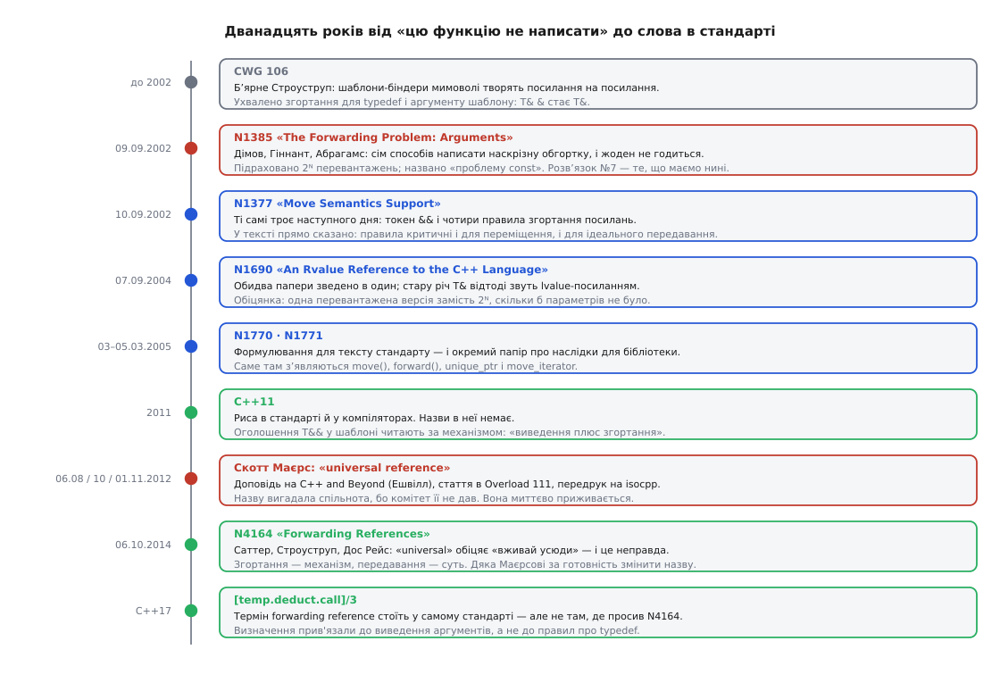

# 📜 Як задачу передавання помітили й закрили

Ідеальне передавання не придумав ніхто з тих, хто проєктував мову. Його виштовхали назовні автори бібліотек, які роками писали обхідні шляхи, поки не дійшли до місця, де обхідного шляху вже не було. Ця розповідь — про дванадцять років між реченням «таку функцію в C++ написати неможливо» і рядком у стандарті, який дає цій функції ім'я.

## Бібліотеки, що вперлися в стіну

На початку 2000-х найцікавіше в C++ відбувалося не в комітеті, а в Boost — збірці бібліотек, де перевіряли на практиці все, що потім потрапляло в стандарт. І майже кожна з тих бібліотек була наскрізною обгорткою. `Boost.Python` загортала довільний тип у клас-посередник і мусила донести аргументи до конструктора загорнутого об'єкта. `Boost.Bind` брала функціональний об'єкт і робила з нього похідний: вираз `boost::bind(f, _2, _1)` створює `g`, у якому `g(x, y)` викликає `f(y, x)`. `Boost.Lambda` розширювала те саме до виразів на кшталт `_1 << _2`. Усім їм потрібне було одне: узяти чужі аргументи й віддати їх далі, нічого не змінивши.

Кожна відповідала на це руками, і кожна відповідь була компромісом.

`Bind` і `Lambda` брали аргументи неконстантним посиланням — `A1& a1`. Тоді все, що можна змінювати, лишалося змінюваним; але виклик `f(1, 2, 3)` просто не компілювався, бо неконстантне посилання не прив'язується до тимчасового об'єкта. Це не було теоретичною дрібницею: деякі ітератори `Boost.Graph` віддавали при розіменуванні саме rvalue, і несумісність `Bind` із `Graph` прийшла в баг-трекер із реального коду.

Константне посилання приймало все — і назавжди наклеювало `const`. Якщо адресат хотів писати в аргумент (наприклад, `_1 << _2`, де перший аргумент — `std::cout`), передавання ламалося.

Найпоказовіший обхід був третій. `Boost.Lambda` пропонувала режим, у якому обгортка бере аргументи константним посиланням, а віддає їх крізь `const_cast`. Працювало все — і те, що працювати не мало: адресат, оголошений із неконстантним посиланням, тепер міг спробувати змінити справді константний об'єкт, а це вже невизначена поведінка. Автори майбутнього паперу написали про це прямо: сам факт, що письменникам бібліотек доводиться вдаватися до таких заходів, показує — до задачі треба ставитися серйозно.

## N1385: задачі дають ім'я і форму

9 вересня 2002 року Пітер Дімов, Говард Гіннант і Дейв Абрагамс подали до комітету документ N1385 «The Forwarding Problem: Arguments». Троє авторів прийшли з різних боків однієї практики: Дімов написав для Boost бібліотеки `bind` і `mem_fn` та був одним із авторів `smart_ptr`, Абрагамс створив `Boost.Python` (у самому папері його адреса — `dave@boost-consulting.com`), Гіннант працював інженером стандартної бібліотеки в Metrowerks і за три роки очолив бібліотечну робочу групу комітету. Тобто задачу формулювали не теоретики, а ті, хто щодня в неї впирався.

Формулювання в папері свідомо абстрактне: для виразу `E(a₁, a₂, …, aₙ)` неможливо написати функцію `f`, для якої `f(a₁, a₂, …, aₙ)` було б рівнозначне `E(a₁, a₂, …, aₙ)`. Тут же названо, що задача має два боки — донести аргументи туди й повернути результат назад, — і що цей папір займається лише першим. Другий бік довго лишався відкритим і закрився вже в C++14, коли з'явилося `decltype(auto)`.

Далі три критерії, за якими автори погоджувалися оцінювати будь-який розв'язок:

```
C1  усе, що можна викликати як g(…), має бути можна викликати і як f(…)
C2  те, чого не можна викликати як g(…), не повинно проходити крізь f(…)
    — а що вже проходить, те принаймні не має давати невизначеної поведінки
C3  праці на написання f має бути щонайбільше лінійно від кількості аргументів
```

Третій критерій і вбив «чесний» розв'язок у лоб. Якщо на кожен параметр писати дві перевантажені версії — константну й неконстантну, — то для трьох параметрів їх уже вісім, а загалом 2ᴺ. У папері ці вісім тіл виписано повністю, одне за одним, дослівно однакових. Аргумент «це не масштабується» перестає бути абстрактним, коли бачиш його очима.

«Проблема const» — назва другої халепи, і вона показує, чому вибору між двома простими варіантами немає. Неконстантне посилання ріже rvalue; константне пропускає все, але не дає адресатові змінити аргумент. Обидва порушують C1 з протилежних боків, і немає такої комбінації, у якій вони рятували б один одного.

Усього в папері сім розв'язків: чотири в чинній тоді мові й три з мовними змінами. Останній, номер сім, — це рівно те, що ми маємо сьогодні: rvalue-посилання плюс змінене виведення аргументів шаблону, після чого обгортка на один параметр виглядає так:

```cpp
template<class A1> void f(A1&& a1)
{
    return g(static_cast<A1&&>(a1));
}
```

Тут ще немає ані слова `forward`, ані назви для конструкції `A1&&` — сам каст, записаний руками. Але це вже готова відповідь, і в тексті вона підписана словами «perfect forwarding».

## N1377: інструмент, зроблений під сусідню задачу

Наступного дня, 10 вересня 2002 року, ті самі троє подали N1377 «A Proposal to Add Move Semantics Support to the C++ Language». Черговість імен інша — першим Гіннант, — і задача на вигляд теж інша: не передавання, а те, як не копіювати те, що можна забрати. Саме там уперше пояснено токен `&&` і чотири правила згортання посилань:

```
A&  &   →  A&
A&  &&  →  A&
A&& &   →  A&
A&& &&  →  A&&
```

Про ці правила в тексті сказано, що вони критичні не лише для передавання, а й для переміщення; сам папір, за словами авторів, зроблено стовідсотково сумісним із «ідеальним передаванням» із N1385. Два документи, подані з різницею в добу, — це один задум, розрізаний на дві частини: одна вводить механізм, друга показує, що механізм закриває ще й іншу задачу. Що саме дала перша частина мові — окрема велика тема: [семантика переміщення](root:sys-plang-cpp/move-semantics).

Варто зауважити напрям причинності. Rvalue-посилання з'явилися заради переміщення, а не заради передавання. Ідеальне передавання дісталося мові як побічний прибуток: до вже потрібного механізму додали одне правило виведення — і задача, яку сім років не могли розв'язати бібліотеки, зникла.

## Згортання посилань було вже до того

Найцікавіше, що ключове правило не було новиною навіть 2002 року. N1377 посилається на дефект ядра CWG 106 «Creating references to references during template deduction/instantiation», поданий Бʼярне Строуструпом. Приводом була буденна морока: шаблони-біндери через `typedef` мимоволі творили тип «посилання на посилання», і стандарт не казав, що з таким робити. Ухвалене розв'язання зробило три речі — описало згортання для `typedef`, описало його для аргументу шаблону й прибрало з правил виведення заборону творити посилання на посилання.

Тобто половина механізму ідеального передавання народилася як латка до чужої бібліотечної незручності і кілька років пролежала без діла.

N1385 доклав до неї те, чого бракувало. Питання, на яке довелося відповісти, звучало так: якщо `A& &` — це `A&`, а `A&& &&` — це `A&&`, то що таке мішанина `A& &&`? Автори міркують просто: «rvalue типу посилання» розумно вважати lvalue — тож `A& &&` дає `A&`. Звідси й теперішнє правило, за яким `&` перемагає `&&` у трьох випадках із чотирьох. Це було рішення, а не наслідок: його ухвалили, бо іншого читання конструкція не мала б.



*Механізм прийшов із сусідньої задачі, назва — із практики викладання, а не з комітету.*

## Від паперу до тексту стандарту

Далі почалося те, що в комітеті триває довше за винахід, — доведення формулювання. [Як влаштований цей процес](root:sys-plang-cpp/standardization-process), видно тут як на долоні.

7 вересня 2004 року вийшов N1690 «A Proposal to Add an Rvalue Reference to the C++ Language» — Гіннант, Абрагамс, Дімов звели обидва вересневі папери 2002-го в одну пропозицію. Саме там зроблено перейменування, яке досі відлунює в кожному підручнику: щоб відрізнити нову річ від старої, стару, `A&`, відтоді звуть **lvalue-посиланням**. Про передавання в N1690 сказано прямо: замість 2ᴺ версій вистачає однієї, скільки б вільних параметрів не було — а слово «скільки б» стало по-справжньому вагомим лише після того, як у мову додали [шаблони змінної арності](root:sys-plang-cpp/variadic-and-folds).

3 і 5 березня 2005 року з'явилася пара документів. N1771 «Impact of rvalue reference on the library» (Абрагамс, Дімов, Даґ Ґреґор, Гіннант, Андреас Гоммель, Алісдер Мередіт) розписав, що зміниться в бібліотеці: вимоги `MoveConstructible` і `MoveAssignable`, функції `move()` і `forward()`, `unique_ptr` на заміну `auto_ptr`, `move_iterator`, алгоритм `move`. Тобто `std::forward` — не частина мовної пропозиції, а бібліотечний висновок із неї. N1770 «A Proposal to Add an Rvalue Reference to the C++ Language» (Абрагамс, Стівен Адамчик, Дімов, Гіннант, Гоммель) дав власне формулювання для тексту стандарту — і в списку авторів помітна зміна: до людей із Boost долучилися розробники компіляторів. Формулювання свідомо не визначає «конструктор переміщення» й «присвоєння переміщенням», щоб не сваритися з бібліотечними поняттями із сусіднього паперу.

Далі — шість років шліфування і C++11.

## Ім'я, якого не дали

Риса вийшла в стандарт безіменною. Мова вміла робити з `T&&` у шаблоні щось геть інше, ніж із `X&&` у звичайній функції, але слова для цього «іншого» в стандарті не було. Пояснювали механізмом: «виведення плюс згортання».

Ім'я прийшло з викладання. 6 серпня 2012 року на конференції C++ and Beyond в Ешвіллі Скотт Маєрс прочитав доповідь «Universal References in C++11», у жовтні того ж року стаття з такою назвою вийшла в журналі ACCU «Overload» (число 111), а 1 листопада 2012-го її передрукували на isocpp.org. Назва **універсальне посилання** розійшлася миттєво — просто тому, що вона була, а офіційної не було.

Тут є подробиця, яку варто знати: у самій тій доповіді Маєрс спершу вжив термін *forwarding reference* і відмовився від нього. Причина — `auto&&`: йому здалося, що слово «передавальне» не покриває локальних змінних і циклу за діапазоном, а «універсальне» покриває.

## N4164: комітет забирає назву назад

6 жовтня 2014 року Герб Саттер, Бʼярне Строуструп і Габріель Дос Рейс подали N4164 «Forwarding References» — три сторінки, які майже цілком присвячені одному слову. Папір починається з визнання: комітет свідомо навантажив синтаксис `&&` другим значенням і не дав цьому другому значенню імені; спільнота помітила брак і почала вигадувати назву сама — «завдяки, зокрема, Скоттові Маєрсу».

Заперечення проти «універсального» просте: назва обіцяє «посилання, яке годиться скрізь», а конструкція має рівно одне призначення — передати аргумент далі, і вживати її абияк не варто. На заперечення «це ж просто згортання посилань, навіщо окрема назва» автори відповідають аналогією: ми викладаємо й пишемо програми в термінах віртуальних функцій, а не таблиць віртуальних методів; згортання — механізм, передавання — суть. А `auto&&` вони повертають назад під ту саму парасольку: параметр узагальненої лямбди — це замаскований параметр шаблону, `auto&&` у циклі за діапазоном існує рівно для того, щоб чесно пронести крізь себе константність і категорію того, що віддало розіменування ітератора.

Розділ подяк закінчується реченням, яке рідко трапляється в паперах комітету: окрема дяка Скоттові Маєрсу — за те, що зробив потребу в назві видимою, і за готовність відмовитися від назви, яку сам же розпопуляризував.

Формально N4164 просив вписати термін у розділ про посилання — туди, де йдеться про `typedef` і `decltype`. Вийшло інакше. У теперішньому стандарті визначення стоїть у правилах виведення аргументів функції, [temp.deduct.call]/3, і читається так: передавальне посилання — це rvalue-посилання на cv-некваліфікований параметр шаблону, який не є параметром шаблону класу. Тобто термін прив'язали не до форми запису типу, а до місця, де ця форма починає поводитися особливо. Слово ввійшло в стандарт із C++17.

## Що з цієї історії лишається корисним

Три речі, і всі три пояснюють, чому тема відчувається саме такою на дотик.

Перше: конструкція `T&&` виглядає дивно тому, що її ніхто не проєктував як окрему рису. Її склали з двох готових шматків — згортання, що прийшло з латки до дефекту про `typedef`, і виведення, підправленого на одне правило.

Друге: чому те саме `&&` означає в шаблоні інше, ніж поза ним. Синтаксис навантажили свідомо й тоді ж вирішили, що окремої назви не треба. На те, щоб визнати це помилкою й вписати назву в стандарт, пішло дванадцять років.

Третє: чому дві назви живуть паралельно й досі. Одна перемогла в спільноті на два роки раніше, ніж інша перемогла в комітеті. «Універсальне» лишилося в статтях, книжках і головах; «передавальне» стоїть у стандарті — і воно чесніше, бо називає призначення, а не враження.
