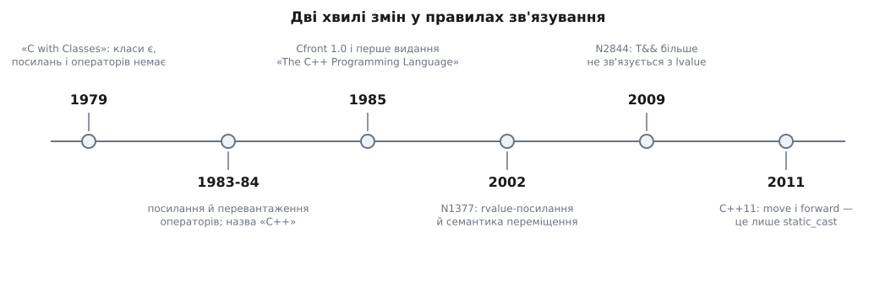

# 📜 Народження посилань: від перевантаження операторів до rvalue

Посилання з'явилися в C++ не тому, що покажчик писався незручно, а тому, що без них не працювало перевантаження операторів; а rvalue-посилання, додані через двадцять років, довелося рятувати окремим папером комітету, бо в первісному вигляді вони тихо крали нутрощі в іменованих змінних. Обидві історії — про те саме: **правило зв'язування щоразу звужували, доки небезпечний випадок не почав вимагати окремого слова в тексті програми**.

## «C with Classes» вміла класи, але не вміла плюса

Б'ярне Страуструп (дан. Bjarne Stroustrup) почав роботу в Bell Labs 1979 року; перший варіант мови звався «C with Classes» — C із класами. Там уже були класи й похідні класи, але не було ні перевантаження операторів, ні посилань. Наслідок цієї відсутності легко недооцінити: власний тип у такій мові принципово другосортний. Клас `complex` може мати метод `add`, але не може мати `+`; клас `vector` може мати `at`, але не може мати `[]`, у який щось записують. Уся ідея, заради якої класи бралися з Simula — «свій тип виглядає й поводиться, як вбудований», — обривалася на першому ж арифметичному виразі.

Перевантаження операторів (див. [перевантаження операторів](topic:sf-lang/operator-overloading)) вирішувало половину задачі: дозволяло оголосити функцію з іменем `operator+`. Але друга половина впиралася в те, чим саме ця функція обмінюється з кодом. У C є рівно один спосіб не копіювати аргумент — передати адресу. Спробуймо:

```cpp
complex operator-(const complex* x, const complex* y);

a = *(operator-(&b, &c));   // те, у що перетворився б вираз a = b - c
```

Це не «трохи негарно». Синтаксис оператора саме тим і цінний, що операнд пишеться своїм іменем; амперсанд перед кожним операндом знищує єдину перевагу, заради якої все затівалося. Тому Страуструп формулює причину без застережень: посилання ввели передусім, щоб підтримати перевантаження операторів (Design and Evolution of C++, §3.7).

Другий бік тієї самої задачі — **результат** оператора. Щоб працював вираз `v[i] = 3`, `operator[]` мусить повернути щось, чому можна присвоїти, тобто lvalue. Повернути значення — не годиться, присвоєння піде в копію. Повернути покажчик — знову треба зірочка на місці виклику. Потрібна була конструкція, яку функція повертає, а викликач уживає як звичайне ім'я об'єкта. Так само з ланцюжком `a = b = c`: `operator=` повертає посилання на себе, і другий знак рівності бачить не копію, а сам об'єкт.

Обидві потреби — на вході й на виході — задовольняє одна річ: **друге ім'я вже наявного об'єкта**. Не адреса, якою можна крутити; не копія; ім'я. Назву мова отримала разом із новим ім'ям самої мови: «C++» запропонував Рік Масситті, вперше вжито в грудні 1983 року, а перша комерційна реалізація (Cfront 1.0) вийшла в жовтні 1985-го одночасно з першим виданням «The C++ Programming Language».

## Що взяли в Algol 68 — і чого навмисне не взяли

Ні перевантаження операторів, ні посилання C++ не вигадав. Обидві конструкції прийшли з Algol 68 — мови, розробленої під егідою IFIP групою на чолі з Адріаном ван Вейнгаарденом (нід. Adriaan van Wijngaarden); Страуструп у своїй історії мови прямо називає Algol 68 джерелом і перевантаження операторів, і посилань. Це усталений факт із першоджерела, а не реконструкція.

Але взято було ідею, не конструкцію. В Algol 68 посилання — повноправна частина моделі: тип `ref int` описує змінну, яка тримає ім'я цілого, і сама ця змінна може дістати інше ім'я. C++ від цієї свободи відмовився: посилання зв'язується один раз при ініціалізації й більше ніколи.

Причина видно з одного рядка. Якби перезв'язування існувало, вираз

```cpp
r = x;
```

означав би дві різні дії залежно від чогось невидимого в цьому рядку: або «записати значення `x` в об'єкт, який `r` називає», або «відтепер `r` називає `x`». Для мови, де посилання мало стати непомітним синтаксичним клеєм в операторах, така двозначність убивча: `a = b - c` перестало б мати єдине прочитання. Тож із двох можливих значень залишили одне — присвоєння крізь ім'я, — а перезв'язування прибрали разом із синтаксисом для нього. Звідси й решта: посилання зобов'язане бути ініціалізованим, посилання не має власної адреси, масиву посилань не буває.

## Перше звуження: змінне посилання й тимчасовий

Щойно посилання почали приймати неявні перетворення, знайшлася діра, яку зазвичай показують таким прикладом:

```cpp
void incr(int& n) { ++n; }

double d = 1.0;
incr(d);          // якби це компілювалося: створено тимчасовий int(1),
                  // збільшено до 2 і викинуто; d лишилося 1.0
```

Функція чесно виконала свою роботу — над об'єктом, якого викликач ніколи не бачив і не побачить. Тому зв'язування змінного `T&` з тимчасовим заборонили: якщо посилання оголошує намір писати, воно має отримати об'єкт, який хтось потім прочитає. `const T&` під ту саму заборону не потрапило, бо читачеві байдуже, з копії він читає чи з оригіналу. Компілятор Microsoft ще довго дозволяв змінне зв'язування з тимчасовим як власне розширення — сьогодні його вимикає прапорець `/Zc:referenceBinding`.

Це перший випадок того самого сюжету: правило зв'язування звузили саме там, де широке правило робило безглузду дію мовчазною.

## 2002: папір, що додав другий вид посилань

Наступні майже двадцять років посилання не змінювалися, а от біль накопичувався. Кожне повернення великого об'єкта з функції, кожне зростання `std::vector`, кожен `swap` коштували повного копіювання — навіть коли джерело було безіменним тимчасовим, який за мить помре й нікому вже не знадобиться. Мова не мала чим відрізнити «скопіюй, бо оригінал ще потрібен» від «забирай, оригінал приречений». Обхідні шляхи були (сумнозвісний `std::auto_ptr` крав нутрощі просто при копіюванні), але саме тому вони й лишилися сумнозвісними: крадіжка мала вигляд копії.

10 вересня 2002 року в комітет надійшов папір **N1377=02-0035, «A Proposal to Add Move Semantics Support to the C++ Language»** за авторством Говарда Гіннанта (англ. Howard E. Hinnant), Петра Дімова (болг. Peter Dimov) і Дейва Абрагамса (англ. Dave Abrahams). Мета сформульована в першому ж абзаці як оптимізація: перемістити дорогий об'єкт, «pilfering resources of the source in order to construct the target» — обібравши джерело, щоб дешево збудувати ціль.

Механізм, який папір пропонує, — не нова операція, а **новий вид посилання** з токеном `&&`, тобто новий канал перевантаження:

```cpp
struct A { /* ... */ };
void foo(A&& a);
```

Далі три правила, що збереглися до сьогодні. Перше: rvalue віддають перевагу rvalue-посиланню, lvalue — lvalue-посиланню; отже, дописавши перевантаження з `A&&`, ви автоматично відводите в нього всі тимчасові, нічого не змінюючи на боці викликів. Друге: конструктор переміщення — не особливий член, а звичайний конструктор, який просто бере `A&&`. Третє, найменш очевидне: **іменоване rvalue-посилання само є lvalue**, коли ним користуються. Параметр `A&& a` усередині функції має ім'я, отже, з нього не можна забрати нутрощі мовчки — і саме тому в тілі конструктора переміщення пишуть `std::move(a)` ще раз.

## 2009: дірка, крізь яку крали ресурси

У первісній редакції правило зв'язування для `&&` було ширше за сьогоднішнє: rvalue-посилання приймало й lvalue. Це виглядало зручно — так простіше було писати `forward`, так само працювали перевантаження `swap`. Небезпеки начебто не було: якщо аргумент — іменована змінна, перевантаження з `const T&` точніше, отже, воно й виграє, а `T&&` до іменованих змінних просто не дійде.

Умова «якщо перевантаження з `const T&` існує й придатне» виявилася крихкою. Коли комітет узявся за [концепти](topic:sys-plang-cpp/concepts-constraints), стало видно клас випадків, у яких копіювальне перевантаження **зникає з розгляду**: тип некопійовний (`std::unique_ptr`), або обмеження шаблону відсіює саме його. Тоді виклик тихо з'їжджає на `T&&` — і функція, написана в припущенні «мені дали приречений об'єкт», обчищає живу іменовану змінну, до якої викликач збирався звертатися далі:

```cpp
void sink(std::string&& s);      // «забираю вміст»

std::string name = "Ада";
sink(name);                      // до 2009-го це компілювалося:
use(name);                       // ...і name тут уже спорожніла
```

Папір **N2844=09-0034, «Fixing a Safety Problem with Rvalue References: Proposed Wording»** (редакція 1 від 5 березня 2009 року) за авторством Дугласа Ґреґора (англ. Douglas Gregor) і Девіда Абрагамса називає порушений принцип: кожна функція мусить бути типобезпечною **сама по собі**, незалежно від того, як її перевантажили. Функція `sink` бере `std::string&&`; її безпека не може залежати від того, чи є поруч інша функція з іншою сигнатурою й чи пройшла та інша функція відбір. Виправлення радикальне і в один рядок: **rvalue-посилання більше не зв'язується з lvalue**, а хто хоче — пише явне приведення.

Так з'явилося те правило, яке сьогодні здається самоочевидним: `std::string&& r = name;` — помилка компіляції, `std::string&& r = std::move(name);` — дозвіл, виданий уголос.



*Дві хвилі. Перша дала мові посилання заради перевантаження операторів і одразу звузила їх, заборонивши змінному посиланню тимчасовий. Друга додала другий вид посилань — і теж звузила його вже після ухвалення, коли знайшовся спосіб мовчки обібрати іменовану змінну.*

## Як виправлення переписало std::move і std::forward

Наслідок торкнувся двох найвідоміших функцій стандартної бібліотеки — і торкнувся так, що видно саму суть зміни.

Доки rvalue-посилання приймало lvalue, `std::move` не потребувало жодного приведення. Параметр `T&&` ловив усе, всередині `t` було lvalue, а тип повернення оголошував rvalue-посилання — і `return t;` компілювався сам собою:

```cpp
// до N2844
template <class T>
typename std::remove_reference<T>::type&& move(T&& t)
{
    return t;                    // lvalue зв'язувалося з rvalue-посиланням
}
```

Після виправлення цей рядок став саме тією помилкою, від якої виправлення й захищає, тож перетворення довелося виписати явно:

```cpp
// після N2844 (форма, що дійшла до стандарту)
template <class T>
constexpr typename std::remove_reference<T>::type&& move(T&& t) noexcept
{
    return static_cast<typename std::remove_reference<T>::type&&>(t);
}
```

З `std::forward` вийшло різкіше. Його тодішня реалізація трималася на трюку з `identity`, який глушив виведення типу, залишаючи параметр у формі `T&&`:

```cpp
// до N2844
template <class T> struct identity { typedef T type; };

template <class T>
T&& forward(typename identity<T>::type&& t) { return t; }
```

Виклик `forward<U>(x)` з lvalue `x` спирався рівно на ту здатність, яку N2844 скасував: параметр `U&&` мусив зв'язатися з lvalue. Тому [ідеальне передавання](topic:sys-plang-cpp/perfect-forwarding) переписали навпаки — параметр оголосили **звичайним lvalue-посиланням**, а приведення винесли в тіло, де його видно:

```cpp
// після N2844
template <class T>
constexpr T&& forward(std::remove_reference_t<T>& t) noexcept
{
    return static_cast<T&&>(t);
}

template <class T>
constexpr T&& forward(std::remove_reference_t<T>&& t) noexcept
{
    return static_cast<T&&>(t);
}
```

Друге перевантаження потрібне для аргументів, які самі є rvalue: параметр-lvalue-посилання їх тепер не візьме. А відсіювання безглуздих інстанціювань (наприклад, спроби «передати вперед» lvalue як rvalue) уточнили ще одним папером — N2951 Говарда Гіннанта від 27 вересня 2009 року, який і закріпив обмеження та фінальну форму з `static_cast`.

Тут корисно зупинитися на тому, що ця пара кодових блоків насправді показує. **Після 2009 року і `move`, і `forward` — це буквально `static_cast` і нічого більше**: жодного копіювання, жодного переміщення, жодного коду в машинному вигляді. Обидві функції лише змінюють [категорію значення](topic:sys-plang-cpp/value-categories) виразу, тобто відповідь на питання «чи є в цього об'єкта ім'я, за яким до нього повернуться». А переміщення, якщо воно взагалі станеться, виконає те перевантаження, яке після цієї зміни категорії виграє відбір, — [конструктор або оператор переміщення](topic:sys-plang-cpp/move-semantics).

Виправлення N2844 не стільки додало безпеки, скільки перенесло рішення туди, де його читає людина. До нього дозвіл обібрати змінну міг виникнути з розстановки перевантажень десь в іншому заголовку; після нього такий дозвіл існує тільки у вигляді слова `std::move` або `static_cast`, написаного в рядку, який ви бачите. Це та сама логіка, що й у забороні тридцятирічної давнини на зв'язування `T&` з тимчасовим: широке правило робить небезпечну дію тихою, тож правило звужують, а тим, кому вона справді потрібна, лишають окреме слово.
