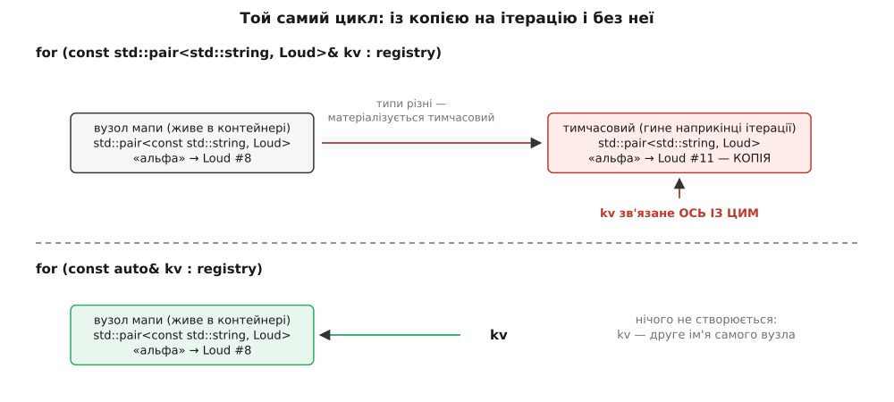

# ⚙️ Лабораторія зв'язування: програма, яка вголос звітує про кожну прив'язку

Це один файл на C++20, що збирається без жодної залежності й на кожну подію друкує рядок: який об'єкт народився, який виявився копією, який помер — і рівно між якими двома командами. Правила зв'язування — рідкісний випадок, коли інтуїцію не треба вгадувати: усе, що вони обіцяють, видно в потоці виводу, а все, що вони **не** обіцяють, видно в звіті санітайзера.

## Умова

Питання, на які лабораторія мусить відповісти не міркуванням, а роздруком:

1. Коли поруч стоять `take(const T&)` і `take(T&&)`, яке перевантаження бере lvalue, яке — тимчасовий, і що насправді робить `std::move`.
2. У який момент помирає тимчасовий: без посилання, з `const T&`, з `T&&`.
3. Скільки об'єктів створює цикл `for (const std::pair<std::string, int>& kv : counts)` по `std::map` — і чи справді `const auto&` не створює жодного. (Щоб копію було чути, `int` у досліді замінено на клас із гучним конструктором копіювання.)
4. Що робить ref-кваліфікатор методу з висячим посиланням.
5. Чому `std::thread` мовчки працює з копією, доки не написати `std::ref`.
6. Що саме показує санітайзер у кожному з чотирьох місць, де подовження життя не діє: повернення, параметр, ініціалізатор у `new`, список ініціалізації конструктора.

Три речі роблять цю задачу задачею. Перша: більшість подій, які нас цікавлять, компілятор виконує **мовчки** — копія тимчасового не має свого рядка в тексті програми. Друга: половина дослідів — це навмисне [невизначена поведінка](root:sf-lang/undefined-behavior), тобто програма не зобов'язана впасти; без інструмента вона просто надрукує сміття й піде далі, і дослід нічого не доведе. Третя: `std::cout` сам по собі не скаже, який із двох однойменних об'єктів ми зараз бачимо.

## Ідея

Усі три перепони знімає одна конструкція — **гучний тип із номером**. Клас `Loud` тримає ім'я, отримує при народженні наскрізний номер і друкує рядок у кожному конструкторі та в деструкторі. Номер важливий не менше за ім'я: коли в циклі раптом з'являється `#11` замість очікуваного `#8`, це вже не здогад про «зайву копію», а факт із протоколу.

Другу перепону знімає збірка з санітайзером адрес: там, де стандарт дозволяє програмі мовчати, інструмент зупиняє її на першому ж читанні з мертвої пам'яті й показує три стеки — де читали, де знищили, де створили. Тому лабораторія має два режими збірки й запускає небезпечні досліди поодинці: перший же звіт ASan завершує процес.

Третю знімає розбиття на пронумеровані досліди, які вибираються аргументом командного рядка.

## Гучний тип

```cpp
// binding-lab.cpp — лабораторія зв'язування. C++20, жодних залежностей.
#include <functional>
#include <iostream>
#include <map>
#include <string>
#include <string_view>
#include <thread>
#include <utility>

class Loud {
public:
    explicit Loud(std::string name) : name_(std::move(name)), id_(next_++) {
        say("створено");
    }
    Loud(const Loud& other) : name_(other.name_), id_(next_++) {
        ++copies_;
        say("КОПІЮВАННЯ", other.id_);
    }
    Loud(Loud&& other) noexcept : name_(std::move(other.name_)), id_(next_++) {
        other.name_ = "(вичерпаний)";
        say("переміщення", other.id_);
    }
    Loud& operator=(const Loud&) = delete;
    Loud& operator=(Loud&&)      = delete;
    ~Loud() { say("знищено"); }

    int                id()   const { return id_; }
    const std::string& name() const { return name_; }

    static int  copies()      { return copies_; }
    static void mute(bool on) { mute_ = on; }

private:
    void say(std::string_view what, int from = 0) const {
        if (mute_) return;
        std::cout << "      #" << id_ << "  " << what;
        if (from != 0) std::cout << " з #" << from;
        std::cout << "  «" << name_ << "»\n";
    }

    std::string name_;
    int         id_;

    static inline int  next_   = 1;
    static inline int  copies_ = 0;
    static inline bool mute_   = false;
};

static void head(std::string_view title) {
    std::cout << "\n──  " << title << "  ──\n";
}
```

Три дрібниці в цьому класі — не оздоба, а умови вимірювання. Переміщувальний конструктор **перейменовує** джерело на `(вичерпаний)`: інакше в протоколі не видно різниці між «об'єкт скопіювали» і «об'єкт обібрали», бо обидва рядки закінчуються тим самим іменем. Присвоєння видалене, щоб жодна подія не проскочила повз лічильник — усе, що станеться з об'єктом, станеться через конструктор. І `mute_` знадобиться там, де подій забагато, а важлива лише їхня кількість.

## Дослід 1: яке перевантаження виграє

```cpp
void take(const Loud& v) { std::cout << "    take(const Loud&)  ← #" << v.id() << '\n'; }
void take(Loud&& v)      { std::cout << "    take(Loud&&)       ← #" << v.id() << '\n'; }

static void part_overloads() {
    head("1. Яке перевантаження виграє");

    Loud       named("іменований");
    const Loud frozen("сталий");

    take(named);                   // змінне lvalue
    take(frozen);                  // const lvalue
    take(Loud("тимчасовий"));      // prvalue
    take(std::move(named));        // xvalue

    std::cout << "    після std::move #" << named.id()
              << " цілий, ім'я «" << named.name() << "»\n";
}
```

Вивід:

```
──  1. Яке перевантаження виграє  ──
      #1  створено  «іменований»
      #2  створено  «сталий»
    take(const Loud&)  ← #1
    take(const Loud&)  ← #2
      #3  створено  «тимчасовий»
    take(Loud&&)       ← #3
      #3  знищено  «тимчасовий»
    take(Loud&&)       ← #1
    після std::move #1 цілий, ім'я «іменований»
      #2  знищено  «сталий»
      #1  знищено  «іменований»
```

Читати варто по одному рядку. Перші два виклики пішли в `const Loud&`, бо друге перевантаження до lvalue не прив'язується взагалі — вибору не було. Третій виклик мав вибір: тимчасовий однаково лягає і на `const Loud&`, і на `Loud&&`, — і виграло rvalue-посилання. Четвертий доводить, що `std::move` — не дія, а зміна категорії виразу: `#1` пішов у `take(Loud&&)`, але жодного рядка про переміщення в протоколі немає, бо `take` нічого не переміщує. Ім'я `#1` після цього ціле. Переміщення сталося б лише тоді, коли б хтось усередині взяв аргумент і сконструював із нього об'єкт, — про це [семантика переміщення](root:sys-plang-cpp/move-semantics): `&&` у сигнатурі лише дає дозвіл, а забирає нутрощі окремий конструктор.

Ще одна дрібниця, яку легко проґавити: `#3` знищено **після** повернення з `take`, а не перед викликом. Тимчасовий, створений в аргументі, живе до кінця повного виразу — того, що закінчується крапкою з комою.

## Дослід 2: у який момент помирає тимчасовий

```cpp
static Loud make(std::string name) { return Loud(std::move(name)); }

static void part_lifetime() {
    head("2. Коли саме гине тимчасовий");

    std::cout << "    (а) тимчасовий ні з чим не зв'язаний:\n";
    {
        make("миттєвий");
        std::cout << "        наступний рядок блоку\n";
    }

    std::cout << "    (б) тимчасовий зв'язаний із const Loud&:\n";
    {
        const Loud& kept = make("подовжений");
        std::cout << "        наступний рядок блоку; #" << kept.id() << " живий\n";
    }

    std::cout << "    (в) те саме через Loud&&:\n";
    {
        Loud&& kept = make("подовжений-rvalue");
        std::cout << "        наступний рядок блоку; #" << kept.id() << " живий\n";
    }
}
```

```
──  2. Коли саме гине тимчасовий  ──
    (а) тимчасовий ні з чим не зв'язаний:
      #4  створено  «миттєвий»
      #4  знищено  «миттєвий»
        наступний рядок блоку
    (б) тимчасовий зв'язаний із const Loud&:
      #5  створено  «подовжений»
        наступний рядок блоку; #5 живий
      #5  знищено  «подовжений»
    (в) те саме через Loud&&:
      #6  створено  «подовжений-rvalue»
        наступний рядок блоку; #6 живий
      #6  знищено  «подовжений-rvalue»
```

Різниця між (а) і (б) — одне зв'язування, і воно пересуває рядок «знищено» через увесь блок. У (а) деструктор спрацював між двома командами, всередині крапки з комою. У (б) — аж на закритті блоку, після останнього звертання. У (в) видно, що правило нічого не знає про рід посилання: `T&&` подовжує так само, як `const T&`.

Окремо варто помітити, чого в протоколі **немає**. `make` повертає `Loud` за значенням, отже мала б бути хоч одна копія чи переміщення з локального об'єкта в місце виклику, — а рядка немає, бо `return Loud(...)` дає prvalue, і з C++17 його матеріалізують прямо в цільовій пам'яті. Це [гарантоване усунення копій](root:sys-plang-cpp/copy-elision): не оптимізація, а правило мови, тож дослід відтворюється на будь-якому компіляторі й будь-якому рівні оптимізації.

## Дослід 3: копія, якої немає в тексті

```cpp
static void part_materialization() {
    head("3. Копія, якої немає в тексті");

    std::map<std::string, Loud> registry;
    registry.emplace("альфа", Loud("датчик-альфа"));
    registry.emplace("бета",  Loud("датчик-бета"));

    std::cout << "    цикл із власноруч виписаним типом елемента:\n";
    for (const std::pair<std::string, Loud>& kv : registry)
        std::cout << "        " << kv.first << " → #" << kv.second.id() << '\n';

    std::cout << "    цикл із const auto&:\n";
    for (const auto& kv : registry)
        std::cout << "        " << kv.first << " → #" << kv.second.id() << '\n';
}
```

```
──  3. Копія, якої немає в тексті  ──
      #7  створено  «датчик-альфа»
      #8  переміщення з #7  «датчик-альфа»
      #7  знищено  «(вичерпаний)»
      #9  створено  «датчик-бета»
      #10  переміщення з #9  «датчик-бета»
      #9  знищено  «(вичерпаний)»
    цикл із власноруч виписаним типом елемента:
      #11  КОПІЮВАННЯ з #8  «датчик-альфа»
        альфа → #11
      #11  знищено  «датчик-альфа»
      #12  КОПІЮВАННЯ з #10  «датчик-бета»
        бета → #12
      #12  знищено  «датчик-бета»
    цикл із const auto&:
        альфа → #8
        бета → #10
      #10  знищено  «датчик-бета»
      #8  знищено  «датчик-альфа»
```

Головний доказ — не рядки «КОПІЮВАННЯ», а номери в тілі циклу. Перший цикл бачить `#11` і `#12`; у контейнері лежать `#8` і `#10`. Тобто `kv` — не друге ім'я елемента мапи, як здається з тексту, а ім'я щойно зробленої копії, яку компілятор змушений був створити: тип елемента `std::map` — `std::pair<const std::string, Loud>`, а ми написали `std::pair<std::string, Loud>`, різниця в одному `const` на ключі. Типи різні, посилання `const&` — отже, дозволена матеріалізація тимчасового, і компілятор чесно копіює **всю** пару, включно з рядком-ключем. Другий цикл друкує `#8` і `#10` і не додає до протоколу нічого: `const auto&` вивів точний тип елемента, копіювати нічого не треба.



*Один зайвий `const`, пропущений у типі елемента, перетворює друге ім'я на копію — і рахунок іде на копію рядка й копію значення за кожну ітерацію.*

Два зауваження до цього досліду. Перше: кількість рядків «переміщення» під час заповнення мапи — деталь реалізації стандартної бібліотеки, у вашій може бути інакше; сталим є те, що відбувається в циклі. Друге: порядок двох останніх рядків «знищено» задає обхід дерева всередині контейнера, а не наш код.

І приємне: саме цю пастку обидва великі компілятори вміють показати без жодного вимірювання — GCC попередженням `-Wrange-loop-construct` (входить у `-Wall`), Clang — окремим `-Wrange-loop-bind-reference` про змінну циклу, що зв'язалася з тимчасовим (входить у `-Wextra`). Тому збирати варто принаймні з `-Wall -Wextra`: половину висновків цієї лабораторії компілятор віддає задарма.

## Дослід 4: ref-кваліфікатор методу

```cpp
class Buffer {
public:
    explicit Buffer(std::string tag) : payload_(std::move(tag)) {}
    const Loud& payload() const&  { return payload_; }             // об'єкт має ім'я
    Loud        payload() &&      { return std::move(payload_); }  // об'єкт тимчасовий
private:
    Loud payload_;
};

static Buffer makeBuffer(std::string tag) { return Buffer(std::move(tag)); }

static void part_ref_qualifier() {
    head("4. Ref-кваліфікатор методу");

    Buffer      named("буфер-із-іменем");
    const Loud& live = named.payload();
    std::cout << "    у живого буфера позичили #" << live.id() << '\n';

    Loud taken = makeBuffer("буфер-тимчасовий").payload();
    std::cout << "    у тимчасового ЗАБРАЛИ #" << taken.id() << '\n';
}
```

```
──  4. Ref-кваліфікатор методу  ──
      #13  створено  «буфер-із-іменем»
    у живого буфера позичили #13
      #14  створено  «буфер-тимчасовий»
      #15  переміщення з #14  «буфер-тимчасовий»
      #14  знищено  «(вичерпаний)»
    у тимчасового ЗАБРАЛИ #15
      #15  знищено  «буфер-тимчасовий»
      #13  знищено  «буфер-із-іменем»
```

Один і той самий виклик `payload()` дав два різні результати, і вибір зробило те, **як зв'язується сам об'єкт**. Для іменованого буфера спрацював `const&`-кваліфікований метод: `live` — посилання всередину живого `#13`, копії немає. Для тимчасового спрацював `&&`-кваліфікований: вміст переїхав у `#15`, який належить викликачеві, а спорожнілу оболонку `#14` знищено разом із буфером. Дві останні події в протоколі йдуть саме в такому порядку: спершу `#14` знищено (кінець повного виразу), і лише потім, наприкінці функції, `#15`.

Без другого перевантаження цей самий рядок повернув би посилання всередину об'єкта, що гине тієї ж миті. Як це виглядає — у дослідах із санітайзером нижче.

## Дослід 5: чому `std::thread` вимагає `std::ref`

```cpp
static const Loud* seen = nullptr;
static void inspect(const Loud& v) { seen = &v; }

static void part_thread() {
    head("5. Чому std::thread вимагає std::ref");

    Loud shared("спільний");
    Loud::mute(true);                       // далі рахуємо копії, а не друкуємо події

    const int before = Loud::copies();
    std::thread a(inspect, shared);
    a.join();
    std::cout << "    thread(inspect, shared):         копій Loud — "
              << Loud::copies() - before << ";  потік бачив "
              << (seen == &shared ? "той самий" : "ІНШИЙ") << " об'єкт\n";

    const int before2 = Loud::copies();
    std::thread b(inspect, std::cref(shared));
    b.join();
    std::cout << "    thread(inspect, std::cref(...)): копій Loud — "
              << Loud::copies() - before2 << ";  потік бачив "
              << (seen == &shared ? "той самий" : "ІНШИЙ") << " об'єкт\n";

    Loud::mute(false);
}
```

```
──  5. Чому std::thread вимагає std::ref  ──
      #16  створено  «спільний»
    thread(inspect, shared):         копій Loud — 1;  потік бачив ІНШИЙ об'єкт
    thread(inspect, std::cref(...)): копій Loud — 0;  потік бачив той самий об'єкт
      #16  знищено  «спільний»
```

Тут протокол приглушено навмисне: скільки разів бібліотека перекладе свою внутрішню копію з місця на місце — її справа, і в різних реалізаціях число різне. Незмінне інше — **одне копіювання з нашого об'єкта** і адреса, яку врешті бачить функція в потоці.

Причина в тому, що `inspect` бере `const Loud&`, і сигнатура ніби обіцяє «нічого не копіюю». Обіцянку тримає `inspect`, але не `std::thread`: його конструктор зобов'язаний зробити з кожного аргументу самостійну копію й покласти її у власне сховище, бо потік може пережити кадр, у якому його створили. Отже, з lvalue він копіює — і функція в потоці зв'язується з чужою копією, нічого не знаючи про наш `#16`. Про сам запуск і володіння потоком — [thread і jthread](root:sys-plang-cpp/std-thread-jthread).

`std::cref` копіює обгортку — покажчик усередині, — а не сам об'єкт, тому копій `Loud` нуль і адреса збігається. Ціною за це стає обов'язок: тепер **ми** відповідаємо за те, щоб `shared` пережив потік; тут це гарантує `join()` перед виходом із функції.

Найковарніша частина цієї пастки — у тому, що з `const Loud&` вона мовчазна: код збирається, працює, просто працює з копією. Якби `inspect` брав `Loud&`, збірка впала б, і повідомлення було б із нутрощів `std::invoke`, а не з нашого рядка: внутрішня копія передається функції як rvalue, а `Loud&` до rvalue не прив'язується. Це той рідкісний випадок, коли зрозуміла помилка компіляції корисніша за мовчазний успіх.

## Досліди із санітайзером: чотири місця, де подовження не діє

Далі йде код, який навмисно порушує правила. Кожен дослід — окремий запуск: перший же звіт ASan завершує процес.

```cpp
// ── I. Повернення ─────────────────────────────────────────────────────────
static const Loud& forward_ref(const Loud& v) { return v; }   // сама по собі чесна

static void dangle_return() {
    head("висяче: повернення");
    const Loud& r = forward_ref(Loud("повернений"));
    std::cout << "    читаємо через висяче посилання...\n";
    std::cout << "    ім'я: " << r.name() << '\n';            // ← тут спиняє ASan
}

// ── II. Параметр ──────────────────────────────────────────────────────────
static const Loud* remembered = nullptr;
static void remember(const Loud& v) { remembered = &v; }

static void dangle_param() {
    head("висяче: параметр");
    remember(Loud("запам'ятований"));
    std::cout << "    тимчасовий уже знищено, а покажчик лишився\n";
    std::cout << "    ім'я: " << remembered->name() << '\n';   // ← тут спиняє ASan
}

// ── III. Ініціалізатор у new ──────────────────────────────────────────────
struct Watcher {                 // агрегат із полем-посиланням
    const Loud& target;
    int         weight;
};

static void dangle_new() {
    head("висяче: ініціалізатор у new");
    {   // на стеку ті самі фігурні дужки ПОДОВЖУЮТЬ життя тимчасового
        Watcher onStack{ Loud("на-стеку"), 1 };
        std::cout << "    на стеку: " << onStack.target.name()
                  << " × " << onStack.weight << "  (усе гаразд)\n";
    }
    Watcher* onHeap = new Watcher{ Loud("під-new-у-купі"), 2 };
    std::cout << "    у купі: тимчасовий уже знищено\n";
    std::cout << "    ім'я: " << onHeap->target.name() << '\n'; // ← тут спиняє ASan
    delete onHeap;
}

// ── IV. Список ініціалізації конструктора ─────────────────────────────────
class Keeper {
public:
    explicit Keeper(const Loud& v) : target_(v) {}   // законно й нічого не подовжує
    const Loud& target() const { return target_; }
private:
    const Loud& target_;
};

static void dangle_member() {
    head("висяче: поле-посилання");
    Keeper k(Loud("у-полі-об'єкта"));
    std::cout << "    конструктор відпрацював, тимчасовий знищено\n";
    std::cout << "    ім'я: " << k.target().name() << '\n';    // ← тут спиняє ASan
}

// ── V. Метод без ref-кваліфікатора ────────────────────────────────────────
class BadBuffer {
public:
    explicit BadBuffer(std::string tag) : payload_(std::move(tag)) {}
    const Loud& payload() const { return payload_; }   // приймає і тимчасовий об'єкт
private:
    Loud payload_;
};

static void dangle_method() {
    head("висяче: метод без ref-кваліфікатора");
    {   // з ref-кваліфікатором той самий за формою рядок безпечний
        const Loud& good = makeBuffer("із-кваліфікатором").payload();
        std::cout << "    із кваліфікатором: " << good.name() << "  (усе гаразд)\n";
    }
    const Loud& bad = BadBuffer("без-кваліфікатора").payload();
    std::cout << "    без кваліфікатора: тимчасовий буфер уже знищено\n";
    std::cout << "    ім'я: " << bad.name() << '\n';           // ← тут спиняє ASan
}

int main(int argc, char** argv) {
    const std::string mode = (argc > 1) ? argv[1] : "safe";

    if (mode == "safe") {
        part_overloads();
        part_lifetime();
        part_materialization();
        part_ref_qualifier();
        part_thread();
    }
    else if (mode == "return") dangle_return();
    else if (mode == "param")  dangle_param();
    else if (mode == "new")    dangle_new();
    else if (mode == "member") dangle_member();
    else if (mode == "method") dangle_method();
    else {
        std::cerr << "дослід: safe | return | param | new | member | method\n";
        return 2;
    }
    return 0;
}
```

Збирати треба двічі — звичайно й під інструмент:

```
g++ -std=c++20 -O0 -g -Wall -Wextra -pthread binding-lab.cpp -o binding-lab

g++ -std=c++20 -O0 -g -Wall -Wextra -pthread \
    -fsanitize=address,undefined -fno-omit-frame-pointer \
    binding-lab.cpp -o binding-lab-san

./binding-lab
ASAN_OPTIONS=detect_stack_use_after_return=1 ./binding-lab-san param
```

Clang приймає ті самі прапорці; у MSVC є `/std:c++20 /fsanitize=address`, але без UBSan. `-O0` тут не примха: на `-O2` компілятор має право спертися на те, що невизначеної поведінки не буває, і викинути саме те читання, яке ми хочемо впіймати; `-g` потрібен, щоб у звіті стояли номери рядків, а не голі адреси.

### Що каже інструмент

Усі п'ять дослідів дають звіт однієї форми. Ось його початок для `param`:

```
==31417==ERROR: AddressSanitizer: stack-use-after-scope on address 0x7ffd4c1a2b60
READ of size 8 at 0x7ffd4c1a2b60 thread T0
    #0 0x55e3... in dangle_param() binding-lab.cpp:243
```

Далі йдуть три блоки, і саме вони роблять звіт корисним. Перший — стек читання: рядок, де ми звернулися по мертвій адресі. Другий — розкладка кадру функції з підписом `'<temporary>'` навпроти комірки, у яку ми влучили: інструмент прямо каже, що ця пам'ять належала тимчасовому об'єктові, чия область дії вже закінчилася. Третій з'являється, коли першим спрацював не доступ до самої оболонки, а доступ до її нутрощів: тоді заголовок буде `heap-use-after-free`, а блоки називатимуться «freed by thread T0 here» і «previously allocated by thread T0 here» — тобто ASan покаже точку, де рядок звільнили, і точку, де його виділили. Який із двох заголовків з'явиться першим, залежить від того, що інструментовано у вашій збірці; обидва вказують на один і той самий рядок коду.

Тут криється підступ, вартий окремої уваги: **короткий рядок може сховати падіння**. `std::string` тримає короткі рядки прямо в собі, без виділення в купі ([string і string_view](root:sys-plang-cpp/string-and-string-view)); поріг залежить від реалізації — у libstdc++ це 15 байтів. Поки рядок коротший, читання мертвого об'єкта не чіпає звільненої купи, і лишається єдиний шанс — `stack-use-after-scope`. Саме тому імена в небезпечних дослідах навмисно довші за цей поріг. Загальне правило звідси: дослід на висяче посилання треба ставити на типі, який справді щось тримає в купі, інакше «нічого не сталося» нічого не доводить.

UBSan у цих п'яти дослідах мовчить — час життя не його справа. Тримати його ввімкненим поруч усе одно варто: він ловить сусідній клас порушень, зокрема зв'язування посилання з нульовою адресою (`reference binding to null pointer of type ...`) і виклик методу по знищеному поліморфному об'єкту. Про поділ праці між інструментами — [санітайзери пам'яті](root:sf-release/address-sanitizer).

### Що з цього ловить компілятор, а що — лише інструмент

| дослід | доки живе тимчасовий | хто попереджає на етапі компіляції |
|---|---|---|
| `return` | до кінця повного виразу з викликом | GCC 13+: `-Wdangling-reference` (у `-Wall`) |
| `param` | до кінця повного виразу з викликом | ніхто |
| `new` | до кінця повного виразу з `new` | ніхто |
| `member` (через параметр) | до кінця повного виразу з викликом | ніхто |
| `member` (прямо в списку) | стандарт: конструкція некоректна | Clang — помилка, GCC — попередження |
| `method` | до кінця повного виразу | GCC 13+: `-Wdangling-reference` — не завжди |

Таблиця пояснює, чому ці «чотири місця» на практиці зводяться до двох. Пряме `return std::string("ой");` із функції, що повертає `const std::string&`, компілятор ловить давно й надійно (`-Wreturn-local-addr` у GCC, `-Wreturn-stack-address` у Clang) — сховати таке важко. Пряме зв'язування тимчасового з полем-посиланням у списку ініціалізації стандарт із часів [CWG 1696](https://cplusplus.github.io/CWG/issues/1696.html) взагалі оголошує некоректним: Clang відмовляється це компілювати («reference member binds to a temporary object whose lifetime would be shorter than the lifetime of the constructed object»), GCC поки що збирає з попередженням і дає тимчасовому померти на виході з конструктора.

А от випадки, де тимчасовий приходить **через параметр**, не ловить майже ніхто — і саме через параметр протікають обидва інші місця з нашого списку. `Keeper k(Loud("у-полі-об'єкта"))` законний у кожній своїй частині: конструктор зв'язує поле не з тимчасовим, а з тим, на що дивиться його параметр, і претензій до тексту немає. Помирає тимчасовий у викликача, на крапці з комою. Той самий механізм і в `dangle_return`: функція `forward_ref` бездоганна, помилка живе в рядку, де її результат зв'язали з довгоживучим посиланням.

Дослід `new` показує ще й контраст, який ніякою логікою не виводиться: **ті самі фігурні дужки поводяться по-різному залежно від того, де стоїть об'єкт**. `Watcher onStack{ Loud("на-стеку"), 1 };` цілком безпечний — тимчасовий, зв'язаний із полем-посиланням агрегату при ініціалізації списком, дістає подовження на весь час життя агрегату (виняток із C++20 — лише кругла форма ініціалізації агрегату, `Watcher w(Loud(...), 1)`). Той самий запис усередині `new` подовження не дає: стандарт окремим реченням каже, що тимчасовий у new-ініціалізаторі живе до кінця повного виразу, і супроводжує це приміткою, що звідси може вийти висяче посилання. Різницю видно у виводі:

```
──  висяче: ініціалізатор у new  ──
      #1  створено  «на-стеку»
    на стеку: на-стеку × 1  (усе гаразд)
      #1  знищено  «на-стеку»
      #2  створено  «під-new-у-купі»
      #2  знищено  «під-new-у-купі»
    у купі: тимчасовий уже знищено
    ім'я:
==31502==ERROR: AddressSanitizer: stack-use-after-scope on address ...
```

Механіка кожного з цих випадків і способи від них застрахуватися — у темі [висячі посилання й звернення після звільнення](root:sys-plang-cpp/dangling-references).

## Три конструкції, які не мусять збиратися

Останній дослід нічого не запускає: його результатом є те, що компілятор відмовляється зібрати цей код, і те, якими словами він відмовляється.

```cpp
#ifdef SHOW_ERRORS
// Збірка з -DSHOW_ERRORS має провалитися. Дивимося, ЯК саме.

// (1) Змішування передачі за значенням і за посиланням.
void take(Loud v) { std::cout << "    take(Loud)  ← #" << v.id() << '\n'; }

inline void ambiguousCall() {
    Loud named("іменований");
    take(named);
    // error: call of overloaded 'take(Loud&)' is ambiguous
    //   note: candidate: 'void take(const Loud&)'
    //   note: candidate: 'void take(Loud)'
}

// (2) Тимчасовий прямо в списку ініціалізації конструктора.
class DirectKeeper {
public:
    DirectKeeper() : target_(Loud("прямо-в-списку")) {}
private:
    const Loud& target_;
};

// (3) Обгортання тимчасового в std::ref.
inline auto wrapTemporary() { return std::ref(Loud("тимчасовий")); }
// error: use of deleted function 'std::reference_wrapper<T> std::ref(const T&&)'
#endif
```

**Чому (1) неоднозначне.** Обидва кандидати мають однаковий ранг: ініціалізація параметра-значення копією з lvalue — точний збіг; зв'язування `const Loud&` з тим самим lvalue — теж точний збіг, бо зв'язування посилання за рангом дорівнює тотожному перетворенню. Правила, яке розсудило б цю нічию між «зробити копію» і «прив'язатися», у стандарті немає, тож виклик відхиляється. Причому додати замість `take(const Loud&)` перевантаження `take(Loud&&)` не рятує: воно теж стане неоднозначним, тепер уже для тимчасових. Практичне правило звідси одне: або **пара** `const T&` + `T&&`, або **один** параметр за значенням — і ніколи те й те разом. Ранги, за якими це рішення ухвалюється, — частина загального механізму [вибору перевантаження](root:sf-lang/function-overloading).

**Що показує (2).** Тут цікава не сама заборона, розібрана вище, а розбіжність: із `-DSHOW_ERRORS` Clang зупиниться на `DirectKeeper`, а GCC пропустить його далі й лише попередить. Це найдешевший спосіб дізнатися, наскільки суворий саме ваш компілятор, і чи можна покластися на нього як на сторожа замість санітайзера. Відповідь, як бачимо, «не в усьому».

**Чому (3) заборонене.** `std::ref` має три перевантаження, і третє — `template <class T> void ref(const T&&) = delete;`. Для тимчасового `Loud` перше (`ref(T&)`) не підходить, бо `T&` не бере rvalue, а `const T&&` бере — і виявляється видаленим. Заборона тут змістовна: обгортка пережила б тимчасовий і поїхала б із висячим покажчиком туди, куди її поклали. Мова відрубує цю можливість на етапі компіляції, замість того щоб дати нам ще один звіт ASan.

## Ціна й пастки

**Ціна вимірювання.** Гучний тип — інструмент, а не приклад для наслідування: друк у конструкторі змінює те, що ми міряємо. Зокрема, `Loud` із виводом у деструкторі — не тривіальний тип, тому компілятор не має права викидати його «порожні» копії за правилом «ніби»; на справжньому типі частина того, що ми побачили, могла б зникнути після оптимізації. Копії з досліду 3 не зникнуть — вони справжні, з виділенням пам'яті під рядок, — а от порядок і кількість внутрішніх переміщень у стандартній бібліотеці на реальних типах може бути іншим.

**Пастка з номерами.** Номери наскрізні для всієї програми, тож зміна порядку дослідів зсуває їх усі. Це навмисно: наскрізна нумерація одразу показує, що жоден об'єкт не з'явився й не зник поза протоколом.

**Пастка з приглушенням.** `Loud::mute(true)` у досліді 5 глушить друк, але не лічильник і не видачу номерів — тому після нього номери йдуть із розривом. Розрив — теж дані: він означає, що об'єкти створювалися.

**Пастка з `-O2`.** Досліди із санітайзером на оптимізованій збірці можуть просто не спрацювати або показати не той рядок. Це не хиба інструмента: невизначена поведінка дозволяє компіляторові виходити з того, що звертання по мертвій адресі не буває, і викидати весь код, який із цього припущення стає недосяжним.

**Пастка з коротким рядком.** Коли той самий дослід ставлять на власному типі й він мовчить, першою підозрою має бути не «правило працює інакше», а «читати не було чого»: об'єкт зі скалярних полів або з коротким рядком усередині не залишає в купі нічого, що ASan міг би позначити звільненим.

**Чого лабораторія не міряє.** Вона нічого не каже про ціну посилання в машинному коді — для цього треба дивитися асемблер, а не протокол подій. І вона не ловить гонки: `seen` у досліді 5 читається після `join()`, тобто безпечно, але варто хоч трохи змінити той код — і знадобиться вже інший інструмент, `-fsanitize=thread`, який із ASan в одній збірці не поєднується.
