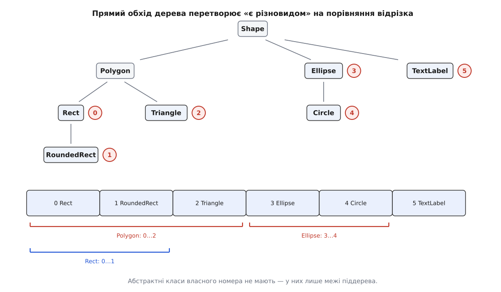

# ⚙️ RTTI в стилі LLVM: один байт замість обходу графа

Це робоча заміна `dynamic_cast` для великих ієрархій: базовий клас несе номер свого справжнього типу, питання «чи це різновид `X`» перетворюється на порівняння з відрізком номерів, і все разом працює навіть там, де механізм мови вимкнено прапорцем збірки. Прийом виріс у [LLVM і Clang](topic:sf-lang/llvm-clang) і живе там у заголовку `llvm/Support/Casting.h` під іменами `isa<>`, `cast<>`, `dyn_cast<>`.

## Що саме треба замінити

Прохід оптимізатора йде списком інструкцій [проміжного подання](topic:sf-lang/intermediate-representation) й мільйони разів питає «а це додавання?». На цій задачі сходяться чотири умови водночас, і кожна окремо ще терпима, а разом вони не лишають вибору.

Ієрархія велика й росте: у LLVM це сотні конкретних класів вузлів, і закритий набір на кшталт [`std::variant`](topic:sys-plang-cpp/variant-and-visit) відпадає — кожен новий вид вузла означав би правку в одному переліку, який мусить бачити всіх, і перезбирання всього, що той перелік читає.

Операція живе поза типом. Прохід — це не метод вузла; проходи пишуть сторонні люди у своїх файлах, і зсипати їх усі у віртуальні функції базового класу означало б протягнути в нього всі їхні залежності.

Сама бібліотека зібрана без RTTI: змінна `LLVM_ENABLE_RTTI` за замовчуванням вимкнена, тож `dynamic_cast` у цьому коді просто не існує — не «повільний», а недоступний.

І перевірка стоїть у гарячому циклі, де ціна кроку важить більше, ніж зручність запису.

Отже, потрібне «є різновидом», що коштує одне порівняння, не спирається на таблицю віртуальних функцій і не дорожчає від того, що ієрархія розрослася.

## Ідея: пронумерувати дерево прямим обходом

Відповідь на питання «чи `RoundedRect` є різновидом `Polygon`» — це властивість дерева класів, і дерево це відоме цілком уже під час компіляції. Лишається закодувати його так, щоб перевірка була дешевою.

Ключ — порядок нумерації. Пронумеруймо **конкретні** класи прямим обходом дерева: спускаємося від кореня, зліва направо, і видаємо черговий номер кожному листку. Тоді нащадки будь-якого вузла посідають **суцільний відрізок** номерів — бо обхід заходить у піддерево, вичерпує його повністю й лише потім іде далі.

Довільний порядок цієї властивості не дає. Пронумеруйте класи за абеткою — і нащадки `Polygon` розсиплються по всьому переліку, а перевірка перетвориться на список рівностей завдовжки в піддерево. Суцільність відрізка — не зручність запису, а те єдине, заради чого порядок узагалі задають.



*Об'єкт зберігає лише свій номер-листок; проміжні класи не зберігають нічого — вони існують у перевірці як пара меж.*

Далі все тривіально. Об'єкт носить у собі свій номер, записаний один раз під час конструювання. Перевірка на листок — рівність, перевірка на проміжний клас — потрапляння у відрізок.

## Код

Тег і межі піддерев тримають в одному місці — там, де їх видно разом:

```cpp
class Shape {
public:
    enum Kind : unsigned char {
        SK_Rect,          // 0
        SK_RoundedRect,   // 1
        SK_Triangle,      // 2
        SK_Ellipse,       // 3
        SK_Circle,        // 4
        SK_TextLabel,     // 5

        // межі піддерев — псевдоніми, власних значень не займають
        SK_FirstPolygon = SK_Rect,    SK_LastPolygon = SK_Triangle,
        SK_FirstRect    = SK_Rect,    SK_LastRect    = SK_RoundedRect,
        SK_FirstEllipse = SK_Ellipse, SK_LastEllipse = SK_Circle,
    };

    Kind kind() const { return kind_; }
    virtual ~Shape() = default;

protected:
    explicit Shape(Kind k) : kind_(k) {}

private:
    const Kind kind_;
};
```

Кожен клас оголошує статичну функцію `classof`, яка відповідає рівно на одне питання: «чи динамічний тип цього об'єкта є різновидом мене». Її аргумент — вказівник на **спільну базу**, ніколи не на себе й не на нащадка: викликають її з тим, що є на руках, а не з тим, на що сподіваються.

```cpp
class Polygon : public Shape {
public:
    static bool classof(const Shape* s) {
        return s->kind() >= SK_FirstPolygon && s->kind() <= SK_LastPolygon;
    }
    // операція, якої в Shape немає і не буде
    void smooth_corners(double r) { corner_radius_ = r; }

protected:
    using Shape::Shape;

private:
    double corner_radius_ = 0;
};

class Rect : public Polygon {          // конкретний, але сам має нащадка
public:
    Rect() : Rect(SK_Rect) {}
    static bool classof(const Shape* s) {
        return s->kind() >= SK_FirstRect && s->kind() <= SK_LastRect;
    }
protected:
    explicit Rect(Kind k) : Polygon(k) { assert(Rect::classof(this)); }
};

class RoundedRect final : public Rect {
public:
    RoundedRect() : Rect(SK_RoundedRect) {}
    static bool classof(const Shape* s) { return s->kind() == SK_RoundedRect; }
};

class Triangle final : public Polygon {
public:
    Triangle() : Polygon(SK_Triangle) {}
    static bool classof(const Shape* s) { return s->kind() == SK_Triangle; }
};

class Ellipse : public Shape {
public:
    Ellipse() : Ellipse(SK_Ellipse) {}
    static bool classof(const Shape* s) {
        return s->kind() >= SK_FirstEllipse && s->kind() <= SK_LastEllipse;
    }
protected:
    explicit Ellipse(Kind k) : Shape(k) {}
};

class Circle final : public Ellipse {
public:
    Circle() : Ellipse(SK_Circle) {}
    static bool classof(const Shape* s) { return s->kind() == SK_Circle; }
};
```

Зверніть увагу на `Rect`: він конкретний і водночас має нащадка, тож його відрізок **включає його самого**. Помилка «написав рівність, бо клас конкретний» — найчастіша в цьому прийомі й найтихіша.

Чому `classof` статична, а не віртуальний метод на кшталт `bool is_polygon() const`? Віртуальний варіант коштував би непрямого виклику й окремої функції на кожен цільовий тип, а головне — вимагав би, щоб базовий клас знав імена всіх своїх нащадків. Статична функція належить **питальнику**, а не питаному: знання про те, які номери означають `Polygon`, лежить у самому `Polygon` і більше ніде.

Обгортки над `classof` займають три рядки й нічого не знають про конкретні класи:

```cpp
template <class To, class From>
bool isa(const From* p) { return To::classof(p); }

template <class To, class From>
To* dyn_cast(From* p) { return isa<To>(p) ? static_cast<To*>(p) : nullptr; }

template <class To, class From>
To* cast(From* p) {
    assert(isa<To>(p) && "cast<> argument of incompatible type");
    return static_cast<To*>(p);
}
```

Уживається це так само, як звичний `dynamic_cast`, лише коротше:

```cpp
void smooth_all(const std::vector<std::unique_ptr<Shape>>& shapes, double r) {
    for (const auto& s : shapes)
        if (auto* p = dyn_cast<Polygon>(s.get()))
            p->smooth_corners(r);
}
```

Справжній `Casting.h` робить те саме, лише обростає деталями: `const`-версії, робота з посиланнями, автоматична розгортка розумних вказівників через `simplify_type` і точка розширення `CastInfo` для власних видів вказівників. Суть — виклик `To::classof` — та сама.

## Скільки це коштує

```
у пам'яті      1 байт на об'єкт (найчастіше з'їдається вирівнюванням поруч із vptr)
на перевірку   читання байта + два порівняння
компілятор     згортає (k ≥ first && k ≤ last) у (unsigned)(k − first) ≤ (last − first)
для Polygon    first = 0, тож лишається одне порівняння: k ≤ 2
```

Згортання двох порівнянь в одне варте окремого слова, бо саме воно робить перевірку по-справжньому дешевою. Відняти нижню межу й подивитися на результат як на беззнакове число — те саме, що спитати «чи потрапив у відрізок»: якщо `k` менше за `first`, різниця «завертається» через нуль у величезне число й гарантовано перевищує `last − first`. Дві умови й дві гілки перетворюються на одне віднімання та одне порівняння.

Ціна не залежить ні від глибини ієрархії, ні від її ширини, ні від того, наскільки «далеко» цільовий тип від справжнього. Перевірка вбудовується в місце виклику, гілка добре передбачається, а на класи без жодної віртуальної функції прийом лягає так само — там `dynamic_cast` узагалі заборонений. У LLVM цей байт лежить у `Value` як `const unsigned char SubclassID`.

Дрібна плата, про яку згадують уже після написання: `const`-поле забороняє присвоєння. Для вузлів дерева, які створюють і руйнують, а не переприсвоюють, це нічого не змінює; якщо ж клас має бути присвоюваним, `const` доводиться зняти й пильнувати тег самотужки.

## Чим за це платять

**Порядок у переліку став частиною контракту.** Вставили новий клас посеред переліку — усі відрізки нижче з'їхали на одиницю, і жоден компілятор про це не скаже: код збереться, а `dyn_cast` почне тихо повертати нуль там, де мав повертати вказівник, або, ще гірше, віддасть вказівник на об'єкт іншого типу — і далі [невизначена поведінка](topic:sf-lang/undefined-behavior). Саме тому LLVM і Clang перелік **не пишуть руками**: у LLVM він розгортається [макросами препроцесора](topic:sf-lang/preprocessor-macros) з файла-опису `Value.def`, у Clang — генерується з `DeclNodes.td` інструментом TableGen, який сам виводить пари меж на кшталт `firstNamed`/`lastNamed`. Дешевий страховий пас для власного коду — той самий `assert(Rect::classof(this))` у конструкторі: він одразу ловить розбіжність між тегом об'єкта й відрізком його класу.

**Тег бреше під час конструювання — і в протилежний бік.** Мова каже, що під час роботи конструктора `Shape` динамічний тип об'єкта — саме `Shape`. Тег каже інакше: він уже містить кінцевий номер, бо найпохідніший конструктор передав його вниз ланцюжком аж до бази ще перед входом у тіло. Отже, `isa<Circle>(this)` всередині конструктора `Shape` дасть **істину** тоді, коли частина `Circle` — ще не ініціалізований шматок пам'яті. Звертання до її полів після такої «перевірки» — невизначена поведінка, і жоден із наших `assert` її не спіймає.

**Навскісного приведення немає.** `dynamic_cast` уміє перейти від однієї бази спільного нащадка до іншої, статично не пов'язаної. Тут така операція просто не збереться: `static_cast` між двома незалежними базами незаконний, а тег про другу вісь класифікації нічого не знає — він один. Clang живе з цим, обробляючи пару `Decl`/`DeclContext` окремими написаними вручну переходами.

**Віртуальна база вбиває прийом.** `static_cast` від [віртуальної бази](topic:sys-plang-cpp/multiple-and-virtual-inheritance) до похідного класу — помилка компіляції, бо зсув підоб'єкта там є властивістю конкретного об'єкта, а не типу. Звичайне множинне спадкування без `virtual` працює нормально: зсув відомий статично, і компілятор його додасть сам.

**Нуль не є законним входом.** У LLVM `cast<>` і `dyn_cast<>` навмисно спрацьовують твердженням на нульовому вказівнику (`"dyn_cast on a non-existent value"`) — щоб «нема об'єкта» не зливалося з «є, але не той». Коли нуль справді очікуваний, беруть окремі імена: `isa_and_present<>`, `dyn_cast_if_present<>`, `cast_if_present<>`.

**Ієрархія відкрита лише в межах свого дерева коду.** Номер видає перелік, а перелік — один на всю ієрархію й компілюється разом із нею. Клас, що приходить із модуля, [приєднаного під час роботи](topic:sf-lang/dynamic-linking), власного номера отримати не може. Саме тут `dynamic_cast` лишається єдиним варіантом, бо його опис типу приїжджає разом із модулем.

## Дерево описують один раз

Перший пункт із цього списку — єдиний, що не лікується уважністю, і він же єдиний, який можна прибрати механічно. Опишіть дерево в окремому файлі, а перелік розгорніть із нього:

```cpp
// shapes.def — єдине місце, де записано форму ієрархії
#ifndef SHAPE
#  define SHAPE(Name, Parent)
#endif
#ifndef SHAPE_RANGE
#  define SHAPE_RANGE(Base, First, Last)
#endif

SHAPE(Rect,        Polygon)
SHAPE(RoundedRect, Rect)
SHAPE_RANGE(Rect,    Rect,    RoundedRect)
SHAPE(Triangle,    Polygon)
SHAPE_RANGE(Polygon, Rect,    Triangle)
SHAPE(Ellipse,     Shape)
SHAPE(Circle,      Ellipse)
SHAPE_RANGE(Ellipse, Ellipse, Circle)
SHAPE(TextLabel,   Shape)

#undef SHAPE
#undef SHAPE_RANGE
```

```cpp
enum Kind : unsigned char {
#define SHAPE(Name, Parent) SK_##Name,
#include "shapes.def"

#define SHAPE_RANGE(Base, First, Last) \
    SK_First##Base = SK_##First, SK_Last##Base = SK_##Last,
#include "shapes.def"
};
```

Файл підключають двічі: першого разу він розгортається в самі номери, другого — в межі, а порожні заготовки на початку гасять той бік, який цього разу не потрібен. Виграш не в тому, що межі порахувалися самі — їх усе ще пишуть руками, — а в тому, що межа стоїть рядком нижче за піддерево, яке вона обмежує: розбіжність видно оком, і правити треба одне місце, а не два файли. Наступний крок робить уже зовнішній генератор: Clang описує вузли в `DeclNodes.td`, а TableGen виводить із опису і перелік, і межі, і допоміжні макроси для обходу вузлів — там переплутати нема чого.

Перевірку зробив дешевою не хитрий алгоритм, а перенесене зобов'язання: компілятор більше не стежить за відповідністю тега й ієрархії — за нею стежите ви. Тому прийом виправдовує себе рівно доти, доки цю відповідальність не тримають на самій пильності.
