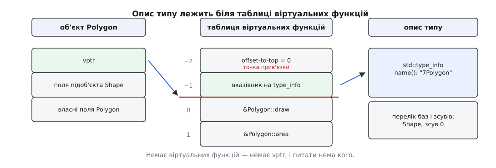
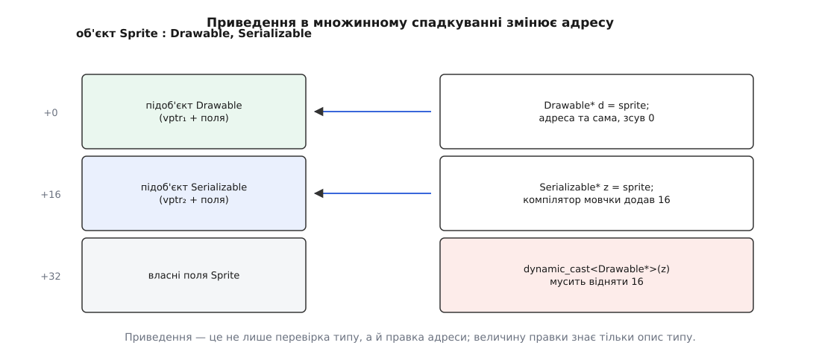
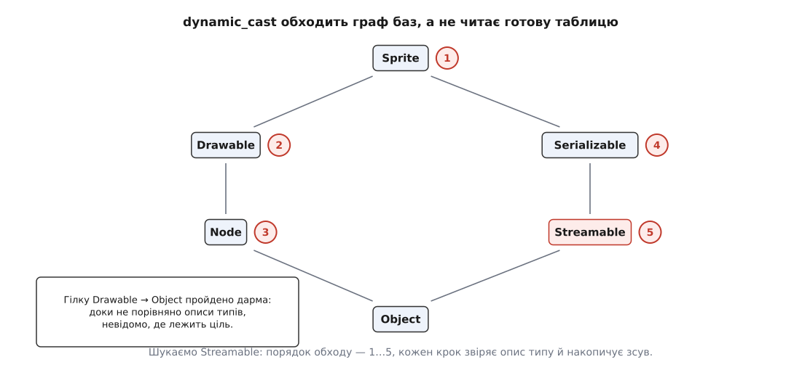

# RTTI: typeid і dynamic_cast

<preknowlist>
- [Поліморфізм і динамічне зв'язування](root:sf-lang/polymorphism) — виклик через базове посилання потрапляє в реалізацію похідного типу, і вибір робиться під час виконання.
- [Спадкування](root:sf-lang/inheritance) — похідний клас містить у собі підоб'єкт базового як частину себе.
- [Множинне й віртуальне спадкування](root:sys-plang-cpp/multiple-and-virtual-inheritance) — клас може мати кілька баз, і тоді їхні підоб'єкти лежать за різними зсувами всередині цілого.
- [Таблиця віртуальних методів C++](root:sf-devices/virtual-dispatch-cpp) — у поліморфному об'єкті лежить прихований вказівник на таблицю функцій його типу.
- [Оператори приведення](root:sys-plang-cpp/cast-operators) — `static_cast`, `reinterpret_cast`, `const_cast`: жоден із них не звіряється з дійсністю під час виконання.
- [Винятки](root:sys-plang-cpp/exceptions-mechanism) — як `throw` доправляє об'єкт відмови до `catch`; невдале приведення посилання повідомляє про себе саме так.
- [Динамічне лінкування](root:sf-lang/dynamic-linking) — код і дані можуть приходити з бібліотеки, приєднаної вже під час роботи програми.
</preknowlist>

## Вказівник знає менше, ніж потрібно

Редактор векторної графіки тримає список фігур: `std::vector<std::unique_ptr<Shape>>`. Перемальовування працює бездоганно — `shape->draw()` щоразу потрапляє куди слід, і редактор не знає й не хоче знати, що саме там лежить.

Так триває, доки не з'являється дія, яка стосується не всіх. «Згладити кути» має сенс лише для многокутника: у кола кутів немає, у текстового напису — тим паче. Уперше редакторові потрібно з'ясувати, чи цей конкретний елемент списку є `Polygon`.

Компілятор такого не скаже. Він оперує **статичним типом** — тим, що написано у вихідному тексті; тут це `Shape*`, і воно однакове для всього списку. Те, чим об'єкт є насправді, — **динамічний тип** — з'ясовується аж під час виконання і на сусідніх ітераціях циклу різний.

Повірити на слово можна, але дорого:

```cpp
auto* poly = static_cast<Polygon*>(shape);   // обіцянка, а не перевірка
poly->smooth_corners();                      // якщо там Circle — невизначена поведінка
```

`static_cast` тут нічого не з'ясовує. Він лише перераховує адресу так, ніби припущення правдиве, а відповідальність за правдивість покладає на того, хто це написав. Якщо припущення хибне, програма не падає одразу: вона працює з чужими байтами як зі своїми, і аварія, коли настане, покаже місце, дуже далеке від справжньої причини.

Отже, потрібен спосіб під час виконання спитати **сам об'єкт**, хто він, і отримати чесну відповідь. А щоб відповідь узагалі існувала, об'єкт мусить нести знання про власний тип у собі.

## Гачок уже вбито

Носити такий тягар кожен об'єкт не мусить і не може. `struct Point { double x, y; };` займає рівно шістнадцять байтів, і місця під «а я Point» там немає — інакше C++ не описував би формати даних, які лягають у файл чи в мережевий пакет.

Але один різновид об'єктів **уже** носить у собі приховане поле — поліморфні, тобто ті, що мають хоч одну віртуальну функцію. Компілятор кладе в них `vptr`: вказівник на таблицю віртуальних функцій їхнього типу. Ця таблиця вже існує в єдиному примірнику на весь тип і вже досяжна від будь-якого об'єкта за один крок.

Далі рішення напрошується саме: якщо об'єкт має знати свій тип, не додаваймо йому нічого — покладімо опис типу поруч із таблицею, яка й так є. В Itanium C++ ABI (домовленість, за якою складають об'єктні файли GCC, Clang та сумісні з ними компілятори) саме так і зроблено. `vptr` указує не на початок таблиці, а на її **точку прив'язки** — перший запис-функцію. За від'ємними зсувами від цієї точки лежать два службові поля: за −1 — вказівник на об'єкт `std::type_info`, що описує тип, за −2 — `offset-to-top`, зсув до початку цілого об'єкта.



*Опис типу не займає місця в об'єкті: він лежить біля таблиці, спільної для всього типу, і досяжний від об'єкта за два кроки — через vptr і зсув −1.*

Звідси одразу випливає межа механізму: **питати можна лише поліморфний об'єкт**. Немає віртуальних функцій — немає `vptr`, немає таблиці, немає куди покласти опис. Це не забаганка стандарту, а прямий наслідок принципу «не платиш за те, чого не просив»: додати `Point` приховане поле заради теоретичної можливості спитати його про тип означало б подвоїти розмір мільйонів точок у кожній програмі.

Механізм, збудований на цьому гачку, називають **RTTI** (англ. *run-time type information* — відомості про тип під час виконання). Мова дає до нього рівно два входи: `typeid` відповідає «який це тип», `dynamic_cast` відповідає «чи можна дивитися на цей об'єкт як на такий-то, і за якою адресою».

## typeid: точний тип, і нічого більше

`typeid(вираз)` дає посилання на константний `std::type_info`. Вирішальна деталь — коли результат стосується динамічного типу, а коли статичного:

- якщо статичний тип виразу — **поліморфний клас**, вираз **обчислюється**, і результат описує динамічний тип того, на що вираз вказує;
- в усіх інших випадках вираз **не обчислюється** взагалі, а результат описує його статичний тип, відомий компіляторові.

Друге правило дає пастку, яку легко не помітити: `typeid(v[i++])` для неполіморфного типу лишить `i` без змін, бо вирази всередині просто викидаються. Верхні `const`/`volatile` і посилання при цьому відкидаються: `typeid(const Shape&)` і `typeid(Shape)` — це одне й те саме.

З цих правил випливає й найчастіша помилка новачка. `typeid(p)`, де `p` — це `Shape*`, віддасть опис типу `Shape*`, тобто самого вказівника: вказівник не є поліморфним класом, тож спрацювало друге правило, і об'єкт ніхто навіть не чіпав. Питати треба те, на що вказівник указує, — `typeid(*p)`.

Ще одна межа: `typeid(*p)` при нульовому `p` для поліморфного типу кидає `std::bad_typeid`. Дереференція тут не відбувається насправді — механізм має дістати `vptr`, а діставати нема з чого, і мова визначає це як помилку, а не як невизначену поведінку.

Головне ж у `typeid` те, що він відповідає на питання **точної тотожності**, а не спорідненості:

```cpp
void report(const Shape& s) {
    if (typeid(s) == typeid(Polygon))
        std::puts("саме Polygon");     // для RegularPolygon : Polygon — НЕ спрацює
}
```

Для класу, похідного від `Polygon`, ця умова хибна. `typeid` не знає слова «є різновидом» — на це є `dynamic_cast`. Тому `typeid`-порівняння доречне рівно там, де потрібна саме точна рівність: реєстр фабрик за типом, ключ у кеші, звірка «два об'єкти однакового типу — чи можна їх складати».

Метод `name()` повертає рядок, вміст якого стандарт лишає реалізації. У GCC і Clang це **спотворене ім'я** (англ. *mangled name*) за Itanium ABI: `Polygon` перетворюється на `7Polygon`, шаблон — на щось зовсім нечитне. Розібрати його назад можна `abi::__cxa_demangle` або утилітою `c++filt`; MSVC натомість повертає одразу людський рядок. Покладатися на конкретний вигляд `name()` у логіці не можна — лише в діагностиці.

> 🔧 **Навіщо це.** Найчастіше `typeid` живе не в коді програми, а поруч із нею. `std::type_index` — тонка обгортка, придатна як ключ `std::unordered_map`: саме на ній тримаються реєстри «тип події → список обробників» у шинах повідомлень і «тип вузла → серіалізатор» у редакторах сцен. Пара `typeid(*this).name()` у повідомленні журналу коштує один рядок, а економить години на вгадуванні, який саме об'єкт із десятка нащадків повівся не так.

## Тотожність типу — це не завжди тотожність об'єкта опису

Здавалося б, `type_info` для типу існує в одному примірнику, і порівняння зводиться до порівняння адрес. У програмі з одного виконуваного файлу так і є, але як тільки з'являються бібліотеки, приєднані під час роботи, картина ламається.

Причина в тому, як компілятор вирішує, куди покласти таблицю й опис. За Itanium ABI діє правило **ключової функції**: якщо в класі є невбудована й нечиста віртуальна функція, таблиця й `type_info` випускаються рівно в тій одиниці трансляції, де ця функція визначена. Немає такої функції — вони випускаються слабким символом у **кожній** одиниці трансляції, що бачила клас, а вже лінкувальник зливає копії в одну.

Проблема в тому, що зливати він може не завжди. Якщо бібліотеку відкрито через `dlopen` з прапорцем `RTLD_LOCAL` або зібрано зі схованою видимістю символів, її копія `type_info` для `Shape` лишається окремою від копії в головній програмі. Адреси різні — і наївне порівняння вказівників сказало б «різні типи» про той самий клас.

Тому libstdc++ порівнює складніше: спершу вказівники, а якщо не збіглися — самі рядки імен. Виняток зроблено для випадку, коли ім'я починається з зірочки: така позначка означає «цей опис гарантовано єдиний», і тоді достатньо порівняння адрес.

```cpp
// libstdc++, спрощено до суті
return __name[0] != '*' && __builtin_strcmp(__name, __arg.name()) == 0;
```

Наслідок практичний і болючий: `dynamic_cast` через межу модуля може несподівано повернути нуль, а `catch (const MyError&)` — не перехопити виняток, кинутий у бібліотеці. Лікують це не хитрощами в коді, а збіркою: тримати ключову функцію класу в одній бібліотеці, явно експортувати символи опису типу, за потреби відкривати модуль із `RTLD_GLOBAL`. Це та сама межа, на якій ламається й решта [сумісності двійкових інтерфейсів у C++](root:sys-plang-cpp/abi-stability-cpp).

## dynamic_cast: перевірка і правка адреси

Тепер про друге питання — «чи можна дивитися на цей об'єкт як на `Polygon`». Тут важливо, що робота не зводиться до відповіді «так/ні». У множинному спадкуванні підоб'єкти лежать один за одним, і адреса підоб'єкта бази **не збігається** з адресою цілого об'єкта.



*Перше приведення до другої бази компілятор робить сам, статично, бо зсув відомий із типів. Зворотний шлях статично невідомий: скільки віднімати, залежить від того, чим об'єкт є насправді.*

Ось чому приведення до похідного типу не можна зробити ані `static_cast`, ані тим більше `reinterpret_cast`, коли динамічний тип під питанням: результат — не та сама адреса з іншою наліпкою, а **інша адреса**, яку ще треба обчислити. Обчислити її здатен лише той, хто знає справжній тип, — тобто опис, що лежить біля таблиці.

Звідси форми й наслідки:

- **вгору, до бази** (`Polygon*` → `Shape*`) — RTTI не потрібне взагалі: зсув відомий із типів, компілятор додає його сам, і `dynamic_cast` тут вироджується у звичайне статичне перетворення;
- **вниз, до похідного** — потрібна перевірка, і мова вимагає, щоб статичний тип операнда був поліморфним; інакше це помилка компіляції, а не нуль у час виконання;
- **навскіс**, між двома базами спільного нащадка (`Drawable*` → `Serializable*`) — теж працює, хоча статично ці типи не пов'язані ніяк: у час виконання видно, що обидва — частини одного `Sprite`;
- `dynamic_cast<void*>(p)` дає адресу **найпохіднішого** об'єкта; це єдиний спосіб коректно порівняти «чи це фізично той самий об'єкт», коли на руках вказівники на різні бази.

Про невдачу два різні способи повідомити, і вибір за програмістом. Приведення вказівника повертає `nullptr` — це передбачена, нормальна відповідь «ні». Приведення посилання повернути «ніщо» не може, бо посилання завжди на щось указує, тому воно кидає `std::bad_cast`. Тобто форма приведення — це заява про намір: вказівник каже «я допускаю, що ні», посилання каже «інакше бути не може, і якщо може — це помилка».

Є ще ситуація, у якій `dynamic_cast` чесно відмовляє, хоч тип начебто підходить: якщо базу успадковано двічі не віртуально, «той самий» підоб'єкт існує у двох примірниках, і однозначної адреси немає. Механізм повертає нуль замість того, щоб обрати навмання.

## Чому це коштує більше, ніж здається

Природно уявляти, що перевірка — це читання одного поля й порівняння. Насправді `__dynamic_cast` в Itanium ABI розв'язує складнішу задачу: знайти в графі баз найпохіднішого типу шлях до цільового, і водночас накопичити сумарний зсув уздовж цього шляху. Опис типу зберігає лише безпосередні бази зі своїми зсувами, тож механізм спускається графом крок за кроком.



*Гілка, у якій цілі немає, стає зрозумілою лише після того, як її пройдено до кінця: наперед граф не проіндексовано.*

Це пояснює все, що спостерігають на практиці. Приведення в короткій одинарній ієрархії дешеве. Те саме приведення в широкому дереві з десятком баз і кількома рівнями коштує на порядок більше, бо обхід реальний. Віртуальні бази додають ще й читання зсувів із таблиці, бо в них розташування підоб'єкта не константа типу, а властивість конкретного об'єкта. І, на відміну від віртуального виклику, тут немає постійної ціни, на яку можна закласти: ціна залежить від форми ієрархії та від того, чи знайдеться ціль у першій же гілці.

Практичний висновок один: `dynamic_cast` у гарячому циклі — привід не оптимізувати його, а прибрати. Якщо код у циклі щоразу питає «а хто ти?», то, найімовірніше, питання поставлено не в тому місці.

## Коли RTTI не потрібне

Кожен `dynamic_cast` у розгалуженні `if / else if` — це поведінка, яку хтось описав ззовні від типу, замість того щоб покласти її в тип. Три способи прибрати його стоять у природному порядку.

**Віртуальна функція.** Перше й найдешевше питання: чи не є «згладити кути» просто операцією фігури, яка для кола нічого не робить? Якщо так, розгалуження зникає, а вибір реалізації робить механізм, що вже й так є в об'єкті. Це не завжди можливо: базовий клас може бути чужим, а операцій — сотні, і тоді кожна тягнула б до бази чужі залежності.

**Закритий набір типів.** Коли варіантів фіксована кількість і вони не ростуть, `std::variant` разом із [`std::visit`](root:sys-plang-cpp/variant-and-visit) дає той самий розбір випадків, але компілятор перевіряє повноту: забули варіант — не зібралося. Ціна перевірки — читання одного цілого-мітки замість обходу графа.

**Власний тег типу.** Для відкритої ієрархії, де віртуальна функція не годиться, працює прийом із LLVM: базовий клас несе поле-перелічувач, кожен нащадок заявляє свій діапазон значень, а перевірка зводиться до одного порівняння. Це той самий RTTI, лише вручну, дешевший і без залежності від увімкненого механізму — за що платять обов'язком не забути правильно заповнити тег. Розбір робочої реалізації з пастками — у [вставці про RTTI в стилі LLVM](root:sys-plang-cpp/rtti-and-dynamic-cast/proj-llvm-style-rtti.md).

Саме тому у великих кодових базах — LLVM, ядро браузерів, ігрові рушії — механізм часто вимикають повністю прапорцем `-fno-rtti` (у MSVC — `/GR-`). Вимкнення прибирає `typeid` і перевірні форми `dynamic_cast`, лишаючи приведення вгору, а з двійкового файлу зникають об'єкти опису типів та рядки імен — на великій ієрархії це помітні відсотки розміру. Змішувати в одній програмі одиниці трансляції з увімкненим і вимкненим RTTI **небезпечно**: клас, зібраний двічі по-різному, дає різні таблиці, і лінкувальник мовчки залишить одну з них. Винятки, до речі, від прапорця не залежать — `catch` за типом працює через окремі механізми розкрутки.

> 🔧 **Навіщо це.** Прапорець `-fno-rtti` — не тумблер оптимізації, а рішення про інтерфейс бібліотеки. Якщо ваша бібліотека віддає назовні поліморфні класи, а користувач збирає свій код із RTTI, він розраховує, що `dynamic_cast` на ваші типи працює. Тому вимикати RTTI варто в кінцевому застосунку або в бібліотеці, чиї класи назовні не витікають; для проміжної — це зобов'язання, яке треба записати в документацію.

## Одна тонкість, на якій ловляться

Під час роботи конструктора об'єкт ще не той, ким стане. Мова визначає це строго: доки виконується конструктор `Shape`, динамічний тип — саме `Shape`, а не `Polygon`, хоч насправді будується `Polygon`. Те саме, у зворотному порядку, у деструкторах.

```cpp
Shape::Shape() {
    if (dynamic_cast<Polygon*>(this)) { /* сюди не потрапимо ніколи */ }
}
```

Це не помилка реалізації, а необхідність: похідна частина ще не сконструйована, і дозволити на неї дивитися означало б дозволити читати сміття. Із тієї самої причини віртуальний виклик із конструктора потрапляє в реалізацію поточного класу, а не найпохіднішого, — обидва правила ростуть з одного кореня.

Найчастіше на цьому ловляться в спробі зареєструвати об'єкт у якомусь реєстрі прямо з базового конструктора: реєстр отримує запис із типом бази й потім не знаходить те, що шукав.

---

RTTI варто мірити тим, чого воно **не** дає. Це не самоспостереження (англ. *reflection*): дізнатися перелік полів, імена методів чи створити об'єкт за назвою типу неможливо — механізм відповідає рівно на два питання і мовчить про решту. Такою його зробили свідомо: [історія появи RTTI](root:sys-plang-cpp/rtti-and-dynamic-cast/hist-rtti-proposal.md) — це історія про те, як довго опиралися навіть цим двом питанням. Точні правила обох операторів, склад `std::type_info` і прапорці компіляторів зібрано в [довідці за інтерфейсом](root:sys-plang-cpp/rtti-and-dynamic-cast/api-typeid-dynamic-cast.md).
