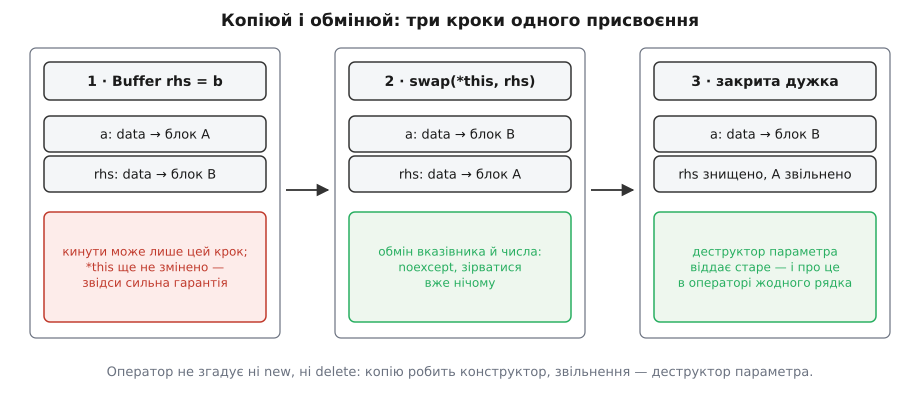
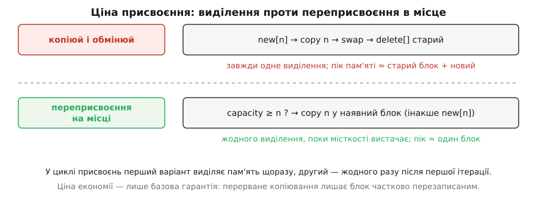

# ⚙️ Копіюй і обмінюй: присвоєння, зібране з конструктора й деструктора

<preknowlist>
- [Категорії значень: lvalue, prvalue, xvalue](topic:sys-plang-cpp/value-categories) — чому `b` і `std::move(b)` є виразами різних категорій і чому саме категорія аргумента вирішує, який конструктор спрацює.
- [Семантика переміщення і rvalue-посилання](topic:sys-plang-cpp/move-semantics) — що означає `T&&`, що насправді робить `std::move` і чому переміщення забирає нутрощі замість дублювати їх.
- [Гарантії безпеки винятків: базова, сильна, nothrow](topic:sys-plang-cpp/exception-safety-guarantees) — різниця між «об'єкт лишився справним» і «об'єкт лишився таким самим, як був».
- [noexcept: обіцянка й наслідки](topic:sys-plang-cpp/noexcept) — що це слово обіцяє компіляторові й бібліотеці та що станеться, коли обіцянку порушити.
- [Простори імен і пошук, залежний від аргументів](topic:sys-plang-cpp/namespaces-and-adl) — як некваліфікований виклик знаходить функцію в просторі імен свого аргумента.
</preknowlist>

**Задача.** Написати присвоєння класу, що володіє ресурсом, так, щоб воно одночасно виконувало чотири вимоги: віддало старий ресурс і набуло новий; при виключенні на середині лишило об'єкт **точно таким, яким він був** (сильна гарантія); не ламалося на `a = a` без окремої перевірки; і не роздвоювалося на два майже однакові оператори — копіювальний і переміщувальний.

Написати це вручну можна, і виходить правильно. Але подивіться, скільки разів у такому класі повторено те саме знання:

```cpp
Buffer& operator=(const Buffer& other) {
    char* fresh = new char[other.size];        // ← «як добути блок» — уже було в конструкторі
    std::memcpy(fresh, other.data, other.size); // ← «як копіювати блок» — теж
    delete[] data;                              // ← «як віддати блок» — уже було в деструкторі
    data = fresh;
    size = other.size;
    return *this;
}

Buffer& operator=(Buffer&& other) noexcept {
    if (this != &other) {                       // ← сторожа, яку легко забути
        delete[] data;                          // ← «як віддати блок» — утретє
        data = std::exchange(other.data, nullptr);
        size = std::exchange(other.size, 0);
    }
    return *this;
}
```

Клас відповідає на питання «як копіювати цей ресурс» двічі — у копіювальному конструкторі й тут; на питання «як його звільняти» — тричі. Додайте до класу член `std::string name` — і його треба згадати в чотирьох тілах із п'яти. Кожен пропуск дає клас, який копіюється **майже** правильно, а це найгірший різновид помилки: він не падає, він тихо втрачає поле.

Отже, задача точніша, ніж здавалася: не «написати правильні присвоєння», а **зробити так, щоб присвоєння взагалі не містило знання про ресурс**.

## Ідея: обидві половини вже написані

Присвоєння — це рівно дві дії: набути новий вміст і віддати старий. Перше вже вміє копіювальний конструктор. Друге вже вміє деструктор. Бракує лише способу з'єднати їх так, щоб між ними не з'явилося вікна, у якому об'єкт зіпсований.

Спосіб такий.

**Крок перший — узяти параметр за значенням.** Не `const Buffer&`, а `Buffer`. Тоді копію робить компілятор, викликаючи ваш же копіювальний конструктор при ініціалізації параметра. Найважливіше тут — **коли** це відбувається: стандарт вимагає, щоб усі побічні дії обчислення аргументів були впорядковані **до входу у функцію** ([expr.call]). Тобто на момент, коли починається тіло оператора, копія або вже успішно існує, або виключення полетіло далі, а `*this` ніхто навіть не торкнувся.

**Крок другий — обміняти нутрощі.** `*this` віддає свої поля параметрові, а забирає його. Після обміну об'єкт-призначення тримає новий вміст, а параметр — старий. Параметр — звичайна локальна змінна; на закритій дужці він гине, і **його деструктор** віддає старий ресурс. Жодного `delete[]` в операторі не написано.


*Єдиний крок, здатний кинути виключення, — перший, і він відбувається до входу в оператор. Далі йде обмін машинних слів, який зірватися не може, і смерть параметра, яка теж не може. Звідси сильна гарантія: або все, або нічого.*

Три властивості, за які раніше треба було боротися окремо, тепер **випливають**, а не додаються.

**Сильна гарантія.** Кинути може лише виділення пам'яті в копії, і воно передує будь-якій зміні `*this`.

**Безпечне самоприсвоєння.** `a = a` спершу робить копію `a`, і тільки потім щось міняє. Знищувати нема чого — старе живе в параметрі до самого кінця. Перевірка `this != &other` стає не «латкою, яку прибрали», а питанням, яке не виникає.

**Один оператор замість двох.** Параметр за значенням ініціалізують за загальними правилами: з lvalue — копіювальним конструктором, з rvalue — переміщувальним. Вибір «копіювати чи переміщувати» роблять **конструктори**, один раз, ще до входу в оператор. Саме тіло не знає, що саме сталося, — і не мусить знати.

## Обмін, який не має права зірватися

Уся конструкція тримається на одному припущенні: після успішної копії далі **вже нічого не може піти не так**. Тому `swap` мусить бути `noexcept` — і не як побажання, а як умова коректності.

Уявіть протилежне. Клас має три члени-ресурси; обмін іде по одному; на другому летить виключення. Перший член уже обміняний, третій ще ні — обидва об'єкти в стані, якого не передбачає жодний інваріант, і **відкотити нема чим**: щоб відкотити, треба обміняти назад, а обмін щойно показав, що вміє кидати. Сильна гарантія знищена не тим, що операція не вдалася, а тим, що після неї немає узгодженого стану.

Тому власний `swap` пишуть як обмін самих полів. Обмін вказівника й цілого числа — це переставляння машинних слів: без виділення пам'яті, без викликів, без жодної причини кинути.

> 🔧 **Навіщо це.** `noexcept` на `swap` читає не лише людина. Бібліотечний `std::swap` оголошений із умовним виключенням: він `noexcept` рівно тоді, коли `is_nothrow_move_constructible_v<T> && is_nothrow_move_assignable_v<T>`. Ця умова тягнеться далі — у `std::move_if_noexcept`, яким контейнери вирішують, переміщувати елементи при перерозподілі чи копіювати їх задля можливості відкоту. Тип, у якого обмін і переміщення не позначені `noexcept`, тихо втрачає швидкодію всюди, де його кладуть у `std::vector`.

Тут-таки причаїлася пастка, яку легко не помітити. Реалізація `std::swap` за замовчуванням — три переміщення: тимчасовий об'єкт із першого, друге **присвоєння** в перший, третє присвоєння в другий. Тепер уявіть клас, у якому `operator=` реалізовано обміном, а власного `swap` немає. Присвоєння кличе `std::swap`, `std::swap` кличе присвоєння, присвоєння знову кличе `std::swap` — рекурсія без дна, і програма вмирає на переповненні стека. Звідси залізне правило: **власний `swap` обмінює поля й ніколи не спирається на присвоєння свого ж типу**.

## Чому `swap` шукають через ADL

Написати `std::swap(a, b)` було б найпростіше — і найгірше: кваліфікований виклик відрізає ваш власний обмін, і клас, для якого ви написали дешеве переставляння вказівників, ганяє три переміщення.

Спокуса номер два — «навчити» сам `std::swap` вашого типу. Це зробити не можна. Додавати оголошення до простору імен `std` заборонено: поведінка програми, яка це робить, невизначена ([namespace.std]). До C++20 лишалася шпарина — дозвіл повністю спеціалізувати бібліотечний шаблон для власного типу, і бібліотеки цим користувалися. Пропозиція P0551 Волтера Брауна («Не спеціалізуй бібліотечних шаблонів функцій!») цю шпарину закрила: тепер дозвіл поширюється лише на **шаблони класів**, а для точок налаштування, до яких належить і `swap`, санкціонований механізм один — **перевантаження поруч із власним типом**. Слід від цієї зміни видно в реальних бібліотеках: `nlohmann/json` прибрала свою спеціалізацію `std::swap` під C++20 і замінила її прихованим другом (злито в червні 2020-го, версія 3.9.0).

Прихований друг (англ. *hidden friend*) — це `friend`-функція, **визначена прямо в тілі класу**. Звичайний пошук за іменем її не бачить: вона не потрапляє ні в область видимості класу, ні в оточливий простір імен як звичайне ім'я. Знайти її можна єдиним способом — через [пошук, залежний від аргументів](topic:sys-plang-cpp/namespaces-and-adl), тобто маючи на руках аргумент вашого типу. Для `swap` це ідеально: функція не засмічує простір імен, не бере участі в розв'язанні перевантажень там, де вона ні до чого, і водночас гарантовано знаходиться там, де потрібна.

Звідси й двокроковий виклик, який виглядає дивно, поки не знаєш причини:

```cpp
using std::swap;   // 1. кладемо бібліотечний варіант у набір кандидатів — як запасний
swap(a, b);        // 2. некваліфікований виклик додає туди все, що знайде ADL
```

`using` не виконує виклику — він лише вводить ім'я. Некваліфікований виклик збирає кандидатів з обох джерел і вибирає найкращого: є ваш `swap` — виграє він; немає — спрацює бібліотечний. Один рядок, що працює і для `int`, і для `std::vector`, і для вашого типу.

Так само роблять і стандартні алгоритми. `std::iter_swap` специфіковано «наче через `swap(*a, *b)`» — саме некваліфіковано, отже, `std::sort` над масивом ваших об'єктів знайде ваш обмін без жодних додаткових зусиль.

## Робочий код

Мова тут одна й безальтернативна: ідіома описує саме семантику спеціальних функцій C++, і переказати її іншою мовою нічим.

**Клас з одноосібним володінням блоком, присвоєння через копіюй-і-обмінюй.**

```cpp
#include <cstddef>
#include <cstring>
#include <utility>

class Buffer {
    char*       data = nullptr;
    std::size_t size = 0;
public:
    Buffer() = default;
    explicit Buffer(std::size_t n) : data(new char[n]), size(n) {}

    // єдине місце, де написано «як добути й скопіювати блок»
    Buffer(const Buffer& other)
        : data(other.size ? new char[other.size] : nullptr), size(other.size) {
        if (size) std::memcpy(data, other.data, size);
    }

    // ОБОВ'ЯЗКОВИЙ — і не заради швидкості, див. пастку нижче
    Buffer(Buffer&& other) noexcept
        : data(std::exchange(other.data, nullptr)),
          size(std::exchange(other.size, 0)) {}

    // єдине місце, де написано «як віддати блок»
    ~Buffer() { delete[] data; }

    // прихований друг: невидимий звичайному пошуку, знаходиться через ADL
    friend void swap(Buffer& a, Buffer& b) noexcept {
        using std::swap;
        swap(a.data, b.data);
        swap(a.size, b.size);
    }

    // один оператор на копіювальне й переміщувальне присвоєння
    Buffer& operator=(Buffer rhs) noexcept {
        swap(*this, rhs);
        return *this;
    }
};
```

Чотири речі варті окремого погляду.

**`noexcept` на самому операторі законний.** Тіло складається з виклику `noexcept`-функції й повернення посилання — кинути тут нема чому. Копія, яка кинути може, будується при ініціалізації аргумента, а це, за [expr.call], відбувається до входу у функцію: виключення полетить із місця виклику й `noexcept` оператора не порушить. Знищення параметра теж безпечне — деструктор і так неявно `noexcept`.

**Усередині `swap` двокрокова форма працює на членах.** Для `char*` і `std::size_t` ADL не знаходить нічого, тож спрацьовує `std::swap`. Але напишіть форму саме так — і в день, коли член стане типом зі своїм дешевим обміном, код підхопить його без правок.

**Виклик `swap(*this, rhs)` у тілі оператора не потребує `using`**, бо аргументи мають тип `Buffer`, і ADL приводить просто до прихованого друга. `using` там не завадить, але й не потрібен.

**Порядок «спершу копія, потім обмін» ніде не записаний явно** — його забезпечує сама мова: параметр не може бути неініціалізованим на початку тіла.

Що з цього виходить на місці виклику:

```cpp
Buffer a(8), b(16);

a = b;                // rhs ← копіювальний конструктор:  одне виділення, одне копіювання
a = std::move(b);     // rhs ← переміщувальний конструктор: жодного виділення
a = Buffer(32);       // rhs І Є той тимчасовий: жодного конструктора копії чи переміщення
a = a;                // копія, обмін, смерть копії: марна робота, але не поламка
```

Третій рядок вартий уваги окремо. Аргумент — prvalue, тому параметр **ініціалізується безпосередньо**: тимчасового об'єкта, який потім кудись переносили б, не існує взагалі. Це не оптимізація на розсуд компілятора, а [гарантоване усунення копій](topic:sys-plang-cpp/copy-elision), обов'язкове з C++17. Присвоєння з тимчасового виявляється найдешевшим із трьох варіантів.

## Ціна: що саме ви платите

Порахуймо присвоєння `a = b`, де `a` вже тримає блок на `m` байтів, а `b` — на `n`.

```
копіюй і обмінюй:      new[n] + copy(n) + swap + delete[m]
                       виділень: 1     живих блоків у піку: 3  (a, b, копія)

переприсвоєння в місце: якщо capacity ≥ n → copy(n)
                       виділень: 0     живих блоків у піку: 2  (a, b)
```

Копіювань байтів однаково — по одному на кожен елемент. Уся різниця у **виділеннях пам'яті**, і саме вона вирішує на гарячому шляху.


*У циклі `for (…) dst = src;` перший варіант виділяє й звільняє блок на кожній ітерації, другий — жодного разу після першої. Ціна економії — втрата сильної гарантії: перерване копіювання лишає наявний блок частково перезаписаним, отже, об'єкт справний, але змінений.*

Ось чому [контейнери стандартної бібліотеки](topic:sys-plang-cpp/stl-containers-choice) цю ідіому **не** використовують: усі поширені реалізації `std::vector` і `std::string` при присвоєнні переприсвоюють елементи в наявний буфер, поки місткості вистачає, і виділяють новий лише коли не вистачає. Вони свідомо обмінюють сильну гарантію на базову, бо для контейнера присвоєння — операція масова.

Критику ідіоми саме за цю ціну сформулював Матьє Ропер у розборі «Copy and Swap, 20 years later» (січень 2019-го), відлічуючи двадцять років від першої публікації прийому — задачі GotW #59 Герба Саттера «Exception-Safe Class Design, Part 1: Copy Assignment» (липень 1999-го, пізніше перероблена в *More Exceptional C++*). Аргумент простий: сильна гарантія коштує зайвого виділення й піку пам'яті, і платити її варто там, де вона потрібна, а не всюди за звичкою.

Звідси й межа застосовності. **Беріть**, коли ресурс неподільний і переприсвоїти його «на місці» однаково неможливо — дескриптор, з'єднання, відображення файлу, [одноосібний власник](topic:sys-plang-cpp/unique-ptr) — або коли членів кілька й тримати сильну гарантію вручну означає писати відкоти. **Не беріть** для типів із місткістю, які присвоюють у циклі: там ідіома перетворює нульову вартість на виділення пам'яті щоразу.

## Пастки

**Забутий переміщувальний конструктор — і переміщень немає взагалі.** Оголошення `Buffer& operator=(Buffer rhs)` формально є **копіювальним** присвоєнням: за визначенням мови копіювальний оператор присвоєння — це той, чий єдиний параметр має тип `X`, `X&` або `const X&`, і варіант за значенням підпадає під нього. А оголошений користувачем копіювальний оператор присвоєння забороняє компіляторові неявно оголосити переміщувальний конструктор. Наслідок гучний за ціною й німий за симптомами: без власноруч написаного `Buffer(Buffer&&)` вираз `a = std::move(b)` збереться без єдиного попередження, rvalue зв'яжеться з `const Buffer&`, і параметр буде **скопійовано** — глибоко, з виділенням і `memcpy`. Уся швидка половина ідіоми живе саме в переміщувальному конструкторі; немає його — немає й переміщень.

**Не лишайте поруч другого оператора присвоєння.** Спокуса «додати ще й швидкий шлях» ламає збірку:

```cpp
Buffer& operator=(Buffer rhs) noexcept;      // (1)
Buffer& operator=(Buffer&& rhs) noexcept;    // (2)  ← і тепер a = std::move(b) неоднозначне
```

Для rvalue-аргумента обидва кандидати мають точну відповідність: у (1) параметр ініціалізують без жодного перетворення, у (2) посилання зв'язують без жодного перетворення. Правила [розв'язання перевантажень](topic:sys-plang-cpp/overload-resolution) не містять критерію, який віддавав би перевагу зв'язуванню посилання перед ініціалізацією параметра за значенням, — тож компілятор чесно каже «ambiguous». Те саме станеться з `operator=(const Buffer&)` поруч, тільки для lvalue. Правило просте: **параметр за значенням — і жодного іншого оператора присвоєння**.

**Самопереміщення працює — але не робіть із цього загального висновку.** Розберімо `a = std::move(a)` по кроках: параметр `rhs` переміщувально конструюють із `a`, тож `a` спорожнів, а дані в `rhs`; `swap` повертає дані в `a`, а порожнечу — у `rhs`; `rhs` гине з порожнечею. Підсумок: `a` має рівно те, що мав, без жодної перевірки на тотожність. Рукописний переміщувальний оператор без сторожі `this != &other` на цьому місці звільнив би власний блок і взяв би собі щойно звільнену адресу.

Проте це властивість **вашого** класу, а не гарантія мови. Для бібліотечних типів стандарт обіцяє менше: самопереміщення дозволене й не є невизначеною поведінкою, але залишає об'єкт у справному, проте невизначеному стані, якщо для конкретного типу не сказано інакше. Цю дірку закривали двічі — питаннями комітету LWG 2468 і LWG 2839, друге з яких увійшло до робочого папера в листопаді 2020-го. Практичний висновок: `v = std::move(v)` для `std::vector` не зруйнує програму, але й не зобов'язане зберегти вміст — тож узагальнений код, що працює з довільним `T`, спиратися на збереження значення не може.

**Класична форма з rvalue-посиланням має власну ваду.** Іноді замість параметра за значенням пишуть окремий переміщувальний оператор через обмін:

```cpp
Buffer& operator=(Buffer&& rhs) noexcept { swap(*this, rhs); return *this; }
```

Він коректний, але після `a = std::move(b)` об'єкт `b` **не порожній**: він дістав старі нутрощі `a` й триматиме їх до кінця свого часу життя. Формально претензій немає — джерело переміщення й має бути в справному, але невизначеному стані. Практично це мегабайти, що не звільняються там, де автор коду розраховував на звільнення, і закритий дескриптор, який лишається відкритим. Параметр за значенням цієї вади позбавлений: старе дістається локальній змінній, а локальна змінна гине на закритій дужці.

**Ідіома не рятує клас із посиланням на самого себе.** Якщо об'єкт зберігає вказівник на власний член — вбудований буфер, вузол, кешований ітератор, — обмін полями переставить і цей вказівник, і кожен об'єкт почне вказувати на чужі нутрощі. Тут `swap` теж доводиться писати вручну, полагоджуючи внутрішні посилання після обміну; ніякої економії ідіома вже не дає.
