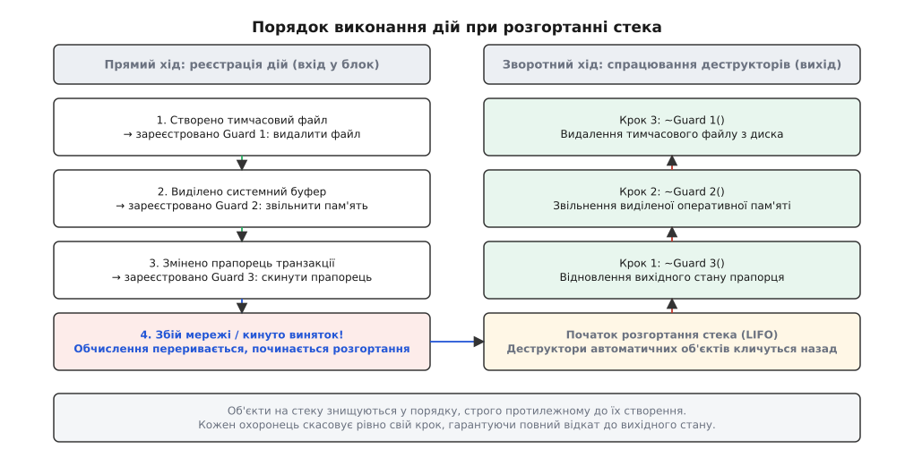
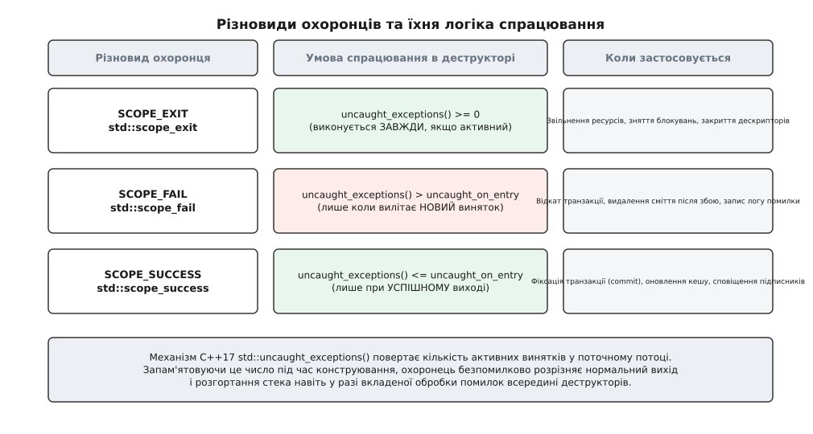
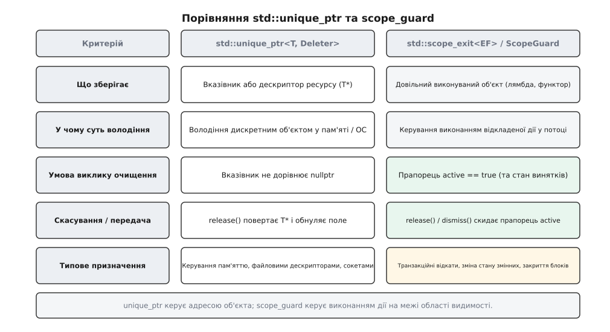

# Охоронець області: відкат через деструктор

<preknowlist>
- [Конструктор і деструктор](topic:sf-lang/constructors-destructors) — деструктор автоматичного об'єкта викликається на виході з області, зокрема й на виході через виняток.
- [RAII: ресурс прив'язаний до часу життя](topic:sf-lang/raii) — захопити ресурс у конструкторі, звільнити в деструкторі.
- [unique_ptr: одноосібне володіння](topic:sys-plang-cpp/unique-ptr) — як розумний покажчик керує адресою в купі й видаляє об'єкт на межі видимості.
- [Час життя об'єкта](topic:sys-plang-cpp/object-lifetime) — межі існування сутностей на стеку та порядок їх руйнування (LIFO).
- [Семантика переміщення і rvalue-посилання](topic:sys-plang-cpp/move-semantics) — як передати володіння ресурсом без копіювання і знеструмити джерело.
</preknowlist>

## Коли операція ламається на півдорозі

Уявімо типову системну операцію: оновлення облікового запису користувача у розподіленій системі. Процедура вимагає виконання чотирьох послідовних кроків: спершу зменшити баланс на першому рахунку й збільшити на другому, потім виділити буфер транзакції в динамічній пам'яті, записати зміну в журнал аудиту на диску і, нарешті, надіслати підтвердження через мережевий сокет:

```cpp
void apply_transfer(Account& from, Account& to, double amount, AuditLog& log, Network& net) {
    from.balance -= amount;                  // крок 1: змінили стан у пам'яті
    to.balance += amount;

    auto* tx_buf = new TransactionRecord();  // крок 2: виділили пам'ять (може кинути std::bad_alloc)

    log.append(from.id(), to.id(), amount);  // крок 3: запис на диск (може кинути FileError)

    net.send_receipt(from.id(), amount);     // крок 4: мережа (може кинути SocketError)

    delete tx_buf;
}
```

Якщо на третьому або четвертому кроці стається збій — накопичувач переповнений, мережевий кабель від'єднано або віддалений вузол відхилив пакет, — функція негайно переривається винятком. Буфер `tx_buf` залишається висіти в купі як класичний витік пам'яті, але це лише найпростіша частина проблеми. Набагато небезпечніше те, що гроші з балансу `from` уже списані, баланс `to` поповнений, а транзакція не зафіксована й не завершена. Стан оперативної пам'яті процесу виявився неузгодженим, розірваним і спотвореним.

У теорії надійного програмування такий збій класифікують через рівні виняткових гарантій (англ. *exception safety guarantees*), сформульовані Дейвом Абрагамсом:
- **Базова гарантія** (англ. *basic guarantee*): у разі виникнення винятку пам'ять і системні дескриптори не витікають, усі об'єкти програми залишаються у валідному внутрішньому стані, але змінені дані можуть не відповідати початковим.
- **Сильна гарантія** (англ. *strong guarantee*), або транзакційна поведінка: операція або виконується повністю й успішно, або, у разі будь-якого збою, стан усієї системи повертається точно до моменту перед початком виклику («все або нічого»).
- **Гарантія відсутності винятків** (англ. *no-throw guarantee* / `noexcept`): операція ніколи не завершується винятком і гарантовано виконує свої обов'язки (критично для деструкторів та функцій звільнення ресурсів).

Функція `apply_transfer` не забезпечує навіть базової гарантії: вона втрачає покажчик на виділену динамічну пам'ять і залишає частково змінені бізнес-поля `balance`.

Класична спроба розв'язати цю проблему в процедурному стилі через явне перехоплення помилок перетворює код на заплутаний каскад вкладених блоків:

```cpp
void apply_transfer_nested(Account& from, Account& to, double amount, AuditLog& log, Network& net) {
    from.balance -= amount;
    to.balance += amount;

    TransactionRecord* tx_buf = nullptr;
    try {
        tx_buf = new TransactionRecord();
        try {
            log.append(from.id(), to.id(), amount);
            try {
                net.send_receipt(from.id(), amount);
            } catch (...) {
                log.rollback_last();
                throw;
            }
        } catch (...) {
            delete tx_buf;
            throw;
        }
    } catch (...) {
        from.balance += amount; // відкат балансу
        to.balance -= amount;
        throw;
    }

    delete tx_buf;
}
```

У цій піраміді з трьох рівнів `try-catch` логіка прямої дії відірвана від логіки її відкату на десятки рядків. Додавання п'ятого кроку вимагає створення ще одного рівня вкладеності. Пропуск хоча б однієї гілки `catch` або помилка у виклику компенсувальної дії призводить до тихого спотворення даних, яке надзвичайно важко діагностувати під навантаженням.

Альтернативний процедурний стиль, успадкований із мови C — єдина точка виходу з каскадом міток `goto fail_step2`, — у C++ стає безпорадним перед винятками: будь-який виняток перериває нормальний потік керування й оминає явні оператори `goto`.

Мові C++ потрібен був механізм, який дозволив би писати дію відкату безпосередньо поруч із дією модифікації стану та гарантував її виконання деструктором на будь-якому шляху виходу з області видимості.

## Чому регулярний RAII не покриває довільні дії

Ідіома RAII ([ресурс прив'язаний до часу життя](topic:sf-lang/raii)) є наріжним каменем безпеки C++. Вона бездоганно працює для регулярних системних ресурсів, що мають чітко виражену сутність та життєвий цикл: динамічна пам'ять обгортається в `std::unique_ptr`, м'ютекс — у `std::lock_guard`, файловий дескриптор — у файловий потік `std::fstream`.

Проте в реальних програмах значна частина дій очищення та відкату не є «володінням ресурсом» у класичному розумінні. Це довільні точкові модифікації стану програми, інваріантів структури даних або мережевого протоколу:
- зменшити атомарний лічильник активних потоків або з'єднань `active_connections--`;
- відновити попереднє значення глобального прапорця режиму `debug_mode = old_mode`;
- видалити проміжний запис із хеш-таблиці `cache.erase(key)`;
- скинути курсор графічного контексту `ctx.restore_clip_rect()`;
- виконати інструкцію відкату локальної транзакції `db.execute("ROLLBACK")`.

Створювати окремий повноцінний клас із конструктором і деструктором під кожну таку одноразову дію в коді — це шлях до вибухового зростання шаблонного коду (англ. *boilerplate*). Розробник змушений писати класи `BalanceRollbackGuard`, `DebugFlagRestorer`, `CacheEntryCleaner`, захаращуючи кодову базу сотнями дрібних структур, кожна з яких використовується рівно один раз в одному місці.

Потрібен був загальний, універсальний інструмент — **охоронець області видимості** (англ. *Scope Guard*), здатний перетворити довільний фрагмент коду чи замикання (лямбду) на деструктор автоматичного об'єкта.

## Анатомія універсального охоронця ScopeGuard

Концепція охоронця області базується на фундаментальній гарантії мови C++: деструктори автоматичних стекових змінних викликаються **завжди**, коли потік виконання залишає область видимості (через звичайний `return`, вихід за межі блоку `}`, оператор `break`, `goto` чи внаслідок розгортання стека винятком).

Мінімальна канонічна реалізація охоронця області складається з функціонального об'єкта та булевого прапорця активності:

```cpp
template <typename Invocable>
class ScopeGuard {
    Invocable action_;
    bool active_{true};

public:
    // Конструктор захоплює довільну дію за семантикою переміщення
    explicit ScopeGuard(Invocable action) noexcept
        : action_(std::move(action)) {}

    // Деструктор викликає збережену дію, якщо охоронець не скасовано
    ~ScopeGuard() noexcept {
        if (active_) {
            action_();
        }
    }

    // Скасування виконання відкату після успіху
    void dismiss() noexcept {
        active_ = false;
    }

    // Заборона копіювання: відкат не можна дублювати
    ScopeGuard(const ScopeGuard&) = delete;
    ScopeGuard& operator=(const ScopeGuard&) = delete;

    // Переміщення передає обов'язок відкату новому об'єкту, знеструмлюючи джерело
    ScopeGuard(ScopeGuard&& other) noexcept
        : action_(std::move(other.action_)),
          active_(std::exchange(other.active_, false)) {}

    ScopeGuard& operator=(ScopeGuard&& other) = delete;
};
```

Розгляньмо ключові інженерні рішення цієї структури:

1. **Поле `active_` та метод `dismiss()` (або `release()`):** Це серце транзакційної моделі. Коли операція виконується успішно до самого кінця, викликається `dismiss()`. Прапорець скидається в `false`, і на виході з функції деструктор нічого не робить. Якщо ж на півдорозі виникає збій чи вилітає виняток, виконання функції переривається до виклику `dismiss()`, прапорець залишається `true`, і деструктор автоматично виконує відкат.
2. **Заборона копіювання:** Якщо скопіювати `ScopeGuard`, два стекові об'єкти отримають копію тієї самої дії та активний прапорець. На виході деструктор спрацює двічі, що призведе до подвійного звільнення або подвійного відкату.
3. **Семантика переміщення з обнуленням:** Переміщувальний конструктор забирає функціональний об'єкт і за допомогою `std::exchange(other.active_, false)` переводить джерело в неактивний стан. Старий об'єкт стає безпечним «порожнім» охоронцем.
4. **Гарантія `noexcept` деструктора:** Деструктор не повинен випускати винятків назовні, інакше під час активного розкручування стека середовище виконання викличе `std::terminate()`.

Тепер початковий приклад із банківським переказом записується чисто, лінійно та винятково безпечно:

```cpp
void apply_transfer_safe(Account& from, Account& to, double amount, AuditLog& log, Network& net) {
    from.balance -= amount;
    to.balance += amount;
    // Реєструємо відкат балансу поруч зі зміною:
    auto balance_guard = ScopeGuard([&] {
        from.balance += amount;
        to.balance += amount;
    });

    auto* tx_buf = new TransactionRecord();
    // Реєструємо видалення пам'яті:
    auto memory_guard = ScopeGuard([tx_buf] {
        delete tx_buf;
    });

    log.append(from.id(), to.id(), amount);
    auto log_guard = ScopeGuard([&] {
        log.rollback_last();
    });

    net.send_receipt(from.id(), amount);

    // УСІ кроки виконано успішно: скасовуємо відкати бізнес-стану
    log_guard.dismiss();
    balance_guard.dismiss();

    // memory_guard НЕ скасовуємо — tx_buf треба видалити наприкінці в будь-якому разі
}
```

Код набув строгої транзакційної структури: кожна дія супроводжується власним охоронцем відкату у наступному ж рядку. Якщо функція переривається на виклику `net.send_receipt`, об'єкти `log_guard`, `memory_guard` та `balance_guard` знищуються у порядку, строго протилежному до їх створення на стеку.

## Збереження за значенням проти посилань: пастка висячих замикань

Критично важливим аспектом проектування `ScopeGuard` є спосіб збереження функціонального об'єкта всередині класу.

Якщо наївно зберегти замикання за посиланням:

```cpp
// ПОМИЛКОВА РЕАЛІЗАЦІЯ: збереження за посиланням
template <typename F>
class BadRefScopeGuard {
    const F& fn_; // Висяче посилання на тимчасову лямбду!
public:
    BadRefScopeGuard(const F& fn) : fn_(fn) {}
    ~BadRefScopeGuard() { fn_(); }
};
```

Створення такого охоронця через тимчасовий лямбда-вираз `BadRefScopeGuard guard([&]{ cleanup(); });` призводить до катастрофи. Тимчасовий об'єкт замикання знищується в кінці рядка ініціалізації, а поле `fn_` залишається висячим посиланням (dangling reference) на знищену пам'ять. Виклик деструктора на виході з функції звертається до сміття в пам'яті, що призводить до невизначеної поведінки ([використання після звільнення](topic:sys-plang-cpp/dangling-references)).

Саме тому правильна реалізація завжди зберігає функціональний об'єкт **за значенням** як `std::decay_t<Invocable>`, переміщуючи замикання всередину стекового об'єкта охоронця.

Завдяки оптимізації порожньої бази (EBO) або атрибуту C++20 `[[no_unique_address]]` для безстатусних лямбд (`[] { ... }`), об'єкт охоронця не витрачає пам'ять на порожнє замикання й займає рівно 1 байт під прапорець `active_`.

## Порядок LIFO під час розгортання стека

Деструктори автоматичних об'єктів виконуються у порядку LIFO (англ. *last in, first out* — останнім створений, першим знищений). Це властивість самої моделі виконання C++, і для охоронців області вона має фундаментальне значення:


*Порядок створення охоронців при прямому виконанні та порядок спрацювання їхніх деструкторів під час розгортання стека.*

Коли операція 1 відкриває ресурс A, операція 2 відкриває ресурс B (що спирається на A), а операція 3 змінює глобальний стан, охоронці формують правильний стек компенсації. Під час аварійного виходу першим відкочується крок 3, потім закривається ресурс B, і лише після цього звільняється кореневий ресурс A.

## Три грані виходу: SCOPE_EXIT, SCOPE_FAIL, SCOPE_SUCCESS

У практичному коді виникає потреба у трьох принципово різних сценаріях поведінки охоронця:

1. **Безумовний вихід (`SCOPE_EXIT`):** дія повинна виконуватися **завжди**, як при нормальному виході з блоку, так і в разі винятку. Це аналог блоку `finally` у таких мовах, як Java, C# чи Python, або інструкції `defer` у мовах Go, Zig та Swift. Приклад: закрити файловий дескриптор, розблокувати м'ютекс, прибрати тимчасовий буфер.
2. **Аварійний вихід (`SCOPE_FAIL`):** дія повинна виконуватися **лише тоді, коли блок залишається через виняток**. При успішному виході дія ігнорується без потреби вручну писати `guard.dismiss()`. Приклад: відкотити транзакцію в базі даних, видалити пошкоджений тимчасовий файл, записати діагностичне повідомлення про збій у системний журнал.
3. **Успішний вихід (`SCOPE_SUCCESS`):** дія повинна виконуватися **лише у разі безаварійного завершення блоку**. Якщо вилітає виняток, дія пропускається. Приклад: зафіксувати транзакцію (`commit`), оновити кеш, надіслати сповіщення підписникам події.

Детальніше про те, як ці три форми розвивалися від перших макросів Александреску до мови D і стандарту C++, описано в історичному нарисі: [від статті Александреску до P0052: історія охоронців області](topic:sys-plang-cpp/scope-guard/hist-scope-guard.md).

## Як деструктор дізнається про виняток: механізм std::uncaught_exceptions()

Для реалізації `SCOPE_FAIL` та `SCOPE_SUCCESS` виникає ключове питання: як деструктор охоронця в момент свого виклику може дізнатися, чи викликається він під час звичайного виходу за фігурну дужку `}`, а чи під час розгортання стека через виняток?

### Пастка C++98: булевий прапорець `std::uncaught_exception()`

У стандарті C++98 існувала функція `std::uncaught_exception()` (в однині), яка повертала булеве значення `true`, якщо в поточному потоці виконувалося розгортання стека через виняток.

На перший погляд, цього здавалося достатньо:

```cpp
// Наївна і помилкова реалізація ScopeFail у C++98
class NaiveScopeFail {
    std::function<void()> fn_;
public:
    ~NaiveScopeFail() {
        if (std::uncaught_exception()) { // Працює некоректно при вкладеності!
            fn_();
        }
    }
};
```

Цей підхід катастрофічно ламався у разі вкладеної обробки винятків. Розгляньмо ситуацію: деструктор якогось об'єкта `Widget` викликається під час розгортання стека першим винятком. Усередині цього деструктора `Widget` виконує внутрішню операцію, яка створює власний `try-catch` блок і викликає функцію, де розташований `NaiveScopeFail`:

```cpp
struct Widget {
    ~Widget() {
        try {
            // Внутрішня безаварійна операція
            do_internal_work(); 
        } catch (...) {
            // локально перехопили внутрішню помилку
        }
    }
};
```

Коли функція `do_internal_work()` успішно завершується, `NaiveScopeFail` бачить, що `std::uncaught_exception()` досі повертає `true` (бо первинний виняток усе ще розгортає зовнішній стек!). Охоронець помилково вважає, що функція `do_internal_work()` впала з помилкою, і запускає небажаний відкат.

Через цей дефект функція `std::uncaught_exception()` була оголошена застарілою (deprecated) у C++17 і повністю видалена у C++20.

### Рішення C++17: цілочисельний лічильник `std::uncaught_exceptions()`

У C++17 було впроваджено функцію `std::uncaught_exceptions()` (у множині), яка повертає `int` — точну кількість активних винятків у поточному потоці виконання:


*Принцип роботи лічильника активних винятків: різниця між значенням на момент виходу та значенням на момент створення визначає наявність нового винятку.*

Коли створюється охоронець `scope_fail` або `scope_success`, він фіксує поточне значення лічильника активних винятків у момент свого конструювання:

```cpp
class ScopeFail {
    std::function<void()> action_;
    int uncaught_on_enter_{std::uncaught_exceptions()};

public:
    explicit ScopeFail(std::function<void()> action)
        : action_(std::move(action)) {}

    ~ScopeFail() noexcept {
        // Якщо кількість активних винятків зросла — стався новий виняток!
        if (std::uncaught_exceptions() > uncaught_on_enter_) {
            action_();
        }
    }
};

class ScopeSuccess {
    std::function<void()> action_;
    int uncaught_on_enter_{std::uncaught_exceptions()};

public:
    explicit ScopeSuccess(std::function<void()> action)
        : action_(std::move(action)) {}

    ~ScopeSuccess() noexcept {
        // Якщо кількість винятків не змінилася — вихід був нормальним
        if (std::uncaught_exceptions() <= uncaught_on_enter_) {
            action_();
        }
    }
};
```

Цей простий арифметичний тест `current_count > initial_count` надійно працює за будь-яких рівнів вкладеності винятків, у деструкторах, сокетах та вкладених транзакціях.

Простежимо стан лічильника на конкретних кроках:
1. Початковий стан потоку: `std::uncaught_exceptions() == 0`.
2. Функція `outer()` починає виконання, створює `ScopeFail` із `uncaught_on_enter_ = 0`.
3. Виникає виняток: середовище збільшує лічильник до `1` і починає розкручувати стек `outer()`.
4. Під час розкручування викликається деструктор локального об'єкта, який всередині запускає `inner()`.
5. Функція `inner()` створює свій власний `ScopeFail` із `uncaught_on_enter_ = 1`.
6. Якщо `inner()` завершується нормально: на її виході лічильник дорівнює `1`. Порівняння `1 > 1` дає `false` — її охоронець **не спрацьовує**.
7. Коли керування повертається до розкручування `outer()`: лічильник дорівнює `1`. Порівняння `1 > 0` дає `true` — охоронець `outer()` **спрацьовує**.

Арифметична різниця повністю ізолює вкладені контексти виконання один від одного.

## Транзакційні конструктори складних об'єктів

Особливо потужною сферою застосування Scope Guard є забезпечення виняткової безпеки всередині конструкторів складних класів (англ. *exception-safe constructors*).

За правилами C++, якщо під час виконання конструктора виникає виняток, деструктор цього класу **ніколи не викликається** — оскільки мова вважає, що об'єкт так і не народився. Якщо конструктор встиг виділити сирі ресурси (відкрити сокет або виділити системний дескриптор) до точки збою, ці ресурси безповоротно витікають:

```cpp
class NetworkService {
    int socket_fd_{-1};
    void* buffer_{nullptr};

public:
    NetworkService(const char* host, int port) {
        socket_fd_ = ::open_socket(host, port);
        // Охоронець закриє сокет, якщо наступний крок викине виняток:
        auto socket_rollback = ScopeGuard([this] noexcept {
            if (socket_fd_ >= 0) ::close(socket_fd_);
        });

        buffer_ = ::allocate_huge_buffer(); // може викинути виняток!

        // Все успішно: об'єкт повністю сконструйований, відкат скасовуємо
        socket_rollback.dismiss();
    }

    ~NetworkService() {
        if (buffer_) ::free_huge_buffer(buffer_);
        if (socket_fd_ >= 0) ::close(socket_fd_);
    }
};
```

Охоронець `socket_rollback` захищає проміжний стан конструктора. Якщо `allocate_huge_buffer()` зазнає невдачі, деструктор `~NetworkService()` не викликатиметься, але `socket_rollback` надійно закриє дескриптор сокета, перш ніж виняток полетить далі.

## Поєднання з legacy C-бібліотеками без створення класів-обгорток

При інтеграції з класичними бібліотеками мови C (наприклад, POSIX сокети, OpenSSL, libcurl, zlib, регулярні вирази POSIX regex) розробники стикаються з парою функцій ініціалізації та звільнення:
- `regcomp(&re, pattern, ...)` вимагає обов'язкового `regfree(&re)`;
- `curl_easy_init()` вимагає `curl_easy_cleanup(curl)`;
- `getaddrinfo(...)` вимагає `freeaddrinfo(res)`.

Замість написання громіздких класів `CurlHandleWrapper` або `RegexHolder`, Scope Guard дозволяє зробити виклик абсолютно безпечним у місці використання:

```cpp
void resolve_and_fetch(const char* hostname) {
    addrinfo* res = nullptr;
    if (::getaddrinfo(hostname, "80", nullptr, &res) != 0) {
        throw std::runtime_error("DNS lookup failed");
    }
    // Гарантоване звільнення C-пам'яті на будь-якому шляху виходу:
    auto res_guard = ScopeGuard([res] noexcept {
        ::freeaddrinfo(res);
    });

    CURL* curl = ::curl_easy_init();
    if (!curl) throw std::runtime_error("curl init failed");
    auto curl_guard = ScopeGuard([curl] noexcept {
        ::curl_easy_cleanup(curl);
    });

    // Виконання роботи...
    // Навіть якщо обробка кине виняток, curl і res будуть звільнені деструкторами
}
```

Код набуває суворої безпеки C++ при роботі з сирим C API без жодного рядка додаткового структурного коду.

## Тимчасове маскування сигналів операційної системи

Ще одним важливим системним сценарієм є тимчасове маскування асинхронних сигналів операційної системи під час виконання критичної секції пам'яті. Якщо функція блокує доставку сигналів через системний виклик `sigprocmask` або `pthread_sigmask`, будь-який вихід із функції (зокрема через виняток або ранній `return`) зобов'язаний відновити початкову маску сигналів:

```cpp
#include <csignal>
#include <scope>

void execute_critical_section() {
    sigset_t new_mask, old_mask;
    sigfillset(&new_mask);
    // Блокуємо всі сигнали для поточного потоку
    pthread_sigmask(SIG_SETMASK, &new_mask, &old_mask);

    // Охоронець гарантовано відновить початкову маску при будь-якому виході
    std::scope_exit signal_restorer = [&old_mask] noexcept {
        pthread_sigmask(SIG_SETMASK, &old_mask, nullptr);
    };

    // Виконання чутливої операції...
}
```

Без охоронця області розробник був би змушений дублювати виклик `pthread_sigmask` перед кожним оператором `return` або писати нестандартні обгортки.

## Скасування потоків POSIX Threads (Cancellation Points)

У багатопотокових системах POSIX потік може бути асинхронно або синхронно зупинений іншим потоком через виклик `pthread_cancel()`. Коли потік досягає точки скасування (англ. *cancellation point*, наприклад системного виклику `read`, `write`, `sleep`), середовище виконання Linux (NPTL / glibc) генерує спеціальний псевдовиняток розгортання `abi::__forced_unwind`.

Оскільки `std::scope_exit` та деструктори RAII інтегровані в таблиці розкручування стека бінарного інтерфейсу (Itanium ABI), усі зареєстровані охоронці області видимості гарантовано викликаються навіть під час скасування потоку через `pthread_cancel()`. Це забезпечує надійне звільнення заблокованих м'ютексів і дескрипторів без ризику виникнення взаємних блокувань (deadlocks) у паралельних сервісах.

## Порівняння з gsl::finally

У бібліотеці підтримки рекомендацій (англ. *Guidelines Support Library*, GSL), створеній Б'ярном Страуструпом та Гербом Саттером, є функція `gsl::finally`. Вона також базується на виклику замикання в деструкторі стекового об'єкта.

Проте між `gsl::finally` та сімейством `std::scope_exit` є суттєві архітектурні відмінності:
1. **Відсутність скасування:** Клас, створений `gsl::finally`, не має методу `dismiss()` або `release()`. Його неможливо скасувати при успішному завершенні транзакції.
2. **Єдиний режим:** `gsl::finally` підтримує лише безумовний вихід (еквівалент `scope_exit`). Він не вміє розрізняти аварійний вихід (`scope_fail`) та безаварійне завершення (`scope_success`).
3. **Призначення:** `gsl::finally` створювався як простий і швидкий аналог ключового слова `finally` для початківців. Стандартні класи `std::scope_exit`, `std::scope_fail` та `std::scope_success` проектувалися як повноцінний промисловий каркас для побудови винятково-безпечних транзакційних конвеєрів.

## Динамічні стеки компенсації для змінної кількості дій

У сценаріях, коли кількість дій заздалегідь невідома (наприклад, обробка масиву записів у циклі), статичного створення змінних охоронців недостатньо. У такому разі застосовують динамічний стек компенсації (англ. *dynamic compensation stack*):

```cpp
#include <vector>
#include <functional>
#include <scope>

void process_batch_items(const std::vector<Item>& items, Storage& storage) {
    std::vector<std::function<void()>> rollbacks;
    rollbacks.reserve(items.size());

    // Якщо будь-який елемент дасть збій — відкочуємо всі попередні у зворотному порядку
    std::scope_fail batch_guard = [&rollbacks] noexcept {
        for (auto it = rollbacks.rbegin(); it != rollbacks.rend(); ++it) {
            try {
                (*it)();
            } catch (...) {
                // ігноруємо вторинні помилки у деструкторі
            }
        }
    };

    for (const auto& item : items) {
        storage.insert(item);
        rollbacks.push_back([&storage, id = item.id()] {
            storage.remove(id);
        });
    }

    // Усі елементи вставлено успішно — деструктор batch_guard не спрацює
}
```

Цей патерн поєднує гнучкість динамічних контейнерів із детермінізмом автоматичного руйнування стекових охоронців.

## Потоковий контракт та взаємодія з потоками виконання

Охоронці області видимості проектуються як виключно стеко-локальні сутності, прив'язані до конкретного потоку (англ. *thread-bound*):

1. **Потоково-локальний лічильник:** Функція `std::uncaught_exceptions()` повертає кількість винятків лише для поточного системного потоку. Стан винятків в інших паралельних потоках на неї не впливає.
2. **Передача між потоками:** Переміщувати активний `std::scope_fail` або `std::scope_exit` в інший потік (наприклад, через чергу завдань пулу потоків) вкрай небезпечно, якщо лямбда захоплює змінні локального стека першого потоку за посиланням. Такий перетин межі потоків майже гарантовано призводить до стану гонитви або висячих адрес. Якщо дію необхідно передати в асинхронний виконавець, слід використовувати повноцінне захоплення за значенням або запаковану задачу `std::packaged_task`.

## Низькорівневий механізм ядра виконання: Itanium ABI та таблиці винятків

Щоб зрозуміти, як середовище виконання C++ взаємодіє з `ScopeGuard`, розгляньмо механізм обробки винятків на рівні двійкового інтерфейсу (ABI):

1. **Таблиці LSDA (Language Specific Data Area):** Сучасні компілятори C++ використовують так звані «нуль-вартісні винятки» (англ. *zero-cost exception model*). На звичайному шляху виконання (happy path) компілятор не виконує жодних інструкцій реєстрації деструкторів. Замість цього у секцію `.eh_frame` бінарного файлу записується статична таблиця адрес інструкцій та відповідних їм блоків очищення (англ. *landing pads*).
2. **Розкручування стека (Stack Unwinding):** Коли виконується інструкція `throw`, функція середовища `__cxa_throw` збільшує лічильник активних винятків у потоково-локальній структурі `__cxa_eh_globals`. Бібліотека розкручування (`libunwind`) аналізує таблиці `.eh_frame`, визначає фрейми функцій на стеку і послідовно передає керування на секції посадкових майданчиків (landing pads), де розташовані деструктори охоронців.
3. **Епілог функції:** На нормальному шляху виходу компілятор просто вставляє тіло деструктора `ScopeGuard` безпосередньо перед інструкцією `ret`.

## Охоронець області проти std::unique_ptr з делітером

Часто виникає запитання: навіщо потрібен окремий клас охоронця області, якщо стандартний розумний покажчик `std::unique_ptr` дозволяє передати власний делітер?

Порівняймо структуру та призначення цих двох інструментів:


*Структурна різниця між керуванням ресурсом (unique_ptr) та керуванням потоком виконання (ScopeGuard).*

Розгляньмо спробу реалізувати закриття файлового дескриптора через `std::unique_ptr`:

```cpp
// Закриття через unique_ptr із лямбда-делітером
auto file_deleter = [](FILE* f) { if (f) fclose(f); };
std::unique_ptr<FILE, decltype(file_deleter)> file_guard(fopen("data.bin", "rb"), file_deleter);
```

Цей підхід має суттєві обмеження:
1. **Прив'язка до покажчика:** `unique_ptr` обов'язково вимагає наявності значення-адреси. Якщо ресурс не є вказівником (наприклад, дескриптор POSIX `int fd`, відновлення лічильника чи скасування транзакції в базі даних), `unique_ptr` стає незручним і неприродним.
2. **Семантика nullptr:** Делітер `unique_ptr` викликається **лише тоді**, коли внутрішній покажчик не є нульовим (`p != nullptr`). Для цілочисельних ресурсів, де `0` є цілком валідним дескриптором (наприклад, `stdin`), така логіка вимагає штучних адаптерів.
3. **Призначення сутності:** `std::unique_ptr` відповідає за **володіння дискретним об'єктом** у пам'яті або ОС. `ScopeGuard` відповідає за **виконання дії в потоці керування**, незалежно від наявності об'єктів чи пам'яті.

## Порівняння з іншими мовами програмування

Концепція гарантованого виконання коду на виході з блоку є універсальною проблемою системного проектування. Різні мови програмування обрали різні архітектурні рішення:

1. **Мова Go (`defer`):** В інструкції `defer fn()` функціональне замикання реєструється під час виконання у динамічному списку викликів у фреймі горутини. Дії `defer` виконуються завжди при виході з функції (аналог `SCOPE_EXIT`). Проте `defer` у Go прив'язаний до межі всієї функції, а не до локального лексичного блоку `{ ... }`, що може призводити до затримок звільнення ресурсів усередині довгих циклів. Крім того, аргументи функції в `defer` обчислюються одразу в точці оголошення, що іноді стає причиною неочевидних помилок.
2. **Мова Zig (`defer` та `errdefer`):** Zig використовує лексичну прив'язку до поточного блоку. Інструкція `defer` виконується завжди на виході з блоку, а `errdefer` — лише у разі повернення помилки (`error`). Це точний синтаксичний еквівалент `SCOPE_EXIT` та `SCOPE_FAIL`, реалізований на рівні ключових слів мови.
3. **Мова D (`scope(exit)`, `scope(failure)`, `scope(success)`):** Мова D надає найбільш повний набір із трьох вбудованих інструкцій.
4. **Мова C++:** C++ досягає абсолютно тієї самої виразності без додавання нових ключових слів до граматики мови, спираючись виключно на існуючий фундамент конструкторів і деструкторів RAII.

## Стандартизація C++: std::scope_exit, std::scope_fail, std::scope_success

У межах Technical Specification (P0052R10 / Library Fundamentals TS v3) комітет ISO C++ уніфікував патерн Scope Guard, додавши до стандартної бібліотеки заголовок `<scope>`:

```cpp
#include <scope>
#include <fstream>
#include <iostream>

void process_transaction_modern(Database& db, const std::string& query) {
    db.execute("BEGIN TRANSACTION");

    // Відкат у разі винятку
    std::scope_fail rollback_guard = [&] noexcept {
        db.execute("ROLLBACK");
    };

    // Фіксація у разі успіху
    std::scope_success commit_guard = [&] noexcept {
        db.execute("COMMIT");
    };

    // Безумовне логування тривалості на виході
    const auto start_time = std::chrono::steady_clock::now();
    std::scope_exit log_guard = [&] noexcept {
        auto elapsed = std::chrono::steady_clock::now() - start_time;
        std::cout << "Query executed in " << elapsed.count() << " ms\n";
    };

    db.execute(query); // якщо виклик кине виняток — спрацює rollback_guard і log_guard
}
```

Завдяки механізму CTAD (виведення аргументів шаблону класу) тип лямбда-виразу виводиться автоматично. Повний опис інтерфейсів, методів та вимог специфікації P0052 наведено у довіднику: [інтерфейс std::scope_exit, std::scope_fail та std::scope_success](topic:sys-plang-cpp/scope-guard/api-scope-guards.md).

Практичне застосування охоронців для побудови атомарного файлового конвеєра з гарантованим відкатом продемонстровано у проекті: [транзакційний конвеєр: надійна модифікація файлів із відкатом](topic:sys-plang-cpp/scope-guard/proj-transactional-pipeline.md).

## Ціна в машинному коді: оптимізація та нульовий оверхед

Scope Guard є яскравим прикладом нуль-вартісної абстракції (англ. *zero-overhead abstraction*) у C++:

1. **Інлайнінг:** Оскільки лямбда передається як тип параметра шаблону класу, оптимізувальний компілятор (GCC, Clang, MSVC) повністю вбудовує тіло лямбди в точку виходу з функції. Ніяких непрямих викликів чи звернень через покажчики на функції не відбувається.
2. **Відсутність алокацій:** Охоронець розміщується виключно на стеку і не використовує купу (`heap`), на відміну від `std::function`.
3. **Zero-cost Exception Handling:** На архітектурах x86-64 реєстрація охоронця на стеку коштує нуль машинних інструкцій у нормальній гілці коду. Компілятор генерує статичну таблицю DWARF / SEH unwind info. Якщо виняток не виникає, програма не виконує жодної додаткової перевірки прапорців; якщо виникає — таблиця скеровує виконання на деструктор охоронця.
4. **Усунення мертвого коду (Dead Code Elimination):** Якщо охоронець `std::scope_exit` використовується без виклику `dismiss()`, компілятор оптимізує булевий прапорець `active_`, повністю викидаючи перевірку умови `if (active_)` і генеруючи прямий виклик коду очищення в епілозі функції.
5. **Об'єднання таблиць очищення:** Коли в одній функції оголошено кілька послідовних охоронців `ScopeGuard`, оптимізатор компілятора генерує єдину ланцюгову секцію landing pad, де деструктори викликаються у строгому LIFO порядку без дублювання службових інструкцій розгортання.

## Пастки проектування та крайові випадки

Застосування охоронців області вимагає дотримання кількох важливих правил для уникнення важковловимих помилок:

### 1. Небезпека винятків у деструкторі

Деструктор будь-якого охоронця повинен мати гарантію `noexcept`. Якщо під час розкручування стека через первинний виняток деструктор охоронця сам викине новий виняток, середовище C++ не зможе обробити два активні винятки одночасно й негайно викличе функцію аварійної зупинки `std::terminate()`.

Тому всі виклики всередині лямбди охоронця повинні бути захищені:
```cpp
// ПРАВИЛЬНО: внутрішнє перехоплення помилок
auto safe_guard = std::scope_exit([&] noexcept {
    try {
        db.cleanup();
    } catch (...) {
        // логування без викидання назовні
    }
});
```

### 2. Захоплення за посиланням проти значення

Якщо змінна, стан якої відновлюється, може бути модифікована далі у тілі функції, її початкове значення необхідно захоплювати **за значенням**:
```cpp
int original_state = get_state();
set_state(NEW_STATE);

// ПРАВИЛЬНО: захоплюємо копію original_state
auto state_guard = std::scope_fail([original_state] noexcept {
    set_state(original_state);
});
```

Якщо помилково захопити `[&original_state]`, на момент виклику деструктора посилання вказуватиме на вже змінену змінну, і відкат застосує некоректний стан.

### 3. Анонімні тимчасові об'єкти

Створення охоронця без збереження у змінну є грубою помилкою:
```cpp
// ПОМИЛКА: тимчасовий об'єкт знищиться прямо в цьому рядку!
std::scope_exit([&] { unlock(); });
// тут м'ютекс уже розблоковано завчасно!
```

Для запобігання цій помилці класи стандарту P0052 позначені атрибутом `[[nodiscard]]`.

### 4. Взаємодія з сопрограмами (C++20 Coroutines)

Усередині сопрограм, що використовують `co_await`, деструктори стекових охоронців **не викликаються** під час призупинення виконання. Вони спрацьовують лише тоді, коли сопрограма остаточно завершується через `co_return` або знищується через дескриптор.

Охоронці області видимості поєднують строгі математичні гарантії детермінованого руйнування об'єктів RAII із локальністю та виразністю коду, усуваючи необхідність у складних процедурних каскадах відкату й забезпечуючи надійну транзакційну безпеку сучасних системних програм.
