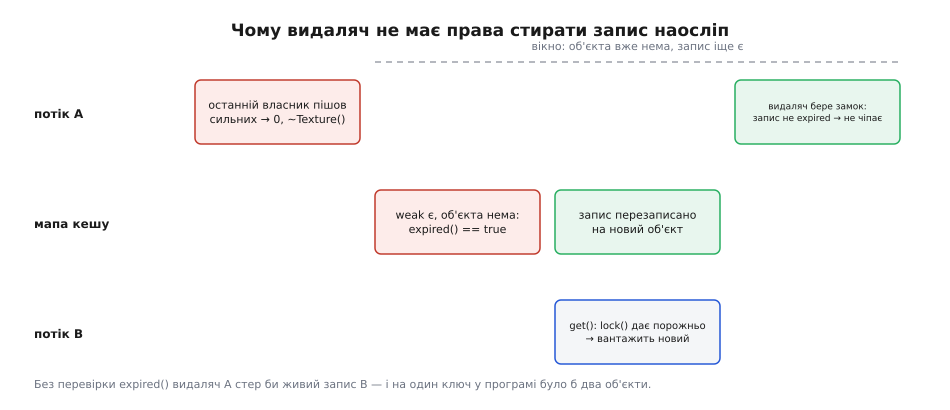

# ⚙️ Кеш ресурсів на weak_ptr

Це фабрика, яка на однаковий ключ віддає той самий об'єкт, поки він комусь потрібен, — і не продовжує йому життя ані на мить довше. Уся її пам'ять складається зі слабких посилань, тож сама вона не володіє нічим; нижче — робочий код такої фабрики й три місця, де вона тихо ламається, якщо написати її навпростець.

## Задача: одна текстура на всіх і жодної зайвої

Сцена складається з двохсот об'єктів, і сорок із них покриті тією самою текстурою каменю. Файл важить кілька мегабайтів, розпакування коштує мілісекунди, місце у відеопам'яті скінченне. Дві очевидні відповіді однаково погані.

Без кешу кожен об'єкт вантажить текстуру собі: сорок розпакувань і сорок копій одного й того самого в пам'яті.

Мапа зі звичайними `shared_ptr` у значеннях це виправляє й одразу створює гірше. Мапа сама стає власником: щойно текстуру завантажено, вона житиме, доки живе кеш. Сцену змінили, камінь не потрібен більше нікому — а кеш тримає. Через годину роботи в ньому лежить усе, що програма колись показала; це вже не кеш, а список побаченого, і викинути з нього щось можна лише вручну, вгадуючи момент.

Потрібне те, що між ними: віддавати той самий об'єкт, поки з ним хоч хтось працює, і забути про нього, щойно пішов останній справжній власник. Хто саме останній — уже порахує сильний лічильник; завдання кеша — не втручатися в цей облік своєю часткою.

## Мапа зі слабкими значеннями

Звідси й уся конструкція: ключ → `weak_ptr` на значення. Слабке посилання не входить у число власників, тож наявність запису в мапі нічого не продовжує. А `lock()` — це водночас і питання «чи ще живий», і відповідь у вигляді повноцінного `shared_ptr`, тож між перевіркою й використанням не лишається щілини, у яку міг би втрутитися інший потік.

Перший начерк виглядає так, і він майже правильний:

```cpp
std::unordered_map<std::string, std::weak_ptr<Texture>> entries;

std::shared_ptr<Texture> get(const std::string& key) {
    if (auto alive = entries[key].lock())      // ще комусь потрібна
        return alive;
    auto fresh = std::make_shared<Texture>(key);
    entries[key] = fresh;                      // мапа лише спостерігає
    return fresh;
}
```

Він робить головне: сорок об'єктів отримають одну текстуру, а коли зникне сороковий, деструктор `Texture` спрацює негайно — кеш його не затримає.

## Ключ переживає значення

Зате з мапи ніщо ніколи не зникає. Текстура померла, `weak_ptr` у значенні став порожнім, але сам запис лежить далі — з живим ключем-рядком. Мапа росте рівно так само, як росла б із сильними значеннями, тільки повільніше й непомітніше: тепер витікає не мегабайт пікселів, а десятки байтів на ключ.

Дешевими ці десятки байтів теж не є. Мертвий `weak_ptr` тримає керівний блок, а блок не можна звільнити, поки на нього дивиться хоч один спостерігач. Якщо об'єкт створено через `make_shared`, блок і сам об'єкт лежать в одній ділянці купи — і ця ділянка не повернеться, доки живий запис у мапі. Вийде так, що деструктор текстури відпрацював вчасно, ресурс відеокарти звільнено, а мегабайти в купі висять, бо про них іще «пам'ятає» кеш.

Отже, порожні записи треба прибирати. Прибирати можна двома способами: періодичним обходом мапи (просто, але сміття живе до наступного проходу) або в мить смерті — тим самим механізмом, що знищує об'єкт.

## Видаляч, який прибирає за собою

Друга можливість краща й майже безкоштовна, бо `shared_ptr` уже несе в керівному блоці спосіб знищення. Туди можна покласти не просто `delete`, а `delete` плюс рядок прибирання — і тоді запис зникне рівно тоді, коли зникне значення.

```cpp
class TextureCache : public std::enable_shared_from_this<TextureCache> {
public:
    static std::shared_ptr<TextureCache> create() {
        return std::shared_ptr<TextureCache>(new TextureCache);
    }

    std::shared_ptr<Texture> get(const std::string& key) {
        {                                    // 1. швидкий шлях під замком
            std::lock_guard lock(mutex_);
            auto it = entries_.find(key);
            if (it != entries_.end())
                if (auto alive = it->second.lock())
                    return alive;
        }

        // 2. важке завантаження — БЕЗ замка, кеш обслуговує інших
        std::shared_ptr<Texture> fresh(
            new Texture(key),
            [weak_self = weak_from_this(), key](Texture* raw) {
                delete raw;                             // спершу смерть об'єкта
                if (auto cache = weak_self.lock())
                    cache->drop(key);                   // потім прибирання запису
            });

        // 3. публікація: поки ми вантажили, хтось міг устигнути перший
        std::lock_guard lock(mutex_);
        auto& slot = entries_[key];
        if (auto winner = slot.lock())
            return winner;                   // наш fresh знищиться на виході
        slot = fresh;
        return fresh;
    }

private:
    TextureCache() = default;

    void drop(const std::string& key) {
        std::lock_guard lock(mutex_);
        auto it = entries_.find(key);
        if (it != entries_.end() && it->second.expired())
            entries_.erase(it);              // живого наступника не чіпаємо
    }

    std::mutex mutex_;
    std::unordered_map<std::string, std::weak_ptr<Texture>> entries_;
};
```

Кожен рядок тут відповідає на конкретну загрозу.

**Видаляч бачить кеш слабко.** Захопи він `shared_ptr` на кеш — і вийшов би цикл навпаки: керівний блок текстури тримав би кеш, а кеш дивився б слабко на блок. Кеш перестав би вмирати за командою власника й помирав би замість цього в довільному потоці всередині чужого видаляча. Слабке захоплення дає просту домовленість: кеш вільний померти першим, а тоді `weak_self.lock()` поверне порожньо й прибирати буде нічого й нікуди.

**Спершу `delete`, потім замок.** Деструктор `Texture` — чужий код, і він цілком може смикнути той самий кеш (скажімо, відпустити дочірній ресурс, узятий звідти ж). Виконувати його, тримаючи `mutex_`, означає домовлятися про дедлок; тому об'єкт гине перше, а мапа чіпається вже без нього ([м'ютекс і RAII-замки](root:sys-plang-cpp/mutex-and-raii-locks)).

**Конструктор закритий, вхід через `create()`.** `weak_from_this()` дає порожнє посилання, поки об'єкт не взято під нагляд `shared_ptr`, — кеш на стеку мовчки залишився б без самоочищення.

**`fresh` створено до `lock_guard`.** Порядок оголошення локальних змінних тут не косметика: знищуються вони у зворотному порядку, тож замок відпуститься раніше, ніж помре наш `fresh`, — і його видаляч не потрапить під уже взятий м'ютекс.

> 🔧 **Навіщо це.** Захоплений у лямбду `key` живе в керівному блоці текстури — не в мапі. Тому запис знає, як себе видалити, навіть коли від об'єкта не лишилося нічого, крім блока; ціна — копія ключа на кожне значення й заборона на `make_shared` (власний видаляч вимагає окремого виділення під блок). Для мегабайтної текстури це вигідний обмін: пам'ять об'єкта повертається одразу, а не разом із записом ([лямбди й захоплення](root:sys-plang-cpp/lambdas-and-captures)).

## Чому видаляч не має права стирати наосліп

Найтонше місце — рядок `it->second.expired()` у `drop`. Спокуса написати просто `entries_.erase(key)`: об'єкт помер, чого ще перевіряти?

Ось чого. Між смертю об'єкта й тим моментом, коли видаляч дістанеться мапи, минає час, і замок на цей час свідомо відпущено. У це вікно чудово вміщується чужий `get()` на той самий ключ: він побачить порожній `lock()`, вирішить, що об'єкта нема, завантажить новий і покладе його в той самий запис. Коли видаляч нарешті візьме замок, у мапі лежатиме вже не його небіжчик, а чужий живий об'єкт.



*Час іде зліва направо. Перевірка `expired()` відрізняє власний мертвий запис від чужого живого — і саме вона тримає обіцянку «один ключ — один об'єкт».*

Стерти його — не збій і не витік, а тиха втрата тотожності: наступний `get()` не знайде запису й завантажить третій об'єкт на той самий ключ. Два різні `Texture` для одного файлу — рівно те, заради чого кеш і писали.

Те саме вікно відкриває і третій крок `get()`: два потоки можуть узятися вантажити один ключ одночасно. Переможе той, хто перший узяв замок на публікації; програвець просто віддасть чужий об'єкт, а свій знищить на виході — і його видаляч, зустрівши в мапі живий запис, чемно нічого не зробить. Ціна такої розв'язки — зайве завантаження; коли воно надто дороге, у мапі тримають не результат, а обіцянку результату (`std::shared_future`), і тоді другий потік чекає замість вантажити ([cache stampede](root:sf-distributed/cache-stampede)).

## Ціна й межі

Швидкий шлях коштує одного гешування ключа плюс `lock()` — атомарне порівняння-із-заміною на сильному лічильнику, яке може крутнутися ще раз, якщо в нього втрутився сусідній потік. Прибирання — теж O(1). Пам'ять запису: ключ, два слова слабкого посилання й керівний блок, який живе, поки живе запис.

Платить за прибирання не той, хто ним користується. `drop` виконується в тому потоці, який відпустив останню частку володіння, — часто це потік, що малює кадр або обробляє запит, і саме він раптом стає в чергу за м'ютексом кеша. Поки `drop` — це пошук і видалення одного запису, ціна непомітна; але це вагома причина не додавати в нього нічого важчого. Якщо замок і без того гарячий, видаляч можна залишити зовсім без нього: скласти ключ у чергу відкладеного прибирання, а мапу вимітати наступним викликом `get()`, який і так бере замок.

Пастка, у яку легко впасти на рівному місці: писати `if (!it->second.expired()) return it->second.lock();`. Це дві операції там, де вистачає однієї, і між ними є вікно — `expired()` каже про минуле, `lock()` вирішує тепер ([гонка між перевіркою й використанням](root:sf-security/toctou-race)). У `drop` перевірка доречна саме тому, що там не потрібен об'єкт: питання не «чи можна ним користуватися», а «чи це той самий запис».

І головна межа, яку варто назвати вголос: це взагалі не кеш у звичному значенні слова. Він нічого не утримує й нічого не витісняє — щойно останній користувач пішов, наступний запит платить повне завантаження. Якщо потрібно, щоб недавні ресурси лишалися теплими, зверху кладуть маленький список **сильних** посилань на останні N об'єктів: саме він стає утримувачем із політикою витіснення ([політики витіснення кешу](root:sf-data/cache-eviction-policies)), а слабка мапа лишається тим, чим є, — таблицею тотожності «один ключ — не більше одного живого об'єкта».

Ця обіцянка тримається, поки кеш — єдині двері. Один `new Texture("камінь")` повз фабрику — і в програмі знову два камені, про які вона нічого не знає.
