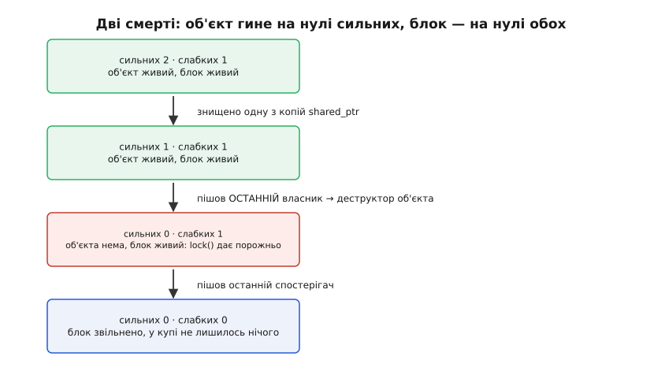
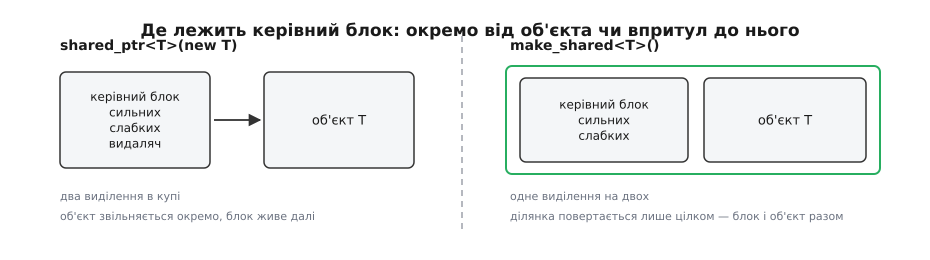
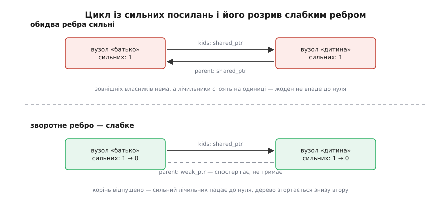

# shared_ptr і weak_ptr: спільне володіння й розрив циклів

<preknowlist>
- [Час життя об'єкта](root:sys-plang-cpp/object-lifetime) — коли об'єкт починає й перестає існувати і що саме робить його деструктор.
- [RAII: ресурс прив'язаний до часу життя](root:sf-lang/raii) — ресурс захоплює конструктор, звільняє деструктор, і робить це рівно один раз.
- [Підрахунок посилань](root:sf-lang/reference-counting) — сама ідея обліку: об'єкт живий, поки число посилань на нього більше за нуль.
- [Купа](root:sf-lang/heap-dynamic-memory) — звідки береться динамічна пам'ять і чому кожне виділення коштує на порядки дорожче за присвоєння.
- [unique_ptr: одноосібне володіння](root:sys-plang-cpp/unique-ptr) — звичайний випадок: власник рівно один, і передати володіння можна тільки переміщенням.
- [std::atomic і порядок пам'яті](root:sys-plang-cpp/std-atomic) — чому число, яке правлять кілька потоків, мусить змінюватися атомарною операцією.
</preknowlist>

## Хто звільняє те, чим користуються троє

Кадр із камери потрапляє водночас у три місця: його малює вікно перегляду, його стискає кодувальник, його переглядає детектор руху. Три шматки коду не знають один про одного й працюють у різному темпі — вікно перемалює кадр за мілісекунду, кодувальник триматиме його доти, доки не набере групу кадрів, детектор може відкласти обробку до наступного такту.

Кадр займає кілька мегабайтів, тож копіювати його втричі нерозумно. Отже, всі троє дивляться на один буфер — і хтось мусить його звільнити. Хто?

Кожен із трьох може відповісти лише за себе: «я закінчив». Ніхто з них не бачить, чи закінчили інші. Той, хто звільнить буфер першим, залишить двом іншим покажчик у нікуди; той, хто побоїться звільняти, залишить пам'ять назавжди зайнятою. Розклад роботи теж не рятує: він міняється від навантаження, від розміру групи кадрів, від того, чи встиг детектор.

Правда, якої бракує, звучить так: «я — останній». Її не знає жоден із трьох окремо, зате її можна порахувати. Достатньо тримати біля буфера число — скільки зараз є охочих на нього дивитися; кожен, хто починає користуватися, збільшує його на одиницю, кожен, хто закінчив, зменшує. Той, чиє зменшення дало нуль, і є останній — і саме він звільняє буфер. Жодного знання про інших це не потребує: локальна дія кожного дає глобально правильну відповідь.

Саме це й робить `std::shared_ptr` — покажчик, який на додачу до адреси веде облік власників. Три учасники тримають три його копії; коли остання зникає, об'єкт знищується.

```cpp
auto frame = std::make_shared<Frame>(1920, 1080);   // облік: 1
preview.show(frame);     // копія покажчика всередині → облік: 2
encoder.push(frame);     // ще копія                 → облік: 3
```
Кожна копія `shared_ptr` — це ще один зареєстрований власник; кожен знищений `shared_ptr` — один власник менше. Деструктор `Frame` викличе той із трьох, хто відпустить кадр останнім, — і рівно в ту мить, коли відпустить.

Шлях цього типу в стандарт був довгий: рахунковий покажчик пропонували комітетові ще 1994 року, потім він визрівав у Boost, і лише 2011-го потрапив у мову. [Як народився shared_ptr](root:sys-plang-cpp/shared-weak-ptr/hist-shared-ptr-birth.md) — про `counted_ptr` Ґреґа Колвіна, про провал `auto_ptr`, про те, чому `weak_ptr` з'явився окремо й пізніше, і які саме грабки Boost змусили комітет ухвалити папір N1450.

## Число живе поряд з об'єктом, а не в ньому

Лічильник треба десь тримати, і перша спокуса — покласти його полем усередину самого об'єкта. Так робить чимало ручних реалізацій, але для загального типу з бібліотеки це не годиться. `shared_ptr<int>` мусить працювати, а в `int` поля не додаси; `shared_ptr` над чужим класом із закритої бібліотеки — теж, і чіпати його визначення нікому не дозволено.

Є й друга, важливіша причина, і вона видасться зрозумілішою трохи згодом: спостерігач мусить пережити об'єкт. Коли останній власник пішов, об'єкт треба знищити негайно — але той, хто ще дивиться збоку, мусить десь прочитати «його вже нема». Якби лічильник жив в об'єкті, він загинув би разом з ним, і питати стало б нема в кого.

Тому число виносять у окрему службову структуру поряд — **керівний блок** (control block). Він переживає об'єкт і зберігає все, що потрібно знати про його долю: скільки є власників, скільки спостерігачів і чим саме цей об'єкт знищувати. Через це `shared_ptr` — це два покажчики: на сам об'єкт і на його блок. Тому `sizeof(std::shared_ptr<T>)` удвічі більший за звичайний покажчик, і тому передавати його «безкоштовно, це ж покажчик» не вийде.

Два покажчики в одному об'єкті незалежні, і стандарт цим користується: `shared_ptr` може показувати на поле всередині об'єкта, володіючи при цьому цілим об'єктом. Механіку такого покажчика й решту інтерфейсу зібрано окремо — [що саме стирчить у shared_ptr і weak_ptr](root:sys-plang-cpp/shared-weak-ptr/api-shared-weak.md): конструктори, `make_shared` й `allocate_shared`, аліасний конструктор, `owner_before`, `use_count`, власні видалячі, масиви й атомарні операції з версіями стандарту, у яких кожне з цього з'явилося.

Як побудувати таку конструкцію власноруч і де в ній ховаються гонки — розібрано в іншому місці: [розумний покажчик із підрахунком посилань](root:sf-lang/reference-counting/proj-shared-ptr.md) доводить голу ідею до робочого типу з керівним блоком і слабкими посиланнями. Тут же йдеться про те, що з цієї конструкції випливає для того, хто нею користується.

## Два лічильники — дві смерті

У блоці не одне число, а два: скільки **сильних** посилань (власників) і скільки **слабких** (спостерігачів). Розведення потрібне тому, що це два різні питання з різними наслідками, і вони не збігаються в часі.



*Сильний лічильник вирішує долю об'єкта, слабкий — долю самого блока. Між двома смертями блок існує з єдиною метою: чесно відповідати спостерігачам «його вже нема».*

Коли сильний лічильник падає до нуля, викликається деструктор об'єкта. Негайно, у тому самому потоці, у тій самій точці коду, де зник останній власник — а не колись пізніше, коли до цього дійдуть руки в збирача сміття. Це не дрібниця: якщо об'єкт тримає файл, замок чи з'єднання, момент звільнення видно ззовні, і «колись пізніше» тут неприйнятне.

Блок після цього ще живий — доти, доки є хоч один спостерігач. Він уже не має об'єкта, але має правду про нього, і саме по цю правду до нього приходять. Коли зникає останній спостерігач і немає власників, блок звільняється, і від об'єкта не лишається нічого.

## Звідки береться пам'ять

Блок і об'єкт можуть жити в купі окремо або разом, і це залежить від того, як покажчик створено.

```cpp
std::shared_ptr<Frame> a(new Frame(w, h));      // два виділення пам'яті
auto b = std::make_shared<Frame>(w, h);         // одне
```

Перший рядок виділяє пам'ять двічі: спершу `new` бере ділянку під `Frame`, потім конструктор `shared_ptr` бере ще одну — під блок, бо готового блока для чужого сирого покажчика не існує. Другий рядок бере одну ділянку на двох і будує об'єкт просто в ній, за блоком.



*`make_shared` міняє два виділення на одне й кладе блок упритул до об'єкта — але тим самим зшиває їхню пам'ять в одну ділянку, яку не можна повернути частинами.*

Виграш подвійний. Виділення в купі — операція дорога, і одна замість двох помітна там, де об'єкти створюються часто. До того ж лічильник опиняється в одній кеш-лінії з початком об'єкта: код, який чіпає і покажчик, і поля, тягне з пам'яті один рядок замість двох.

Плата за це — саме та зшитість. Пам'ять під об'єкт не можна повернути окремо від блока, а блок живе, поки є спостерігачі. Тож коли `make_shared` створює кадр на кілька мегабайтів, а десь лишається один слабкий покажчик на нього, деструктор кадру відпрацює вчасно, але мегабайти висітимуть у купі, доки не зникне той спостерігач. Для дрібних об'єктів це ніщо, для великих буферів із довгоживучими спостерігачами — привід узяти окремий `new`.

Друга межа `make_shared` — вона будує об'єкт сама, а отже, не вміє прийняти власний видаляч і не дістанеться до закритого конструктора без невеличкої хитрості з дозволом.

> 🔧 **Навіщо це.** `make_shared` варто зробити типовим способом створення — не лише заради швидшого виділення, а тому, що він не залишає моменту, коли об'єкт уже створено, а власника ще немає. У виразі `f(std::shared_ptr<A>(new A), g())` компілятор має право виконати `new A`, потім `g()`, і якщо `g()` кине виняток, свіжий `A` витече, бо `shared_ptr` над ним іще не збудовано. `make_shared<A>()` такої щілини не має взагалі.

## Видаляч запам'ятовується, а не виводиться з типу

Керівний блок зберігає не лише числа, а й спосіб знищення — стертий до однакового вигляду для всіх типів. Наслідки з цього несподівано вагомі.

По-перше, спосіб знищення фіксується в момент створення, а не в момент смерті. Ось чому це працює:

```cpp
std::shared_ptr<Base> p = std::make_shared<Derived>();
```
Блок запам'ятав, що всередині `Derived`, і викличе саме його деструктор, навіть якщо в `Base` деструктор невіртуальний. Порівняйте з `delete` над `Base*`, який у такій ситуації дає невизначену поведінку — [віртуальний деструктор і поліморфне видалення](root:sys-plang-cpp/virtual-destructor) саме про це. Спиратися на цю поблажливість варто обережно: вона діє лише тоді, коли `shared_ptr` справді створювали з `Derived`, тож у публічній ієрархії віртуальний деструктор усе одно доречніший.

По-друге, видалячем може бути що завгодно, і воно не потрапляє в тип покажчика:

```cpp
std::shared_ptr<FILE> log(std::fopen("app.log", "a"), &std::fclose);
```
`shared_ptr<FILE>` тут — звичайний `shared_ptr<FILE>`, а не окремий тип із видалячем усередині. Це відрізняє його від `unique_ptr`, у якого видаляч є частиною типу й тому не коштує ані байта пам'яті, ані непрямого виклику. `shared_ptr` платить за свою однорідність — зате `shared_ptr<void>` можливий, і в блоці й далі лежить правильний деструктор.

## Ціна копії

Кожне копіювання `shared_ptr` збільшує сильний лічильник, кожне знищення — зменшує. Оскільки об'єкт може бачити кілька потоків, ці зміни атомарні: не звичайне `++`, а атомарна операція, яку процесор виконує так, щоб два потоки не загубили одне одного приросту.

Атомарний приріст сам по собі недорогий, поки лічильник чіпає один потік. Але коли той самий `shared_ptr` копіюють у кількох потоках, вони б'ються за одну кеш-лінію, і кожна операція змушує рядок мандрувати між ядрами — той самий механізм, що й у [хибному спільному використанні кеш-лінії](root:hw-arch/false-sharing), тільки тут конфлікт не випадковий, а вбудований у сам тип.

Звідси прості наслідки для сигнатур:

```cpp
void draw(const Frame& f);                       // нічого не володіє — бере посилання
void inspect(const std::shared_ptr<Frame>& f);   // читає покажчик, лічильник не чіпає
void keep(std::shared_ptr<Frame> f);             // справді забирає частку володіння
```
Функція, якій потрібні лише дані, бере посилання або сирий покажчик — володіння в її підписі не з'являється взагалі. Функція, яка запам'ятає покажчик у себе, бере `shared_ptr` за значенням — саме тому, що вона стає ще одним власником. Про те, як тип параметра сам по собі оголошує наміри щодо володіння, — [володіння в сигнатурі](root:sys-plang-cpp/ownership-semantics).

Переміщення `shared_ptr` не чіпає лічильника взагалі: володіння переїжджає, число власників не міняється, атомарної операції немає — тому `std::move` при передаванні далі не просто ввічливість, а економія ([семантика переміщення](root:sys-plang-cpp/move-semantics)).

І окремо про те, що плутають найчастіше: потокобезпечний тут керівний блок, а не сам `shared_ptr`. Різні потоки можуть спокійно копіювати й знищувати **свої** копії, що вказують на один об'єкт. Але якщо два потоки пишуть в **одну й ту саму змінну** `shared_ptr` — це звичайна гонка даних, як із будь-якою іншою змінною. Для цього випадку з C++20 є `std::atomic<std::shared_ptr<T>>`; старі вільні функції `std::atomic_load`/`atomic_store` над `shared_ptr` тим самим стандартом оголошено застарілими.

## Коли лічильник не може впасти до нуля

Тепер про межу самого підходу — і вона не в реалізації, а в тому, що лічильник міряє.

Хай вузол дерева тримає своїх дітей, а кожна дитина тримає покажчик на батька — обидва рази сильні:

```cpp
struct Node {
    std::shared_ptr<Node> parent;
    std::vector<std::shared_ptr<Node>> kids;
};
```
Батько й дитина показують один на одного. Зовнішня програма відпускає корінь — його лічильник падає з двох до одиниці, бо дитина досі його тримає. Дитину ніхто ззовні не тримає, але її тримає батько. Обидва лічильники стоять на одиниці й ніколи не впадуть: кожен чекає на іншого. Об'єкти недосяжні для програми — і водночас, за власним обліком, живі. Це [витік пам'яті](root:sf-lang/memory-leak) у чистому вигляді, до того ж мовчазний: жодного покажчика в нікуди, жодного збою, просто пам'ять, яка не повертається.

Це не помилка обліку, а точний його результат. Лічильник відповідає на питання «чи хтось на мене показує», а звільняти треба тоді, коли правдива відповідь на інше питання — «чи можна до мене ще дійти ззовні». Для деревоподібних зв'язків обидва питання збігаються; щойно в графі з'являється цикл, вони розходяться. Побачити цикл можна лише обходом усього графа від зовнішніх коренів — а це вже [збирання сміття](root:sf-lang/garbage-collection), інша машинерія з іншою ціною й іншим моментом звільнення. Підрахунок посилань циклів не бачить принципово; у мову його брали свідомо, з цією дірою.

Отже, діру мусить закривати той, хто пише структуру. Спосіб один: у циклі бодай одне ребро не повинно володіти.

## weak_ptr: дивитися, не тримаючи

`std::weak_ptr` — це посилання, яке знає про об'єкт, але не входить у число його власників. Воно збільшує слабкий лічильник і не чіпає сильного, тож на долю об'єкта не впливає ніяк.



*Досить одного слабкого ребра, щоб замкнене коло розімкнулося: сильні посилання утворюють дерево, у якому завжди є останній власник.*

У тому самому дереві правка коротка — `parent` стає слабким:

```cpp
struct Node {
    std::weak_ptr<Node> parent;               // спостерігає, не володіє
    std::vector<std::shared_ptr<Node>> kids;  // володіє
};
```
Тепер, коли зовнішня програма відпускає корінь, його сильний лічильник падає до нуля, деструктор знищує вектор дітей, лічильники дітей теж падають до нуля — усе дерево згортається знизу вгору.

Дістатися до об'єкта через `weak_ptr` напряму не можна: у нього немає ані `operator*`, ані `operator->`. Це не забудькуватість авторів, а необхідність. Уявімо, що така операція існує: між перевіркою «об'єкт іще живий» і зверненням до нього минає час, і за цей час інший потік може відпустити останнього власника. Перевірка виявилася б правдивою в момент перевірки й брехливою в момент звернення — класична гонка, з якої немає виходу, поки це дві окремі дії.

Тому перевірка й захоплення зроблені однією неподільною операцією:

```cpp
if (auto s = w.lock()) {   // атомарно: підняти сильний лічильник, якщо він не нуль
    s->draw();             // об'єкт гарантовано живий до кінця блоку
}                          // тут частка володіння повертається
```
`lock()` намагається збільшити сильний лічильник, але **тільки** якщо той іще не нуль. Вдалося — повертає повноцінний `shared_ptr`, і об'єкт не може загинути, поки цей `shared_ptr` живий. Не вдалося — повертає порожній, і `if` просто не спрацьовує. Метод `expired()` теж є, але він лише повідомляє минуле: між ним і наступним рядком об'єкт може померти, тож ухвалювати за ним рішення можна лише там, де інших потоків немає.

Із цієї механіки виростає друге застосування слабких посилань, ширше за розрив циклів: сховище, яке не продовжує життя того, що зберігає. Реєстр підписників, складений зі слабких посилань, сам позбувається померлих і ніколи не викличе метод на знищеному об'єкті; кеш зі слабкими значеннями віддає готовий об'єкт, поки той комусь потрібен, і тихо забуває про нього, щойно останній справжній власник пішов. Другий випадок розібрано з кодом: [кеш ресурсів на weak_ptr](root:sys-plang-cpp/shared-weak-ptr/proj-weak-cache.md) — фабрика, яка не тримає нічого зайвого, самоочищення запису через власний видаляч і пастка з ключем, який переживає значення. Загальний погляд на цей клас посилань поза межами C++ — [слабкі й м'які посилання](root:sf-lang/weak-references).

## Форма графа володіння

З усього сказаного випливає одне правило, за яким і проєктують зв'язки: **сильні посилання не мають утворювати циклів**. Граф володіння — це дерево (у складніших випадках — граф без циклів), а всі зворотні ребра в ньому слабкі.

Практично це майже завжди означає одне: володіє той, хто керує тривалістю життя, а спостерігає той, хто лише хоче дотягнутися. Контейнер володіє елементами, елемент дивиться на контейнер слабко. Сесія володіє з'єднанням, обробник події дивиться на сесію слабко. Кеш дивиться слабко на все, що видав.

Питання «хто кого переживе» варто ставити на етапі опису структур, а не тоді, коли профіль пам'яті поповз угору. Витік від циклу не проявляється ні збоєм, ні поганими даними — лише повільним зростанням споживання, яке легко списати на щось інше.

## Об'єкт, що видає посилання на себе

Лишається окремий випадок, який ламається сам собою. Об'єкт хоче віддати `shared_ptr` на самого себе — скажімо, підписатися на подію або передати себе в асинхронну операцію. Усе, що він має, — це `this`, звичайний сирий покажчик:

```cpp
subscribe(std::shared_ptr<Session>(this));   // помилка
```
`this` нічого не знає про керівний блок, тож цей рядок створить **другий** блок із власним лічильником над тим самим об'єктом. Два незалежні обліки дійдуть до нуля кожен своїм шляхом, і об'єкт знищиться двічі.

Щоб такий об'єкт міг знайти свій блок, блок треба зробити для нього досяжним — тобто покласти в сам об'єкт слабке посилання на себе. Саме це й робить `std::enable_shared_from_this`: успадкований від нього клас отримує приховане слабке поле, яке заповнює конструктор `shared_ptr`, коли вперше бере об'єкт під облік.

```cpp
class Session : public std::enable_shared_from_this<Session> {
    void start() {
        socket.async_read([self = shared_from_this()](auto data) {
            self->handle(data);        // сесія гарантовано жива, поки триває операція
        });
    }
};
```
Захоплена в лямбду копія — повноцінний власник, тож сесія не може загинути, доки операція не завершилася і лямбду не знищено ([лямбди й захоплення](root:sys-plang-cpp/lambdas-and-captures)). Це найчастіший спосіб керувати часом життя в асинхронному коді: об'єкт тримає себе рівно доти, доки на нього чекає незавершена робота.

Умова одна: об'єкт уже мусить бути під наглядом `shared_ptr`. Викликати `shared_from_this()` в конструкторі або на об'єкті, створеному на стеку, не можна — приховане поле ще (або взагалі не) заповнене. З C++17 такий виклик кидає `std::bad_weak_ptr`; до того це була невизначена поведінка. Тим же стандартом додали `weak_from_this()` — для випадків, коли слабке посилання на себе потрібне без вимоги бути живим.

## Коли shared_ptr — не відповідь

Спільне володіння коштує грошей — двох слів на покажчик, атомарних операцій на кожну копію, зайвого непрямого звернення до блока — і, що важливіше, розмиває відповідь на питання «коли цей об'єкт помре». Об'єкт із трьома власниками помирає в трьох різних місцях коду залежно від розкладу, і дізнатися, у якому саме, можна лише в час виконання.

Тому типовим вибором лишається одноосібне володіння: власник рівно один, момент смерті визначений з коду, передається володіння переміщенням. `shared_ptr` доречний там, де на питання «хто останній» справді немає відповіді наперед — як із кадром із камери на початку. Зустрівши `shared_ptr` там, де власник насправді очевидний, варто читати його як натяк на невизначений дизайн, а не на надійність.

І остання пересторога, дешева на слово й дорога на практиці: спільне володіння не робить об'єкт потокобезпечним. `shared_ptr` гарантує, що об'єкт не зникне під ногами, — і рівно нічого не гарантує щодо того, що два потоки роблять із його полями. Це різні задачі: одна про час життя, друга про синхронізацію доступу.
