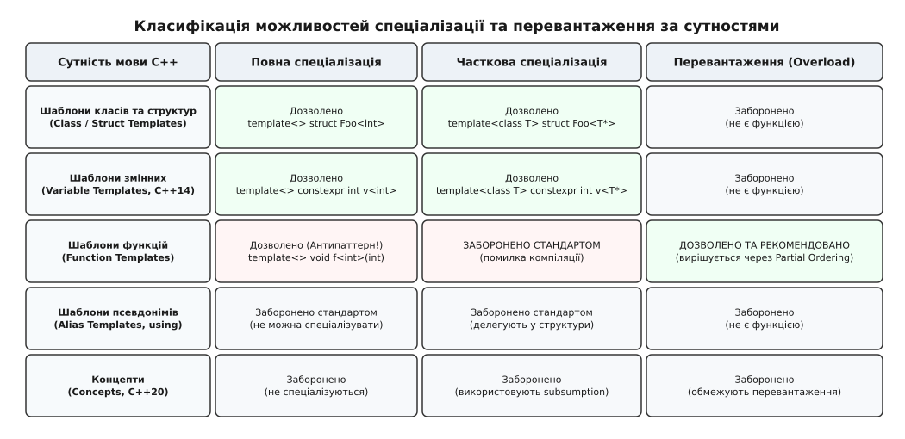
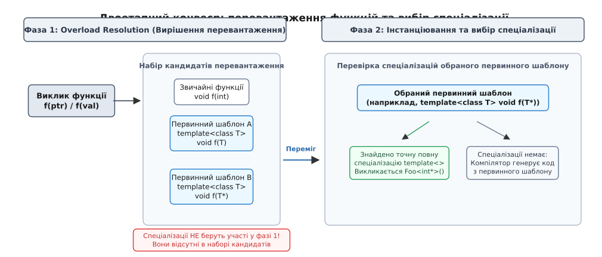
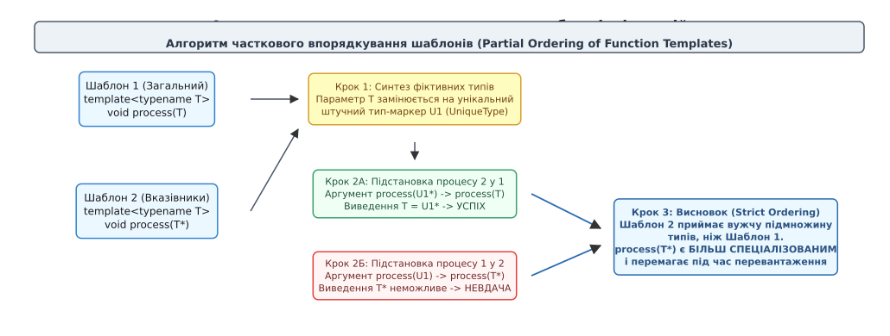
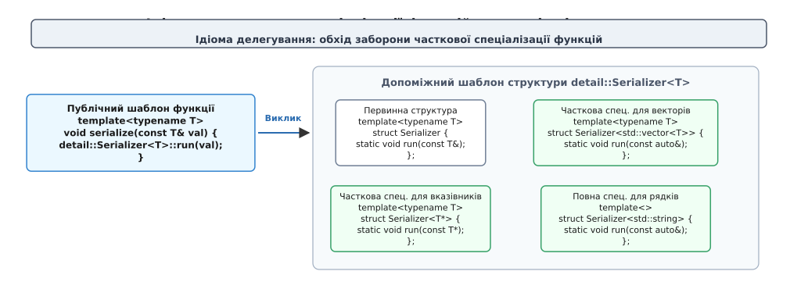

# Спеціалізація й перевантаження шаблонів

<preknowlist>
- [Шаблони: параметризація типом](topic:sys-plang-cpp/templates-basics) — параметри шаблонів, компіляційне інстанціювання коду та виведення аргументів.
- [Перевантаження функцій і приведення типів](topic:sys-plang-cpp/overload-resolution) — як компілятор формує набір кандидатів та обирає найкращу функцію.
- [Обчислення за викликом і SFINAE](topic:sys-plang-cpp/sfinae-and-enable-if) — виключення невалідних перевантажень із набору кандидатів без помилки компіляції.
- [Константні вирази constexpr](topic:sys-plang-cpp/constexpr-and-consteval) — виконання функцій та обчислення типів під час збірки.
</preknowlist>

Уявіть розробку ядра бібліотеки логування або діагностики розподіленої системи, де для запису значень використовується узагальнена функція `template<typename T> void log_value(T value)`. Щоб виводити вказівники на пам'ять у шістнадцятковому форматі разом із розіменованим значенням, розробник створює повну спеціалізацію для цілочислових вказівників: `template<> void log_value<int*>(int* ptr)`. Функція успішно проходить модульні тести, форматуючи рядок як `[ptr=0x7ffeef, val=42]`. 

Через кілька тижнів інший інженер команди для оптимізації роботи з усіма типами вказівників додає нове загальне перевантаження: `template<typename T> void log_value(T* ptr)`. Обидва розробники очікують, що для аргументу типу `int*` компілятор продовжить викликати точну спеціалізацію для `int*`. Проте після перезбірки виклик `log_value(my_int_ptr)` непомітно перемикається на нове перевантаження `log_value(T*)`, а створена раніше спеціалізація `log_value<int*>` повністю ігнорується. Програма компілюється без жодного попередження, але замість форматування шістнадцяткової адреси починає виводити сирі байти або викликати непередбачувані побічні ефекти.

Цей збій є наслідком фундаментального конфлікту між двома механізмами мови C++: **перевантаженням функцій** (вибором із набору незалежних функцій) та **спеціалізацією шаблонів** (генерацією альтернативного тіла для конкретного первинного шаблону).

---

## Анатомія спеціалізації: від первинного шаблону до конкретизації

Термін «спеціалізація» походить від латинського кореня (*specialis* — особливий, окремий, видовий, від *species* — вигляд, ґатунок). У контексті мови C++ спеціалізація позначає процес створення адаптованої реалізації шаблону для конкретного типу або сімейства типів даних, коли стандартний узагальнений алгоритм є неефективним або семантично некоректним.

Шаблон у C++ не є самостійною функцією чи структурою у машинному коді — це креслення (англ. *blueprint*), за яким компілятор генерує код під час підстановки аргументів. Базове креслення називається **первинним шаблоном** (англ. *primary template*).

Стандарт C++ поділяє спеціалізацію на два рівні:

1. **Повна (явна) спеціалізація** (англ. *explicit/full specialization*) — повністю фіксує всі параметри шаблону конкретними типами або значеннями. У заголовку такої конструкції записується порожній список `template<>`.
2. **Часткова спеціалізація** (англ. *partial specialization*) — фіксує лише частину параметрів шаблону або накладає структурний шаблон на тип (наприклад, перехоплює всі вказівники `T*`, константні посилання `const T&` чи контейнери `std::vector<T>`), залишаючи можливість подальшої параметризації.

```cpp
// 1. Первинний шаблон структури
template<typename T, typename Allocator = std::allocator<T>>
struct DataBuffer {
    void store(const T& item);
};

// 2. Часткова спеціалізація для будь-яких вказівників T*
template<typename T, typename Allocator>
struct DataBuffer<T*, Allocator> {
    void store(const T* item); // Специфічна логіка збереження вказівників
};

// 3. Повна спеціалізація для конкретного типу void
template<>
struct DataBuffer<void, std::allocator<void>> {
    void store_raw(const void* item, std::size_t bytes);
};
```

Для шаблонів класів, структур та змінних (починаючи з C++14) обидва види спеціалізації працюють прозоро й передбачувано, оскільки класи та змінні не підтримують перевантаження за іменами. Проте для шаблонів функцій діють зовсім інші правила.


*Класифікація можливостей повної спеціалізації, часткової спеціалізації та перевантаження за категоріями сутностей C++.*

---

## Чому функції не підтримують часткову спеціалізацію

Спроба написати часткову спеціалізацію для шаблону функції призводить до миттєвої помилки компіляції:

```cpp
template<typename T>
void process_value(T val);

// ПОМИЛКА КОМПІЛЯЦІЇ: function template partial specialization is not allowed!
template<typename T>
void process_value<T*>(T* val) {
    // Тіло часткової спеціалізації
}
```

Комітет стандартизації C++ свідомо заборонив часткову спеціалізацію функцій ще на етапі створення стандарту C++98. Причиною стала нерозв'язна граматична та семантична неоднозначність між частковою спеціалізацією та перевантаженням функцій.

Функції у C++ підтримують виведення типів аргументів (Template Argument Deduction), неявні приведення типів (наприклад, перетворення неконстантного вказівника на `const void*`) та аргументно-залежний пошук (ADL). Якби мова дозволяла одночасно і перевантажувати функції, і частково спеціалізувати їх, алгоритм вибору виклику перетворився б на заплутане двовимірне дерево пошуку, де неможливо однозначно визначити пріоритет між перевантаженням із неявним приведенням типів та частковою спеціалізацією без приведення.

Замість часткової спеціалізації для функцій було вирішено використовувати **перевантаження шаблонів** (англ. *function template overloading*):

```cpp
// Легітимне перевантаження замість часткової спеціалізації:
template<typename T>
void process_value(T val);   // Перевантаження 1: для довільних типів

template<typename T>
void process_value(T* val);  // Перевантаження 2: для вказівників
```

Детальніше про історію дискусій у комітеті ISO та спробу стандартизації часткової спеціалізації функцій у документі N1520 читайте у вставці [Еволюція спеціалізації у C++](topic:sys-plang-cpp/specialization-overload/hist-specialization-evolution.md).

---

## Конвеєр виклику функцій: чому повна спеціалізація є пасткою

Хоча часткова спеціалізація функцій заборонена, **повна спеціалізація** (`template<> void f<int>(int)`) формально дозволена синтаксисом C++. Проте її використання вважається однією з найнебезпечніших пасток мови.

Ця проблема відома як **правило Саттера** (на честь Герба Саттера, який разом із Пітером Дімовим та Девідом Абрагамсом розібрав її механіку в 2001 році): **спеціалізації функцій не беруть участі у перевантаженні**.

Вибір функції компілятором під час виклику відбувається у два суворо розділені етапи:

1. **Фаза 1: Вирішення перевантаження (Overload Resolution)**. Компілятор збирає всіх кандидатів. До цього набору входять лише **звичайні (нешаблонні) функції** та **первинні шаблони функцій**. Усі повні спеціалізації `template<>` на цьому етапі **повністю ігноруються**! Компілятор обирає єдиного переможця серед первинних кандидатів.
2. **Фаза 2: Інстанціювання та вибір спеціалізації**. Якщо у фазі 1 переміг первинний шаблон, компілятор перевіряє, чи має *саме цей обраний первинний шаблон* явну спеціалізацію для фактично виведених типів. Якщо така спеціалізація знайдена, викликається її код. Якщо ні — компілятор автоматично генерує код із тіла обраного первинного шаблону.


*Двоетапний конвеєр трансляції виклику функції: розподіл між фазою Overload Resolution та фазою пошуку спеціалізацій обраного первинного шаблону.*

### Розбір класичного контрприкладу Дімова-Абрагамса

Простежимо, що відбувається на рівні семантичного дерева транслятора при поєднанні перевантаження та повної спеціалізації:

```cpp
// 1. Первинний шаблон А (загальний)
template<typename T>
void execute(T x);

// 2. Повна спеціалізація первинного шаблону А для int*
template<>
void execute<int*>(int* x);

// 3. Первинний шаблон Б (перевантаження для вказівників)
template<typename T>
void execute(T* x);

int main() {
    int value = 100;
    int* ptr = &value;
    
    execute(ptr); // Який код виконається?
}
```

Виконаємо трасування логіки компілятора:

1. Компілятор зустрічає виклик `execute(ptr)` з аргументом типу `int*`.
2. **Фаза 1 (Overload Resolution)**: розглядаються кандидати:
   - Шаблон А: `execute(T)` -> підстановка дає `execute(int*)` з `T = int*`.
   - Шаблон Б: `execute(T*)` -> підстановка дає `execute(int*)` з `T = int`.
   - Спеціалізація `execute<int*>` **не розглядається взагалі**.
3. Компілятор запускає алгоритм часткового впорядкування (Partial Ordering). Шаблон Б (`T*`) є більш спеціалізованим, ніж Шаблон А (`T`), оскільки приймає лише вказівники. Шаблон Б перемагає!
4. **Фаза 2 (Спеціалізація)**: компілятор шукає спеціалізації для **Шаблону Б** з аргументом `T = int`.
5. У Шаблону Б немає жодної спеціалізації.
6. Спеціалізація `execute<int*>`, оголошена на кроці 2, була прив'язана до **Шаблону А**. Оскільки Шаблон А програв фазу перевантаження, компілятор ніколи навіть не зазирне в його спеціалізації!
7. Компілятор інстанціює загальне тіло Шаблону Б. Спеціалізація під `int*` виявилася мертвою.

Якщо змінити порядок оголошень у вихідному файлі й поставити спеціалізацію після Шаблону Б:

```cpp
template<typename T> void execute(T x);   // Шаблон А
template<typename T> void execute(T* x);  // Шаблон Б

template<> void execute<int*>(int* x);    // Спеціалізує Шаблон Б!
```

Тепер `execute<int*>` спеціалізує Шаблон Б з `T = int`, тому вона буде викликана. Таким чином, зміна порядку оголошень у коді докорінно змінює семантику програми, що неприпустимо для надійних інженерних систем.

Нормативні вимоги стандарту до ODR-зв'язування та правила розміщення спеціалізацій у просторах імен зібрані у вставці [Синтаксис і правила спеціалізації](topic:sys-plang-cpp/specialization-overload/api-specialization-rules.md).

---

## Часткове впорядкування шаблонів функцій (Partial Ordering)

Коли у наборі кандидатів є кілька первинних шаблонів функцій, вибір найбільш специфічного кандидата здійснюється за алгоритмом **часткового впорядкування** (англ. *Partial Ordering of Function Templates*, ISO C++ §13.7.6.2 [temp.func.order]).

Алгоритм визначає відношення строгого часткового порядку: шаблон `F1` є **більш спеціалізованим** за шаблон `F2`, якщо множина типів, які може прийняти `F1`, є строгою підмножиною типів, які приймає `F2`.


*Формальний алгоритм виведення більш спеціалізованого шаблону через синтез штучних типів-маркерів.*

### Покроковий алгоритм визначення переможця

Щоб перевірити, чи є Шаблон 1 щонайменше настільки ж спеціалізованим, як Шаблон 2, компілятор виконує формальну процедуру взаємного виведення типів:

```
Процедура тестування Шаблону 1 проти Шаблону 2:
1. Замінити кожен параметр-тип Шаблону 1 на унікальний синтезований тип U₁.
2. Отримати список синтезованих аргументів: A₁ = U₁, A₂ = U₂*.
3. Спробувати виконати стандартне виведення типів для Шаблону 2, 
   передавши йому синтезовані аргументи A₁, A₂.
4. Якщо виведення успішне: Шаблон 1 є щонайменше настільки ж спеціалізованим, як Шаблон 2.
5. Повторити кроки 1-4 у зворотному напрямку (синтез для Шаблону 2, підстановка у Шаблон 1).
```

### Практичний розрахунок впорядкування

Розглянемо випадок трьох перевантажень:

```cpp
template<typename T> void inspect(T);       // Шаблон 1 (загальний)
template<typename T> void inspect(T*);      // Шаблон 2 (вказівники)
template<typename T> void inspect(const T*);// Шаблон 3 (константні вказівники)
```

Проведемо попарне порівняння:

**Порівняння Шаблону 2 (`T*`) та Шаблону 1 (`T`):**
1. Синтезуємо тип для Шаблону 2: `T -> Unique_U`. Аргумент стає `Unique_U*`.
2. Підставляємо `Unique_U*` у Шаблон 1 `inspect(T)`:
   - Виведення `T = Unique_U*` проходить успішно.
3. Синтезуємо тип для Шаблону 1: `T -> Unique_V`. Аргумент стає `Unique_V`.
4. Підставляємо `Unique_V` у Шаблон 2 `inspect(T*)`:
   - Спроба зіставити атомарний тип `Unique_V` із формою `T*` провалюється.
5. **Висновок**: Шаблон 2 є **більш спеціалізованим**, ніж Шаблон 1 (Шаблон 2 перемагає Шаблон 1).

**Порівняння Шаблону 3 (`const T*`) та Шаблону 2 (`T*`):**
1. Синтезуємо тип для Шаблону 3: `T -> Unique_U`. Аргумент: `const Unique_U*`.
2. Підставляємо `const Unique_U*` у Шаблон 2 `inspect(T*)`:
   - Виведення дає `T = const Unique_U`. Успіх!
3. Синтезуємо тип для Шаблону 2: `T -> Unique_V`. Аргумент: `Unique_V*`.
4. Підставляємо `Unique_V*` у Шаблон 3 `inspect(const T*)`:
   - Виведення неможливе, оскільки неконстантний тип `Unique_V*` не містить необхідного для Шаблону 3 кваліфікатора `const` на рівні покажчика. Невдача!
5. **Висновок**: Шаблон 3 є **більш спеціалізованим**, ніж Шаблон 2 (Шаблон 3 перемагає Шаблон 2).

За транзитивністю маємо строгу ієрархію: Шаблон 3 перемагає Шаблон 2, а Шаблон 2 перемагає Шаблон 1. При виклику `inspect(ptr)` для `const int*` компілятор без вагань обере Шаблон 3.

### Пастка універсальних посилань під час перевантаження

Особливо обережним слід бути при перевантаженні функціональних шаблонів, що приймають універсальні (forwarding) посилання `T&&`:

```cpp
template<typename T>
void store(T&& item); // Шаблон A: приймає все (lvalue, rvalue будь-якого типу)

void store(const std::string& item); // Функція Б: точне перевантаження для рядків
```

Якщо передати неконстантний об'єкт `std::string str; store(str)`, компілятор вибере **Шаблон А**, а не Функцію Б!

Причина полягає у правилі згортання посилань (Reference Collapsing). Для неконстантного lvalue `str` Шаблон А виводить `T = std::string&`, формуючи точну сигнатуру `store(std::string&)`. Звичайна Функція Б вимагає додавання кваліфікатора `const` (`std::string& -> const std::string&`). Оскільки точний збіг без приведення типів має вищий пріоритет, шаблон із прямим виведенням витісняє нешаблонну функцію.

Щоб запобігти жадібному захопленню типів шаблоном `T&&`, використовують обмеження SFINAE (`std::enable_if_t`) або концептуальні обмеження C++20 `requires`.

---

## Рівень двійкового коду та зв'язування (ODR)

Щоб остаточно зрозуміти різницю між перевантаженням шаблонів і повною спеціалізацією, необхідно простежити поведінку компілятора та компонувальника на рівні генерації символів та об'єктних файлів.

### Модель генерації символів для звичайних шаблонів

Коли компілятор транслює шаблонну функцію `template<typename T> void render(T val)`, він не створює жодного бінарного символу в об'єктному файлі до моменту першого виклику. При виклику `render(42)` компілятор генерує інстанціацію `render<int>` у спеціальній секції об'єктного файлу (у форматі ELF для Linux це секція `section .text._Z6renderIiEv`, помічена прапорцем `COMDAT` або `linkonce`).

Якщо два різні вихідні файли `main.cpp` та `graphics.cpp` інстанціюють `render<int>`, лінкер під час фінальної збірки програми бачить однакові символи у секціях COMDAT, залишає рівно одну копію коду в пам'яті програми та видаляє дублікат без помилок.

### Як повна спеціалізація ламає компонування

Коли розробник пише повну спеціалізацію `template<> void render<int>(int val) { ... }`, компілятор сприймає її **як звичайну нешаблонну функцію**. Якщо ця спеціалізація розміщена у заголовочному файлі `render.hpp` без специфікатора `inline`, вона перестає бути COMDAT-секцією і позначається глобальним сильним символом (`GLOBAL` у таблиці ELF).

При підключенні заголовка `render.hpp` у два файли `main.cpp` та `graphics.cpp` лінкер зупиняє збірку з фатальною помилкою:
```
ld: error: duplicate symbol: void render<int>(int)
>>> defined in main.o
>>> defined in graphics.o
```

Це фундаментальна відмінність: звичайні шаблони та часткові спеціалізації структур є слабкими сутностями компіляції й безпечно підключаються через заголовки, тоді як повні спеціалізації функцій та змінних вимагають явної декларації `inline` або винесення визначення у файл `.cpp`.

---

## Архітектурні моделі заміни спеціалізації функцій

Оскільки повна спеціалізація функцій небезпечна, а часткова — заборонена, в інженерній практиці C++ сформувалися три надійні архітектурні патерни.

### 1. Ідіома делегування у допоміжну структуру (Helper Class Template Delegation)

Це фундаментальний патерн, який використовується в бібліотеках STL та Boost. Публічна функція є неспеціалізованим шаблоном-обгорткою, яка передає свої аргументи у статичний метод допоміжного шаблонного класу. Оскільки класи підтримують як повну, так і часткову спеціалізацію, розробник отримує повну свободу кастомізації:

```cpp
namespace detail {

// Первинний шаблон допоміжної структури
template<typename T>
struct FormatterHelper {
    static void print(const T& val) {
        std::cout << "General value: " << val << "\n";
    }
};

// Часткова спеціалізація для вказівників T*
template<typename T>
struct FormatterHelper<T*> {
    static void print(const T* ptr) {
        if (ptr) {
            std::cout << "Pointer to: ";
            FormatterHelper<T>::print(*ptr); // Рекурсивне делегування
        } else {
            std::cout << "Null pointer\n";
        }
    }
};

// Повна спеціалізація для const char*
template<>
struct FormatterHelper<const char*> {
    static void print(const char* str) {
        std::cout << "C-String: \"" << (str ? str : "") << "\"\n";
    }
};

} // namespace detail

// ЄДИНА публічна функція інтерфейсу
template<typename T>
void format_and_print(const T& value) {
    detail::FormatterHelper<T>::print(value);
}
```


*Архітектура ідіоми делегування: публічний шаблон функції транслює запит у статичний метод частково спеціалізованої структури.*

### 2. Диспетчеризація за тегами (Tag Dispatching)

Якщо вибір алгоритму залежить від категорій типів (наприклад, типи ітераторів чи властивості пам'яті), функція викликає внутрішнє перевантаження, передаючи додатковий фіктивний аргумент-тег:

```cpp
namespace tags {
    struct FastMemcpyTag {};
    struct ElementWiseTag {};
}

template<typename T>
void copy_buffer_impl(const T* src, T* dst, std::size_t n, tags::FastMemcpyTag) {
    std::memcpy(dst, src, n * sizeof(T));
}

template<typename T>
void copy_buffer_impl(const T* src, T* dst, std::size_t n, tags::ElementWiseTag) {
    for (std::size_t i = 0; i < n; ++i) {
        dst[i] = src[i];
    }
}

template<typename T>
void copy_buffer(const T* src, T* dst, std::size_t n) {
    using Tag = std::conditional_t<
        std::is_trivially_copyable_v<T>,
        tags::FastMemcpyTag,
        tags::ElementWiseTag
    >;
    copy_buffer_impl(src, dst, n, Tag{});
}
```

### 3. Сучасне рішення: if constexpr та Концепти C++20

У стандартах C++17 та C++20 потреба у структурах-помічниках та селекторах тегів значно зменшилася завдяки появі конструкції `if constexpr` та мовних **Концептів** (Concepts):

```cpp
template<typename T>
void process_modern(const T& val) {
    if constexpr (std::is_pointer_v<T>) {
        if (val != nullptr) {
            process_modern(*val);
        }
    } 
    else if constexpr (std::is_integral_v<T>) {
        // Оптимізований шлях для цілих чисел
    } 
    else {
        // Загальний шлях
    }
}
```

Коли ж потрібно перевантажувати функції на рівні інтерфейсів, C++20 пропонує механізм **Constraint Subsumption** (поглинання обмежень концептів):

```cpp
template<typename T>
concept Printable = requires(T a) { std::cout << a; };

template<typename T>
concept FormattedPrintable = Printable<T> && requires(T a) { a.custom_format(); };

// Перевантаження 1: для будь-яких типів із оператором <<
template<Printable T>
void display(T val) {
    std::cout << val << "\n";
}

// Перевантаження 2: для типів із власним методом форматування
template<FormattedPrintable T>
void display(T val) {
    val.custom_format();
}
```

Компілятор бачить, що концепт `FormattedPrintable` є суворішим за `Printable` (він поглинає його завдяки оператору `&&`). Тому для типів із методом `custom_format()` автоматично обирається Перевантаження 2 без жодного ризику конфліктів Дімова-Абрагамса.

### 4. Customization Point Objects (CPO) та tag_invoke у сучасному дизайні

Найвищим рівнем еволюції кастомізації у сучасному C++ стало створення **Об'єктів точок кастомізації** (англ. *Customization Point Objects*, CPO), застосованих у бібліотеці `std::ranges` (`std::ranges::begin`, `std::ranges::swap`).

CPO розв'язують проблему, коли користувачеві заборонено втручатися у простір імен `std`, а виклик звичайної вільної функції через ADL (Argument-Dependent Lookup) може випадково підтягнути небезпечне некваліфіковане перевантаження. CPO реалізується як глобальний константний функціональний об'єкт (функтор), який за строгою пріоритетною драбиною перевіряє:
1. Чи має тип вкладений метод `t.custom_action()`.
2. Якщо ні — чи існує дружня вільна функція `custom_action(t)` у просторі імен самого типу, доступна через ADL.
3. Якщо ні — чи підходить стандартна узагальнена реалізація.

Такий підхід повністю захищений від неконтрольованого перевантаження і взагалі не використовує спеціалізацію функцій.

Повний інженерний проєкт бінарного серіалізатора з практичним порівнянням усіх цих підходів наведено у вставці [Побудова системи диспетчеризації](topic:sys-plang-cpp/specialization-overload/proj-customization-dispatch.md).

---

> 🔧 **Навіщо це в реальній розробці.**
> Розуміння різниці між спеціалізацією та перевантаженням захищає від найнебезпечнішого класу помилок у великих проєктах — тихої зміни поведінки алгоритмів без помилок компіляції. Додавання невинного перевантаження в заголовочний файл сторонньої бібліотеки може непомітно вимкнути всі користувацькі спеціалізації функцій у проєкті. Дотримання ідіоми допоміжних структур (або C++20 концептів) гарантує, що ваші точки розширення залишаться стабільними незалежно від порядку включення заголовків та версії компілятора.

---

## Зведена таблиця: як обирати інструмент проектування

| Задача архітектури | Рекомендований інструмент | Чому саме він |
| :--- | :--- | :--- |
| **Кастомізація поведінки класу** | Часткова / повна спеціалізація структури | Класи підтримують часткову спеціалізацію без колізій перевантаження. |
| **Кастомізація констант компіляції** | Спеціалізація шаблону змінної (`template<class T> constexpr ...`) | Змінні не мають виклику й не беруть участі в overload resolution. |
| **Вибір алгоритму для сімейства типів у C++98–C++14** | Делегування функції у `HelperStruct<T>::apply()` | Надійно розділяє публічний інтерфейс та часткову спеціалізацію. |
| **Вибір алгоритму за категоріями типів** | Tag Dispatching або `if constexpr` | Прямий вибір гілки без генерації зайвих символів у бінарнику. |
| **Обмеження інтерфейсів функцій у C++20** | Перевантаження за Концептами (`requires`) | Підтримка поглинання обмежень (subsumption) та зрозуміла діагностика помилок. |
| **Публічні точки розширення бібліотек C++20** | Customization Point Objects (CPO) / `tag_invoke` | Повний імунітет до ADL-колізій та відсутність потреби у відкритті просторів імен. |
| **Повна спеціалізація функцій (`template<> void f()`)** | **КАТЕГОРИЧНО НЕ РЕКОМЕНДУЄТЬСЯ** | Не бере участі в overload resolution, призводить до прихованих дефектів підміни коду. |

---

## Підсумок: золоте правило шаблонів

Головний висновок із тридцятирічної практики програмування мовою C++ формулюється єдиним непорушним правилом:

> **«Перевантажуйте шаблони функцій, але спеціалізуйте шаблони класів».**

Якщо вам необхідно адаптувати алгоритм функції для конкретного типу або категорії типів — створити нове перевантаження чи обмежити його концептом є правильним рішенням. Якщо ж потрібна структурна кастомізація — виносьте логіку у допоміжний шаблон класу. Дотримання цієї дисципліни гарантує стабільність інтерфейсів та повну передбачуваність компіляції ваших систем.
