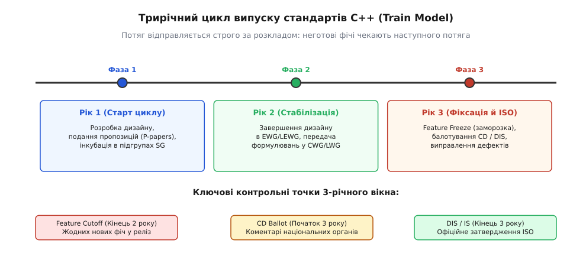
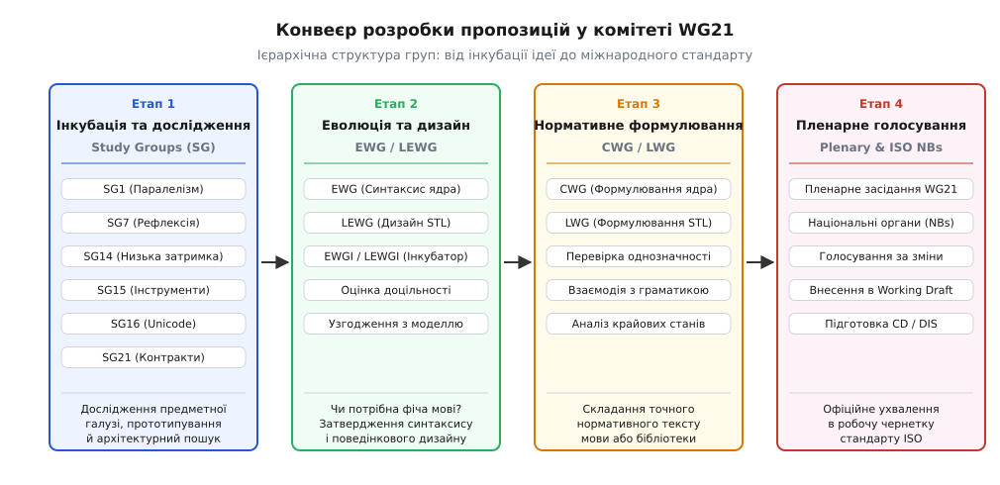
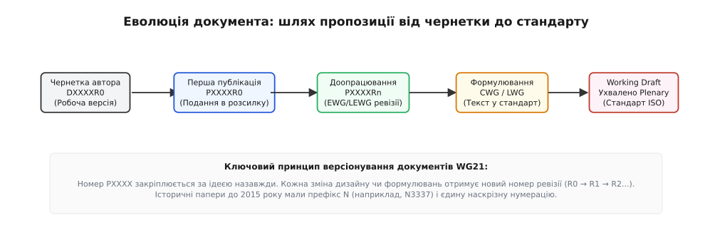

# Як робиться стандарт C++: комітет, папери, цикл

<preknowlist>
- [Категорії значень: lvalue, prvalue, xvalue](root:sys-plang-cpp/value-categories) — як зміна семантики виразів у C++11 вимагала фундаментального переписування правил ядра мови.
- [Підтримка компіляторами й прапорці -std](root:sys-plang-cpp/compiler-support) — як версії стандарту переходять від чернеток ISO до реальних прапорців компілятора.
- [Макроси тестування можливостей (__cpp_*)](root:sys-plang-cpp/feature-test-macros) — як код перевіряє доступність нововведень без жорсткої прив'язки до версії компілятора.
- [Стабільність ABI: ціна й компроміс](root:sys-plang-cpp/abi-stability-cpp) — як збереження бінарної сумісності обмежує еволюцію стандартної бібліотеки.
</preknowlist>

Коли розробник пише `#include <expected>` і компілює код за допомогою GCC на Linux, Clang на macOS чи MSVC на Windows із прапорцем `-std=c++23`, усі три незалежні компілятори забезпечують ідентичний синтаксис, однакове розміщення об'єкта в пам'яті та строгу взаємозамінність типів. Проте за мовою C++ не стоїть жодна комерційна корпорація, технологічний гігант чи єдиний автор, який міг би одноосібним наказом змінити поведінку ключового слова чи додати новий клас у стандартну бібліотеку.

Єдиним джерелом істини для поведінки компіляторів є текст міжнародного стандарту ISO/IEC 14882. Якби розвиток C++ базувався на розрізнених фірмових розширеннях розробників трансляторів, екосистема неминуче розпалася б на несумісні діалекти — як це відбувалося на початку 1990-х років між компіляторами Borland, Microsoft та AT&T cfront. Створення стандарту, який одночасно задовольняє вимоги авторів мікроконтролерів, творців операційних систем, розробників відеоігор, банківських аналітиків та авторів суперкомп'ютерних симуляцій, вимагає строго регламентованого інженерного процесу.

Цей процес забезпечує робоча група **ISO/IEC JTC1/SC22/WG21** (International Organization for Standardization / International Electrotechnical Commission, Joint Technical Committee 1, Sub-Committee 22, Working Group 21). Вона об'єднує сотні інженерів, науковців та представників промисловості з усього світу.

## Трирічний цикл: модель потягів (The Train Model)

До 2011 року еволюція C++ відбувалася за моделлю «випуску за готовністю можливостей» (англ. *Feature-Driven Scheduling*). Це ледь не призвело до загибелі мови під час розробки C++0x, коли затримка з концептами відклала вихід стандарту на понад десятиліття. [Історія переходу від кризи C++0x до моделі потягів](root:sys-plang-cpp/standardization-process/hist-cxx0x-to-train-model.md) показує, як загроза технологічного глухого кута змусила комітет WG21 кардинально змінити підхід і перейти на жорсткий, передбачуваний трирічний ритм випусків.

Сучасний розвиток C++ підпорядкований принципу **моделі потягів** (англ. *Train Model*). Стандарт більше не чекає на завершення окремих великих проєктів:



*Потяг стандарту відправляється за фіксованим календарем: готові можливості сідають у поточний реліз, а неготові — переходять у наступний цикл.*

Трирічний цикл ділиться на три чіткі 12-місячні фази:

### Рік 1: Дослідження, подання пропозицій та інкубація

На початку нового трирічного вікна комітет відкриває прийом нових ідей. Автори пропозицій реєструють документи серії `PXXXXR0`, проводять експерименти у спеціалізованих дослідницьких підгрупах (Study Groups, SG) та збирають зворотний зв'язок від спільноти.

Головна мета першого року — дослідити простір рішень, виявити конфлікти з наявною семантикою мови та визначити, чи потрібна запропонована можливість користувачам C++.

### Рік 2: Завершення дизайну та перехід до формулювання

Протягом другого року робочі групи еволюції (EWG для мови та LEWG для бібліотеки) розглядають оновлені ревізії паперів (`R1`, `R2`...). На цьому етапі архітектурні дебати мають завершитися.

До кінця другого року діє **Feature Cutoff (заморозка нових можливостей)**. Якщо пропозиція отримала консенсус щодо дизайну, вона передається до груп нормативного формулювання (CWG для ядра та LWG для бібліотеки). Пропозиції, які не встигли узгодити дизайн до цієї дати, автоматично втрачають шанс потрапити в поточний реліз і переносяться на наступний трьохрічний цикл.

### Рік 3: Feature Freeze, балотування ISO та виправлення дефектів

Третій рік повністю присвячений стабілізації тексту та юридичним процедурам ISO:

1. **Створення чернетки Committee Draft (CD):** робочий документ (Working Draft) фіксується. Жодні нові можливості більше не приймаються.
2. **Балотування CD (Committee Draft Ballot):** чернетка розсилається національним органам зі стандартизації (National Bodies) для офіційного голосування та збору зауважень (National Body Comments).
3. **Опрацювання коментарів (Comment Resolution):** на засіданнях комітет розглядає кожне зауваження від національних делегацій, вносячи редакторські та нормативні виправлення.
4. **Фінальне балотування DIS (Draft International Standard):** голосування щодо остаточного тексту стандарту.
5. **Публікація стандарту (International Standard, IS):** публікація офіційного документа Секретаріатом ISO у Женеві.

### Чергування великих і малих потягів

У практиці WG21 трирічні випуски природно чергуються за масштабом:
- **C++11:** фундаментальний революційний реліз;
- **C++14:** «малий потяг» — виправлення, полірування та завершення ідей C++11;
- **C++17:** великий плановий реліз (нові словникові типи, паралелізм, структуровані прив'язки);
- **C++20:** монументальний стрибок (концепти, модулі, корутини, діапазони);
- **C++23:** «полірувальний потяг» — стабілізація та додавання ключових компонентів STL;
- **C++26:** великий реліз нового покоління (статична рефлексія, контракти, senders/receivers).

## Чотири рівні воронки WG21

Щоб пропозиція перетворилася з ідеї на розділ стандарту, вона має послідовно пройти крізь чотири рівні комітетської воронки:



*Чотирирівнева ієрархія WG21: від предметного дослідження в підгрупах SG до формального голосування національних органів ISO.*

Кожна група відповідає за принципово різний тип інженерної експертизи. Повний перелік усіх діючих груп наведено у [довіднику структури WG21 та регламенту ISO](root:sys-plang-cpp/standardization-process/api-wg21-reference.md).

### Рівень 1: Дослідницькі підгрупи (Study Groups, SG)

Загальний комітет не може одночасно бути експертом у квантовій фізиці, асинхронних драйверах мережевих карт, шрифтових рушіях та системах компіляції. Тому первинна фільтрація й глибоке технічне дослідження відбуваються у підгрупах Study Groups (SG).

Приклади ключових підгруп:
- **SG1 (Concurrency & Parallelism):** оцінює коректність моделей пам'яті, атомарних операцій, блокувальних і неблокувальних структур даних.
- **SG7 (Compile-time Programming):** опрацьовує метапрограмування часу компіляції, рефлексію сирцевого коду та генерацію AST.
- **SG14 (Low Latency / Games / Embedded / Finance):** перевіряє, чи не створює нова можливість прихованих алокацій пам'яті, накладних витрат під час виконання або непередбачуваних пауз для систем реального часу.
- **SG15 (Tooling):** оцінює взаємодію нових можливостей (зокрема модулів C++20) з системами збірки (CMake, Ninja), лінкерами та статичними аналізаторами.
- **SG16 (Unicode):** гарантує коректну обробку кодувань UTF-8/UTF-16/UTF-32, відсутність спотворень тексту та підтримку символів у `std::format` і `std::print`.
- **SG21 (Contracts):** розробляє семантику перевірки контрактів (`preconditions`, `postconditions`, `assertions`).
- **SG23 (Safety):** досліджує механізми безпеки пам'яті (Memory Safety) та безпеки типів.

Підгрупи SG не змінюють текст стандарту напряму. Їхній результат — консенсусний звіт або спільний папір, який передається на розгляд відповідної групи еволюції.

### Рівень 2: Групи еволюції (EWG та LEWG)

Групи еволюції відповідають за архітектурний дизайн мови та бібліотеки:
- **EWG (Evolution Working Group):** розглядає зміни ядра мови (новий синтаксис, ключові слова, правила видимості, граматику, систему типів).
- **LEWG (Library Evolution Working Group):** розглядає інтерфейси стандартної бібліотеки (нові класи, функції-члени, концептуальні вимоги до ітераторів та діапазонів).

Група еволюції відповідає на фундаментальні питання:
1. Чи розв'язує ця пропозиція реальну проблему індустрії, а не штучну академічну забаганку?
2. Чи відповідає запропонований синтаксис загальній філософії C++ («не плати за те, чим не користуєшся», нульові накладні витрати)?
3. Як нова можливість взаємодіє з наявними частинами мови (наприклад, як лямбди взаємодіють з `constexpr`, а корутини — з семантикою винятків)?

Якщо група еволюції схвалює дизайн, вона ухвалює формальну резолюцію: *«Передати документ PXXXXRn до групи формулювання (CWG або LWG) для підготовки нормативного тексту»*.

### Рівень 3: Групи формулювання (CWG та LWG)

Після схвалення дизайну починається найскладніший та найприскіпливіший етап: перетворення інженерної ідеї на строгий юридичний текст стандарту (відомий як *Standardese*).

- **CWG (Core Working Group):** формулює розділи ядра (лексичні угоди, базові концепції, граматичні правила, вирази, класи, шаблони, обробка винятків).
- **LWG (Library Working Group):** формулює розділи стандартної бібліотеки.

Групи формулювання не мають права змінювати затверджений дизайн, але вони зобов'язані знайти кожну логічну неоднозначність. Експерти CWG та LWG аналізують сотні тонких крайових випадків:
- Що відбувається під час обчислення виразу, якщо один із типів є неповним (*incomplete type*)?
- Чи не створює нове правило порушення правила одного визначення (*One Definition Rule, ODR*)?
- Чи однозначно поводиться дедукція типів у разі передачі перевантаженої функції або масиву нульової довжини?
- Які точні вимоги висуваються до складності алгоритму та які гарантії безпеки винятків надаються викликачеві?

Формулювання часто переписується багато разів, поки текст не стане абсолютно несуперечливим.

### Рівень 4: Пленарне засідання та голосування національних органів (Plenary & NBs)

Коли CWG або LWG повністю схвалили нормативний текст паперу, він виноситься на офіційне пленарне голосування наприкінці засідання комітету WG21.

На пленарній сесії голосують усі присутні акредитовані експерти та офіційні представники національних комітетів зі стандартизації (США, Велика Британія, Німеччина, Франція, Японія, Канада тощо). Якщо резолюція набирає необхідний консенсус, редактор стандарту (Project Editor) отримує офіційне доручення застосувати запропонований патч до офіційного тексту Working Draft.

## Анатомія та життєвий цикл документа (Papers)

Жодна зміна в C++ не відбувається на основі усних домовленостей або електронних листів. Єдиною валютою комітету є офіційні нумеровані документи — **папери** (англ. *Papers*).



*Шлях документа пропозиції: від першої авторської чернетки DXXXXR0 до ухвалення на пленарній сесії в офіційну робочу чернетку.*

### Нумерація документів: D-папери, P-папери та історичні N-папери

- **`PXXXXRx`:** сучасний стандарт публікації. `PXXXX` — унікальний чотиризначний номер, що закріплюється за ідеєю назавжди. `Rx` — номер ревізії (`R0`, `R1`, `R2`...). Наприклад, папір про `std::print` починався як `P2093R0` у 2020 році й був ухвалений як `P2093R14` у 2022 році після чотирнадцяти ітерацій опрацювання зауважень!
- **`DXXXXRx`:** робоча чернетка (Draft), над якою автор працює між публікаціями або редагує прямо під час тижневого засідання.
- **`NXXXX`:** застаріла наскрізна нумерація, що діяла до 2015 року. В єдиний реєстр `N` записувалися всі документи підряд без явного виділення номера ревізії в імені файлу.

### Структура якісного паперу пропозиції

Типовий документ, що подається до WG21, має строго визначену структуру:

```text
Document Number: P3000R1
Date:            2026-03-01
Author:          Олександр Коваленко (oleksandr@example.com)
Audience:        LEWG, LWG
Target:          C++26
Project:         ISO/IEC JTC1/SC22/WG21
```

Після шапки йдуть обов'язкові інженерні розділи:

1. **Abstract:** стислий опис того, що саме пропонується змінити.
2. **Revision History:** перелік змін порівняно з попередньою ревізією (`R0` → `R1`): які зауваження EWG/LEWG враховано, які альтернативи відкинуто.
3. **Motivation and Scope:** чому існуючих засобів C++ недостатньо і які реальні проблеми це створює у виробничому коді.
4. **Before/After Comparisons:** порівняльна таблиця старого й нового підходу.
5. **Design Decisions:** вибір назв, типів параметрів, обмежень шаблонів, обґрунтування вибору винятків чи кодів помилок.
6. **Feature Test Macro:** назва макроса для перевірки наявності можливості (наприклад, `#define __cpp_lib_flat_map 202207L`).
7. **Proposed Wording:** нормативний текст змін до стандарту C++ у форматі диференційного патча.

### Як виглядає нормативний текст (Standardese)

Нормативне формулювання для стандартної бібліотеки використовує формальні декларативні блоки. Розглянемо, як у тексті стандарту описується сучасна функція:

```text
16.4.3.2 [expected.object.swap]
void swap(expected& rhs) noexcept(see below);

Constraints: 
  is_swappable_v<T> is true and is_swappable_v<E> is true.

Effects: 
  - If has_val and rhs.has_val are both true, calls using std::swap; swap(val, rhs.val).
  - If !has_val and !rhs.has_val are both true, calls using std::swap; swap(unx, rhs.unx).
  - Otherwise, swaps the states of *this and rhs so that the one with a value gets the other's unexpected value, and vice versa.

Throws: Any exception thrown during the swap of val or unx.

Remarks: The expression inside noexcept is equivalent to:
  is_nothrow_swappable_v<T> && is_nothrow_swappable_v<E> &&
  is_nothrow_move_constructible_v<T> && is_nothrow_move_constructible_v<E>.
```

Кожне слово тут має строго визначену юридичну силу:
- **Constraints** означає, що невиконання умов видаляє функцію з перевантаження через SFINAE / концепти;
- **Effects** визначає обов'язкові побічні дії реалізації;
- **Remarks** накладає строгі математичні обмеження на умовний специфікатор `noexcept`.

## Приклад з реального життя: шлях std::expected (P0323)

Щоб зрозуміти, чому пропозиції проходять через багаторічну обробку, корисно простежити реальну історію типу `std::expected<T, E>`.

Ідея словникового типу, що містить або коректне значення, або код помилки без генерації важких винятків, народилася на початку 2010-х років у працях Андрея Александреску (Andrei Alexandrescu) та бібліотеці `Expected<T>`. У 2014 році Вісенте Ботет Ескріба (Vicente J. Botet Escribá) та ЖФ Бастьєн (JF Bastien) подали першу чернетку стандартизації.

Документ пройшов такий багаторівневий шлях:
1. **Інкубація в SG14 (2014–2016):** експерти з низької затримки наполягали на нульових алокаціях та тривіальній деструктивності, якщо типи `T` та `E` є тривіально знищуваними.
2. **Дебати в LEWG (2016–2021):** група еволюції бібліотеки понад п'ять років сперечалася щодо інтерфейсу: чи повинен `operator*` кидати виняток `std::bad_expected_access`, якщо об'єкт містить помилку, чи це має бути невизначена поведінка (UB) задля швидкості? У результаті було досягнуто компромісу: `operator*` має передумову `has_value() == true` (швидкий доступ), а безпечний метод `value()` кидає виняток. Додатково було розроблено монадичний інтерфейс (`and_then`, `or_else`, `transform`).
3. **Формулювання в LWG (2021–2022):** експерти LWG провели кілька раундів аналізу, щоб гарантувати коректність перевантажень конструкторів копіювання й переміщення, унеможливити неоднозначності при вкладених типах на кшталт `std::expected<std::expected<int, err>, err>` та виписати блоки `Constraints:` і `Mandates:`.
4. **Ухвалення на пленарному засіданні (листопад 2022):** документ P0323R12 було проголосовано консенсусом і внесено в робочий документ C++23.

Від першої публікації до включення в стандарт минуло вісім років і дванадцять офіційних ревізій. Ця тривалість — це не бюрократичне гальмо, а ціна надійності: `std::expected` тепер використовується в мільйонах систем без ризику виявлення прихованих дірок у дизайні інтерфейсу.

## Роль розробників компіляторів та «великої трійки» STL

Стандарт C++ не пишеться у відриві від реального заліза. Ключову роль у роботі WG21 відіграють інженери так званої «великої трійки» реалізацій стандартної бібліотеки та компіляторів:
- **GNU `libstdc++` / GCC:** основна відкрита реалізація для екосистеми GNU/Linux.
- **LLVM `libc++` / Clang:** модульна бібліотека та компілятор, що широко використовуються в Apple, Google та великих хмарних інфраструктурах.
- **Microsoft `STL` / MSVC:** відкрита реалізація стандартної бібліотеки Windows.

Провідні розробники компіляторів та стандартних бібліотек присутні в кожній робочій групі. Їхня участь створює безперервний зворотний зв'язок:

```text
Пропозиція (P-paper) → Експериментальна гілка в Clang/GCC/MSVC → Виявлення неоднозначностей → Правка Wording в CWG/LWG
```

Часто під час тижневого засідання комітету інженер створює експериментальну гілку в Clang або GCC за кілька годин, щоб перевірити, чи здатний компілятор однозначно розібрати запропоновану граматичну конструкцію без вибуху часу компіляції або конфліктів у таблицях розбору. Якщо компілятор виявляє неоднозначність (наприклад, граматичний конфлікт між лямбдами й атрибутами), формулювання виправляється ще до пленарного голосування.

## Процедура опрацювання коментарів національних органів (NB Comments)

Під час балотування чернетки Committee Draft (CD) на третьому році циклу кожен національний орган зі стандартизації (National Body, NB) збирає відгуки від інженерів та організацій своєї країни й формує офіційну таблицю зауважень (National Body Comments Matrix).

Таблиця містить такі обов'язкові атрибути:
- **Country Code & Number:** наприклад, `US 142` або `GB 35`;
- **Clause / Subclause:** точний номер розділу стандарту (наприклад, `[expr.prim.req]`);
- **Type of Comment:** `Editorial` (редакційне уточнення / друкарська помилка), `Technical` (технічна неточність або пропущений крайовий випадок) чи `General` (стратегічне заперечення проти цілої можливості);
- **Comment / Rationale:** технічне обґрунтування проблеми;
- **Proposed Change:** конкретний текст виправлення, запропонований національною делегацією.

Комітет WG21 зобов'язаний розглянути **кожне** подане зауваження без винятку. На спеціальних засіданнях з вирішення коментарів (Comment Resolution) робочі групи ухвалюють одну з п'яти офіційних резолюцій:
1. **Accepted:** коментар прийнято повністю, запропоноване виправлення внесено до тексту.
2. **Accepted in Principle:** комітет погодився з наявністю проблеми, але реалізував виправлення іншими словами чи через інший механізм.
3. **Accepted with Modifications:** виправлення прийнято з технічними корективами.
4. **Rejected:** комітет відхилив зауваження з наданням письмового технічного обґрунтування (наприклад, показано, що описаний сценарій уже покритий іншим пунктом стандарту).
5. **Withdrawn:** національна делегація відкликала свій коментар після роз'яснень у залі.

Офіційний документ із резолюціями на всі зауваження публікується у відкритому доступі та надсилається до секретаріату ISO як доказ належного розгляду позицій усіх країн.

## Відмова від Technical Specifications (TS) на користь прямої еволюції

Між 2012 та 2020 роками комітет WG21 намагався використовувати проміжну модель тестування великих можливостей — **Technical Specifications (TS)**. Було створено окремі чернетки: `Filesystem TS`, `Concepts TS`, `Networking TS`, `Coroutines TS`, `Ranges TS` та `Library Fundamentals TS`.

Передбачалося, що експериментальні типи розміщуватимуться у просторі імен `std::experimental::*`, розробники тестуватимуть їх у реальних проєктах, надсилатимуть відгуки, і лише після цього функціонал переноситиметься в основний простір імен `std::`.

Проте на практиці модель TS виявилася неефективною з трьох причин:
1. **Страх індустрії перед нестабільністю:** великі компанії відмовлялися писати виробничий код у просторі імен `std::experimental`, оскільки комітет не гарантував стабільності API та ABI між ревізіями TS.
2. **Подвійне бюрократичне навантаження:** публікація кожного TS вимагала проходження повного циклу формальних голосувань ISO (CD, DTS, публікація), що подвоювало навантаження на експертів.
3. **Затримка впровадження компіляторами:** вендори компіляторів неохоче реалізовували проміжні чернетки TS, зосереджуючись на основному стандарті.

У результаті комітет WG21 практично відмовився від моделі TS (за винятком спеціалізованих ніш). Сучасна розробка ведеться безпосередньо в основній гілці робочого документа (Working Draft) за підтримки ранніх експериментальних гілок у компіляторах та системи макросів тестування можливостей.

## Життєвий цикл застарівання та вилучення можливостей

Мова C++ дотримується суворого принципу збереження зворотної сумісності: код, написаний 20 років тому, має успішно компілюватися сучасними інструментами. Проте застарілі та небезпечні конструкції поступово вилучаються за чотириетапною процедурою:

1. **Нормативне застарівання (Deprecation):** можливість переноситься до Додатка D стандарту (Annex D, *Compatibility features*). Компілятори починають видавати попередження (Warning) під час використання конструкції.
2. **Маркування атрибутом `[[deprecated]]`:** у стандартній бібліотеці застарілі класи та функції позначаються стандартним атрибутом із роз'ясненням альтернативи.
3. **Офіційний папір на вилучення (Removal Paper):** після одного-двох релізів комітет розглядає документ про повне вилучення (наприклад, P0004 про вилучення `std::auto_ptr` та `std::random_shuffle` у C++17 або P0003 про вилучення динамічних специфікацій `throw(type)`).
4. **Вилучення з тексту стандарту:** конструкція повністю зникає з нормативного тексту. Компілятори припиняють підтримувати її у нових режимах `-std=c++17` або `-std=c++20`, але зберігають у режимах сумісності (`-std=c++11` чи `-std=c++03`).

## Синхронізація з мовою C (WG14 та підгрупа SG22)

Мова C++ історично виросла з C і зберігає високий рівень сумісності на рівні синтаксису, типів даних та бінарного виклику функцій (C ABI). Проте стандартизацією мови C займається окрема робоча група ISO — **ISO/IEC JTC1/SC22/WG14**.

Щоб запобігти накопиченню безглуздих розходжень між мовами-сестрами, діє спільна координаційна підгрупа **SG22 (C/C++ Compatibility Group)**.

SG22 вирішує складні міжмовні питання:
- Узгодження ключових слів та макросів (наприклад, підтримка `_Static_assert` та `static_assert`, `alignas`, `typeof` та `decltype` у C23);
- Семантика спільних заголовків стандартної бібліотеки (зокрема `<stdatomic.h>`, де C++ вимагає перевантаження функцій та шаблонів, а C спирається на макроси та generic selection `_Generic`);
- Сумісність типів перелічень (`enum`), структур із гнучкими масивами (*flexible array members*) та правил ініціалізації.

Завдяки постійній роботі SG22 обидва комітети зберігають фундаментальну сумісність C та C++ на системному стику, що дозволяє програмам на C++ безпосередньо використовувати операційні виклики POSIX, Windows API та бібліотеки мови C без додаткових перехідних шарів.

## Механізм консенсусу та опитування

Комітет WG21 не ухвалює рішення простою арифметичною більшістю (50% + 1 голос). Мова C++ використовується в критичних інфраструктурах — від систем управління польотами до банківських ядер. Якщо зміна приймається з 49% голосів «проти», це означає фундаментальний розкол спільноти, і значна частина вендорів компіляторів або користувачів може саботувати впровадження такого стандарту.

### 5-позиційне опитування (Straw Polls)

Для визначення настроїв робочої групи використовується 5-позиційне опитування:
- **SF (Strongly Favor):** повністю підтримую, вважаю критично важливим;
- **WF (Weakly Favor):** підтримую, заперечень не маю;
- **N (Neutral):** нейтрально / утримався;
- **WA (Weakly Against):** маю застереження, вважаю рішення не найкращим;
- **SA (Strongly Against):** категорично проти.

Головуючий підраховує голоси й записує результат у протокол у форматі п'яти чисел, наприклад:

```text
SF  | WF  | N   | WA  | SA
18  | 9   | 3   | 1   | 0   → Консенсус є (ясна підтримка, нуль SA)

SF  | WF  | N   | WA  | SA
9   | 4   | 2   | 8   | 11  → Консенсусу немає (глибокий розкол)
```

### Захист меншості та аналіз голосів SA

Якщо в залі є хоча б один голос **SA (Strongly Against)**, головуючий зобов'язаний зупинити процедуру й попросити учасника озвучити технічні причини свого категоричного заперечення.

Якщо з'ясовується, що голос SA спирається на раніше непомічену діру в безпеці пам'яті або порушення сумісності з C, комітет переглядає рішення навіть тоді, коли 90% присутніх проголосували SF. Консенсус у WG21 — це не відсутність незгодних, а відсутність нерозглянутих вагомих технічних заперечень.

## Повідомлення про дефекти (Defect Reports) та їхня зворотна сила

Коли стандарт опубліковано, робота над ним не припиняється. Інженери, розробники компіляторів та автори бібліотек постійно знаходять неточності, пропущені крайові випадки або суперечності в тексті стандарту.

Такі проблеми реєструються у відкритих реєстрах:
- **Core Issues List (CWG Issues):** дефекти правил ядра мови;
- **Library Issues List (LWG Issues):** дефекти специфікацій типів та алгоритмів STL.

### Принцип ретроактивної дії (Retroactivity of DR)

Ключова особливість рішень комітету WG21 полягає в тому, що схвалені **Defect Reports (DR)** діють **заднім числом** (ретроактивно).

Якщо комітет визнав, що в стандарті C++17 була допущена помилка у взаємодії `std::optional` чи `std::variant`, і ухвалив відповідне виправлення у циклі C++20 під статусом *Adopted as Defect Report*, це виправлення офіційно вважається дійсним для C++17 з моменту його первинної публікації.

Саме тому сучасні компілятори GCC, Clang та MSVC оновлюють свою поведінку для старих прапорців: код, скомпільований із прапорцем `-std=c++14`, поводиться за виправленими правилами, а не за початковим текстом 2014 року з відомими помилками.

### Макроси тестування можливостей (__cpp_*)

Оскільки вендори компіляторів реалізують нові можливості поступово протягом трирічного циклу, розробники не можуть спиратися лише на значення макроса версії мови `__cplusplus` (наприклад, `202302L` для C++23).

Для точного контролю наявності конкретної можливості комітет стандартизував макроси тестування можливостей (Feature Test Macros):

:::tabs
```cpp
// Перевірка підтримки окремих мовних та бібліотечних можливостей
#include <version>

#if defined(__cpp_lib_print) && __cpp_lib_print >= 202207L
    #include <print>
    void output_message(const char* name, int score) {
        std::println("Користувач: {}, Бали: {}", name, score);
    }
#else
    #include <iostream>
    void output_message(const char* name, int score) {
        std::cout << "Користувач: " << name << ", Бали: " << score << "\n";
    }
#endif
```
```c
/* В еквівалентному C-коді підтримка перевіряється через макроси компілятора */
#include <stdio.h>

void output_message(const char* name, int score) {
    printf("Користувач: %s, Бали: %d\n", name, score);
}
```
:::

Кожен макрос розширюється в цілочисельне значення у форматі `РРРРММL`, що відповідає року й місяцю ухвалення відповідної ревізії документа на пленарному засіданні.

## Стабільність ABI та ціна стандартизації

Головним викликом сучасної стандартизації C++ є збереження **стабільності бінарного інтерфейсу (ABI Stability)**.

Якщо комітет змінить внутрішнє розміщення полів у `std::string` чи `std::unique_ptr` заради оптимізації передачі через регістри процесора, усі скомпільовані динамічні бібліотеки (`.so` та `.dll`) у світі стануть несумісними між собою. Це змушує комітет шукати компроміси між ідеальною продуктивністю нових абстракцій та непорушністю кодових баз, написаних за останні сорок років.

Стандартизація C++ — це безперервний інженерний компроміс між швидкістю інновацій, зворотною сумісністю та математичною точністю специфікації. Завдяки моделі потягів, чіткій воронці підгруп WG21 та дисципліні публікацій пропозицій мова C++ залишається передбачуваним, стабільним і водночас сучасним фундаментом світового системного програмування.
