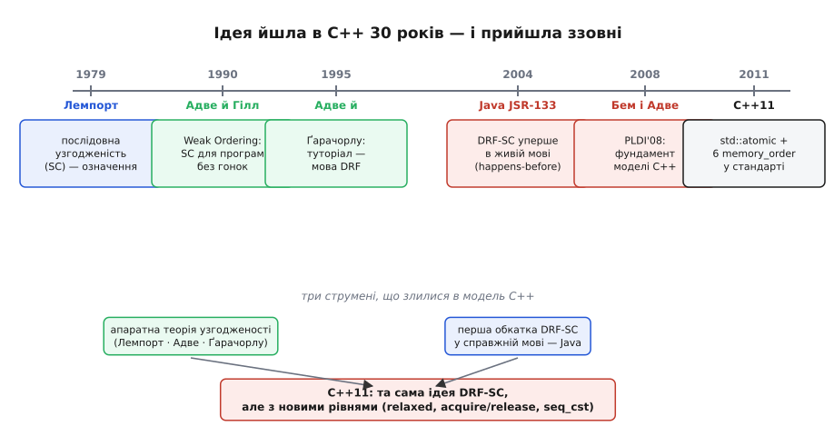
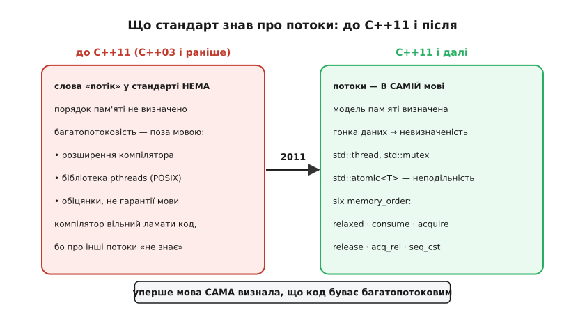

# 📜 Як C++ навчився казати слово «потік»

Ось факт, у який важко повірити, доки не побачиш його чорним по білому: аж до 2011 року в офіційному стандарті мови C++ **не було слова «потік»** (thread). Не було його й у C. Мільйони рядків багатопотокового коду вже крутилися на серверах, у ядрах операційних систем, у драйверах — а мова, якою їх писали, про існування потоків **офіційно не знала**. За буквою стандарту програма виконувалася в одному-єдиному потоці керування, від першого рядка до останнього, і крапка.

Це не дрібна формальність. Це діра завбільшки з прірву. Бо якщо стандарт не визнає, що два шматки коду можуть виконуватися **одночасно** й чіпати ту саму пам'ять, то він і не каже, **що при цьому має статися**. А компілятор, який не зобов'язаний нічого гарантувати паралельним потокам, має повне право оптимізувати ваш код так, ніби він однопотоковий, — і тим тихо його зламати. Роками весь багатопотоковий C і C++ тримався не на мові, а на **чесному слові**: обіцянках бібліотек, домовленостях між людьми й тому, що популярні компілятори «поводяться розумно». Формальної гарантії не було жодної.

Ця історія — про те, як мова нарешті навчилася вимовляти слово «потік». Але цікаве в ній не те, що C++ пізно спохопився. Цікаве те, **звідки** прийшла відповідь. Виявиться, що ключову ідею придумали не автори мов, а інженери, які проєктували **процесори**, — за двадцять років до того; що вперше її обкатали не в C++, а в **Java**; і що модель пам'яті C++ — не винахід із чистого аркуша, а ретельна пересадка чужої, уже перевіреної ідеї на новий ґрунт. Побачити цей шлях — означає зрозуміти, **чому** модель пам'яті C++ виглядає саме так, а не як випадковий набір загадкових правил.


*Тридцятирічна дорога однієї ідеї. Внизу — три струмені, що злилися в модель пам'яті C++: апаратна теорія узгодженості (Лемпорт, Адве, Ґарачорлу), її перша обкатка в живій мові (Java, 2004) — і аж потім C++11, який узяв ту саму серцевину, додавши власні рівні порядку.*

## Мова, для якої одночасності не існувало

Щоб відчути глибину проблеми, треба спершу зрозуміти, як C і C++ дійшли до життя без потоків, — і чому це аж так небезпечно.

C народилася на початку 1970-х у світі, де «комп'ютер» означав **один процесор**, що виконує **одну** послідовність команд. Модель мови була дзеркалом того світу: є одна нитка виконання, вона йде рядок за рядком, читає й пише пам'ять у порядку, який ти написав. C++ Б'ярне Стропструпа (*Bjarne Stroustrup*) виросла з C і успадкувала цю картину світу цілком. Обидві мови десятиліттями стояли на **однопотоковій абстрактній машині** — уявному виконавці, який робить одну справу за раз.

А тоді залізо змінилося, а мова — ні. З'явилися багатопроцесорні машини, згодом — багатоядерні чипи; операційні системи навчилися давати одній програмі кілька потоків. Постала гостра, приземлена потреба: як писати код, де дві нитки біжать одночасно й спільно володіють пам'яттю? Мова відповіді не мала. І тодішнє розв'язання було таким: **обійти мову збоку**. Потоки причепили як **бібліотеку** — окремий набір функцій, про який компілятор мови нічого не знає.

Найвідоміша з таких бібліотек — **POSIX Threads**, у народі **pthreads**: стандартизований у 1995 році інтерфейс, що дав C-програмісту функції «створи потік», «візьми замок», «відпусти замок». На перший погляд — вичерпне розв'язання: ось тобі потоки, ось засоби їх узгодити, пиши. І десятиліттями саме так усі й писали. Але в цьому підході ховалася тріщина, яку довго ніхто не хотів помічати всерйоз.

> 🔧 **Навіщо це.** Це не музейна давнина — це прямо ваша ситуація на будь-якому сучасному мікроконтролері з переривками або на ESP32 з двома ядрами. Обробник переривання чіпає ту саму змінну, що й головний цикл; або друге ядро пише в буфер, з якого читає перше. Це **той самий** багатопотоковий доступ до спільної пам'яті — і саме тому питання «а що мова гарантує?» стосується вас безпосередньо, а не лише авторів серверів.

## Тріщина: компілятор нічого не винен чужому потоку

Ось де захована біда, і варто розглянути її повільно, бо вона неочевидна й тому надовго лишилася непоміченою.

Бібліотека — це просто набір функцій. Компілятор бачить виклик `pthread_mutex_lock(&m)` як звичайний виклик звичайної функції — такий самий, як `printf` чи `sqrt`. Він **не знає**, що ця функція має особливий сенс «тут починається захищена ділянка, далі до мене може лізти інший потік». Для нього це чорна скринька, після якої життя триває як завжди. А «як завжди» для оптимізатора означає одне: код **однопотоковий**, і його можна перекроювати як завгодно, аби видимий результат **у межах цього одного потоку** не змінився. Це і є [правило «ніби»](root:sf-lang/as-if-rule) — священна свобода компілятора: він вільний знехтувати будь-яким приписом, якщо результат виходить такий, ніби припис виконано, наскільки це видно **зі спостережуваної поведінки програми**.

І тут пастка змикається. «Спостережувана поведінка» означена **для одного потоку**. Компілятор, переставляючи ваші дії місцями, тримаючи змінну в регістрі замість пам'яті, зливаючи два записи в один, **чесно** зберігає результат — для того потоку, який він оптимізує. Але **інший** потік бачить не результат; він бачить пам'ять **посеред** цих перестановок. І те, що для першого потоку невидима внутрішня кухня, для другого — цілком видима реальність, на яку він покладається.

Розгляньмо найпростіший приклад — передачу «дані, потім прапорець». Один потік готує дані й піднімає прапорець готовності; другий крутиться, чекаючи прапорця, і, побачивши його, читає дані:

```c
/* потік-виробник */          /* потік-споживач */
data = 42;                    while (!ready) { }
ready = 1;                    use(data);
```

Людині все очевидно: спершу `data`, тоді `ready`; побачив `ready` — значить, `data` уже лежить. Але компілятор бачить у виробнику **два незалежні записи** у **дві різні** змінні. Для однопотокового світу їхній порядок — байдужий: результат той самий, хоч так, хоч так. І компілятор має повне право переставити їх — записати `ready` **раніше** за `data`, якщо йому так зручніше лягає на регістри. У однопотоковій програмі це нічого не змінить. А тут — руйнує все: споживач бачить `ready == 1`, кидається читати `data` — і хапає **старе** значення, бо новий запис `data` ще не відбувся.


*Прірва, яку закрив C++11. Ліворуч — світ до нього: слова «потік» у стандарті немає, порядок пам'яті не визначено, багатопотоковість живе поза мовою — на розширеннях компілятора й обіцянках pthreads. Праворуч — після 2011-го: потоки, замки й неподільні операції входять у саму мову, а гонка даних стає визначеним поняттям (з визначеним наслідком — невизначеною поведінкою).*

Найпідступніше, що виробник **не зламаний**: обидва його записи відбудуться, обидва — з правильними значеннями. Зламаний лише **порядок**, у якому їх бачить сусід. І винуватити компілятор нема за що: він діяв суворо за правилами мови, а мова про існування споживача **не знала**. Хіба це не абсурд — код правильний, компілятор правильний, а програма падає? Абсурд. І саме цей абсурд і був симптомом того, що в мові зяє діра.

Гостріше за всіх його сформулював **Ганс Бем** (*Hans-J. Boehm*) — той самий інженер, чиє ім'я стоятиме в центрі всієї цієї історії. У 2005 році він виклав діагноз у назві доповіді, яку годі забути: **«Threads Cannot Be Implemented As a Library»** — «Потоки **неможливо** реалізувати як бібліотеку» (PLDI 2005). Теза звучала як єресь: адже всі саме так їх і реалізовували, роками. Але Бем показав річ невблаганну: доки компілятор проєктують **окремо** від питань багатопотоковості, він законно вставлятиме гонки даних **туди, де в первісному коді їх не було**. Не бо він поганий — а бо мова дала йому таке право й не сказала, що його треба обмежити. Полагодити це бібліотекою **неможливо** в принципі: бібліотека не може заборонити компіляторові оптимізації, про які той не знає, що вони небезпечні. Лагодити треба **саму мову** — її абстрактну машину, її правило «ніби», її означення того, що взагалі означає «виконати програму».

> 🔧 **Навіщо це.** Звідси ростуть дві звички, які рятують вашу прошивку. Перша: чому одного `volatile` **замало** для обміну між потоками — він приборкує оптимізацію доступів до самої комірки, але не впорядковує **сусідні** записи й не дає неподільності. Друга: чому «працює на моєму компіляторі» — не доказ коректності. Якщо ваша гарантія трималася на тому, що компілятор «не став» переставляти, то нова версія компілятора, новий рівень оптимізації чи інший чип цю ласку заберуть. Тверда опора — лише те, що **зобов'язала** мова.

## Хто взагалі має право сказати, що означає «одночасно»

Перш ніж лагодити, треба було відповісти на питання, яке звучить майже філософськи, а насправді суто інженерне: **що взагалі означає — програма виконалася правильно, коли потоків багато?** Для одного потоку відповідь очевидна: іди рядок за рядком, як написано. А для двох, що чіпають спільну пам'ять у перебивку, — що є «правильно»?

Виявляється, точну відповідь дали задовго до того, як за неї взялися автори мов, — і дали її люди, що думали не про мови, а про **залізо**. Бо та сама проблема — тільки на рівень нижче — стояла перед конструкторами багатопроцесорних машин. Коли кілька процесорів ділять спільну пам'ять, у якому порядку вони бачать чужі записи? Що є коректним порядком, а що — поламкою?

Першу тверду відповідь дав **Леслі Лемпорт** (*Leslie Lamport*) — американський інформатик, згодом лауреат премії Тюрінга. У праці зі скромною інженерною назвою **«How to Make a Multiprocessor Computer That Correctly Executes Multiprocess Programs»** (IEEE Transactions on Computers, вересень 1979) він дав означення, що стало наріжним каменем усього подальшого, — **послідовну узгодженість** (sequential consistency, SC). Словами Лемпорта, багатопроцесорна машина послідовно узгоджена, якщо

```
результат будь-якого виконання — той самий,
як коли б операції всіх процесорів
виконали в ЯКОМУСЬ одному послідовному порядку,
а операції кожного окремого процесора
стояли в цьому порядку так, як приписано його програмою.
```

Розберімо, що це насправді означає, бо це геніально просте. Уяви, що всі дії всіх потоків — читання й записи — хтось перетасував в **одну спільну чергу**, як колоду карт, з двома лише умовами: (1) черга спільна для всіх — ніби існує один-єдиний порядок, з яким згодні всі потоки; (2) усередині кожного окремого потоку карти не перемішалися — вони лягли в тому порядку, у якому ти їх написав. Ось і все. Послідовна узгодженість каже: багатопотокова програма поводиться так, **ніби** якесь таке чесне перемішання відбулося. Це рівно та інтуїція, яку кожен програміст **несвідомо припускає**, коли думає про потоки: «ну, десь мої рядки й твої рядки чергуються, але кожен мій рядок точно йде після попереднього мого».

Ось у чому фокус, і чому саме SC — правильна планка. Лемпорт довів дві протилежні речі. По-перше, SC — це саме те, чого **хоче** програміст: під нею його інтуїція про чергування не бреше. Але по-друге — і це вбивчо — реальна машина, зібрана зі звичайних швидких процесорів, SC **не гарантує** «просто так». Кеші, буфери запису, конвеєри, апаратні перестановки — усе, що робить процесор швидким, ламає той наївний спільний порядок. Виходить прірва: те, що потрібно програмісту (SC), і те, що дешево дає залізо (значно слабші гарантії), — **не збігаються**. І ця прірва — рівно та сама, що через тридцять років постане перед авторами C++, тільки поверхом вище: між мовою та компілятором замість пам'яті та процесора.

Статус цього — **усталений**: означення SC Лемпорта, дата (1979) і його роль наріжного каменя — задокументована історія інформатики, а не спірна атрибуція.

## Слабший порядок, але тільки там, де можна

Прірва між «потрібно SC» і «дешево лише слабше» породила очевидне питання: то невже треба **або** повільно й правильно (тримати сувору SC скрізь, задушивши всю швидкість заліза), **або** швидко й ненадійно? Невже нема середини?

Середину знайшла — і це варто підкреслити, зважаючи на те, як часто цю історію розповідають без імен, — **Саріта Адве** (*Sarita V. Adve*), американська дослідниця індійського походження, тоді аспірантка Вісконсинського університету, у праці з науковим керівником **Марком Гіллом** (*Mark D. Hill*): **«Weak Ordering — A New Definition»** (ISCA 1990). Її ідея настільки проста й настільки глибока, що на ній згодом стоятимуть моделі пам'яті цілих мов.

Ідея така. Розберімо, **звідки** взагалі береться потреба в суворому порядку. Порядок між двома доступами до пам'яті важить **лише тоді**, коли ці доступи можуть **конфліктувати** — тобто чіпають ту саму комірку й хоч один із них пише. Якщо два потоки колошматять **різні** змінні — їхній взаємний порядок нікого не обходить, тасуй як хочеш, результат той самий. Порядок стає важливим тільки в точці зіткнення. А тепер ключове спостереження Адве: у **правильно написаній** програмі всі такі зіткнення **впорядковані навмисне** — через синхронізацію (замки, спеціальні змінні). Програміст сам поставив замок саме там, де два потоки чіпають спільне; поза замками потоки працюють кожен зі своїм.

Звідси випливає розв'язання дивовижної краси. Розділімо всі дії на дві породи: **звичайні** доступи (де програміст **гарантує**, що зіткнень нема) і **синхронізаційні** (де зіткнення можливі, і саме тому їх позначено як особливі). І дамо машині різні права на кожну породу:

```
звичайні доступи       → переставляй, кешуй, прискорюй як завгодно
синхронізаційні дії    → тримай СУВОРИЙ порядок (тут можливі зіткнення)
```

Наслідок — обидва світи задоволені **водночас**, без компромісу. Швидкість не страждає: переважна більшість доступів — звичайні, і над ними машина вільна робити всі свої трюки. А правильність не страждає: у точках зіткнення, які програміст **сам** відгородив синхронізацією, порядок залізно дотримано. Так народилася ідея, що згодом дістане ім'я, яке треба запам'ятати: **послідовна узгодженість для програм без гонок даних** — англійською **data-race-free sequential consistency**, скорочено **DRF-SC**.

Її сенс — оборудка між мовою (чи залізом) і програмістом, і формулюється вона одним реченням: «**Ти, програмісте, обіцяєш не лишати гонок даних — усі зіткнення потоків огороджуєш синхронізацією. Я, система, за це обіцяю, що твоя програма поводитиметься як послідовно узгоджена — рівно так, як підказує твоя інтуїція про чергування.**» Дотримав угоду — живеш у простому, передбачуваному світі SC. Порушив (лишив гонку) — угода розірвана, і що станеться, система вже не обіцяє.

П'ять років потому Адве — уже разом із **Курошем Ґарачорлу** (*Kourosh Gharachorloo*) зі Стенфорда — виклала весь цей ландшафт моделей пам'яті в праці, що стала класичним туторіалом для цілого покоління: **«Shared Memory Consistency Models: A Tutorial»** (написано 1995, вийшло в IEEE Computer, 1996). Саме звідти багато хто вперше й дізнався, що таке SC, слабші моделі й угода DRF. Але — і це вирішальна деталь для всієї нашої історії — станом на середину 1990-х уся ця пильно вибудувана теорія жила **на рівні заліза**. Вона описувала, як мають поводитися **процесори**. **Жодна мова програмування** ще не мала формальної моделі пам'яті, збудованої на цих засадах. Ідея була готова — але ще не пересаджена в мову.

Статус — **усталений**: авторство Адве й Гілла (Weak Ordering, 1990), Адве й Ґарачорлу (туторіал, 1995), як і роль DRF-SC, зафіксовано в самих цих працях та в подальшій літературі з моделей пам'яті.

## Java пробує першою

Хто ж перший наважився взяти цю апаратну ідею й убудувати її **в мову**? Не C++. Першою була **Java** — і на те була причина, вплетена в саму її природу.

Java від народження (1995) оголосила потоки **частиною мови**, а не пізнішою бібліотечною добудовою. Багатопотоковість була в неї вбудована з першого дня: ключове слово `synchronized`, `volatile` з особливим сенсом, потоки в стандартній бібліотеці. Це змушувало Java до чесності, від якої C і C++ ще довго ухилялися: якщо потоки — частина мови, то мова **зобов'язана** сказати, що означає їхня взаємодія з пам'яттю. Ухилитися нема куди — доводиться писати модель пам'яті.

Перша спроба, у первісній специфікації Java (1995), вийшла **невдалою** — і це важлива, повчальна частина історії, а не сором. Ту першу модель роками критикували: вона була то заплутана, то суперечлива, а подекуди **забороняла** цілком звичайні, безпечні оптимізації, без яких Java-код повз як слимак. Гірше — виявилося, що за її буквою можливі відверто абсурдні виконання, де змінна «народжує» значення **з нізвідки** (проблема, яку прозвали **out-of-thin-air**, «з повітря»): значення береться нізвідки, бо правила не досить туго зшиті, щоб його заборонити. Модель, яка мала **захищати** програміста, сама впускала у світ примар. Стало ясно: першу модель треба переробляти дощенту.

За переробку взялися в межах офіційного процесу еволюції мови — **JSR-133** (Java Specification Request № 133). Провідні ролі — **Джеремі Менсон** (*Jeremy Manson*) і **Вільям Пью** (*William Pugh*) з Мерілендського університету; долучився й практик паралельності **Браян Ґец** (*Brian Goetz*). І тут — деталь, від якої вся ця розповідь стає цілісною: серед авторів академічної праці, що обґрунтувала нову модель, **знову стоїть Саріта Адве**. Та сама, що придумала DRF-SC для заліза, тепер допомагала пересадити її в мову. Струмінь апаратної теорії власноруч влився в перше мовне річище.

Новий фундамент JSR-133, що прийшов із Java 5.0 (2004), стояв рівно на угоді DRF-SC. Його серцевина — відношення, яке кожен, хто чіпав багатопотоковий код, згодом упізнає: **happens-before** («відбувається-раніше»). Це — часткове впорядкування дій програми (часткове, а не повне: не кожні дві дії між собою впорядковані). Якщо дія `A` «відбувається-раніше» за `B`, то `B` **гарантовано бачить** усе, що зробила `A`. А головна обіцянка звучала точно як угода Адве: якщо у твоїй програмі **немає гонок даних** — усі конфліктні доступи впорядковані відношенням happens-before, — то вона виконуватиметься **послідовно узгоджено**. Дотримав угоду — живеш у світі SC. Ту саму апаратну ідею 1990 року вперше вбудували в живу, масову мову.

Отут — вузлова точка всієї історії, і її варто вимовити просто. **Java стала першою масовою мовою з формальною моделлю пам'яті, збудованою на DRF-SC, — і сталося це у 2004 році, за сім років до того, як те саме зробив C++.** Java пройшла цей шлях перша: набила ґулю на невдалій першій моделі, вистраждала happens-before, довела на практиці, що угоду DRF-SC можна вкласти в реальну мову й що вона працює. Коли настане черга C++, він рушить **уже второваною стежкою**.

Статус — **усталений**: провал першої моделі Java, роль JSR-133, авторство Менсона й Пью, участь Адве та прийняття в Java 5.0 (2004) — задокументована історія специфікації Java.

## Черга C++: Бем і Адве кладуть фундамент

Коли ж нарешті настала черга C++, за кермом опинилися двоє, чиї імена вже прозвучали, — і не випадково саме вони.

Перший — **Ганс Бем**, той, хто в 2005-му поставив діагноз «потоки неможливо реалізувати як бібліотеку». Одне діло — показати, що старий шлях глухий; зовсім інше — прокласти новий. Другий — **Саріта Адве**, чия ідея DRF-SC уже пройшла бойове хрещення і в теорії заліза, і в моделі Java. Народження їхньої спільної праці й дало моделі пам'яті C++ теоретичний фундамент: **«Foundations of the C++ Concurrency Memory Model»** — «Основи моделі пам'яті паралельності C++» (Hans-J. Boehm, Sarita V. Adve, PLDI, червень 2008). Це не абищо: провідну конференцію PLDI (Programming Language Design and Implementation) провели того року в Тусоні, штат Аризона.

Логіка, з якою вони підійшли до C++, читається як пряме продовження всього попереднього — і водночас як тверезий висновок з Java-уроку. Відправна точка була відверта: за основу взяти модель Java (найсвіжішу на той час мовну модель пам'яті, збудовану на DRF-SC), але з **поправками** на дошкульні місця, які в Java-моделі вже боляче вилізли. Тобто C++ не починав з нуля — він **успадкував** DRF-SC як хребет і водночас **вчився на чужих шишках**.

Але C++ ставив і власні, жорсткіші вимоги, яких у Java не було, — і тут криється, **чому** модель пам'яті C++ вийшла складнішою за Java-модель. Причин дві, обидві — про дух мови.

**Перша: у C++ гонка даних мусила означати повну катастрофу.** У Java, мові з безпекою пам'яті, навіть програму з гонкою не можна пустити «врозніс» — вона має лишитися в межах пісочниці, не зруйнувати виконавчу систему, не дати прочитати чужу пам'ять; тому Java-модель силувано визначає **бодай якийсь** сенс і для гонкових програм (звідси й уся мука з out-of-thin-air). C++ такої розкоші не має й не хоче: він мова без страхувальної сітки, ближча до заліза. Тому творці обрали найрадикальніше: **гонка даних → невизначена поведінка** (undefined behavior) — та сама, що й розіменування дикого вказівника чи вихід за межу масиву. Це і є [невизначена поведінка](root:sf-lang/undefined-behavior) — стан, за яким стандарт не обіцяє **нічогісінько**: програма може зробити будь-що. Жорстоко? Так. Але звільняє: якщо коректна програма **за визначенням** не має гонок, то компіляторові не треба надавати гонкам жодного розумного сенсу — і він вільний оптимізувати на повну, як у старі однопотокові часи. Складність із визначення «а що ж означає гонка» просто **випаровується**.

**Друга: у C++ не можна платити за те, чим не користуєшся.** Наскрізний принцип мови — «zero-overhead»: абстракція не має коштувати дорожче, ніж ручна реалізація того самого. Для моделі пам'яті це означало нещадну вимогу: не змушувати кожну синхронізацію платити за **найсуворіший** можливий порядок, якщо конкретному місцю досить слабшого. На процесорах зі слабкою моделлю пам'яті (як ARM) сувора послідовна узгодженість коштує дорогих бар'єрних інструкцій; змушувати платити цю ціну там, де вистачило б дешевшої гарантії, — прямо проти духу C++. Звідси й народилася риса, якої в Java не було: **не один порядок пам'яті, а кілька** — щоб програміст брав рівно ту силу (і платив рівно ту ціну), яка потрібна саме тут.

Отак праця 2008 року й заклала фундамент: узяти перевірену Java DRF-SC як хребет, додати «гонка = невизначеність» задля свободи оптимізації, додати **шкалу** порядків задля zero-overhead. Лишалося вкласти це в текст стандарту.

## 2011-й: слово нарешті вимовлено

Робота втілилася в стандарт **C++11** (ISO/IEC 14882:2011) — тому самому перегляді, що приніс `auto`, лямбди й переміщувальну семантику. Але серед усіх його гучних новацій була одна тиха й фундаментальна: **C++ уперше визнав існування потоків**. У мову ввійшли `std::thread`, `std::mutex`, вся підсистема багатопотоковості — і, у самому серці, **`std::atomic<T>`** з новим апаратом порядків пам'яті. Те, що двадцять років жило поза мовою, на обіцянках pthreads, нарешті стало **частиною самої мови**, з формальними гарантіями за спиною. Того ж року й тими самими людьми це майже дослівно перенесли й до C — у стандарт **C11**.

`std::atomic<T>` розв'язав **обидві** біди, з яких почалася наша розповідь, — і тепер видно, як точно він у них цілить. Розрив (коли `count++` рветься на півдорозі й одне оновлення губиться) він гасить **неподільністю**: операція над атомарною змінною відбувається вся-цілком або ніяк, розірвати її посеред не можна. А перестановку (коли `data` і `ready` міняються місцями) він гасить **порядком**: атомарна операція несе з собою вказівку, що саме компіляторові й процесору дозволено переставляти навколо неї, а що — ні.

І тут — фінальний акорд, у якому зійшлися всі струмені історії. Скільки ж рівнів порядку дав C++11? **Шість** — рівно як в англомовних джерелах їх і називають:

```
memory_order_relaxed   — лише неподільність; порядок не обіцяно
memory_order_consume   — слабша рідня acquire (за залежністю даних)
memory_order_acquire   — «захоплення»: усе після нього не втече вгору
memory_order_release   — «віддача»: усе до нього стане видно тому, хто захопив
memory_order_acq_rel   — і те, і те разом (для read-modify-write)
memory_order_seq_cst   — сувора послідовна узгодженість (типовий, найдорожчий)
```

Придивись, як точно ця шкала — втілення всієї теорії, що йшла до неї тридцять років. На одному кінці — `seq_cst`, **дослівно та сама послідовна узгодженість Лемпорта 1979 року**, поставлена типовою за замовчуванням: не певен — бери її, і твоя інтуїція про чергування не збреше. На другому — `relaxed`, гола неподільність без обіцянок про порядок, найдешевший рівень для лічильників, де порядок і не потрібен. А посередині — `acquire`/`release`, **пряме втілення розрізнення Адве** між звичайними й синхронізаційними діями: пара «віддав → захопив» синхронізує саме один канал між двома потоками, дотримуючи угоду DRF-SC там, де вона справді потрібна, і ні копійки не переплачуючи там, де ні. Апаратна ідея 1990 року, обкатана в Java 2004-го, лягла в мову як набір інструментів, з якого програміст бере рівно потрібну силу.

Статус усього викладеного — **усталений**. Праця Бема й Адве (PLDI, червень 2008) та її підхід «SC для програм без гонок» з корінням у роботах Адве (Weak Ordering, 1990; туторіал з Ґарачорлу, 1995) і перше втілення DRF-SC у моделі пам'яті Java (JSR-133) ще до C++; поява `std::atomic` та шести `memory_order` у C++11 (2011) — усе це задокументована історія стандартів і рецензованих публікацій, а не спірна атрибуція чи легенда.

## Що з цього винести

За сухими датами й номерами стандартів тут ховається історія з кількома уроками, ширшими за самі `memory_order`.

Перший: **діра в основах може десятиліттями лишатися непоміченою — бо всі навчилися її обходити.** Двадцять років багатопотоковий C і C++ трималися на обіцянках бібліотек і доброму норові компіляторів, і здавалося, що все гаразд. Знадобився хтось (Бем), хто голосно сказав: те, на чому ви стоїте, **принципово** не може бути надійним, бо мова не знає про потоки. Часто найважче — не полагодити проблему, а **побачити**, що вона взагалі є, коли навколо всі роблять вигляд, що її нема.

Другий: **великі ідеї приходять не звідти, звідки чекаєш, і мандрують між світами.** Модель пам'яті C++ придумали не автори C++. Її корінь — у теорії **заліза** (Лемпорт, Адве, Ґарачорлу), її перше мовне втілення — у **Java**, і аж потім, второваною стежкою, вона дійшла до C++. І та сама людина — Саріта Адве — стоїть у трьох ланках цього ланцюга поспіль: апаратна теорія, модель Java, фундамент C++. Знати це — значить бачити модель пам'яті C++ не як звід загадкових правил із нізвідки, а як зрілий плід тридцятирічної праці, що переходила з рук у руки й з галузі в галузь.

І третій, найпрактичніший: **щоразу, обираючи `memory_order`, ви тримаєте в руках усю цю історію.** Береш `seq_cst` — береш послідовну узгодженість Лемпорта сорокарічної давнини. Береш `acquire`/`release` — застосовуєш розрізнення Адве між звичайними й синхронізаційними доступами. А сама можливість вибирати між ними — прямий спадок принципу C++ «не платиш за те, чим не користуєшся». Зрозуміти, звідки все це прийшло, — значить перестати заучувати порядки пам'яті як магічні закляття й почати **бачити** за кожним із них конкретну інженерну ідею, вистраждану конкретними людьми, щоб мова нарешті могла чесно вимовити слово «потік».
