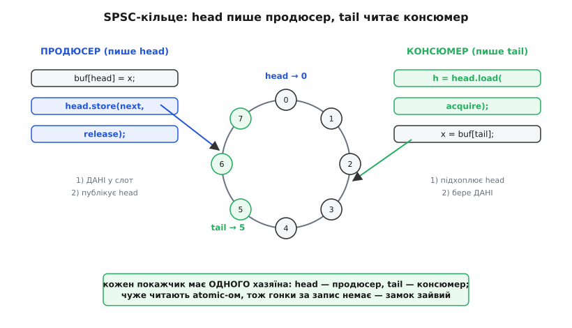
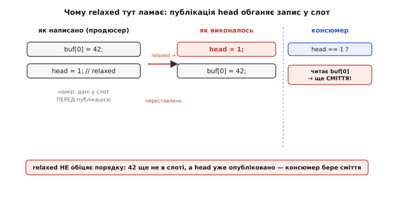
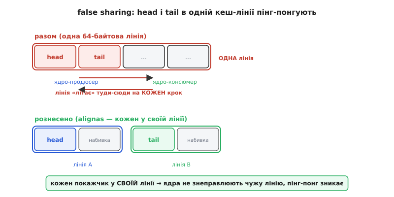

# ⚙️ Кільцевий буфер без замка на std::atomic: один пише, один читає, два ядра

Уявіть найтиповіший вузол швидкої прошивки на двоядерному контролері: одне ядро приймає дані — байти з радіо, відліки з АЦП, мітки часу з таймера, — а друге їх обробляє й показує. Між ними треба **передавати потік** так, щоб приймач ніколи не чекав, обробник теж, і жоден елемент не розірвало навпіл. Класична відповідь — **кільцевий буфер** (англ. *ring buffer*): масив, у якому після останньої комірки знову йде перша, з двома покажчиками — куди писати й звідки читати. Але щойно писач і читач опиняються на **різних ядрах**, проста структура ставить питання, від якого не рятує ні `volatile`, ні навіть бездоганний порядок рядків у коді: **чи побачить читач дані раніше, ніж покажчик, що на них указує?** Тут розібрано робочу, коректну реалізацію такого буфера на `std::atomic` з правильним порядком пам'яті — і три пастки, кожна з яких псує його тихо, лишаючи код, який «наче працює».

Одразу окреслю межу, бо вона визначає геть усе. Кільце «переривання пише — головний цикл читає» на **одному** ядрі — окрема, простіша задача: там ISR і `main` не виконуються фізично одночасно, тож вистачає `volatile` і правильного порядку операцій, а бар'єри пам'яті не потрібні (це розібрано у вставці [Кільце «ISR пише — main читає»](root:hw-arch/interrupts/proj-spsc-ring.md)). Тут ідеться про важчий випадок — **два ядра, що справді біжать паралельно**, де записи одного ядра проступають до іншого не обов'язково в тому порядку, у якому їх зроблено. Саме цей випадок вимагає `std::atomic` з `acquire`/`release`, і саме він — серце всіх неблокувальних черг.

## Задача: потік даних між ядрами, без блокування жодного з них

Зафіксуймо умову конкретно. Візьмімо ESP32 із двома ядрами Xtensa, що працюють одночасно (та сама картина буде на будь-якій багатоядерній SoC — Cortex-A, RISC-V). Ядро 0 — **продюсер**: обробник радіо чи задача збору складає готові кадри. Ядро 1 — **консюмер**: бере кадри й щось із ними робить. Обидва крутяться безперервно, і нам треба з'єднати їх так, щоб виконати три вимоги заразом.

Перше — **не блокувати**. М'ютекс чи спінлок тут працює, але дорого: якщо консюмер узяв замок і його витіснили, продюсер стоїть — і навпаки. У системі жорсткого реального часу таке чекання неприпустиме; хочеться, щоб кожне ядро рухалося своїм темпом, ніколи не спиняючись через інше. Друге — **не рвати елемент**. Якщо кадр — це структура на кілька слів, читач не повинен застати його наполовину записаним. Третє, найпідступніше, — **не переплутати порядок**: коли продюсер спершу записав дані, а тоді посунув покажчик, консюмер, побачивши новий покажчик, мусить уже бачити й **готові** дані, а не старе сміття в тій комірці.

Перші дві вимоги розв'язує сама форма кільця, і про це нижче. А третя — не про структуру даних узагалі, а про **модель пам'яті**: про те, у якому порядку записи одного ядра стають видні іншому. Її й закриває `std::atomic` з `memory_order`.

> 🔧 **Навіщо це.** Це не навчальна вправа, а щоденний вузол реальних систем: черга кадрів від радіо до польотного контролера, буфер відліків від АЦП до фільтра, конвеєр «ядро мережі → ядро логіки». Скрізь, де два ядра обмінюються потоком і жодне не можна змушувати чекати, під капотом стоїть саме такий SPSC-буфер. Написати його правильно — значить розуміти, чому дешевий `relaxed` тут ламається, а не копіювати чужий код і сподіватися.

## Ідея: два покажчики, кожен зі своїм одноосібним хазяїном

Наївна черга тримає один спільний лічильник `count` — скільки елементів усередині; писач робить `count++`, читач `count--`. На одному потоці бездоганно, але між двома ядрами це негайна [гонка даних](root:sf-tasks/atomicity-races): `count++` і `count--` — це «прочитати-змінити-записати», і якщо вони накладуться, одне оновлення губиться, а `count` розходиться з реальністю. Спокуса — обгорнути `count` у замок, і ми знову впираємося в блокування.

Елегантний вихід відомий: **не ділити жодної змінної для запису**. Замість спільного `count` беремо два окремі покажчики (індекси в масив):

- `head` — куди писати **наступний** елемент. Його **пише лише продюсер**.
- `tail` — звідки читати **наступний** елемент. Його **пише лише консюмер**.

Кожен бік володіє своїм покажчиком **одноосібно** й лише **читає** чужий. Продюсер рухає `head`, консюмер рухає `tail`, і їхні записи ніколи не націлені на ту саму комірку пам'яті. Оновлювати покажчик під замком уже не треба — сама дисципліна власності виключає гонку за запис. Стан буфера випливає з порівняння двох покажчиків: **порожньо**, коли `head == tail` (нема непрочитаного); **повно**, коли наступний крок `head` уперся б у `tail`.


*`head` пише лише продюсер, `tail` — лише консюмер; чужий покажчик кожен тільки читає (одне вирівняне слово читається неподільно). Продюсер спершу кладе дані у слот, тоді **публікує** новий `head` release-записом; консюмер спершу **підхоплює** `head` acquire-читанням, тоді бере дані. Дисципліна власності прибирає гонку за запис — замок стає зайвим.*

Тут вилазить дрібна класична двозначність: стан «порожньо» (`head == tail`) і стан «повно» виглядали б однаково, якби ми дозволили `head` дійти впритул до `tail` ззаду. Розрізняють їх, **жертвуючи однією коміркою**: буфер уважають повним на крок раніше, коли між `head` і `tail` лишається один порожній проміжок. Ціна — один невикористаний елемент із, скажімо, 256; виграш — жодних спільних лічильників. Тому корисна місткість кільця на `N` комірок — `N − 1` елемент. І ще: якщо `N` — **степінь двійки**, «загортання» покажчика роблять побітовим «і» з маскою `N − 1` замість дорогого ділення за модулем — на мікроконтролері це помітно швидше, тож місткість майже завжди беруть степенем двійки.

Дисципліна власності дає неподільність оновлень **безкоштовно**. Але вона нічого не каже про **порядок**, у якому два записи продюсера — «дані у слот» і «новий `head`» — проступлять до іншого ядра. Саме сюди й заходить `std::atomic`.

## Чому потрібен саме порядок пам'яті: механізм передачі

Придивімося до однієї публікації. Продюсер робить рівно дві речі:

```
buf[head] = кадр;        // (1) записати дані у вільний слот
head = наступний(head);  // (2) зробити слот видимим для консюмера
```

Намір очевидний: спершу дані, **потім** покажчик — щоб консюмер, побачивши зрушений `head`, мав під ним уже готовий кадр. На одному ядрі порядок рядків і є порядком виконання, тож усе працює. Але між двома ядрами обидва записи можуть проступити назовні **у зворотному порядку** — і [компілятор](root:sf-lang/compiler-optimizations) має право переставити два незалежні записи, і саме ядро виконує їх [позачергово](root:hw-arch/out-of-order-execution) та має буфер запису, тож `head` може стати видним іншому ядру **раніше**, ніж дані під ним. Тоді консюмер бачить новий `head`, лізе по кадр — а там ще старе сміття. Кожен запис окремо цілком атомарний; біда суто в **порядку**, і саму неподільність вона обходить.

Рятунок — пара **release/acquire** на покажчику. `release`-запис `head` каже: «усі мої попередні записи (зокрема запис даних у слот) завершені й не можуть переїхати **після** мене». `acquire`-читання `head` у консюмера каже: «жодне моє наступне читання не може переїхати **перед** мене». І тоді спрацьовує головна обіцянка моделі пам'яті: якщо acquire-читання **побачило** значення, яке поклав release-запис, то читач гарантовано бачить і **все**, що писач зробив **до** свого release. Release-запис *synchronizes-with* (синхронізується з) acquire-читанням, і між «дані у слоті» та «читанням даних» встановлюється [відношення «сталося-раніше»](root:sys-plang-cpp/std-atomic/math-happens-before.md). Один атомарний покажчик із правильним порядком безпечно проносить крізь межу ядер цілий кадр — без жодного замка.

## Робочий код: SPSC-буфер на std::atomic

Зберемо повну, компільовану реалізацію. Це не псевдокод — це той код, що ляже у прошивку. Почнімо зі структури. Елемент зробимо шаблонним параметром, місткість — степенем двійки; ключове — типи покажчиків і те, як вони лягають у пам'ять.

```cpp
#include <atomic>
#include <cstddef>
#include <cstdint>
#include <new>          // std::hardware_destructive_interference_size

template <typename T, size_t N>
class SpscRing {
    static_assert((N & (N - 1)) == 0, "N мусить бути степенем двійки");
    static constexpr size_t MASK = N - 1;   // загортання через «і» замість %

    // head і tail — у РІЗНИХ кеш-лініях (чому — див. пастку про false sharing).
    alignas(64) std::atomic<size_t> head_{0};   // пише лише продюсер
    alignas(64) std::atomic<size_t> tail_{0};   // пише лише консюмер
    alignas(64) T buf_[N];                       // самі дані — теж окремо

public:
    // ── бік ПРОДЮСЕРА ──────────────────────────────────────────────
    bool push(const T& item) {
        // head_ читаємо relaxed: ми — його ЄДИНИЙ писач, свіжіше нікого нема.
        const size_t h = head_.load(std::memory_order_relaxed);
        const size_t next = (h + 1) & MASK;

        // tail_ читаємо ACQUIRE: треба побачити, які слоти консюмер уже звільнив.
        if (next == tail_.load(std::memory_order_acquire))
            return false;                        // повно → відмова (політика на вибір)

        buf_[h] = item;                          // (1) СПЕРШУ дані у слот

        // (2) ПОТІМ публікуємо новий head RELEASE-записом: він замикає під собою
        //     запис у слот вище, тож консюмер, побачивши next, побачить і дані.
        head_.store(next, std::memory_order_release);
        return true;
    }

    // ── бік КОНСЮМЕРА ──────────────────────────────────────────────
    bool pop(T& out) {
        // tail_ читаємо relaxed: ми — його єдиний писач.
        const size_t t = tail_.load(std::memory_order_relaxed);

        // head_ читаємо ACQUIRE: якщо побачимо новий head, то побачимо й дані,
        //     які продюсер поклав ДО свого release.
        if (t == head_.load(std::memory_order_acquire))
            return false;                        // порожньо

        out = buf_[t];                           // (1) забрати дані зі слота

        // (2) звільнити слот RELEASE-записом tail: продюсер, побачивши новий
        //     tail, знатиме, що слот вільний, — і не перезапише його, поки ми читали.
        tail_.store((t + 1) & MASK, std::memory_order_release);
        return true;
    }

    bool empty() const {
        return head_.load(std::memory_order_acquire) ==
               tail_.load(std::memory_order_acquire);
    }
};
```

Розберімо, **чому кожен порядок саме такий** — бо це і є вся суть, і саме тут помиляються.

**Свій покажчик — `relaxed`.** Продюсер читає `head_` через `relaxed`, консюмер читає `tail_` через `relaxed`. Це коректно й найдешевше, бо кожен читає **власний** покажчик, який більше **ніхто не пише**. Свіжішого значення взятися нізвідки — ми самі його останні й записали, у тому ж потоці, а в межах одного потоку порядок завжди дотримано. Ставити сюди `acquire` було б марною тратою бар'єра.

**Чужий покажчик — `acquire`.** Продюсер читає `tail_` через `acquire`, консюмер читає `head_` через `acquire`. Ось де синхронізація. Коли консюмер acquire-читанням бачить новий `head_`, парний release-запис продюсера ґарантує, що дані у слоті вже на місці. Симетрично: коли продюсер acquire-читанням бачить, що консюмер зрушив `tail_` (звільнив слот), він знає, що консюмер уже **дочитав** старий вміст, — тож перезаписати цей слот безпечно, читач звідти більше не бере.

**Публікація — `release`, і завжди ОСТАННЬОЮ.** Обидва боки посувають свій покажчик release-записом, і роблять це **після** доступу до даних. Продюсер: спершу `buf_[h] = item`, аж потім `head_.store(..., release)`. Консюмер: спершу `out = buf_[t]`, аж потім `tail_.store(..., release)`. Порядок цих двох рядків — не косметика, а сама коректність; чому — окремо нижче, бо це найтонша пастка.

Тепер — як цим користуватися в реальній прошивці. Продюсер на одному ядрі, консюмер на іншому, обидва крутяться у своїх циклах:

```cpp
// Кадр, що передаємо між ядрами (кілька слів — саме той випадок, коли
// «не розірвати навпіл» важливо).
struct Frame {
    uint32_t timestamp;
    uint16_t channel[8];
    uint8_t  flags;
};

SpscRing<Frame, 256> radio_queue;   // спільний об'єкт, видимий обом ядрам

// ── ядро 0: продюсер (напр., колбек готового кадру радіо) ──
void on_frame_ready(const Frame& f) {
    if (!radio_queue.push(f)) {
        // Черга повна: консюмер не встигає. Політика — на ваш розсуд:
        // відкинути найновіший (як тут), відкинути найстаріший, лічити втрати.
        ++dropped_frames;
    }
}

// ── ядро 1: консюмер (задача обробки) ──
void processing_task() {
    Frame f;
    for (;;) {
        if (radio_queue.pop(f)) {
            handle(f);               // обробляємо кадр
        } else {
            // Черга порожня: коротко поступитися ядром, щоб не палити його вхолосту.
            vTaskDelay(1);           // або __WFE() / yield — за середовищем
        }
    }
}
```

Зверніть увагу на дві практичні речі. Політика **переповнення** — свідомий вибір, а не дрібниця: у телеметрії часто краще відкинути найстаріший кадр (свіжий важливіший), у надійній передачі — рахувати втрати й сигналити наверх; тут для простоти показано відмову на найновішому. І цикл консюмера **не крутить порожнечу гарячим циклом** — коли черга порожня, він поступається ядром (`vTaskDelay`, `__WFE`, `yield`), інакше спалить ціле ядро на безплідне опитування.

## Три пастки, кожна псує тихо

Робочий код вище легко зіпсувати трьома способами, і всі три підступні тим, що зіпсована версія **компілюється, проходить тести на ноутбуку й місяцями «працює»** — а розсипається лише під навантаженням і лише на певному залізі. Розберімо кожну.

### Пастка 1: «оптимізувати» все до relaxed

Найпоширеніша спокуса: `relaxed` дешевший, тож замінімо ним `acquire`/`release` скрізь — «однаково ж просто цілі числа туди-сюди». Це руйнує буфер, і ось точний механізм.

`relaxed` дає атомарність самого числа й **нічого** про порядок щодо інших доступів. Якщо продюсер публікує `head` через `relaxed`, компілятор або ядро вільні переставити цей запис **перед** записом даних у слот. Тоді на іншому ядрі `head` проступає першим: консюмер бачить новий `head`, лізе по кадр — а `buf_[h] = item` ще не долетів до пам'яті, у слоті старе сміття. Дані «з майбутнього» покажчик обіцяє, а самих даних ще нема.


*Із `relaxed` публікація `head` вільна переїхати **перед** записом у слот. Консюмер бачить новий `head`, читає слот — а `42` туди ще не дійшло. Дані окремо атомарні, біда — суто в **порядку**, і саме його `relaxed` не тримає, а `release`/`acquire` — тримає.*

Ключова відмінність від однопотокового `volatile`-кільця: там писач і читач — одне ядро (ISR та `main`), і між ними порядок дотримано апаратно, бо це той самий конвеєр; `volatile` лише не дає **компілятору** кешувати покажчик у регістрі. А між **двома** ядрами `volatile` безсилий: він не ставить бар'єра пам'яті, тож не заважає **процесору** випустити записи назовні у зворотному порядку. Ось чому підміна `std::atomic` на `volatile` — так само тиха катастрофа, як підміна на `relaxed`. Мінімальний коректний набір — рівно той, що в коді: свій покажчик `relaxed`, чужий `acquire`, публікація `release`. Прибрати з нього хоч один `acquire` чи `release` — відчинити ту саму діру.

Чому ж баг такий невловний? На **сильно впорядкованому** x86 більшість перестановок заборонена самим залізом, тож навіть помилковий `relaxed`-код там часто «працює» — записи й так виходять по порядку. А на **слабко впорядкованих** ARM, RISC-V, Xtensa (тобто майже на всіх мобільних і вбудованих ядрах) ця гарантія відсутня, і той самий код розсипається. Код, що місяцями «працював» на ПК, лягає на телефоні чи контролері — класична пастка, і ловиться вона не запуском, а розумінням.

### Пастка 2: false sharing — head і tail в одній кеш-лінії

Друга пастка не про коректність, а про швидкість, і теж невидима в коді. Ви написали все правильно, буфер робочий — а він гальмує, і що активніший обмін, то гірше. Причина — **хибне спільне** (*false sharing*): `head` і `tail` випадково лягли в **одну кеш-лінію**.

Кеш працює не окремими байтами, а **лініями** — блоками зазвичай по 64 байти; для протоколу [когерентності кешів](root:hw-arch/cache-coherence) лінія неподільна. Якщо `head_` і `tail_` стоять поруч (два `size_t` — 16 байтів, легко влазять в одну лінію), то щойно продюсер пише `head_`, апаратура **знеправлює всю лінію** в кеші іншого ядра — разом із `tail_`, якого продюсер навіть не чіпав. Консюмерове ядро змушене тягнути лінію назад, щоб прочитати `head_`, а на наступному кроці продюсерове знову її забирає. Лінія «літає» між ядрами на кожній операції — десятки тактів за переїзд, і обидва ядра більшість часу стоять, чекаючи на неї. Логічно вони незалежні — а гальмують, наче б'ються за спільну змінну.


*Угорі — `head` і `tail` в одній лінії: продюсерів запис `head` знеправлює лінію в консюмера разом із `tail`, і вона пінг-понгує між ядрами на кожній операції. Унизу — `alignas` кладе кожен покажчик на початок **своєї** лінії (решту добиває невидима набивка), тож ядра більше не крадуть лінію одне в одного.*

Лік — рознести `head_` і `tail_` по **різних** лініях, щоб запис одного не знеправлював лінію з іншим. Саме це й робить `alignas(64)` у коді вище: вирівнювання на межу лінії змушує компілятор докласти невидиму набивку, і кожен покажчик осідає у власній лінії. Одне слово `alignas` перетворює буфер, що гальмує від активного обміну, на буфер, що літає, — при незмінній логіці.

Тут ховається підпастка з **розміром лінії**. `64` — типово для x86, але не всесвітня стала: на процесорах Apple серії M системна лінія — **128** байтів, і вирівнювання на 64 там може **не** рознести покажчики надійно; на ESP32 (Xtensa) лінія — лише **32**, тож 64 працює з запасом, але марнує вдвічі більше пам'яті. Мораль: вирівнюйте на **реальний** розмір лінії цілі. C++17 дає для цього константу `std::hardware_destructive_interference_size` — рекомендований відступ між незалежними об'єктами:

```cpp
#include <new>
alignas(std::hardware_destructive_interference_size) std::atomic<size_t> head_{0};
alignas(std::hardware_destructive_interference_size) std::atomic<size_t> tail_{0};
```

Виглядає як ідеальний портативний хід, але має власну ваду: константа фіксується **під час компіляції** й вбудовується в ABI, тож якщо бінарник поїде на процесор з іншою лінією, відступ буде неправильний; GCC навіть попереджає про її вжиток. Для мікроконтролера, де залізо відоме напевно, надійніше **захардкодити** відомий розмір лінії й задокументувати його, ніж покладатися на абстракцію, портативну лише в теорії. (Ширше про виявлення й лік хибного спільного — вставка [Полювання на хибне спільне](root:hw-arch/cache-coherence/proj-false-sharing.md).)

### Пастка 3: дані ПІСЛЯ покажчика — перевернутий порядок публікації

Третя пастка — найтонша, бо код виглядає майже правильно й `release`/`acquire` на місці. Помилка — переставити **два власні рядки** місцями: посунути покажчик **перед** доступом до даних.

Розгляньмо продюсера. Правильно — дані, потім покажчик:

```cpp
buf_[h] = item;                                   // (1) спершу дані
head_.store(next, std::memory_order_release);     // (2) потім публікація
```

А ось поламаний варіант — покажчик поперед даних:

```cpp
head_.store(next, std::memory_order_release);     // ПАСТКА: опублікували порожній слот
buf_[h] = item;                                   // дані пишемо ВЖЕ ПІСЛЯ
```

Логіка `release` тут працює бездоганно — і саме тому й підводить. `release` замикає під собою все, що **написано до нього**. Але запис `buf_[h] = item` тепер стоїть **після** нього, тож під замок не потрапляє — release його не тримає й не зобов'язаний. Консюмер acquire-читанням бачить новий `head`, чесно вважає слот готовим і читає його — а продюсер саме в цю мить (або й пізніше) туди щось пише. Виходить гонка: читач бере напівзаписаний або порожній слот. Порядок операцій із пам'яттю — це **контракт про причину й наслідок**: release-бар'єр гарантує, що все причинно-потрібне зроблено **раніше** за публікацію; поставити публікацію першою — розірвати цей зв'язок, скільки б `release` ти на неї не вішав.

Те саме дзеркально в консюмера: спершу **дочитати** дані зі слота, аж тоді release-записом посунути `tail` (звільнити слот). Перевернеш — і продюсер, побачивши звільнений `tail`, вважатиме слот вільним і перезапише його **поки консюмер ще читає**. Тож правило залізне для обох боків: **доступ до даних — перед публікацією покажчика, завжди**. Release/acquire дають правильний порядок лише тоді, коли операції розставлені в правильному причинному порядку; вони підсилюють ваш порядок, а не вигадують його за вас.

## Складність, і чому воно того варте

Ця структура — **wait-free** для обох боків: `push` і `pop` не мають ні циклів очікування, ні спроб-повторів (у SPSC-випадку) — рівно скінченне число операцій, і жодне ядро ніколи не блокує інше. Немає ризику взаємоблокування, немає інверсії пріоритетів, немає ядра, що стоїть під чужим замком. Ціна — обмеження **строго один писач і строго один читач**: якщо продюсерів чи консюмерів стане двоє, ця схема мовчки зламається (два писачі знову битимуться за `head`), і потрібна вже інша, складніша конструкція з `compare_exchange`. Для класичного «одне ядро виробляє — інше споживає» SPSC — найдешевший коректний інструмент, який тільки є.

Історична примітка про сам фундамент, на якому це стоїть. Поняття, що потоки можуть **не погодитися** про порядок подій, і формальне визначення найсуворішого узгодження — **послідовної узгодженості** (*sequential consistency*) — увів Леслі Лемпорт (Leslie Lamport) у праці «How to Make a Multiprocessor Computer That Correctly Executes Multiprocess Programs» (IEEE Transactions on Computers, вересень 1979) — це **документована першість**, стаття й досі найцитованіша в літературі про когерентність кешів. А слабші, дешевші рівні (`acquire`/`release`), на яких і тримається наш буфер, C++ здобув лише 2011 року, коли мова вперше офіційно визнала існування потоків і отримала стандартну модель пам'яті; до того багатопотокова прошивка трималася на самих лише розширеннях компіляторів.

Отже, робочий SPSC-буфер без замка на `std::atomic` складається з небагатьох, але точних рішень. **Два покажчики** з одноосібними хазяями (`head` — продюсер, `tail` — консюмер) прибирають гонку за запис самою дисципліною власності. **Порядок пам'яті** робить передачу коректною: свій покажчик читають `relaxed`, чужий — `acquire`, публікують — `release` й лише **після** доступу до даних. І три пастки, кожна тиха: `relaxed` замість `acquire`/`release` рве порядок (і мовчить на x86, вбиває на ARM); `head` і `tail` в одній кеш-лінії душать швидкість хибним спільним (лік — `alignas` на реальний розмір лінії); перевернутий порядок «покажчик поперед даних» ламає причинність, скільки б `release` на нього не вішати. Розуміти, **чому** саме ці порядки, — і є різниця між буфером, що надійно возить дані між ядрами, і тим, що «наче працює», доки одного дня під навантаженням не почне губити кадри.
