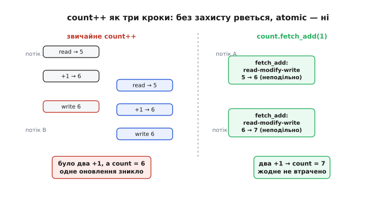
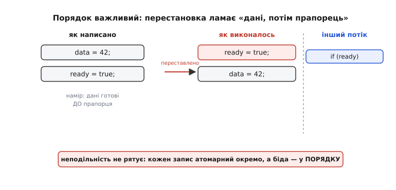
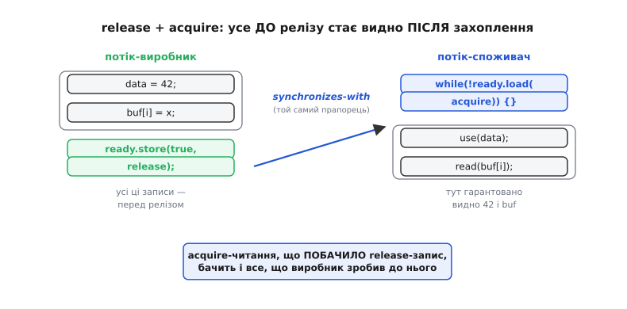
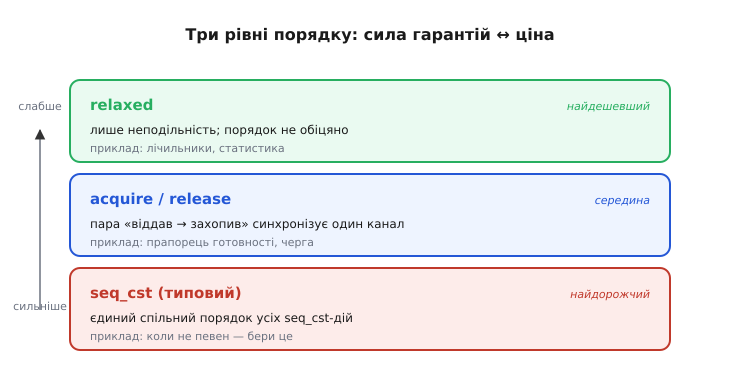

# std::atomic і порядок пам'яті

<preknowlist>
- [Атомарність і гонки](topic:sf-tasks/atomicity-races) — що таке неподільна дія й чому багатокрокова операція над спільними даними ламається, коли її розрізають посередині.
- [volatile](topic:sf-lang/volatile) — дає свіжість (читати/писати прямо в пам'ять), але не неподільність; чим саме воно відрізняється від atomic.
- [Оптимізації компілятора](topic:sf-lang/compiler-optimizations) — компілятор вільно переставляє й прибирає доступи до пам'яті, поки видима поведінка збережена.
- [Позачергове виконання](topic:hw-arch/out-of-order-execution) — процесор теж виконує інструкції не в тому порядку, у якому вони написані.
- [Багатоядерні процесори](topic:hw-arch/multicore) — коли справжня паралельність двох ядер, а не лише переривання, робить порядок записів видимим іншому ядру.
</preknowlist>

Є два різні способи зіпсувати спільні дані, і `std::atomic` — це той інструмент C++, який закриває **обидва одним поняттям**. Перший спосіб очевидний: два потоки міняють одну змінну, і оновлення губляться, бо `count++` — насправді три кроки, а не один. Другий підступніший: навіть коли кожна окрема операція неподільна, потоки можуть **не погодитися, у якому порядку** ці операції сталися — бо і компілятор, і процесор вільно переставляють доступи до пам'яті. `std::atomic` дає змінній неподільність, а через параметр «порядку пам'яті» (англ. *memory order*) дозволяє точно сказати, наскільки суворо цю змінну треба впорядкувати щодо решти. Тут розібрано, звідки обидві біди, що саме гарантує `std::atomic`, як читати шість значень `memory_order` і коли який брати — щоб не платити зайвого й не отримати непомітний баг.

### Дві біди спільної пам'яті

Почнімо з тієї, що на поверхні. Дію називають **атомарною** (гр. *átomos* — неподільний), якщо її не можна застати на півдорозі. А звичайний інкремент `count++` — подільний: процесор читає значення, додає одиницю, записує назад. Якщо два потоки роблять це водночас, обидва можуть прочитати ту саму п'ятірку, обидва записати шістку — і замість семи в лічильнику лишиться шість. Одне оновлення просто зникло. Це [гонка даних](topic:sf-tasks/atomicity-races): результат залежить не від логіки, а від того, хто коли встиг.


*Звичайний `count++` — три кроки, і другий потік врізається між ними: обидва прочитали 5, обидва записали 6, одне оновлення втрачено. `count.fetch_add(1)` виконує весь «прочитати-змінити-записати» неподільно, тож потоки не можуть застати одне одного посередині — обидва `+1` зберігаються.*

Першу біду `std::atomic` розв'язує прямо: `std::atomic<int> count;` перетворює `count.fetch_add(1)` на **одну** неподільну операцію «прочитати-змінити-записати» (read-modify-write). Її вже не можна розрізати — другий потік або бачить значення до неї, або після, але ніколи посередині. Проблема лічильника зникає.

Але є друга біда, і саме вона робить тему нетривіальною. Уявімо класичну передачу: один потік готує дані, тоді підіймає прапорець «готово», а другий чекає на прапорець і бере дані.

```cpp
// потік-виробник          // потік-споживач
data = 42;                  while (!ready) { }
ready = true;               use(data);      // бачить 42?
```

Здавалося б, якщо споживач побачив `ready == true`, то запис `data = 42` уже точно стався — адже у виробника він **іде першим**. Та це хибна певність. Порядок, у якому записи стають **видні іншому потоку**, може відрізнятися від порядку в коді — і з двох незалежних причин одразу.

### Чому порядок «розсипається»

Перша причина — [компілятор](topic:sf-lang/compiler-optimizations). Оптимізатор бачить два незалежні записи в різні змінні й має повне право переставити їх місцями, якщо це вигідно (наприклад, так лягає зручніше в регістри). Для однопотокового погляду результат той самий — а саме однопотоковий погляд і зобов'язане зберегти [правило «ніби»](topic:sf-lang/as-if-rule). Що ці записи хтось із іншого потоку підглядає — компілятор за замовчуванням не припускає взагалі.

Друга причина — сам процесор. Сучасне ядро виконує інструкції [позачергово](topic:hw-arch/out-of-order-execution) і має буфери запису, тож навіть якщо в машинному коді записи стоять по порядку, дійти до пам'яті (і стати видними [іншому ядру](topic:hw-arch/multicore)) вони можуть у зворотному. Це не збій, а нормальна робота заліза задля швидкості.


*Виробник написав `data`, потім `ready` — а компілятор чи процесор переставив їх, і `ready` став видним першим. Споживач побачив прапорець і прочитав `data`, яка ще стара. Кожен запис окремо цілком атомарний — біда суто в **порядку**, тож саму лише неподільність вона обходить.*

Ось чому неподільності **замало**. Навіть якби `data` і `ready` були ідеально атомарні кожна окремо, споживач міг би побачити піднятий прапорець і при цьому стару `data` — бо порядок, у якому ці два записи проступили назовні, ніхто не зафіксував. Потрібен другий інструмент: спосіб сказати «усе, що я записав **до** цього прапорця, має стати видним **разом** із ним, і саме в цьому порядку». Саме це й дає порядок пам'яті в `std::atomic`.

### Порядок пам'яті: контракт між потоками

Ключова ідея: кожна операція над `std::atomic` несе не лише значення, а й **параметр порядку** — обіцянку про те, як вона впорядкована щодо звичайних читань і записів навколо неї. Це перетворює атомарну змінну на **синхронізаційну точку**: місце, де два потоки домовляються про спільний порядок подій. Найважливіша пара таких обіцянок зветься **release** (англ. — «відпустити») і **acquire** (англ. — «захопити»).

- **release-запис** каже: «усі мої попередні записи (зокрема звичайні, неатомарні) завершені й не можуть переїхати **після** цієї операції». Виробник ставить `release` на запис прапорця.
- **acquire-читання** каже: «жодне моє наступне читання не може переїхати **перед** цією операцією». Споживач ставить `acquire` на читання прапорця.

І тоді спрацьовує головне правило: якщо acquire-читання **побачило** значення, яке записав release-запис, то потік-читач гарантовано бачить і **все**, що потік-писач зробив **до** свого release. Кажуть, що release-запис *synchronizes-with* (синхронізується з) acquire-читанням, і між ними встановлюється відношення [«сталося-раніше» (happens-before)](topic:sys-plang-cpp/std-atomic/math-happens-before.md) — часткове впорядкування подій, на якому й тримається вся модель пам'яті C++.


*`ready.store(true, release)` замикає під собою всі попередні записи виробника; `ready.load(acquire)` у споживача, щойно побачить це `true`, відкриває доступ до них усіх. Один прапорець із правильним порядком передає цілий пакет даних без жодної блокади — це серце неблокувальних (lock-free) структур.*

Ось як виглядає та сама передача, тепер коректна:

```cpp
std::atomic<bool> ready{false};
int data = 0;                              // звичайна змінна, не atomic

// потік-виробник
data = 42;                                 // 1) готуємо дані
ready.store(true, std::memory_order_release);   // 2) release-прапорець

// потік-споживач
while (!ready.load(std::memory_order_acquire)) { }  // чекаємо acquire-читанням
use(data);                                 // тут data ГАРАНТОВАНО == 42
```

Зверніть увагу на тонкість, яку легко проґавити: `data` тут — **звичайна** змінна, не `atomic`. І це коректно. Пара release/acquire на прапорці впорядковує **все навколо себе**, зокрема неатомарні доступи. Атомарним мусить бути лише сам прапорець-синхронізатор; дані, які він «замикає», можуть бути будь-якими. Саме так один маленький атомарний прапорець безпечно передає між потоками цілий буфер.

> 🔧 **Навіщо це.** Це і є фундамент **неблокувальних** (lock-free) структур — черг, кільцевих буферів, лічильників посилань, — де потоки обмінюються даними **без м'ютекса**, лише через атомарні прапорці з правильним порядком. Класичний приклад — [односторонній кільцевий буфер](topic:sys-plang-cpp/std-atomic/proj-spsc-ring-buffer.md), де один потік пише, другий читає, і жодного блокування: продюсер публікує елемент release-записом індексу, консюмер підхоплює його acquire-читанням. Розуміти release/acquire — значить уміти писати такий обмін правильно, а не «наче працює».

### Шість значень memory_order, три рівні сили

C++ дає шість значень `memory_order`, але їх зручно бачити як **три рівні сили** — від найслабшого й найдешевшого до найсуворішого й найдорожчого. Сила тут означає, скільки додаткового впорядкування операція нав'язує компілятору й процесору; ціна — скільки оптимізацій і апаратної свободи через це втрачається.


*Три рівні порядку. `relaxed` — лише неподільність, жодних обіцянок про порядок (найдешевший). `acquire`/`release` — синхронізують один канал між парою потоків. `seq_cst` — єдиний спільний порядок усіх seq_cst-операцій для всіх потоків (найсуворіший і найдорожчий, зате найпростіший для міркувань).*

**`memory_order_relaxed` — лише неподільність.** Операція атомарна, і це все: жодних обіцянок про порядок щодо інших змінних. Її можна вільно переставляти. Годиться там, де важлива тільки неподільність самого числа, а порядок відносно решти байдужий — насамперед лічильники подій і статистика. Класичний приклад — простий лічильник, який кілька потоків нарощують, а підсумок читають лише наприкінці:

```cpp
std::atomic<uint32_t> hits{0};
hits.fetch_add(1, std::memory_order_relaxed);   // рахуємо; порядок не важить
```

Тут `relaxed` цілком безпечний і найшвидший: нам байдуже, у якому порядку потоки збільшили лічильник, — важливо лиш, щоб жоден `+1` не загубився, а це `fetch_add` і гарантує.

**`acquire` / `release` (і `acq_rel`) — впорядкований один канал.** Це та сама пара, що розібрана вище: `release` на записі, `acquire` на читанні, а `acq_rel` — для операцій, які роблять і те, й те заразом (як `fetch_add`, що і читає, і пише). Синхронізують вони саме **пару** «писач ↔ читач» через **одну** атомарну змінну — рівно стільки впорядкування, скільки треба для передачі даних прапорцем, і ні такту більше. Це робочий рівень для неблокувальних структур.

**`memory_order_seq_cst` — єдиний спільний порядок.** Найсуворіший рівень (англ. *sequential consistency* — послідовна узгодженість): усі seq_cst-операції всіх потоків вкладаються в **один спільний глобальний порядок**, який усі потоки бачать однаково. Це найлегше уявити («ніби все відбувалося по черзі в одному списку») і найважче помилитися — тому саме `seq_cst` стоїть **за замовчуванням**: якщо ви пишете `count.fetch_add(1)` без другого аргументу, ви отримуєте `seq_cst`. Ціна — найбільша: щоб забезпечити спільний порядок, процесор часто змушений ставити повний бар'єр пам'яті, а це найдорожча з синхронізаційних операцій.

Звідси практичне правило вибору: **сумніваєшся — лишай типовий `seq_cst`**. Він завжди коректний, просто інколи повільніший, ніж могло б бути. `relaxed` бери свідомо для лічильників, де порядок явно не потрібен. А до `acquire`/`release` переходь, коли профіль показав, що бар'єри `seq_cst` коштують дорого на гарячому шляху, **і** ти можеш чітко пояснити, який запис із яким читанням синхронізується. Передчасно розкидати `relaxed` заради швидкості — надійний спосіб отримати баг, який виявиться лише під навантаженням і лише на певному залізі.

> 🔧 **Навіщо це.** На слабко впорядкованих архітектурах (ARM, RISC-V — а це майже всі мобільні й вбудовані ядра) різниця між `seq_cst` і `acquire`/`release` — це реальні такти на кожній операції, бо перше вимагає повного бар'єра, а друге — легшого. На сильно впорядкованому x86 різниця часто зникає (там і так більшість перестановок заборонена апаратно), тож код, що «працює» на ноутбуку з надто слабкими порядками, здатен розсипатися на телефоні. Тому порядок обирають не «як вийде», а свідомо — і перевіряють думкою, а не лише запуском.

### Звідки береться сила: бар'єри в машинному коді

Порядок пам'яті — це не магія рантайму, а **вказівка транслятору**, що перетворюється на конкретні машинні інструкції. Коли компілятор бачить release-запис, він, по-перше, **сам** не переставляє через нього попередні записи, а по-друге — за потреби вставляє в машинний код [бар'єр пам'яті](topic:hw-arch/memory-barrier-instructions) (на ARM це інструкції з родини `DMB`), який забороняє вже **процесору** випускати ці записи назовні із запізненням. Тобто одне слово `release` у C++ вмикає узгоджену заборону перестановок на **обох** рівнях — компіляторському й апаратному.

Саме тому сила коштує грошей буквально: сильніший порядок — важчий (або зайвий там, де можна легший) бар'єр, а бар'єр змушує конвеєр чекати, доки записи «осядуть». `relaxed` не ставить бар'єра взагалі; `acquire`/`release` ставлять однобічний; `seq_cst` — найчастіше повний, двобічний. Обираючи `memory_order`, ви фактично обираєте, який бар'єр опиниться в прошивці.

Ця залежність від архітектури не випадкова. Модель пам'яті C++ навмисно зроблена **абстрактною** — вона описує гарантії в термінах «сталося-раніше», не згадуючи ні ARM, ні x86, — щоб той самий вихідний код був коректним усюди, а транслятор під кожну машину підбирав рівно ті бар'єри, яких та машина потребує. На x86 багато порядків «безкоштовні» (апаратура й так їх тримає), на ARM за них треба платити явними інструкціями; але код лишається однаковим. Історія того, як C++ узагалі здобув таку модель — а до 2011 року стандарт не визнавав існування потоків, і багатопотоковий код тримався на самих лише розширеннях компіляторів, — [окрема й повчальна](topic:sys-plang-cpp/std-atomic/hist-cpp11-memory-model.md).

### atomic, volatile і критична секція — хто для чого

Наостанок варто розвести три інструменти, які початківці постійно плутають, бо всі троє «якось пов'язані зі спільними даними».

[`volatile`](topic:sf-lang/volatile) дає **свіжість** — читати й писати прямо в пам'ять, не кешуючи в регістрі, — але **не** дає ні неподільності, ні порядку між потоками. Воно створене для іншого: для комірок, які міняє апаратура (регістри периферії) чи обробник переривання в межах одного потоку виконання. Використовувати `volatile` для синхронізації **між потоками** — поширена й небезпечна помилка: воно не гарантує ні атомарності `count++`, ні того, що записи стануть видні іншому ядру в правильному порядку. Для міжпотокового обміну правильний інструмент — саме `std::atomic`, який дає все троє: неподільність, свіжість і контроль порядку.

[Критична секція](topic:sf-tasks/atomicity-races) (вимкнути переривання чи взяти м'ютекс) розв'язує ту саму задачу неподільності іншим коштом — **блокуванням**: доки один виконавець у секції, інші чекають. Це простіше й універсальніше (захищає будь-яку багатокрокову дію, а не лише одну змінну), але дорожче: чекання, ризик узаємоблокування, заборона надовго глушити переривання. `std::atomic` — це протилежний підхід, **без блокування**: він не змушує нікого чекати, натомість робить саму операцію неподільною апаратно. Для однієї змінної atomic майже завжди дешевший; для складної узгодженої дії над кількома структурами практичніша критична секція.

> 🔧 **Навіщо це.** Практичний орієнтир на щодень. Спільна **одна змінна** (лічильник, прапорець, індекс, покажчик), обмін між потоками чи ядрами — бери `std::atomic`. Комірка, яку міняє **залізо або ISR у межах одного потоку**, — `volatile`. Складна **багатокрокова** дія над кількома пов'язаними даними — критична секція або м'ютекс. Плутати їх — типове джерело або гонок (взяли `volatile` замість atomic), або зайвих гальм (узяли важку секцію там, де вистачило б atomic).

Отже, `std::atomic` закриває обидві біди спільної пам'яті одним поняттям: операції над атомарною змінною **неподільні**, а параметр `memory_order` задає, наскільки суворо їх упорядкувати щодо решти — від `relaxed` (лише неподільність) через `acquire`/`release` (синхронізований канал між двома потоками) до типового `seq_cst` (єдиний спільний порядок для всіх). Порядок — не рантаймна магія, а вказівка транслятору, що обертається бар'єрами в машинному коді, тож сильніший порядок коштує тактів; звідси й правило — не сумніваєшся, лишай `seq_cst`, а слабші рівні бери свідомо й перевірено. І чітко розводьте atomic зі свіжим-але-неатомарним `volatile` та з блокувальною критичною секцією: у кожного своя робота, і саме `std::atomic` — той інструмент, яким мова C++ дала неблокувальному обміну даними надійне підґрунтя.
