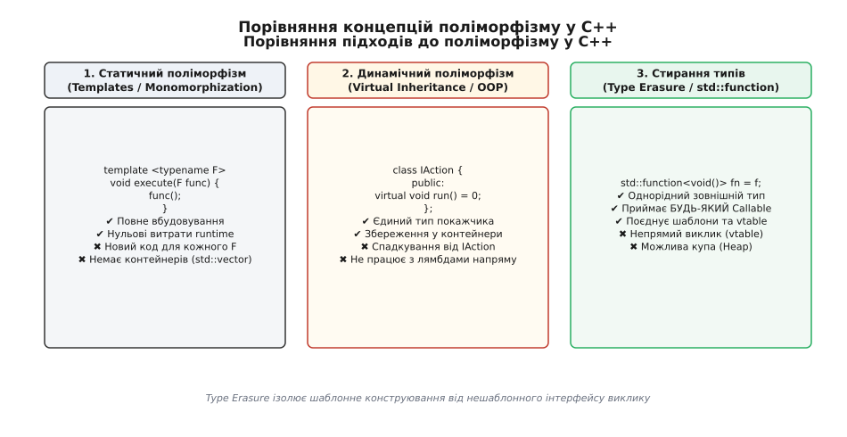
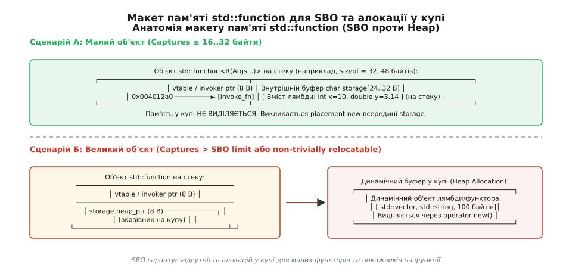
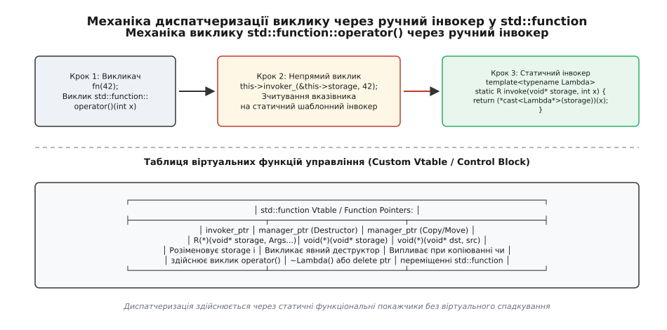
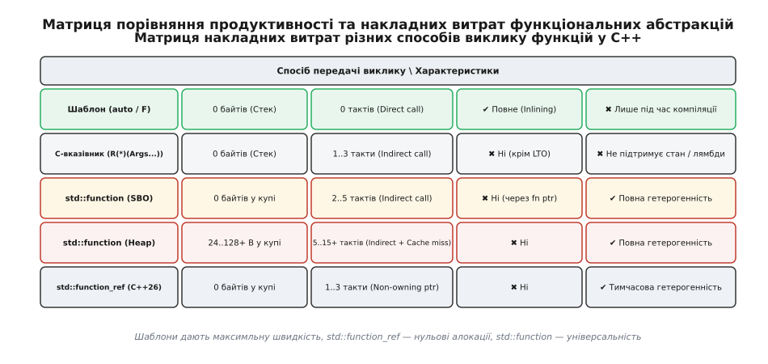

# std::function та Type Erasure у C++: механіка, пам'ять та ціна абстракції

<preknowlist>
- [Адреси та вказівники](topic:sf-lang/addresses-pointers) — вказівники на функції, непрямий виклик та таблиця віртуальних методів (vtable).
- [Динамічна пам'ять і купа](topic:sf-lang/heap-dynamic-memory) — виділення пам'яті через malloc/operator new, накладні витрати алокатора та фрагментація.
- [Семантика переміщення](topic:sys-plang-cpp/move-semantics) — як rvalue-посилання дозволяють передавати володіння ресурсом за постійний час O(1).
- [Лямбда-вирази та захоплення](topic:sys-plang-cpp/lambdas-and-captures) — внутрішня структура анонімних функторів, генерація типів компілятором та розмір closure-об'єктів.
</preknowlist>

Розробка плагінних архітектур, високопродуктивних черг завдань (англ. *task queues*) та систем обробки асинхронних подій у C++ постійно зіштовхується з концептуальною суперечністю мови: як зберегти або передати різнорідні об'єкти виклику у єдиній структурі даних, зберігши строгий контроль типів на етапі компіляції. При спробі зберегти список різнотипних функцій у масиві `std::vector` звичайна система типів вимагає від усіх елементів одного конкретного типу.

## 1. Проблема неоднорідності об'єктів виклику (Heterogeneous Callables)

Розглянемо випадок побудови диспетчера завдань для мережевого сервера. Сервер повинен отримувати завдання з трьох різних джерел:
1. Сиру глобальну C-функцію обробки пакетів `void process_packet(int)`;
2. Анонімну лямбду з захопленням локального контексту `[client_id, &db](int id) { ... }`;
3. Функтор із перевизначеним `operator()`, що керує пулом з'єднань.

Кожен із цих трьох об'єктів має абсолютно власний, унікальний тип з точки зору компілятора C++. Навіть якщо розробник напише дві абсолютно однакові лямбди у сусідніх рядках коду:

```cpp
auto lambda1 = [](int x) { return x * 2; };
auto lambda2 = [](int x) { return x * 2; };
```

Компілятор C++ згенерує для них два **різні анонімні типи класів** (наприклад, `class __lambda_12_5` та `class __lambda_13_5`). Кожна лямбда з захопленням перетворюється компілятором на унікальну структуру даних, посідаючи власний розмір у пам'яті залежно від кількості та типів захоплених змінних.

### Чому класичні підходи C++ зазнають невдачі?

Спроба розв'язати цю проблему через класичний статичний поліморфізм C++ (шаблони) призводить до комбінаторного вибуху коду. Якщо функція додавання завдання визначена як шаблон:

```cpp
template <typename F>
void schedule_task(F task) {
    // Диспетчеризація...
}
```

Компілятор згенерує окреме тіло `schedule_task` для кожного нового типу лямбди. Проте створити гетерогенну колекцію на кшталт `std::vector<F>` неможливо, адже тип `F` відрізняється для кожного виклику у програмі. Шаблони працюють виключно під час компіляції (compile-time) і не дозволяють зберігати об'єкти різного розміру та типу в одному масиві під час виконання (runtime).

Спроба застосувати класичні C-вказівники на функції `void(*)(int)` також зазнає поразки. Сирий функціональний покажчик у C може посилатися лише на статичні або глобальні функції без стану. Лямбда-вираз із захопленням контексту (`[client_id]`) не може бути приведена до сирого покажчика на функцію, оскільки для виконання їй потрібен доступ до збережених у пам'яті змінних контексту.

З іншого боку, класичний динамічний поліморфізм через віртуальне спадкування ООП:

```cpp
class ITask {
public:
    virtual ~ITask() = default;
    virtual void run(int) = 0;
};
```

вимагає, щоб кожен об'єкт виклику успадковував цей конкретний базовий клас. Це унеможливлює використання готових сторонніх функцій, C-архітектур або простих лямбда-виразів без написання громіздких класів-адаптерів. Таке спадкування є **інтрузивним** (англ. *intrusive*), оскільки воно нав'язує зв'язки між типами на рівні оголошення класів.

Для розв'язання цього фундаментального протиріччя в C++ використовують паттерн **стирання типів** (англ. *Type Erasure*), втілений у стандартному класі `std::function`.

---

## 2. Концепція та архітектура Type Erasure

Стирання типів — це архітектурна техніка, яка поєднує гнучкість статичних шаблонів під час створення об'єкта із жорстким, нешаблонним інтерфейсом під час його використання. 

Сутність Type Erasure полягає у поділі об'єкта на дві частини:
1. **Шаблонний конструктор на вході**: приймає об'єкт довільного типу `F`. Конструктор перевіряє лише синтаксичну відповідність сигнатурі виклику (чи можна викликати `f(args...)`).
2. **Нешаблонна зовнішня обгортка**: тип самого контейнера `std::function<R(Args...)>` залежить **виключно** від сигнатури виклику (типу поверненого значення `R` та типів аргументів `Args...`), але повністю втрачає (стирає) інформацію про вихідний конкретний тип `F`.


*Порівняння статичного поліморфізму (шаблони), класичного ООП (віртуальне спадкування) та стирання типів (Type Erasure).*

На відміну від звичайного віртуального спадкування, Type Erasure є **неінтрузивним** (англ. *non-intrusive*). Об'єкту `F` не потрібно знати про існування `std::function`, йому не потрібно успадковувати жодні базові класи чи підключати специфічні заголовочні файли. Єдина вимога до `F` — можливість виконання виклику з аргументами `Args...`.

### Архітектурний паттерн Concept/Model проти Manual Vtable

Існує дві фундаментальні технічні реалізації Type Erasure у C++:

#### 1. Паттерн Concept/Model (External Polymorphism)
У цьому підході всередині обгортки створюється абстрактний базовий клас `Concept`, що оголошує чисто віртуальний метод `invoke()`. Шаблонний спадкоємець `Model<F>` успадковує `Concept` і зберігає екземпляр конкретного типу `F`:

```cpp
// Концептуальна реалізація паттерну Concept/Model
template <typename R, typename... Args>
class ConceptModelFunction {
private:
    struct Concept {
        virtual ~Concept() = default;
        virtual R invoke(Args... args) = 0;
    };

    template <typename F>
    struct Model : Concept {
        F functor_;
        Model(F f) : functor_(std::move(f)) {}
        R invoke(Args... args) override {
            return functor_(args...);
        }
    };

    std::unique_ptr<Concept> pimpl_;

public:
    template <typename F>
    ConceptModelFunction(F f) 
        : pimpl_(std::make_unique<Model<F>>(std::move(f))) {}

    R operator()(Args... args) const {
        return pimpl_->invoke(args...);
    }
};
```

Хоча підхід Concept/Model є дуже наочним та елегантним, він має критичний недолік: **кожен створений об'єкт вимагає виділення пам'яті у купі** через `std::make_unique<Model<F>>()`, навіть якщо переданий функтор є порожньою лямбдою або звичайним вказівником на функцію.

#### 2. Низькорівневий підхід на функціональних покажчиках (Manual Vtable)
Щоб уникнути обов'язкових алокацій у купі, усі сучасні реалізації стандартної бібліотеки (`libstdc++`, `libc++`, `MSVC STL`) відмовляються від класичного віртуального спадкування `Concept/Model` на користь **ручної таблиці функціональних вказівників** (Manual Vtable). Дані функтора зберігаються у неструктурованому масиві байтів (SBO-буфері), а виклик та управління часом життя здійснюються через сирі покажчики на статичні функції-перехідники.

---

## 3. Анатомія макету пам'яті: SBO (Small Buffer Optimization) проти купи

Найбільш критичною характеристикою продуктивності `std::function` є спосіб розміщення збереженого об'єкта в пам'яті. Оскільки тип `F` може мати довільний розмір — від 0 байтів у разі порожньої лямбди без захоплення до кількох кілобайтів у разі захоплення великих масивів — `std::function` змушений адаптуватися до розміру даних.

Щоб уникнути постійних викликів динамічного алокатора пам'яті (`malloc` / `operator new`), які уповільнюють виконання програми на порядки, усі реалізації стандартної бібліотеки застосовують оптимізацію малого буфера (англ. *Small Buffer Optimization*, SBO).


*Макет пам'яті std::function для малого функтора (SBO у внутрішньому буфері) та великого функтора (алокація у купі).*

### Внутрішня структура об'єкта std::function

У 64-бітних системах об'єкт `std::function` зазвичай займає від 32 до 48 байтів на стеку. Усередині нього розташовані два ключові блоки:
1. **Вказівник на таблицю диспатчеризації** (Invoker / Vtable pointer): 8 байтів, що вказують на статичну функцію виклику або структуру віртуальних методів.
2. **Внутрішній буфер сховища (Internal Storage Buffer)**: масив байтів (наприклад, `char storage[24]` або `storage[32]`), розрівняний за максимумом через `alignas(std::max_align_t)`.

```cpp
// Концептуальна структура std::function у 64-бітних реалізаціях
template <typename R, typename... Args>
class function<R(Args...)> {
private:
    using invoker_t = R(*)(const void*, Args&&...);
    invoker_t invoker_{nullptr};

    // Об'єднання для SBO та алокації у купі
    union Storage {
        alignas(std::max_align_t) char sbo_buffer[24]; // 24 байти для SBO
        void* heap_ptr;                                // Вказівник на купу, якщо size > 24
    } storage_;
};
```

### Механіка SBO (Small Buffer Optimization)

Якщо переданий об'єкт `F` задовольняє наступним трьом умовам:
- Розмір об'єкта менший або дорівнює розміру SBO-буфера (`sizeof(F) <= sizeof(sbo_buffer)`);
- Вирівнювання об'єкта не перевищує допустиме вирівнювання буфера (`alignof(F) <= alignof(max_align_t)`);
- Об'єкт гарантує ноткроу-переміщення (`std::is_nothrow_move_constructible_v<F>`);

то `std::function` конструює об'єкт **безпосередньо у внутрішньому буфері `sbo_buffer`** за допомогою оператора `placement new`. У цьому випадку виділення пам'яті у купі не відбувається, а ціна конструювання зводиться до побайтового копіювання чи переміщення полів функтора.

Якщо хоча б одна з умов ламається (наприклад, лямбда захопила великий масив або об'єкт типу `std::array<double, 10>`), `std::function` викликає `operator new()`, виділяє блок пам'яті у купі, розміщує об'єкт там, а у полі `heap_ptr` зберігає його адресу.

### Вирівнювання пам'яті та тривіальна релокація (Alignment & Relocation)

Важливим аспектом проектування SBO є дотримання апаратного вирівнювання пам'яті. У 64-бітних архітектурах x86-64 та ARM64 типи даних, такі як `double`, `long long` або покажчики `void*`, вимагають 8-байтового вирівнювання в пам'яті. Спроба зчитати `double` за адресою, не кратній 8, призводить до погіршення швидкодії або апаратного збою (Alignment Fault на ARM-архітектурах).

З цієї причини масив `sbo_buffer` обов'язково розрівнюється за допомогою відношення `alignas(std::max_align_t)` (зазвичай 16 байтів). Якщо об'єкт `F` має надособливе вирівнювання (наприклад, SIMD-вектор `alignas(32) __m256`), він не може розміщуватися у SBO-буфері, навіть якщо його розмір менший за 24 байти, і змушений виділятися у купі із залученням `aligned_alloc`.

Крім того, при переміщенні `std::function` зі SBO-об'єктом стандарт C++11 змушений викликати move-конструктор збереженого типу `F`. У майбутніх стандартах C++ (пропозиція P1144 `std::is_trivially_relocatable`) для більшості типів буде дозволено виконувати прискорене побайтове копіювання буфера через `std::memcpy`, що усуне виклики конструкторів при зміні адреси SBO-контейнера.

### Порівняння реалізацій SBO у стандартних бібліотеках

Межі розміру SBO відрізняються залежно від реалізації стандартної бібліотеки C++:

| Бібліотека / Компілятор | Розмір `sizeof(std::function)` | Розмір буфера SBO | Умови активації SBO |
| :--- | :--- | :--- | :--- |
| **libstdc++ (GCC)** | 32 байти | 16 байтів (2 слів) | `sizeof(F) <= 16` та `nothrow_move` |
| **libc++ (LLVM/Clang)** | 48 байтів | 24 байти (3 слів) | `sizeof(F) <= 24` та `nothrow_move` |
| **MSVC STL (Visual Studio)**| 64 байти | 32 байти (4 слів) | `sizeof(F) <= 32` та `nothrow_move` |

Зростання розміру буфера SBO зменшує ймовірність виділення купи, але одночасно збільшує розмір самого об'єкта `std::function` на стеку. У разі масового збереження мільйонів об'єктів `std::function` у векторах це збільшує використання пам'яті на стеку та погіршує щільність даних у кеші процесора. Розмір 64-байтової кеш-лінії L1 дозволяє вмістити два 32-байтові об'єкти `std::function` з libstdc++, але лише один 64-байтовий об'єкт з MSVC STL.

---

## 4. Механізм диспатчеризації: Таблиця функціональних вказівників (Vtable)

Класичне віртуальне спадкування в C++ додає до кожного об'єкта прихований вказівник на таблицю віртуальних функцій (`vptr`), що вказує на глобальну таблицю `vtable`. Однак у `std::function` застосування звичайного `vptr` призвело б до подвійного розіменування вказівників (англ. *double pointer chasing*):
1. Перше розіменування: від `std::function` до об'єкта-спадкоємця `Model<F>`.
2. Друге розіменування: від `Model<F>` через його `vptr` до функції `execute()` у `vtable`.

Щоб позбутися другого розіменування і зробити SBO можливим без виділення додаткового `vptr`, розробники `std::function` застосовують **ручну таблицю віртуальних методів** (англ. *Custom Vtable*).


*Механіка диспатчеризації виклику std::function::operator() через ручний інвокер та функціональні покажчики.*

### Кроки виконання оператора виклику operator()

Розберемо, що саме відбувається на рівні машинного коду під час виконання виклику `fn(10, 20)`:

1. **Перевірка на порожній стан**: `std::function` перевіряє, чи не дорівнює `invoker_` нулю. Якщо об'єкт порожній, кидається виняток `std::bad_function_call`.
2. **Непрямий виклик через вказівник (Indirect Call)**: Процесор зчитує адресу статичної функції-інвокера з поля `invoker_` і виконує непрямий перехід `call [rax]`.
3. **Передавання контексту та розпакування**: Функція-інвокер (статичний шаблонний тланк) отримує адресу внутрішнього буфера `storage_` як перший параметр у регістрі `rdi` (за угодою викликів System V AMD64 ABI).
4. **Приведення типів (Type Casting)**: Усередині тланка адреса `void*` приводиться назад до точного типу `F*` (для SBO) або розіменовується `F**` (для купи).
5. **Виконання тіла**: Здійснюється безпосередній виклик `(*typed_ptr)(arg1, arg2)` або виклик методу класу.

```cpp
// Концептуальний код статичного інвокера всередині std::function
template <typename F, typename R, typename... Args>
static R invoke_sbo(const void* storage, Args&&... args) {
    // Приведення сирого буфера до конкретного типу лямбди
    auto* func = reinterpret_cast<const F*>(storage);
    return (*func)(std::forward<Args>(args)...);
}
```

Детальний приклад побудови власного контейнера `custom_function` із реалізацією SBO та таблиці тланків наведено у [практичній вставці](topic:sys-plang-cpp/std-function-type-erasure/proj-custom-type-erasure.md).

### Управління часом життя: Менеджер дій (Manager Pointer)

Окрім оператора виклику, `std::function` повинен коректно копіювати, переміщувати та руйнувати внутрішній об'єкт `F`, не знаючи його типу під час виконання. Для цього використовується другий вказівник у таблиці диспатчеризації — `manager_ptr`.

`manager_ptr` — це статична функція, яка приймає код операції (enum `Operation`: `Destroy`, `Clone`, `Move`, `GetTargetType`, `GetTarget`) та адреси буферів джерела і призначення:

```cpp
enum class ManagerOp {
    Destroy,
    Clone,
    Move,
    GetTargetType,
    GetTarget
};

template <typename F>
static void manager_func(void* dest, void* src, ManagerOp op) {
    switch (op) {
        case ManagerOp::Destroy:
            reinterpret_cast<F*>(dest)->~F();
            break;
        case ManagerOp::Clone:
            new (dest) F(*reinterpret_cast<const F*>(src));
            break;
        case ManagerOp::Move:
            new (dest) F(std::move(*reinterpret_cast<F*>(src)));
            reinterpret_cast<F*>(src)->~F();
            break;
        case ManagerOp::GetTargetType:
            *reinterpret_cast<const std::type_info**>(dest) = &typeid(F);
            break;
        case ManagerOp::GetTarget:
            *reinterpret_cast<void**>(dest) = dest;
            break;
    }
}
```

Коли об'єкт `std::function` виходить із області видимості, його деструктор викликає `manager_ptr(storage_, nullptr, ManagerOp::Destroy)`. Для SBO-об'єкта це викликає явний деструктор `~F()`, а для об'єкта в купі — оператор `delete`.

---

## 5. Сучасна еволюція: `std::move_only_function` та `std::function_ref`

Попри універсальність `std::function`, стандарт C++11 зафіксував у його дизайні кілька фундаментальних недоліків, які проявилися у сучасній системній інженерії:
1. **Примусова вимога CopyConstructible**: Оскільки `std::function` можна копіювати, його конструктор вимагає, щоб переданий об'єкт `F` обов'язково підтримував копіювання. Це унеможливлює використання `std::function` з лямбдами, які захоплюють `std::unique_ptr`, `std::thread` або файлові дескриптори.
2. **Відсутність const-коректності та кваліфікаторів**: Оператор `operator() const` у `std::function` дозволяє викликати неконстантні лямбди (мутабельні лямбди `mutable`), що порушує гарантії константності. Крім того, немає можливості обмежити виклик лише для rvalue (`&&`) або задати специфікацію `noexcept`.
3. **Провал підтримки алокатора (Allocator Support Removal)**: У C++11 `std::function` мав конструктори з алокаторами (`allocator_arg_t`). Проте спроба стерти тип алокатора виявилася архітектурною помилкою: якщо алокатор стирався разом із функтором, його неможливо було передати при копіюванні чи присвоєнні. Як наслідок, у C++17 конструктори з алокаторами були оголошені застарілими, а у C++20 — повністю вилучені зі стандарту.
4. **Обов'язкові накладні витрати RTTI**: Підтримка методів `target()` та `target_type()` змушує включати генерацію інформації про типи `typeid`, що збільшує розмір бінарного файлу.

Детальний історичний екскурс про створення бібліотеки Boost.Function та еволюцію стандарта від C++11 до C++26 описано у [вставці історії](topic:sys-plang-cpp/std-function-type-erasure/hist-type-erasure-evolution.md).

### C++23: `std::move_only_function`

У стандарті **C++23** було додано клас `std::move_only_function`, який розв'язує проблеми володіння та константності.

Головні переваги `std::move_only_function`:
- **Підтримка Move-Only типів**: дозволяє зберігати лямбди із захопленням `std::unique_ptr` та `std::future`.
- **Явні кваліфікатори сигнатур**: підтримує шаблонізацію вигляду `std::move_only_function<void() const noexcept>` або `std::move_only_function<void() &&>`.
- **Оптимізована Vtable**: видалено RTTI та методи `target()`, що зменшило розмір таблиці виклику.

```cpp
#include <functional>
#include <memory>
#include <iostream>

// C++23: Move-only лямбда із захопленням унікального покажчика
std::move_only_function<void()> create_task() {
    auto data = std::make_unique<int>(42);
    return [d = std::move(data)]() {
        std::cout << "Task executed with value: " << *d << '\n';
    };
}
```

### C++26: `std::function_ref`

У стандарті **C++26** з'явився об'єкт-погляд `std::function_ref`. На відміну від `std::function` та `std::move_only_function`, цей клас **не володіє пам'яттю**. Він виконує роль, аналогічну `std::string_view` або `std::span`, але для об'єктів виклику.

`std::function_ref` займає лише 16 байтів (2 покажчики: один на об'єкт даних, другий на статичну функцію-перехідник) і має нульові накладні витрати на виділення пам'яті у купі.

```cpp
// C++26: Прийом викликального об'єкта без жодних алокацій та копіювання
void execute_batch(std::function_ref<void(int)> action) {
    for (int i = 0; i < 5; ++i) {
        action(i);
    }
}
```

Вичерпний аналіз синтаксису, методів та таблицю порівняння характеристик усіх трьох обгорткових типів наведено у [довіднику](topic:sys-plang-cpp/std-function-type-erasure/api-std-function-toolbox.md).

---

## 6. Продуктивність, кеш-промахи та ціна непрямого виклику

Застосування `std::function` вимагає усвідомленого компромісу між гнучістю архітектури та швидкодією програми. Своєю універсальністю Type Erasure зобов'язаний відмові від прямих викликів функцій на користь непрямої диспатчеризації.


*Матриця накладних витрат продуктивності та виділення пам'яті для різних методів передачі функцій.*

### Чотири джерела накладних витрат `std::function`

1. **Неможливість вбудовування коду (Inlining Invalidation)**:
   При прямому виклику шаблону або лямбди компілятор C++ бачить точне тіло функції та вбудовує його (inlining) безпосередньо у місце виклику, повністю усуваючи інструкції `call` та `ret`. У разі `std::function` виклик відбувається через функціональний покажчик `invoker_`, адреса якого відома лише під час выполнения. Оптимізатор компілятора змушений генерувати повноцінну інструкцію непрямого виклику `call [rax]`, що робить inlining неможливим (за винятком випадків агресивної девіртуалізації під час LTO-оптимізації).

2. **Промахи передбачувача переходів (Branch Target Buffer Stalls)**:
   Сучасні процесори використовують блок передбачення переходів (Branch Predictor) для конвеєризації інструкцій. Якщо в один і той самий об'єкт `std::function` послідовно записуються різні лямбди, адреса в `invoker_` постійно змінюється. Це викликає промахи передбачувача переходів (BTB misses), що призводить до скидання конвеєра процесора (pipeline flush) і втрати від 15 до 20 тактів процесора на кожен виклик.

3. **Промахи кешу другого та третього рівнів (L1/L2 Cache Misses)**:
   Якщо об'єкт не вмістився у буфер SBO і був виділений у купі, `std::function` зберігає лише 64-бітну адресу. Виконання `operator()` вимагає розіменування цього покажчика для доступу до полів лямбди. Якщо дані у купі не знаходяться у L1-кеші процесора, виконання зупиняється на сотні тактів в очікуванні завантаження даних із оперативної пам'яті (RAM).

4. **Витрати на виділення та звільнення пам'яті у купі**:
   Створення `std::function` з великим функтором вимагає виклику `operator new()`, який звертається до системного алокатора, шукає вільний блок та бере міжпотокові м'ютекси. Звільнення об'єкта викликає `operator delete()`. У циклі з мільйонами ітерацій це може уповільнити програму в десятки разів.

### Кількісний аналіз накладних витрат (Бенчмарк)

Розглянемо результати вимірювання часу виконання 100 мільйонів викликів простої операції додавання для різних способів диспатчеризації у 64-бітній системі (x86-64, GCC 13, -O3):

| Метод виклику функції | Час виконання (10⁸ викликів) | Відносне уповільнення | Алокації пам'яті у купі |
| :--- | :--- | :--- | :--- |
| **Шаблон / Прямий виклик (Inlined)** | 0.035 с | **1.0x (Базовий)** | 0 байтів |
| **C-покажчик на функцію (`void(*)(int)`)**| 0.120 с | **3.4x** | 0 байтів |
| **`std::function_ref` (C++26)** | 0.135 с | **3.8x** | 0 байтів |
| **`std::function` (SBO активний)** | 0.280 с | **8.0x** | 0 байтів |
| **`std::function` (Heap активний)** | 1.850 с | **52.8x** | 100 млн алокацій |

Дані бенчмарку чітко демонструють: `std::function` із SBO працює приблизно вдвічі повільніше за сирий C-вказівник через додаткову індирекцію та перевірку порожнього стану, але використання купи для великих об'єктів уповільнює виконання більш ніж у 50 разів.

---

## 7. Практичний вибір абстракції у сучасній інженерії C++

Щоб обрати оптимальний механізм передачі та збереження об'єктів виклику у власному проекті, керуйтеся наступними інженерними правилами:

1. **Для внутрішніх алгоритмів та гарячих циклів**: Використовуйте **шаблони** (`template <typename F> void process(F&& func)`). Це гарантує повне вбудовування коду (inlining) та абсолютний нуль накладних витрат.
2. **Для передачі тимчасових обробників у функції (параметри виклику)**: Використовуйте **`std::function_ref`** (у C++23/C++26) або передавайте шаблон за універсальним посиланням `F&&`. Це усуває алокації у купі та не створює зайвих копій контексту.
3. **Для довготривалого збереження Move-Only об'єктів у чергах**: Використовуйте **`std::move_only_function`** (у C++23). Це дозволяє працювати з лямбдами, що володіють ресурсами (`std::unique_ptr`), гарантує const-безпеку та усуває накладні витрати RTTI.
4. **Для класичного коду C++11..C++20 з копійованими обробниками**: Використовуйте **`std::function`**. Слідкуйте за тим, щоб розмір захоплених лямбд не перевищував межу SBO (16–24 байти), уникаючи виділення пам'яті у купі.

> 🔧 **Навіщо це.** 
> Розуміння внутрішньої механіки Type Erasure та SBO дозволяє проектувати високонавантажені C++ системи, які не втрачають продуктивність на прихованих викликах алокатора пам'яті. Контролюючи розмір захопленого контексту лямбд у межах 16–24 байтів, розробник отримує повну гнучкість поліморфного виклику `std::function` із гарантією нульових алокацій у купі.
