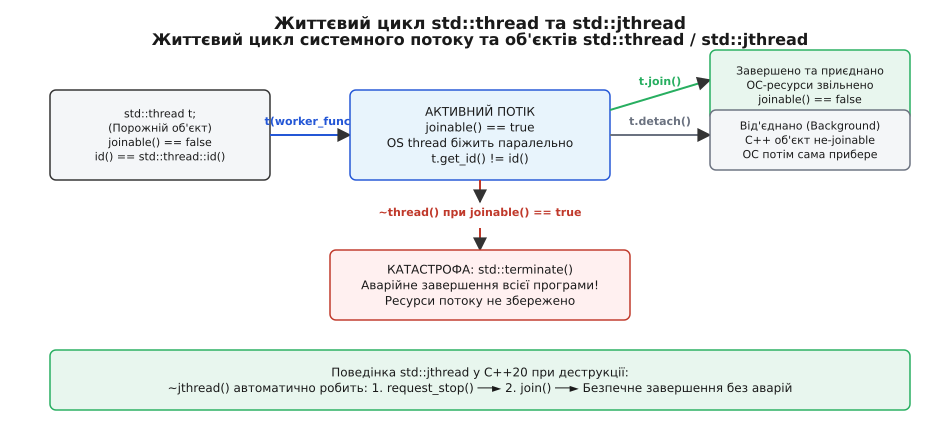
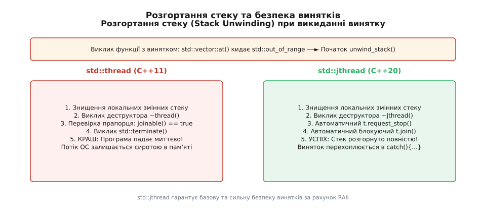
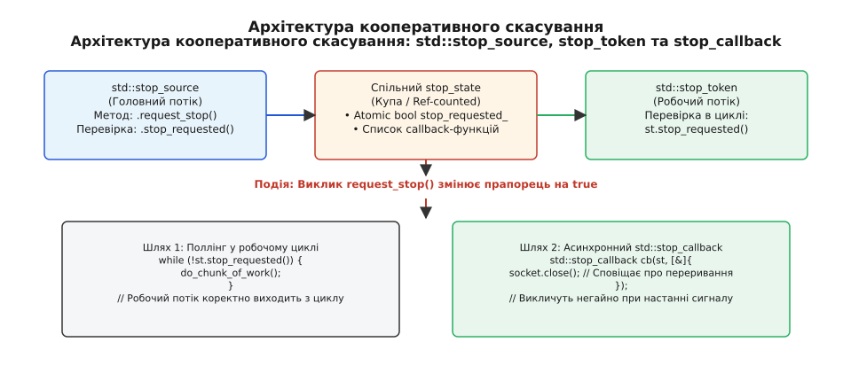

# Управління потоками виконання: std::thread та std::jthread

<preknowlist>
- [Основи ОС: модель процесів та потоків](root:sys-unix/process-model) — відмінність між простором адрес процесу та стеком виконання потоку.
- [М’ютекс і RAII-замки](root:sys-plang-cpp/mutex-and-raii-locks) — базові механізми синхронізації та захисту даних.
- [Управління ресурсами RAII](root:sys-plang-cpp/rule-of-five-zero) — прив'язка часу життя системного ресурсу до керуючого об'єкта.
- [Семантика переміщення](root:sys-plang-cpp/move-semantics) — передача володіння неподільними ресурсами (`std::move`).
</preknowlist>

Запуск паралельного обчислення через створення системного потоку `std::thread t(worker_func);` у C++11 миттєво виділяє стек в операційній системі та починає виконання інструкцій CPU, але якщо об'єкт `t` досягає свого деструктора у стані `joinable()` без попереднього виклику `.join()` або `.detach()`, C++ runtime миттєво викликає `std::terminate()`. У багаторівневих програмах із багатьма гілками виконання та потенційними винятками забудькуватість розробника або виліт одного винятку під час розгортання стеку спричиняє непередбачуваний краш усієї виробничої системи.

Стандарт C++20 кардинально змінює парадигму управління потоками, вводячи клас `std::jthread` (Joining Thread) та механізм кооперативного скасування на основі `std::stop_token`. Новий клас автоматично надсилає сигнал зупинки та виконує приєднання у своєму деструкторі, перетворюючи потік виконання на надійний RAII-ресурс.

Про історичний шлях від низькорівневих викликів POSIX `pthreads` до стандарта C++20 детальніше написано ув вставці ([історія еволюції потоків](root:sys-plang-cpp/std-thread-jthread/hist-thread-evolution.md)).

---

## 1. Анатомія системного потоку виконання та витоки std::thread

Потік виконання (thread of execution) на рівні операційної системи є найменшою одиницею планування процесорного часу. На відміну від процесу, який володіє власною ізольованою віртуальною пам'яттю, таблицею дескрипторів файлів та сегментами коду, усі потоки в межах одного процесу ділять спільний адресний простір, купу (`heap`), глобальні змінні та системні ресурси. Проте кожен потік має власні приватні ресурси:

- **Власний стек виконання (Thread Stack)**: За замовчуванням розміром від 1 МБ до 8 МБ (налаштовується при створенні), де зберігаються локальні змінні, фрейми виклику функцій та адреси повернення.
- **Набір регістрів CPU**: Регістр вказівника інструкцій (`RIP`/`EIP`), вказівник стеку (`RSP`/`ESP`) та регістри загального призначення, які зберігають контекст потоку під час переключення контексту (context switch).
- **Локальну пам'ять потоку (Thread-Local Storage — TLS)**: Змінні, оголошені з специфікатором `thread_local`, які виділяються для кожного потоку окремо.

### Низькорівневе виділення ресурсу ОС під час створення потоку

Коли операційна система створює новий потік виконання, вона виконує важкі системні виклики на рівні ядра. У Linux за це відповідає системний виклик `clone()` із прапорцями `CLONE_VM | CLONE_FS | CLONE_FILES | CLONE_SIGHAND | CLONE_THREAD`, які вказують ядру розділити адресний простір та таблиці дескрипторів файлів із батьківським процесом. У середовищі Windows визивається функція ядра `NtCreateThreadEx()` або Win32 API `CreateThread()`.

Створення кожного системного потоку тягне за собою наступні накладні витрати:
1. **Виділення сторінок пам'яті під стек**: Ядро виділяє віртуальний адресний простір (наприклад, 8 МБ під Linux x86-64) та захисну сторінку (guard page) у кінці стеку для перехоплення переповнення стеку (stack overflow).
2. **Ініціалізація векторів переривань та сигналів**: Налаштування структур керування NPTL (Native POSIX Thread Library) та блоку TEB (Thread Environment Block у Windows).
3. **Реєстрація у планувальнику задач ОС**: Планувальник ядра (наприклад, CFS у Linux) додає новий потік до черги виконання (runqueue).

### Накладні витрати переключення контексту (Context Switching)

Переключення контексту між потоками одного процесу є значно дешевшим, ніж між різними процесами, оскільки не вимагає зміни таблиці сторінок віртуальної пам'яті (`CR3` регістр на x86) та повного скидання кешу асоціативної трансляції адреси (TLB). 

Однак переключення потоків усе одно вимагає:
- Збереження та відновлення усіх регістрів CPU у пам'яті.
- Виходу з режиму користувача (user mode) у режим ядра (kernel mode) і повернення назад.
- Потенційного інвалідування кешів процесора L1/L2 через вимивання даних гарячого стеку іншим потоком.

Саме тому створення занадто великої кількості потоків (наприклад, тисяч потоків на 8-ядерній системі) призводить до явища **thrashing**: процесор витрачає більше часу на переключення контексту між потоками, ніж на виконання корисної обчислювальної роботи.

### Взаємодія між об'єктом C++ та системним потоком ОС

Клас `std::thread` у бібліотеці C++11 виступає тонкою RAII-обгорткою над системним дескриптором потоку (у POSIX це тип `pthread_t`, у Windows — `HANDLE`). 

При конструюванні об'єкта `std::thread t(worker)` відбуваються три послідовні дії:
1. **Виділення пам'яті під внутрішній буфер**: C++ runtime створює у купі керуючу структуру, куди копіює/переміщує передану функцію та її аргументи.
2. **Системний виклик створення потоку**: C++ runtime викликає платформний виклик `pthread_create()` (POSIX) або `_beginthreadex()` (Windows).
3. **Реєстрація ідентифікатора**: Новий потік ОС починає виконання зі службової процедури-трампліна (trampoline function), яка розпаковує аргументи з буфера та викликає користувацьку функцію.

Низькорівневе створення потоків у C та його ідіоматичний еквівалент у C++ можна порівняти у наведеному прикладі:

:::tabs
```c
#include <pthread.h>
#include <stdio.h>
#include <stdlib.h>

void* worker_routine(void* arg) {
    int id = *(int*)arg;
    free(arg);
    printf("C worker thread %d is running\n", id);
    return NULL;
}

int launch_c_thread(int thread_id) {
    pthread_t thread_handle;
    int* arg = malloc(sizeof(int));
    if (!arg) return -1;
    *arg = thread_id;

    if (pthread_create(&thread_handle, NULL, worker_routine, arg) != 0) {
        free(arg);
        return -1;
    }

    // Блокуюче чекання завершення в стилі C
    pthread_join(thread_handle, NULL);
    return 0;
}
```
```cpp
#include <thread>
#include <iostream>
#include <memory>

void worker_routine(int id) {
    std::cout << "C++ worker thread " << id << " is running\n";
}

void launch_cpp_thread(int thread_id) {
    // Ідіоматичний C++11 запуск та приєднання
    std::thread t(worker_routine, thread_id);
    t.join(); // RAII та блокуюче приєднання
}
```
:::

---

## 2. Життєвий цикл std::thread: стани joinable, join та detach

Об'єкт `std::thread` протягом свого існування може перебувати в одному з двох фундаментальних станів: **joinable** (приєднуваний) або **non-joinable** (неприєднуваний).


*Життєвий цикл системного потоку та об'єктів std::thread і std::jthread: переходи між станами joinable, join, detach та небезпека викликання std::terminate.*

### Стан joinable()

Об'єкт `std::thread` є **joinable** (`t.joinable() == true`), якщо він зв'язаний з дійсним потоком виконання ОС. Це означає, що системний потік вже запущено або він біжить прямо зараз, або він вже завершив свою функцію, але його ресурси на рівні ОС ще не очищені, бо батьківський потік не викликав `.join()`.

Об'єкт стає **non-joinable** (`t.joinable() == false`) у наступних чотирьох випадках:
1. Після створення через default-конструктор `std::thread t;`.
2. Після переміщення з об'єкта `std::thread t2 = std::move(t1);` (об'єкт `t1` стає non-joinable).
3. Після завершення виклику `t.join()`.
4. Після завершення виклику `t.detach()`.

### Фізика операції .join() та бар'єри пам'яті

Виклик `t.join()` виконує блокуюче синхронізоване очікування. Викликаючий потік (наприклад, `main`) призупиняє своє виконання до тих пір, поки потік `t` повністю не вийде зі своєї головної функції.

З точки зору низькорівневої синхронізації пам'яті, операція `.join()` створює відношення **happens-before**: усі модифікації пам'яті, зроблені потоком `t` до його завершення, гарантовано стають видимими викликаючому потоку після виходу з `t.join()`. На апаратному рівні це реалізується викликом інструкцій бар'єру пам'яті (memory barrier / fence) та системного виклику `futex` у Linux чи `WaitForSingleObject` у Windows.

Після успішного завершення `join()` дескриптор системного потоку повертається операційній системі, а об'єкт `std::thread` переходить у стан `joinable() == false`. Спроба повторно викликати `join()` на не-joinable потоці призводить до викидання винятку `std::system_error` з кодом `invalid_argument`.

### Фізика операції .detach() та її приховані загрози

Операція `t.detach()` розриває зв'язок між C++ об'єктом `std::thread` та внутрішнім потоком ОС. Після виклику `.detach()` об'єкт `t` негайно стає non-joinable, а потік ОС продовжує бігти у фоновому режимі (daemon thread). Операційна система приймає на себе обов'язок звільнити стек потоку після його природного завершення.

> ⚠️ **Критична загроза виклику detach():**
Якщо фоновий від'єднаний потік звертається до об'єктів за посиланням або вказівником, які розміщені на стеку батьківського потоку (або локальних об'єктів функції `main`), виникає катастрофічна помилка використання пам'яті після звільнення (Use-After-Free). Коли батьківська функція завершується, стек руйнується, а від'єднаний потік продовжує читати й писати у сміттєву пам'яті.

```cpp
void start_background_logging() {
    int local_buffer_size = 1024;
    std::string log_file = "app.log";

    std::thread t([&local_buffer_size, &log_file]() {
        // Затримка виконання
        std::this_thread::sleep_for(std::chrono::milliseconds(100));
        // КАТАСТРОФА! local_buffer_size та log_file вже знищені на стеку!
        std::cout << "Logging to " << log_file << " buffer: " << local_buffer_size << "\n";
    });

    t.detach(); // Потік від'єднано, функція повертає управління негайно
} // Стек функції start_background_logging знищується! UB у фоновому потоці!
```

---

## 3. Передача аргументів та семантика згортання типів у std::thread

При конструюванні `std::thread(func, arg1, arg2...)` аргументи передаються не безпосередньо у функцію `func`, а проходять через стадію **decay-copying** (згортання типів).

### Механізм decay-copying

Конструктор `std::thread` оцінює кожен аргумент за допомогою `std::decay_t<T>`:
- Масиви та функції перетворюються на вказівники.
- Константність (`const`) та специфікатори посилань (`&`, `&&`) знімаються.
- Аргументи копіюються або переміщуються у внутрішній буфер потоку.

Це означає, що за замовчуванням передача аргументу за посиланням у функцію потоку не працює без явного використання `std::ref()` або `std::cref()`:

```cpp
void update_data(int& value) {
    value = 100;
}

void incorrect_thread_argument() {
    int x = 10;
    // ПОМИЛКА КОМПІЛЯЦІЇ! std::thread копіює x у rvalue, яке не може прив'язатися до int&
    // std::thread t(update_data, x); 

    // ПРАВИЛЬНО: Використання std::ref створює std::reference_wrapper<int>
    std::thread t(update_data, std::ref(x));
    t.join();
    // x тепер дорівнює 100
}
```

### Передача move-only типів (std::unique_ptr)

Оскільки аргументи переміщуються у внутрішній буфер потоку, `std::thread` ідеально підтримує передачу неподільних типів (move-only types), таких як `std::unique_ptr` або `std::packaged_task`:

```cpp
void process_resource(std::unique_ptr<int> data) {
    std::cout << "Processing value: " << *data << "\n";
}

void move_resource_to_thread() {
    auto ptr = std::make_unique<int>(42);
    // Передаємо володіння об'єктом у новий потік через std::move
    std::thread t(process_resource, std::move(ptr));
    t.join();
    // ptr тепер дорівнює nullptr
}
```

---

## 4. Проблема безпеки винятків (Exception Safety) у std::thread

Найбільшою архітектурною вадою `std::thread` у C++11 є поведінка його деструктора. Якщо об'єкт `std::thread` знищується у стані `joinable() == true`, його деструктор свідомо викликає `std::terminate()`, що призводить до негайного аварійного завершення всієї програми.

Логіка творців C++11 полягала у виборі з двох лих:
- Якщо деструктор робив би неявний `.detach()`, програма отримувала би важкодіагностовані витоки пам'яті та Use-After-Free у фонових потоках.
- Якщо деструктор робив би неявний `.join()`, програма отримувала би непередбачувані зависання (deadlocks) під час розгортання стеку.

Тому було обрано найжорсткіший варіант — миттєвий краш програми через `std::terminate()`.

### Як винятки руйнують програми на C++11

Уявімо стандартну функцію, яка створює потік для обробки файлу, а потім виконує додаткові операції на стеку:

```cpp
void process_file_data(const std::string& path) {
    std::thread worker(async_file_reader, path);

    // Допоміжна операція, яка раптово кидає виняток
    std::vector<int> vec;
    int data = vec.at(100); // Кидає std::out_of_range!

    worker.join(); // Цей рядок НІКОЛИ не буде досягнутий!
}
```

Під час виконання `vec.at(100)` виникає виняток. C++ runtime починає процедуру розгортання стеку (stack unwinding). Локальні змінні функції `process_file_data` знищуються у зворотному порядку. Коли черга доходить до об'єкта `worker`, викликається деструктор `~thread()`. Оскільки виклик `worker.join()` не відбувся через виняток, прапорець `worker.joinable()` залишається `true`. Деструктор бачить `joinable() == true` і викликає `std::terminate()`. 

Повна специфікація методів та сигнатур класів наведена у довіднику інтерфейсу ([довідник інтерфейсу](root:sys-plang-cpp/std-thread-jthread/api-thread-jthread.md)).

---

## 5. Революція C++20: std::jthread та авто-приєднання (Auto-joining)

Клас `std::jthread` (Joining Thread), введений у C++20, повністю вирішує проблему безпеки винятків та управління ресурсами потоку. 

`std::jthread` є сумісною обгорткою над `std::thread`, але має дві фундаментальні відмінності:
1. **RAII-деструктор із автоматичним приєднанням**: При знищенні об'єкта деструктор `~jthread()` не викликає `std::terminate()`. Замість цього він автоматично надсилає сигнал скасування та викликає `.join()`.
2. **Вбудоване джерело сигналів скасування (`std::stop_source`)**: Кожен об'єкт `std::jthread` усередині містить лічильник сигналів та автоматично передає токен скасування `std::stop_token` у виконувану функцію.


*Порівняння поведінки при розгортанні стеку (Stack Unwinding): std::thread викликає краш через std::terminate(), тоді як std::jthread автоматично надсилає request_stop(), викликає join() та забезпечує повну безпеку винятків.*

### Алгоритм роботи деструктора ~jthread()

Коли об'єкт `std::jthread` досягає кінця своєї області видимості або знищується під час розгортання стеку через виняток, його деструктор виконує наступну атомарну послідовність дій:

```cpp
// Псевдокод внутрішньої роботи деструктора ~jthread()
jthread::~jthread() noexcept {
    if (joinable()) {
        request_stop(); // 1. Атомарно надсилаємо сигнал зупинки
        join();         // 2. Блокуючи очікуємо завершення потоку
    }
}
```

Завдяки цьому код з винятком, який на C++11 призводив до аварійного завершення всієї програми, на C++20 з використанням `std::jthread` виконується абсолютно безпечно:

```cpp
void safe_process_file_data(const std::string& path) {
    // C++20: std::jthread гарантує авто-приєднання при вихід з функції
    std::jthread worker([path](std::stop_token st) {
        while (!st.stop_requested()) {
            // Виконання порції читання файлу
        }
    });

    std::vector<int> vec;
    int data = vec.at(100); // Кидає std::out_of_range!
    
    // Стек розгортається -> деструктор ~jthread() робить worker.request_stop() -> worker.join()
    // Потік зупиняється, програма НЕ падає, виняток безпечно перехоплюється вище!
}
```

---

## 6. Механізм кооперативного скасування: stop_token, stop_source та stop_callback

Примусове вбивство потоків у системних API (таке як `pthread_cancel()` у POSIX або `TerminateThread()` у Windows) вважається надзвичайно небезпечною практикою. Якщо потік вбивається примусово в довільний момент часу:
- Не викликаються деструктори локальних C++ об'єктів, які лежать на стеку потоку.
- М'ютекси, заблоковані цим потоком, залишаються у назавжди заблокованому стані (poisoned/deadlocked mutexes).
- Динамічна пам'ять та дескриптор файлів/сокетів витікають нарівні операційної системи.

Тому C++20 реалізує парадигму **кооперативного скасування (Cooperative Cancellation)**: один потік ввічливо виражає прохання про зупинку, а робочий потік періодично перевіряє це прохання та самостійно очищає свої ресурси й виходить з функції.


*Архітектура кооперативного скасування в C++20: взаємодія між std::stop_source, спільним станом stop_state, токеном std::stop_token та зворотними викликами std::stop_callback.*

### Внутрішня будова stop_state

Механізм скасування C++20 базується на неявному об'єкті `stop_state`, який виділяється у динамічній пам'яті та керується через атомарний лічильник посилань.

`stop_state` містить три основні компоненти:
1. **Атомарний бітмаск прапорців**: Зберігає біт `stop_requested` та лічильники активних об'єктів `stop_source` і `stop_token`.
2. **Атомарний список підписок (`stop_callback`)**: Двобічно зв'язаний lock-free список функцій-обробників, зареєстрованих об'єктами `std::stop_callback`.
3. **Ідентифікатор потоку виконання**: Записується в момент виклику `request_stop()`, щоб запобігти мертвим блокуванням (deadlocks), якщо callback намагається зареєструвати або видалити інший callback під час власного виконання.

### Оптимізація пам'яті: std::nostopstate_t

Якщо для об'єкта `std::stop_source` заздалегідь відомо, що сигнал зупинки не знадобиться, стандарт надає спеціальний конструктор з тегом `std::nostopstate`:

```cpp
// Конструювання порожнього джерела без виділення stop_state у купі
std::stop_source empty_source(std::nostopstate);
// empty_source.stop_possible() == false, 0 байтів динамічного виділення!
```

---

## 7. Робота з призупиненням потоків та локальною пам'яттю: thread_local та std::this_thread

Окрім створення класів-управлінців потоками, стандарт C++ надає інструменти управління локальним станом виконання усередині самого потоку.

### Специфікатор thread_local

Ключове слово `thread_local` оголошує змінні з тривалістю життя потоку (thread duration). Кожен потік володіє власною копією цієї змінної:

```cpp
thread_local int thread_specific_counter = 0;

void increment_counter() {
    thread_specific_counter++;
    std::cout << "Thread " << std::this_thread::get_id() 
              << " counter: " << thread_specific_counter << "\n";
}
```

Змінні `thread_local` ініціалізуються при першому зверненні у даному потоці та знищуються при завершенні функції потоку. 

> ⚠️ **Пастка з thread_local та detach():**
Якщо потік був від'єднаний через `.detach()`, знищення об'єктів `thread_local` під час виходу з `main()` може призвести до race condition з глобальним деструктором CRT (C Runtime), що викликає випадкові сегфолти при закритті програми.

### Простір імен std::this_thread

Простір імен `std::this_thread` надає чотири вільні функції для управління потоком, у якому безпосередньо виконується виклик:

1. **`std::this_thread::get_id()`**: Повертає унікальний ідентифікатор поточного потоку.
2. **`std::this_thread::yield()`**: Підказує планувальнику ОС добровільно віддати решту кванту часу CPU іншим потокам з таким самим пріоритетом.
3. **`std::this_thread::sleep_for(duration)`**: Призупиняє виконання поточного потоку на задану тривалість.
4. **`std::this_thread::sleep_until(time_point)`**: Призупиняє виконання потоку до конкретного моменту часу.

---

## 8. Керування пріоритетом та приналежністю CPU (Native Handles)

У багатьох високопродуктивних та реального часу (real-time) системах виникає потреба вийти за межі стандартного API `std::thread` і скористатися специфічними викликами ОС. Для цього класи `std::thread` та `std::jthread` надають метод `.native_handle()`.

### Налаштування афінності ядра (CPU Affinity) під Linux

За допомогою `native_handle()` можна прив'язати потік до конкретного фізичного ядра процесора, усуваючи міграцію потоку між ядрами та зберігаючи гарячі дані у кеші L1/L2:

```cpp
#include <thread>
#include <pthread.h>
#include <sched.h>

void bind_thread_to_core(std::jthread& th, int core_id) {
    cpu_set_t cpuset;
    CPU_ZERO(&cpuset);
    CPU_SET(core_id, &cpuset);

    pthread_t handle = th.native_handle();
    int rc = pthread_setaffinity_np(handle, sizeof(cpu_set_t), &cpuset);
    if (rc != 0) {
        std::cerr << "Помилка встановлення CPU affinity\n";
    }
}
```

### Налаштування пріоритету реального часу

У POSIX системах метод `native_handle()` дозволяє встановити політику планування реального часу `SCHED_FIFO` або `SCHED_RR`:

```cpp
void set_realtime_priority(std::jthread& th, int priority) {
    sched_param sch_params;
    sch_params.sched_priority = priority;
    
    pthread_t handle = th.native_handle();
    pthread_setschedparam(handle, SCHED_FIFO, &sch_params);
}
```

---

## 9. Пряме управління потоками проти задачної паралельності (std::async)

У практичній розробці на C++ виникає вибір між використанням низькорівневих об'єктів потоків (`std::thread`/`std::jthread`) та високорівневою задачною паралельністю (`std::async`, `std::future`).

### Коли використовувати std::jthread

Об'єкти `std::jthread` призначені для **довготривалих компонентів системи (long-running workers)**, які мають чіткий життєвий цикл та постійно виконують обробку:
- Робочі потоки у пулах потоків (Thread Pools).
- Мережеві демони та фонові слухачі сокетів.
- Сервіси періодичного логування та моніторингу.
- Модулі конвеєрної обробки даних (Data Pipelines).

### Коли використовувати std::async

Функція `std::async` призначена для **одноразових обчислювальних задач (short-lived async tasks)**, від яких потрібно просто отримати обчислений результат або виняток через `std::future`:

```cpp
#include <future>
#include <iostream>

int calculate_heavy_sum(int a, int b) {
    return a + b;
}

void run_async_task() {
    // Автоматичне асинхронне виконання у фоновому потоці
    std::future<int> fut = std::async(std::launch::async, calculate_heavy_sum, 10, 20);
    
    // Блокуюче отримання результату
    int result = fut.get();
    std::cout << "Async result: " << result << "\n";
}
```

> ⚠️ **Небезпечна пастка std::async:**
Якщо результат виклику `std::async(std::launch::async, ...)` не зберігається у локальну змінну `std::future`, тимчасовий об'єкт `std::future` знищується наприкінці цього ж рядка. Деструктор `std::future` для асинхронних задач виконує **блокуючий join**! В результаті операція виконується послідовно замість паралельного виклику.

---

## 10. Передача винятків між потоками виконання

Оскільки кожен потік має власну систему обробки винятків, виняток, який вилітає з робочого потоку і не перехоплюється усередині його тіла, за умовчанням викликає `std::terminate()`. Для передачі винятку з робочого потоку в головний потік стандарт C++11 надає механізм `std::exception_ptr`.

### Паттерн безпечного захоплення та повторного викидання винятку

Приклад реалізації передачі винятку між потоками:

```cpp
#include <iostream>
#include <thread>
#include <exception>
#include <stdexcept>

void worker_function(std::exception_ptr& err_out) {
    try {
        // Імітація обчислювальної помилки
        throw std::invalid_argument("Некоректний параметр у робочому потоці");
    } catch (...) {
        // Захоплюємо поточний виняток у потокобезпечний вказівник
        err_out = std::current_exception();
    }
}

void run_thread_with_exception_handling() {
    std::exception_ptr thread_error = nullptr;

    std::jthread t([&thread_error]() {
        worker_function(thread_error);
    });

    t.join(); // Очікуємо завершення потоку

    // Перевіряємо, чи був виняток у робочому потоці
    if (thread_error) {
        std::cout << "Перехоплено виняток з робочого потоку у головному потоці!\n";
        // Повторно викидаємо збережений виняток у контексті головного потоку
        std::rethrow_exception(thread_error);
    }
}
```

Повний практичний приклад побудови багатопотокового конвеєра обробки даних із кооперативним скасуванням та передачею винятків можна вивчити у вставці ([практичний проєкт конвеєра](root:sys-plang-cpp/std-thread-jthread/proj-jthread-pipeline.md)).

---

## 11. Порівняльний аналіз: std::thread vs std::jthread

Для прийняття обґрунтованого технічного рішення при виборі інструменту багатопотоковості в C++ проєктах нижче наведено порівняльний зріз їхніх характеристик.

### Порівняльна таблиця характеристик

| Критерій | std::thread (C++11) | std::jthread (C++20) |
| :--- | :--- | :--- |
| **Гарантія деструктора** | Викликає `std::terminate()`, якщо `joinable() == true` | Викликає `request_stop()` та `join()` (RAII) |
| **Кооперативне скасування** | Відсутнє у стандартному API | Вбудоване через `std::stop_token` |
| **Розмір об'єкта в пам'яті** | 8 байтів (вказівник на дескриптор OS thread) | 16 байтів (`std::thread` + `std::stop_source`) |
| **Накладні витрати пам'яті** | Відсутні додаткові виділення | Динамічне виділення під `stop_state` (ref-counted) |
| **Сумісність сигнатур** | Передає тільки користувацькі аргументи | Автоматично передає `stop_token` першим аргументом |
| **Безпека винятків** | Низька (вимагає ручних `try-catch` та обгорток) | Висока (повністю сумісний з RAII та stack unwinding) |

### Рекомендації з вибору

- **Використовуйте `std::jthread` за замовчуванням у всіх нових проєктах C++20+**. Він усуває 99% людських помилок, пов'язаних з забутими викликами `.join()` та аварійними завершеннями програми через винятки.
- **Використовуйте `std::thread` лише у двох обмежених випадках**:
  1. Коли код розробляється під старіші стандарти (C++11 / C++14 / C++17).
  2. У жорстких системних середовищах із критичними обмеженнями на пам'ять, де 8 додаткових байтів на об'єкт потоку та динамічне виділення під `stop_state` є недопустимими накладними витратами.
