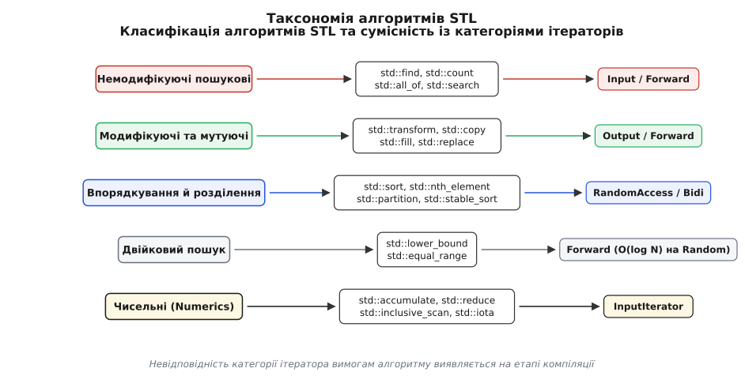
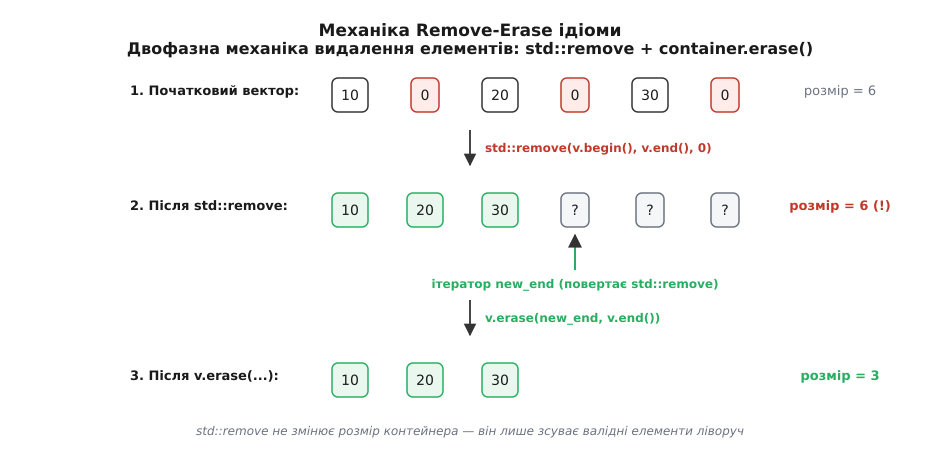
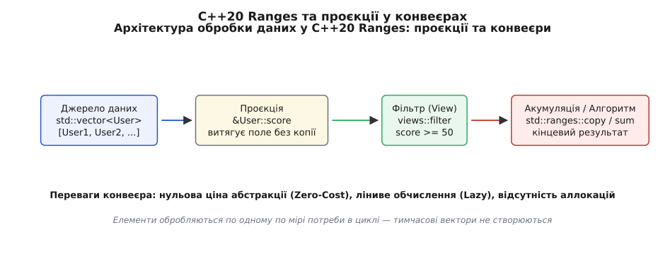

# Алгоритми STL замість ручних циклів

<preknowlist>
- [Ітератори: категорії й модель обходу](root:sys-plang-cpp/iterators-model) — концепція ітераторів як мосту між контейнерами та алгоритмами, вимоги до категорій (Input, Forward, RandomAccess).
- [Лямбда-вирази та замикання](root:sys-plang-cpp/lambdas-and-captures) — предикати, компаратори та лямбди для налаштування поведінки алгоритмів.
- [Семантика переміщення і rvalue-посилання](root:sys-plang-cpp/move-semantics) — як std::move і std::move_iterator уможливлюють безкопіювальне переміщення елементів в алгоритмах.
- [Контейнери STL: вибір під задачу і ціна операцій](root:sys-plang-cpp/stl-containers-choice) — послідовні та асоціативні контейнери, їхній уклад у пам'яті й сумісність з ітераторами.
- [Асимптотична складність](root:computability/asymptotic-complexity) — нотація O(N), O(N log N) і гарантії виконання алгоритмів у C++ стандарті.
</preknowlist>

Код системного модуля обробки мережевих пакетів містив типовий цикл перевірки та фільтрації даних:

```cpp
for (size_t i = 0; i < packets.size(); ++i) {
    if (!packets[i].is_valid()) {
        packets.erase(packets.begin() + i);
        --i;
    }
}
```

Зовні цей фрагмент здається простим і зрозумілим, але всередині приховано критичний дефект швидкодії. Кожен виклик `packets.erase()` для вектора вимагає фізичного зсуву всіх наступних елементів ліворуч у суцільному блоці пам'яті. Якщо в масиві з 100 000 пакетів половина виявиться невалідними, цей цикл змусить процесор виконувати мільярди операцій копіювання та зсуву байтів. Замість очікуваного лінійного часу обробки `O(N)` ми отримуємо квадратну складність `O(N²)`. На високонавантаженому мережевому інтерфейсі 10 GbE це означає миттєве вичерпання процесорного часу та падіння пакетів.

Спроба виправити проблему через ручний перебір ітераторами часто призводить до іншої категорії помилок — інвалідації ітераторів та помилок на одиницю (off-by-one errors):

```cpp
for (auto it = packets.begin(); it != packets.end(); ) {
    if (!it->is_valid()) {
        it = packets.erase(it); // Повертає наступний ітератор, але легко забути підняти його у гілці else
    } else {
        ++it;
    }
}
```

Головна проблема ручного циклу полягає в тому, що він примусово змішує дві абсолютно різні концептуальні задачі: **механіку обходу пам'яті** (управління індексами, перевірку меж масиву, просування вказівників, обхід залишків) та **бізнес-логіку обробки** (перевірку предиката валидності чи трансформацію значення). При читанні такого коду розробник мусить подумки моделювати стан індексів на кожній ітерації, щоб переконатися у відсутності виходу за межі масиву.

Олександр Степанов під час проективання бібліотеки STL сформулював принцип ортогональності: алгоритм не повинен знати, у якому контейнері лежать дані, а контейнер не повинен реалізовувати власні версії пошуку чи сортування. Містком між ними виступають ітератори. Детальніше про математичне обґрунтування та еволюцію цього підходу написано у вставці [Історія появи алгоритмів STL: від концепції Степанова до Ranges C++20](root:sys-plang-cpp/stl-algorithms/hist-stl-birth.md).

Заміна ручного циклу стандартним алгоритмом усуває змішування відповідальностей:

```cpp
std::erase_if(packets, [](const auto& p) { return !p.is_valid(); });
```

Один рядок коду гарантує лінійну складність `O(N)`, виключає інвалідацію ітераторів, позбавляє від ручного відстеження індексів і чітко декларує намір програміста.

---

## Категорії алгоритмів і вимоги до ітераторів

Усі стандартні алгоритми C++ (заголовки `<algorithm>` та `<numeric>`) діляться на п'ять фундаментальних категорій за характером їхнього впливу на дані та вимогами до ітераторів.

```
       ┌────────────────────────────────────────────────────────┐
       │                  Алгоритми STL                         │
       └──────────────────────────┬─────────────────────────────┘
                                  │
      ┌───────────────────────────┼───────────────────────────┐
      ▼                           ▼                           ▼
┌──────────────┐          ┌──────────────┐          ┌──────────────┐
│ Немодифікуючі│          │  Модифікуючі │          │  Сортування  │
│ (InputIt)    │          │  (OutputIt)  │          │ (RandomAccess│
└──────────────┘          └──────────────┘          └──────────────┘
      │                           │                           │
      ▼                           ▼                           ▼
┌──────────────┐          ┌──────────────┐
│Двійк. пошук  │          │  Чисельні    │
│ (ForwardIt)  │          │ (InputIt)    │
└──────────────┘          └──────────────┘
```



*Категоризація алгоритмів STL та їхній зв'язок із вимогами до категорій ітераторів.*

### 1. Немодифікуючі пошукові алгоритми
Ці алгоритми читають дані, не змінюючи їхній вміст і порядок. Вони працюють із найпростішою категорією `InputIterator` (чи `ForwardIterator` для повторних проходів):
- `std::find`, `std::find_if`, `std::find_if_not`: пошук першого елемента, який задовольняє умову за час `O(N)`.
- `std::count`, `std::count_if`: підрахунок кількості входжень за лінійний час `O(N)`.
- `std::all_of`, `std::any_of`, `std::none_of`: перевірка логічних кванторів на діапазоні з коротким замиканням (зупинка при першому порушенні).

### 2. Модифікуючі та мутуючі алгоритми
Алгоритми цієї групи перезаписують значення або переставляють їх усередині діапазону. Вони вимагають `OutputIterator` або `ForwardIterator`:
- `std::transform`: застосування функції до кожного елемента з записом результату у вихідний діапазон.
- `std::copy`, `std::copy_if`, `std::move`: послідовне перенесення елементів між контейнерами.
- `std::fill`, `std::generate`, `std::replace`: заповнення або заміна значень.

### 3. Впорядкування, розділення та вибір елементів
Алгоритми сортування є найвимогливішими до категорій ітераторів. Для досягнення швидкої асимптотики більшість із них вимагає `RandomAccessIterator` (ітератори довільного доступу за `O(1)`):
- `std::sort`: впорядкування діапазону за алгоритмом Introsort (гібрид QuickSort, HeapSort та InsertionSort) за час `O(N log N)` у найгіршому випадку.
- `std::stable_sort`: збереження відносного порядку еквівалентних елементів.
- `std::partial_sort`: часткове сортування (впорядковуються лише перші `K` елементів) за час `O(N log K)`.
- `std::nth_element`: перестановка елементів так, що на позиції `N` опиняється `N`-й порядковий елемент (Quickselect за `O(N)` у середньому).
- `std::partition`: розділення елементів на дві групи за предикатом за час `O(N)` без повного сортування.

### 4. Двійковий пошук на впорядкованих діапазонах
Працюють лише на діапазонах, попередньо відсортованих за відповідним компаратором:
- `std::lower_bound`: пошук першого елемента, не меншого за задане значення (`>=`).
- `std::upper_bound`: пошук першого елемента, строго більшого за значення (`>`).
- `std::equal_range`: повертає пару ітераторів `[lower_bound, upper_bound)` за один похід.
- `std::binary_search`: повертає `bool` про наявність елемента.

Якщо алгоритмам двійкового пошуку передати `RandomAccessIterator` (наприклад, від `std::vector`), кількість порівнянь і кроків складає `O(log N)`. Якщо ж передати `ForwardIterator` (наприклад, від `std::list`), кількість порівнянь лишиться `O(log N)`, але кількість кроків по посиланнях зросте до `O(N)` через необхідність послідовного виклику `std::advance`. Компілятор автоматично обирає оптимальну стратегію через механізм Iterator Traits або C++20 Concepts.

### 5. Чисельні алгоритми (`<numeric>`)
Спеціалізований блок математичних алгоритмів для згортки та обчислення скалярних добутків:
- `std::accumulate` / `std::reduce`: обчислення суми або довільної бінарної згортки.
- `std::transform_reduce`: поєднання трансформації та згортки (аналог MapReduce).
- `std::inclusive_scan`, `std::exclusive_scan`: обчислення префіксних сум.

> 🔧 **Навіщо це.** Спроба виклику `std::sort(my_list.begin(), my_list.end())` для двузв'язного списку `std::list` спричинить помилку компіляції: `std::list` надає лише `BidirectionalIterator`, який не підтримує арифметику вказівників (`it + n`). Вимога до ітераторів — це чіткий контракт: якщо алгоритм не може виконатися із заявленою асимптотичною складністю, компілятор відмовляється збирати код, спонукаючи обрати або відповідний метод контейнера (`my_list.sort()`), або змінити тип контейнера.

---

## Ідіома Remove-Erase і пастка напіввідкритих інтервалів [first, last)

Найпоширенішою пасткою для програмістів-початківців у C++ є очікування, що алгоритм `std::remove` вилучить елементи з вектора й зменшить його розмір:

```cpp
std::vector<int> v = {10, 0, 20, 0, 30, 0};
std::remove(v.begin(), v.end(), 0); 
// Помилка мислення: v.size() все ще дорівнює 6!
```

Ця поведінка випливає з фундаментального обмеження архітектури STL: **алгоритми працюють виключно з ітераторами й не мають доступу до самих контейнерів**. Ітератор `InputIterator` чи `ForwardIterator` дає змогу читати й перезаписувати значення за адресою, але він не знає, як виділяється пам'ять, як викликається системний алокатор і як змінюються внутрішні поля `size_` чи `capacity_`.

### Двофазна механіка видалення

Алгоритм `std::remove` працює у дві фази:
1. **Зсув елементів (Phase 1)**: Алгоритм проходить по діапазону й перезаписує «небажані» елементи тими елементами з правої частини, які мають залишитися (використовуючи оператор присвоєння переміщенням `move assignment`).
2. **Повернення логічного кінця**: Алгоритм повертає ітератор `new_end`, який вказує на межу нових валідних даних.

Після виконання `std::remove` масив розділяється на дві частини:
- `[v.begin(), new_end)` — нові валідні дані (усі нулі видалено).
- `[new_end, v.end())` — так званий «залишковий хвіст» (moved-from елементи, стан яких є валідним, але невизначеним).



*Двофазна механіка std::remove + container.erase(): зсув елементів ліворуч із поверненням логічного кінця та подальше фізичне усічення контейнера.*

Щоб фізично вилучити залишковий хвіст і зменшити розмір вектора, необхідно викликати метод самого контейнера `.erase()`:

```cpp
// Класична Remove-Erase ідіома (C++98 - C++17)
auto new_end = std::remove(v.begin(), v.end(), 0);
v.erase(new_end, v.end()); // Тепер v.size() дорівнює 3
```

У C++20 комітет стандартизації ліквідував потребу писати цей двофазний шаблон вручну, додавши уніфіковані вільні функції `std::erase` та `std::erase_if` для всіх стандартних контейнерів:

```cpp
std::erase(v, 0); // Автоматично викликає remove і erase під капотом
std::erase_if(v, [](int x) { return x < 0; });
```

---

## Ефективність і гарантії компілятора: вкладеність, векторність та шаблони

Існує давній міф, що написаний вручну цикл на мові C або використання C-функції `qsort` є швидшими за алгоритми STL через відсутність «забудованих абстракцій C++». Профільування та аналіз згенерованого машинно коду вказують на протилежне.

### Чому std::sort швидший за C qsort

Сигнатура C-функції `qsort` приймає вказівник на функцію порівняння:

:::tabs
```c
void qsort(void *base, size_t nmemb, size_t size,
           int (*compar)(const void *, const void *));
```
```cpp
template <class RandomIt, class Compare>
void sort(RandomIt first, RandomIt last, Compare comp);
```
:::

Оскільки в C компаратор передається як вказівник на функцію `compar`, компілятор у 99% випадків не може виконати вкладення (inlining) його тіла всередину циклу сортування. На кожне з `O(N log N)` порівнянь процесор змушений:
1. Зберігати регістри й зберігати аргументи у стеку/регістрах відповідно до ABI.
2. Здійснювати непрямий перехід (indirect branch) за адресою компаратора.
3. Процесорний провісник переходів (branch predictor) страждає від частих промахів при зміні напрямків порівняння.

У мові C++ алгоритм `std::sort` є шаблоном. Коли у якість `Compare` передається лямбда-вираз або функтор (структурний об'єкт із `operator()`), тип компаратора стає унікальним типом компіляції. Компілятор оптимізує виклик `comp(a, b)` повністю вбудовуючи його інструкції безпосередньо у внутрішній цикл сортування. Непрямий виклик функції повністю зникає.

:::tabs
```c
#include <stdlib.h>

int cmp_int(const void* a, const void* b) {
    int arg1 = *(const int*)a;
    int arg2 = *(const int*)b;
    return (arg1 > arg2) - (arg1 < arg2);
}

void sort_c(int* arr, size_t n) {
    // Кожне порівняння викликає cmp_int через вказівник на функцію
    qsort(arr, n, sizeof(int), cmp_int);
}
```
```cpp
#include <vector>
#include <algorithm>

void sort_cpp(std::vector<int>& v) {
    // Лямбда інлайниться компілятором повністю у машинні інструкції CMP/JMP
    std::sort(v.begin(), v.end(), [](int a, int b) {
        return a < b;
    });
}
```
:::

### Автоматична векторизація (SIMD)

Сучасні компілятори (GCC, Clang, MSVC) володіють потужними аналізаторами значень та проходів. Коли алгоритми `std::transform`, `std::copy` або `std::reduce` застосовуються до суцільних масивів у пам'яті (`std::vector`, `std::array`, `std::span`), компілятор розгортає цикл і генерує векторизовані інструкції AVX2 / AVX-512 або ARM NEON.

Наприклад, `std::transform`, який множить кожен елемент вектора дійсних чисел `float` на коефіцієнт, компілятор перетворює на завантаження 8 або 16 значень одночасно в SIMD-регістри `ymm`/`zmm` та виконання однієї інструкції `vfmadd`:

```cpp
std::transform(src.begin(), src.end(), dst.begin(), [scale](float x) {
    return x * scale;
});
```

У машинного коду цей виклик перетворюється на суперскалярну векторну обробку, яка в 4–8 разів перевищує за швидкістю будь-який послідовний ручний цикл `for`.

---

## Внутрішня механіка Introsort та гарантії безпеки щодо винятків

Реалізація `std::sort` у сучасних стандартних бібліотеках C++ (libstdc++, libc++, MSVC STL) є трирівневим гібридним алгоритмом Introsort (Introductory Sort), розробленим Девідом Муссером (David Musser) у 1997 році.

### 1. Трифазна структура Introsort
- **Фаза QuickSort**: Сотування розпочинається із класичного алгоритму Шаара (QuickSort) з вибором медіани трьох елементів як опорного елемента (pivot). Це забезпечує максимальну локальність кешу L1/L2 та мінімальну кількість переміщень елементів у середньому випадку.
- **Фаза перемикання на HeapSort**: QuickSort вразливий до невдалих виборів опорних елементів на спеціально згенерованих незбалансованих масивах, що може призвести до рекурсивного розпаду швидкодії до `O(N²)`. Щоб запобігти цьому, `std::sort` підтримує лічильник глибини рекурсії, обмежений величиною `2 · log2(N)`. Якщо глибина викликів досягає цієї межі, алгоритм перериває рекурсію QuickSort та гарантовано перемикається на HeapSort (пірамідальне сортування), яке завершує обробку даного підмасиву за час `O(N log N)`.
- **Фаза InsertionSort на малих масивах**: Коли розмір підмасиву у ході рекурсивного поділу стає меншим за порогове значення (зазвичай 16 елементів), `std::sort` припиняє подальший поділ. Після завершення головного циклу Introsort запускається один підсумковий прохід InsertionSort (сотування вставкою) по всьому майже відсортованому масиву. Оскільки масив вже впорядкований локально, InsertionSort виконується за лінійний час `O(N)` і з високою щільністю завантаження кеш-ліній процесора.

### 2. Гарантії безпеки щодо винятків (Exception Safety)
Стандарт C++ накладає суворі вимоги до поведінки алгоритмів при виникненні винятків у конструкторах переміщення чи компараторах користувача:
- **Базова гарантія (Basic Guarantee)**: Більшість мутуючих алгоритмів (`std::sort`, `std::transform`, `std::partition`) гарантують, що при викиданні винятку з компаратора або оператора переміщення контейнер не розпадається і не виникає витоків пам'яті. Проте елементи в масиві можуть залишитися в невпорядкованому або частково переставленому стані.
- **Строга гарантія (Strong Guarantee)**: Алгоритм `std::stable_sort` надає строгу гарантію безпеки: якщо під час сортування кидається виняток і доступно достатньо додаткової пам'яті, масив відновлює свій початковий стан без змін.

---

## Compile-Time алгоритми у C++20 (constexpr algorithms)

До виходу стандарту C++20 більшість алгоритмів STL не могла використовуватися на етапі компіляції, оскільки вони вимагали виконання дій на етапі виконання. У C++20 стандарт зробив понад 80% алгоритмів заголовку `<algorithm>` позначеними спесифікатором `constexpr`.

Це дозволяє будувати відсортовані довідники, шукати елементи та генерувати таблиці безпосередньо під час компіляції:

```cpp
#include <array>
#include <algorithm>

constexpr auto generate_sorted_table() {
    std::array<int, 6> arr = {5, 2, 8, 1, 9, 3};
    std::sort(arr.begin(), arr.end());
    return arr;
}

// Таблиця обчислюється і сортується повністю на етапі компіляції!
constexpr auto sorted_data = generate_sorted_table();
static_assert(sorted_data[0] == 1);
static_assert(sorted_data[5] == 9);
```

Можливість виконання `std::sort`, `std::find`, `std::transform` у контексті `constexpr` суттєво спрощує створення статичних хеш-таблиць та відсортованих індексів, що зменшує час старту системних програм до нуля.

---

## C++20 Ranges та проєкції: від пар ітераторів до пайплайнів

Стандарт C++20 приніс найбільше оновлення алгоритмічної бази з часів створення STL — концепцію **Ranges** (діапазонів) та проєкцій.

### Проблема класичних пар ітераторів

У C++98–C++17 будь-який виклик алгоритму вимагав дублювання імені контейнера:

```cpp
std::sort(people.begin(), people.end());
```

Це призводило до помилок одруку, коли розробник передавав `people.begin()` від одного вектора, а `other.end()` — від іншого, що викликало невизначену поведінку (Undefined Behavior). Крім того, якщо треба було посортувати масив структур за одним із полів (наприклад `person.age`), доводилося писати громіздкі лямбди:

```cpp
std::sort(people.begin(), people.end(), [](const Person& a, const Person& b) {
    return a.age < b.age;
});
```

### Проєкції (Projections) у C++20 Ranges

Алгоритми з простору імен `std::ranges` припускають передачу самого контейнера та приймають додатковий параметр — **проєкцію**:

```cpp
std::ranges::sort(people, std::less{}, &Person::age);
```

Проєкція `&Person::age` — це функція або вказівник на член класу, яка автоматично застосовується до кожного елемента перед його передачею в компаратор. Це усуває потребу в написанні кодогенераторних лямбд і робить код самодокументованим.

### Конвеєри обробки (Range Pipeline & Views)

Головною перевагою Ranges є можливість будувати ліниві (lazy) конвеєри обробки даних за допомогою оператора пайплайну `|` без виділення тимчасової пам'яті:

```cpp
#include <ranges>
#include <iostream>
#include <vector>

struct User {
    std::string name;
    int         score;
    bool        active;
};

void process_users(const std::vector<User>& users) {
    // Будуємо лінивий конвеєр: фільтрація активних -> проєкція score -> вибірка перших 3
    auto view = users 
              | std::views::filter(&User::active)
              | std::views::transform(&User::score)
              | std::views::take(3);

    for (int score : view) {
        std::cout << "Top score: " << score << "\n";
    }
}
```



*Компоновка конвеєра обробки даних у C++20 Ranges: проєкція атрибутів об'єкта, ліниве фільтрування та паралельне виконання.*

У цьому прикладі не створюється жодного тимчасового вектора! Елементи обробляються по одному "по мірі потреби" під час обходу у циклі `for`. Це забезпечує нульову ціну абстракції (Zero-Cost Abstraction) та відсутність динамічних аллокацій пам'яті.

### Паралельне виконання (C++17 Execution Policies)

Для задач обробки великих масивів даних (Big Data) заголовок `<execution>` дає змогу розпаралелити виконання стандартних алгоритмів між ядрами процесора без виклику низькорівневих `std::thread` чи OpenMP:

```cpp
#include <algorithm>
#include <execution>

std::vector<double> data(10'000'000);

// Послідовне сортування
std::sort(std::execution::seq, data.begin(), data.end());

// Паралельне багатопоточне сортування
std::sort(std::execution::par, data.begin(), data.end());

// Паралельне та векторизоване (SIMD) сортування
std::sort(std::execution::par_unseq, data.begin(), data.end());
```

---

## Практичні рекомендації та вибір алгоритму

Щоб правильно обрати алгоритм під конкретну практичну задачу, скористайтеся цим орієнтовним деревом рішень:

1. **Тобі потрібно знайти елемент?**
   - У неупорядкованому масиві ──► `std::find_if` (`O(N)`)
   - У відсортованому масиві ──► `std::lower_bound` або `std::binary_search` (`O(log N)`)
   - Найменший або найбільший елемент ──► `std::minmax_element` (`O(N)`)

2. **Тобі потрібно впорядкувати дані?**
   - Повне сортування всього масиву ──► `std::sort` (`O(N log N)`)
   - Зберегти порядок однакових елементів ──► `std::stable_sort` (`O(N log N)`)
   - Потрібно лише перші `K` найбільших/найменших елементів ──► `std::partial_sort` або `std::nth_element` (`O(N log K)` або `O(N)`)
   - Розділити масив на дві групи за умовою (наприклад, парні/непарні) ──► `std::partition` (`O(N)`) — не витрачайте ресурси на повне сортування!

3. **Тобі потрібно змінити або профільтрувати масив?**
   - Видалити елементи за умовою ──► `std::erase_if` (`O(N)`)
   - Застосувати формулу до кожного елемента ──► `std::transform` (`O(N)`)
   - Видалити послідовні дублікати ──► `std::unique` + `container.erase` (`O(N)`)

Повний систематизований перелік сигнатур та параметрів складності алгоритмів наведено у вставці [Довідник алгоритмів STL: класифікація, сигнатури та складність](root:sys-plang-cpp/stl-algorithms/api-algorithms-toolbox.md).

Практичну порівняльну лабораторну роботу з обробки мільйонів кадрів телеметрії через C-стиль, класичний STL та C++20 Ranges показано у вставці [Лабораторія алгоритмів: побудова високоефективного конвеєра обробки даних](root:sys-plang-cpp/stl-algorithms/proj-custom-iterator-algo.md).

Використання алгоритмів STL замість ручних циклів робить системний код C++ виразним, гарантує безпеку від інвалідації ітераторів та дає змогу компілятору генерувати максимально оптимальний векторизований машинний код.
