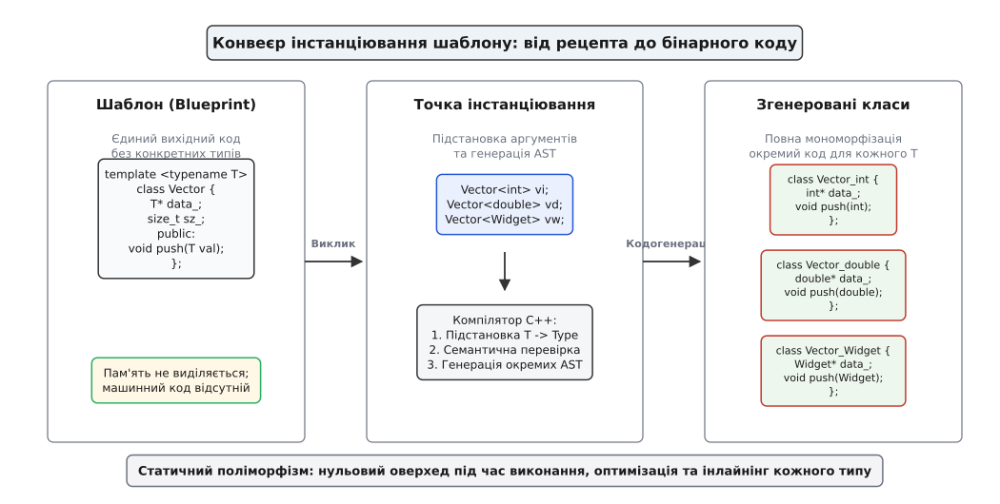
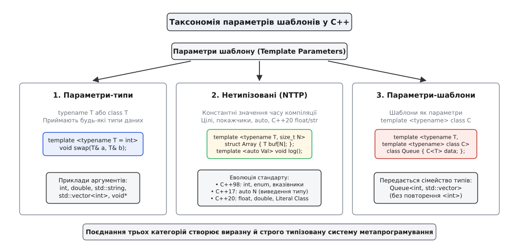
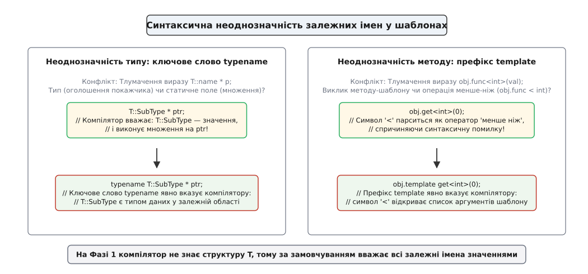

# Шаблони: параметризація типом

<preknowlist>
- [Одиниця трансляції та зв'язування: static, extern, inline](topic:sf-lang/translation-unit) — модель компіляції окремих файлів і видимість символів.
- [Розв'язання перевантажень: як обирається функція](topic:sys-plang-cpp/overload-resolution) — як компілятор вибирає найкращого кандидата серед функцій.
- [Двофазний пошук імен у шаблонах](topic:sys-plang-cpp/two-phase-name-lookup) — різниця між аналізом на етапі визначення та підстановкою в точці інстанціювання.
- [Виведення типів: auto й decltype](topic:sys-plang-cpp/auto-type-deduction) — як компілятор обчислює типи змінних і виразів.
</preknowlist>

Коли розробник створює алгоритм швидкого сортування або структуру динамічного стека для цілих чисел `int`, математична логіка операцій є універсальною: індексування, порівняння елементів, обмін сусідніх комірок пам'яті. Проте щойно у проєкті виникає потреба застосувати той самий алгоритм до чисел із рухомою комою `double`, рядків `std::string` чи користувацьких структур `Matrix`, статична типізація вимагає вирішення проблеми взаємодії типів.

У мовах без розвиненої системи узагальнень розробник опиняється перед трьома класичними глухими кутами:

1. **Ручне копіювання коду:** Створення окремих функцій `sort_int()`, `sort_double()`, `sort_matrix()`. Це призводить до вибухового дублювання сирцевого тексту: будь-яке виправлення алгоритмічної помилки або оптимізація доводиться синхронно повторювати в десятках ідентичних файлів, що неминуче породжує розсинхронізацію кодової бази.
2. **Стирання типів через нетипізовані покажчики `void*`:** Класичний підхід системного програмування в мові C (наприклад, стандартна функція `qsort`), де алгоритм оперує адресами сирої пам'яті та розміром елемента в байтах, викликаючи функцію-компаратор через непрямий покажчик. Цей шлях повністю руйнує строгу типобезпеку, унеможливлює вбудовування функцій (інлайнінг), змушує виділяти скалярні змінні на купі та створює неприйнятні накладні витрати через виклики функцій за покажчиками на кожній ітерації циклу.
3. **Препроцесорні макроси:** Спроба загорнути визначення функцій або класів у директиви `#define`. Макроси розгортаються на рівні лексичного препроцесора до початку синтаксичного аналізу, не підкоряються просторам імен, руйнують символьну інформацію зневаджувача та генерують заплутані багатосторінкові повідомлення про помилки під час найменшого синтаксичного збою.

Мова C++ розв'язує цю дилему за допомогою **шаблонів** (англ. *templates*). Шаблон — це не виконуваний машинний код і не об'єкт у пам'яті; це строго типізоване синтаксичне лекало (креслення), за яким компілятор на етапі трансляції автоматично синтезує оптимізовані екземпляри класів, функцій, змінних або псевдонімів під кожен конкретний набір типів-аргументів.

Детальний аналіз того, як створювалася ця парадигма та чому система шаблонів несподівано виявилася повноцінною Тьюрінг-повною мовою обчислень, викладено в [історії еволюції шаблонів](topic:sys-plang-cpp/templates-basics/hist-templates-evolution.md).

## Генеративне метапрограмування та мономорфізація

Парадигма узагальненого програмування в C++ спирається на процес, який у теорії компіляторів називається **мономорфізацією** (англ. *monomorphization*).

На відміну від мов із динамічним поліморфізмом або мов зі стиранням типів (Java, C#), де всі узагальнені класи під час виконання приводяться до спільного базового типу `Object` або загального інтерфейсу з єдиним скомпільованим бінарним кодом, компілятор C++ генерує **повністю незалежні класи та функції для кожної унікальної комбінації аргументів шаблону**.



*Конвеєр мономорфізації компілятора: шаблон як синтаксичний рецепт перетворюється на незалежні конкретні класи під час підстановки аргументів типів.*

Коли компілятор зустрічає у вихідному коді використання `Vector<int>` та `Vector<double>`, він виконує синтаксичну підстановку параметрів у внутрішнє представлення абстрактного синтаксичного дерева (AST). У результаті створюються два фізично різних класи з власними розкладками пам'яті, унікальними адресами функцій у таблиці символів та окремими машинними інструкціями.

### Внутрішні наслідки мономорфізації:
- **Нульовий оверхед під час виконання (Zero Runtime Overhead):** Відсутні таблиці віртуальних методів (`vtable`), відсутні непрямі виклики за покажчиками, відсутнє упаковування та розпаковування (boxing/unboxing) примітивних скалярних типів.
- **Агресивна оптимізація та інлайнінг:** Оскільки типи та розміри структур відомі компілятору під час компіляції, оптимізатор процесора повністю розкриває тіла функцій у місці виклику, поєднує константи, усуває мертвий код та генерує векторні SIMD-інструкції (AVX2, AVX-512, ARM NEON).
- **Індивідуальна розкладка пам'яті:** `Vector<int>` містить неперервний масив 4-байтних чисел безпосередньо у виділеній пам'яті, що забезпечує бездоганну кеш-локальність процесора без додаткових покажчиків.
- **Канонізація типів:** Компілятор гарантує, що типи `Vector<int>` та `Vector<signed int>` вказують на одну й ту саму сутність AST, оскільки їхні типи-аргументи є канонічно ідентичними в системі типів.

> 🔧 **Навіщо це.** У системному програмуванні, драйверах периферійних пристроїв, обробці графіки, цифровому аналізі сигналів та високочастотній торгівлі мономорфізація дозволяє будувати абстрактні високорівневі інтерфейси, які після оптимізації транслюються у бездоганний асемблерний код без жодної втрати тактових циклів процесора.

## Двійковий ABI та манглінг імен (Name Mangling)

Оскільки шаблон не є готовою функцією, під час інстанціювання компілятор зобов'язаний згенерувати для кожної інстанціації унікальне символьне ім'я у двійковій таблиці експорту об'єктного файлу (`.o` / `.obj`). Цей процес називається **манглінгом імен** (англ. *Name Mangling*).

Згідно зі стандартом Itanium C++ ABI (використовується в GCC, Clang на Linux, macOS, Android):
- Шаблонна функція `template <typename T> void sort_data(T* ptr)` для типу `int` отримує двійковий символ:
  `_Z9sort_dataIiEvPT_` (де `_Z` — префікс манглінгу C++, `9sort_data` — довжина та ім'я функції, `I` — початок списку аргументів шаблону, `i` — тип `int`, `E` — кінець списку, `v` — тип повернення `void`, `PT_` — покажчик на перший параметр шаблону).
- Для типу `double` та сама функція отримає символ:
  `_Z9sort_dataIdEvPT_` (де `d` позначає тип `double`).

У компіляторі MSVC (Windows) застосовується власний ABI-синтаксис декорування імен:
- Клас `Vector<int>` кодується як `??$Vector@H@@...`, де символ `$Vector@H` однозначно вказує на шаблон `Vector` з параметром `int` (позначка `H`).

Для розробника це означає, що дві різні інстанціації шаблону є абсолютно незалежними двійковими сутностями для статичного та динамічного компонувальника. Якщо під час зневадження ассемблерного дампу або аналізу аварійного завершення (Crash Dump) ви бачите довгі зашифровані символи, стандартні утиліти `c++filt` (в оточенні GCC/Clang) або `undname.exe` (в оточенні MSVC) дозволяють миттєво відновити вихідний вигляд шаблону з його типами-параметрами.

## Анатомія та види шаблонів

Стандарт мови C++ визначає чотири фундаментальні категорії шаблонів: шаблони функцій, шаблони класів і структур, шаблони змінних та шаблони псевдонімів.

### 1. Шаблони функцій (Function Templates)

Шаблон функції описує сімейство алгоритмів. Головною перевагою шаблонів функцій є **автоматичне виведення аргументів** (англ. *Template Argument Deduction*): компілятор аналізує типи переданих у виклик параметрів і самостійно обчислює значення `T` без необхідності явно вказувати `<int>` або `<double>`.

```cpp
template <typename T>
T find_max(T a, T b) {
    return (a < b) ? b : a;
}

void demo_functions() {
    auto x = find_max(10, 20);         // Неявне виведення: T = int
    auto y = find_max(3.14, 2.71);     // Неявне виведення: T = double
    
    // auto z = find_max(10, 3.14);    // Помилка! Неоднозначність: T = int чи double?
    auto z = find_max<double>(10, 3.14); // Явна передача: аргумент 10 неявно приводиться до double
}
```

Якщо типи аргументів конфліктують, автоматичне приведення типів блокується, захищаючи програміста від мовчазної втрати точності. Детальні правила того, як компілятор обирає найкраще перевантаження між звичайними функціями та шаблонами, описано в статті про [розв'язання перевантажень](topic:sys-plang-cpp/overload-resolution).

### 2. Прямі посилання та ідеальна передача (Forwarding References)

Особливою формою шаблонів функцій є конструкції з прямими посиланнями (англ. *Forwarding References* або *Universal References*):

```cpp
template <typename T>
void wrapper(T&& arg) {
    target_function(std::forward<T>(arg));
}
```

Коли параметр шаблону має форму `T&&`, де `T` є параметром типу самої функції, правила мови активують **механізм згортання посилань** (Reference Collapsing):
- Якщо у функцію передано lvalue-змінну типу `Widget&`, `T` виводиться як `Widget&`. Вираз `Widget& &&` згортається в `Widget&`.
- Якщо у функцію передано тимчасовий rvalue-об'єкт `Widget{}`, `T` виводиться як `Widget`. Вираз стає `Widget&&`.

Утиліта `std::forward<T>` використовує виведений тип `T`, щоб зберегти вихідну категорію значення (value category). Це фундаментальний механізм, на якому базуються фабричні функції `std::make_unique`, `std::make_shared` та методи розміщення `emplace_back` у стандартних контейнерах, що конструюють об'єкти за місцем без зайвих копіювань.

### 3. Виведення аргументів шаблонів класів (CTAD, C++17)

Історично до стандарту C++17 виведення типів аргументів працювало винятково для функцій. Для створення екземпляра класу-шаблона розробник був змушений або писати типи явно (`std::pair<int, double> p(1, 2.5);`), або використовувати допоміжні функції-генератори (`auto p = std::make_pair(1, 2.5);`).

Починаючи з C++17, стандарт ввів механізм **CTAD** (Class Template Argument Deduction):

```cpp
// C++17: типи виводяться автоматично з аргументів конструктора!
std::pair p(1, 2.5);                 // std::pair<int, double>
std::lock_guard lock(my_mutex);      // std::lock_guard<std::mutex>
```

Компілятор автоматично генерує неявні гіди виведення на основі сигнатур конструкторів. Якщо клас вимагає специфічного зіставлення типів (наприклад, конструктор приймає пару ітераторів, а типом елемента має бути `value_type` розіменованого ітератора), розробник може оголосити явний гід виведення (Deduction Guide):

```cpp
template <typename Iterator>
SimpleBuffer(Iterator first, Iterator last) 
    -> SimpleBuffer<typename std::iterator_traits<Iterator>::value_type>;
```

### 4. Шаблони класів та структур (Class Templates)

Шаблон класу описує тип даних, чиї поля, типи повернення методів та внутрішній розмір параметризовані:

```cpp
template <typename T>
class SimpleStack {
public:
    void push(const T& item);
    void push(T&& item);
    T pop();
    [[nodiscard]] bool empty() const noexcept;

private:
    T* data_{nullptr};
    std::size_t size_{0};
    std::size_t capacity_{0};
};
```

Якщо метод шаблону класу визначається за межами його тіла, синтаксис вимагає повторення повного заголовка `template <typename T>` перед кожною функцією:

```cpp
template <typename T>
void SimpleStack<T>::push(const T& item) {
    // Реалізація додавання елемента
}
```

Шаблони класів можуть містити вкладені шаблони методів (Member Function Templates), параметризовані власними незалежними типами (наприклад, конструктор, що приймає діапазон довільних ітераторів `template <typename Iterator> SimpleStack(Iterator first, Iterator last)`).

### 5. Шаблони змінних (Variable Templates, C++14)

Введені у стандарті C++14, шаблони змінних дозволяють параметризувати глобальні або просторові значення. Раніше для збереження математичних констант різної точності доводилося створювати штучні статичні класи.

```cpp
// Параметризована математична константа
template <typename T>
constexpr T pi = T(3.141592653589793238462643383279502884L);

void demo_variable_templates() {
    float  pi_float  = pi<float>;       // 3.1415927f
    double pi_double = pi<double>;      // 3.141592653589793
}
```

Шаблони змінних стали основою для зручних суфіксів `_v` у стандартній бібліотеці [рис типів (type traits)](topic:sys-plang-cpp/type-traits): вираз `std::is_integral_v<T>` є компактним шаблоном змінної, що замінив довгий запис `std::is_integral<T>::value`.

### 6. Шаблони псевдонімів (Alias Templates, C++11)

До стандарту C++11 ключове слово `typedef` не могло безпосередньо приймати параметри шаблону. Щоб створити псевдонім параметризованого типу, доводилося оголошувати допоміжну структуру:

```cpp
// До C++11: громіздкий обхідний шлях
template <typename T>
struct StringMapLegacy {
    typedef std::map<std::string, T> type;
};
// Використання: typename StringMapLegacy<int>::type my_map;

// Починаючи з C++11: чистий шаблон псевдоніма
template <typename T>
using StringMap = std::map<std::string, T>;
// Використання: StringMap<int> my_map;
```

Шаблони псевдонімів дозволяють фіксувати частину параметрів іншого шаблону (часткове зв'язування типів) та створювати скорочення для асоційованих типів стандартних метафункцій (суфікси `_t`, наприклад `std::decay_t<T>` замість `typename std::decay<T>::type`).

Повний синтаксичний перелік усіх форм оголошень та їхньої сумісності за стандартами наведено у [довіднику синтаксису й параметрів шаблонів](topic:sys-plang-cpp/templates-basics/api-templates-syntax.md).

## Таксономія параметрів шаблону

Список параметрів у заголовку `template <...>` може комбінувати сутності трьох принципово різних категорій.



*Таксономія параметрів шаблонів C++: параметри-типи, нетипізовані значення часу компіляції (NTTP) та параметри-шаблони вищого порядку.*

### 1. Параметри-типи (Type Template Parameters)

Найбільш уживана категорія, де параметр виступає заглушкою для конкретного типу даних:

```cpp
template <typename T, class Allocator = std::allocator<T>>
class List;
```

Ключові слова `typename` та `class` у списку параметрів типу є абсолютно ідентичними за змістом та поведінкою транслятора. Параметри-типи можуть мати значення за замовчуванням: якщо користувач не вказує тип явно, компілятор підставляє значення за замовчуванням.

### 2. Нетипізовані параметри (Non-Type Template Parameters — NTTP)

Нетипізований параметр приймає не тип даних, а **константне значення часу компіляції**. Значення NTTP стає невіддільною складовою самого згенерованого типу: структури `std::array<int, 5>` та `std::array<int, 10>` є абсолютно різними, несумісними між собою типами з різним бінарним розміром `sizeof`.

Еволюція NTTP є однією з найважливіших ліній розвитку мови C++:

- **C++98/03/11:** Дозволені лише цілочислові типи (`int`, `size_t`, `char`, `bool`), переліки `enum`, вказівники та посилання на об'єкти зі статичним зв'язуванням, вказівники на функції та методи класів.
- **C++17:** Дозволено автоматичне виведення типу нетипізованого параметра за допомогою ключового слова `auto`: `template <auto Value> struct ConstantHolder;`.
- **C++20:** Дозволено використання чисел із рухомою комою (`template <double Factor>`) та **літеральних структурних класів** (Structural Types).

Структурний тип у C++20 — це клас, усі публічні поля якого самі є структурними типами, не містять віртуальних функцій і підтримують `constexpr` порівняння на рівність (`operator==`). Це відкрило можливість передавати рядкові літерали безпосередньо в параметри шаблонів під час компіляції:

```cpp
template <std::size_t N>
struct FixedString {
    char buf[N]{};
    constexpr FixedString(const char (&str)[N]) {
        for (std::size_t i = 0; i < N; ++i) buf[i] = str[i];
    }
    constexpr bool operator==(const FixedString&) const = default;
};

// C++20: шаблон із рядковим літеральним параметром NTTP!
template <FixedString ChannelName>
void send_packet(const char* payload) {
    std::cout << "[" << ChannelName.buf << "] " << payload << "\n";
}

// Виклик:
send_packet<"TELEMETRY_MAIN">("GPS_LOCK_OK");
```

Завдяки цьому механізму бібліотеки на зразок `ctre` (Compile-Time Regular Expressions) та функції компільованого форматування рядків отримали можливість розбирати вирази та перевіряти синтаксис безпосередньо під час трансляції вихідного коду.

### 3. Параметри-шаблони (Template Template Parameters)

Параметр-шаблон приймає як аргумент не готовий тип (`std::vector<int>`), а саме сімейство типів — незавершений шаблон (`std::vector`). Це дозволяє створювати контейнери-адаптери, які можуть налаштовувати внутрішнє сховище під довільні колекції без жорсткої прив'язки до їхніх аргументів.

```cpp
template <typename T, template <typename...> class Container>
class StackAdapter {
public:
    void push(const T& val) { storage_.push_back(val); }
private:
    Container<T> storage_; // Компілятор інстанціює Container під конкретний тип T!
};

// Використання:
StackAdapter<int, std::vector> vec_stack;
StackAdapter<int, std::list>   list_stack;
```

До стандарту C++17 у заголовку параметра-шаблона дозволялося використовувати винятково слово `class` (`template <typename> class C`). Починаючи з C++17, дозволено вживати `typename`: `template <typename> typename C`.

## Двоетапний пошук імен та синтаксичні дисамбігуатори

Компіляція узагальненого коду суттєво відрізняється від трансляції звичайних функцій. Звичайна функція компілюється за один прохід: усі типи відомі, адреси та зміщення розраховуються негайно. Шаблон же проходить через **двоетапний пошук імен** (англ. *Two-Phase Name Lookup*):

1. **Фаза 1 (Час визначення — Definition Time):** Компілятор зустрічає текст шаблону вперше. Конкретні типи `T` ще невідомі. Компілятор перевіряє синтаксичну структуру, відповідність дужок та остаточно прив'язує всі **незалежні імена** (імена, які не залежать від параметрів `T`, наприклад ключові слова, глобальні функції, типи стандартної бібліотеки).
2. **Фаза 2 (Час інстанціювання — Instantiation Time):** Компілятор зустрічає конкретне використання шаблону з аргументами типів. На цьому етапі параметри замінюються реальними типами, після чого розв'язуються всі **залежні імена** (виклики методів над об'єктами типу `T`, оператори, вкладені типи) через контекст точки інстанціювання (Point of Instantiation — POI) та пошук, залежний від аргументів ([ADL / пошук Кеніга](topic:sys-plang-cpp/namespaces-and-adl)).

Повний аналіз процесу двох фаз, точок POI та правил ADL викладено у спеціальній темі про [двофазний пошук імен у шаблонах](topic:sys-plang-cpp/two-phase-name-lookup).

### Пастка залежних базових класів (Dependent Base Classes)

Особливою категорією труднощів є спадкування від залежного базового класу:

```cpp
template <typename T>
class Base {
public:
    void setup();
};

template <typename T>
class Derived : public Base<T> {
public:
    void init() {
        // setup(); // ПОМИЛКА: компілятор на Фазі 1 не бачить setup!
    }
};
```

Чому виникає помилка? На Фазі 1 компілятор шукає ім'я `setup` через звичайний некваліфікований пошук. Оскільки базовий клас `Base<T>` є залежним, компілятор не заглядає всередину нього: десь у програмі може існувати повна спеціалізація `template <> class Base<int>`, у якій метод `setup()` взагалі відсутній або перейменований. Компілятор вважає ім'я `setup` глобальною функцією і видає помилку `use of undeclared identifier`.

Щоб зробити ім'я залежним і відкласти пошук на Фазу 2, використовують один із трьох способів:
1. Звернення через вказівник `this`: `this->setup();`
2. Явна кваліфікація імені: `Base<T>::setup();`
3. Директива внесення імені: `using Base<T>::setup;` у тілі класу `Derived`.

### Синтаксичні дисамбігуатори: typename та template

Через те, що на Фазі 1 компілятор не знає внутрішньої будови залежного типу `T`, виникають синтаксичні неоднозначності.

За замовчуванням синтаксичний аналізатор C++ трактує будь-яке залежне кваліфіковане ім'я як **значення (змінну або поле)**, а не як тип і не як шаблон.



*Синтаксичні дисамбігуатори: розв'язання конфліктів парсера між типами і множенням (`typename`) та викликами шаблонів і операторами порівняння (`template`).*

#### 1. Ключове слово typename
Розглянемо вираз:
```cpp
template <typename T>
void process() {
    T::SubType* ptr;
}
```
Якщо тип `T` містить статичне ціле поле `SubType = 5`, то вираз `T::SubType * ptr;` є операцією бінарного множення числа 5 на глобальну змінну `ptr`. Якщо `SubType` є вкладеною структурою, цей вираз є оголошенням локального покажчика `ptr`.

Оскільки компілятор на Фазі 1 не знає, чим є `SubType`, він вважає його значенням. Щоб повідомити парсеру, що `T::SubType` є типом даних, необхідно вжити дисамбігуатор `typename`:

```cpp
template <typename T>
void process() {
    typename T::SubType* ptr; // Парсер розпізнає це як оголошення покажчика на тип!
}
```

> **Послаблення у C++20:** Стандарт C++20 скасував обов'язковість ключового слова `typename` у позиціях, де синтаксично може знаходитися лише тип (тип повернення функції, список базових класів, аргументи приведення типу `static_cast<T::type>(x)`).

#### 2. Ключове слово template
Розглянемо виклик методу-шаблону:
```cpp
template <typename Storage>
void extract(Storage& s) {
    s.get<int>(0);
}
```
Без дисамбігуатора парсер розглядає `s.get` як звичайне поле структури, а символ `<` — як оператор порівняння «менше ніж». Вираз помилково парситься як `((s.get < int) > 0)`.

Щоб повідомити компілятору, що символ `<` відкриває список аргументів шаблону методу, використовується префікс `template`:

```cpp
template <typename Storage>
void extract(Storage& s) {
    s.template get<int>(0); // Виклик методу-шаблону через об'єкт
    
    Storage* ptr = &s;
    ptr->template get<double>(1); // Виклик через покажчик
}
```

## Шаблони та об'єктна модель C++

Взаємодія шаблонів зі статичними полями, віртуальними функціями та дружніми сутностями підпорядковується суворим правилам об'єктної моделі C++.

### Статичні члени у шаблонах класів

Кожна унікальна інстанціація шаблону класу отримує **власний незалежний набір статичних полів**:

```cpp
template <typename T>
struct InstanceCounter {
    static inline int count = 0;
    InstanceCounter() { ++count; }
};

void demo_static() {
    InstanceCounter<int> a, b;
    InstanceCounter<double> c;
    
    // InstanceCounter<int>::count == 2
    // InstanceCounter<double>::count == 1
}
```

Змінні `InstanceCounter<int>::count` та `InstanceCounter<double>::count` розміщуються за абсолютно різними адресами в сегменті даних (`.data` або `.bss`) і не взаємодіють між собою.

### Віртуальні методи та шаблони

У C++ діє фундаментальне обмеження: **шаблон методу не може бути віртуальним**.

```cpp
class Parser {
public:
    // virtual template <typename T> void parse(T input); // ЗАБОРОНЕНО СТАНДАРТОМ!
};
```

Причина полягає в архітектурі компілятора: розмір таблиці віртуальних методів (`vtable`) повинен бути точно зафіксований під час компіляції класу. Якби віртуальний метод міг бути шаблоном, кожен новий виклик `parse<MyType>` в будь-якому далекому файлі вимагав би динамічного дописування нових слотів у таблицю `vtable` під час лінкування, що зруйнувало б двійкову сумісність (ABI). Водночас сам шаблон класу цілком може містити звичайні віртуальні методи (`template <typename T> class Base { virtual void run(T); };`).

### Ідіома CRTP: Статичний поліморфізм через шаблони

Для створення поліморфних ієрархій без таблиць `vtable` широко застосовується ідіома **CRTP** (Curiously Recurring Template Pattern), у якій похідний клас передає сам себе як параметр шаблону своєму базовому класу:

```cpp
template <typename Derived>
class ShapeInterface {
public:
    void draw() const {
        // Статичний поліморфізм: виклик методу конкретного спадкоємця без vtable!
        static_cast<const Derived*>(this)->draw_impl();
    }
};

class Circle : public ShapeInterface<Circle> {
public:
    void draw_impl() const {
        std::cout << "Малювання кола\n";
    }
};
```

Оптимізатор компілятора повністю інлайнить виклик `draw()`, зводячи абстрактний інтерфейс до прямої інструкції малювання без жодного такту накладних витрат.

## Шаблони та правило однієї дефініції (One Definition Rule — ODR)

У мові C++ звичайні не-інлайн функції та глобальні змінні суворо підпорядковуються правилу ODR: вони можуть мати лише одне визначення на всю скомпільовану програму. Якщо визначення звичайної функції зустрічається у двох різних файлах `.cpp`, лінкер негайно зупиняє збірку з помилкою подвійного визначення символу (duplicate symbol error).

Для шаблонів стандарт C++ визначає виняток: **визначення одного й того самого шаблону може законно з'являтися в багатьох одиницях трансляції**, за умови, що всі ці визначення складаються з абсолютно ідентичної послідовності лексем (символів) і в однаковий спосіб розв'язують залежні та незалежні імена.

### Пастка порушення ODR через умовну компіляцію

Розглянемо небезпечну інженерну помилку, пов'язану з директивами препроцесора:

```cpp
// Заголовковий файл: SharedContainer.hpp
template <typename T>
class SharedContainer {
public:
#ifdef ENABLE_METRICS
    std::uint64_t access_count_{0};
#endif
    T payload_;
};
```

Якщо один вихідний файл `file_a.cpp` скомпільовано з прапорцем `-DENABLE_METRICS`, а інший файл `file_b.cpp` скомпільовано без нього, то при мономорфізації для типу `SharedContainer<int>`:
- Компілятор у файлі `file_a.cpp` згенерує структуру розміром 16 байтів зі зміщенням поля `payload_` за адресою +8 байтів.
- Компілятор у файлі `file_b.cpp` згенерує структуру розміром 4 байти зі зміщенням поля `payload_` за адресою +0 байтів.

Оскільки обидві інстанціації мають однакове мангльоване ім'я `_ZN15SharedContainerIiE`, компонувальник згідно з механізмом COMDAT залишить одну випадкову версію коду для всієї бінарної програми. При спробі передати об'єкт між цими модулями виникає катастрофічне пошкодження пам'яті (Undefined Behavior), яке неможливо виявити статичним аналізатором. Тому розкладка шаблонів ніколи не повинна залежати від локальних прапорців макросів одиниці трансляції.

## Модель інстанціювання та керування кодом

За замовчуванням мова C++ використовує **неявне інстанціювання** (англ. *Implicit Instantiation*): коли компілятор зустрічає створення об'єкта `SimpleStack<int>`, він генерує AST і машинний код для цього типу безпосередньо в поточній одиниці трансляції.

### Ліниве інстанціювання методів (Lazy Member Instantiation)

Компілятор C++ застосовує фундаментальну оптимізацію: **методи шаблону класу інстанціюються лише тоді, коли вони реально викликаються у програмі**.

Якщо клас `SimpleStack<T>` містить 20 різних методів, але у вашому файлі викликаються лише конструктор, `push` та `pop`, компілятор згенерує машинний код лише для цих трьох методів. Решта 17 методів навіть не проходитимуть семантичну перевірку Фази 2.

Це дозволяє стандартним контейнерам зберігати типи з обмеженими можливостями: наприклад, `std::vector` можна створити для структури, яка не має оператора копіювання чи оператора порівняння `operator==`, доки ви не викликаєте алгоритми сортування чи копіювання, що вимагають цих операцій.

Практичну демонстрацію лінивого інстанціювання на прикладі узагальненого кільцевого буфера детально розібрано в [практичній реалізації кільцевого буфера](topic:sys-plang-cpp/templates-basics/proj-generic-ring-buffer.md).

### Проблема моделі включення та тиск на кеш інструкцій (Code Bloat)

Через те, що компіляція шаблону вимагає генерації машинного коду під конкретний тип `T`, компілятор зобов'язаний бачити **повне тіло реалізації шаблону** у кожній одиниці трансляції, де цей шаблон використовується. Саме тому код шаблонів історично розміщують безпосередньо в заголовкових файлах (`.hpp` / `.tpp`). Це називається **моделлю включення** (англ. *Inclusion Model*).

Якщо заголовок `Vector.hpp` включено у 50 різних файлів `.cpp`, і кожен із них використовує `Vector<int>`, компілятор 50 разів виконає повний синтаксичний аналіз та згенерує 50 ідентичних блоків машинного коду.

На фінальному етапі компонування лінкер використовує механізм секцій **COMDAT** (в об'єктних форматах ELF та PE-COFF), щоб відкинути 49 дублікатів і залишити рівно один екземпляр коду у виконуваному файлі. Однак час компіляції та обсяг проміжних `.obj` файлів зростають пропорційно кількості файлів.

Окрім того, надмірне розмноження інстанціацій може призвести до **тиску на кеш інструкцій** (англ. *Instruction Cache Pressure / I-Cache Bloat*). Якщо один і той самий алгоритм обробки масивів інстанціюється для 30 різних дрібних структур, процесор змушений завантажувати 30 незалежних копій коду в кеш першого рівня L1i, що викликає часті промахи кешу.

Щоб запобігти розбуханню бінарного коду, у системному програмуванні застосовують патерн **Thin Template** (тонкий шаблон): винесення спільної нетипізованої логіки (наприклад, перестановка байтів, математика індексів) у нешаблонний базовий клас або допоміжну функцію. Історично в перших версіях STL Олександра Степанова всі контейнери покажчиків `std::vector<T*>` будувалися як тонкі обгортки над єдиним скомпільованим класом `std::vector<void*>`, що повністю усувало дублювання машинного коду.

### Явне інстанціювання та extern template

Щоб оптимізувати час збірки великих проєктів, стандарт C++ надає інструменти контролю інстанціювання:

1. **Явне оголошення інстанціювання (`extern template`, C++11):**
   У заголовковому файлі вказується, що даний тип не повинен інстанціюватися в поточному файлі:
   ```cpp
   // Заголовковий файл: Vector.hpp
   template <typename T> class Vector { /* ... */ };
   
   // Заборона генерації коду для Vector<int> у всіх файлах, що включають цей заголовок:
   extern template class Vector<int>;
   ```
2. **Явне визначення інстанціювання (Explicit Instantiation Definition):**
   В одному окремому файлі реалізації `.cpp` компілятору наказується примусово згенерувати повний машинний код для даного типу:
   ```cpp
   // Файл реалізації: Vector_instances.cpp
   #include "Vector.hpp"
   
   // Примусова генерація повного коду Vector<int> один раз для всього проєкту:
   template class Vector<int>;
   ```

Завдяки зв'язці `extern template` та явного визначення час паралельної компіляції складних бібліотек скорочується у рази, а навантаження на секції COMDAT лінкера зводиться до нуля.

Глибокий аналіз накладних витрат на компіляцію, профілювання часу розбору шаблонів та оптимізації розміру бінарних файлів наведено в статті про [ціну інстанціювання](topic:sys-plang-cpp/instantiation-cost).

### Модулі C++20: нова парадигма поширення шаблонів

Стандарт C++20 здійснив революцію в організації узагальненого коду за допомогою модулів. Замість багаторазового текстового включення заголовків `#include`, шаблон поміщається в модуль і експортується:

```cpp
// Файл модуля: math_utils.ixx / math_utils.cppm
export module math_utils;

export template <typename T>
T compute_power(T base, int exp) {
    T res = 1;
    for (int i = 0; i < exp; ++i) res *= base;
    return res;
}
```

Компілятор розбирає синтаксичне дерево модуля рівно один раз і зберігає його у бінарному форматі прекомпільованого інтерфейсу (BMI). Клієнтські файли підключають модуль через `import math_utils;`, отримуючи готове синтаксичне дерево за мілісекунди без повторного парсингу тексту.

## Порівняння систем узагальнень у сучасних мовах програмування

Щоб краще зрозуміти архітектурне місце системи шаблонів C++, порівняємо її підхід із провідними мовами програмування:

| Характеристика | C++ Templates | Rust Generics | Java Generics | C# (.NET) Generics | Go Generics |
| :--- | :--- | :--- | :--- | :--- | :--- |
| **Модель кодогенерації** | Повна статична мономорфізація | Повна статична мономорфізація | Стирання типів (Type Erasure) до `Object` | Гібридна JIT-мономорфізація (`struct` vs `class`) | Gcshape Stenciling (групування за розміром) |
| **Етап перевірки контрактів** | Відкладений на Фазу 2 (або Concepts C++20) | Суворий на етапі визначення через `Traits` | На етапі компіляції через `Bounded Wildcards` | На етапі компіляції через `where T : Interface` | На етапі компіляції через `Type Sets` |
| **Накладні витрати в рантаймі** | 0% (абсолютно нульовий оверхед) | 0% (нульовий оверхед) | Високі (boxing/unboxing скалярів, промахи кешу) | 0% для `struct`, динамічний оверхед для `class` | Мінімальні (непрямі таблиці словників) |
| **Нетипізовані параметри (NTTP)** | Повна підтримка (числа, покажчики, класи C++20) | `Const Generics` (числа, символи, bool) | Відсутні принципово | Відсутні | Відсутні |
| **Метапрограмування** | Тьюрінг-повне (SFINAE, `constexpr`, Type Traits) | Обмежене (через процедурні макроси) | Відсутнє (лише Reflection у рантаймі) | Відсутнє (динамічний Reflection) | Відсутнє |

Порівняння чітко показує: шаблони C++ є найбільш потужною, гнучкою та безкомпромісною системою кодогенерації, яка ставить абсолютний пріоритет на продуктивність виконання кінцевого коду.

## Інженерні компроміси та межі застосування

Шаблони є головною рушійною силою високої продуктивності C++, проте їхнє застосування вимагає усвідомлення ціни компромісів:

| Характеристика | Реалізація на шаблонах C++ | Альтернатива: Динамічний поліморфізм (`virtual`) |
| :--- | :--- | :--- |
| **Швидкодія в рантаймі** | Максимальна: нульовий оверхед, повний інлайнінг | Втрата 5–15 тактів на кожен віртуальний виклик |
| **Споживання пам'яті** | Оптимальне: пряме розташування полів без `vptr` | +8 байт покажчика `vptr` на кожен об'єкт |
| **Час компіляції** | Високий: повторний парсинг AST, інстанціювання | Мінімальний: компіляція інтерфейсу за один прохід |
| **Розмір бінарника** | Можливе розбухання (Code Bloat) при багатьох типах | Компактний: єдиний екземпляр машинного коду |
| **Повідомлення про помилки** | Заплутані каскадні звіти (до C++20) | Короткі та локалізовані помилки типів |

Для розв'язання проблеми читабельності помилок компіляції та формалізації інтерфейсів у стандарті C++20 було введено [концепти та обмеження](topic:sys-plang-cpp/concepts-constraints), які дозволяють явно декларувати вимоги до параметрів шаблонів (`template <std::integral T>`) і перетворюють помилки невдалої підстановки на зрозумілі інженерні діагностики.

Подальший розвиток системи шаблонів включає роботу з довільною кількістю аргументів у [варіативних шаблонах і згортаннях](topic:sys-plang-cpp/variadic-and-folds), методи вибіркової підстановки у [SFINAE та enable_if](topic:sys-plang-cpp/sfinae-and-enable-if), та оптимізацію розгалужень через [constexpr if](topic:sys-plang-cpp/constexpr-if).

Система шаблонів C++ забезпечує унікальний баланс між абсолютною швидкістю низькорівневого машинного коду та виразністю високорівневих математичних і системних абстракцій.
