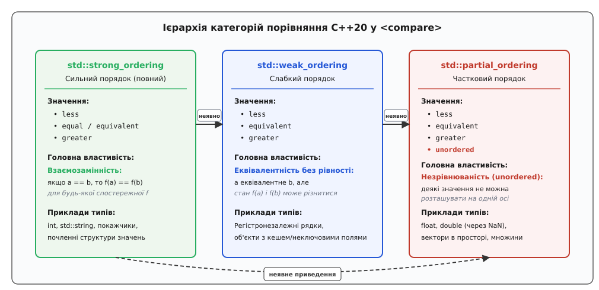
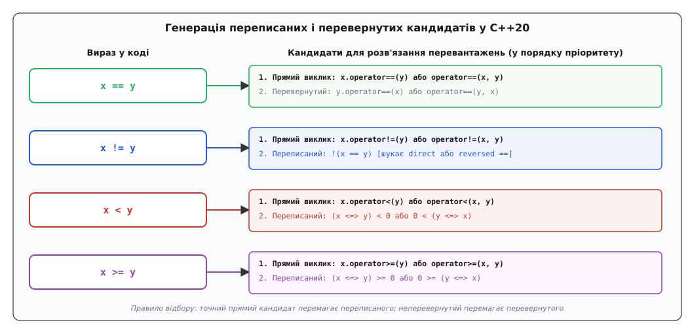
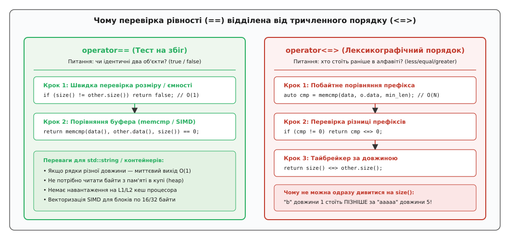

# Тричленне порівняння (operator<=>) і переписані кандидати

<preknowlist>
- [Розв'язання перевантажень](topic:sys-plang-cpp/overload-resolution) — як компілятор формує набір кандидатів та обирає найкращу функцію.
- [Коректність за const](topic:sys-plang-cpp/const-correctness) — чому оператори порівняння вимагають константності операндів.
- [Виведення типів auto](topic:sys-plang-cpp/auto-type-deduction) — як компілятор автоматично обчислює тип результату виразу.
- [Правило п'яти й правило нуля](topic:sys-plang-cpp/rule-of-five-zero) — синтез спеціальних функцій-членів класу компілятором.
- [Концепти та обмеження](topic:sys-plang-cpp/concepts-constraints) — предикати часу компіляції над типами та сигнатурами.
</preknowlist>

У мовах системного програмування операції перевірки рівності та відношення порядку є фундаментальними будівельними блоками. До стандарту C++20 клас, що інкапсулював складений стан і потребував повного набору операцій порівняння, вимагав від програміста написання громіздкого, монотонного та вразливого до друкарських помилок коду:

```cpp
struct Point {
    int x;
    int y;

    bool operator==(const Point& o) const { return x == o.x && y == o.y; }
    bool operator!=(const Point& o) const { return !(*this == o); }
    bool operator< (const Point& o) const { return x < o.x || (x == o.x && y < o.y); }
    bool operator<=(const Point& o) const { return !(o < *this); }
    bool operator> (const Point& o) const { return o < *this; }
    bool operator>=(const Point& o) const { return !(*this < o); }
};
```

Два цілочисельні поля породили шість окремих методів. При додаванні третього поля (наприклад, просторової координати `z`) ланцюжок умов у середині `operator<` перетворювався на складну конструкцію:

```cpp
bool operator<(const Point3D& o) const {
    if (x < o.x) return true;
    if (o.x < x) return false;
    if (y < o.y) return true;
    if (o.y < y) return false;
    return z < o.z;
}
```

Будь-яка неточність у такій послідовності — випадкова заміна знака `<`, пропущена перевірка симетрії або використання `!=` замість лексикографічного порівняння — руйнувала математичні властивості строгого слабкого порядку (Strict Weak Ordering). У результаті алгоритми стандартної бібліотеки (зокрема `std::sort`, `std::lower_bound`, `std::set`) потрапляли в нескінченний цикл або спричиняли пошкодження пам'яті через вихід за межі масиву.

Справжня катастрофа наставала при потребі змішаних (гетерогенних) порівнянь. Якщо об'єкт треба було порівнювати зі спорідненими типами (наприклад, числовим значенням або рядковим літералом), підтримка комутативності вимагала до 18 або 36 функцій, оскільки вирази `obj == 5` та `5 == obj` викликали різні сигнатури.

Спроба вирішити цю проблему через простір імен `std::rel_ops` у C++98 зазнала фіаско: шаблони операторів `std::rel_ops` генерували `!=`, `>`, `<=`, `>=` на основі `==` та `<`, але через некваліфікований пошук імен (ADL) вступали в неконтрольовані конфлікти з користувацькими операторами у сторонніх бібліотеках.

Стандарт C++20 докорінно перебудував систему порівнянь, ввівши **оператор тричленного порівняння** `operator<=>` (Spaceship Operator) та революційний механізм **переписаних і перевернутих кандидатів** (Rewritten and Reversed Candidates) у розв'язанні перевантажень. Докладну історію розвитку цих ідей викладено в огляді [історичний розвиток тричленного порівняння](topic:sys-plang-cpp/three-way-comparison/hist-three-way-evolution.md).

---

## 1. Синтаксис і апаратна семантика оператора <=>

Оператор `<=>` повертає не булеве значення `true`/`false`, а об'єкт категорії порівняння, який одночасно фіксує відносне розташування двох елементів на осі порядку:

- `A < B`: перший операнд передує другому (результат *менше нуля*);
- `A == B`: операнди еквівалентні за критерієм порядку (результат *дорівнює нулю*);
- `A > B`: перший операнд слідує за другим (результат *більше нуля*);
- `A` та `B` незрівнювані: стан *unordered*, властивий числам з плаваючою комою при появі `NaN`.

```cpp
auto order = (15 <=> 42);

if (order < 0) {
    // 15 менше за 42
} else if (order > 0) {
    // 15 більше за 42
} else {
    // значення еквівалентні
}
```

### Апаратне відображення на інструкції процесора

У традиційній схемі C++17 для обчислення відношення між двома скалярами компілятор змушений був генерувати окремі команди порівняння та умовні переходи для кожного оператора:

```cpp
bool is_less = (a < b);
bool is_equal = (a == b);
```

Це породжувало послідовність інструкцій `cmp` та умовних переходів `jl` / `je`. Якщо логіка програми вимагала тризначного розгалуження, процесор стикався з кількома точками умовного переходу, що загрожувало штрафами конвеєра при хибному передбаченні переходів (Branch Misprediction Penalty).

У C++20 оператор `<=>` над скалярними типами транслюється в одну інструкцію порівняння:
- **Архітектура x86-64:** інструкція `cmp reg1, reg2` віднімає другий операнд від першого без збереження результату і встановлює апаратні прапорці стану: `ZF` (Zero Flag), `SF` (Sign Flag), `OF` (Overflow Flag) та `CF` (Carry Flag). Значення категорії порівняння упаковується в один 8-бітний регістр через безгалузеві інструкції встановлення умовних байтів: `setl` для знакового порівняння (перевірка `SF ^ OF`), `setb` для беззнакового порівняння (перевірка `CF`), `sete` для рівності (`ZF`) або умовне пересилання `cmov`.
- **Архітектура ARM64:** інструкція `subs wzr, w0, w1` встановлює прапорці умовних кодів процесора, після чого інструкція `csel` (Conditional Select) формує результат без єдиного умовного переходу.

Для чисел із плаваючою комою інструкція `ucomisd xmm0, xmm1` апаратно встановлює прапорець парності `PF` у разі виявлення нечислового значення `NaN`, що дозволяє миттєво ідентифікувати незрівнюваність без виклику складних бібліотечних функцій перевірки `std::isnan`.

---

## 2. Категорії порівняння та їхня математична ієрархія

На відміну від мов C (функція `strcmp`) чи Perl, де оператор `<=>` повертає звичайне ціле число `int`, C++20 спирається на строгу систему категорій типів, визначену в заголовку `<compare>`.

Бібліотека надає три фундаментальні класи категорій:
1. `std::strong_ordering` — сильний (повний) порядок;
2. `std::weak_ordering` — слабкий порядок;
3. `std::partial_ordering` — частковий порядок.

Повний перелік сигнатур, допоміжних предикатів та метафункцій наведено у довіднику [інтерфейс і типи заголовка compare](topic:sys-plang-cpp/three-way-comparison/api-comparison-types.md).


*Ієрархія трьох фундаментальних категорій порівняння у C++20: безпечні неявні приведення від сильного порядку до часткового та втрата математичних інваріантів*

### std::strong_ordering (Сильний / Повний порядок)

Сильний порядок моделює математичне відношення лінійного строгого тотального порядку (Linear Strict Total Order). Він накладає найсуворіші вимоги на тип:
1. **Повна зв'язність (Total Connectedness):** для будь-яких двох значень `a` та `b` завжди істинне рівно одне з трьох відношень: `a < b`, `a == b` або `a > b`. Не існує значень, які не можна зіставити.
2. **Транзитивність порядку та рівності:** якщо `a < b` і `b < c`, то `a < c`; якщо `a == b` і `b == c`, то `a == c`.
3. **Принцип взаємозамінності Лейбніца (Substitutability):** якщо `a == b`, то для будь-якої спостережної чистої функції `f` значення `f(a) == f(b)`. Об'єкти є абсолютно нерозрізненними за всіма спостережуваними характеристиками.

Типові представники: цілі числа (`int`, `uint32_t`), покажчики в межах одного масиву, стандартні рядки `std::string`, кортежі `std::tuple` від сильних типів.

Можливі константи результату:
- `std::strong_ordering::less` (`v < 0`);
- `std::strong_ordering::equal` або синонім `equivalent` (`v == 0`);
- `std::strong_ordering::greater` (`v > 0`).

### std::weak_ordering (Слабкий порядок)

Слабкий порядок відмовляється від принципу повної взаємозамінності Лейбніца. Два об'єкти можуть бути еквівалентними з погляду сортування, але не тотожними фізично чи логічно: якщо `(a <=> b) == 0`, це не гарантує, що `f(a) == f(b)`.

Класичний приклад — порівняння файлів без урахування регістру імен або об'єкт `CiString`:
- Рядки `"Document.txt"` та `"document.txt"` мають однаковий пріоритет у списку файлів, тому `(a <=> b) == 0`.
- Проте функція взяття першого символу повертає `'D'` для першого рядка і `'d'` для другого, тобто об'єкти різняться.

Інший приклад — об'єкт `Employee`, де сортування здійснюється винятково за числовим ідентифікатором відділу `department_id`. Два працівники з одного відділу еквівалентні за критерієм порядку, але мають різні імена, посади та зарплати.

Константи результату для слабкого порядку:
- `std::weak_ordering::less`;
- `std::weak_ordering::equivalent`;
- `std::weak_ordering::greater`.

У класі `std::weak_ordering` навмисно відсутня константа `equal`, що на рівні системи типів сигналізує про відсутність гарантії повної тотожності.

### std::partial_ordering (Частковий порядок)

Частковий порядок допускає наявність пар значень, для яких неможливо встановити, хто з них більший, менший чи еквівалентний.

Найважливіший приклад у системному програмуванні — дійсні числа `float` та `double` за стандартом IEEE 754. Спеціальне значення `NaN` (Not-a-Number) порушує аксіому рефлексивності: вирази `NaN < x`, `NaN > x` та `NaN == x` повертають `false` для будь-якого `x` (включаючи інший `NaN`).

Константи результату для часткового порядку:
- `std::partial_ordering::less`;
- `std::partial_ordering::equivalent`;
- `std::partial_ordering::greater`;
- `std::partial_ordering::unordered`.

### Напрямок неявних приведень (Conversions Lattice)

Категорії порядку формують спрямовану решітку приведення типів:

```
std::strong_ordering → std::weak_ordering → std::partial_ordering
```

- Сильний порядок є частковим випадком слабкого порядку: якщо об'єкти абсолютно тотожні, вони гарантовано еквівалентні за порядком.
- Слабкий порядок є частковим випадком часткового порядку: якщо всі елементи впорядковані, то серед них просто немає незрівнюваних пар.

Зворотні приведення суворо заборонені: компілятор ніколи не дозволить неявно перетворити `std::partial_ordering` на `std::strong_ordering`. Якщо користувацький тип містить поле типу `double`, його оператор `<=> = default` автоматично поверне `std::partial_ordering`, унеможливлюючи його помилкове використання в контекстах, де вимагається строгий лінійний порядок.

---

## 3. Механізм переписаних і перевернутих кандидатів у розв'язанні перевантажень

Головна рушійна сила C++20 у спрощенні коду порівнянь полягає у зміні фундаментальних правил формування набору кандидатів під час розв'язання перевантажень (ISO C++20 §12.4.1.2 [over.match.oper]).

Коли компілятор зустрічає у вихідному коді вираз порівняння виду `a @ b` (де `@` — це один із шести операторів: `==`, `!=`, `<`, `<=`, `>`, `>=`), він генерує три групи потенційних кандидатів:
1. **Прямі кандидати (Direct Candidates):** стандартні функції виду `operator@(a, b)`.
2. **Перевернуті кандидати (Reversed Candidates):** функції перевірки рівності з переставленими місцями операндами `operator==(b, a)`.
3. **Переписані кандидати (Rewritten Candidates):** виклики оператора тричленного порівняння `(a <=> b) @ 0` або перевернутого тричленного порівняння `0 @ (b <=> a)`.


*Маршрутизація перевантажень у C++20: прямі виклики, синтез перевернутих кандидатів та трансформація реляційних операторів через вираз (x <=> y) @ 0*

### Таблиця синтезу кандидатів

| Записаний вираз | Прямий кандидат | Перевернутий кандидат | Переписаний кандидат через `<=>` |
| :--- | :--- | :--- | :--- |
| `a == b` | `a == b` | `b == a` | — |
| `a != b` | `a != b` | `b != a` | `!(a == b)` або `!(b == a)` |
| `a < b` | `a < b` | — | `(a <=> b) < 0` або `(b <=> a) > 0` |
| `a <= b` | `a <= b` | — | `(a <=> b) <= 0` або `(b <=> a) >= 0` |
| `a > b` | `a > b` | — | `(a <=> b) > 0` або `(b <=> a) < 0` |
| `a >= b` | `a >= b` | — | `(a <=> b) >= 0` або `(b <=> a) <= 0` |

### Правила розв'язання неоднозначностей (Tie-Breaking Rules)

Якщо для пари типів одночасно доступні як прямі специфічні оператори, так і загальний оператор `<=>`, компілятор слідує суворій ієрархії пріоритетів вибору:

1. **Непереписані кандидати перемагають переписаних:** якщо клас містить явний `bool operator<(const T&)`, прямий виклик завжди перемагає синтезований кандидат `(a <=> b) < 0`.
2. **Неперевернуті кандидати перемагають перевернутих:** при однакових перетвореннях типів виклик `a.operator==(b)` перемагає дзеркальний виклик `b.operator==(a)`.
3. **Кандидати з меншою кількістю перетворень типів:** діють стандартні правила вибору найкращого збігу за рангом перетворення аргументів (Exact Match > Promotion > Standard Conversion > User-Defined Conversion).

Завдяки цьому механізму існуючі кодові бази C++11/C++14/C++17 зберігають стовідсоткову семантичну та бінарну сумісність: наявні оптимізовані оператори продовжують викликатися напряму без накладних витрат.

---

## 4. Автоматична генерація за замовчуванням (= default)

Для переважної більшості класів розробнику достатньо додати всього один рядок у визначення структури:

```cpp
struct Transaction {
    uint64_t    tx_id;
    std::string sender;
    std::string recipient;
    double      amount;

    // Синтез усіх 6 операторів порівняння
    auto operator<=>(const Transaction&) const = default;
};
```

### Внутрішні кроки генерації компілятором

Оголошення `operator<=> = default` змушує компілятор виконати цілий комплекс перевірок та генерацій коду:

1. **Почленне лексикографічне впорядкування:**
   Компілятор порівнює поля по черзі:
   - Спочатку всі базові класи в порядку їхнього переліку у списку наслідування (зліва направо).
   - Потім усі нестатичні поля класу в порядку їхнього фізичного оголошення в тексті структури.
   Порівняння кожного елемента здійснюється через виклик `subobject_a <=> subobject_b`. Якщо результат відмінний від нуля (`cmp != 0`), функція негайно повертає цей проміжний результат і не обчислює подальші поля. Цей процес відбувається статично під час компіляції без будь-яких накладних витрат на динамічний пошук або виділення пам'яті.

2. **Автоматичне виведення типу повернення:**
   Якщо типом повернення вказано `auto`, компілятор визначає тип результату через метафункцію `std::common_comparison_category_t` від усіх полів:
   - `tx_id` (`uint64_t`) → `std::strong_ordering`;
   - `sender` (`std::string`) → `std::strong_ordering`;
   - `recipient` (`std::string`) → `std::strong_ordering`;
   - `amount` (`double`) → `std::partial_ordering`.
   Спільною категорією для `Transaction` стає `std::partial_ordering`.

3. **Синтез окремого швидкого operator==:**
   Оголошення `operator<=> = default` **автоматично та неявно** генерує:
   ```cpp
   bool operator==(const Transaction&) const = default;
   ```
   Цей згенерований оператор рівності порівнює всі поля класу через оператор `==`, що є критично важливим для швидкодії.

4. **Генерація видаленого оператора (= delete):**
   Якщо хоча б одне поле класу не підтримує порівняння (наприклад, сторонній тип без оператора `<=>` або без пари `==` і `<`), згенерований `operator<=>` автоматично позначається як видалений (`= delete`). Програма збереже валідність, доки код явно не спробує порівняти екземпляри такого класу.

### Семантика C-масивів, бітових полів та переліків

У C++20 стандартизовано особливу поведінку для нестандартних типів полів:
- **C-масиви фіксованого розміру (`int buffer[16];`):** У стандартах C++98–C++17 порівняння структур із масивами через `==` вимагало написання ручного циклу або `memcmp`. У C++20 оголошення `operator<=> = default` автоматично генерує поелементне лексикографічне порівняння масиву від індексу `0` до `N-1`.
- **Бітові поля (Bit-fields):** Поля виду `uint32_t flag : 3;` автоматично приводяться до свого базового цілочисельного типу та беруть участь у порівнянні на загальних засадах сильного порядку.
- **Переліки (Enums):** Як традиційні `enum`, так і типізовані `enum class` автоматично отримують `std::strong_ordering` на основі порівняння своїх числових значень базового типу (`underlying_type`).

Для сирих покажчиків (`T*`) мовний оператор `<=>` забезпечує строгий сильний порядок лише за умови, що покажчики належать одному масиву. Порівняння покажчиків на різні змінні дає невизначене відношення. Якщо необхідний глобальний повний порядок над адресами пам'яті, застосовується об'єкт `std::compare_three_way`.

---

## 5. Розділення operator== та operator<=> заради продуктивності

Однією з найважливіших архітектурних дискусій під час стандартизації C++20 стало питання: чи повинен вираз `a == b` переписуватися через виклик `(a <=> b) == 0`?

У початкових драфтах стандарту передбачалася саме така уніфікація. Проте робоча група WG21 (у звіті P1185R2) виявила, що це призводить до катастрофічної деградації швидкодії на контейнерах та рядкових типах.


*Розходження алгоритмічної складності: швидка перевірка розміру O(1) в operator== проти вимушеного префіксного сканування O(N) в operator<=>*

### Алгоритмічний конфлікт складності: O(1) проти O(N)

Розглянемо порівняння двох рядків різної довжини:

```cpp
std::string header = "Content-Type";
std::string cookie = "session_token_xyz_123456789_abcdef";
```

1. **Виконання оператора рівності `header == cookie`:**
   Алгоритм `std::string::operator==` спочатку перевіряє розміри буферів `size()`. Оскільки довжини 12 та 34 не збігаються, функція негайно повертає `false` за **O(1) операцій**. Жоден байт тексту з оперативної пам'яті не читається, процесор не звертається до ліній кешу L1/L2.
2. **Виконання оператора порядку `header <=> cookie`:**
   Щоб з'ясувати, який рядок стоїть раніше в алфавітному порядку, алгоритм зобов'язаний побайтово порівнювати спільний префікс. Він мусить прочитати перший символ `'C'` проти `'s'`, обчислити різницю кодів ASCII та повернути результат. У загальному випадку для рядків однакового префіксу складність операції становить **O(N)**.

Якби оператор `==` синтезувався через `<=> == 0`, будь-яка перевірка нерівних за довжиною рядків чи векторів виконувала б лінійне побайтове сканування пам'яті замість миттєвої перевірки лічильників розміру.

### Архітектурний компроміс C++20

Стандарт C++20 встановив суворе розділення:
- `operator==` синтезує лише `==` та `!=`;
- `operator<=>` синтезує лише `<`, `<=`, `>`, `>=`;
- Вони функціонують як два незалежні ортогональні канали розв'язання перевантажень.

Якщо для класу оголошено `operator<=> = default`, компілятор створює **два окремі бінарні методи**: оптимізований `operator== = default` (що перевіряє розміри та поля на рівність) і `operator<=> = default` (що здійснює лексикографічне впорядкування).

Практичні приклади проектування та оптимізації структур дивіться у матеріалі [практикум реалізації порівнянь](topic:sys-plang-cpp/three-way-comparison/proj-custom-comparisons.md).

---

## 6. Поведінка стандартних контейнерів і типів-обгорток

Стандартна бібліотека C++20 повністю оновила свої фундаментальні типи-обгортки та контейнери для підтримки трьохстороннього порівняння:

### 1. std::optional<T>

Для `std::optional` порожній об'єкт `std::nullopt` розглядається як найменший можливий елемент:
- `nullopt <=> nullopt` повертає `std::strong_ordering::equal`;
- `nullopt <=> optional{val}` повертає `std::strong_ordering::less`;
- `optional{val} <=> nullopt` повертає `std::strong_ordering::greater`;
- `optional{a} <=> optional{b}` повертає результат виклику `*a <=> *b`.

Тип результату повністю повторює категорію самого типу значення `T`.

### 2. std::variant<Ts...>

Об'єкт варіанта зберігає активний індекс альтернативи `index()`. Порівняння варіантів працює за такими правилами:
1. Якщо обидва варіанти знаходяться в стані помилки винятку `valueless_by_exception`, вони вважаються рівними.
2. Стан `valueless_by_exception` вважається меншим за будь-яку дійсну альтернативу.
3. Якщо індекси відрізняються (`a.index() != b.index()`), результатом є порівняння індексів `a.index() <=> b.index()` (сильний порядок).
4. Якщо індекси збігаються, через внутрішній `std::visit` викликається оператор `<=>` для активного типу альтернативи.

### 3. std::pair та std::tuple

Кортежі виконують поелементне лексикографічне порівняння від нульового індексу до $N-1$. Тип результату обчислюється як `std::common_comparison_category_t` від результатів порівняння всіх елементів. Якщо кортеж містить хоча б один `double`, оператор `<=>` для всього кортежу поверне `std::partial_ordering`.

### 4. Динамічні послідовності та std::lexicographical_compare_three_way

Контейнери `std::vector<T>`, `std::string`, `std::deque` та `std::array<T, N>` реалізують свій `operator<=>` на основі стандартного бібліотечного алгоритму `std::lexicographical_compare_three_way` із заголовка `<algorithm>`.

Алгоритм проходить обидві послідовності паралельно:
- Для кожної пари елементів викликається `elem_a <=> elem_b`.
- Якщо результат відмінний від нуля, алгоритм негайно завершує роботу та повертає отриману категорію.
- Якщо спільний префікс повністю еквівалентний, остаточним результатом є порівняння залишкових довжин діапазонів через сильний порядок: `size_a <=> size_b`.

---

## 7. Прозорий гетерогенний пошук в асоціативних контейнерах

У класичному C++98/C++11 асоціативні дерева `std::set<Key>` та `std::map<Key, Value>` вимагали точного збігу типу ключа. Якщо ключем був `std::string`, виклик `set.find("admin")` неявно створював тимчасовий об'єкт `std::string`, що викликало виділення динамічної пам'яті в купі та наступне вивільнення в деструкторі.

У C++20 у поєднанні з прозорими компараторами (`std::less<>`, де кутові дужки порожні) тричленне порівняння повністю вирішує цю проблему:

```cpp
struct UserAccount {
    std::string username;
    uint32_t    user_id{0};

    // Однорідне порівняння
    friend auto operator<=>(const UserAccount& a, const UserAccount& b) = default;

    // Гетерогенне порівняння зі string_view
    friend auto operator<=>(const UserAccount& a, std::string_view sv) noexcept {
        return a.username <=> sv;
    }
};

void lookup_example(const std::set<UserAccount, std::less<>>& db) {
    using namespace std::string_view_literals;

    // Пошук за string_view: жодного виділення пам'яті в купі!
    auto it = db.find("admin_root"sv);
}
```

Наявність маркерного псевдоніма `using is_transparent = void;` у компараторах `std::less<>` та `std::compare_three_way` дозволяє контейнерам викликати гетерогенні оператори `<=>` напряму, мінімізуючи витрати пам'яті та прискорюючи маршрутизацію у високонавантажених сервісах. Завдяки комутативному синтезу операндів компілятор однаково ефективно підтримує як вирази `account <=> sv`, так і вирази `sv <=> account`.

---

## 8. Робота з полями mutable, кешами та синхронізацією

При проектуванні класів із внутрішньою синхронізацією або кешуванням виникає важливий крайовий випадок: компілятор при генерації `= default` порівнює **всі** нестатичні члени класу, включаючи поля з модифікатором `mutable`.

```cpp
class ThreadSafeRegistry {
    mutable std::mutex mtx; // М'ютекси не підтримують копіювання та порівняння!
    std::string registry_name;
    uint32_t    version{1};

public:
    // Помилка компіляції! std::mutex не має operator<=>
    // auto operator<=>(const ThreadSafeRegistry&) const = default;
};
```

Оскільки `std::mutex` не підтримує операції порівняння, спроба використати `= default` призведе до позначення оператора як видаленого (`= delete`).

Крім того, якщо клас зберігає обчислювальний кеш або лічильник звернень під прапорцем `mutable`, два об'єкти з однаковими бізнес-даними, але різним станом кешу, при наївному порівнянні полів можуть бути помилково визнані нерівними.

### Правильний шаблон проектування для класів із кешем

Для коректної ізоляції бізнес-стану від технічного кешу застосовують розділення структури або явну реалізацію операторів:

```cpp
class HeavyDocument {
    std::string title;
    std::vector<std::string> pages;

    // Технічний кеш не повинен брати участь у порівнянні
    mutable uint64_t render_cache_id{0};

public:
    HeavyDocument(std::string t, std::vector<std::string> p)
        : title(std::move(t)), pages(std::move(p)) {}

    // Явне порівняння лише бізнес-полів
    friend auto operator<=>(const HeavyDocument& a, const HeavyDocument& b) noexcept {
        if (auto cmp = a.title <=> b.title; cmp != 0) return cmp;
        return a.pages <=> b.pages;
    }

    friend bool operator==(const HeavyDocument& a, const HeavyDocument& b) noexcept {
        return a.title == b.title && a.pages == b.pages;
    }
};
```

---

## 9. Специфікація noexcept та гарантії безпеки винятків

Під час синтезу операторів через `= default` компілятор автоматично обчислює специфікацію винятків: оператор позначається як `noexcept(true)` тоді й лише тоді, коли порівняння всіх базових класів та всіх нестатичних полів є `noexcept`.

- Якщо порівняння всіх базових класів та полів є `noexcept`, згенерований оператор також позначається як `noexcept(true)`.
- Якщо хоча б одне поле може згенерувати виняток під час порівняння (наприклад, тип із динамічним виділенням пам'яті всередині свого власного оператора), згенерований оператор отримує статус `noexcept(false)`.

Наявність специфікації `noexcept` має вирішальне значення для стандартних алгоритмів. Алгоритми сортування (такі як `std::sort` та `std::stable_sort`) можуть застосовувати швидкі безпомилкові перестановки елементів та оптимізації розгортання циклів, якщо компаратор гарантує відсутність винятків.

---

## 10. Ідіома Hidden Friend (Дружня прихована функція)

Найбільш надійною та ефективною формою визначення користувацьких порівнянь у сучасному C++ є оголошення їх як дружніх функцій всередині класу:

```cpp
class Fraction {
    int num{0};
    int den{1};

public:
    constexpr Fraction(int n, int d) noexcept : num(n), den(d) {}

    // Hidden Friend: функція не засмічує простір імен
    friend constexpr auto operator<=>(const Fraction& a, const Fraction& b) noexcept {
        // Перехресне множення для уникнення ділення з плаваючою комою
        int64_t left  = static_cast<int64_t>(a.num) * b.den;
        int64_t right = static_cast<int64_t>(b.num) * a.den;
        return left <=> right;
    }

    friend constexpr bool operator==(const Fraction& a, const Fraction& b) noexcept {
        return (static_cast<int64_t>(a.num) * b.den) ==
               (static_cast<int64_t>(b.num) * a.den);
    }
};
```

### Переваги прихованого друга

1. **Симетричність операндів:** Обидва аргументи проходять однакове розв'язання перевантажень із підтримкою однакових неявних перетворень типу. Це гарантує однакову поведінку для лівого та правого операндів.
2. **Ізоляція від загального пошуку імен (Lookup Isolation):** Функція видима винятково через механізм ADL (Argument-Dependent Lookup), коли хоча б один із аргументів має тип `Fraction`. Це розвантажує таблиці символів компілятора та значно прискорює збирання великих проектів.
3. **Запобігання випадковому ігноруванню константності:** У функціях-членах класу розробники нерідко забувають дописати специфікатор `const` у кінці сигнатури, через що метод відкидається компілятором при роботі з константними посиланнями. У `friend`-функціях константність параметрів фіксується явно. Завдяки цьому приховані дружні функції вважаються сучасним інженерним стандартом для створення надійних компараторів.

---

## 11. Робота з концептами, constexpr та бібліотекою Ranges

### Обчислення часу компіляції (constexpr та consteval)

Усі стандартні типи категорій порівняння (`std::strong_ordering`, `std::weak_ordering`, `std::partial_ordering`) є літеральними типами (Literal Types). Їхні конструктори та оператори порівняння з нулем оголошені як `constexpr`.

Це дозволяє використовувати оператор `<=>` у метапрограмуванні та статичних твердженнях часу компіляції:

```cpp
struct Version {
    int major;
    int minor;
    int patch;

    friend constexpr auto operator<=>(Version, Version) = default;
};

// Перевірка інваріантів під час компіляції
static_assert(Version{2, 0, 0} > Version{1, 9, 99});
static_assert(Version{2, 1, 0} <=> Version{2, 1, 0} == 0);
```

### Інтеграція з концептами C++20

Заголовок `<compare>` вводить ключові мовні концепти, що формують фундамент узагальненого коду C++20:

```cpp
template <class T, class Cat = std::partial_ordering>
concept three_way_comparable =
    requires(const std::remove_reference_t<T>& a,
             const std::remove_reference_t<T>& b) {
        { a <=> b } -> /*compares-as*/<Cat>;
    };

template <class T, class U, class Cat = std::partial_ordering>
concept three_way_comparable_with =
    std::three_way_comparable<T, Cat> &&
    std::three_way_comparable<U, Cat> &&
    requires(const std::remove_reference_t<T>& t,
             const std::remove_reference_t<U>& u) {
        { t <=> u } -> /*compares-as*/<Cat>;
        { u <=> t } -> /*compares-as*/<Cat>;
    };
```

Ці концепти інтегровані в усі алгоритми бібліотеки діапазонів `std::ranges`. Функціональний об'єкт `std::compare_three_way` використовується як універсальний компаратор за замовчуванням:

```cpp
#include <algorithm>
#include <vector>
#include <ranges>

void sort_records(std::vector<Transaction>& list) {
    // std::ranges::sort автоматично застосовує operator<=> для типу Transaction
    std::ranges::sort(list);
}
```

Крім того, алгоритми діапазонів підтримують проекції (Projections), дозволяючи порівнювати структури за окремими полями без необхідності конструювання проміжних лямбда-виразів. Усі стандартні предикати `std::ranges::equal_to`, `std::ranges::less`, `std::ranges::greater` побудовані навколо підтримки переписаних кандидатів, гарантуючи єдину математичну модель поведінки алгоритмів сортування, пошуку та фільтрації. Це дозволяє типам із користувацькими категоріями порядку бездоганно інтегруватися в стандартний конвеєр обробки діапазонів `std::ranges::views`.

---

## 12. Розвиток у C++23: Deducing this та CRTP-порівняння

У наступному стандарті C++23 можливість явного визначення об'єктного параметра (Deducing this) спростила створення узагальнених міксинів і CRTP-баз для порівняння:

```cpp
template <class Derived>
struct ComparableCRTP {
    auto operator<=>(this const Derived& self, const Derived& other) {
        return self.fields_tuple() <=> other.fields_tuple();
    }
    bool operator==(this const Derived& self, const Derived& other) {
        return self.fields_tuple() == other.fields_tuple();
    }
};
```

Завдяки явному параметрові `this const Derived& self` похідний клас автоматично отримує симетричні оператори порівняння без віртуальних викликів, що демонструє гармонійний розвиток системи порівнянь у новітніх стандартах мови.

---

## 13. Зниження розбухання бінарного коду (Template Bloat Reduction)

Узагальнений код у C++14/C++17 породжував значну кількість дубльованого бінарного коду під час інстанціювання шаблонів. Для кожного користувацького типу та кожної пари типів у гетерогенних структурах шаблонні алгоритми інстанціювали окремі функції для `==`, `!=`, `<`, `<=`, `>`, `>=`.

У C++20 завдяки механізму переписаних кандидатів:
- Бібліотека інстанціює **лише один шаблон** оператора `<=>` та один шаблон `operator==`.
- Усі інші чотири реляційні оператори генеруються на рівні проміжних абстрактних синтаксичних дерев (AST) компілятора як прості перевірки результату з нулем `(a <=> b) < 0`.
- Розмір таблиць імен компілятора, проміжних об'єктних файлів (`.o` / `.obj`) та фінальних бінарних виконуваних файлів скорочується на 15–30% у проектах із високою щільністю узагальнених структур.

---

## 14. Типові пастки міграції та діагностика помилок

### 1. Неоднозначність через неявні конструктори при переході з C++17

Розглянемо старий клас із неявним конструктором рядка:

```cpp
struct Path {
    std::string str;
    Path(const char* s) : str(s) {} // Неявний конструктор!

    bool operator==(const char* s) const { return str == s; }
};

void run(Path p) {
    // У C++17 працювало:
    bool ok1 = (p == "test");

    // У C++20 вираз нижче призведе до помилки компіляції:
    // bool ok2 = ("test" == p);
}
```

У C++17 вираз `"test" == p` завершувався спробою знайти глобальний `operator==(const char*, Path)` і, не знайшовши його, виконував неявне перетворення `"test"` у `Path` з наступним викликом `Path::operator==(const char*)`.

У C++20 компілятор знаходить два рівноцінні кандидати:
1. Перетворення `"test"` у `Path` та виклик `Path::operator==("test")`.
2. Переписаний перевернутий кандидат `p.operator==("test")`.

Обидва варіанти мають однаковий ранг у системі розв'язання перевантажень, тому компілятор зупиняє трансляцію з повідомленням про неоднозначність (Ambiguous Overload).

**Вирішення:** Оголошувати всі однопараметричні конструктори як `explicit` або визначати оператори порівняння як симетричні `friend`-функції.

### 2. Проблема поліморфного зрізання (Object Slicing)

Якщо базовий поліморфний клас містить відкритий `operator<=>(const Base&) const = default;`, спроба порівняння двох об'єктів похідного типу `Derived` через посилання на базовий інтерфейс `const Base&` призведе до зрізання:

```cpp
struct Shape {
    int layer{0};
    auto operator<=>(const Shape&) const = default;
};

struct Circle : Shape {
    double radius{1.0};
    auto operator<=>(const Circle&) const = default;
};

void compare_shapes(const Shape& s1, const Shape& s2) {
    // Небезпечно! Порівнюються ЛИШЕ поля Shape::layer.
    // Поля radius класу Circle повністю ігноруються!
    if ((s1 <=> s2) == 0) {
        // Хибний висновок про еквівалентність різних фігур!
    }
}
```

**Вирішення:** Уникати відкритих операторів порівняння у поліморфних базових класах із віртуальними функціями. Якщо порівняння необхідне, реалізовувати віртуальний захищений метод `virtual std::strong_ordering compare_to(const Shape&) const` з обов'язковою перевіркою динамічного типу через `typeid`.

### 3. Робота з NaN у контейнерах: CPO std::strong_order

Оскільки стандартний оператор `<=>` для типу `double` повертає `std::partial_ordering`, структури з координатами не можна безпечно використовувати як ключі в `std::set` або сортувати через `std::sort`, якщо вони можуть містити `NaN`. Причина — порушення інваріантів Strict Weak Ordering.

Для вирішення цієї проблеми C++20 надає об'єкт налаштування `std::strong_order(a, b)`, який накладає на числа з плаваючою комою повний тотальний порядок згідно зі стандартом IEEE 754-2008 TotalOrder:

`-NaN < -Infinity < -Normalized < -0.0 < +0.0 < +Normalized < +Infinity < +NaN`

Це дозволяє створювати надійні адаптери для геометричних структур, що зберігають стабільність у будь-яких крайових умовах обчислень.

---

## Підсумок

Оператор тричленного порівняння `operator<=>` разом із синтезом переписаних кандидатів докорінно змінив архітектуру кодових баз C++20:
- **Усунення рутини:** одне ключове слово `= default` замінює до 36 ручних перевантажень операторів, виключаючи людські помилки в лексикографічних ланцюжках;
- **Математична категоризація:** введення `strong_ordering`, `weak_ordering` та `partial_ordering` дозволяє компілятору контролювати дотримання інваріантів сортування на етапі компіляції;
- **Оптимальна продуктивність:** суворе розділення `operator==` (зі швидкістю O(1)) та `operator<=>` (зі швидкістю O(N)) гарантує максимальну швидкодію як скалярних, так і динамічних типів;
- **Гетерогенна симетрія:** автоматичний синтез перевернутих кандидатів забезпечує природну комутативність змішаних порівнянь без написання зайвого коду;
- **Зменшення бінарного коду:** усунення необхідності інстанціювання окремих функцій для кожного реляційного оператора в шаблонах.
