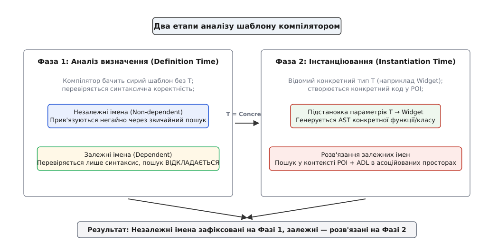
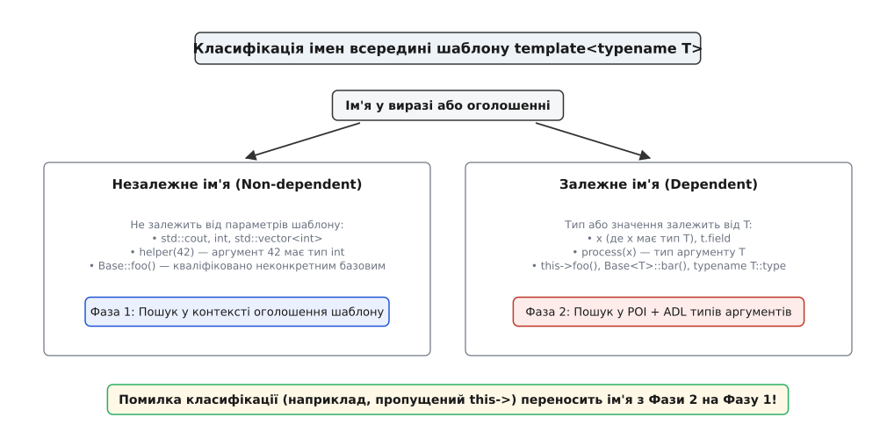
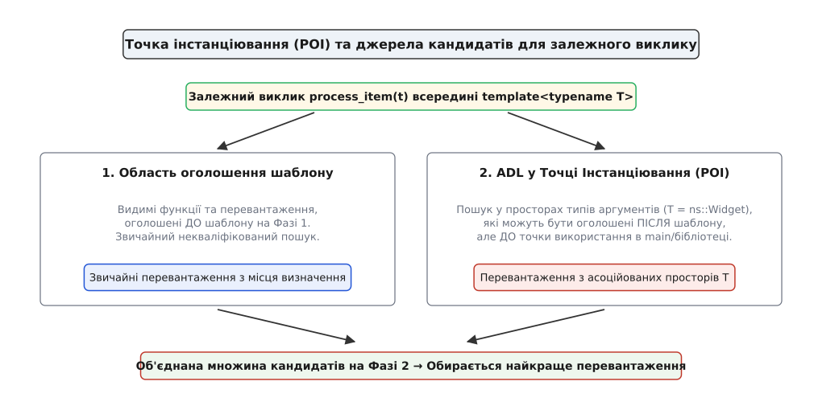

# Двофазний пошук імен у шаблонах

<preknowlist>
- [Шаблони: параметризація типом](topic:sys-plang-cpp/templates-basics) — як оголошувати шаблони функцій та класів і що таке інстанціювання.
- [Простори імен і пошук, залежний від аргументів](topic:sys-plang-cpp/namespaces-and-adl) — звичайний некваліфікований пошук та ADL (пошук Кеніга).
- [Розв'язання перевантажень: як обирається функція](topic:sys-plang-cpp/overload-resolution) — як із множини кандидатів компілятор вибирає найкраще перевантаження.
- [Одиниця трансляції та зв'язування: static, extern, inline](topic:sf-lang/translation-unit) — що компілятор бачитиме у момент обробки файлу та де виникають точки інстанціювання (POI).
</preknowlist>

Код звичайної функції перевіряється й компілюється один раз: типи усіх змінних відомі заздалегідь, виклики зв'язуються з конкретними адресами або символами, а будь-яка синтаксична чи типова помилка проявляється негайно на першому ж проході компілятора. Узагальнений код шаблону існує у зовсім іншому вимірі. У момент, коли компілятор читає текст `template <typename T> void process(T val)`, параметр `T` є лише абстрактною позначкою без розміру, методів та внутрішніх типів. Справжній тип стане відомим лише тоді, коли в якомусь віддаленому файлі з'явиться виклик `process(my_object)`.

Ця часова розбіжність створює фундаментальну дилему для розробника мови. Якщо компілятор відкладе абсолютну всі перевірки коду шаблону до моменту інстанціювання, то синтаксичні помилки проявлятимуться хаотично, а випадкові глобальні функції з точки виклику зможуть непомітно «захоплювати» імена всередині шаблону. Якщо ж спробувати зв'язати всі імена негайно у місці визначення шаблону, то узагальнене програмування стане неможливим, адже компілятор ще не знає, які оператори чи функції підтримує майбутній тип `T`.

Порівняно з мовами з динамічною типізацією (Smalltalk, Python), де будь-яке ім'я шукається винятково під час виконання програми, або мовами із жорстко обмеженими обобщеннями (Java, C#), де параметри типу обмежуються базовими інтерфейсами й перевіряються один раз, мова C++ прагне поєднати абсолютну продуктивність узагальненого коду без витрат на віртуальні виклики з максимальною гнучкістю підстановки типів.

Щоб розв'язати цю суперечність, стандарт C++ запровадив **двофазний пошук імен** (англ. *Two-Phase Name Lookup*). Це чітко регламентована двокрокова процедура, яка розділяє аналіз шаблону на два часові етапи: перевірку незалежних елементів під час первинного парсингу та розв'язання залежних від `T` імен під час підстановки конкретних типів.

## Дилема незавершеного типу в момент аналізу

Розглянемо ситуацію, яка виникає у компілятора під час обробки звичайного шаблону функції:

```cpp
template <typename T>
void analyze_and_log(T item) {
    display_header();
    process_value(item);
}
```

Усередині цієї функції є два окремі виклики: `display_header()` та `process_value(item)`. На перший погляд вони виглядають однаково, але для транслятора між ними лежить прірва.

Аргумент виклику `display_header()` не містить жодного згадування параметра `T`. Це означає, що функція `display_header()` повинна існувати незалежно від того, яким типом буде конкретизовано `T` — `int`, `std::string` чи `Widget`. Якщо компілятор відкладе пошук ім'я `display_header` до моменту інстанціювання, то виклик усередині шаблону зв'яжеться з тією функцією `display_header()`, яка виявиться видимою у файлі користувача. Якщо користувач у власному файлі оголосить іншу функцію `display_header()`, вона мовчки перекриє оригінальну функцію автора шаблону.

Натомість аргумент виклику `process_value(item)` має тип `T`. Автор шаблону не може знати наперед, де оголошено функцію `process_value` для майбутнього користувацького типу `Widget`. Цілком імовірно, що вона оголошена в іншому просторі імен і в іншому заголовковому файлі, який на момент читання тексту шаблону навіть не був включений. Спроба зв'язати `process_value` негайно призведе до помилки, адже для типу `T` відповідного перевантаження ще не існує.

Звідси постає єдине логічне рішення: розділити всі імена всередині шаблону на дві категорії та аналізувати їх у два різні моменти часу.



*Двофазний аналіз розділяє перевірку незалежних імен на етапі визначення та розв'язання залежних імен у точці інстанціювання.*

Детальний аналіз того, як створювалася ця концепція у стандартах C++98/C++11 і чому реалізація роздільної компіляції шаблонів призвела до десятилітньої боротьби, викладено у [історії прийняття двофазного пошуку й епопеї з ключовим словом export](topic:sys-plang-cpp/two-phase-name-lookup/hist-two-phase-lookup.md).

## Перша фаза: синтаксичний аналіз і незалежні імена

Перша фаза (англ. *Phase 1 / Definition Time*) відбувається тоді, коли компілятор вперше зустрічає визначення шаблону під час трансляції файлу. На цьому етапі конкретні типові аргументи ще відсутні.

Головне завдання першої фази — перевірити синтаксичну коректність коду та остаточно зв'язати всі **незалежні імена** (англ. *non-dependent names*).

Ім'я називається незалежним, якщо його синтаксична форма, тип або область пошуку жодним чином не спираються на параметри шаблону (`T`, `N` тощо). До незалежних імен належать:

1. Ключові слова та вбудовані типи (`int`, `double`, `void`).
2. Типи та структури з явними кваліфікаторами, що не містять `T` (`std::size_t`, `std::string`).
3. Виклики функцій, у яких жоден із фактичних аргументів не залежить від `T` (`display_header()`, `std::abs(-42)`).
4. Імена змінних та методів, доступних у поточному контексті, якщо вони не належать до залежних базових класів.

Під час Фази 1 компілятор виконує звичайний некваліфікований або кваліфікований пошук імен у контексті визначення шаблону. Якщо ім'я знайдено, компілятор фіксує відповідне оголошення.

```cpp
#include <iostream>

void setup_environment() {
    std::cout << "Global environment setup\n";
}

template <typename T>
void worker_node(T data) {
    setup_environment(); // Незалежне ім'я! Пошук відбувається на Фазі 1.
}

// УВАГА: Функція оголошена ПІСЛЯ визначення шаблону
void setup_environment(int priority) {
    std::cout << "Priority setup: " << priority << "\n";
}
```

У наведеному прикладі виклик `setup_environment()` всередині `worker_node` є незалежним. Компілятор шукає ім'я `setup_environment` на Фазі 1 і знаходить першу функцію без параметрів. Якщо пізніше у програмі буде додано виклик `setup_environment(10)` всередині шаблону, але сама функція із сигнатурою `void setup_environment(int)` буде оголошена нижче за текст шаблону, Фаза 1 завершиться помилкою компіляції. Компілятор не чекатиме інстанціювання і не шукатиме функцію нижче за текстом — зв'язування незалежного імені жорстко зафіксоване на Фазі 1.

Завдяки цьому чиннику синтаксичні помилки в незалежному коді (наприклад, пропущена крапка з комою, помилка у назві типу `std::sting` замість `std::string` або виклик неіснуючої функції) виявляються негайно при першій компіляції файлу, навіть якщо сам шаблон жодного разу не використовується у блоці `main()`.

Коли компілятор будує синтаксичне дерево на Фазі 1, він створює специфічні вузли AST. Якщо вузол є незалежним, йому негайно призначається точне семантичне значення та посилання на відповідний символ у таблиці символів. Якщо вузол залежний, компілятор відмічає його спеціальним прапорцем `ValueDependent` або `TypeDependent` і залишає зв'язування відкритим.

## Залежні імена та зв'язування на другій фазі

Друга фаза (англ. *Phase 2 / Instantiation Time*) настає лише тоді, коли у програмі відбувається інстанціювання шаблону — наприклад, при виклику `worker_node(42)` або створенні об'єкта `std::vector<Widget>`.

На цій фазі абстрактні параметри `T` замінюються на конкретні типи, після чого компілятор розв'язує **залежні імена** (англ. *dependent names*).



*Класифікація імен визначає, на якій фазі компілятор шукає відповідний символ.*

Ім'я є залежним, якщо його семантика чи тип визначаються параметром шаблону. Класичними прикладами є:

- Змінні, тип яких є параметром шаблону (`T item`).
- Виклики функцій, де принаймні один аргумент має залежний тип (`process_value(item)`).
- Звернення до членів через залежний об'єкт або покажчик (`item.read()`, `ptr->update()`).
- Вкладені типи або статичні члени, кваліфіковані параметром шаблону (`typename T::value_type`).

### Точка інстанціювання (Point of Instantiation — POI)

Де саме компілятор шукає залежні імена на Фазі 2? Відповіддю є концепція **точки інстанціювання** (англ. *Point of Instantiation*, POI).

Для кожної спеціалізації шаблону компілятор визначає у коді POI — точне місце в одиниці трансляції, де знадобився конкретний тип. Під час розв'язання залежного виклику функції (наприклад, `process_value(item)`) компілятор формує множину кандидатів із двох джерел:

1. **Контекст визначення (Definition Context):** Усі перевантаження `process_value`, які були видимі у місці оголошення самого шаблону (на Фазі 1).
2. **Асоційовані простори типів аргументів (ADL у POI):** Усі перевантаження `process_value`, які знаходяться в просторах імен, пов'язаних із конкретним типом `T`, і видимі **до точки POI включно**.



*У точці інстанціювання залежний виклик об'єднує рішення з місця визначення та перевантаження з асоційованих просторів типів аргументів через ADL.*

Розглянемо механіку Фази 2 на повному прикладі:

```cpp
#include <iostream>

// ── Контекст визначення шаблону (Фаза 1) ──────────────────────────────────
template <typename T>
void execute_pipeline(T obj) {
    // process_item(obj) — ЗАЛЕЖНИЙ виклик, бо obj має тип T.
    // Пошук імені process_item відкладено до Фази 2.
    process_item(obj);
}

// ── Модуль користувача (між шаблоном і main) ─────────────────────────────
namespace physics {
    struct Particle {
        double mass = 1.0;
    };

    // Функція оголошена ПІСЛЯ шаблону execute_pipeline,
    // але всередині асоційованого простору physics!
    void process_item(const Particle& p) {
        std::cout << "Processing particle with mass: " << p.mass << "\n";
    }
}

// ── Точка інстанціювання (POI) ─────────────────────────────────────────────
int main() {
    physics::Particle p;
    // Виклик інстанціює execute_pipeline<physics::Particle>.
    // POI розміщується перед main().
    execute_pipeline(p);
}
```

Коли компілятор обробляє `execute_pipeline(p)` у функції `main()`, він запускає Фазу 2 для виклику `process_item(obj)`:

1. Конкретним типом для `T` є `physics::Particle`.
2. Компілятор перевіряє звичайний контекст визначення (Фаза 1) — там функції `process_item` немає.
3. Компілятор запускає **пошук, залежний від аргументів (ADL)** для типу `physics::Particle`.
4. Асоційованим простором для `Particle` є простір імен `physics`.
5. У просторі `physics` компілятор знаходить функцію `process_item(const Particle&)` і успішно пов'язує виклик.

Якби функція `process_item` була оголошена у глобальному просторі імен нижче за шаблон, а не всередині асоційованого простору `physics`, ADL не зміг би її знайти, і компіляція зупинилася б із помилкою. Це один із найважливіших захисних бар'єрів C++: **залежний некваліфікований виклик шукає нові функції на Фазі 2 ТІЛЬКИ через ADL в асоційованих просторах типів-аргументів**.

Формальні критерії визначення асоційованих просторів та матрицю правил для складних типів наведено у [довідниковій матриці правил класифікації імен та вибору POI](topic:sys-plang-cpp/two-phase-name-lookup/api-two-phase-rules.md).

## Класична пастка спадкування: `this->` і залежні бази

Найвідомішим і найчастішим наслідком двофазного пошуку імен, з яким стикається кожен програміст C++, є проблема звернення до членів базового класу у шаблонній ієрархії.

Уявимо типовий клас-спадкоємець:

```cpp
template <typename T>
class Base {
public:
    void clear_cache() {
        // очищення ресурсів
    }
protected:
    int flags = 0;
};

template <typename T>
class Derived : public Base<T> {
public:
    void reset() {
        // ПОМИЛКА КОМПІЛЯЦІЇ: 'clear_cache' was not declared in this scope
        clear_cache(); 
        
        // ПОМИЛКА КОМПІЛЯЦІЇ: 'flags' was not declared in this scope
        flags = 0; 
    }
};
```

Для людини цей код здається абсолютно прозорим: `Derived` успадковує `Base`, отже `clear_cache()` і `flags` є членами базового класу. Проте для компілятора на Фазі 1 цей код є синтаксичною помилкою.

### Чому компілятор не бачить базовий клас на Фазі 1

1. Базовий клас записано як `Base<T>` — це **залежний базовий клас** (англ. *dependent base class*).
2. На Фазі 1 параметр `T` невідомий, тому клас `Base<T>` є неінстанційованим шаблоном.
3. У мові C++ шаблон класу може мати **повні або часткові спеціалізації**. Розробник міг би написати у зовсім іншому файлі:
   ```cpp
   template <>
   class Base<int> {
       // Спеціалізація для int НЕ МІСТИТЬ ні clear_cache(), ні flags!
   };
   ```
4. Оскільки компілятор на Фазі 1 не знає, чи буде `Base<T>` стандартним шаблоном чи спеціалізацією без потрібних методів, він **взагалі не шукає імена всередині залежних базових класів на Фазі 1**.
5. Виклики `clear_cache()` та `flags` записані без кваліфікації. Оскільки у них немає параметрів `T`, компілятор класифікує їх як **незалежні імена** і виконує пошук на Фазі 1 у поточному просторі імен та глобальній області.
6. У глобальній області функція `clear_cache()` відсутня — компілятор перериває збірку з помилкою `use of undeclared identifier`.

### Три ідіоматичні способи вирішення

Щоб код скомпілювався, розробник повинен явним чином підказати компіляторові, що пошук цих імен слід відкласти до Фази 2.

```cpp
template <typename T>
class DerivedFixed : public Base<T> {
public:
    void reset_v1() {
        // Рішення 1: Явне використання вказівника this->
        // Вираз this->clear_cache() є залежним, бо this має тип DerivedFixed<T>*
        this->clear_cache();
        this->flags = 0;
    }

    void reset_v2() {
        // Рішення 2: Явна кваліфікація іменем базового класу
        // Перетворює ім'я на залежне кваліфіковане ім'я
        Base<T>::clear_cache();
        Base<T>::flags = 0;
    }

    // Рішення 3: Введення імен в область видимості класу через using (найкраща практика)
    using Base<T>::clear_cache;
    using Base<T>::flags;

    void reset_v3() {
        // Тепер виклики працюють без префіксів у будь-якому місці класу
        clear_cache();
        flags = 0;
    }
};
```

Використання `this->` або `using Base<T>::member;` є стандартом надійного узагальненого коду. Важливо пам'ятати, що Рішення 2 (`Base<T>::clear_cache()`) вимикає механізм віртуального виклику, якщо метод був віртуальним, тоді як `this->clear_cache()` зберігає віртуальний поліморфізм.

## Синтаксична двозначність і дисамбігуатори: `typename` та `template`

Під час Фази 1 компілятор стикається ще з однією фундаментальною перешкодою: мова C++ має контекстно-залежний синтаксис. Для правильної побудови синтаксичного дерева (AST) компілятор мусить знати, чим є конкретна лексема — типом, зміною чи шаблоном.

Коли ім'я залежить від `T`, компілятор не може зазирнути всередину `T` на Фазі 1. Це призводить до двох синтаксичних двозначностей.

### 1. Двозначність типу та ключове слово `typename`

Розглянемо вираз у тілі шаблону:

```cpp
template <typename T>
void process_container(T& container) {
    T::const_iterator* ptr;
}
```

Як компілятор повинен розібрати рядок `T::const_iterator * ptr;` на Фазі 1?

- Якщо `T::const_iterator` є типом, то це оголошення вказівника `ptr` на цей тип.
- Якщо `T::const_iterator` є статичною змінною (наприклад, `int`), то це операція множення статичного поля `T::const_iterator` на глобальну змінну `ptr`!

За правилами C++, за замовчуванням будь-яке залежне кваліфіковане ім'я (ім'я вигляду `T::something`) вважається **значенням (змінною або функцією)**, а не типом.

Тому спроба оголосити вказівник або змінну без дисамбігуатора спричинить синтаксичну помилку на Фазі 1. Розробник зобов'язаний явно вказати ключове слово `typename`:

```cpp
template <typename T>
void process_container(T& container) {
    // Явно вказуємо компілятору на Фазі 1, що T::const_iterator є типом:
    typename T::const_iterator ptr = container.begin();
}
```

У стандарті C++20 це правило було пом'якшено для контекстів, де нічого крім типу знаходитися не може (наприклад, в операторах `using alias = T::type;` або у списках типів повернення функцій), проте у більшості виразів `typename` залишається обов'язковим.

### 2. Двозначність шаблону та ключове слово `template`

Друга двозначність виникає при виклику шаблонного методу через залежний об'єкт:

```cpp
template <typename T>
void DataConverter::convert(T& node) {
    // ПОМИЛКА: Символ '<' сприймається як оператор "менше ніж"
    // node.get_buffer<int>(); 
}
```

Компілятор розбирає вираз `node.get_buffer < int > ()` так: взять поле `node.get_buffer`, порівняти його оператором `<` з типом `int`, після чого результат порівняти оператором `>` з порожньою дужкою.

Щоб пояснити парсеру на Фазі 1, що `get_buffer` є саме шаблоном функції, перед іменем методу необхідно поставити дисамбігуатор `template`:

```cpp
template <typename T>
void DataConverter::convert(T& node) {
    // Повідомляємо парсеру, що відкриваюча дужка '<' є початком списку аргументів шаблону:
    node.template get_buffer<int>();
}
```

Дисамбігуатор `template` застосовується після операторів `.`, `->` або `::`, якщо за ними слідує залежне ім'я шаблону.

## Взаємодія з механізмами SFINAE та концептами C++20

Двофазний пошук імен утворює фундамент для сучасних методів метапрограмування C++, зокрема механізму SFINAE (Substitution Failure Is Not An Error) та концептів C++20.

### СФІНАЕ (SFINAE) і Фаза 2

Механізм SFINAE спрацьовує винятково під час Фази 2. Коли компілятор виконує підстановку конкретного типу `T` у сигнатуру шаблону функції, синтаксична або типова помилка у списку параметрів чи типі повернення не викликає збою компіляції. Замість цього дане перевантаження просто мовчки вилучається з множини кандидатів.

Проте важливо пам'ятати: **SFINAE захищає лише сигнатуру шаблону на Фазі 2**. Якщо синтаксична помилка виявляється всередині тіла функції під час Фази 1 (наприклад, помилка у незалежному коді), компіляція зупиниться з важкою помилкою незалежно від SFINAE!

### Концепти й обмеження (Concepts & Constraints, C++20)

У C++20 концепти суттєво змінили підхід до діагностики шаблонів. Замість відкладення перевірок методів `T` до глибин Фази 2 у тілі функції, розробник описує вимоги до типу у виразі `requires`:

```cpp
template <typename T>
concept Printable = requires(T a) {
    { std::cout << a } -> std::same_as<std::ostream&>;
};

template <Printable T>
void print_element(T item) {
    std::cout << item;
}
```

Під час Фази 1 компілятор перевіряє синтаксичну коректність самого концепту `Printable`. Під час Фази 2, ще до входу в тіло функції `print_element`, компілятор обчислює вираз `requires`. Якщо `T` не відповідає вимогам, помилка повідомляється чітко на верхньому рівні без генерації багатоекраного виводу помилок з глибин інстанціювання.

## MSVC `/permissive-` і шлях до стандарту

Історія двофазного пошуку імен була б неповною без згадки про розбіжності між компіляторами, які роками завдавали клопоту C++ розробникам.

Протягом майже двадцяти років (від випуску Visual C++ 6.0 у 1998 році і аж до Visual Studio 2015) компілятор Microsoft Visual C++ (MSVC) не реалізовував двофазний пошук імен. Замість цього MSVC використовував так званий **лінивий однофазний аналіз**: компілятор фактически ігнорував перевірку тіла шаблону на Фазі 1 і виконував усю роботу в момент інстанціювання.

Це призвело до появи величезного масиву Windows-коду, який містив грубі порушення стандарту:

- Відсутність `this->` при зверненні до залежних базових класів.
- Відсутність `typename` перед залежними типами.
- Виклики функцій, оголошених нижче за шаблон без використання ADL.

Такий код успішно компілювався в Visual Studio, але миттєво ламався під час спроби зібрати його компіляторами GCC або Clang під Linux чи macOS.

У 2017 році розробники MSVC здійснили масштабне переписування фронтенду і представили прапорець компілятора **`/permissive-`**, який вмикає строгий стандартний двофазний пошук імен. Починаючи з Visual Studio 2019 та при виборі стандарту `/std:c++20`, режим суворого дотримання стандарту став поведінкою за замовчуванням.

Практичні приклади аналізу помилок під час переведення legacy-проєктів на суворий стандарт C++20 наведено у [практичному стенді діагностики й усунення помилок двофазного пошуку в реальних проєктах](topic:sys-plang-cpp/two-phase-name-lookup/proj-lookup-diagnostics.md).

## Підсумкова механіка двофазного пошуку

Щоб узагальнити роботу компілятора з іменем всередині шаблону, зведемо алгоритм до чіткого дерева рішень:

1. **Аналіз виразу на Фазі 1 (визначення шаблону):**
   - Чи залежить ім'я або його аргументи від `T`?
   - **НІ:** Виконується негайний некваліфікований/кваліфікований пошук у контексті визначення. Якщо ім'я не знайдено або виклик некоректний — **помилка компіляції на Фазі 1**. Знайдене символ фіксується назавжди.
   - **ТАК:** Пошук імені відкладається до Фази 2. Перевіряється лише базовий синтаксис (наявність `typename` та `template` при двозначностях).

2. **Аналіз виразу на Фазі 2 (інстанціювання в POI):**
   - Заміщуються конкретні типи для `T`.
   - Для кваліфікованих залежних імен (`this->foo()`, `Base<T>::bar`) пошук виконується у конкретизованому базовому класі.
   - Для некваліфікованих залежних функцій (`process(t)`) формується об'єднана множина кандидатів з:
     - Оголошень, видимих на Фазі 1 у місці визначення.
     - Оголошень, знайдених через **ADL** у просторах імен типів-аргументів до POI включно.
   - З об'єднаної множини обирається найкраще перевантаження за стандартними правилами overload resolution. Якщо перевантаження відсутнє або неоднозначне — **помилка компіляції на Фазі 2**.

Розуміння двофазного пошуку імен перетворює розробку шаблонів C++ з хаотичного вгадування синтаксису на передбачуване побудування надійних узагальнених систем.
