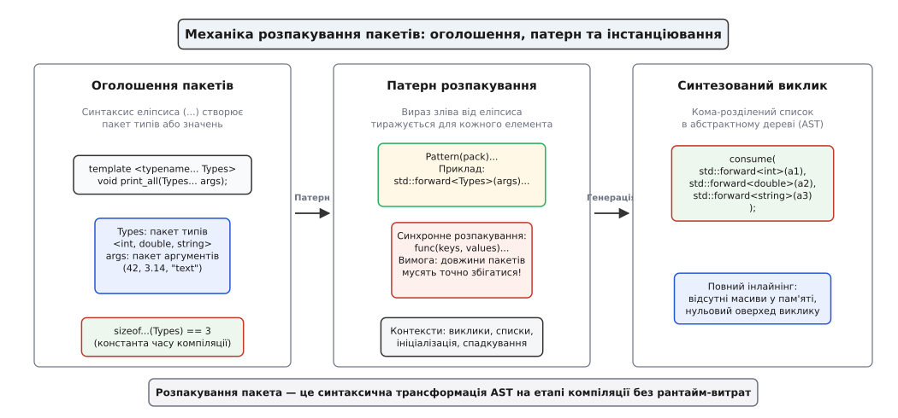
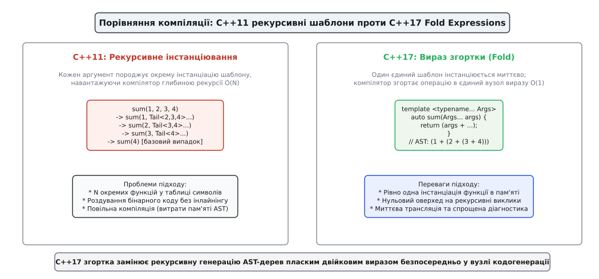
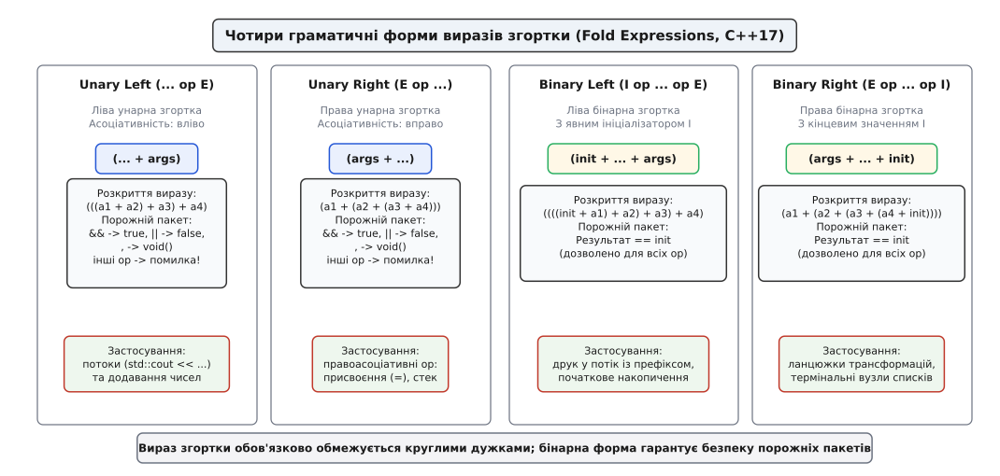

# Шаблони змінної арності й вирази згортки

<preknowlist>
- [Шаблони: параметризація типом](topic:sys-plang-cpp/templates-basics) — основи мономорфізації та підстановки аргументів.
- [Ідеальна передача аргументів: std::forward](topic:sys-plang-cpp/perfect-forwarding) — універсальні посилання та збереження категорій значень.
- [Виведення аргументів шаблону](topic:sys-plang-cpp/template-argument-deduction) — як компілятор виводить типи з переданих параметрів.
- [Спеціалізація й перевантаження шаблонів](topic:sys-plang-cpp/specialization-overload) — часткове впорядкування та базові випадки рекурсії.
</preknowlist>

Коли розробник створює фабричну функцію `make_shared<T>()`, гетерогенний кортеж `std::tuple`, диспетчер подій або універсальну функцію логування, кількість і типи аргументів наперед невідомі. Класичний механізм мови C — макроси `<cstdarg>` із функціями на зразок `printf(const char* fmt, ...)` — вимагає передачі аргументів через стек процесора зі стиранням інформації про типи. Якщо у `printf` передати об'єкт класу з нетривіальним конструктором або деструктором (наприклад, `std::string`), програма зазнає аварійного завершення через порушення захисту пам'яті (Segmentation Fault), оскільки механізм мови C не викликає деструкторів і не знає про розкладку пам'яті об'єктів C++.

У стандарті C++98 шаблони дозволяли параметризувати класи та функції лише фіксованою кількістю типів: `template <typename T1, typename T2, typename T3>`. Щоб створити бібліотеку кортежів або функціональних обгорток (`boost::bind`, `boost::function`), автори бібліотеки Boost були змушені писати препроцесорні макроси, які фізично генерували десятки окремих перевантажень для 1, 2, 3, ..., 50 параметрів. Якщо користувачеві був потрібен кортеж із 11 елементів у системі з лімітом 10, код відмовлявся компілюватися, а час збирання проєкту розростався в десятки разів через обробку мегабайтів штучно згенерованого макросного тексту.

Стандарт C++11 подолав цей глухий кут, запровадивши **шаблони змінної арності** (англ. *variadic templates*, від лат. *variabilis* — змінний), а стандарт C++17 доповнив їх **виразами згортки** (англ. *fold expressions*, від англ. *fold* — згортати). Ця модель дозволяє описувати узагальнені алгоритми над довільною кількістю різнорідних типів із гарантією абсолютної типобезпеки на етапі компіляції та нульовими накладними витратами під час виконання.

Повний шлях розвитку цих ідей — від макросів `va_list` та списків типів Александреску до пропозиції N2080 та сучасного C++26 — викладено в [історії еволюції варіативних шаблонів](topic:sys-plang-cpp/variadic-and-folds/hist-variadic-evolution.md).

---

## Пакети параметрів та аргументів

Основою варіативних шаблонів є поняття **пакета** (англ. *pack*). Пакет — це компіляторна послідовність із нуля або більше сутностей (типів, значень або шаблонів), яка розглядається як єдиний синтаксичний елемент.

У синтаксисі мови ключову роль відіграє трикрапка (`...`, англ. *ellipsis*). Залежно від позиції у вихідному коді, вона виконує одну з трьох принципово різних функцій:
1. **Оголошення пакета параметрів шаблону (Template Parameter Pack):** Стоїть ліворуч від імені типу у списку параметрів шаблону (`typename... Args` або `auto... Values`).
2. **Оголошення пакета параметрів функції (Function Parameter Pack):** Стоїть між іменем типу пакета та іменем змінної у списку аргументів функції (`Args... args` або `const Args&... args`).
3. **Операція розпакування пакета (Pack Expansion):** Стоїть праворуч від виразу-патерну (`args...` або `std::forward<Args>(args)...`), наказуючи компілятору розгорнути патерн для кожного елемента пакета.

```cpp
// 1. Оголошення пакета типів шаблону: typename... Types
// 2. Оголошення пакета аргументів функції: Types... args
template <typename... Types>
void print_count(Types... args) {
    // Оператор sizeof... обчислює кількість елементів у пакеті під час компіляції
    constexpr size_t type_count = sizeof...(Types);
    constexpr size_t arg_count  = sizeof...(args);
    static_assert(type_count == arg_count);
}
```

### Різновиди пакетів параметрів

Мова C++ підтримує три категорії пакетів параметрів:

1. **Пакети типів (Type Parameter Packs):**
   ```cpp
   template <typename... Ts>
   class Tuple;
   ```
2. **Пакети значень без типів (Non-Type Parameter Packs):**
   ```cpp
   template <size_t... Dimensions>
   struct Tensor;
   // Використання: Tensor<3, 1920, 1080> image_tensor;
   ```
   У C++17 завдяки ключовому слову `auto` дозволено створювати гетерогенні пакети констант:
   ```cpp
   template <auto... Constants>
   struct ValueList {};
   // Використання: ValueList<42, 'c', true, 3.14> mixed_constants;
   ```
3. **Пакети шаблонів як параметрів (Template Template Parameter Packs):**
   ```cpp
   template <template <typename> class... Containers>
   struct ContainerCollection {};
   // Використання: ContainerCollection<std::vector, std::list, std::deque> collection;
   ```

### Оператор `sizeof...`

Для визначення кількості елементів у пакеті використовується спеціальний оператор `sizeof...` (не плутати зі звичайним оператором `sizeof`, що вимірює об'єм пам'яті в байтах).

Вираз `sizeof...(Args)` повертає константу часу компіляції типу `std::size_t`. Якщо пакет не містить жодного елемента (наприклад, функцію викликано без аргументів `print_count()`), оператор повертає значення `0`. Обчислення виконується безпосередньо парсером компілятора, не генерує жодної машинної інструкції та може використовуватися всередині `static_assert`, `constexpr`-виразів або як розмір статичного масиву.

---

## Механіка розпакування патернів (Parameter Pack Expansion)

Розпакування пакета — це процес, під час якого компілятор бере синтаксичний вираз ліворуч від трикрапки (цей вираз називається **патерном**, англ. *pattern*), копіює його для кожного елемента пакета та розділяє отримані копії комами.



*Механіка розпакування пакета: синтаксичний патерн тиражується компілятором для кожного елемента списку без виділення проміжних масивів у пам'яті.*

Розглянемо, як позиція трикрапки визначає межі патерну:

```cpp
template <typename... Args>
void demo_patterns(Args... args) {
    // Патерн 1: Просте розпакування імен аргументів
    // Патерн: args
    // Результат: consume(a1, a2, a3);
    consume(args...);

    // Патерн 2: Виклик функції для кожного елемента
    // Патерн: transform(args)
    // Результат: consume(transform(a1), transform(a2), transform(a3));
    consume(transform(args)...);

    // Патерн 3: Виклик функції над усім розпакованим пакетом
    // Патерн: args
    // Результат: consume(transform(a1, a2, a3));
    consume(transform(args...));

    // Патерн 4: Взяття адреси кожного аргументу
    // Патерн: &args
    // Результат: consume(&a1, &a2, &a3);
    consume((&args)...);

    // Патерн 5: Ідеальна передача з приведенням типів
    // Патерн: std::forward<Args>(args)
    // Результат: consume(std::forward<T1>(a1), std::forward<T2>(a2), std::forward<T3>(a3));
    consume(std::forward<Args>(args)...);
}
```

### Синхронне розпакування кількох пакетів (Multi-pack Expansion)

Якщо один патерн містить посилання на два або більше незалежних пакетів, компілятор розпаковує їх строго **синхронно** (паралельно):

```cpp
template <typename... Types, typename... Indices>
void pair_up(const Types&... types, const Indices&... indices) {
    // Патерн містить два пакети: types та indices
    // Результат: make_entry(t1, i1), make_entry(t2, i2), make_entry(t3, i3)
    process(make_entry(types, indices)...);
}
```

> **Правило узгодження довжини:** Якщо в одному патерні зустрічаються кілька пакетів, кількість елементів у них **зобов'язана бути строго однаковою**. Якщо `sizeof...(Types)` не дорівнює `sizeof...(Indices)`, компілятор генерує фатальну помилку компіляції (`mismatched pack lengths`).

---

## Граматичні контексти розпакування у C++

Операція розпакування пакета дозволена стандартом мови у строго визначених синтаксичних конструкціях:

1. **Список аргументів функції або конструктора:**
   ```cpp
   target_function(std::forward<Args>(args)...);
   ```
2. **Список шаблонних аргументів:**
   ```cpp
   std::tuple<std::decay_t<Args>...> my_tuple;
   ```
3. **Список ініціалізаторів (Braced-init-list):**
   ```cpp
   int array[] = { static_cast<int>(args)... };
   ```
4. **Список базових класів (Base specifier list):**
   ```cpp
   template <typename... Mixins>
   struct CombinedWidget : public Mixins... {};
   ```
5. **Список ініціалізації конструктора (Member initializer list):**
   ```cpp
   CombinedWidget(Mixins... m) : Mixins(std::move(m))... {}
   ```
6. **Список захоплення лямбда-виразів:**
   - C++11: `[args...]() { ... }` — захоплення копій усіх змінних пакета.
   - C++20: `[...args = std::move(args)]() { ... }` — ініціалізувальне захоплення з переміщенням кожного аргументу.
7. **Using-оголошення (C++17):**
   ```cpp
   template <typename... Handlers>
   struct HandlerGroup : Handlers... {
       using Handlers::operator()...; // Введення operator() усіх базових класів
   };
   ```
8. **Специфікатор вирівнювання (alignas):**
   ```cpp
   alignas(alignof(Args)...) char aligned_buffer[1024];
   ```

---

## Еволюція обходу пакетів: рекурсія C++11 проти C++17 Fold Expressions

Створення варіативних шаблонів у C++11 відкрило можливість приймати довільну кількість аргументів, проте мова не надавала простого синтаксичного інструменту для послідовного обходу елементів пакета.

### Рекурсивний підхід C++11

У C++11 єдиним штатним способом обробки елементів пакета була функціональна декомпозиція на голову (`Head`) та хвіст (`Tail...`):

```cpp
// 1. Базовий випадок (термінатор рекурсії для 0 аргументів)
void print_all() {
    std::cout << '\n';
}

// 2. Рекурсивний шаблон
template <typename Head, typename... Tail>
void print_all(const Head& head, const Tail&... tail) {
    std::cout << head << ' ';
    print_all(tail...); // Рекурсивний виклик для залишку пакета
}
```



*Порівняння внутрішнього конвеєра компіляції: рекурсивний підхід C++11 генерує O(N) окремих функцій, тоді як вираз згортки C++17 формує єдиний плоский вузол синтаксичного дерева.*

### Ціна рекурсивного інстанціювання:
- **Навантаження на компілятор:** Для виклику `print_all(1, 2.0, "three", '4')` компілятор зобов'язаний згенерувати чотири окремі спеціалізації функції:
  `print_all<int, double, const char*, char>`, `print_all<double, const char*, char>`, `print_all<const char*, char>`, `print_all<char>` та базову `print_all()`.
- **Роздування таблиці символів:** Кожна згенерована функція отримує власне мангльоване ім'я в об'єктному файлі (`.o`), що збільшує час лінкування великих проєктів.
- **Ризик накладних витрат у Debug-режимі:** Без оптимізацій (`-O0`) компілятор не вбудовує рекурсивні виклики, що створює реальні переходи за стековими кадрами під час виконання.

### Трюк Swallow та ініціалізатори масивів

Щоб обійти навантаження рекурсії, розробники C++11 застосовували ідіому «поглинання» (англ. *swallow idiom*). Вона використовувала ту властивість списку ініціалізації `int[]`, що порядок обчислення його елементів строго гарантований зліва направо:

```cpp
template <typename... Args>
void print_all_fast(const Args&... args) {
    using expander = int[];
    (void)expander{ 0, (void(std::cout << args << ' '), 0)... };
}
```

Цей синтаксис був швидким у компіляції, але виглядав неприродно, викликав попередження статичних аналізаторів і був важким для розуміння новачками.

---

## Вирази згортки (Fold Expressions, C++17)

Стандарт C++17 радикально розв'язав проблему обходу пакетів, інтегрувавши функціональну концепцію згортки (`fold`/`reduce`) безпосередньо в граматику мови.

**Вираз згортки** — це синтаксична форма, яка згортає пакет параметрів за допомогою одного з 32 бінарних операторів C++ у єдиний вираз синтаксичного дерева.



*Чотири граматичні форми виразів згортки: ліва та права унарні форми проти лівої та правої бінарних форм з явним ініціалізатором.*

### Чотири граматичні форми згортки

Стандарт визначає чотири форми згортки для пакета `E = {e1, e2, ..., eN}` та бінарного оператора `op`:

| Форма | Синтаксис | Еквівалентне семантичне розкриття AST | Асоціативність |
| :--- | :--- | :--- | :--- |
| **Унарна ліва (Unary Left Fold)** | `(... op E)` | `(((e1 op e2) op e3) ... op eN)` | Зліва направо |
| **Унарна права (Unary Right Fold)** | `(E op ...)` | `(e1 op (e2 op (... (eN-1 op eN))))` | Справа наліво |
| **Бінарна ліва (Binary Left Fold)** | `(I op ... op E)` | `((((I op e1) op e2) op e3) ... op eN)` | Зліва направо з початковим `I` |
| **Бінарна права (Binary Right Fold)** | `(E op ... op I)` | `(e1 op (e2 op (... (eN op I))))` | Справа наліво з кінцевим `I` |

> ⚠️ **Круглі дужки обов'язкові:** Вираз згортки завжди береться в круглі дужки: `(args + ...)`. Запис `args + ...` без дужок є грубою синтаксичною помилкою.

```cpp
template <typename... Args>
auto sum_all(Args... args) {
    return (args + ...); // Унарна права згортка: a1 + (a2 + (a3 + a4))
}

template <typename... Args>
void print_spaced(const Args&... args) {
    // Бінарна ліва згортка для потоку введення-виведення
    (std::cout << ... << args) << '\n';
}
```

Детальний перелік усіх 32 операторів, синтаксичних правил та тонкощів роботи парсера наведено у [довіднику операторів згортки та правил для порожніх пакетів](topic:sys-plang-cpp/variadic-and-folds/api-fold-operators.md).

---

## Семантика для порожніх пакетів (Empty Pack Rules)

Якщо функцію з виразом згортки викликано без аргументів (`sizeof...(args) == 0`), поведінка визначається формою згортки та оператором:

### 1. Бінарні згортки
Бінарні форми `(init op ... op args)` та `(args op ... op init)` завжди безпечні для порожніх пакетів. Якщо пакет порожній, результат виразу **дорівнює значенню ініціалізатора `init`**.

### 2. Унарні згортки
Для переважної більшості операторів унарна згортка порожнього пакета заборонена стандартом і спричиняє помилку компіляції (`fold-expression has empty expansion`). Компілятор відмовляється вигадувати значення за замовчуванням для `+` чи `*`, щоб уникнути неявних перетворень типів для користувацьких класів.

Стандарт робить **рівно три винятки**, для яких нейтральні значення однозначно визначені логікою мови:
- **Логічне І (`&&`):** Порожній пакет повертає булеве значення `true`.
- **Логічне АБО (`||`):** Порожній пакет повертає булеве значення `false`.
- **Оператор коми (`,`):** Порожній пакет повертає вираз типу `void()`.

```cpp
template <typename... Args>
constexpr bool all_positive(Args... args) {
    return ((args > 0) && ...); // Для 0 аргументів -> true
}

template <typename... Args>
constexpr bool any_zero(Args... args) {
    return ((args == 0) || ...); // Для 0 аргументів -> false
}
```

---

## Ключові ідіоми та практичні шаблони

### 1. Ідіома Overloaded для диспетчеризації `std::variant`

Для обробки різнорідних типів у `std::variant` через функцію `std::visit` застосовується ідіома `Overloaded`. Вона поєднує множинне варіативне успадкування від набору лямбда-функцій із розпакуванням `using`-оголошень:

```cpp
template <typename... Ts>
struct Overloaded : Ts... {
    using Ts::operator()...; // C++17: введення operator() усіх базових лямбд
};

// C++17 CTAD Guide (посібник з виведення типів)
template <typename... Ts>
Overloaded(Ts...) -> Overloaded<Ts...>;
```

Використання:
```cpp
std::variant<int, double, std::string> data = "Hello C++17";

std::visit(Overloaded{
    [](int i)               { std::cout << "Ціле число: " << i << '\n'; },
    [](double d)            { std::cout << "Дійсне число: " << d << '\n'; },
    [](const std::string& s){ std::cout << "Текстовий рядок: " << s << '\n'; }
}, data);
```

### 2. Статична перевірка предикатів типів (Type Constraints)

Вирази згортки дозволяють створювати компактні перевірки концептів та типів без використання складних метафункцій:

```cpp
// Перевірка, що ВСІ типи в пакеті є цілочисельними
template <typename... Ts>
constexpr bool all_integral_v = (std::is_integral_v<Ts> && ...);

// Перевірка, що ХОЧА Б ОДИН тип є покажчиком
template <typename... Ts>
constexpr bool has_pointer_v = (std::is_pointer_v<Ts> || ...);

// Застосування у концептах C++20:
template <typename... Args>
    requires (std::is_integral_v<Args> && ...)
void process_integers_only(Args... args) {
    // Функція компілюється лише тоді, коли всі аргументи — цілі числа
}
```

### 3. Ланцюжок виконання функцій за оператором коми

Оператор коми гарантує виконання побічних ефектів строго зліва направо. Це дозволяє створювати елегантні конвеєри послідовної обробки:

```cpp
template <typename... Callbacks>
void notify_observers(int event_id, Callbacks&&... callbacks) {
    // Згортка за комою викликає кожен callback послідовно
    (std::forward<Callbacks>(callbacks)(event_id), ...);
}

template <typename Target, typename... Values>
void push_all(Target& container, Values&&... vals) {
    (container.push_back(std::forward<Values>(vals)), ...);
}
```

### 4. Розпакування кортежів через `std::index_sequence`

Кортежі `std::tuple` не є пакетами параметрів, тому їх не можна розпакувати прямо через `tuple...`. Для передачі елементів кортежу у функцію використовують послідовність індексів `std::index_sequence` та допоміжну функцію розпакування:

```cpp
template <typename Func, typename Tuple, size_t... Is>
constexpr decltype(auto) apply_tuple_impl(Func&& f, Tuple&& t, std::index_sequence<Is...>) {
    return std::forward<Func>(f)(std::get<Is>(std::forward<Tuple>(t))...);
}

template <typename Func, typename Tuple>
constexpr decltype(auto) apply_tuple(Func&& f, Tuple&& t) {
    constexpr size_t size = std::tuple_size_v<std::remove_reference_t<Tuple>>;
    return apply_tuple_impl(
        std::forward<Func>(f),
        std::forward<Tuple>(t),
        std::make_index_sequence<size>{}
    );
}
```

Повну архітектуру типізованого конвеєра обробки повідомлень із розпакуванням кортежів та порівняльним аналізом асемблерного виходу наведено у [практичній реалізації конвеєра обробки повідомлень з розпакуванням кортежів](topic:sys-plang-cpp/variadic-and-folds/proj-tuple-pipeline.md).

---

## Розширення C++20 та C++26

Розвиток варіативності продовжується в нових редакціях стандарту:

### C++20: Захоплення в лямбдах та явні списки шаблонів
У C++20 додано підтримку явного розпакування пакетів у захопленнях за значенням або переміщенням:

```cpp
template <typename... Args>
auto make_deferred_call(Args&&... args) {
    // Ініціалізувальне захоплення з переміщенням кожного елемента пакета
    return [...captured_args = std::forward<Args>(args)]() {
        execute_task(captured_args...);
    };
}
```

Крім того, узагальнені лямбди отримали змогу явно оголошувати пакети шаблонних параметрів:
```cpp
auto generic_sum = []<typename... Numbers>(Numbers... nums) {
    return (nums + ...);
};
```

### C++26: Пряма індексація пакетів (Pack Indexing)

У C++26 прийнято стандартну пропозицію P2663 щодо прямої індексації пакетів параметрів. Замість написання складних рекурсивних метафункцій для отримання `N`-го елемента пакета, мова надає прямий синтаксис індексації `Args...[Index]` та `args...[Index]`:

```cpp
template <typename... Ts>
void inspect_pack(Ts... args) {
    // Отримання типу першого аргументу під час компіляції:
    using FirstType = Ts...[0];

    // Отримання значення останнього аргументу:
    auto last_val = args...[sizeof...(Ts) - 1];
}
```

Це перетворює довільний доступ до елементів пакета на примітивну операцію компілятора з постійною алгоритмічною складністю `O(1)`.

---

## Підсумковий синтез

Варіативні шаблони та вирази згортки перетворили C++ на одну з найвиразніших мов у сфері статичного метапрограмування:
- **Zero Runtime Overhead:** Відсутні віртуальні виклики, відсутні структури стирання типів, пам'ять виділяється виключно статично на стеку або в регістрах.
- **Швидкість компіляції:** Вирази згортки замінили рекурсивні ланцюжки мономорфізації глибиною `O(N)` на пряму генерацію вузлів синтаксичного дерева `O(1)`.
- **Строга типобезпека:** Компілятор верифікує кожен аргумент у точці виклику, усуваючи загрози аварійних збоїв пам'яті, притаманні функціям мови C.

> 🔧 **Навіщо це.** У системному програмуванні, драйверах периферійних пристроїв, мережевих протоколах та графічних рушіях поєднання `typename... Args` та `(args + ...)` дозволяє будувати гранично зручні високорівневі інтерфейси, які оптимізатор процесора безшовно транслює в компактний та максимально продуктивний машинний код.
