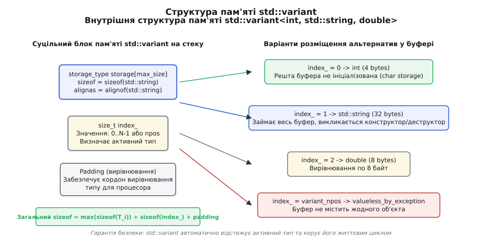
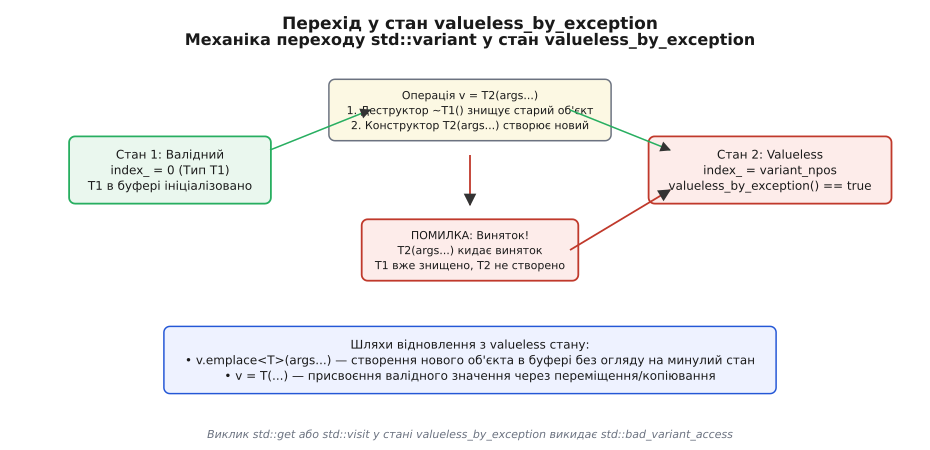
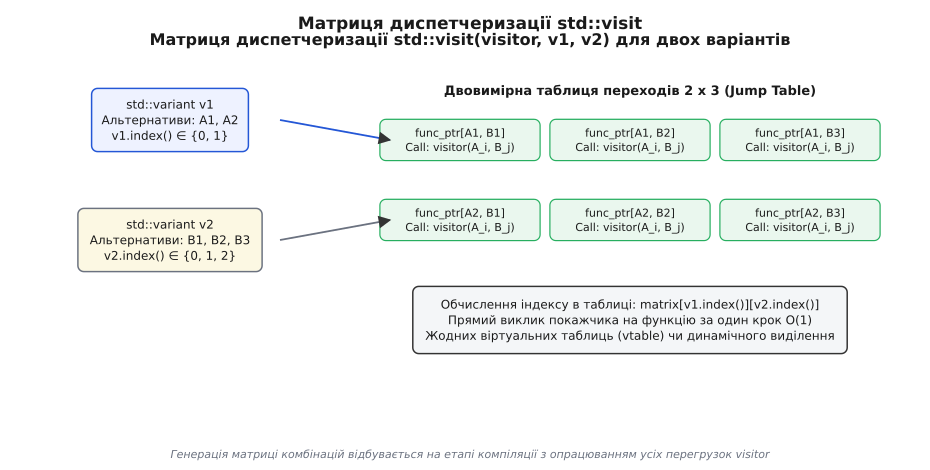

# std::variant та std::visit

<preknowlist>
- [Семантика переміщення](topic:sys-plang-cpp/move-semantics) — керування ресурсами, rvalue-посилання, noexcept-конструктори та оптимізація передачі даних.
- [Гарантії виняткобезпеки](topic:sys-plang-cpp/exception-safety-guarantees) — базова, сильна та noexcept гарантії при зміні стану об'єкта.
- [Виведення типів та шаблони](topic:sys-plang-cpp/auto-type-deduction) — варіативні шаблони (variadic templates), SFINAE, std::decay_t та концепти.
</preknowlist>

Коли програма має опрацьовувати неоднорідні дані — наприклад, синтаксичні вузли математичного виразу, події мережевого протоколу або відповіді від бази даних — виникає фундаментальна інженерна проблема: як розмістити один із кількох можливих типів у єдиній ділянці пам'яті без марнотратного виділення ресурсів у купі та без втрати безпеки типів.

У теорії типів та алгебраїчних структурах даних розрізняють два основні способи комбінування типів: типи-добутки (Product Types) та типи-суми (Sum Types / Discriminated Unions). Тип-добуток, виражений у мові C++ через структуру `struct` або кортеж `std::tuple`, зберігає значення всіх своїх полів одночасно. Розмір такого об'єкта дорівнює сумі розмірів його елементів з урахуванням системного вирівнювання. Натомість тип-сума представляє вибір за принципом «або-або»: об'єкт містить значення **лише одного** з оголошених альтернативних типів у будь-який момент часу.

Класичні підходи до вираження типів-сум, успадковані з мови C або з раннього об'єктно-орієнтованого програмування, пропонують дві протилежні крайності, кожна з яких створює серйозні ризики для надійності та швидкодії системи.

---

## Проблема представлення неоднорідних даних: чому C-union та класичний ООП-поліморфізм ламаються

Перша крайність — об'єднання `union` у стилі мови C. З точки зору фізичного розміщення в оперативній пам'яті, об'єднання являє собою буфер, розмір якого дорівнює розміру найбільшого альтернативного поля. Всі члени `union` починаються з однієї й тієї самої базової адреси в пам'яті. Це забезпечує максимальну екологічність використання оперативної пам'яті на стеку, однак повністю позбавляє програму інформації про тип.

Зчитування активного поля в C-union вимагає від розробника ручного відстеження зовнішнього цілочисельного прапорця (тегу). Якщо програміст помиляється у логіці перевірки тегу, компілятор мови C не видає жодних попереджень. Програма зчитує сирі біти одного типу за правилами іншого, створюючи непередбачувані помилки та невизначену поведінку (Undefined Behavior). Спроба записати в буфер значення типу `float`, а потім зчитати його як `int` викликає порушення специфікації Strict Aliasing.

Крім того, C-union не здатний автоматично керувати життєвим циклом об'єктів із нетривіальними конструкторами та деструкторами (наприклад, `std::string` чи `std::vector`). Якщо розмістити складний об'єкт всередині об'єднання без ручного виклику placement `new` та деструктора `~T()`, програма втрачає контроль над пам'яттю, що призводить до витоків ресурсів або подвійного звільнення буфера.

Розробники мови C++ у 1990-х роках намагалися обійти ці обмеження за допомогою об'єктно-орієнтованого поліморфізму. Однак ООП-підхід вимагає створення базового класу `Base` з віртуальними функціями та створення похідних класів під кожен варіант даних. Оскільки об'єкти похідних класів мають різний розмір у пам'яті, їх неможливо зберігати безпосередньо у масиві за значенням. Розробник змушений створювати масив вказівників `std::vector<std::unique_ptr<Base>>` та виділяти кожен вузол у динамічній купі (heap allocation) за допомогою оператора `new`.

Цей ООП-підхід вирішує питання безпеки типів, але катастрофічно знижує швидкодію виконання коду на сучасному обладнанні. По-перше, кожен об'єкт у купі додає прихований 64-бітний вказівник на таблицю віртуальних методів (vptr), а також службовий заголовок менеджера пам'яті (8–16 байт). По-друге, виділення пам'яті у купі розкидає об'єкти по незв'язаних адресах оперативної пам'яті. Коли процесор обходить такий масив вказівників, кожна операція розіменування викликає стрибок за новою адресою, що спричиняє постійні промахи кешу першого та другого рівнів (L1/L2 data cache misses) і викликує тривалі зупинки конвеєра інструкцій процесора.

Тип-сума `std::variant`, запроваджений у стандарті C++17, усуває цей компроміс. Він поєднує щільне розташування даних у пам'яті на стеку (характерне для `union`) із суворим статичним контролем типів та автоматичним керуванням деструкторами (характерним для поліморфізму).

:::tabs
```c
/* Мова C: розмічене об'єднання з небезпечним доступом до бітів */
#include <stdio.h>
#include <stdlib.h>

enum ValueType { TYPE_INT, TYPE_DOUBLE, TYPE_STRING };

struct CTaggedUnion {
    enum ValueType type;
    union {
        int i_val;
        double d_val;
        char* s_val;
    } data;
};

void print_c_value(const struct CTaggedUnion* val) {
    /* Небезпека: компілятор не перевіряє відповідність type і поля data */
    if (val->type == TYPE_INT) {
        printf("Int: %d\n", val->data.i_val);
    } else if (val->type == TYPE_DOUBLE) {
        printf("Double: %f\n", val->data.d_val);
    } else if (val->type == TYPE_STRING) {
        printf("String: %s\n", val->data.s_val);
    }
}
```
```cpp
// Мова C++: аналог C-структури з тегом, але без автоматичних деструкторів
#include <iostream>
#include <string>

enum class ValueType { Int, Double, String };

struct CppTaggedUnion {
    ValueType type;
    union {
        int i_val;
        double d_val;
        const char* s_val;
    } data;
};

void print_cpp_value(const CppTaggedUnion& val) {
    if (val.type == ValueType::Int) {
        std::cout << "Int: " << val.data.i_val << "\n";
    } else if (val.type == ValueType::Double) {
        std::cout << "Double: " << val.data.d_val << "\n";
    } else if (val.type == ValueType::String) {
        std::cout << "String: " << val.data.s_val << "\n";
    }
}
```
:::

> 🔧 **Навіщо це.**
> `std::variant` застосовується в архітектурах, де необхідно зберігати один із чітко визначеного набору типів без виділення пам'яті в купі: у синтаксичних деревах (AST) компіляторів, обробниках подій мережевих протоколів, автоматах станів (FSM) та парсерах форматів JSON/XML.

---

## Анатомія та геометрія пам'яті std::variant

З точки зору розміщення у фізичній пам'яті, `std::variant<T1, T2, ..., Tn>` являє собою суцільний блок байтів, розмір якого обчислюється на етапі компіляції. Об'єкт складається з двох основних частин: байтового буфера для збереження активного об'єкта та цілочисельного дискримінатора (індексу).

Буфер пам'яті формується за допомогою внутрішнього необмеженого об'єднання або спеціального масиву `alignas`, розмір якого дорівнює розміру найбільшого з альтернативних типів `max(sizeof(T_i))`, а кордон вирівнювання відповідає найсуворішому вирівнюванню `max(alignof(T_i))`.

Дискримінатор (індекс active type) зберігається у внутрішньому полі `index_`. Реалізація стандартної бібліотеки обирає найменший цілочисельний беззнаковий тип (`uint8_t`, `uint16_t` або `size_t`), спроможний вмістити кількість альтернатив `N` плюс спеціальний стан `variant_npos`.


*Внутрішнє розпланування пам'яті std::variant: вирівняний буфер під найбільший альтернативний тип та дискримінатор стану.*

Загальний розмір структури `std::variant` у пам'яті визначається найбільшим розміром альтернативи, розміром індексу та вирівнювальними байтами (padding).

Вирівнювальні байти (padding) додаються компілятором для того, щоб кожен новий об'єкт у масиві також починався з кордону адреси, кратної значенням `alignof`. Для оптимізації загального розміру об'єкта реалізації стандартних бібліотек (GCC libstdc++, Clang libc++, MSVC STL) намагаються пакувати поле дискримінатора `index_` безпосередньо у порожні байти вирівнювання між альтернативними типами, якщо це дозволяє апаратна архітектура процесора.

### Докладний механізм ініціалізації перетворювальним конструктором

Під час виконання виразу `std::variant<int, std::string> v = "Hello";` компілятор не просто вибирає тип. Він запускає складну процедуру SFINAE / Concepts для аналізу дозволених неявних перетворень.

Компілятор будує уявний масив перевантажених функцій `f(T_i)` для кожного альтернативного типу `T_i`. Після цього вираз `f("Hello")` аналізується за стандартними правилами розв'язання перевантажень (Overload Resolution):

1. Якщо лише одна альтернатива `T_j` допускає ініціалізацію з переданого виразу без неоднозначностей, обирається саме вона, а `index_` встановлюється в індекс `j`.
2. Якщо жодна альтернатива не підходить (наприклад, спроба передати `std::vector` у `variant<int, double>`), компілятор зупиняє збірку з описовою помилкою відсутності відповідного типу.
3. Якщо декілька альтернатив дозволяють ініціалізацію з однаковим пріоритетом (наприклад, передача `long` у `variant<int, float>`), ініціалізація відхиляється через неоднозначність вибору.

Для усунення неоднозначностей розробник може явно вказати цільовий тип або індекс за допомогою маркерів `std::in_place_type<T>` або `std::in_place_index<I>`.

### Правило конструктора за замовчуванням та роль std::monostate

Оскільки `std::variant` реалізує семантику значення та гарантує наявність об'єкта (Never-Empty Guarantee), конструктор за замовчуванням `std::variant<T1, T2...>()` автоматично створює першу альтернативу `T1`.

Якщо перший тип `T1` не має конструктора за замовчуванням (наприклад, тип вимагає обов'язкових аргументів при створенні), спроба скомпілювати конструктор `std::variant()` призведе до помилки компіляції.

Для вирішення цієї проблеми стандарт надає структуру `std::monostate` — порожній тип-маркер, який використовується як перша альтернатива у списку.

```cpp
#include <variant>
#include <string>
#include <iostream>

struct ConnectionConfig {
    std::string address;
    uint16_t port;
    
    // Відсутній конструктор за замовчуванням!
    ConnectionConfig(std::string addr, uint16_t p)
        : address(std::move(addr)), port(p) {}
};

int main() {
    // std::variant<ConnectionConfig, int> v1; // ПОМИЛКА КОМПІЛЯЦІЇ: ConnectionConfig не можна створити без аргументів!

    // Коректне рішення: std::monostate як перша альтернатива
    std::variant<std::monostate, ConnectionConfig, int> v2;
    
    if (std::holds_alternative<std::monostate>(v2)) {
        std::cout << "Варіант ініціалізовано порожнім станом monostate (index = 0)\n";
    }
}
```

Використання `std::monostate` робить порожній стан явним та контрольованим, не порушуючи загальної типізації програми.

### Доступ до вмісту: holds_alternative, get та get_if

Для перевірки та отримання вмісту `std::variant` стандарт надає три основних механізми:

1. `std::holds_alternative<T>(v)` — повертає `true`, якщо в даний момент активною є альтернатива типу `T`. Перевірка виконується порівнянням `v.index()` із компіляційно обчисленим індексом типу `T`.
2. `std::get<T>(v)` або `std::get<I>(v)` — повертає посилання на активне значення. Якщо запитуваний тип або індекс не відповідають `v.index()`, або якщо варіант невалідний, функція викидає виняток `std::bad_variant_access`.
3. `std::get_if<T>(&v)` або `std::get_if<I>(&v)` — приймає вказівник на варіант та повертає вказівник на внутрішній об'єкт у разі збігу типів, або `nullptr` у разі невідповідності. Ця функція є `noexcept` і призначена для безвиняткової обробки.

Детальні сигнатури та метафункції розміщені у довіднику [Повний довідник інтерфейсу std::variant та std::visit](topic:sys-plang-cpp/variant-and-visit/api-variant-interface.md).

---

## Гарантії виняткобезпеки та стан valueless_by_exception

Найбільш складною інженерною задачею при спроектуванні `std::variant` було забезпечення безпеки у разі виникнення винятків під час операції присвоєння нової альтернативи.

Розглянемо послідовність дій під час виконання виразу `v = T2(...)`, коли у варіанті `v` на даний момент збережено об'єкт типу `T1`:

1. Варіант викликає деструктор `~T1()` для знищення поточного активного об'єкта. Буфер пам'яті стає неініціалізованим.
2. Варіант викликає конструктор переміщення або копіювання `T2(args...)` за допомогою placement `new` у цьому ж буфері.
3. Оновлюється індекс `index_ = index_of<T2>`.

Якщо на кроці 2 конструктор `T2` кидає виняток (наприклад, у купі закінчилася пам'ять під час копіювання `std::string`), виникає критична ситуація: **старий об'єкт `T1` вже знищено, а новий об'єкт `T2` так і не було створено**.

Варіант не може відновити старий об'єкт `T1`, адже він уже знищений. Він також не може вдавати, що містить `T2`, адже його конструктор не завершився.


*Діаграма станів при присвоєнні нової альтернативи: виникнення винятку під час конструювання переводить variant у стан valueless_by_exception.*

У цій ситуації `std::variant` переходить у стан `valueless_by_exception`. При цьому:
- Метод `v.valueless_by_exception()` повертає `true`.
- Метод `v.index()` повертає константу `std::variant_npos`.
- Будь-які спроби виклику `std::get<T>(v)` або `std::visit(vis, v)` викидають виняток `std::bad_variant_access`.

```cpp
#include <variant>
#include <iostream>
#include <string>

struct ThrowingCopy {
    int id;
    ThrowingCopy(int i) : id(i) {}
    
    ThrowingCopy(const ThrowingCopy&) {
        throw std::runtime_error("Помилка під час копіювання!");
    }
    
    ThrowingCopy& operator=(const ThrowingCopy&) = default;
};

int main() {
    std::variant<int, ThrowingCopy> v = 42;
    
    ThrowingCopy bad_obj(100);
    try {
        // Присвоєння викликає знищення int, а потім копіювання ThrowingCopy, яке кидає виняток
        v = bad_obj;
    } catch (const std::exception& e) {
        std::cout << "Впіймали виняток: " << e.what() << "\n";
    }
    
    if (v.valueless_by_exception()) {
        std::cout << "Варіант перейшов у стан valueless_by_exception (index = variant_npos)\n";
    }
    
    // Відновлення валідності варіанта через emplace
    v.emplace<int>(100);
    std::cout << "Після emplace v.index() = " << v.index() << "\n";
}
```

Для запобігання переходу у стан `valueless_by_exception` розробники повинні забезпечувати `noexcept` для конструкторів переміщення усіх альтернативних типів. Якщо конструктори переміщення не кидають винятків, компілятор виконує операцію присвоєння через тимчасове переміщення без ризику руйнування внутрішнього об'єкта.

Детальний аналіз суперечок у комітеті щодо цього стану описано в історичній довідці [Історія суми-типів у C++](topic:sys-plang-cpp/variant-and-visit/hist-variant-evolution.md).

---

## Паттерн Диспетчеризації: std::visit та ідіома Overloaded

Хоча доступ через `std::get_if` дозволяє обробляти альтернативи через ланцюжки `if-else`, цей підхід є схильним до помилок: компілятор не здатний перевірити, чи всі можливі типи опрацьовані розробником.

Функція `std::visit` реалізує статичний поліморфізм через застосування об'єкта-відвідувача (Visitor) до активної альтернативи.

### Ідіома Overloaded для патерн-матчингу

Найбільш виразним способом використання `std::visit` є створення союзу лямбда-функцій за допомогою ідіоми `overloaded`.

Механіка ідіоми `overloaded` спирається на варіативне успадкування від усіх переданих лямбда-виразів та пакетний вираз `using Ts::operator()...;`. Це об'єднує сигнатури операторів виклику усіх лямбд у єдину таблицю перевантажень класу.

```cpp
#include <variant>
#include <iostream>
#include <string>

// Ідіома Overloaded: об'єднання декількох лямбда-функцій у єдиний структурований відвідувач
template <typename... Ts>
struct overloaded : Ts... {
    using Ts::operator()...;
};

// Deduction guide для C++17
template <typename... Ts>
overloaded(Ts...) -> overloaded<Ts...>;

using DataPayload = std::variant<int, double, std::string>;

void process_payload(const DataPayload& payload) {
    std::visit(overloaded{
        [](int i) { std::cout << "Обробка цілого числа: " << i * 2 << "\n"; },
        [](double d) { std::cout << "Обробка Дійсного числа: " << d / 2.0 << "\n"; },
        [](const std::string& s) { std::cout << "Обробка рядка довжиною: " << s.length() << "\n"; }
    }, payload);
}
```

Якщо при використанні `overloaded` розробник забуде вказати лямбду для одного з типів, що входять до `std::variant`, компілятор згенерує помилку відсутності відповідного оператора `operator()`. Це забезпечує статичну гарантію покриття всіх станів.

### Механіка двовимірної диспетчеризації (Jump Table)

При виклику `std::visit(vis, v1, v2)` для двох варіантів компілятор будує двовимірну таблицю переходів (Jump Table) під час компіляції.

Таблиця містить покажчики на функції для всіх можливих комбінацій активних типів варіанта `N x M`.


*Матриця таблиці переходів (jump table) для мульти-відвідування двох варіантів std::visit(visitor, v1, v2).*

У рантаймі `std::visit` зчитує `v1.index()` та `v2.index()`, виконує прямий виклик за адресою покажчика функції в таблиці. Це забезпечує виконання виклику за один крок `O(1)` без використання таблиць віртуальних методів (vtable).

> 🔧 **Навіщо це.**
> Мульти-диспетчеризація `std::visit` дозволяє реалізовувати алгоритми перетину геометричних фігур (`visit(intersector, shape1, shape2)`), обробку пар подій та правил об'єднання типів у компіляторах із нульовими накладними витратами поліморфізму.

---

## Інновації C++23: явні типи повернення std::visit<R> та Deducing this

У стандартах C++17 та C++20 функція `std::visit` мала жорстку вимогу: всі гілки об'єкта-відвідувача `Visitor` мусили повертати строго однакові типи або типи, котрі неявно зводилися до єдиного спільного типу (Common Type). 

Якщо одна лямбда повертала `int`, а інша `double`, компілятор зводив тип повернення виклику `std::visit` до `double`. Проте якщо одна гілка повертала `std::string`, а інша `std::string_view`, компілятор зупиняв збірку із помилкою неможливості виведення спільного типу повернення.

Стандарт C++23 вирішив цю проблему за допомогою розширеної сигнатури `std::visit<R>(vis, var)`:

```cpp
#include <variant>
#include <string>
#include <string_view>
#include <iostream>

using Value = std::variant<int, std::string>;

int main() {
    Value v1 = 42;
    Value v2 = std::string("Hello World");

    // C++23: Явне вказання типу повернення std::string_view
    auto res1 = std::visit<std::string_view>(overloaded{
        [](int i) -> std::string { return std::to_string(i); },
        [](const std::string& s) -> std::string_view { return s; }
    }, v1);

    std::cout << "Результат 1: " << res1 << "\n";
}
```

Крім того, запровадження фічі Deducing `this` у C++23 дозволило конструювати рекурсивні відвідувачі без створення складних зовнішніх класів або повторного передавання вказівника на лямбда-вираз.

---

## Рекурсивні варіанти та робота з неповними типами (Incomplete Types)

Під час побудови синтаксичних дерев або файлових систем виникає потреба створити варіант, який містить посилання на сам себе. Наприклад, структура папки може містити або файл, або вектор з інших папок.

Пряме оголошення `using Node = std::variant<File, std::vector<Node>>;` є некоректним у C++, оскільки у момент оголошення шаблону тип `Node` є неповним (incomplete type).

Для вирішення цієї проблеми використовуються два підходи:

1. **Вказівникова індирекція через std::unique_ptr або std::shared_ptr:** Замість прямого зберігання об'єкта у варіанті зберігається вказівник `std::unique_ptr<Node>`. Вказівник має фіксований розмір (8 байт), що дозволяє компілятору обчислити геометрію варіанта.
2. **Спеціальні обгортки на зразок boost::recursive_wrapper:** Створюють неявну динамічну обгортку навколо типу, приховуючи виділення пам'яті всередині контейнера.

```cpp
#include <variant>
#include <vector>
#include <string>
#include <memory>
#include <iostream>

struct File {
    std::string name;
    size_t size_bytes;
};

struct Directory;

// Рекурсивний тип через unique_ptr
using FSEntry = std::variant<File, std::unique_ptr<Directory>>;

struct Directory {
    std::string name;
    std::vector<FSEntry> entries;
};

int main() {
    Directory root{"root", {}};
    root.entries.push_back(File{"config.txt", 1024});
    
    std::cout << "Створено рекурсивну файлову систему з розміром коріння: " << root.entries.size() << "\n";
}
```

---

## Семантика переміщення та оптимізація передачі даних у std::variant

При роботі з `std::variant` семантика переміщення відіграє вирішальну роль у продуктивності. Коли розробник виконує операцію `v2 = std::move(v1)`, стандартна бібліотека аналізує характеристики типів альтернатив під час компіляції.

Якщо всі альтернативні типи `T_i` мають не-винятковий (`noexcept`) конструктор переміщення, операція переміщення варіанта також позначається як `noexcept`. Компілятор генерує прямий виклик конструктора переміщення активної альтернативи без створення тимчасових копій у купі.

Якщо ж варіант містить альтернативу, чий конструктор переміщення потенційно може кинути виняток, компілятор відмовляється від оптимізованого переміщення і виконує копіювання об'єкта для дотримання сильної гарантії виняткобезпеки (Strong Exception Guarantee). З цієї причини розробники повинні обов'язково позначати конструктори та оператори переміщення користувацьких типів специфікатором `noexcept`.

```cpp
#include <variant>
#include <vector>
#include <iostream>

struct FastMove {
    std::vector<int> data;
    FastMove(size_t sz) : data(sz, 42) {}
    
    // Явно вказаний noexcept переміщувальний конструктор
    FastMove(FastMove&&) noexcept = default;
    FastMove& operator=(FastMove&&) noexcept = default;
};

int main() {
    std::variant<int, FastMove> v1 = FastMove(1000000);
    
    // O(1) переміщення: буфер вектора передається за 1 крок без виділення пам'яті
    std::variant<int, FastMove> v2 = std::move(v1);
    
    std::cout << "Переміщення завершено успішно без виділення пам'яті у купі.\n";
}
```

---

## Взаємодія з системними викликами POSIX та мережевими протоколами

У мережевому програмуванні та системних розробках на C++ виникає задача передачі різнотипних пакетів даних через єдиний сокетний буфер. Застосування `std::variant` дозволяє виразити протокол як тип-суму бінарних структур.

Оскільки всі альтернативні типи `PingPacket`, `DataPacket`, `AuthPacket` мають фіксований розмір у пам'яті, розробник може використовувати `std::visit` для прямої конвертації активного пакета у системний масив байтів без створення тимчасових об'єктів у купі.

```cpp
#include <variant>
#include <cstdint>
#include <cstring>
#include <iostream>

struct Header {
    uint8_t packet_type;
    uint16_t payload_len;
};

struct PingPacket {
    Header head;
    uint64_t timestamp;
};

struct DataPacket {
    Header head;
    uint32_t sequence_id;
    char payload[64];
};

using NetworkPacket = std::variant<PingPacket, DataPacket>;

void send_packet_over_network(const NetworkPacket& pkt) {
    std::visit([](const auto& concrete_pkt) {
        // Отримання сирого вказівника на пам'ять об'єкта для виклику POSIX send()
        const void* raw_bytes = static_cast<const void*>(&concrete_pkt);
        size_t bytes_len = sizeof(concrete_pkt);
        
        // Симуляція виклику POSIX send(socket_fd, raw_bytes, bytes_len, 0)
        std::cout << "[Network] Відправка пакета розміром: " << bytes_len << " байт\n";
    }, pkt);
}
```

Цей підхід гарантує сумісність із C-style системними викликами `send`, `write`, `ioctl` та забезпечує нульові накладні витрати на виділення динамічної пам'яті.

---

## Багатонитвова синхронізація та потокобезпека std::variant

З точки зору багатонитвової обробки (Multithreading), об'єкт `std::variant` володіє тими ж самими гарантіями потокобезпеки, що й фундаментальні базові типи мови C++.

Одночасні читальні виклики (`const` операції на зразок `std::holds_alternative`, `std::get_if` чи `std::visit`) з декількох паралельних ниток виконання є абсолютно безпечними і не вимагають зовнішнього зачинення м'ютексом.

Однак будь-які операції запису або модифікації варіанта (`v = new_val`, `v.emplace()`, `v.swap()`), виконані паралельно з іншими читаннями чи записами з інших ниток, викликають гонку даних (Data Race) та невизначену поведінку. Оскільки `std::variant` не є тривіально копійованим типом, шаблон `std::atomic<std::variant<...>>` є некоректним і відхиляється компілятор.

Для захисту спільних варіантів у багатонитвовому середовищі використовується `std::shared_mutex` (Read-Write Lock) або `std::mutex`:

```cpp
#include <variant>
#include <mutex>
#include <shared_mutex>
#include <string>

class ThreadSafeState {
    using State = std::variant<int, std::string>;
    State state_;
    mutable std::shared_mutex rw_mutex_;

public:
    State get_state() const {
        std::shared_lock lock(rw_mutex_);
        return state_;
    }

    void set_state(State new_state) {
        std::unique_lock lock(rw_mutex_);
        state_ = std::move(new_state);
    }
};
```

---

## Співвідношення типу-суми з іншими контейнерами стандартної бібліотеки

Для правильного вибору архітектурного рішення порівняємо `std::variant` із суміжними типами стандартної бібліотеки C++:

### 1. std::variant проти std::optional
`std::optional<T>` виражає математичний тип $1 + T$ — тобто значення типу `T` або його відсутність (`std::nullopt`). Натомість `std::variant<T1, T2>` виражає тип $T1 + T2$. Якщо вам потрібно передати результат виконання операції, яка може повернути помилку або значення, `std::optional<T>` є кращим вибором для одного типу, тоді як `std::variant<T, ErrorCode>` підходить для повернення детальних структурованих помилок.

### 2. std::variant проти std::any
`std::any` (запроваджений у C++17) дозволяє зберігати значення **будь-якого** типу. Проте `std::any` використовує стирання типів (Type Erasure), що вимагає виділення пам'яті у купі для об'єктів великого розміру та виконання `std::any_cast` з аналізом RTTI під час виконання. `std::variant` обмежує список типів на етапі компіляції, але гарантує розміщення на стеку та нульові накладні витрати RTTI.

### 3. std::variant проти std::tuple
`std::tuple<T1, T2>` є типом-добутком (T1 x T2), який містить усі значення одночасно. `std::variant<T1, T2>` є типом-сумою (T1 + T2), який зберігає лише одне значення.

---

## Пастки неявності та типові помилки використання

При практичному застосуванні `std::variant` розробники можуть стикатися з декількома специфічними пастками мови C++:

### Пастка неявного перетворення C-строк у bool
Розглянемо тип `std::variant<bool, std::string> v = "Hello";`. Через пріоритет перетворення типів у C++ вказівник `const char*` неявно приводиться до типу `bool` (перевірка вказівника на не-`nullptr`), а не до `std::string` через конструктор! У результаті змінна `v` отримає значення `bool(true)` із індексом 0.

Для усунення цієї пастки слід використовувати явне створення типу `v = std::string("Hello")` або вказувати `std::in_place_type<std::string>`.

---

## Застосування std::variant у безвиняткових (No-Exceptions) та Embedded системах

У системному розробленні на мікроконтролерах (Embedded C++) та реальному часі прапорець компіляції `-fno-exceptions` відключає генерацію системних таблиць для розгортання стеку. Застосування `std::variant` у такому середовищі має свої особливості.

Коли винятки вимкнені, виклики `std::get` або `std::visit`, котрі у нормальних умовах викидають `std::bad_variant_access`, приводять до негайного переривання програми через виклик `std::abort()` або системного панічного обробника.

З цієї причини у системних розробках без винятків звернення до варіанта здійснюється виключно через безвинятковий інструмент `std::get_if`:

```cpp
#include <variant>
#include <cstdint>

struct SensorData {
    uint32_t timestamp;
    float temperature;
};

struct SensorError {
    uint8_t error_code;
};

using SensorResult = std::variant<SensorData, SensorError>;

void handle_sensor(const SensorResult& res) {
    // Безвинятковий підхід у Embedded C++
    if (const auto* data = std::get_if<SensorData>(&res)) {
        // Успішна обробка даних датчика
        (void)data->temperature;
    } else if (const auto* err = std::get_if<SensorError>(&res)) {
        // Обробка коду помилки
        (void)err->error_code;
    }
}
```

Цей підхід повністю виключає використання динамічної купи та гарантує виконання коду без винятків з нульовим ризиком переходу у стан `valueless_by_exception`.

---

## Практичне відлагодження у Debugger (GDB / LLDB) та логування

Під час налагодження програм із `std::variant` у дебагерах GDB та LLDB розробники бачать внутрішнє представлення об'єкта. Сучасні плагіни Pretty-Printers автоматично розпізнають структуру `std::variant` та відображають поточний активний тип разом із його значенням у консолі дебагера.

Якщо ж відлагодження відбувається у середовищі без підтримки Pretty-Printers (наприклад, на голом залізі), розробник може дістати значення безпосередньо з байтового буфера:

```
(gdb) print v
index 1 = { _M_u = { _M_first = "Hello World" } }
```

Такий прямий аналіз байтів дозволяє переконатися у відсутності витоків пам'яті та правильному вирівнюванні буфера.

---

## Продуктивність, поглиблений порівняльний аналіз та крайові випадки

Для оцінки ефективності `std::variant` порівняємо його з традиційною об'єктно-орієнтованою ієрархією на прикладі обробки масиву із 1 000 000 елементів.

### Локальність кешу пам'яті (Cache Locality)

У випадку використання класичного ООП розробник створює вектор вказівників `std::vector<std::unique_ptr<Base>>`. У пам'яті цей вектор зберігає лише 64-бітні адреси. Самі об'єкти виділяються у купі в довільних місцях. Під час обходу вектора процесор змушений виконувати завантаження з непередбачуваних адрес, що призводить до регулярних зупинок конвеєра через промахи кешу (L1/L2 cache misses).

У випадку використання `std::vector<std::variant<T1, T2, T3>>` всі об'єкти зберігаються послідовно в єдиному суцільному блоці пам'яті. Апаратний предзавантажувач процесора (Hardware Prefetcher) заздалегідь зчитує наступні кеш-лінії, що забезпечує максимальну пропускну здатність шини пам'яті.

### Накладні витрати пам'яті (Memory Overhead)

Кожен об'єкт класів з віртуальними функціями містить прихований 64-бітний вказівник на vtable (8 байт). Крім того, виділення пам'яті в купі через `malloc` створює службові заголовки розміром від 8 до 16 байт на кожен об'єкт.

У `std::variant` накладні витрати зводяться виключно до розміру дискримінатора `index_` (зазвичай 1 byte для менш ніж 256 альтернатив) та вирівнювальних байтів (padding).

Практичні проєкти побудови синтаксичних дерев та автоматів станів детально розібрано у вставці [Практична реалізація AST-обчислювача та автомата станів](topic:sys-plang-cpp/variant-and-visit/proj-ast-visitor.md).

### Оптимізації викликів std::visit у сучасних компіляторах

Сучасні компілятори (GCC, Clang, MSVC) застосовують специфічні оптимізації до `std::visit`:
- Для малих варіантів (число альтернатив не перевищує 4) компілятор замінює таблицю покажчиків на вкладений оператор `switch(index_)`. Це дозволяє процесору передбачати гілки переходів (Branch Prediction) та виконувати інлайнінг коду лямбда-функцій безпосередньо у місце виклику.
- Для великих варіантів (число альтернатив перевищує 11) компілятор будує статичну таблицю переходів у секції коду `.rodata`, виконуючи виклик за адресою `jmp [table + index * 8]`.

Завдяки поєднанню строгої типізації, відсутності виділення пам'яті у купі та обходу за один крок `O(1)`, `std::variant` та `std::visit` є сучасним стандартом мови C++ для роботи з неоднорідними даними.
