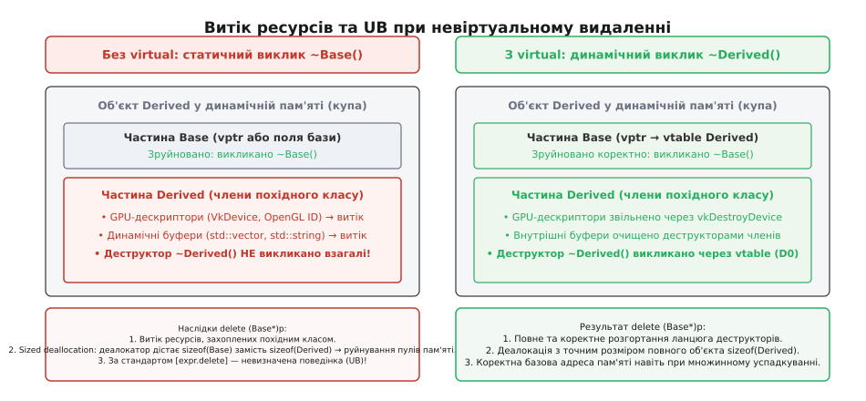
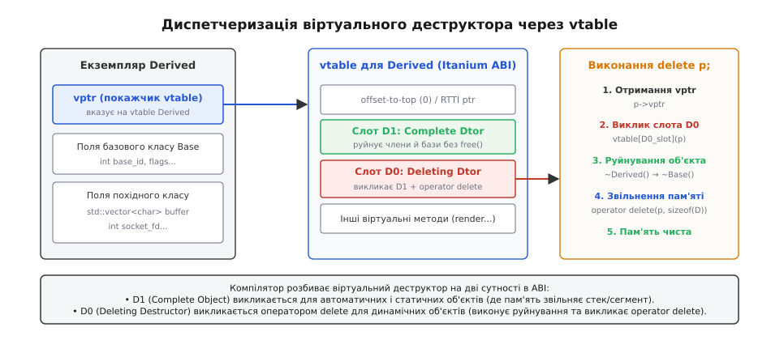
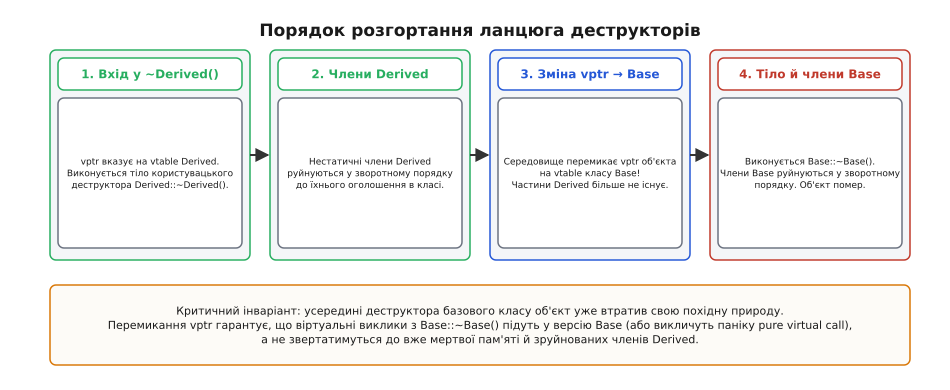
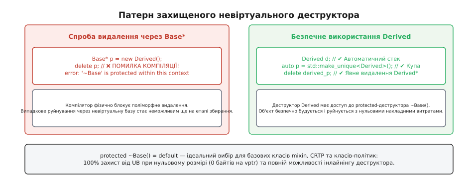

# Віртуальний деструктор і поліморфне видалення

<preknowlist>
- [Конструктор і деструктор](root:sf-lang/constructors-destructors) — деструктор завершує існування об'єкта, повертаючи зайняті ресурси системі.
- [Час життя об'єкта](root:sys-plang-cpp/object-lifetime) — межі існування екземпляра в пам'яті та порядок руйнування його підоб'єктів.
- [Невизначена поведінка (UB)](root:sf-lang/undefined-behavior) — чому оптимізатор компілятора руйнує програму при порушенні фундаментальних правил мови.
- [Правило п'яти й правило нуля](root:sys-plang-cpp/rule-of-five-zero) — як оголошення деструктора впливає на генерацію спеціальних функцій-членів.
- [Оператори new і delete](root:sys-plang-cpp/new-delete-allocation) — поєднання виклику деструктора зі звільненням ділянки динамічної пам'яті.
</preknowlist>

Коли програма на C++ будує абстрактну графічну сцену, мережевий конвеєр або підсистему аудіо, вона маніпулює об'єктами через вказівник на спільний базовий клас. У пам'яті створюється конкретний нащадок, який відкриває дескриптор сокета, виділяє мегабайти відеопам'яті на графічному процесорі або захоплює апаратні м'ютекси. Проте коли час життя цього ресурсу добігає кінця і клієнтський код викликає `delete base_ptr;`, деструктор похідного класу може взагалі не виконатися. Програма не падає в ту саму мілісекунду, але пам'ять витікає, файлові дескриптори вичерпуються, а алокатор пам'яті тихо накопичує пошкодження внутрішніх структур, які вибухнуть за кілька годин безперервної роботи.

Ця пастка не є прикрим недоглядом реалізації компілятора. Вона є прямим наслідком того, як мова C++ обробляє виклики функцій за замовчуванням: якщо метод явно не позначено як віртуальний, компілятор зв'язує його статично на етапі компіляції за типом покажчика, а не за фактичним типом об'єкта в купі.

## Анатомія аварії: що відбувається під час delete через базовий покажчик

Розглянемо типову архітектурну структуру: базовий абстрактний інтерфейс обробника мережевих з'єднань і його конкретну реалізацію на основі зашифрованого TLS-каналу.

```cpp
#include <vector>
#include <cstdint>
#include <iostream>

struct PacketHandler {
    void process() { /* обробка базового кадру */ }
    ~PacketHandler() = default; // Невіртуальний деструктор!
};

struct TlsSecureHandler : PacketHandler {
    int socket_fd{-1};
    std::vector<uint8_t> session_keys;
    uint8_t* ring_buffer{nullptr};

    TlsSecureHandler(int fd, std::size_t buf_size)
        : socket_fd(fd), session_keys(256, 0xAA), ring_buffer(new uint8_t[buf_size]) {}

    ~TlsSecureHandler() {
        delete[] ring_buffer;
        // закриття дескриптора сокета
    }
};
```

Клієнтський код створює об'єкт динамічно й зберігає адресу у вказівнику на базовий тип:

```cpp
PacketHandler* handler = new TlsSecureHandler(42, 65536);
// Робота з поліморфним обробником...
delete handler; // Катастрофа: статичний тип PacketHandler*
```

Під час компіляції виразу `delete handler;` транслятор виконує дві послідовні дії:
1. Викликає деструктор для об'єкта, на який вказує `handler`.
2. Викликає функцію вивільнення пам'яті `operator delete(void*)`, передаючи їй адресу сховища.

Оскільки деструктор `~PacketHandler()` не оголошений зі специфікатором `virtual`, компілятор не має підстав звертатися до динамічної диспетчеризації. Він генерує прямий статичний виклик `PacketHandler::~PacketHandler()`, який є тривіальним і не робить нічого. Деструктор `TlsSecureHandler::~TlsSecureHandler()` **не викликається ніколи**.


*При невіртуальному деструкторі компілятор бачить лише верхівку айсберга: члени похідного класу залишаються неочищеними, а системний алокатор отримує невірні метадані.*

Помилково вважати, що наслідки обмежуються звичайним витоком пам'яті. У реальних системах цей дефект розгортається на чотирьох взаємопов'язаних рівнях руйнування:

По-перше, відбувається **витік системних та апаратних ресурсів**. Буфер `ring_buffer` залишається висіти в купі; динамічний масив `session_keys` не звільняє власну виділену пам'ять, оскільки його деструктор `std::vector::~vector()` не отримав керування; відкритий дескриптор `socket_fd` не повертається операційній системі, що за тривалої роботи сервера призводить до вичерпання ліміту відкритих файлів (`EMFILE`).

По-друге, виникає **невідповідність розміру при вивільненні пам'яті (Sized Deallocation)**. Починаючи зі стандарту C++14, компілятори використовують оптимізовану версію оператора вивільнення `operator delete(void* ptr, std::size_t size)`. Оскільки статичний тип покажчика — `PacketHandler*`, компілятор передає алокатору розмір `sizeof(PacketHandler)` (наприклад, 1 байт або 8 байтів), тоді як насправді в купі було виділено блок розміром `sizeof(TlsSecureHandler)` (понад 48 байтів). Сучасні алокатори (такі як `mimalloc`, `jemalloc` або `tcmalloc`) розподіляють блоки пам'яті за розмірними корзинами (size-segregated bins). Отримавши неправильний розмір, алокатор повертає великий блок у пул дрібних об'єктів. Наступний виклик `new` виділить цей самий блок під маленький об'єкт, тоді як інші структури вважатимуть його вільним, що миттєво спричиняє пошкодження пам'яті (*heap corruption*) та важковловимі збої запису в чужі адреси.

По-третє, стається **катастрофічний зсув адреси при множинному успадкуванні**. Якщо похідний клас успадковує кілька інтерфейсів `struct Derived : BaseA, BaseB`, підоб'єкт `BaseB` розташовується зі зміщенням (offset) відносно початку повного об'єкта `Derived`. Якщо `BaseB` не має віртуального деструктора, виклик `delete static_cast<BaseB*>(p)` передасть у системну функцію `free()` зміщену адресу всередині блоку замість вихідного покажчика, повернутого функцією `malloc()`. Операційна система негайно аварійно завершить процес сигналом `SIGABRT` або помилкою `free(): invalid pointer`.

По-четверте, виникає **невизначена поведінка в оптимізаторі**. Стандарт ISO C++ у розділі `[expr.delete]` однозначно визначає таку операцію як невизначену поведінку (*Undefined Behavior*). Оптимізатор компілятора (GCC, Clang) під час аналізу потоку керування має право вважати, що гілка коду з невизначеною поведінкою є недосяжною (*unreachable*). Це призводить до того, що компілятор може повністю видалити перевірки вказівників на `nullptr`, проігнорувати виклики навколишніх функцій або перевпорядкувати операції введення-виведення так, що логіка програми руйнується задовго до самого моменту видалення об'єкта.

> 🔧 **Навіщо це.** Помилки невіртуального руйнування часто залишаються непоміченими під час коротких модульних тестів, оскільки пам'ять процесу операційна система повертає при завершенні програми. Проте у високонавантажених сервісах, де об'єкти створюються і знищуються мільйони разів на добу, невіртуальний деструктор перетворюється на хронічний витік ресурсів і неминучий збій через накопичене пошкодження метаданих алокатора.

## Механізм віртуального деструктора: диспетчеризація через vtable

Щоб надати деструктору поліморфних властивостей, у базовому класі використовують ключове слово `virtual` (від лат. *virtualis* — можливий, дієвий, здатний до прояву; *destructor* — від лат. *destruere* — руйнувати, розбирати на частини):

```cpp
struct PacketHandler {
    virtual void process() = 0;
    virtual ~PacketHandler() = default; // Віртуальний деструктор
};
```

Оголошення деструктора віртуальним докорінно змінює процес трансляції. Компілятор додає покажчик на таблицю віртуальних методів (*vptr*) у структуру класу (якщо клас ще не мав інших віртуальних функцій) і створює відповідні записи в таблиці віртуальних методів (*vtable*).

Проте деструктор влаштований значно складніше за звичайні віртуальні функції. Звичайний віртуальний метод `virtual void draw()` при перевизначенні повністю замінює собою базовий метод: виконується лише тіло `Derived::draw()`. Деструктор, навпаки, зобов'язаний виконати **каскадне руйнування**: спочатку знищити власні поля класу `Derived`, а потім автоматично передати керування деструкторам базових класів `Base`. До того ж виклик через `delete` вимагає виклику системного вивільнення пам'яті, тоді як руйнування автоматичного (стекового) об'єкта вивільнення динамічної пам'яті не потребує.

Щоб вирішити цю подвійність, двійковий інтерфейс додатків (ABI, зокрема стандартний *Itanium C++ ABI*, що використовується в GCC, Clang, Apple Clang, а також споріднений *MSVC ABI*) генерує для кожного віртуального деструктора кілька окремих функцій:

1. **Повний деструктор об'єкта (Complete Object Destructor, позначається як `D1`):** руйнує всі нестатичні члени поточного класу та викликає деструктори безпосередніх базових класів та віртуальних базових класів, але **не викликає** `operator delete`. Ця функція викликається, коли поліморфний об'єкт створено на стеку чи як статичну змінну.
2. **Деструктор видалення (Deleting Destructor, позначається як `D0`):** спочатку викликає повний деструктор `D1`, а потім негайно здійснює виклик відповідного оператора вивільнення пам'яті `operator delete(ptr, sizeof(Derived))`, передаючи скориговану адресу початку повного об'єкта.
3. **Базовий деструктор (Base Object Destructor, позначається як `D2`):** руйнує члени цього класу та його невіртуальні базові класи, оминаючи віртуальні бази. Використовується як проміжна ланка всередині ланцюга спадкування.


*При виклику delete base_ptr компілятор звертається до слота D0 у таблиці vtable. Деструктор видалення виконує руйнування та коректну деалокацію пам'яті повного типу.*

Коли транслятор зустрічає вираз `delete handler;` для базового класу з віртуальним деструктором, він генерує таку низькорівневу послідовність операцій:

```cpp
// Псевдокод еквіваленту машинних інструкцій
if (handler != nullptr) {
    // 1. Отримати адресу vtable за зміщенням vptr усередині об'єкта
    void** vtable = *reinterpret_cast<void***>(handler);
    // 2. Отримати адресу слота Deleting Destructor (D0)
    using DeletingDtorFn = void(*)(void*);
    DeletingDtorFn dtor = reinterpret_cast<DeletingDtorFn>(vtable[SLOT_D0_DELETING_DTOR]);
    // 3. Непрямий виклик через покажчик на функцію
    dtor(handler);
}
```

Всередині слота `D0` міститься функція `TlsSecureHandler::~TlsSecureHandler() [deleting]`, яка:
- точно знає справжній динамічний розмір об'єкта `sizeof(TlsSecureHandler)`;
- обчислює точний зсув до початку виділеного блоку пам'яті (*offset-to-top*);
- викликає деструктори полів `session_keys`, `ring_buffer` і базового підкласу;
- передає початкову адресу виділеної ділянки в глобальний або перевантажений `operator delete`.

Повний огляд структур vtable, манглювання імен деструкторів в ABI та прапорців діагностики компіляторів наведено в [довіднику специфікації ABI деструкторів](root:sys-plang-cpp/virtual-destructor/api-destruction-dispatch.md).

## Порядок розгортання ланцюга деструкторів

Руйнування поліморфного об'єкта завжди відбувається у суворому порядку, зворотному до порядку конструювання: **згори донизу по ієрархії успадкування** (від найбільш похідного класу до базового).


*Під час проходження ланцюга деструкторів середовище виконання динамічно оновлює vptr: об'єкт поступово «втрачає» свої похідні шари.*

Процес руйнування складається з таких обов'язкових кроків:

1. **Виконання тіла деструктора `Derived::~Derived()`:** на цьому етапі об'єкт все ще є повноцінним екземпляром `Derived`. Покажчик `vptr` вказує на `vtable` класу `Derived`.
2. **Руйнування нестатичних членів `Derived`:** поля похідного класу знищуються у порядку, **зворотному до їхнього оголошення в класі** (а не в порядку списку ініціалізації конструктора).
3. **Зміна контексту типу (оновлення `vptr`):** компілятор вставляє невидимі інструкції, які перезаписують покажчик `vptr` значенням `vtable` базового класу `Base`.
4. **Виконання тіла деструктора `Base::~Base()`:** у цей момент похідної частини об'єкта фізично більше не існує. Її поля вже зруйновано, а пам'ять під ними вважається неініціалізованою.
5. **Руйнування нестатичних членів `Base`:** члени базового класу знищуються у зворотному порядку до їхнього оголошення.
6. **Вивільнення сховища:** якщо об'єкт руйнувався через деструктор видалення `D0`, викликається системний `operator delete`.

З цього випливає фундаментальне правило безпеки C++: **ніколи не викликайте віртуальні методи всередині конструкторів або деструкторів**.

Якщо викликати віртуальний метод `this->process()` всередині тіла `Base::~Base()`, диспетчеризація виконає версію `Base::process()`, а не `Derived::process()`. Оскільки `vptr` на цьому кроці вже перемкнуто на таблицю базового класу, виклик віртуальної функції похідного класу заблоковано мовою навмисно: інакше метод спробував би звернутися до полів `Derived`, які вже перестали існувати на кроці 2, що призвело б до падіння або читання сміття з пам'яті. Якщо ж функція в базовому класі є чисто віртуальною (`= 0`), виклик призведе до миттєвої аварії процесу `pure virtual method called` (`std::terminate`).

Ще один критичний аспект стосується безпеки винятків: за замовчуванням усі деструктори в C++11 і новіших стандартах вважаються неявно позначеними як `noexcept(true)`. Якщо деструктор кидає виняток під час розкрутки стека через інший виняток, середовище виконання негайно викликає `std::terminate()`. Руйнування об'єкта має бути гарантовано безпомилковим.

## Множинне та віртуальне успадкування: VTT та зміщення баз

При використанні множинного успадкування топологія об'єкта ускладнюється: екземпляр містить кілька незалежних покажчиків `vptr` — по одному для кожної базової гілки ієрархії.

Коли похідний клас `Derived` успадковує `BaseA` та `BaseB`, об'єкт у пам'яті має такий вигляд:
- на нульовому зміщенні розташовано підоб'єкт `BaseA` зі своїм `vptr_BaseA`;
- на зміщенні `+sizeof(BaseA)` розташовано підоб'єкт `BaseB` зі своїм `vptr_BaseB`;
- далі розташовано власні поля `Derived`.

Якщо клієнтський код викликає `delete static_cast<BaseB*>(ptr)`, деструктор `BaseB` зобов'язаний знати, де починається повний об'єкт `Derived`. Для цього компілятор генерує **адаптивний перехідник** (*adjustor thunk*), який зчитує з vtable зміщення до вершини (*offset-to-top*) і коригує покажчик `this` перед викликом деструктора видалення.

Ще складнішим є **віртуальне успадкування** (ромбоподібне успадкування, *diamond inheritance*), коли кілька проміжних класів віртуально успадковують спільну базу `virtual public Root`. За правилами мови C++, спільна віртуальна база `Root` повинна існувати в пам'яті в єдиному екземплярі та руйнуватися рівно один раз.

Щоб запобігти повторному виклику деструктора віртуальної бази:
1. За руйнування віртуальної бази відповідає **лише повний деструктор об'єкта `D1`** найбільш похідного класу (*most derived class*);
2. Базові деструктори `D2` проміжних класів взагалі не містять коду руйнування віртуальної бази;
3. Для правильного перемикання віртуальних таблиць під час руху по ланцюгу деструкторів компілятор генерує спеціальну допоміжну таблицю — **VTT** (*Virtual Table Table*), адреса якої передається неявним прихованим параметром у всі проміжні деструктори.

## Правило п'яти і наслідки оголошення віртуального деструктора

Оголошення віртуального деструктора в базовому класі — це явне втручання програміста в набір спеціальних функцій-членів. Згідно зі стандартом C++11 і новішими версіями, наявність користувацького деструктора (навіть якщо він визначений як `= default;`) докорінно змінює неявну генерацію операцій переміщення та копіювання:

1. **Конструктор переміщення (Move Constructor)** і **оператор присвоєння переміщенням (Move Assignment Operator)** **НЕ генеруються компілятором автоматично** (вони взагалі відсутні в класі).
2. **Конструктор копіювання** і **оператор копіювального присвоєння** генеруються за замовчуванням, проте їхнє автоматичне створення при наявності деструктора позначено в стандарті як застаріле (*deprecated*).

Якщо базовий клас оголошує лише деструктор:

```cpp
class Shape {
public:
    virtual void draw() const = 0;
    virtual ~Shape() = default; // Пригнічує генерацію move-операцій!
};
```

Спроба перемістити такий об'єкт (`std::move(shape)`) призведе до того, що компілятор мовчки виконає **дороге глибоке копіювання** замість переміщення (якщо конструктор копіювання доступний), або видасть помилку компіляції, якщо клас містить непереміщувані поля (наприклад, `std::unique_ptr`).

Для поліморфних класів застосовують один із двох канонічних патернів Правила п'яти.

### Патерн 1: Інтерфейсний базовий клас (Заборона зрізання та копіювання)

Поліморфні класи майже завжди передаються за посиланням або через розумні вказівники (`std::unique_ptr<Interface>`). Пряме копіювання або переміщення поліморфних об'єктів за значенням призводить до небезпечного дефекту — **зрізання об'єкта** (англ. *object slicing*), коли копіюється лише базовий підклас, а вся похідна частина відкидається.

Тому канонічний інтерфейс C++ повинен явно забороняти копіювання та переміщення:

```cpp
class IService {
public:
    virtual ~IService() = default;

    // Заборона зрізання об'єктів
    IService(const IService&) = delete;
    IService& operator=(const IService&) = delete;
    IService(IService&&) = delete;
    IService& operator=(IService&&) = delete;

    virtual void execute() = 0;
};
```

### Патерн 2: Базовий клас із підтримкою переміщення та копіювання

Якщо базовий клас має нетривіальний стан і вимагає підтримки семантики переміщення у похідних класах, усі 5 спеціальних методів оголошуються явно:

```cpp
class PolymorphicEntity {
public:
    virtual ~PolymorphicEntity() = default;

    PolymorphicEntity(const PolymorphicEntity&) = default;
    PolymorphicEntity& operator=(const PolymorphicEntity&) = default;
    PolymorphicEntity(PolymorphicEntity&&) noexcept = default;
    PolymorphicEntity& operator=(PolymorphicEntity&&) noexcept = default;

    virtual void update() = 0;
};
```

Якщо поліморфний клас повинен надавати можливість глибокого копіювання, замість конструктора копіювання застосовують віртуальний метод клонування (*virtual clone pattern*):

```cpp
class ICloneable {
public:
    virtual ~ICloneable() = default;
    virtual std::unique_ptr<ICloneable> clone() const = 0;
};
```

## Чистий віртуальний деструктор

Іноді виникає потреба створити суто абстрактний базовий клас, від якого неможливо створити екземпляр безпосередньо, проте в класі немає жодної логічної функції, яку можна було б зробити чисто віртуальною (`= 0`). Усі методи базового класу вже мають готову реалізацію за замовчуванням.

У такому разі чисто віртуальним оголошують деструктор:

```cpp
class AbstractTransaction {
public:
    virtual void log() const {
        // Загальна реалізація журналювання
    }

    // Робить клас суто абстрактним
    virtual ~AbstractTransaction() = 0;
};
```

Тепер створити об'єкт `AbstractTransaction t;` неможливо — компілятор видасть помилку.

### Обов'язковість визначення тіла чисто віртуального деструктора

Тут криється одна з найпідступніших пасток мови. Для звичайної чисто віртуальної функції `virtual void commit() = 0;` надавати тіло необов'язково: нащадок просто перевантажує її, і базове тіло ніколи не викликається.

Для чисто віртуального деструктора надання тіла є **суворо обов'язковим**:

```cpp
// У файлі AbstractTransaction.cpp (або в заголовку поза тілом класу)
AbstractTransaction::~AbstractTransaction() = default; // або {}
```

Якщо це визначення пропустити, програма скомпілюється без попереджень, але на етапі зв'язування компонувальник видасть помилку:

```text
undefined reference to `AbstractTransaction::~AbstractTransaction()'
```

Причина полягає в уже розглянутому механізмі ланцюга деструкторів: коли знищується екземпляр `ConcreteTransaction`, його деструктор після виконання власного тіла неявно генерує виклик деструктора безпосереднього базового класу `AbstractTransaction::~AbstractTransaction()`. Якщо машинний код для `~AbstractTransaction()` відсутній у бінарних файлах, компонувальник не може закрити адресу переходу.

## Альтернатива: захищений невіртуальний деструктор

Віртуальний деструктор — потужний інструмент, але він не є безкоштовним. Додавання `virtual` до класу тягне за собою накладні витрати:
- **8 байтів на екземпляр** для зберігання покажчика `vptr` (на 64-бітних платформах) плюс додаткове вирівнювання структури;
- втрату статусу **стандартного розташування** (*Standard Layout*) та тривіальної копійованості (*Trivially Copyable*);
- неможливість вбудовування (*inlining*) виклику деструктора, коли об'єкт знищується через абстрактний інтерфейс.

Якщо базовий клас створюється виключно для повторного використання коду (патерн *Mixin* / домішка), статичного поліморфізму (шаблонний патерн *CRTP* — *Curiously Recurring Template Pattern*) або як клас стратегії чи політики, він **ніколи не повинен видалятися через вказівник на базовий тип**.

У цьому сценарії канонічним рішенням C++ є **захищений невіртуальний деструктор** (*protected non-virtual destructor*):

```cpp
class NonDeletableMixin {
protected:
    ~NonDeletableMixin() = default; // Не віртуальний, але захищений!

public:
    void utility_helper() { /* спільний функціонал */ }
};

class ConcreteWorker : public NonDeletableMixin {
public:
    ~ConcreteWorker() = default; // Публічний деструктор нащадка
};
```


*Захищений деструктор робить небезпечне видалення помилкою компіляції, не додаючи жодного байта vptr до об'єкта.*

Як працює цей захист:

1. Спроба поліморфного видалення через вказівник на базу призводить до **помилки компіляції**:
   ```cpp
   NonDeletableMixin* ptr = new ConcreteWorker();
   delete ptr; // ПОМИЛКА: ~NonDeletableMixin() захищений (protected)
   ```
   Компілятор фізично забороняє виклик `delete`, оскільки клієнтський код поза межами класу не має доступу до `protected`-членів. Небезпечна ситуація блокується на етапі компіляції.
2. Легальне використання нащадків працює без обмежень:
   ```cpp
   ConcreteWorker worker; // Автоматичний стек: деструктор викликається вільно
   auto p = std::make_unique<ConcreteWorker>(); // Створення в купі працює коректно
   ```
   Деструктор `ConcreteWorker::~ConcreteWorker()` має повний доступ до захищеного деструктора власної бази `NonDeletableMixin::~NonDeletableMixin()`, тому ланцюг руйнування розгортається безперешкодно.
3. **Накладні витрати дорівнюють нулю:** клас не містить `vptr`, не потребує таблиці `vtable`, а деструктор повністю вбудовується компіляторним оптимізатором у машинний код.

## Поліморфне володіння й розумні вказівники: unique_ptr проти shared_ptr

Сучасний C++ практично виключає використання сирих операторів `delete`, делегуючи керування пам'яттю розумним вказівникам `std::unique_ptr` та `std::shared_ptr`. Проте їхня поведінка щодо віртуальних деструкторів кардинально різниться.

### std::unique_ptr вимагає віртуального деструктора

`std::unique_ptr<Base>` за замовчуванням використовує видаляч `std::default_delete<Base>`, який містить прямий виклик `delete ptr;`.

```cpp
std::unique_ptr<PacketHandler> p = std::make_unique<TlsSecureHandler>(10, 1024);
// Під час виходу p з області видимості:
// default_delete викликає: delete static_cast<PacketHandler*>(raw_ptr);
```

Якщо `PacketHandler` не має віртуального деструктора, виникає та сама невизначена поведінка (UB) з витоком ресурсів та пошкодженням купи. Для використання нащадків через `std::unique_ptr<Base>` **віртуальний деструктор у базі є безумовно обов'язковим**.

Якщо ж базовий клас з якихось причин не має віртуального деструктора, але об'єктом необхідно володіти монопольно, застосовують кастомний видаляч (*custom deleter*), який фіксує точний тип нащадка:

```cpp
auto custom_deleter = [](PacketHandler* ptr) {
    delete static_cast<TlsSecureHandler*>(ptr);
};
std::unique_ptr<PacketHandler, decltype(custom_deleter)> safe_ptr(
    new TlsSecureHandler(1, 1024), custom_deleter
);
```

### Стирання типу в std::shared_ptr

`std::shared_ptr<Base>` має унікальну внутрішню архітектуру. Під час створення екземпляра через `std::make_shared<Derived>()` або конструктор `std::shared_ptr<Base>(new Derived())`, розумний вказівник створює контрольний блок (*control block*), у якому фіксує точний динамічний тип об'єкта через механізм **стирання типу** (*type erasure*).

```cpp
struct BaseWithoutVirtual {
    ~BaseWithoutVirtual() = default; // Не віртуальний!
};

struct DerivedWithResource : BaseWithoutVirtual {
    int* data{new int[100]};
    ~DerivedWithResource() { delete[] data; }
};

// Створення shared_ptr:
std::shared_ptr<BaseWithoutVirtual> ptr = std::make_shared<DerivedWithResource>();
// При руйнуванні ptr деструктор ~DerivedWithResource() БУДЕ викликано!
```

Контрольний блок `shared_ptr` зберігає покажчик на функцію вивільнення конкретного типу `DerivedWithResource`. Коли лічильник сильних посилань падає до нуля, контрольний блок викликає збережений видаляч для `DerivedWithResource`, навіть якщо базовий клас взагалі не мав віртуального деструктора.

> ⚠️ **Архітектурне застереження:** Хоча `std::shared_ptr` технічно здатний коректно знищити об'єкт без віртуального деструктора в базі, спиратися на цю особливість під час проектування класів суворо не рекомендується. Якщо в майбутньому хтось збереже такий об'єкт у `std::unique_ptr`, передасть його у сторонню бібліотеку чи застосує сирий `delete`, програма миттєво повернеться до стану невизначеної поведінки.

Практичні експерименти з перевіркою витоків під AddressSanitizer, поведінкою множинного успадкування та зміщенням адрес детально розібрано в [практикумі дослідження поліморфного руйнування](root:sys-plang-cpp/virtual-destructor/proj-polymorphic-destruction.md). Історію формування цих правил від перших версій Cfront до C++14 розкрито в [історичному нарисі еволюції віртуальних деструкторів](root:sys-plang-cpp/virtual-destructor/hist-virtual-destructor.md).

## Ручне керування часом життя та розміщувальний new

Особливе місце в системному програмуванні займає робота з кастомними контейнерами, пулами пам'яті та розміщувальним оператором створення (*placement new*). Коли пам'ять виділяється вручну з попередньо виділеного буфера:

```cpp
alignas(Derived) char storage[sizeof(Derived)];
Base* p = new (storage) Derived();
```

Звільнення пам'яті через звичайний `delete p;` тут категорично заборонено, оскільки буфер `storage` розташовано на стеку, а не в купі системного алокатора. Для завершення часу життя об'єкта деструктор викликається явно вручну:

```cpp
p->~Base(); // Явний виклик деструктора через покажчик на базу
```

Якщо `~Base()` є віртуальним, виклик `p->~Base()` успішно диспетчеризується через vtable. Проте в цьому разі компілятор звертається не до деструктора видалення `D0`, а до повного деструктора `D1` (*Complete Object Destructor*). Він акуратно руйнує всі поля `Derived` та `Base`, але **не робить спроби повернути пам'ять буфера алокатору**.

Якщо ж у цій ситуації деструктор базового класу не був оголошений як віртуальний, прямий виклик `p->~Base()` виконає лише базове тіло, залишивши всі ресурси `Derived` неочищеними в пам'яті буфера. Це ще раз доводить, що потреба у віртуальному деструкторі випливає не лише з оператора `delete`, а з фундаментальної необхідності поліморфного завершення часу життя об'єкта.

## Матриця вибору архітектурного рішення

Під час проектування будь-якого класу в C++ питання деструктора має вирішуватися за чітким детермінованим алгоритмом.

```
                     Чи планується успадкування від цього класу?
                                   │
                   ┌───────────────┴───────────────┐
                  ТАК                              НІ
                   │                               │
        Чи буде видалення через             Клас є листовим (кінцевим):
        покажчик на базовий клас?          публічний невіртуальний деструктор
                   │                       (бажано позначити клас як final)
        ┌──────────┴──────────┐            class Leaf final { ~Leaf() = default; };
       ТАК                    НІ
        │                      │
Базовий поліморфний клас:   Базовий клас для домішок/CRTP/політик:
публічний віртуальний        захищений невіртуальний деструктор
деструктор                   protected: ~Base() = default;
virtual ~Base() = default;
```

| Призначення класу | Оголошення деструктора | Доступність `delete base_ptr` | Накладні витрати (vptr) | Приклад використання |
| :--- | :--- | :--- | :--- | :--- |
| **Поліморфний інтерфейс** | `public: virtual ~Base() = default;` | Дозволено (коректно) | 8 байтів | `std::unique_ptr<Shape>` |
| **Суто абстрактна база** | `public: virtual ~Base() = 0;` *(із тілом)* | Дозволено (коректно) | 8 байтів | Базовий клас без інших pure virtual методів |
| **Домішка / CRTP / Політика** | `protected: ~Base() = default;` | Заборонено (помилка компіляції) | **0 байтів** | `std::enable_shared_from_this`, Mixin |
| **Кінцевий клас значення** | `public: ~Leaf() = default;` *(final)* | Небезпечно (якщо привести до бази) | **0 байтів** | `std::vector`, `std::complex`, кінцеві DTO |

Дотримання цього правила усуває цілий клас критичних помилок керування пам'яттю, гарантуючи передбачуваний час життя об'єктів та найвищу ефективність згенерованого машинного коду.
