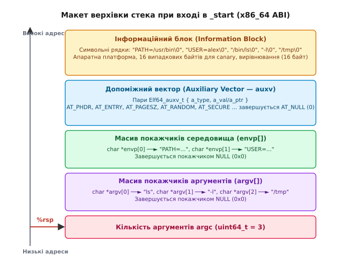
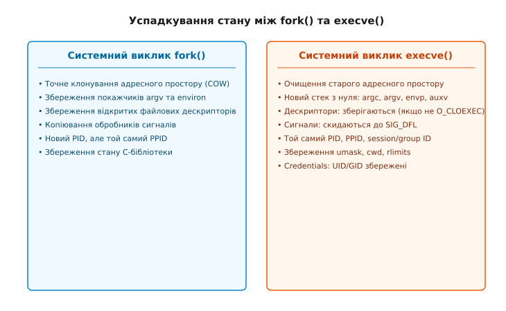

# Аргументи, оточення й що успадковує дитина

<preknowlist>
- [fork](root:sys-unix/fork-semantics) — дублювання процесу, копіювання стану й адресного простору.
- [exec](root:sys-unix/exec-semantics) — заміна образу процесу новим виконуваним файлом.
- [Ядро й простір користувача](root:sys-unix/kernel-and-userspace) — межа між кодом користувача та операційною системою.
</preknowlist>

Запуск сценарію видалення файлів `rm *` у каталозі з 300 000 об'єктів миттєво завершується помилкою оболонки `Argument list too long` (код помилки `E2BIG`), навіть якщо вільна оперативна пам'ять вимірюється гігабайтами. Водночас спроба передати змінну середовища `LD_PRELOAD=/tmp/malicious.so` для програми із встановленим бітом SetUID ігнорується ядром, і завантаження стороннього коду не відбувається. Обидві ситуації є прямим наслідком того, як операційна система Linux формує початковий стек нового процесу в мить системного виклику `execve()`, як саме розраховуються межі масивів аргументів та що саме передається дитячому процесу у спадок від батька.

У філософії Unix процес не виникає "з нічого" й не створюється однією монолітною операцією. Модель розділення системних викликів на `fork()` (дублювання існуючого процесу) та `execve()` (завантаження нового виконуваного коду) вимагає суворого контракту передачі контексту. Цей контекст складається з трьох фундаментальних елементів: аргументів командного рядка (`argv`), змінних оточення (`environ`) та допоміжного вектора ядра (`auxv`).

## 1. Механіка народження процесу: fork() проти execve()

Коли користувач вводить команду у терміналі, оболонка (наприклад, Bash або Zsh) виконує послідовність дій, у якій чітко розмежовані створення нового процесу та заміна його віртуального адресного простору. Системний виклик `fork()` створює повну точну копію батьківського процесу за допомогою механізму "копіювання при записі" (Copy-On-Write, COW). Дитячий процес отримує той самий дублікат таблиці сторінок пам'яті, ті самі відкриті файлові дескриптори, ті самі змінні середовища та обробники сигналів.

Проте запуск іншої програми вимагає очищення старого коду й завантаження виконуваного файлу ELF (Executable and Linkable Format). Цю задачу виконує системний виклик `execve()`:

:::tabs
```c
/* Сигнатура execve мовою C */
#include <unistd.h>

int execve(const char *pathname, char *const argv[], char *const envp[]);
```
```cpp
// C++ оголошення execve у просторі імен POSIX
#include <unistd.h>

extern "C" {
int execve(const char *pathname, char *const argv[], char *const envp[]);
}
```
:::

Коли дитячий процес викликає `execve()`, ядро Linux знищує всі існуючі відображення пам'яті (коду, даних, купи та стека), налаштовує нову таблицю сторінок і відображає сегменти виконуваного файлу з диска. Проте нова програма повинна отримати текстові параметри запуску та конфігурацію оточення. Оскільки старої купи й стека більше не існує, ядро власноруч будує новий початковий стек користувача, укладаючи туди масиви рядків `argv` та `envp` ще до того, як процесор виконає першу інструкцію програми.

```
[Батьківський процес (Shell)] ──fork()──► [Дитячий процес (Клон)] ──execve()──► [Нова програма]
  - Власна пам'ять                          - Копія пам'яті (COW)                   - Очищена пам'ять
  - Власні дескриптори                     - Збережені дескриптори                 - Новий стек користувача
```

Перехід між цими станами визначає правила успадкування: ядро зберігає ідентифікаційні параметри процесу (PID, PPID, права доступу), але повністю скидає та переініціалізує його адресний простір.

### Глибокий шлях execve усередині ядра Linux

Усередині ядра Linux виконання `execve()` проходить через кілька фундаментальних фаз підсистеми VFS та планувальника (файли `fs/exec.c` та `fs/binfmt_elf.c`):

1. **Перевірка прав доступу та відкриття файлу**: Ядро шукає виконуваний файл за шляхом `pathname`, перевіряє наявність прапорця виконання `S_IXUSR`/`S_IXGRP`/`S_IXOTH` та відкриває файловий дескриптор ядра.
2. **Визначення бінарного формату**: Ядро зчитує перші 128 байтів файлу (структура `linux_binprm`). Якщо виявляються чарівні байти ELF `\x7fELF`, керування передається завантажувачу `load_elf_binary()`. Якщо файл починається з `#!`, ядро зчитує шлях до інтерпретатора (наприклад, `/bin/bash` або `/usr/bin/python3`) та формує новий масив аргументів, де інтерпретатор стає новою програмою.
3. **Виділення тимчасових сторінок під стек**: Ядро виділяє тимчасові сторінки пам'яті у просторі ядра та копіює туди рядки `argv` та `envp` із простору батьківського процесу за допомогою внутрішньої функції `copy_strings()`.
4. **Знищення старого адресного простору**: Функція `flush_old_exec()` знищує стару таблицю сторінок (`mm_struct`), закриває файлові дескриптори з прапорцем `O_CLOEXEC` та скидає обробники сигналів.
5. **Розміщення нового стека та відображення ELF**: Ядро створює новий стек користувача вгорі адресного простору, копіює туди сформовані рядки, будує масиви покажчиків `argv`, `envp` та `auxv`, після чого відображає сегменти `.text`, `.data`, `.bss` виконуваного файлу ELF та передає керування на точку входу.

## 2. Анатомія початкового стека на старті процесу

У мить, коли ядро Linux завершує виконання `execve()` і передає керування у простір користувача на точку входу програми (найчастіше це символ `_start`), регистр покажчика стека `%rsp` (на архітектурі x86_64) вказує на суворо структуровану область пам'яті.

Стандарт System V AMD64 ABI визначає розташування даних на верхівці стека. Стек зростає від вищих адрес пам'яті до нижчих, тому ядро розміщує дані у напрямку від "верхніх" адрес до "нижчих".


*Макет верхівки стека на старті процесу x86_64: розміщення argc, масивів покажчиків argv, envp та auxv.*

Макет початкового стека складається з п'яти послідовних секцій (згори донизу):

1. **Інформаційний блок (Information Block)**: Розташований на найвищих адресах. Тут фізично зберігаються самі символьні рядки, розділені нульовим байтом `\0`: рядки аргументів (`"ls\0"`, `"-l\0"`), рядки середовища (`"PATH=/bin\0"`), назва виконуваного файлу, а також 16 випадкових байтів, що використовуються для ініціалізації захисного бар'єра стека (stack canary).
2. **Допоміжний вектор (Auxiliary Vector, `auxv`)**: Масив пар цілих чисел або покажчиків структури `Elf64_auxv_t`, що передає системні параметри від ядра безпосередньо динамічному лінкеру. Завершується елементом з типом `AT_NULL` (`0`).
3. **Масив покажчиків середовища (`envp`)**: Список 64-бітних адрес, кожна з яких вказує на відповідний рядок `KEY=VALUE` в Інформаційному блоці. Завершується покажчиком `NULL` (`0x0000000000000000`).
4. **Масив покажчиків аргументів (`argv`)**: Список 64-бітних адрес, що вказують на рядки аргументів у Інформаційному блоці. Завершується покажчиком `NULL`.
5. **Кількість аргументів (`argc`)**: 64-бітне ціле число на самому дні стека. Саме на це число вказує регістр `%rsp` під час переходу у простір користувача.

Важливою вимогою ABI є вирівнювання покажчика стека. Перед викликом функції точки входу стек повинен бути вирівняний по межі 16 байт. Якщо ядро або завантажувач порушать це правило, перша ж інструкція SSE/AVX (наприклад, `movaps`), яка вимагає 16-байтового вирівнювання адреси, викликає апаратне виключення й падіння процесу з помилкою `Segmentation fault`.

### Математика вирівнювання стека

На архітектурі x86_64 інструкція виклику функції `call` поміщає 8-байтову адресу повернення на стек. Це означає, що при вході у будь-яку C-функцію значення стекового регістру `%rsp` задовольняє умову:

```
(%rsp + 8) % 16 == 0
```

Код точки входу `_start` у файл `crt1.o` виконує асемблерне вирівнювання стека перед викликом `__libc_start_main`:

```assembly
movq (%rsp), %rdi       /* rdi = argc */
leaq 8(%rsp), %rsi      /* rsi = argv */
andq $-16, %rsp         /* Маскування нижніх 4 біт: %rsp = %rsp & ~0xF */
call __libc_start_main
```

Маскування `andq $-16, %rsp` обнуляє останні 4 біти адреси, гарантуючи, що покажчик стека вирівняний на 16-байтову межу. Це відвертає збої при виконанні векторизованих інструкцій пристрою SIMD.

## 3. Аргументи командного рядка: argc та argv

Кількість аргументів `argc` (argument count) є цілим неотрицательним числом. Масив `argv` (argument vector) містить покажчики на `argc` рядків, плюс один додатковий кінцевий покажчик `NULL`. Порядок розміщення покажчиків у пам'яті суворо відповідає порядку передачі аргументів системному виклику `execve()`.

Згідно зі стандартом POSIX та мови C, елемент `argv[0]` за домовленістю містить ім'я програми або шлях, за яким її було викликано. Проте важливо розуміти: `argv[0]` створюється викликаючим (батьківським) процесом і не є верифікованим шляхом з боку ядра.

Якщо батьківський процес виконає системний виклик:

:::tabs
```c
/* Запуск програми C з довільним argv[0] */
#include <unistd.h>

char *args[] = { "custom_name", "-v", NULL };
execve("/usr/bin/app", args, envp);
```
```cpp
// Запуск програми C++ з довільним argv[0]
#include <vector>
#include <string>
#include <unistd.h>

std::vector<std::string> arg_strs = {"custom_name", "-v"};
std::vector<char*> args = {arg_strs[0].data(), arg_strs[1].data(), nullptr};
::execve("/usr/bin/app", args.data(), envp);
```
:::

То для програми `app` значення `argv[0]` дорівнюватиме `"custom_name"`, хоча справжній виконуваний файл лежить за адресою `/usr/bin/app`. Справжній шлях до двійкового файлу ядро зберігає у файловій системі procfs за адресою `/proc/self/exe` (символічне посилання на vnode/inode).

### Модифікація argv та зміна імені процесу у ps

Системні утиліти моніторингу, такі як `ps`, `top` або `htop`, зчитують аргументи командного рядка процесів через віртуальний файл `/proc/[pid]/cmdline`. Ядро Linux віддає вміст цього файлу безпосередньо з Інформаційного блоку стека процесу, зчитуючи пам'ять від адреси `argv[0]` до кінця останнього аргументу.

Це створює можливість для програм змінювати своє ім'я під час виконання. Багатосистемні сервери (наприклад, PostgreSQL або Nginx) перезаписують буфер `argv[0]`, щоб відображати поточний стан робочого процесу:

```
postgres: checkpointer process
nginx: worker process process_id 4096
```

Проте прямий перезапис `argv[0]` приховує небезпеку. Рядки в Інформаційному блоці розташовані підряд у суцільному шматку пам'яті. Якщо новий рядок стану довший за початковий `argv[0]`, просте копіювання через `strcpy()` вийде за межі першого масиву й незворотньо зруйнує наступні елементи `argv[1]`, `argv[2]` та масив змінних середовища `environ`.

Для безпечного перезапису імені програма повинна спочатку виділити нову пам'ять у купі (heap), повністю скопіювати туди всі рядки `environ` та `argv`, обчислити сумарний розмір початкового Інформаційного блоку і лише після цього безпечно заповнити його новими символами, заповнивши залишок нульовими байтами `\0`. Замість маніпуляцій зі стеком Linux пропонує спеціальний системний виклик `prctl(PR_SET_NAME, "new_name")`, проте він обмежує довжину імені 16 байтами (включаючи нульовий термінатор).

## 4. Середовище процесу: environ та export

Змінні середовища являють собою масив рядків у форматі `KEY=VALUE`, де `KEY` — це ідентифікатор (назва змінної), а `VALUE` — її текстове значення. Пошук змінних у цьому масиві є регістрозалежним.

На відміну від аргументів командного рядка, які змінюються при кожному виклику конкретної утиліти, середовище призначене для передачі гнучкого операційного контексту між цілими каскадами процесів.

Взаємодія з середовищем у мові C реалізується через глобальну змінну:

:::tabs
```c
/* Глобальний покажчик середовища у C */
#include <stdlib.h>

extern char **environ;
```
```cpp
// Глобальний покажчик середовища у C++
#include <cstdlib>

extern "C" {
extern char **environ;
}
```
:::

Коли програма викликає функцію `getenv("PATH")`, стандартна бібліотека C (glibc або musl) виконує лінійне сканування масиву `environ`. Вона порівнює початок кожного рядка до символу `=` із шуканим ключем.

```
environ ──► [ ptr0 ] ──► "PATH=/usr/bin:/bin\0"
            [ ptr1 ] ──► "USER=alex\0"
            [ ptr2 ] ──► "HOME=/home/alex\0"
            [ NULL ]
```

### Експорт змінних в оболонці Shell

У командній оболонці слід чітко розрізняти **локальні змінні оболонки** та **експортовані змінні середовища**:

```bash
# Створення локальної змінної оболонки (зберігається у внутрішній таблиці хешів Bash)
VAR="secret_value"

# Перетворення локальної змінної у змінну середовища
export VAR

# Одноразова передача змінної середовища дитячому процесу без зміни середовища оболонки
LOG_LEVEL=debug ./my_application
```

Локальна змінна `VAR="secret_value"` існує виключно у пам'яті процесу оболонки. Коли оболонка викликає `fork()` та `execve()`, вона не додає локальні змінні до масиву `envp`, переданого ядру. Тільки після виконання команди `export VAR` ця змінна потрапляє до внутрішнього масиву середовища оболонки і передається дитячим процесам під час запусків.

### Ключові змінні середовища системного виконання

- `PATH`: Список каталогів, розділених двокрапкою `:`, у яких оболонка та бібліотечні функції `execvp()`/`execlp()` шукають виконувані файли.
- `LD_LIBRARY_PATH`: Список каталогів, у яких динамічний лінкер `ld.so` виконує пошук спільних бібліотек (`.so`) перед стандартними каталогами `/lib64` та `/usr/lib64`.
- `LD_PRELOAD`: Список конкретних бібліотек, які динамічний лінкер зобов'язаний завантажити першими, що дозволяє перевизначати (interpose) будь-які C-функції.
- `LANG`, `LC_ALL`, `LC_CTYPE`: Налаштування локалізації, кодування символів (UTF-8) та мовних правил сортування.
- `HOME`, `USER`, `SHELL`: Контекст поточного сеансу користувача, що визначає шлях до конфігураційних файлів та назву оболонки за замовчуванням.

Детальний аналіз еволюції цього механізму — від 16-бітних версій Unix до створення універсального масиву середовища в 1979 році — винесено в окремий матеріал [Історія виникнення змінних середовища та допоміжного вектора](root:sys-unix/argv-and-environment/hist-environment-variables.md).

## 5. Допоміжний вектор (auxv): За лаштунками завантаження ELF

Коли ядро завантажує виконуваний файл у форматі ELF, новоствореному процесу потрібно дізнатися інформацію про апаратну платформу та параметри ядра. Для статично скомпонованих програм ці дані потрібні C Runtime (CRT), а для динамічних програм — насамперед динамічному лінкеру (`ld-linux.so`).

Якби динамічний лінкер мусив робити серію системних викликів (`sys_getpagesize()`, `sys_getuid()`, `sys_uname()`) при кожному запуску кожної програми, накладні витрати на перетин межі ядра знизили б продуктивність системи.

Для розв'язання цієї проблеми ядро формує на стеку **допоміжний вектор (Auxiliary Vector, `auxv`)**. Він складається зі структур `Elf64_auxv_t`:

:::tabs
```c
/* Структура допоміжного вектора C */
#include <stdint.h>

typedef struct {
    uint64_t a_type; /* Тип запису (константа AT_*) */
    union {
        uint64_t a_val; /* Цілочисельне значення */
        void *a_ptr;    /* Вказівник на пам'ять */
    } a_un;
} Elf64_auxv_t;
```
```cpp
// C++ структура допоміжного вектора (з підтримкою std::cstdint)
#include <cstdint>

typedef struct {
    uint64_t a_type;
    union {
        uint64_t a_val;
        void *a_ptr;
    } a_un;
} Elf64_auxv_t;
```
:::

### Ключові записи допоміжного вектора

- `AT_PHDR` (3): Адреса програмних заголовків ELF у пам'яті. Завдяки цьому лінкер відразу бачить структуру сегментів коду та даних.
- `AT_PHENT` (4): Розмір одного програмного заголовка ELF у байтах.
- `AT_PHNUM` (5): Кількість програмних заголовків у таблиці ELF.
- `AT_PAGESZ` (6): Розмір сторінки віртуальної пам'яті в байтах (зазвичай `4096` або `65536`).
- `AT_BASE` (7): Базова адреса завантаження самого динамічного лінкера у віртуальній пам'яті.
- `AT_ENTRY` (9): Справжня точка входу в програму користувача (куди лінкер передасть керування після завершення зв'язування).
- `AT_RANDOM` (25): Вказівник на 16 випадкових байтів, згенерованих ядровим генератором CSPRNG. Використовується для ініціалізації значення канарейки стека (`__stack_chk_guard`) без системного виклику.
- `AT_SECURE` (23): Бінарний прапорець (`0` або `1`). Вказує, чи заповнено процес у режимі підвищеної безпеки.

Прапорець `AT_SECURE` має вирішальне значення для безпеки Linux. Якщо програма має біт SetUID (наприклад, `/usr/bin/passwd`) або SetGID, ядро встановлює `AT_SECURE = 1`.

Коли динамічний лінкер бачить `AT_SECURE = 1`, він **ігнорує** небезпечні змінні середовища `LD_PRELOAD` та `LD_LIBRARY_PATH`. Це унеможливлює атаку, при якій звичайний користувач підставляє власну зловмисну бібліотеку в SetUID-процес, що виконується від імені `root`.

## 6. Стартова дистанція C Runtime (CRT)

Програміст пише точку входу `int main(int argc, char *argv[])`, проте вона не є справжньою першою функцією, яку викликає процесор. Точкою входу у заголовку ELF зазвичай вказано низкорівневий символ `_start`, написаний мовою асемблера (входить до складу `crt1.o`).

Код `_start` виконує вилучення початкових даних зі стека:

```text
1. Зчитує argc із верхівки стека (%rsp) та кладе у регістр %rdi (перший аргумент System V ABI).
2. Обчислює адресу argv (%rsp + 8) та кладе у регістр %rsi (другий аргумент).
3. Обчислює адресу envp (%rsp + 8 + argc*8 + 8) та зберігає у глобальну змінну environ.
4. Вирівнює стек по межі 16 байт (за допомогою інструкції andq $-16, %rsp).
5. Викликає функцію ініціалізації C-бібліотеки __libc_start_main().
```

Функція `__libc_start_main()` виконує глобальну ініціалізацію:
- Зчитує `auxv` та налаштовує розмір сторінки і вибір оптимізованих функцій (IFUNC, наприклад SIMD-версії `memcpy`).
- Ініціалізує потік виконання, підсистему потоків (pthreads) та захист стека.
- Викликає глобальні конструктори (секції `.init` та `.init_array`, зокрема глобальні об'єкти в C++).
- Нарешті викликає вашу функцію `main(argc, argv, environ)`.
- Після повернення з `main` передає код відповіді у виклик `exit()`, який виконує деструктори `.fini_array`, скидає буфери `stdio` та робить системний виклик `exit_group()`.

## 7. Що успадковує дитина: Повний зріз стану

Головне питання при конвеєризації та управління процесами в оболонці: що саме зберігається після `execve()`, а що скидається операційною системою?

Порівняльний аналіз успадкування ресурсів наведено на діаграмі:


*Порівняння збереження та скидання ресурсів і налаштувань процесів під час fork() та execve().*

### Матриця збереження стану процесу

| Ресурс / Атрибут | Поведінка при fork() | Поведінка при execve() |
| :--- | :--- | :--- |
| Віртуальна пам'ять (Код, Дані, Купа) | Скопійована (COW) | **Повністю очищена та перезаписана** |
| Стек користувача | Скопійований (COW) | **Згенерований з нуля (argc, argv, envp, auxv)** |
| Ідентифікатори PID, PPID | Новий PID, той самий PPID | **Збережені без змін** |
| PGID, SID (Група і сеанс) | Збережені | **Збережені** |
| Реальні UID, GID | Збережені | **Збережені** |
| Ефективні EUID, EGID | Збережені | **Збережені** (якщо не встановлено SetUID/SetGID) |
| Відкриті файлові дескриптори | Успадковані всі | **Збережені**, КРІМ тих, які мають прапорець `O_CLOEXEC` |
| Поточний каталог (cwd), root (chroot) | Збережені | **Збережені** |
| Маска маскування прав (umask) | Збережена | **Збережена** |
| Обробники сигналів (Signal Handlers) | Збережені | **Скинуті до SIG_DFL** (крім встановлених у `SIG_IGN`) |
| Блокування файлів (fcntl locks) | **Ні** (не успадковуються) | **Збережені** |
| Таймери (alarm, itimer) | **Ні** (скидаються) | **Збережені** |

З таблиці видно критичний принцип: **все, що стосується структури адресного простору та виконання коду, при execve() повністю знищується, тоді як операційні зв'язки з ядром (ідентифікатори, дескриптори, ліміти, каталоги) зберігаються**.

### Поведінка сигналів при execve()

Специфіка обробки сигналів під час системного виклику `execve()` є прямим наслідком знищення старого адресного простору.

Якщо батьківський процес встановив власну C-функцію як обробник сигналу `SIGINT` через системний виклик `sigaction()`, її адреса лежить у кодовій секції `.text` старого виконуваного файлу. Після виконання `execve()` старий код знищується. Якби ядро залишило адресу цієї функції, прихід сигналу `SIGINT` викликав би стрибок на невідому адресу у новому коді та негайне падіння.

Тому ядро дотримується двох суворих правил:
1. Усі сигнали, для яких було встановлено користувацькі обробники (функції), скидаються у стан за замовчуванням `SIG_DFL` (Default Action).
2. Усі сигнали, для яких було встановлено ігнорування `SIG_IGN` (Ignore), **залишаються в стані `SIG_IGN`** після `execve()`.

Це створює важливий механізм: якщо оболонка запускає фоновий процес (Job Control), вона встановлює обробник `SIG_IGN` для сигналу `SIGINT` і викликає `execve()`. Фонова програма успадковує `SIG_IGN` і не переривається при натисканні користувачем комбінації Ctrl+C у терміналі.

### Пастка файлових дескрипторів та прапорець O_CLOEXEC

За замовчуванням усі відкриті файлові дескриптори залишаються відкритими після виконання `execve()`. Це дозволяє оболонці реалізовувати перенаправлення введення-виведення: оболонка відкриває файл для `stdout` (дескриптор 1) і робить `dup2()`, після чого `execve()` запускає утиліту, яка прозоро пише у дескриптор 1.

Проте якщо програма відкриває мережевий сокет або файл конфігурації з паролями й не закриває його перед `execve()`, дитяча програма успадкує цей дескриптор і зможе зчитувати або писати у нього.

Щоб запобігти витоку дескрипторів, у POSIX впроваджено прапорець файлового дескриптора `FD_CLOEXEC` (або прапорець відкриття `O_CLOEXEC` у Linux):

:::tabs
```c
/* Відкриття файлу з атомарним прапорцем O_CLOEXEC мовою C */
#include <fcntl.h>

int fd = open("/etc/shadow", O_RDONLY | O_CLOEXEC);
```
```cpp
// Відкриття файлу з O_CLOEXEC у C++
#include <fcntl.h>
#include <system_error>

int fd = ::open("/etc/shadow", O_RDONLY | O_CLOEXEC);
if (fd < 0) {
    throw std::system_error(errno, std::generic_category(), "open shadow failed");
}
```
:::

Ядро Linux перевіряє таблицю дескрипторів під час виконання `execve()`. Усі дескриптори, які мають встановлений прапорець `FD_CLOEXEC`, атомарно закриваються до переходу у нову програму.

## 8. Системні межі та безпека: ARG_MAX і E2BIG

Загальний обсяг даних, який можна передати у системний виклик `execve()`, обмежений системною константою `ARG_MAX`. Цей ліміт враховує сумарний розмір усіх рядків аргументів `argv`, усіх рядків середовища `envp`, а також масивів покажчиків та вирівнювання.

Отримати поточне значення ліміту в C/C++ можна через системний запит:

:::tabs
```c
/* Зчитування ARG_MAX мовою C */
#include <unistd.h>

long arg_max = sysconf(_SC_ARG_MAX);
```
```cpp
// Зчитування ARG_MAX мовою C++
#include <unistd.h>
#include <iostream>

long arg_max = ::sysconf(_SC_ARG_MAX);
std::cout << "System ARG_MAX: " << arg_max << " bytes\n";
```
:::

У давніх версіях Linux значення `ARG_MAX` було фіксованим і становило `128 KB`. У сучасних ядрах Linux (починаючи з версії 2.6.23) встановлено динамічний ліміт: максимальний обсяг `ARG_MAX` дорівнює **25% від максимального дозволеного розміру стека процесу** (значення `RLIMIT_STACK`, яке за замовчуванням у більшості дистрибутивів становить 8 МБ, що дає `ARG_MAX = 2 МБ`). Крім того, довжина одного окремого рядка не може перевищувати 32 сторінки пам'яті (128 КБ).

### Обхід помилки E2BIG у скриптах оболонки

Якщо команда оболонки перевищує `ARG_MAX`:

```bash
# При призведе до масового підставлення сотень тисяч файлів
rm /var/log/app_logs/*.log
# Вивід: bash: /bin/rm: Argument list too long
```

Для вирішення цієї проблеми застосовують утиліти `xargs` або `find -exec`, які розбивають один великий список аргументів на порції, що гарантовано вкладаються в `ARG_MAX`, та викликають `execve()` кілька разів поспіль:

```bash
find /var/log/app_logs/ -name "*.log" -print0 | xargs -0 rm
```

### Системні інтерфейси та практичне інспектування

Вичерпний опис системних функцій C/C++ для маніпуляції середовищем та параметрами запуску наведено у довіднику [API виконання процесів і маніпуляції оточенням](root:sys-unix/argv-and-environment/api-exec-and-environment.md).

Практичні приклади написання утиліти для аналізу початкового стека, читання `auxv` та перевірки успадкування файлових дескрипторів доступні у матеріалі [Практикум: Інспектування стека, оточення й спадковості процесів](root:sys-unix/argv-and-environment/proj-proc-context-inspector.md).
