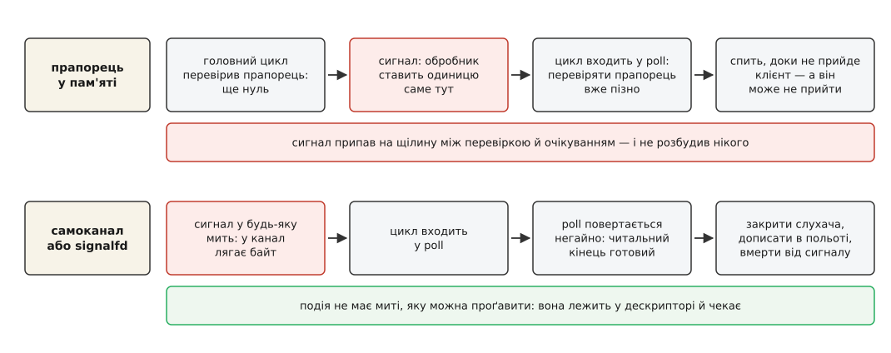

# ⚙️ Сервер, що доживає до останнього байта

Маленький TCP-сервер мовою C, який за `SIGTERM` чи `SIGINT` не обривається посеред речення, а перестає приймати нових клієнтів, дописує відповідь тим, що вже в польоті, і вмирає так, щоб супервізор побачив правду — зібраний двома способами звести сигнал до звичайної готовності дескриптора: самоканалом і `signalfd`.

## Що має статися по команді «стій»

Різниця між «процес зник» і «сервер завершився» — три дії, і жодну з них не зробиш з обробника.

Перша: закрити сокет-слухач. Доки він відкритий, ядро складає нові з'єднання в чергу — і кожне з них ми потім обірвемо на порожньому місці. Закритий сокет означає, що новий клієнт дістане чесну відмову й піде до сусіда, а порт звільниться одразу, не чекаючи на решту роботи.

Друга: доробити прийняте. Клієнт, який щойно надіслав запит, має право на відповідь; обрив у цю мить виглядає як помилка сервера, хоча сервер не зробив нічого поганого.

Третя: померти саме від сигналу, а не «успішно вийти».

Кожна з них — це `close`, `read` і `write` у наперед невідомому порядку й невідомій кількості, ще й із рішеннями між ними. Обробникові таке не по руках. Тому обробник лише скаже «час», а вирішувати буде головний цикл.

## Кістяк: одне очікування на все

Складність не в тому, щоб дізнатися про сигнал, а в тому, щоб дізнатися про нього **там само**, де сервер дізнається про клієнтів. Цикл стоїть у `poll` і чекає на готовність дескрипторів ([select, poll, epoll](root:sys-unix/select-poll-epoll) — виклики, що чекають на готовність відразу багатьох дескрипторів). Отже, сигнал теж має стати готовністю дескриптора — тоді нових шляхів у програмі не з'явиться взагалі, і код завершення житиме поруч із кодом обслуговування.

Ось повна програма з самоканалом. Вона збирається одним рядком і працює.

```c
/* srv.c — cc -O2 -Wall -Wextra -o srv srv.c    (варіантові з signalfd на glibc до 2.34: додати -pthread) */
#define _GNU_SOURCE
#include <arpa/inet.h>
#include <errno.h>
#include <fcntl.h>
#include <netinet/in.h>
#include <poll.h>
#include <signal.h>
#include <string.h>
#include <sys/socket.h>
#include <unistd.h>

#define MAX_CONN   64
#define PORT       9000
#define DRAIN_MS   5000        /* скільки чекаємо на тих, хто вже в польоті */

static int wake[2] = { -1, -1 };          /* [0] — читати, [1] — писати з обробника */

static void on_signal(int signo)
{
    int saved = errno;                             /* чужий errno — під захист */
    unsigned char b = (unsigned char) signo;

    (void) write(wake[1], &b, 1);                  /* єдина дія обробника */
    errno = saved;
}

static int make_listener(void)
{
    struct sockaddr_in a;
    int fd, on = 1;

    fd = socket(AF_INET, SOCK_STREAM | SOCK_NONBLOCK | SOCK_CLOEXEC, 0);
    if (fd < 0)
        return -1;
    setsockopt(fd, SOL_SOCKET, SO_REUSEADDR, &on, sizeof on);

    memset(&a, 0, sizeof a);
    a.sin_family = AF_INET;
    a.sin_addr.s_addr = htonl(INADDR_ANY);
    a.sin_port = htons(PORT);

    if (bind(fd, (struct sockaddr *) &a, sizeof a) < 0 || listen(fd, 64) < 0) {
        close(fd);
        return -1;
    }
    return fd;
}

/* Обслужити готове з'єднання: 1 — живе далі, 0 — час закривати. */
static int serve(int fd)
{
    char buf[4096];
    ssize_t r, off, w = 0;

    r = read(fd, buf, sizeof buf);
    if (r == 0)
        return 0;                                  /* клієнт закрив свій кінець */
    if (r < 0)
        return errno == EAGAIN || errno == EINTR;

    for (off = 0; off < r; off += w) {             /* спрощення: черги на запис нема, */
        w = write(fd, buf + off, (size_t) (r - off));   /* справжній сервер чекав би POLLOUT */
        if (w <= 0)
            return 0;
    }
    return 1;
}

static int compact(int *v, int n)                  /* прибрати дірки після закриттів */
{
    int i, k = 0;

    for (i = 0; i < n; i++)
        if (v[i] >= 0)
            v[k++] = v[i];
    return k;
}

/* Померти саме від сигналу, а не «успішно вийти». */
static void die_by(int signo)
{
    struct sigaction dfl;
    sigset_t only;

    memset(&dfl, 0, sizeof dfl);
    dfl.sa_handler = SIG_DFL;
    sigemptyset(&dfl.sa_mask);
    sigaction(signo, &dfl, NULL);

    sigemptyset(&only);
    sigaddset(&only, signo);
    sigprocmask(SIG_UNBLOCK, &only, NULL);         /* якщо був заблокований */

    raise(signo);
    _exit(128 + signo);                            /* сюди керування не дійде */
}

int main(void)
{
    struct pollfd pfd[2 + MAX_CONN];
    struct sigaction sa;
    int conn[MAX_CONN], nconn = 0;
    int listen_fd, stopping = 0, sig_got = SIGTERM;

    if (pipe2(wake, O_NONBLOCK | O_CLOEXEC) < 0)   /* обидва прапорці обов'язкові */
        return 1;

    memset(&sa, 0, sizeof sa);
    sa.sa_handler = on_signal;
    sigemptyset(&sa.sa_mask);
    sa.sa_flags = SA_RESTART;                      /* решту викликів ядро перезапустить */
    sigaction(SIGTERM, &sa, NULL);
    sigaction(SIGINT, &sa, NULL);

    sa.sa_handler = SIG_IGN;                       /* запис у мертвий сокет — не смерть */
    sa.sa_flags = 0;
    sigaction(SIGPIPE, &sa, NULL);

    listen_fd = make_listener();
    if (listen_fd < 0)
        return 1;

    while (!stopping || nconn > 0) {
        int n, i;

        pfd[0].fd = listen_fd;             /* після close тут -1 → poll ігнорує запис */
        pfd[0].events = POLLIN;
        pfd[1].fd = wake[0];
        pfd[1].events = POLLIN;
        for (i = 0; i < nconn; i++) {
            pfd[2 + i].fd = conn[i];
            pfd[2 + i].events = POLLIN;
        }

        n = poll(pfd, (nfds_t) (2 + nconn), stopping ? DRAIN_MS : -1);
        if (n == 0)
            break;                         /* дедлайн вичерпано — доб'ємо решту */
        if (n < 0) {
            if (errno == EINTR)            /* poll не перезапускається ніколи */
                continue;
            break;
        }

        if (pfd[1].revents & POLLIN) {     /* прокинулися через сигнал */
            unsigned char b[32];
            ssize_t r;

            while ((r = read(wake[0], b, sizeof b)) > 0)
                sig_got = b[r - 1];        /* читати до EAGAIN, а не рівно один байт */

            if (!stopping) {
                stopping = 1;
                close(listen_fd);          /* порт вільний одразу */
                listen_fd = -1;
            }
        }

        if (listen_fd >= 0 && (pfd[0].revents & POLLIN)) {
            int c = accept4(listen_fd, NULL, NULL, SOCK_NONBLOCK | SOCK_CLOEXEC);

            if (c >= 0) {
                if (nconn < MAX_CONN)
                    conn[nconn++] = c;
                else
                    close(c);
            }
        }

        for (i = 0; i < nconn; i++)
            if (pfd[2 + i].revents && !serve(conn[i])) {
                close(conn[i]);
                conn[i] = -1;              /* позначити на виліт, а не двигати масив */
            }
        nconn = compact(conn, nconn);
    }

    while (nconn > 0)
        close(conn[--nconn]);
    if (listen_fd >= 0)
        close(listen_fd);
    die_by(sig_got);
    return 0;
}
```

Кілька рішень тут неочевидні саме тому, що працюють тихо.

Сокет-слухач живе в `pfd[0]`, і після закриття туди лягає `-1`. `poll` таку позицію свідомо пропускає й повертає для неї нульовий `revents` — тож перестати приймати нових клієнтів коштує одного присвоєння, без перебудови масиву.

Умова циклу `while (!stopping || nconn > 0)` і є весь протокол завершення: щойно прапорець піднято, ми більше не приймаємо, але крутимося, доки лишається хоч одне з'єднання. Щоб мовчазний клієнт не тримав сервер вічно, після сигналу очікування дістає дедлайн замість `-1` ([м'яке завершення](root:sf-release/graceful-shutdown) — доробити почате й не починати нового, з обмеженням згори на «доробити»).

Байти з каналу читаються в циклі до кінця. Один сигнал — один байт, але сигналів може прилетіти кілька, а `poll` рівнево показує готовність, доки в каналі бодай щось є.

Обробник пише не якийсь умовний байт, а **номер сигналу**. Це не прикраса: наприкінці ми маємо померти саме від того сигналу, який прийшов, інакше `SIGINT` з клавіатури перетвориться на звіт про `SIGTERM`. Номери звичайних сигналів вміщаються в байт, тож одного вистачає.

## Як побачити, що воно працює

```sh
$ ./srv &                     # сервер слухає порт 9000
$ nc localhost 9000           # в іншому вікні: набране повертається назад
$ kill -TERM %1               # ввічлива команда завершитися
$ wait %1; echo $?
143
```

Число 143 і є вся суть третьої дії. Оболонка показує для вбитого сигналом процесу 128 плюс номер сигналу, а `SIGTERM` — п'ятнадцятий:

```
143 = 128 + 15   (SIGTERM)
130 = 128 + 2    (SIGINT, тобто Ctrl-C)
```

Якщо замінити `die_by` на `_exit(0)`, `echo $?` покаже нуль — і за цим нулем ніхто вже не відрізнить «сервер зупинили» від «сервер сам вирішив, що досить». Поки з'єднання ще обслуговуються, `nc` продовжує отримувати відповіді; нове ж підключення відбивається одразу, бо сокет-слухач закрито першою дією.

## Той самий цикл на signalfd

Linux дозволяє прибрати обробник узагалі: заблокувати сигнали й читати їх як дані з окремого дескриптора ([маскування сигналів і signalfd](root:sys-unix/signal-mask-signalfd) — заблокований сигнал не доставляється нікуди, а осідає в очікуваних, звідки його дістає читання). Кістяк не змінюється — змінюються два фрагменти.

```c
#include <pthread.h>
#include <sys/signalfd.h>

static int make_sigfd(void)
{
    sigset_t mask;

    sigemptyset(&mask);
    sigaddset(&mask, SIGTERM);
    sigaddset(&mask, SIGINT);

    /* блокувати ДО створення першого потоку: кожен новий успадкує цю маску */
    if (pthread_sigmask(SIG_BLOCK, &mask, NULL) != 0)
        return -1;

    return signalfd(-1, &mask, SFD_NONBLOCK | SFD_CLOEXEC);
}
```

І замість читання байтів — читання записів фіксованого розміру:

```c
        if (pfd[1].revents & POLLIN) {
            struct signalfd_siginfo si;
            ssize_t r;

            while ((r = read(sig_fd, &si, sizeof si)) == (ssize_t) sizeof si)
                sig_got = (int) si.ssi_signo;   /* si.ssi_pid — хто саме прислав */

            if (!stopping) {                    /* далі все як у першому варіанті */
                stopping = 1;
                close(listen_fd);
                listen_fd = -1;
            }
        }
```

У `pfd[1]` тепер лежить `sig_fd`, а `wake[]` і `on_signal` зникають зовсім — разом із будь-яким кодом, що виконується в чужий момент.

`signalfd` з'явився в Linux 2.6.22 і glibc 2.8; прапорці `SFD_NONBLOCK` і `SFD_CLOEXEC` — з Linux 2.6.27. Кожен запис — це `struct signalfd_siginfo` розміром 128 байтів, де крім номера сигналу лежать `ssi_pid` і `ssi_uid` відправника, `ssi_code` і решта того, що звичайний обробник дістав би через `siginfo_t`.

Вибирають між ними не за смаком. Самоканал працює всюди, де є POSIX, і не потребує від ядра нічого, крім каналу; ціна — обробник таки виконується, тож усі правила про безпечні виклики лишаються в силі, просто зведені до одного `write`. Той самий канал заразом стає універсальним «прокинься» для будь-якого потоку, не лише для сигналу. `signalfd` знімає питання безпечності повністю — обробника немає, а розбирає сигнал звичайний код у звичайну мить; ціна — прив'язка до Linux і маска, яку доводиться ставити першою дією процесу й пам'ятати про неї далі.

## Пастки

**Забутий `O_NONBLOCK`.** Канал у Linux вміщає 16 сторінок, тобто 65 536 байтів. Заповнити його одним байтом на сигнал важко — але якщо цикл надовго зайнявся роботою, а сигнали летять густо, це питання часу. У блокуючому каналі `write` з обробника не поверне помилку, а **чекатиме на місце** — тобто на те, щоб цикл прочитав байт. Цикл же не прочитає нічого, бо він і є тим потоком, що застряг усередині обробника ([неблокуючий режим](root:sys-unix/blocking-and-nonblocking) — виклик не чекає, а повертає `EAGAIN`, якщо зробити роботу негайно не можна). `O_CLOEXEC` не про безпеку, а про гігієну: без нього обидва кінці каналу дістануться кожному процесові, який сервер запустить.

**Щілина між прапорцем і очікуванням.** Це та помилка, заради якої все й затіяно.



*Прапорець треба встигнути прочитати; байт у каналі чекає скільки завгодно — саме тому другий ряд не має вразливої миті.*

Перевірити `volatile sig_atomic_t` перед входом у `poll` здається розв'язком, але між перевіркою й входом лишається проміжок у кілька інструкцій. Сигнал, що влучив туди, підніме прапорець, якого вже ніхто не читатиме, — і сервер спатиме до наступного клієнта. Байт у каналі й сигнал в очікуваних цієї вразливої миті не мають: вони не подія в часі, а стан, який чекає, доки його заберуть.

**Одне пробудження на кілька сигналів.** `SIGINT` і `SIGTERM`, що прийшли підряд, дадуть два байти, а прокинемося ми один раз. Прочитати рівно один байт — значить лишити другий у каналі; `poll` рівнево показує готовність, тож наступного оберту він поверне негайно, і ще раз, і ще — цикл почне крутитися вхолосту, з'їдаючи ядро процесора. Читати треба доти, доки `read` не скаже `EAGAIN`. З `signalfd` те саме, тільки порція — розмір `struct signalfd_siginfo`.

**`SA_RESTART` не стосується `poll`.** Прапорець просить ядро самому перезапустити перерваний виклик — і це справді рятує `read`, `write` та `accept` від несподіваного `EINTR` ([EINTR і перезапуск](root:sys-unix/eintr-and-restart) — обірваний сигналом виклик повертає помилку замість результату, якщо ядру не сказано інакше). Але мультиплексори до цієї милості не входять: `poll`, `ppoll`, `select`, `pselect`, `epoll_wait` **завжди** повертають `EINTR`, хоч би що стояло в `sa_flags`. Тому `if (errno == EINTR) continue;` у циклі не перестраховка, а обов'язок. У варіанті з `signalfd` обробників немає взагалі — і `EINTR` від наших сигналів теж, але писати цю гілку варто однаково: перерве хтось інший.

**Маска, що пережила `exec`.** Найтихіша з пасток `signalfd`. Маска сигналів успадковується дитиною при `fork` і зберігається через `execve` ([exec: заміна образу процесу](root:sys-unix/exec-semantics) — програма міняється, дескриптори й маска здебільшого лишаються). Тобто кожна утиліта, яку сервер запустить після блокування, дістане `SIGTERM` і `SIGINT` заблокованими — і не помре по команді. Між `fork` і `exec` маску треба повернути до порожньої.

**`_exit(0)` бреше супервізорові.** Процес, убитий сигналом, і процес, що вийшов з нульовим кодом, — це для батька два різні результати, і `wait` їх розрізняє ([код завершення](root:sys-unix/exit-status) — що саме батько дізнається про смерть дитини). Оболонки й супервізори читають цю різницю: перше — «зупинено», друге — «завершилося саме». Тому функція `die_by` повертає сигналові типову дію й кличе його на себе. Розблокування там не формальність: у варіанті з `signalfd` сигнал заблокований, і без `SIG_UNBLOCK` `raise` лише покладе його в очікувані, а процес поїде далі й вийде з нульовим кодом — рівно те, чого ми уникали.

Якщо два дескриптори під один прапорець здаються зайвими, у Linux є коротший носій тієї самої ідеї: `eventfd` — один дескриптор із лічильником, у який пишуть вісім байтів ([eventfd і futex](root:sys-unix/eventfd-and-futex) — легкі примітиви сповіщення всередині ядра). Механіка пробудження не змінюється: обробник додає одиницю, цикл забирає й розбирається.
