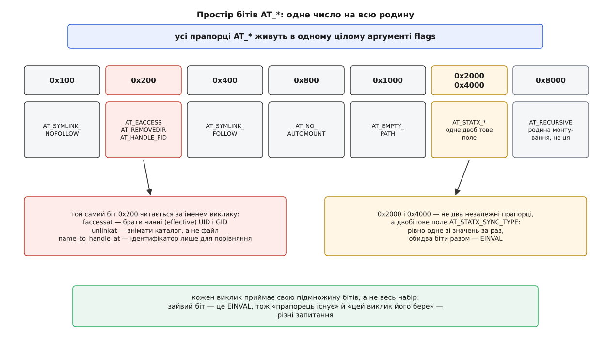

# 📋 Родина `*at`: підписи, прапорці, коди помилок

Довідка за клавіатурою: повний перелік системних викликів із суфіксом `at`, їхні підписи, версії ядра й glibc, допустимі біти `AT_*` для кожного та коди помилок, породжені саме цією формою виклику. Окремо — контракт `openat2`, бо він єдиний у родині влаштований інакше. Головне питання, на яке ця довідка відповідає: чи візьме конкретний виклик конкретний прапорець — і що станеться, якщо не візьме.

Усі сталі `AT_*` оголошені в `<fcntl.h>`. Ті з них, яких немає в POSIX (`AT_EMPTY_PATH`, `AT_NO_AUTOMOUNT`, увесь набір `AT_STATX_*`), а також самі виклики-розширення (`renameat2`, `execveat`, `statx`, `openat2`) вимагають `#define _GNU_SOURCE` **перед** першим `#include`. Структура `struct open_how` і сталі `RESOLVE_*` живуть окремо — у `<linux/openat2.h>`.

## Базовий набір: Linux 2.6.16, glibc 2.4

Тринадцять викликів прийшли одним пакетом у березні 2006 року і всі, крім `futimesat`, увійшли до POSIX.1-2008.

| виклик | підпис | заміняє |
|---|---|---|
| `openat` | `int openat(int dirfd, const char *path, int flags, ... /* mode_t mode */)` | `open` |
| `fstatat` | `int fstatat(int dirfd, const char *restrict path, struct stat *restrict st, int flags)` | `stat`, `lstat`, `fstat` |
| `unlinkat` | `int unlinkat(int dirfd, const char *path, int flags)` | `unlink`, `rmdir` |
| `renameat` | `int renameat(int olddirfd, const char *oldpath, int newdirfd, const char *newpath)` | `rename` |
| `linkat` | `int linkat(int olddirfd, const char *oldpath, int newdirfd, const char *newpath, int flags)` | `link` |
| `symlinkat` | `int symlinkat(const char *target, int newdirfd, const char *linkpath)` | `symlink` |
| `readlinkat` | `ssize_t readlinkat(int dirfd, const char *restrict path, char *restrict buf, size_t bufsiz)` | `readlink` |
| `mkdirat` | `int mkdirat(int dirfd, const char *path, mode_t mode)` | `mkdir` |
| `mknodat` | `int mknodat(int dirfd, const char *path, mode_t mode, dev_t dev)` | `mknod` |
| `fchownat` | `int fchownat(int dirfd, const char *path, uid_t owner, gid_t group, int flags)` | `chown`, `lchown`, `fchown` |
| `fchmodat` | `int fchmodat(int dirfd, const char *path, mode_t mode, int flags)` | `chmod` |
| `faccessat` | `int faccessat(int dirfd, const char *path, int mode, int flags)` | `access` |
| `futimesat` | `int futimesat(int dirfd, const char *path, const struct timeval times[2])` | `utimes` |

Чотири рядки цієї таблиці читають уважніше за решту, бо кожен ламає очікування, з яким до неї приходять.

**`symlinkat` бере дескриптор другим аргументом.** Перший аргумент `target` — не шлях, а рядок, який ляже в тіло посилання дослівно; ядро його не розбирає й ні від чого не відлічує. Якір потрібен лише другому шляхові — тому місцю, де з'явиться сам запис.

**У `renameat` і `linkat` дескрипторів два.** Кожен шлях відлічується від свого; передати `AT_FDCWD` можна одному, обом або жодному.

**`fstatat` — це не те ім'я, яке бачить ядро.** Обгортка glibc насправді викликає `fstatat64()`, а на кількох архітектурах — `newfstatat()`; на найновіших портах (riscv32, а якийсь час і LoongArch) окремого виклику немає взагалі, і glibc будує `fstatat` поверх [`statx`](root:sys-unix/statx-mask-and-unknown-values). Практичний наслідок стосується фільтрів [`seccomp`](root:sys-unix/seccomp-filter-mechanism): правило, написане на ім'я `fstatat`, не спрацює там, де ядро отримує `statx`, — а програма при цьому нічого не помітить.

**`futimesat` застарілий.** Він не входить до жодного стандарту — його реалізували за чернеткою, яку в POSIX замінили на `utimensat`. У сучасному коді потрібен `utimensat`.

## Пізніші поповнення

| виклик | підпис | ядро | glibc | стандарт |
|---|---|---|---|---|
| `utimensat` | `int utimensat(int dirfd, const char *path, const struct timespec times[2], int flags)` | 2.6.22 | 2.6 | POSIX.1-2008 |
| `name_to_handle_at` | `int name_to_handle_at(int dirfd, const char *path, struct file_handle *handle, int *mount_id, int flags)` | 2.6.39 | 2.14 | лише Linux |
| `renameat2` | `int renameat2(int olddirfd, const char *oldpath, int newdirfd, const char *newpath, unsigned int flags)` | 3.15 | 2.28 | лише Linux |
| `execveat` | `int execveat(int dirfd, const char *path, char *const argv[], char *const envp[], int flags)` | 3.19 | 2.34 | лише Linux |
| `statx` | `int statx(int dirfd, const char *restrict path, int flags, unsigned int mask, struct statx *restrict stx)` | 4.11 | 2.28 | лише Linux |
| `openat2` | `int openat2(int dirfd, const char *path, struct open_how *how, size_t size)` | 5.6 | 2.43 | лише Linux |
| `faccessat2` | `int faccessat2(int dirfd, const char *path, int mode, int flags)` | 5.8 | — | лише Linux |
| `fchmodat2` | `int fchmodat2(int dirfd, const char *path, mode_t mode, unsigned int flags)` | 6.6 | — | лише Linux |
| `setxattrat` | `int setxattrat(int dfd, const char *path, unsigned int at_flags, const char *name, const struct xattr_args *args, size_t size)` | 6.13 | — | лише Linux |
| `getxattrat` | `int getxattrat(int dfd, const char *path, unsigned int at_flags, const char *name, struct xattr_args *args, size_t size)` | 6.13 | — | лише Linux |
| `listxattrat` | `int listxattrat(int dfd, const char *path, unsigned int at_flags, char *list, size_t size)` | 6.13 | — | лише Linux |
| `removexattrat` | `int removexattrat(int dfd, const char *path, unsigned int at_flags, const char *name)` | 6.13 | — | лише Linux |

Прочерк у стовпці glibc не означає «недоступно» — він означає «немає окремої функції з таким іменем». Різниця важлива, і поводяться ці три випадки по-різному.

`faccessat2` і `fchmodat2` заховані **всередині** старих обгорток. До glibc 2.33 функція `faccessat()` вдавала прапорець `AT_EACCESS` сама, комбінуючи `faccessat()` з `fstatat()`; та підробка не враховувала [списків доступу ACL](root:sys-unix/acl-and-xattr) і на файлових системах з ACL відповідала неправду. Від 2.33 glibc кличе `faccessat2()`, коли той є. Так само `fchmodat()` до glibc 2.32 просто не вмів `AT_SYMLINK_NOFOLLOW`, потім вмів через обхід по `/proc`, а від glibc 2.39 — через справжній `fchmodat2()`. Тобто виклику з таким іменем у програмі не пишуть: пишуть старе ім'я з прапорцем і покладаються на бібліотеку.

Чотири `*xattrat` поки що не мають обгорток узагалі — їх кличуть через `syscall()`. Мотив їхньої появи не гонки, а права: вони дають працювати з [розширеними атрибутами](root:sys-unix/acl-and-xattr) через дескриптор, відкритий **без** права читання, і не вимагають змонтованого `/proc`. Саме це потрібно `setfiles(8)`, коли той розставляє контексти [SELinux](root:sys-unix/mac-selinux-apparmor). Значення атрибута, його довжину й команду (`XATTR_CREATE` / `XATTR_REPLACE`) винесено в окрему структуру, щоб не вилізти за шість аргументів системного виклику й не змішувати біти `AT_*` з бітами `XATTR_*`:

```c
struct xattr_args {
    __aligned_u64 value;   /* вказівник на значення */
    __u32 size;            /* довжина значення */
    __u32 flags;           /* XATTR_CREATE / XATTR_REPLACE */
};
```

`openat2` — окремий випадок: обгортка з'явилася аж у glibc 2.43 (лютий 2026), майже на шість років пізніше за сам виклик.

## `*at` без власного системного виклику

Кілька функцій із суфіксом `at` існують тільки в бібліотеці й реалізовані поверх викликів із таблиць вище — ядро про них не знає:

| функція | реалізована через | звідки |
|---|---|---|
| `mkfifoat(int dirfd, const char *path, mode_t mode)` | `mknodat` з `S_IFIFO` | POSIX.1-2008, glibc 2.4 |
| `scandirat(int dirfd, const char *dirp, struct dirent ***namelist, …)` | `openat` + читання каталогу | glibc 2.15 |
| `fexecve(int fd, char *const argv[], char *const envp[])` | `execveat` з `AT_EMPTY_PATH`, а до нього — `/proc/self/fd/N` | POSIX.1-2008 |
| `futimens(int fd, const struct timespec times[2])` | `utimensat(fd, NULL, times, 0)` | POSIX.1-2008, glibc 2.6 |

Останній рядок містить пастку в підписі. Діяти над самим `dirfd` виклик `utimensat` уміє двома різними способами: `NULL` замість рядка шляху — прийом старший за прапорці й у POSIX не описаний, саме на ньому побудовано `futimens`; і `AT_EMPTY_PATH` з порожнім рядком — від ядра 5.8, як у решти родини. Порожній рядок на старому ядрі дасть не те саме, що `NULL`, а `ENOENT`.

## `AT_FDCWD`

```c
#define AT_FDCWD  (-100)   /* Linux; POSIX значення не фіксує */
```

Стала мусить бути такою, якою ніколи не буває дійсний дескриптор, — інакше ядро не відрізнило б «від поточного каталогу» від «від каталогу номер N». Дескриптори невід'ємні, отже значення від'ємне. Саме число не переносне: POSIX залишає його на розсуд системи, і, наприклад, Haiku R1/beta4 вживав `−1`. Наслідок для коду простий і категоричний: пишуть ім'я, ніколи не число, і ніколи не перевіряють `dirfd < 0` як ознаку помилки.

## Прапорці `AT_*`



*Прапорці розібрано за значенням біта, а не за іменем: саме тут видно, що набір не є спільним для всієї родини.*

| прапорець | біт | приймають | дія | стандарт |
|---|---|---|---|---|
| `AT_SYMLINK_NOFOLLOW` | `0x100` | `fstatat`, `statx`, `fchownat`, `fchmodat` / `fchmodat2`, `utimensat`, `faccessat` / `faccessat2`, `execveat`, `*xattrat` | останній складник шляху — символьне посилання: діяти над самим посиланням, не над ціллю | POSIX.1-2008 |
| `AT_EACCESS` | `0x200` | `faccessat`, `faccessat2` | перевіряти права за **чинними** (effective) UID і GID, а не за реальними | POSIX.1-2008 |
| `AT_REMOVEDIR` | `0x200` | `unlinkat` | зняти каталог (як `rmdir`), а не запис файлу | POSIX.1-2008 |
| `AT_HANDLE_FID` | `0x200` | `name_to_handle_at` (ядро 6.5) | повернути ідентифікатор, придатний лише для порівняння файлів, а не для відкриття через `open_by_handle_at` | лише Linux |
| `AT_SYMLINK_FOLLOW` | `0x400` | `linkat`, `name_to_handle_at` | навпаки: розкрити посилання в **джерелі**; типова поведінка `linkat` — не розкривати | POSIX.1-2008 |
| `AT_NO_AUTOMOUNT` | `0x800` | `fstatat`, `statx` | не спричиняти автомонтування останнього складника | лише Linux |
| `AT_EMPTY_PATH` | `0x1000` | `fstatat`, `statx`, `linkat`, `execveat`, `fchownat`, `fchmodat2` (з 6.6), `faccessat2` (з 5.8), `*xattrat`, `name_to_handle_at` | шлях — порожній рядок: діяти над самим об'єктом, що його відкриває `dirfd` | лише Linux, з 2.6.39 |
| `AT_STATX_SYNC_AS_STAT` | `0x0000` | `statx` | синхронізувати так, як це робить `stat` (типово) | лише Linux |
| `AT_STATX_FORCE_SYNC` | `0x2000` | `statx` | вимагати свіжих атрибутів із сервера | лише Linux |
| `AT_STATX_DONT_SYNC` | `0x4000` | `statx` | брати те, що вже в кеші | лише Linux |
| `AT_RECURSIVE` | `0x8000` | `mount_setattr`, `open_tree` | поширити дію на все піддерево монтувань | лише Linux |

Чотири уточнення, без яких таблиця вводить в оману.

**Однакове значення `0x200` — не помилка.** Один і той самий біт носить три імені, бо жоден виклик не приймає більше ніж одне з них: `unlinkat` не має чого робити з `AT_EACCESS`, а `faccessat` — з `AT_REMOVEDIR`. Ядро розбирає біти вже після того, як дізналося, який виклик його турбує, тому колізії немає. Так само влаштовані два молодші біти: `AT_HANDLE_MNT_ID_UNIQUE` (`0x001`, ядро 6.12) і `AT_HANDLE_CONNECTABLE` (`0x002`, ядро 6.13) значать щось тільки для `name_to_handle_at` — у решті викликів ці позиції просто не задіяні. Звідси й головне: питання «чи існує такий прапорець» і «чи бере його цей виклик» — різні, і відповідь на друге завжди шукають у сторінці конкретного виклику.

**`AT_STATX_*` — це не три прапорці, а поле.** Маска `AT_STATX_SYNC_TYPE` дорівнює `0x6000`, тобто накриває обидва біти; типове значення `AT_STATX_SYNC_AS_STAT` — просто нуль. Обидва біти разом — недопустима комбінація, і `statx` відмовляє `EINVAL`. Практично значення має лише для [мережевих файлових систем](root:sys-unix/network-filesystems): `FORCE_SYNC` може змусити клієнта дописати дані на сервер, `DONT_SYNC` віддає застарілі, зате миттєво.

**`AT_EMPTY_PATH` у `linkat` потребує привілею.** Створити жорстке посилання на об'єкт, названий тільки дескриптором, дозволено процесові з `CAP_DAC_READ_SEARCH`; без цієї [можливості](root:sys-unix/capabilities) виклик відмовляє не `EPERM`, як очікують, а `ENOENT` — той самий код, що й «нема такого шляху». Решта викликів прапорця не обмежують.

**`AT_NO_AUTOMOUNT` для `fstatat` нічого не робить від ядра 3.1** — тоді автомонтування в цьому виклику вимкнули типово. У `statx` прапорець живий і потрібен.

> 🔧 **Навіщо це.** Перевіряти підтримку прапорця тестом «чи є така стала в заголовку» — хибний прийом. Стала потрапила в `<fcntl.h>` разом із заголовками, під які програму збирали, а бере її чи ні те ядро, на якому програма зараз біжить, — зовсім інше питання, і відповідь на нього залежить від машини, а не від складання. Єдина надійна перевірка — спробувати виклик із прапорцем на завідомо доступному шляху й глянути на `errno`.

## Коди помилок, породжені формою виклику

Частина цих кодів приходить тільки від форми з дескриптором, частина — і від старих двійників, але тут з іншої причини; саме тому їх легко витлумачити навпаки.

| код | коли | де саме |
|---|---|---|
| `EBADF` | шлях відносний, а `dirfd` не є ані `AT_FDCWD`, ані дійсним дескриптором | усі виклики родини |
| `ENOTDIR` | шлях відносний, `dirfd` дійсний, але відкриває не каталог | усі виклики родини |
| `EINVAL` | у `flags` біт, якого цей виклик не приймає; або неприпустима комбінація | усі виклики родини |
| `ELOOP` | `execveat` з `AT_SYMLINK_NOFOLLOW` натрапив на посилання; `openat2` з `RESOLVE_NO_SYMLINKS`; звичайний обхід перевищив межу вкладеності посилань (40) | залежить від виклику |
| `ENAMETOOLONG` | рядок шляху довший за `PATH_MAX` (4096) або складник довший за `NAME_MAX` (255) | усі, хто приймає шлях |
| `EOPNOTSUPP` (він же `ENOTSUP`) | `AT_SYMLINK_NOFOLLOW` там, де його нема кому виконати: на старому ядрі — бо немає `fchmodat2`, на будь-якому — бо права символьного посилання Linux не зберігає | `fchmodat`, `fchmodat2` |
| `ENOENT` | `dirfd` веде в каталог, який тим часом видалили; або `linkat` з `AT_EMPTY_PATH` без `CAP_DAC_READ_SEARCH` | усі виклики родини, окремо `linkat` |
| `EXDEV` | обхід вийшов за межі каталогу-якоря або перетнув точку монтування всупереч `RESOLVE_*` | лише `openat2` |
| `EAGAIN` | дерево змінилося просто під час розбору; або `RESOLVE_CACHED` не знайшов складника в кеші | лише `openat2` |
| `ENOSYS` | виклику немає в цьому ядрі (типово для `openat2`, `faccessat2`, `fchmodat2`, `*xattrat`) | розширення |

Перші два варто запам'ятати парою, бо їх постійно плутають: `EBADF` каже «цього дескриптора немає», `ENOTDIR` — «дескриптор є, але це не каталог». Обидва приходять **до** будь-якого звертання до файлової системи, тож помилка в передачі якоря видна одразу, а не після часткової роботи.

`EOPNOTSUPP` на `fchmodat` розпадається на два випадки, і плутати їх дорого. Якщо ціль — символьне посилання, відмова остаточна: біти прав посилання в Linux не значать нічого, і жодне майбутнє ядро цього не змінить. Якщо ж ціль — звичайний файл, а прапорець усе одно відхилено, то система просто стара: від ядра 6.6 з glibc 2.39 той самий рядок коду спрацює. Розрізняє випадки один `fstatat` з `AT_SYMLINK_NOFOLLOW` перед спробою — і лише в другому має сенс запасний варіант.

## `openat2`: розбір шляху під керуванням

```c
#define _GNU_SOURCE
#include <linux/openat2.h>   /* struct open_how, RESOLVE_* */
#include <sys/syscall.h>
#include <unistd.h>

/* оголошено в заголовку, наведено для довідки */
struct open_how {
    __u64 flags;     /* усе, що приймає open(): O_RDONLY, O_CREAT, O_CLOEXEC … */
    __u64 mode;      /* права нового файлу; поза O_CREAT/O_TMPFILE мусить бути 0 */
    __u64 resolve;   /* RESOLVE_* — керує самим обходом */
};

long syscall(SYS_openat2, int dirfd, const char *path,
             struct open_how *how, size_t size);
```

Форма з `syscall()` наведена саме тому, що працює всюди: обгортка glibc є не на кожній системі, а номер виклику є завжди.

| прапорець `resolve` | біт | що забороняє | ядро |
|---|---|---|---|
| `RESOLVE_NO_XDEV` | `0x01` | перетинати [точки монтування](root:sys-unix/mount-model), зокрема прив'язані (bind) | 5.6 |
| `RESOLVE_NO_MAGICLINKS` | `0x02` | переходи по «чарівних» посиланнях `/proc`, що ведуть просто у відкритий об'єкт | 5.6 |
| `RESOLVE_NO_SYMLINKS` | `0x04` | будь-які символьні посилання в **усіх** складниках; вмикає й попередній | 5.6 |
| `RESOLVE_BENEATH` | `0x08` | вихід за межі каталогу-якоря будь-яким способом: `..`, посилання, абсолютний шлях | 5.6 |
| `RESOLVE_IN_ROOT` | `0x10` | те саме, але не відмовою, а підстановкою: якір стає коренем, `..` у ньому впирається, абсолютні шляхи й абсолютні посилання відлічуються від нього ([зміна кореня](root:sys-unix/chroot) на час одного розбору й без привілеїв) | 5.6 |
| `RESOLVE_CACHED` | `0x20` | будь-який складник, якого ще немає в кеші пошуку; не про безпеку, а про швидкий шлях без блокувань | 5.12 |

Чотири риси цього підпису, яких немає в жодного іншого виклику родини.

**Структуру треба обнулити цілком.** Не «заповнити потрібні поля», а `memset` або ініціалізація з нулями: ядро читає рівно `size` байтів і вимагає, щоб невідомі йому поля були нульові. Аргумент `size` — це `sizeof(struct open_how)` тієї редакції, яку знає програма; менший за мінімальний розмір дає `EINVAL`, а більший з ненульовими полями, яких ядро не розуміє, — `E2BIG`. Так структуру можна нарощувати роками, не вигадуючи `openat3`.

**Невідомий біт — це `EINVAL`, а не тиша.** На відміну від `open`, який зайві біти в `flags` мовчки ігнорує, `openat2` відмовляє. Різниця принципова саме для захисних прапорців: коли старе ядро ковтає невідомий біт, програма вважає себе захищеною, а працює без захисту.

**`RESOLVE_BENEATH` і `RESOLVE_IN_ROOT` — взаємно виключні.** До ядра 5.11 пара мовчки зводилася до першого; від 5.11 ядро відмовляє `EINVAL`. Зміну зробив Алекса Сараї (SUSE), автор самого виклику, і вона безпечна саме тому, що на той час єдиним споживачем `openat2` був LXC, який пари не вживав.

**`EAGAIN` тут — не «зайнято», а «спробуй ще раз».** Розбір із `RESOLVE_BENEATH` чи `RESOLVE_IN_ROOT` виявив, що дерево під ним змінилося просто зараз, і чесно відмовився, замість вгадувати; `RESOLVE_CACHED` віддає той самий код, коли складника в кеші не виявилося. Обидва випадки лікуються повтором — у другому зазвичай повтором уже без `RESOLVE_CACHED`.

Перевірка підтримки робиться один раз на процес і саме викликом, а не оглядом заголовків: пробуємо потрібний набір `RESOLVE_*` на завідомо доступному каталозі й дивимося, чи ядро погодилося.

```c
/* 1 — виклик є і цей набір RESOLVE_* ядру відомий; 0 — ні */
static int openat2_supports(unsigned long long resolve)
{
    struct open_how how;
    memset(&how, 0, sizeof how);              /* усі байти нулі — обов'язково */
    how.flags   = O_RDONLY | O_CLOEXEC | O_DIRECTORY;
    how.resolve = resolve;

    long fd = syscall(SYS_openat2, AT_FDCWD, ".", &how, sizeof how);
    if (fd < 0)
        return 0;                             /* ENOSYS — ядро старше за 5.6;
                                                 EINVAL — прапорця не знає */
    close((int)fd);
    return 1;
}
```

Сам виклик відрізняється від цієї проби лише тим, що мусить розрізняти два види відмови: «ядро не вміє» — привід перейти на повільніший запасний варіант, «шлях виводить назовні» — привід відмовити тому, хто цей шлях подав.

```c
/* дескриптор, або -1 з причиною в errno */
static int open_beneath(int dirfd, const char *path)
{
    struct open_how how;
    memset(&how, 0, sizeof how);
    how.flags   = O_RDONLY | O_CLOEXEC;
    how.resolve = RESOLVE_BENEATH | RESOLVE_NO_SYMLINKS;

    for (int tries = 0; tries < 8; tries++) {
        long fd = syscall(SYS_openat2, dirfd, path, &how, sizeof how);
        if (fd >= 0)
            return (int)fd;
        if (errno != EAGAIN)                  /* EXDEV чи ELOOP — шлях назовні,
                                                 ENOSYS чи EINVAL — ядро старе */
            return -1;
    }
    errno = EAGAIN;                           /* дерево не вгамувалося */
    return -1;
}
```

Межа на повтори тут не косметична: `EAGAIN` приходить рівно тоді, коли хтось активно рухає дерево під нами, — а безмежний цикл крутитиметься рівно доти, доки той рухає.

## Чого в родині немає

| класичний виклик | форма `*at` | чим користуватися |
|---|---|---|
| `chdir` | немає | `fchdir(fd)` — і так бере дескриптор |
| `getcwd` | немає | шлях тут результат, а не аргумент; аналог не має сенсу |
| `truncate` | немає | `ftruncate(fd)` після `openat` |
| `statfs` | немає | `fstatfs(fd)` — працює і на дескрипторі, відкритому з `O_PATH` (з ядра 3.12) |
| `mount` | немає | `open_tree` / `move_mount` — нова родина монтування, свій набір прапорців |
| `chmod` із `AT_SYMLINK_NOFOLLOW` до ядра 6.6 | була неповна | `fchmodat2`, а на старих ядрах — `/proc/self/fd/N` |
| решта | немає | `/proc/self/fd/N` як шлях |

Останній рядок — універсальний обхід із трьома відомими обмеженнями. Запис `/proc/self/fd/N` веде просто у відкритий об'єкт, тож рядок `"/proc/self/fd/7/config"` розбереться від сьомого дескриптора. Але потрібен змонтований [`/proc`](root:sys-unix/proc-reading-process-and-kernel-state), якого у [власному просторі імен монтувань](root:sys-unix/namespaces) може не бути; сам запис є чарівним посиланням, тобто саме тим, що `RESOLVE_NO_MAGICLINKS` навмисно забороняє; і форма `/proc/self/fd/N/шлях` знову дає багатоскладниковий рядок з усіма його щілинами. Обхід на те й обхід.

Окремо варто знати, що `execveat` (ядро 3.19) закрив прогалину не для гонок, а для [запуску програми](root:sys-unix/exec-semantics) з дескриптора: з `AT_EMPTY_PATH` виконується саме той файл, який уже в руках, і `/proc` для цього не потрібен. А прапорці `RENAME_NOREPLACE`, `RENAME_EXCHANGE` і `RENAME_WHITEOUT` виклику `renameat2` до родини `AT_*` не належать — вони живуть у власному просторі бітів і стосуються не точки відліку, а того, що робиться із записами каталогу; `RENAME_WHITEOUT` до того ж має сенс лише для [нашарованих файлових систем](root:sys-unix/overlay-filesystems) і вимагає `CAP_MKNOD`.
