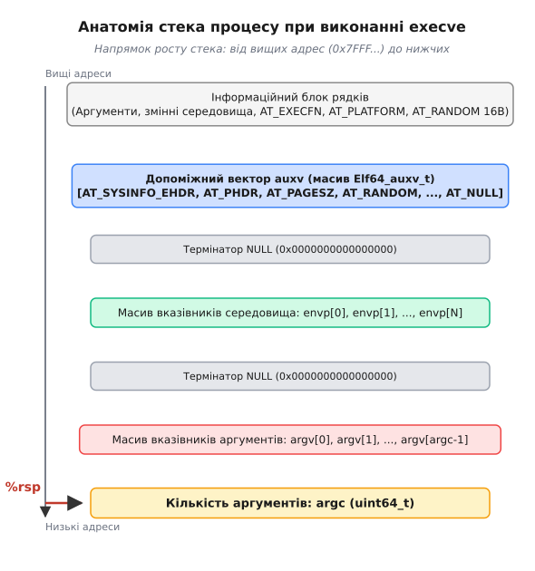
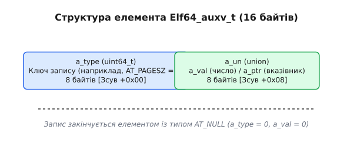
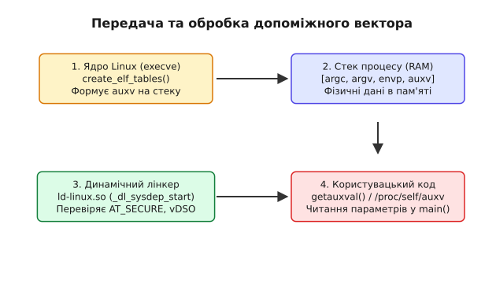

# Допоміжний вектор ELF: що ядро передає програмі на старті

<preknowlist>
- [Структура виконуваного файла ELF](root:sys-unix/elf-structure) — заголовки, сегменти PT_LOAD, PT_PHDR, PT_INTERP та секції об'єкта.
- [Динамічний завантажувач ld-linux.so](root:sys-unix/dynamic-loader) — завантаження, релокації та порядок ініціалізації рантайму.
</preknowlist>

Коли операційна система Linux виконує системний виклик `execve`, ядро створює новий віртуальний адресний простір, розміщує в ньому сегменти виконуваного бінарного файла та готує стек для майбутнього процесу. Проте після передачі керування першій інструкції користувацького коду програма не може почати роботу без знання системного контексту. Динамічному завантажувачу (`ld-linux.so`) та рантайму системної бібліотеки (glibc) необхідні точні метадані: розмір сторінки віртуальної пам'яті, адреса таблиці заголовків програми, адреса ін'єктованого ядра бібліотеки vDSO, прапорці підняття привілеїв `setuid` та криптографічні випадкові байти для захисту стека. Робити для кожного з цих параметрів окремий системний виклик під час кожного старту процесів створювало б неприпустиме навантаження на систему. Для нульової затримки та беззапитної передачі цих даних ядро пакує системну інформацію у масив пар «ключ-значення» — **допоміжний вектор ELF (Auxiliary Vector, `auxv`)** — і записує його безпосередньо у стек процесу поруч із аргументами командного рядка та змінними середовища.

---

## Першопричина: чому `argv` та `envp` недостатньо

У класичній POSIX-моделі користувацький процес отримує при старті два масиви рядків: аргументи командного рядка (`argv`) та змінні середовища (`envp`). Ця схема чудово працює для обміну текстовими параметрами між батьківським і дочірнім процесами через оболонку (shell). Проте вона абсолютно непридатна для передачі низькорівневих системних інваріантів від самого ядра операційної системи з таких фундаментальних причин:

1. **Ненадійність та можливість підробки**: Вміст `argv` та `envp` формується батьківським процесом (який викликає `execve`). Дочірній привілейований процес не може довіряти текстовим змінним середовища, оскільки зловмисник може навмисно підставити хибні значення або сформувати атаки через змінні `LD_PRELOAD` та `LD_LIBRARY_PATH`.
2. **Типізація та бінарна ефективність**: Динамічному лінкеру потрібні абсолютні віртуальні адреси у пам'яті (`void*`), бітові маски апаратних інструкцій процесора (`uint64_t`) та числові розміри системних сторінок. Парсити ці дані з текстових рядків при кожному запуску будь-якої утиліти — це неефективні витрати процесорного часу.
3. **Ізоляція від користувача**: Параметри `auxv` мають формуватися виключно ядром Linux на основі аналізу файла на диску, апаратних властивостей CPU та прав доступу поточного процесу.
4. **Гарантія наявності**: Користувач або батьківський процес може очистити змінні середовища, передавши порожній масив `envp`. Проте системні метадані (такі як `AT_PAGESZ` або `AT_PHDR`) є обов'язковими для функціонування рантайму і не можуть бути вилучені ззовні.
5. **Нульова затримка ініціалізації**: Оскільки системні виклики у користувацькому просторі вимагають переключення контексту процесора (перехід у режим ядра через інструкцію `syscall`), виклик десятка системних функцій на самому старті кожної короткоживучої утиліти (наприклад, `ls`, `grep`, `cat`) сповільнив би запуск системи у кілька разів. Передаючи `auxv` через стек, ядро реалізує беззапитну передачу параметрів (zero-copy data push).

Таким чином, виникла потреба у третьому, системно-захищеному каналі передачі метаданих, який заповнюється ядром на етапі створення процесу і зчитується рантаймом до моменту виконання першої інструкції користувацької функції `main`.

---

## Ядерна фаза: розбір `create_elf_tables()` у джерелах Linux

Процес формування допоміжного вектора починається у ядрі Linux під час виконання системного виклику `sys_execve`. Після перевірки прав доступу ядро викликає функцію `search_binary_handler()`, яка визначає формат виконуваного файла. Для ELF-бінарників викликається підсистема `load_elf_binary()` у вихідному файлі ядра `fs/binfmt_elf.c`.

Ядро виділяє сторінки пам'яті під майбутній стек процесу у найвищих адресах віртуального простору (із врахуванням рандомізації ASLR) і викликає функцію `create_elf_tables()`. Розглянемо ключову поетапну логіку цієї функції:

### 1. Запис текстових рядків у інформаційний блок
Спочатку ядро розміщує у найвищих адресах стека текстові рядки аргументів `argv`, рядки змінних середовища `envp`, абсолютний шлях до виконуваного файла для `AT_EXECFN`, рядок назви апаратної платформи для `AT_PLATFORM` та генерує 16-байтовий бінарний блок криптографічної ентропії для `AT_RANDOM`.

```c
/* Фрагмент концептуальної логіки fs/binfmt_elf.c у ядрі Linux */
static int create_elf_tables(struct linux_binprm *bprm, const struct elfhdr *exec,
                             unsigned long load_addr, unsigned long interp_load_addr)
{
    unsigned long p = bprm->p;
    /* Копіювання 16 випадкових байтів для AT_RANDOM */
    u8 k_rand[16];
    get_random_bytes(k_rand, sizeof(k_rand));
    p = copy_strings_kernel(1, &k_rand_ptr, p);
    
    /* Розрахунок кількості записів у допоміжному векторі */
    struct elf_item auxv[AT_VECTOR_SIZE];
    int ei = 0;

    /* Заповнення обов'язкових векторів */
    NEW_AUX_ENT(AT_HWCAP, ELF_HWCAP);
    NEW_AUX_ENT(AT_PAGESZ, ELF_EXEC_PAGESIZE);
    NEW_AUX_ENT(AT_CLKTCK, CLK_TCK);
    NEW_AUX_ENT(AT_PHDR, load_addr + exec->e_phoff);
    NEW_AUX_ENT(AT_PHENT, sizeof(struct elf_phdr));
    NEW_AUX_ENT(AT_PHNUM, exec->e_phnum);
    NEW_AUX_ENT(AT_BASE, interp_load_addr);
    NEW_AUX_ENT(AT_FLAGS, 0);
    NEW_AUX_ENT(AT_ENTRY, exec->e_entry);
    NEW_AUX_ENT(AT_UID, from_kuid_munged(cred->user_ns, cred->uid));
    NEW_AUX_ENT(AT_EUID, from_kuid_munged(cred->user_ns, cred->euid));
    NEW_AUX_ENT(AT_GID, from_kgid_munged(cred->user_ns, cred->gid));
    NEW_AUX_ENT(AT_EGID, from_kgid_munged(cred->user_ns, cred->egid));
    NEW_AUX_ENT(AT_SECURE, bprm->secureexec);
    NEW_AUX_ENT(AT_RANDOM, rand_user_addr);
    NEW_AUX_ENT(AT_EXECFN, execfn_user_addr);
    
    if (vdso_enabled) {
        NEW_AUX_ENT(AT_SYSINFO_EHDR, vdso_addr);
    }

    NEW_AUX_ENT(AT_NULL, 0); /* Термінатор вектора */
}
```

### 2. Точний розрахунок зсуву та вирівнювання стека
Отримавши всі вектори, ядро обчислює точний розмір усього блок-фрейму стека за формулою:

```
загальний_розмір = (argc + 1) * sizeof(void*)
                 + (envc + 1) * sizeof(void*)
                 + sizeof(uint64_t)                      [для argc]
                 + (кількість_векторів * sizeof(Elf64_auxv_t))
```

Потім вказівник стека `sp` вирівнюється до низу за вимогами System V ABI:

```c
/* Вирівнювання вказівника стека на межу 16 байтів */
sp = (sp - загальний_розмір) & ~15UL;
```

Після цього ядро копіює підготовлені масиви з процесорного простору ядра у створений користувацький стек процесу.

```
[Високі адреси пам'яті]
  1. Інформаційний блок (рядки argv, envp, AT_EXECFN, AT_PLATFORM, 16B random)
  2. Масив допоміжного вектора auxv (пари Elf64_auxv_t)
  3. Термінатор NULL для auxv (AT_NULL)
  4. Масив вказівників envp[] (закінчується NULL)
  5. Масив вказівників argv[] (закінчується NULL)
  6. Значення argc (кількість аргументів)
[Низькі адреси пам'яті — сюди вказує %rsp]
```


*Початковий стан стек-фрейму процесу після виклику execve перед передачею керування точці входу.*

Зі схеми чітко видно, що `auxv` розташований одразу за нульовим термінатором масиву змінних середовища `envp`. Завдяки цьому динамічний лінкер може знайти `auxv` без будь-яких додаткових системних викликів: йому достатньо взяти початковий вказівник стека `rsp`, прочитати `argc`, пропустити `argc + 1` елементів масиву `argv`, а потім проітерувати вказівники `envp` до першого `NULL`. Наступний байт після цього `NULL` і є початком допоміжного вектора.

---

## Формат та геометрія запису: `Elf64_auxv_t`

Усі записи допоміжного вектора мають одинаковий розмір і являють собою масив структур тип-значення. Специфікація ELF визначає окремі типи для 32-бітних та 64-бітних архітектур у заголовковому файлі `<elf.h>`.

На 64-бітних системах (x86_64, AArch64, RISC-V 64) кожен елемент описується структурою `Elf64_auxv_t` розміром 16 байтів:

```c
typedef struct {
    uint64_t a_type;              /* Числовий ідентифікатор типу (ключ AT_*) */
    union {
        uint64_t a_val;           /* Цілочисельне значення або бітова маска */
        void    *a_ptr;           /* Вказівник на віртуальну адресу в пам'яті */
    } a_un;
} Elf64_auxv_t;
```


*Двокомпонентна структура запису допоміжного вектора з розрізненням числових значень та вказівників.*

Поле `a_type` визначає семантику значення:
- Якщо `a_type` означає розмір або лічильник (наприклад, `AT_PAGESZ` чи `AT_PHNUM`), використовується поле `a_un.a_val`.
- Якщо `a_type` означає адресу об'єкта в пам'яті (наприклад, `AT_PHDR`, `AT_ENTRY` чи `AT_SYSINFO_EHDR`), використовується поле `a_un.a_ptr`.

Масив у пам'яті не має наперед визначеної довжини у заголовках ELF. Замість цього він завершується спеціальним термінальним записом, у якого поле `a_type` дорівнює `AT_NULL` (`0`).

---

## Категоризація та функціональна роль векторів `AT_*`

Записи у допоміжному векторі класифікуються за чотирма основними напрямками: завантаження ELF, взаємодія з ядром, апаратні можливості та системний захист.

### 1. Метадані завантаження та динамічного зв'язування

Ці вектори надають динамічному завантажувачу `ld-linux.so` початкові відомості про розміщення виконуваного файла у віртуальній пам'яті:

- **`AT_PHDR`**: Віртуальна адреса таблиці заголовків програми (`Program Header Table`) основного виконуваного файла. За цією адресою лінкер знаходить сегмент `PT_DYNAMIC` і дізнається про залежності програми (записи `DT_NEEDED`), таблиці символів та релокації.
- **`AT_PHENT`**: Розмір одного запису у таблиці заголовків програми (у байтах).
- **`AT_PHNUM`**: Загальна кількість елементів (сегментів) у таблиці заголовків.
- **`AT_BASE`**: Базова віртуальна адреса завантаження самого динамічного лінкера `ld-linux.so`. Для статично зкомпільованих бінарників це значення дорівнює `0`.
- **`AT_ENTRY`**: Початкова адреса точці входу (`entry point`) виконуваного файла (функція `_start`). Саме сюди лінкер передає керування після завершення зв'язування та ініціалізації бібліотек.

### 2. Параметри ядра та системні характеристики

- **`AT_PAGESZ`**: Розмір системної сторінки пам'яті у байтах (зазвичай 4096 байтів). Цей параметр необхідний функціям виділення пам'яті (`malloc`, `mmap`, `posix_memalign`) для вирівнювання блоків.
- **`AT_CLKTCK`**: Частота системного таймера (кількість тиків на секунду, зазвичай `100`). Використовується glibc для конвертації системних тиків функцій `times(2)` та парсингу файлів у `/proc`.
- **`AT_SYSINFO_EHDR`**: Базова віртуальна адреса ELF-заголовка **vDSO (virtual dynamic shared object)**. Ядро автоматично монтує цю бінарну бібліотеку в адресний простір кожного процесу. Завдяки запису `AT_SYSINFO_EHDR` системна бібліотека glibc знаходить функції `clock_gettime`, `gettimeofday` та `time`, виконуючи їх повністю у просторі користувача без перемикання контексту ядра.

### 3. Апаратні можливості процесора (`AT_HWCAP` та `AT_HWCAP2`)

Бітові маски `AT_HWCAP` (Hardware Capabilities) та `AT_HWCAP2` повідомляють рантайму про доступність специфічних векторних інструкцій процесора:

- На архітектурі **x86_64** біти повідомляють про підтримку інструкцій MMX, SSE, SSE2, HT.
- На архітектурі **ARM64 (AArch64)** `AT_HWCAP` передає критично важливу інформацію про наявність розширень Advanced SIMD (NEON), криптографічних інструкцій AES, SHA1, SHA2, CRC32, а також атомарних інструкцій LSE (`LDADD`, `CAS`). Запис `AT_HWCAP2` містить біти підтримки інструкцій SVE2, BTI (Branch Target Identification) та MTE (Memory Tagging Extension).

Завдяки вектору `AT_HWCAP` мовні рантайми та мультимедійні бібліотеки (наприклад, OpenSSL, GStreamer, FFmpeg) обирають найшвидшу ассемблерну реалізацію алгоритмів під час старту процесу без виконання небезпечних інструкцій, які могли б спровокувати виняток `SIGILL`.

### 4. Ізоляція та безпека (`AT_SECURE` та `AT_RANDOM`)

- **`AT_SECURE`**: Системний прапорець захищеного виконання. Ядро виставляє `AT_SECURE = 1`, якщо файл запущено з привілеями `setuid`/`setgid` або файл має розширені атрибути файлової системи (`capabilities`). Якщо `AT_SECURE` дорівнює `1`, динамічний лінкер активує строгий режим: він цілком ігнорує небезпечні змінні середовища `LD_PRELOAD`, `LD_LIBRARY_PATH`, `LD_AUDIT`, запобігаючи впровадженню сторонніх бібліотек у привілейований процес.
- **`AT_RANDOM`**: Вказівник на блок із 16 байтів якісної криптографічної ентропії, згенерований ядром при виклику `execve`. Використовується glibc для ініціалізації **канарейок стека (stack canaries, `__stack_chk_guard`)**, що захищають від атак переповнення буфера, а також для рандомізації хеш-таблиць у рантаймі.
- **`AT_EXECFN`**: Вказівник на рядок із реальним шляхом до виконуваного файла, як він був переданий ядру. На відміну від `argv[0]`, який може бути довільно змінений батьківським процесом, `AT_EXECFN` містить достовірне ім'я файла.

Докладну специфікацію всіх числових констант, масок апаратних можливостей та C/C++ сигнатур наведено у довіднику [Довідник типів та ключів допоміжного вектора ELF (AT_*)](root:sys-unix/auxiliary-vector/api-auxv-types.md).

---

## Глибокий аналіз системного захисту: механізми `AT_SECURE` та `AT_RANDOM`

Допоміжний вектор виконує роли оборонного рубежу між ядром Linux та рантаймом користувацького простору. Розглянемо детальніше два найбільш критичні механізми безпеки, що спираються на `auxv`.

### Механізм `AT_SECURE` та нейтралізація атак на привілеї

Коли звичайний користувач запускає програму з бітом `setuid` (наприклад, `/usr/bin/passwd` або `/usr/bin/sudo`), процес змінює ефективний ідентифікатор користувача (`EUID`) на `0` (`root`). Якби динамічний завантажувач беззастережно довіряв змінним середовища, зловмисник міг би створити власну бібліотеку із функцією `check_password()`, передати її через змінну середовища:

```bash
LD_PRELOAD=/tmp/evil.so /usr/bin/passwd
```

І динамічний завантажувач завантажив би підроблену бібліотеку у процес із правами `root`, надавши атакуючому повний контроль над системою.

Щоб унеможливити подібний вектор атак, ядро під час виконання `execve` проводить сувору перевірку підйому привілеїв:

```c
/* Концептуальна перевірка ядра в binfmt_elf.c */
bprm->secureexec = (bprm->cred->euid != bprm->cred->uid) ||
                   (bprm->cred->egid != bprm->cred->gid) ||
                   has_file_capabilities(bprm);
```

Якщо умови виконуються, ядро записує на стек вектор `AT_SECURE` зі значенням `1`. Динамічний лінкер `ld-linux.so` при зчитуванні вектора активує функцію `process_envvars()`, яка повністю нейтралізує наступний перелік небезпечних змінних середовища:

- `LD_PRELOAD`, `LD_LIBRARY_PATH`, `LD_ORIGIN_PATH` (підміна шляхів та бібліотек).
- `LD_AUDIT`, `LD_DEBUG`, `LD_PROFILE` (підключення трасувальників та налагоджувальних модулів).
- `LD_USE_LOADBIAS`, `MALLOC_CHECK_`, `TMPDIR` (налаштування пам'яті та системних шляхів).

### Механізм `AT_RANDOM` та канарейки стека (`__stack_chk_guard`)

Атаки на переповнення буфера у стеку (Buffer Overflow) намагаються перезаписати адресу повернення з функції на локальному стеку. Для протидії цьому компілятор GCC та Clang при використанні прапорця `-fstack-protector-strong` генерує спеціальний код перевірки.

При вході у функцію компілятор розміщує на стеку перед адресою повернення секретне число — **канарейку (stack canary)**. При виході з функції це число порівнюється з еталоном. Якщо буфер було переповнено, канарейка руйнується, і програма негайно аварійно завершується через виклик `__stack_chk_fail`.

Проте звідки взяти еталонне значення канарейки при старті процесу? Якщо використовувати константу чи генератор псевдовипадкових чисел у `libc`, атакуючий зможе передбачити значення канарейки. Реакцією ядра стало введення вектора `AT_RANDOM`:
1. Ядро викликає свій криптографічний генератор `get_random_bytes()` і записує 16 якісних випадкових байтів у інформаційний блок стека.
2. Ядро передає вказівник на цей блок у `auxv` через запис `AT_RANDOM`.
3. Під час ініціалізації C-бібліотека зчитує 8 байтів з `AT_RANDOM` і записує їх у сегмент Thread Local Storage (TLS) — за зсувом `%fs:0x28` на x86_64.
4. Компілятор генерує інструкції переносу канарейки із `%fs:0x28` на стек при кожному виклику функції.

---

## Життєвий цикл: від ядра до вашої функції `main`

Щоб зрозуміти, як допоміжний вектор перетворюється з сирих байтів на стеку на працюючі системні механізми, простежимо послідовний ланцюг обробки від виклику `execve` до старту користувацької функції `main`.


*Послідовний маршрут передачі допоміжного вектора від ядра до користувацьких бібліотек та програми.*

### Етап 1. Ядерна ініціалізація (`fs/binfmt_elf.c`)
Під час виклику `execve` ядро зчитує ELF-заголовок файла. Якщо файл вимагає динамічного завантажувача (наявний сегмент `PT_INTERP`), ядро відображає у віртуальну пам'ять як сам виконуваний файл, так і інтерпретатор (`/lib64/ld-linux-x86-64.so.2`). Потім `create_elf_tables()` заповнює стек і передає керування на точку входу *динамічного лінкера*, а не самої програми.

### Етап 2. Ініціалізація динамічного лінкера (`_dl_sysdep_start`)
Лінкер починає виконання з ассемблерної точки входу `_start`, зчитує `rsp` і передає вказівник у функцію `_dl_sysdep_start`. Лінкер проходить по вектору `auxv` і робить наступне:
1. Отримує `AT_SECURE`: якщо прапорець встановлено, ініціалізується внутрішня змінна `__libc_enable_secure = 1` і вилучаються потенційно небезпечні змінні середовища.
2. Отримує `AT_SYSINFO_EHDR`: лінкер додає vDSO до списку завантажених shared-об'єктів і реєструє його таблицю символів.
3. Отримує `AT_PHDR`, `AT_PHENT`, `AT_PHNUM`: лінкер шукає сегмент `PT_DYNAMIC` основного бінарника, після чого відкриває та завантажує всі залежні бібліотеки (`libc.so`, `libm.so` тощо), виконуючи необхідні релокації.

### Етап 3. Ініціалізація C-бібліотеки (`__libc_start_main`)
Після завершення релокацій лінкер передає керування на `AT_ENTRY` (точка входу `_start` вашого бінарника), яка викликає `__libc_start_main` у glibc. Тут відбувається:
1. Копіювання 16 байтів з `AT_RANDOM` у глобальну змінну `__stack_chk_guard` для захисту стека.
2. Збереження вказівника на `auxv` у внутрішній змінній glibc `_dl_auxv` для забезпечення роботи функції `getauxval()`.
3. Викликаються конструктори ініціалізації (`.init_array`).
4. Передача керування у функцію `main(argc, argv, envp)`.

Про те, як цей механізм еволюціонував від рамки SVR4 ABI до захищених 64-бітних архітектур, можна прочитати у нарисі [Історія виникнення та еволюції допоміжного вектора](root:sys-unix/auxiliary-vector/hist-auxv-evolution.md).

---

## Інтерфейси доступу в просторі користувача

Розробникам системного програмного забезпечення часто необхідно читати параметри допоміжного вектора безпосередньо у коді додатків. Залежно від умов (наявність glibc, доступ до `/proc`, чи написання власного рантайму) використовуються три основні підходи.

### 1. Використання системної функції `getauxval(3)`

Системна бібліотека glibc надає стандартну функцію `getauxval()`, оголошену у заголовковому файлі `<sys/auxv.h>`:

:::tabs
```c
#include <stdio.h>
#include <stdlib.h>
#include <sys/auxv.h>
#include <errno.h>

void print_system_auxv_info(void) {
    /* Отримання розміру сторінки віртуальної пам'яті */
    unsigned long page_size = getauxval(AT_PAGESZ);
    
    /* Отримання адреси відображення vDSO */
    unsigned long vdso_addr = getauxval(AT_SYSINFO_EHDR);
    
    /* Отримання вказівника на криптографічну ентропію */
    const unsigned char *random_bytes = (const unsigned char *)getauxval(AT_RANDOM);

    printf("Розмір системної сторінки: %lu байтів\n", page_size);
    printf("Віртуальна адреса vDSO:    0x%lx\n", vdso_addr);

    if (random_bytes) {
        printf("Випадкові байти (AT_RANDOM): ");
        for (int i = 0; i < 16; i++) {
            printf("%02x ", random_bytes[i]);
        }
        printf("\n");
    }
}

int main(void) {
    print_system_auxv_info();
    return 0;
}
```
```cpp
#include <iostream>
#include <iomanip>
#include <span>
#include <sys/auxv.h>

class AuxvInspector {
public:
    static void print_info() {
        const unsigned long page_size = ::getauxval(AT_PAGESZ);
        const unsigned long vdso_addr = ::getauxval(AT_SYSINFO_EHDR);
        const auto* random_bytes = reinterpret_cast<const std::uint8_t*>(::getauxval(AT_RANDOM));

        std::cout << "Розмір системної сторінки: " << page_size << " байтів\n"
                  << "Віртуальна адреса vDSO:    0x" << std::hex << vdso_addr << std::dec << "\n";

        if (random_bytes) {
            std::cout << "Випадкові байти (AT_RANDOM): ";
            for (std::size_t i = 0; i < 16; ++i) {
                std::cout << std::hex << std::setw(2) << std::setfill('0') 
                          << static_cast<int>(random_bytes[i]) << " ";
            }
            std::cout << std::dec << "\n";
        }
    }
};

int main() {
    AuxvInspector::print_info();
    return 0;
}
```
:::

Важливо підкреслити: функція `getauxval()` **не робить жодного системного виклику**. Під час старту процесу glibc зберігає вказівник на `auxv` у власній глобальній пам'яті. Виклик `getauxval()` являє собою швидкий пошук елемента в локальному масиві пам'яті з часовою складністю `O(N)`, де `N` не перевищує 30–40 елементів.

### 2. Читання бінарного псевдофайла `/proc/self/auxv`

Якщо програма працює у середовищі без C-бібліотеки або намагається інспектувати допоміжний вектор іншого процесу, ядро надає доступ через файлову систему `/proc`. Псевдофайл `/proc/<pid>/auxv` містить точний бінарний зліпок структур `Elf64_auxv_t`, записаний ядром при виклику `execve`.

### 3. Діагностичний режим `LD_SHOW_AUXV=1`

Для швидкого інспектування допоміжного вектора з командного рядка динамічний лінкер Linux має вбудовану можливість роздрукувати всі пари `auxv` перед стартом виконання будь-якого бінарного файла:

```bash
LD_SHOW_AUXV=1 /bin/true
```

Результат виконання відобразить текстову розшифровку усіх ключів та адрес:

```text
AT_SYSINFO_EHDR: 0x7ffca15ce000
AT_HWCAP:        bfebfbff
AT_PAGESZ:       4096
AT_CLKTCK:       100
AT_PHDR:         0x559e21400040
AT_PHENT:        56
AT_PHNUM:        11
AT_BASE:         0x7f83a2100000
AT_FLAGS:        0x0
AT_ENTRY:        0x559e214011d0
AT_UID:          1000
AT_EUID:         1000
AT_GID:          1000
AT_EGID:         1000
AT_SECURE:       0
AT_RANDOM:       0x7ffca15cdcd9
AT_EXECFN:       /bin/true
AT_PLATFORM:     x86_64
```

Практичну реалізацію розбору файла `/proc/self/auxv` та обходу сирого стека без використання стандартної бібліотеки наведено у проекті [Практична реалізація: парсинг auxv у просторі користувача](root:sys-unix/auxiliary-vector/proj-auxv-parser.md).

---

> 🔧 **Навіщо це у реальній розробці.**
>
> 1. **Динамічна SIMD-оптимізація без overhead**: Високонавантажені обчислювальні бібліотеки (наприклад, TensorFlow, OpenCV, PyTorch) перевіряють значення `AT_HWCAP` при першому виклику, щоб миттєво активувати прискорені векторні ядерця (AVX2, AVX-512 або ARM NEON) без виконання системних викликів або опитування CPUID.
> 2. **Розробка власних мовних рантаймів та компіляторів**: При створенні системного рантайму для мов програмування Go, Rust, Zig чи Swift розробники зчитують `auxv` у точці входу `_start` для швидкого визначення розміру системної сторінки (`AT_PAGESZ`) та ініціалізації менеджерів пам'яті.
> 3. **Аудит безпеки та ізоляція процесів**: Системи контейнеризації (Docker, runc) та пісочниці (gVisor, seccomp) аналізують `AT_SECURE` та `AT_EXECFN` для виявлення спроб спровокувати підвищення привілеїв через підміну оточення або фальсифікацію імен виконуваних файлів.
