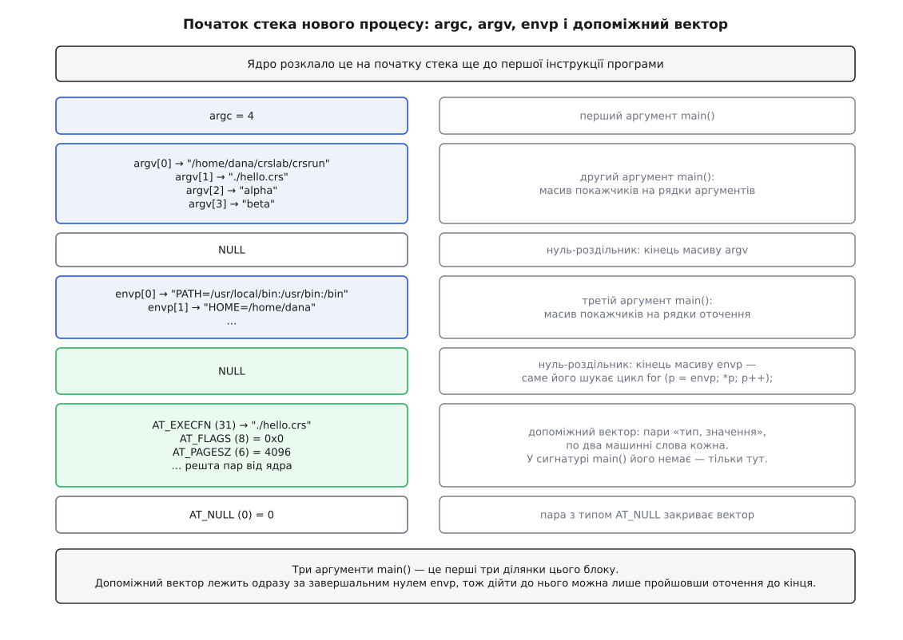

# ⚙️ Власний формат за десять хвилин

Тут ми заведемо в ядрі формат виконуваних файлів, якого не існує: чотири байти прикмети та крихітний «інтерпретатор» на C, що не інтерпретує нічого, а лише звітує про себе. Трьох запусків поспіль вистачить, щоб побачити на власні очі те, що інакше доводиться приймати на віру: як ядро переписує `argv`, що воно при цьому дописує в допоміжний вектор і чому з прапорцем `O` інтерпретатор читає файл, якого йому читати не дозволено.

## Прилад і піддослідний

Задум простий. Формат вигадуємо самі: файл нашого формату починається з чотирьох байтів `7f 43 52 53` — байт `0x7f` і три літери `CRS`, — після яких іде звичайний текст. Інтерпретатором ставимо власну програму, яка друкує все, що ядро їй передало: `argc`, усі `argv`, а тоді `AT_FLAGS` і `AT_EXECFD` з допоміжного вектора. Далі вона намагається дістатися до самого файлу — а те, як саме їй це вдається (чи не вдається), і є третім виміром.

Три запуски відрізнятимуться лише полем прапорців у рядку реєстрації: порожньо, `P`, `O`. Усе інше — та сама програма, той самий файл, той самий командний рядок.

Щоб дослід показав саме те, що обіцяно, потрібні чотири речі.

**Ядро з `binfmt_misc`.** Майже всі дистрибутиви його мають; перевірка — за наявністю каталогу після монтування.

**Ядро не старіше за 5.12.** Саме там з'явився біт `AT_FLAGS_PRESERVE_ARGV0`; на старіших ядрах `AT_FLAGS` завжди нуль, і другий вимір покаже лише половину картини. `AT_EXECFD` працює значно давніше.

**Права root — і водночас звичайний користувач.** Реєстрація вимагає `CAP_SYS_ADMIN` ([можливості замість всесильного root](root:sys-unix/capabilities) — саме та можливість, що дозволяє чіпати внутрішні таблиці ядра), тож писати в таблицю доведеться через `sudo`. А от **запускати** треба з-під звичайного користувача: у третьому вимірі ми знімемо з файлу право на читання, і root просто не помітив би цього — його `CAP_DAC_OVERRIDE` пропускає повз біти прав.

**Каталог, з якого дозволено виконувати.** Якщо `/tmp` змонтовано з `noexec`, дослід зупиниться ще на першому кроці; надійніше працювати в домашньому каталозі.

```sh
mkdir -p ~/crslab && cd ~/crslab
```

## Крок 1. Змонтувати таблицю

Таблиця `binfmt_misc` живе у власній файловій системі — такій, що не зберігає нічого на диску, а лише показує назовні структуру ядра ([псевдо-ФС: procfs, sysfs, tmpfs](root:sys-unix/pseudo-filesystems)). У більшості систем із systemd вона вже змонтована службою, тож спершу питаємо, а вже потім монтуємо:

```sh
mountpoint -q /proc/sys/fs/binfmt_misc \
    || sudo mount -t binfmt_misc none /proc/sys/fs/binfmt_misc

cat /proc/sys/fs/binfmt_misc/status
```

```
enabled
```

У каталозі тепер є два керуючі файли: `register`, у який пишуть нові записи, і `status`, який показує (і перемикає) стан механізму загалом. Кожен зареєстрований формат додасть сюди ще по файлу зі своїм іменем.

## Крок 2. Інтерпретатор, який лише звітує

Найменш очевидна частина програми — як вона взагалі дістає допоміжний вектор. У сигнатурі `main` його немає: `main` отримує `argc`, `argv` і (розширенням, яке підтримують і Linux, і решта Unix) `envp`. Вектора там ніби й нема.

Але він є — просто трохи далі. Ядро розкладає на початку стека нового процесу все одним суцільним блоком: число аргументів, масив покажчиків на аргументи, нуль-роздільник, масив покажчиків на змінні оточення, ще один нуль-роздільник — і одразу за ним пари «тип, значення» допоміжного вектора, аж до пари з типом `AT_NULL`. Тобто щоб дійти до вектора, досить пройти `envp` до його завершального нуля й ступити один крок далі.



*У сигнатурі `main` вектора немає, зате він лежить рівно за завершальним нулем `envp` — саме тому три рядки з покажчиками замінюють цілу бібліотеку.*

Глибше про те, які саме пари туди потрапляють і навіщо, — [допоміжний вектор ELF](root:sys-unix/auxiliary-vector): список пар «ключ — значення», яким ядро повідомляє новій програмі розмір сторінки, адресу vDSO, ідентифікатори та ще з десяток речей, що їх інакше довелося б питати системними викликами.

Тепер сам прилад:

```c
/* crsrun.c — «інтерпретатор», який нічого не інтерпретує, а лише звітує */
#include <stdio.h>
#include <string.h>
#include <errno.h>
#include <unistd.h>
#include <fcntl.h>
#include <elf.h>

#ifndef AT_FLAGS_PRESERVE_ARGV0            /* include/uapi/linux/binfmts.h */
#define AT_FLAGS_PRESERVE_ARGV0 1
#endif

static void report_file(int fd, const char *whence)
{
    unsigned char head[4];
    char body[256];
    ssize_t n;

    printf("  джерело: %s\n", whence);
    printf("  зсув у файлі: %ld\n", (long) lseek(fd, 0, SEEK_CUR));

    n = read(fd, head, sizeof head);
    if (n != (ssize_t) sizeof head) {
        printf("  прикмету прочитати не вдалося: %s\n", strerror(errno));
        return;
    }
    printf("  прикмета: %02x %02x %02x %02x\n",
           head[0], head[1], head[2], head[3]);

    n = read(fd, body, sizeof body - 1);
    if (n < 0)
        n = 0;
    body[n] = '\0';
    printf("  тіло: %s", body[0] == '\n' ? body + 1 : body);
}

int main(int argc, char **argv, char **envp)
{
    unsigned long *a;
    unsigned long at_flags = 0;
    long execfd = -1;
    const char *execfn = NULL;
    char **p;
    int i, fd;

    printf("argc = %d\n", argc);
    for (i = 0; i < argc; i++)
        printf("argv[%d] = \"%s\"\n", i, argv[i]);

    /* Допоміжний вектор лежить одразу за завершальним NULL масиву envp. */
    for (p = envp; *p; p++)
        ;
    for (a = (unsigned long *) (p + 1); a[0] != AT_NULL; a += 2) {
        switch (a[0]) {
        case AT_FLAGS:  at_flags = a[1];                break;
        case AT_EXECFD: execfd   = (long) a[1];         break;
        case AT_EXECFN: execfn   = (const char *) a[1]; break;
        }
    }

    printf("AT_EXECFN = %s\n", execfn ? execfn : "(немає)");
    printf("AT_FLAGS  = 0x%lx%s\n", at_flags,
           (at_flags & AT_FLAGS_PRESERVE_ARGV0) ? "  ← PRESERVE_ARGV0" : "");

    if (argc < 2) {
        printf("нема чого виконувати\n");
        return 2;
    }

    if (execfd >= 0) {
        printf("AT_EXECFD = %ld\n", execfd);
        fd = (int) execfd;
        printf("  FD_CLOEXEC: %s\n",
               (fcntl(fd, F_GETFD) & FD_CLOEXEC) ? "виставлено"
                                                 : "не виставлено");
        report_file(fd, "готовий дескриптор від ядра");
    } else {
        printf("AT_EXECFD немає — відкриваю за шляхом\n");
        fd = open(argv[1], O_RDONLY);
        if (fd < 0) {
            printf("  open(\"%s\"): %s\n", argv[1], strerror(errno));
            return 1;
        }
        report_file(fd, "власне open() за argv[1]");
    }
    return 0;
}
```

Кілька дрібниць у цьому коді варті пояснення.

Пари вектора читаємо як масив `unsigned long` по два слова, а не через структуру `Elf64_auxv_t`: так той самий код працює і на 32-бітних, і на 64-бітних системах, бо кожен елемент пари — рівно одне машинне слово.

Файл беремо саме за `argv[1]`, і саме тому, що ядро завжди кладе шлях до підміненого файлу першим після нульового елемента — незалежно від того, чи ввімкнено прапорець `P`. Прапорець зсуває все, що **після** цього місця, а не саме місце.

Константи `AT_NULL`, `AT_FLAGS`, `AT_EXECFD`, `AT_EXECFN` (0, 8, 2 і 31) дає `<elf.h>`. А `AT_FLAGS_PRESERVE_ARGV0` описано вже в заголовку ядра `<linux/binfmts.h>`, який у системі може бути й старішим за саме ядро, — тому підстраховуємося власним визначенням; значення бітове й фіксоване, це молодший біт.

Збираємо:

```sh
cc -O2 -Wall -o crsrun crsrun.c
```

## Крок 3. Файл нашого формату

```sh
{ printf '\x7fCRS\n'; printf 'привіт із власного формату\n'; } > hello.crs
chmod +x hello.crs
od -An -tx1 -N8 hello.crs
```

```
 7f 43 52 53 0a d0 bf d1
```

Перші чотири байти — прикмета, п'ятий — перевід рядка, далі йде текст у UTF-8. `printf` тут саме вбудований у bash: він розуміє `\x7f`; у деяких інших оболонках цієї послідовності немає.

Файл виконуваний, але ще нікому не потрібний:

```sh
env ./hello.crs
```

```
env: './hello.crs': Exec format error
```

Ми навмисно кличемо `env`, а не запускаємо файл напряму. `env` робить `execve` і чесно показує помилку, тоді як bash, отримавши `ENOEXEC`, ще й пробує підхопити файл як сценарій оболонки — і замість зрозумілої відмови вивалює купу «команду не знайдено».

## Крок 4. Реєстрація

Рядок реєстрації повторюватиметься тричі, тож заведімо дві коротенькі функції:

```sh
reg()   { printf '%s' ":crs:M::\\x7fCRS::$PWD/crsrun:$1" \
          | sudo tee /proc/sys/fs/binfmt_misc/register > /dev/null; }
unreg() { echo -1 | sudo tee /proc/sys/fs/binfmt_misc/crs > /dev/null; }
```

Тут два запобіжники проти найпоширенішої халепи. По-перше, `printf '%s'` друкує свій аргумент байт у байт: послідовність `\x7f` має дійти до ядра **нерозкритою**, бо розкриває її саме ядро. По-друге, `sudo tee`, а не `sudo echo … >`: перенаправлення відкриває файл ще та оболонка, що працює без прав, — і `sudo` їй уже не допоможе ([розкриття й лапки: коли текст стає аргументами](root:sys-unix/expansion-and-quoting)).

Реєструємо без жодного прапорця й дивимося, що вийшло:

```sh
reg
cat /proc/sys/fs/binfmt_misc/crs
```

```
enabled
interpreter /home/dana/crslab/crsrun
flags: 
offset 0
magic 7f435253
```

Рядка `mask` немає, бо поле маски ми лишили порожнім — тоді звіряються всі біти прикмети. Прикмета показана шістнадцятковими байтами: те саме `7f 43 52 53`, що й на початку файлу.

## Вимір 1. Куди подівся argv[0]

Щоб різниця була видима, покличемо файл із навмисно іншим нульовим аргументом — bash уміє це вбудованим `exec -a`:

```sh
bash -c 'exec -a myname ./hello.crs alpha beta'
```

```
argc = 4
argv[0] = "/home/dana/crslab/crsrun"
argv[1] = "./hello.crs"
argv[2] = "alpha"
argv[3] = "beta"
AT_EXECFN = ./hello.crs
AT_FLAGS  = 0x0
AT_EXECFD немає — відкриваю за шляхом
  джерело: власне open() за argv[1]
  зсув у файлі: 0
  прикмета: 7f 43 52 53
  тіло: привіт із власного формату
```

Формат запрацював: ядро підмінило виконуваний файл, і замість `Exec format error` ми маємо роботу власної програми. Тепер по рядках.

**`myname` зникло безслідно.** Ми ставили його нульовим аргументом; в інтерпретатора його немає взагалі — ані в `argv`, ані деінде. Ядро викинуло старий нульовий елемент і вставило попереду два свої рядки: шлях до інтерпретатора й шлях до файлу.

**`argv[1]` — це рівно той рядок, який отримав `execve`.** Не канонічний абсолютний шлях, не результат розв'язання символьних посилань: ми написали `./hello.crs` — його інтерпретатор і бачить. Якби ми запустили `hello.crs` через `PATH`, абсолютний шлях підставила б **оболонка**, і в `argv[1]` лежав би вже він. Різниця дошкульна: інтерпретатор не має права припускати, що дістав абсолютний шлях, і мусить рахуватися з поточним каталогом.

**`AT_EXECFN` показує початкове ім'я, а не інтерпретатора.** Ядро копіює рядок імені на стек один раз, ще на самому початку `execve` ([exec: заміна образу](root:sys-unix/exec-semantics) — усе, що може відмовити, робиться до руйнування старого образу), і жодна дальша підміна формату його вже не чіпає.

**`AT_FLAGS` нульовий.** Прапорців ми не ставили — ядру нема про що звітувати.

## Вимір 2. Прапорець P

Перереєстровуємо той самий формат, змінивши одну літеру:

```sh
unreg
reg P
bash -c 'exec -a myname ./hello.crs alpha beta'
```

```
argc = 5
argv[0] = "/home/dana/crslab/crsrun"
argv[1] = "./hello.crs"
argv[2] = "myname"
argv[3] = "alpha"
argv[4] = "beta"
AT_EXECFN = ./hello.crs
AT_FLAGS  = 0x1  ← PRESERVE_ARGV0
```

Аргументів стало на один більше, і `myname` уціліло — на третьому місці, одразу після шляху. Механізм тут прямолінійний: без прапорця ядро спершу викидає старий нульовий елемент, а тоді вставляє попереду два свої рядки; з прапорцем воно нічого не викидає, а лише вставляє. Тому `myname` не «перемістилося» — воно лишилося на своєму місці, а перед ним з’явилося ще два рядки.

І ось навіщо потрібен біт у `AT_FLAGS`. Інтерпретатор дивиться на `argv[2]` і бачить рядок. Це вцілілий колишній `argv[0]` — чи вже перший аргумент користувача? Порахувати не вийде: обидва вигляди однаково правдоподібні, а помилка означає, що інтерпретатор або з'їсть чужий аргумент, або підсуне програмі зайвий. До версії 5.12 єдиним виходом було вшити відповідь у сам інтерпретатор — той, кого реєструють із `P`, мусив знати про це наперед і не мати іншого режиму. Виставлений біт `AT_FLAGS_PRESERVE_ARGV0` перетворює здогад на факт: та сама програма тепер годиться для обох способів реєстрації й дізнається про свій випадок у мить запуску.

Тут-таки й межа цієї підказки: **нуль у `AT_FLAGS` не означає «прапорця немає»**. Він так само означає «ядро старе й не вміє це повідомляти». Обидва випадки виглядають однаково, тож інтерпретатор, який зобов'язаний працювати й на старих ядрах, усе одно потребує запасної домовленості.

## Вимір 3. Прапорець O і файл, який заборонено читати

Повертаємо реєстрацію без прапорців і забираємо у файлу право на читання, лишивши тільки виконання:

```sh
unreg
reg
chmod 111 hello.crs
ls -l hello.crs
```

```
---x--x--x 1 dana dana 55 сер  3 11:20 hello.crs
```

Такий режим для рідного ELF нічого не міняє: сторінки коду відображає само ядро, якому біти прав не указ ([біти прав і як їх перевіряють](root:sys-unix/permission-bits) — дозвіл на виконання й дозвіл на читання перевіряються окремо). А наш формат:

```sh
bash -c 'exec -a myname ./hello.crs alpha beta'; echo "код виходу: $?"
```

```
argc = 4
argv[0] = "/home/dana/crslab/crsrun"
argv[1] = "./hello.crs"
argv[2] = "alpha"
argv[3] = "beta"
AT_EXECFN = ./hello.crs
AT_FLAGS  = 0x0
AT_EXECFD немає — відкриваю за шляхом
  open("./hello.crs"): Permission denied
код виходу: 1
```

Зверни увагу, де саме сталася відмова. `execve` пройшов повністю: ядро впізнало прикмету, підмінило файл, запустило інтерпретатора — той навіть устиг надрукувати вісім рядків. Спіткнулася **звичайна програма зі звичайними правами**, коли спробувала відкрити файл своїм `open`. Ядро мало право читати цей файл, інтерпретатор — ні.

Тепер той самий дослід із прапорцем `O`:

```sh
unreg
reg O
bash -c 'exec -a myname ./hello.crs alpha beta'
```

```
argc = 4
argv[0] = "/home/dana/crslab/crsrun"
argv[1] = "./hello.crs"
argv[2] = "alpha"
argv[3] = "beta"
AT_EXECFN = ./hello.crs
AT_FLAGS  = 0x0
AT_EXECFD = 3
  FD_CLOEXEC: не виставлено
  джерело: готовий дескриптор від ядра
  зсув у файлі: 0
  прикмета: 7f 43 52 53
  тіло: привіт із власного формату
```

Права файлу не змінилися — змінилося те, **хто його відкривав**. Ядро вже тримало цей файл відкритим (воно ж читало з нього перші байти, щоб упізнати прикмету) і просто віддало його інтерпретаторові готовим ([файловий дескриптор](root:sys-unix/file-descriptor) — мале число, індекс у таблиці процесу).

Три дрібниці в цьому виводі варті окремого погляду.

**`AT_EXECFD = 3`.** Число не магічне: ядро бере перше вільне місце в таблиці дескрипторів, а 0, 1 і 2 зайняті успадкованими потоками ([три потоки: stdin, stdout, stderr](root:sys-unix/standard-streams)). Покладатися на трійку не можна — вона буде іншою, якщо запускати з відкритими дескрипторами.

**`FD_CLOEXEC` не виставлено.** Ядро додає дескриптор без цього прапорця, тобто він переживе наступний `exec` і потрапить у дочірні процеси. Для емулятора, який зараз-таки й виконуватиме програму, це нормально; для інтерпретатора, який породжує дітей, — привід закрити дескриптор власноруч, коли він більше не потрібен.

**Зсув у файлі — нуль.** Хоча ядро вже читало з цього файлу початок, читало воно з окремим зсувом, а не тим, що зберігається в дескрипторі. Інтерпретаторові файл дістається з самого початку, і жодного `lseek` перед читанням не треба.

## Прибирання

```sh
chmod 755 hello.crs
unreg                     # те саме, що: echo -1 > /proc/sys/fs/binfmt_misc/crs
```

Керуючі числа тут три, і плутати їх не варто: `0` вимикає запис (він лишається в каталозі, `cat` покаже `disabled`), `1` вмикає назад, `-1` прибирає остаточно разом із файлом. Ті самі числа приймає й `status`, тільки діють вони на всю таблицю: `echo -1 > status` змітає **всі** записи — і чужі теж.

Якщо файлову систему монтував ти сам, її можна й відмонтувати:

```sh
sudo umount /proc/sys/fs/binfmt_misc
```

Якщо ж вона була змонтована ще до досліду — краще не чіпати: у системі, найпевніше, живуть чужі записи. Записи взагалі не переживають перезавантаження, тож постійні формати розкладають на старті: у systemd це `systemd-binfmt.service` із файлами в `/etc/binfmt.d/` ([systemd: юніти, залежності, цілі](root:sys-unix/systemd-model)).

## Чому реєстрація відмовляє

Запис у `register` — це один `write()`, який ядро розбирає посимвольно зліва направо, полем за полем. Тому майже всі відмови приходять під одним іменем — `Invalid argument`, — і корисна інформація не в тексті помилки, а в тому, на якому полі розбір спіткнувся. Ось повний перелік того, об що спотикаються найчастіше.

**`No such file or directory` при спробі писати в `register`.** Файлової системи не змонтовано — самого шляху не існує. Найбанальніша й найчастіша причина.

**`Permission denied` при спробі писати в `register`.** Немає прав. Або справді забули `sudo`, або (значно частіше) написали `sudo echo … > /proc/…`: перенаправлення виконує оболонка, яка прав не має, і `sudo` встигає лише до `echo`. Ліки — `sudo tee` або `sudo bash -c '…'`.

**`Invalid argument`: забутий сьомий роздільник.** Рядок `:name:type:offset:magic:mask:interpreter:flags` має **сім** двокрапок, і остання потрібна навіть тоді, коли прапорців немає. Розбір, дійшовши до поля інтерпретатора, шукає роздільник після нього — не знаходить і здається. Це найпоширеніша відмова взагалі.

**`Invalid argument`: чужа літера в прапорцях.** Ядро приймає `P`, `O`, `C`, `F` — саме великими. Дійшовши до літери, якої не знає (`p`, `f`, `X`), розбір зупиняється й вимагає, щоб на цьому місці був кінець рядка; коли там ще щось є — відмова. Окремий випадок тієї самої перевірки: не можна брати роздільником літеру з `POCF`, бо тоді розбір прапорців з'їсть її сам.

**`Invalid argument`: маска не тієї довжини.** Маска мусить мати рівно стільки ж байтів, скільки прикмета. Прикмета в чотири байти й маска в три — відмова.

**`Invalid argument`: прикмета не вміщується в буфер.** `offset` плюс довжина прикмети мають лишатися в межах того, що `execve` уже прочитало з файлу: 256 байтів (історично 128). Порівнювати те, чого ядро не читало, воно не піде.

**`Invalid argument`: порожнє або неправильне ім'я.** Ім'я стає файлом у каталозі, тож `/`, `.` і `..` заборонені, а порожнє ім'я — тим паче. Так само відмовляє порожня прикмета.

**`Invalid argument`: рядок задовгий.** Стеля — 1920 символів на весь рядок реєстрації; підлога — 11.

**`Invalid argument`: оболонка розкрила зворотні скісні риски раніше за ядро.** Вбудований `echo` у bash лишає `\x7f` як є, а `echo` у dash (тобто в `/bin/sh` на Debian і Ubuntu) намагається розкривати послідовності сам. У результаті до ядра приходять не ті байти, які ти писав, — і воно або спотикається на розборі прикмети, або мовчки реєструє формат, який не збігається ні з чим. Друга половина цієї пастки найгидкіша: реєстрація проходить успішно, а файли просто далі відповідають `Exec format error`.

**`File exists`.** Запис із таким іменем уже зареєстровано. Саме це отримуєш, повторюючи дослід і забувши `unreg`.

**`No such file or directory` уже після розбору рядка.** Буває тільки з прапорцем `F`: ядро відкриває інтерпретатора просто під час реєстрації, і хибний шлях видно негайно. Без `F` шлях не перевіряють узагалі — реєстрація з друкарською помилкою в шляху пройде успішно, а `ENOENT` вилізе аж при кожному запуску, і показуватиме він пальцем не на інтерпретатора, а на невинний файл, який ти намагався запустити.

І одна відмова, яка виглядає як помилка реєстрації, хоч нею не є: **`Exec format error` після успішної реєстрації**. Причин у неї три — прикмета в записі не збігається з файлом (звіряй через `od -An -tx1 -N4`), запис вимкнено (`cat` покаже `disabled`) або таблицю змели чужі руки, найчастіше `systemd-binfmt` при перезапуску служби. Якщо ж замість цього видно `Permission denied` — у файлу просто немає біта виконання, і до `binfmt_misc` справа не дійшла.

Скелет, зібраний тут, лишається придатним і далі. Заміни `report_file` на щось, що справді розбирає файл, — і твій формат почне запускатися з `Makefile`, з поля `ExecStart` службового юніта й з подвійного кліку однаково, бо всі вони проходять крізь той самий `execve`, у якому й стається підміна.
