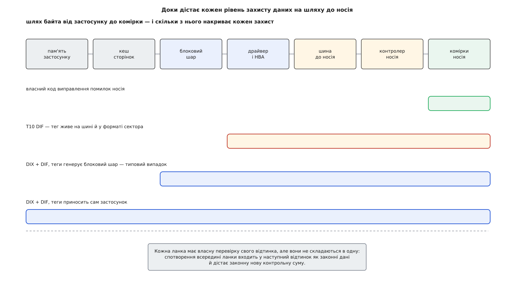
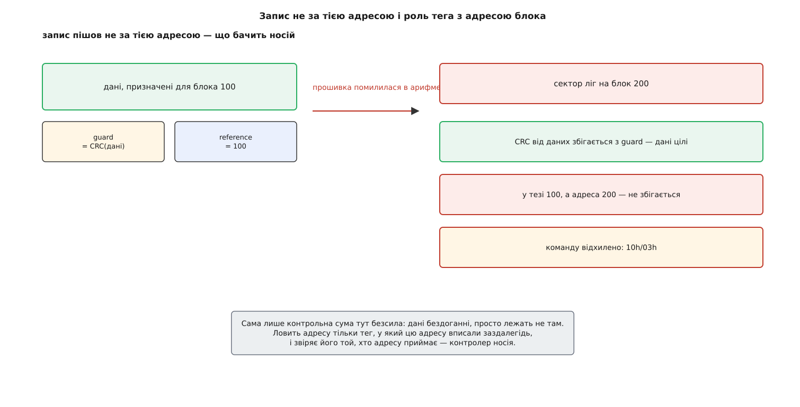
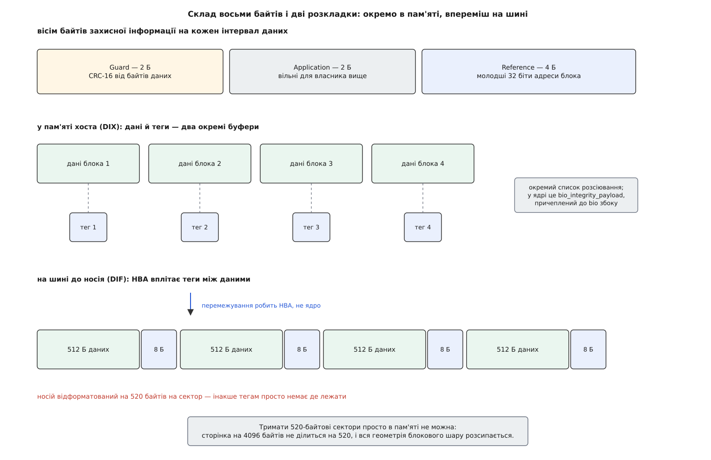

# Профіль цілісності блокового шару: T10 DIF/DIX і додаткові байти на сектор

<preknowlist>
- [Блоковий пристрій: сектори, блоки й черга запитів](root:sys-unix/block-device-model) — для ядра носій це масив пронумерованих секторів однакового розміру, а кожне звернення оформлене окремою структурою з номером сектора, довжиною й списком сторінок пам'яті.
- [Контрольні суми](root:com-modulation/checksums) — коротке число, пораховане з даних так, що після зміни даних воно майже напевно перестає збігатися.
- [CRC](root:com-modulation/crc) — контрольна сума на остачі від ділення многочленів: дешева й розрахована саме на випадкові спотворення, зокрема пакетні.
- [Підсистема SCSI: команди, сенс-коди й обробка помилок](root:sys-unix/scsi-subsystem) — пристрій відповідає на команди й на відмову повертає сенс-дані з ключем і додатковим кодом, за якими ядро розуміє причину.
- [NVMe в Linux: черги, простори імен і власна багатошляховість](root:sys-unix/nvme-in-linux) — носій розбитий на простори імен, а формат простору імен задає розмір логічного блока й розмір службових даних біля нього.
- [DMA і відображення буферів у ядрі](root:sys-unix/dma-and-buffers) — контролер забирає дані з пам'яті сам, за списком розсіювання: набором пар «адреса, довжина», а не одним суцільним шматком.
</preknowlist>

Байти, які повернулися з диска, не збігаються з тими, що туди йшли, — і жодна ланка дорогою не поскаржилася. Питання навіть не в тому, хто винен. Питання в тому, хто взагалі мав змогу помітити.

Кожен учасник шляху щось перевіряє, і кожен перевіряє **свій** відтинок. Кабель везе дані під власною контрольною сумою й ловить перекручений на дроті біт. Комірки носія накриті кодом виправлення помилок і ловлять деградацію магнітного шару чи заряду. Пам'ять машини з ECC ловить перевернутий біт у планці. Усе це працює — і все це не складається в одну перевірку.

Причина проста й неприємна. Перевірка накриває відтинок і закінчується на його межі; далі дані передають наступній ланці, і та рахує над ними **свою** суму — уже над тим, що отримала. Якщо спотворення сталося не на відтинку, а **всередині** ланки — у статичній пам'яті контролера, у драйвері, в арифметиці адрес усередині прошивки, — воно потрапляє в наступний відтинок як законні дані й дістає законну нову контрольну суму. Ланцюжок локальних перевірок ніколи не дає глобальної.

І момент перевірки важить не менше за її обсяг. Контрольна сума, яку файлова система звіряє при читанні, спрацює тоді, коли дані вже прочитають — може, за півроку, коли добра копія давно зникла з пам'яті й переписати нічого.

З цього видно, чого бракує. Потрібне одне число, пораховане **один раз** якомога вище по стеку, яке їде разом із даними до самих комірок і яке звіряє **кожен**, хто передає дані далі. Тоді перша ж ланка, що зіпсувала дані, сама про це й скаже — синхронно, поки добра копія ще лежить у пам'яті й запис можна повторити.

Ось тут і починається справжня складність. Найнижча ланка — сам носій. Щоб носій міг звірити це число, він мусить про нього знати: розуміти, що після даних іде саме тег, а не наступний сектор. Отже, така перевірка не може бути вигадкою операційної системи. Вона мусить бути частиною **формату сектора**, на який погодилися виробники носіїв.

Комітет T10, що веде стандарти SCSI, вписав її в SBC-3 під назвою захисної інформації — у побуті DIF, Data Integrity Field, поле цілісності даних. Сукупність механізмів, якими Linux цим користується, у ядрі зветься **профілем цілісності** блокового пристрою.



*Локальні перевірки не складаються в наскрізну: спотворення всередині ланки виходить із неї як законні дані.*

## Звідки взяти вісім байтів

Сектор має рівно 512 байтів, логічний блок сучасного носія — 4096. Вільного біта в них немає. Тому носій, який уміє захисну інформацію, **форматують інакше**: 520 байтів замість 512 або 4104 замість 4096. Це не програмна настройка, а низькорівневе форматування, після якого носій фізично несе на кожному блоці вісім зайвих байтів.

Скільки це коштує ємності, рахується прямо.

**Той самий носій у форматі 512 і 520 байтів на сектор.**

```
частка службових байтів (512+8)  = 8 / 520   = 1.54 %
частка службових байтів (4096+8) = 8 / 4104  = 0.19 %
носій на 4 ТБ у форматі 520      → видима ємність меншає приблизно на 60 ГБ
```

Великий блок робить цю плату майже непомітною — і це ще одна причина, чому корпоративні носії живуть на чотирикілобайтових блоках, а не на півкілобайтових.

Чи відформатований носій під захист, ядро питає в самого носія: у SCSI це відповідь на `READ CAPACITY(16)`, де є прапорець увімкненого захисту й тип захисту; у NVMe — формат простору імен, у якому вказано розмір службових даних на блок. Перевести носій у такий формат можна лише повним переформатуванням, тобто зі знищенням усього, що на ньому лежить.

## Що покласти у ці вісім байтів

Перше, що спадає на думку, — контрольну суму. Так і є: перші два байти це **guard**, вартовий, і в ньому CRC-16 від байтів даних цього блока. Многочлен вибрано свій, x¹⁶+x¹⁵+x¹¹+x⁹+x⁸+x⁷+x⁵+x⁴+x²+x+1, у шістнадцятковому запису 0x8BB7. Він ловить перевернутий біт, зіпсований пакет бітів, сміття, що приїхало замість даних.

Але є цілий клас відмов, проти яких вартовий безсилий. Прошивка помилилася в арифметиці й записала правильні дані **не за тією адресою**. Дані цілі, CRC від них сходиться бездоганно — просто лежать вони на чужому місці, а на своєму лишилося вчорашнє, теж бездоганне. Жодна сума від вмісту цього не побачить, бо з погляду вмісту нічого не сталося.

Щоб адресу можна було звірити, її треба вписати в сам тег. Наступні чотири байти — **reference**, посилальний тег, і в найпростішому випадку це молодші 32 біти адреси логічного блока. Тепер носій, приймаючи запис на блок 200, дивиться в тег, бачить там 100 і відмовляє.



*Тег з адресою ловить те, чого не бачить жодна сума від вмісту, — і ловить його той, хто адресу приймає.*

Лишаються два байти. Їх стандарт не займає: це **application**, прикладний тег, місце для того, хто стоїть вище носія. Задум був у тому, щоб файлова система чи база даних поклали туди свою мітку — скажімо, короткий ідентифікатор об'єкта, якому належить блок, — і дістали захист не лише від зміщення адреси, а й від плутанини між своїми ж структурами. За домовленістю носій ці два байти не перевіряє взагалі, доки йому окремо не скажуть, що власник у них є; у SCSI цим відає окремий біт у сторінці керування.

Із того, що посилальний тег прив'язаний до адреси, одразу випливає ускладнення. Якщо між ініціатором і носієм стоїть шар, який **переставляє адреси** — масив, що розкидає блоки по дисках, або віртуалізація сховища, — тег, посланий із однією адресою, приїде на блок з іншою й не зійдеться нізащо. Тому типів захисту три, і різняться вони саме поводженням із цим тегом. Тип 1 — тег дорівнює молодшим 32 бітам адреси, класичний випадок. Тип 3 — тег не перевіряють узагалі, лишається сама контрольна сума; це і є відповідь для тих, хто адреси переставляє. Тип 2 — компроміс: початкове значення тега задає сам ініціатор в окремих командах читання й запису подовженого формату, а далі носій лише стежить, щоб воно зростало на одиницю на кожен наступний блок.

## Чому самого DIF замало

Захисна інформація за стандартом визначена на **транспорті**: між ініціатором, тобто адаптером у машині, і носієм. Це вже багато — накрито кабель, комутатор, контролер, комірки. Але верхня межа цього конверта проходить по адаптеру, а над ним лежить уся машина: драйвер, блоковий шар, кеш сторінок, пам'ять застосунку. Спотворення, що сталося там, адаптер сумлінно накриє правильним тегом і відправить на носій як істину.

Напрошується просте: тримати 520-байтові сектори прямо в пам'яті хоста, тоді тег народжується нагорі й ніхто його дорогою не перераховує. Спробуймо — і воно розсипається на першому ж кроці. Сторінка пам'яті має 4096 байтів і на 520 не ділиться: у сторінку влізло б сім секторів і трохи, вісімнадцятий байт восьмого сектора висів би на межі сторінок. Кеш сторінок, вирівнювання буферів під DMA, розмір блока файлової системи, арифметика зсувів — усе в блоковому шарі стоїть на степенях двійки, і 520 ламає це все.

Розв'язок знайшла Oracle й назвала його **DIX** (Data Integrity Extensions, розширення цілісності даних): дані й теги лежать у пам'яті **окремо**, двома буферами й двома списками розсіювання, а перемежовує їх адаптер уже на шляху на шину. У пам'яті геометрія лишається степенями двійки; на носій їде формат, якого вимагає стандарт.



*Ядро ніколи не збирає 520-байтових секторів у пам'яті — це робота адаптера на самому виході.*

Саме це розділення й видно в ядрі: до структури запиту `bio` збоку чіпляється окремий вантаж, `bio_integrity_payload` — маленька копія `bio` з власним списком сторінок, у яких лежать самі теги. Дані та їхній захист їдуть паралельно, кожен своїм списком, і зустрічаються аж у контролері.

Одна деталь цього розділення варта окремої згадки. CRC-16 з многочленом 0x8BB7 — не той алгоритм, для якого процесор має готову команду; коли DIX з'являвся, порахувати його програмно на кожен блок було відчутно дорого. Тому DIX дозволяє хосту рахувати замість нього дешеву 16-бітову суму доповнень — ту саму, що в заголовках IP, — а адаптеру перерахувати її на справжній CRC перед відправкою. Плата очевидна: у точці перетворення конверт має шов, а сама сума слабша за CRC. Згодом аргумент про дорожнечу зів'яв: у ядрі з'явилися реалізації цього CRC через векторне множення многочленів — `crct10dif` на PCLMULQDQ для x86-64 і на PMULL для ARMv8, — і рахувати справжній вартовий стало практично безкоштовно.

> 🔧 **Навіщо це.** Коли на машині, де `/sys/block/sda/integrity/format` показує `T10-DIF-TYPE1-IP`, шукають, звідки взявся зіпсований блок, варто пам'ятати, де в цьому конверті шов. Тип `-IP` означає, що адаптер перераховував суму, а отже, спотворення, яке сталося саме в адаптері між перевіркою й перетворенням, пройде далі як законне. Перевести носій і адаптер на `-CRC` — це не про швидкість, це про те, щоб на всьому шляху жило одне-єдине число.

## Профіль у блоковому шарі

Блоковому шару треба знати про кожен пристрій дві речі: чи він узагалі вміє захисну інформацію і як саме вона в нього влаштована. Це і є профіль — невелика структура `blk_integrity`, яку драйвер заповнює й віддає ядру разом із рештою обмежень черги.

Змісту в ній рівно стільки, скільки треба, щоб згенерувати й звірити тег: тип контрольної суми (жодної, сума доповнень, CRC-16, CRC-64), розмір одного кортежу в байтах, розмір інтервалу даних, який цей кортеж накриває, кількість байтів тега, вільних для власника вище, і прапорці — чи генерувати при записі, чи звіряти при читанні, чи пристрій справді зберігає ці байти в себе.

Довгий час на цьому місці стояла таблиця вказівників на функції, окремий «профіль» під кожну комбінацію. У ядрі 6.11 Крістоф Гельвіґ прибрав цю непряму адресацію: конфігурація тут двовимірна — тип суми й наявність посилального тега, — і два рівні непрямих викликів на кожен блок даних вона не виправдовує.

Назовні профіль видно в sysfs, окремою текою під пристроєм.

```sh
$ cat /sys/block/sda/integrity/format
T10-DIF-TYPE1-CRC
$ cat /sys/block/sda/integrity/protection_interval_bytes
512
$ cat /sys/block/sda/integrity/tag_size
2
$ cat /sys/block/sda/integrity/device_is_integrity_capable
1
$ cat /sys/block/sda/integrity/write_generate
1
$ cat /sys/block/sda/integrity/read_verify
1
```

Читається це так: носій відформатований під захист типу 1 із CRC, один кортеж накриває 512 байтів даних, два байти прикладного тега віддано власникові вище, а блоковий шар сам генерує теги при записі й сам звіряє їх при читанні. Для типу 3 у цьому рядку стояло б 6: посилальний тег там не перевіряють, тож його чотири байти теж лишаються вільними. Якщо теки `integrity` немає взагалі — профілю немає, і далі шукати нема чого. Повний перелік того, що тут показують і як цим керувати з командного рядка, зібрано окремо: [інтерфейси профілю цілісності](root:sys-unix/block-integrity-profile/api-integrity-interfaces.md).

## Хто насправді рахує тег

Задум був у тому, щоб тег народжувався якомога вище — в ідеалі в застосунку, який знає, що саме він пише. На практиці майже жодна файлова система в Linux захисної інформації не генерує: у неї для цього немає ні місця в структурах, ні причини, бо ті, кому це справді треба, працюють із блоковим пристроєм навпростець.

Тому цю роботу перебрав на себе блоковий шар. Коли запит іде вниз, `bio_integrity_prep()` дивиться на профіль пристрою і, якщо тегів у запиті немає, виділяє під них сторінки й заповнює сам: для запису рахує вартового й вписує адресу, для читання просто готує буфер, який заповнить контролер, а на завершенні звіряє. Прапорці `write_generate` й `read_verify` в sysfs вмикають і вимикають саме цю поведінку.

Наслідок треба назвати чесно. Конверт у типовій системі починається не в застосунку, а в блоковому шарі — і все, що сталося з даними вище, у кеші сторінок або в пам'яті процесу, лишається поза ним. Це все одно набагато більше, ніж накривав би самий DIF, але «наскрізним від застосунку» воно не є.

Останню ділянку закрили нещодавно й з іншого боку. У ядрі 6.14 з'явився інтерфейс, яким застосунок передає власні теги разом із операцією через [io_uring](root:sys-unix/io-uring-rings-model): у запиті на читання чи запис їде вказівник на буфер із захисною інформацією, початкове значення посилального тега, прикладний тег і прапорці, які саме перевірки має зробити носій. Саме цього десятиліттями бракувало базам даних, які пишуть повз файлову систему [прямим вводом-виводом](root:sys-unix/buffered-and-direct-io): тепер число, пораховане в пам'яті процесу, доїжджає до комірок незміненим.

## Адреса в тезі й шари, які адресу міняють

Прив'язка посилального тега до адреси створює всередині самого ядра проблему, якої в стандарті не видно. Запит, адресований [розділу](root:sys-unix/disk-partitions) `/dev/sda1`, у ядрі має номер сектора, відлічений від початку розділу; на носій він піде з номером, відлічним від початку диска. Теги ж пораховані з першим числом, а звірятиме носій із другим.

Тому перед відправкою команди теги переписують: спеціальна пара функцій блокового шару проходить по кортежах запиту й замінює віртуальні адреси на фізичні, а на завершенні повертає назад — щоб той, хто ці теги готував, побачив свої числа, а не чужі. Коштує це прохід по кортежах на кожен запит і працює тільки для типу 1, де адреса зростає на одиницю на блок.

Із тієї самої причини профілі не змішуються при складанні пристроїв із шарів. Коли [device mapper](root:sys-unix/device-mapper) чи [програмний RAID](root:sys-unix/md-raid) збирає новий пристрій із кількох нижніх, ядро звіряє їхні профілі й лишає профіль зверху тільки тоді, коли вони **однакові**. Розійшлися тип суми, розмір інтервалу чи розмір тега — цілісність із зібраного пристрою просто зникає: краще чесно не мати профілю, ніж мати такий, за яким половина запитів буде відхилена.

Тут-таки видно, де межа між цим механізмом і [dm-integrity](root:sys-unix/dm-integrity). Профіль T10 вимагає, щоб про теги знало **залізо** — і носій, і адаптер, і драйвер; де цього немає, він просто відсутній. dm-integrity розв'язує ту саму задачу без жодної допомоги заліза: відрізає частину звичайного носія під теги й тримає їх сам. Конверт при цьому виходить коротший — від device mapper до носія й ані байтом вище, — зате доступний на будь-якому диску.

## Той самий задум в NVMe

NVMe прийшов пізніше й переніс механізм майже без змін, тільки назвав інакше. Простір імен форматують так, щоб на кожен логічний блок припадало трохи службових байтів, і захисна інформація займає в них перші або останні вісім. Типи ті самі, з тим самим поводженням із посилальним тегом.

Різниця в тому, як ці байти їдуть у пам'яті. NVMe дозволяє обидва варіанти: або службові байти йдуть суцільно за даними в тому самому буфері — розширений формат блока, точний аналог 4104 байтів у SCSI, — або окремим буфером за окремим вказівником, тобто рівно так, як це любить блоковий шар Linux. У командах є два поля керування: одне каже контролеру самому вставити теги при записі й зняти при читанні, друге вибирає, які саме з трьох тегів перевіряти.

Версія NVMe 2.0 додала до цього ширші формати: вартового на 64 біти замість 16 і окреме поле для мітки зберігання. Зміст рішення той самий — на дуже великих носіях шістнадцяти бітів контрольної суми на блок починає бракувати, — а конструкція незмінна.

## Чого профіль не робить

Він не захищає від зловмисника. CRC — відома всім функція від даних; хто змінив блок, перерахує тег за мікросекунду. Проти свідомої підміни працює зовсім інша техніка, з ключем або із зовнішнім коренем довіри.

Він не лагодить. Коли перевірка не зійшлася, носій відповідає відмовою з додатковим кодом 10h і уточненням, який саме тег не збігся — вартовий, прикладний чи посилальний; Linux перетворює це на власний код помилки, і читання просто не вдається. У цьому й уся суть: тихе спотворення стає гучним. Що робити далі — брати другу копію з дзеркала, репліки чи резервної копії — вирішує шар вище, і без нього профіль лише повідомляє про втрату, а не рятує від неї.

Він не знає про файли. Тег прив'язаний до адреси блока, а не до вмісту: коли файлова система переносить блок на інше місце, теги для нового місця рахують заново, і жодного зв'язку зі старим не лишається. Захищено сховище, а не історія даних.

І він не працює наполовину. Потрібні одночасно носій, відформатований під захист, адаптер, який уміє DIX, і драйвер, який про це заявив ядру; випав хоч один — теки `integrity` в sysfs не буде. Саме тому профіль і є окремою сутністю в блоковому шарі: він не вмикає захист, а описує, докуди той дістає на цій конкретній машині.

З цього боку весь механізм читається одним реченням. Наскрізна перевірка можлива лише там, де всі — стандарт формату сектора, транспорт, адаптер, драйвер і ядро — заздалегідь домовилися про ті самі вісім байтів; ціна домовленості видна у форматуванні носія й у переписуванні тегів на кожному шарі, а виграш у тому, що зіпсовані дані більше не подорожують мовчки.

Як цей аргумент визрівав — від чого відштовхувалися в комітеті T10 на початку 2000-х, які польові дослідження показали, що тихе спотворення не рідкість, і чому саме Oracle довелося дописувати до стандарту другу половину — розказано окремо: [історія наскрізного аргументу](root:sys-unix/block-integrity-profile/hist-end-to-end-argument.md). А порахувати вартового й посилальний тег власними руками, прочитати блок разом зі службовими байтами й побачити, як виглядає розбіжність, можна на невеликій програмі: [захисна інформація вручну](root:sys-unix/block-integrity-profile/proj-pi-by-hand.md).
