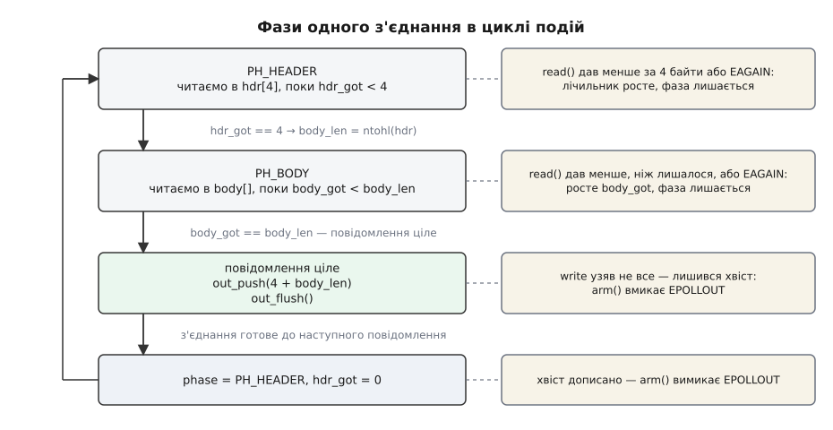
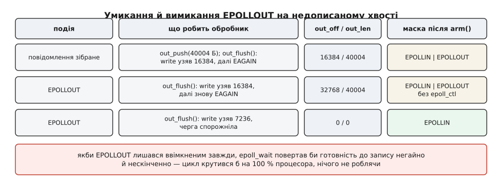

# ⚙️ Той самий сервер двома способами

Нижче один і той самий мережевий сервер написаний двічі на C: спершу як обробник із блокуючими викликами й потоком на з'єднання, потім як автомат станів у циклі подій на `epoll` з `O_NONBLOCK`. Протокол у них байт у байт однаковий — клієнт не відрізнить, з ким розмовляє. Цінність саме в зіставленні: видно рядок у рядок, який стан ядро зберігало за нас у кадрах стека і що довелося виписати руками, коли стек забрали.

Обидві програми — робочі й компільовані, без скорочень і псевдокоду. Код навмисно тримається однієї теми: жодних таймаутів, логів, конфігів, розбору заголовків — усе, що ви побачите, є або протоколом, або платою за модель очікування.

## Протокол на три речення

TCP не передає повідомлень. Він передає потік байтів, у якому межі ваших `write` не збережено: два записи по 10 байтів можуть прийти одним `read` на 20 або п'ятьма по 4 ([TCP і UDP](root:com-transport/tcp-vs-udp) — перший дає надійний упорядкований потік без меж повідомлень, другий — окремі датаграми зі збереженими межами, але без гарантій доставки). Отже, межі мусить домалювати сам протокол — це називають кадруванням ([кадрування повідомлень у потоці TCP](root:com-protocol/tcp-message-framing) — три класичні схеми: префікс довжини, роздільник і самоописний формат; вибір визначає, скільки станів матиме розбирач).

Беремо найпростішу схему — префікс довжини:

```
заголовок:  4 байти, довжина тіла, порядок мережевий (старший байт першим)
тіло:       рівно стільки байтів, скільки сказав заголовок
відповідь:  той самий заголовок і те саме тіло назад
```

Вибір не випадковий. Префікс фіксованої довжини дає **рівно два стани розбирача**: «збираємо чотири байти заголовка» і «збираємо `len` байтів тіла». Роздільник дав би третій — «шукаємо роздільник у вже прочитаному», зі своїм зсувом пошуку, який теж довелося б зберігати між подіями. Тобто складність автомата станів закладається ще на етапі, коли протокол лише малюють на серветці.

## Версія перша: потік на з'єднання

Почнімо з двох помічників, і перший із них — уже урок. Блокуючий `read` **не зобов'язаний** повернути стільки, скільки просили: він повертає стільки, скільки є прямо зараз, аби хоч один байт. Тому «прочитати рівно чотири байти» — це цикл, а не виклик:

```c
/* echo_blocking.c — потік на з'єднання, усі виклики блокуючі.
 * gcc -O2 -Wall -Wextra -pthread -o echo_blocking echo_blocking.c
 */
#define _GNU_SOURCE
#include <arpa/inet.h>
#include <errno.h>
#include <netinet/in.h>
#include <pthread.h>
#include <signal.h>
#include <stdint.h>
#include <stdio.h>
#include <stdlib.h>
#include <string.h>
#include <sys/socket.h>
#include <unistd.h>

#define PORT      9000
#define MAX_BODY  (64u * 1024u)

/* Читає рівно n байтів. 1 — прочитано, 0 — інший бік закрив, -1 — помилка. */
static int read_full(int fd, void *buf, size_t n)
{
    char *p = buf;
    while (n > 0) {
        ssize_t k = read(fd, p, n);
        if (k == 0) return 0;
        if (k < 0) {
            if (errno == EINTR) continue;
            return -1;
        }
        p += k;
        n -= (size_t)k;
    }
    return 1;
}

/* Пише рівно n байтів. 1 — записано, -1 — помилка. */
static int write_full(int fd, const void *buf, size_t n)
{
    const char *p = buf;
    while (n > 0) {
        ssize_t k = write(fd, p, n);
        if (k < 0) {
            if (errno == EINTR) continue;
            return -1;
        }
        p += k;
        n -= (size_t)k;
    }
    return 1;
}
```

Перевірка на `EINTR` тут не декорація: сигнал, що прийшов посеред очікування, вибиває виклик із поверненням −1 і саме цим кодом ([сигнал](root:sys-unix/signal-model) — асинхронне сповіщення, яке ядро доставляє задачі й яке пробуджує її з перериванного сну; без прапорця `SA_RESTART` перерваний виклик доводиться повторювати руками).

А ось власне обробник — уся розмова з клієнтом:

```c
static void *serve(void *arg)
{
    int fd = (int)(intptr_t)arg;
    char *body = malloc(MAX_BODY);

    if (body != NULL) {
        for (;;) {
            uint32_t hdr;
            if (read_full(fd, &hdr, 4) != 1) break;

            uint32_t len = ntohl(hdr);
            if (len > MAX_BODY) break;

            if (read_full(fd, body, len) != 1) break;
            if (write_full(fd, &hdr, 4) != 1) break;
            if (write_full(fd, body, len) != 1) break;
        }
    }

    free(body);
    close(fd);
    return NULL;
}
```

Дев'ять значущих рядків, і вони читаються так само, як протокол розповідають уголос: прочитали заголовок, дізналися довжину, прочитали тіло, відповіли, повторили. Приймальня не складніша:

```c
int main(void)
{
    signal(SIGPIPE, SIG_IGN);     /* інакше запис у закритий сокет уб'є процес */

    int ls = socket(AF_INET, SOCK_STREAM, 0);
    if (ls < 0) { perror("socket"); return 1; }

    int one = 1;
    setsockopt(ls, SOL_SOCKET, SO_REUSEADDR, &one, sizeof one);

    struct sockaddr_in a;
    memset(&a, 0, sizeof a);
    a.sin_family      = AF_INET;
    a.sin_addr.s_addr = htonl(INADDR_LOOPBACK);
    a.sin_port        = htons(PORT);

    if (bind(ls, (struct sockaddr *)&a, sizeof a) < 0) { perror("bind");   return 1; }
    if (listen(ls, 128) < 0)                           { perror("listen"); return 1; }

    for (;;) {
        int fd = accept(ls, NULL, NULL);       /* тут потік спить, поки нема клієнта */
        if (fd < 0) {
            if (errno == EINTR) continue;
            perror("accept");
            break;
        }
        pthread_t t;
        if (pthread_create(&t, NULL, serve, (void *)(intptr_t)fd) != 0) {
            close(fd);                          /* потоки скінчилися — відмовляємо */
            continue;
        }
        pthread_detach(t);
    }
    return 0;
}
```

Тепер найважливіше запитання до цього коду: **де тут стан незавершеної розмови?** Формально — ніде: жодної структури «з'єднання» ми не оголошували. Насправді він розкиданий по чотирьох місцях, і всі вони — кадри стека цього потоку.

## Що саме доведеться перекласти

Пройдімо по обробнику й випишімо, що саме він зберігає, поки чекає.

| що зберігається | де саме воно живе | у циклі подій стане |
|---|---|---|
| до якого рядка `serve()` дійшли | адреса повернення в кадрі стека | `phase` |
| скільки байтів заголовка вже є | `p` і `n` усередині `read_full` | `hdr_got` |
| самі прочитані байти заголовка | локальна `hdr` у кадрі `serve()` | `hdr[4]` |
| довжина тіла цього повідомлення | локальна `len` | `body_len` |
| скільки байтів тіла вже є | `p` і `n` усередині `read_full` | `body_got` |
| куди складати тіло | локальна `body` у кадрі `serve()` | `body` |
| скільки відповіді вже пішло | `p` і `n` усередині `write_full` | `out_off` |
| що саме лишилося дописати | нічого не потрібно: `write_full` дочекається | `out`, `out_len`, `out_cap` |
| що це з'єднання взагалі існує | сам потік у таблиці задач ядра | запис у таблиці `epoll` |

Останні два рядки — найцікавіші. Вихідної черги в блокуючій версії **немає взагалі**: `write_full` просто чекає, доки клієнт вичитає своє, і всі байти рано чи пізно підуть. У циклі подій чекати не можна, тому недописаний хвіст мусить десь лежати — і на цьому місці з'являється буфер, що росте, а з ним і всі питання про його стелю.

Так само з існуванням з'єднання. Потік — це запис у ядрі, і ядро само його зберігає; `struct conn` — це запис у нашій пам'яті, і за його створення, знищення та відсутність висячих вказівників відповідаємо ми.

## Версія друга: автомат станів

Таблиця вище фактично й є оголошенням структури. Випишімо її:

```c
/* echo_epoll.c — той самий протокол: один потік, epoll і O_NONBLOCK.
 * gcc -O2 -Wall -Wextra -o echo_epoll echo_epoll.c
 */
#define _GNU_SOURCE
#include <arpa/inet.h>
#include <errno.h>
#include <fcntl.h>
#include <netinet/in.h>
#include <signal.h>
#include <stdint.h>
#include <stdio.h>
#include <stdlib.h>
#include <string.h>
#include <sys/epoll.h>
#include <sys/socket.h>
#include <unistd.h>

#define PORT      9000
#define MAX_BODY  (64u * 1024u)
#define MAX_OUT   (1u << 20)      /* стеля вихідної черги: 1 МіБ на з'єднання */
#define MAX_EV    64

enum phase { PH_HEADER, PH_BODY };

struct conn {
    int        fd;
    enum phase phase;         /* колишня адреса повернення в serve()        */

    char       hdr[4];        /* колишня локальна hdr                       */
    size_t     hdr_got;       /* колишні p/n усередині read_full(заголовок) */

    char      *body;          /* колишній malloc у кадрі serve()            */
    size_t     body_len;      /* колишня локальна len                       */
    size_t     body_got;      /* колишні p/n усередині read_full(тіло)      */

    char      *out;           /* вихідна черга — у блокуючій версії не існувала */
    size_t     out_cap;
    size_t     out_len;
    size_t     out_off;       /* колишні p/n усередині write_full           */

    int        want_write;    /* чи стоїть EPOLLOUT у масці просто зараз    */
};
```

Дванадцять полів проти нуля — це і є ціна, виражена в тексті. Народження й смерть з'єднання теж стали нашим клопотом:

```c
static struct conn *conn_new(int fd)
{
    struct conn *c = calloc(1, sizeof *c);
    if (c != NULL) {
        c->fd = fd;
        c->phase = PH_HEADER;
    }
    return c;
}

static void conn_close(int ep, struct conn *c)
{
    epoll_ctl(ep, EPOLL_CTL_DEL, c->fd, NULL);   /* NULL дозволено з Linux 2.6.9 */
    close(c->fd);
    free(c->body);
    free(c->out);
    free(c);
}
```

### Маска подій — одне місце на всю програму

Далі найтонша функція в усій програмі. Вона відповідає рівно на одне запитання: чи цікавить нас зараз готовність до запису? І відповідь у неї коротка — цікавить рівно тоді, коли є недописаний хвіст.

```c
/* Маска = EPOLLIN плюс EPOLLOUT рівно тоді, коли є недописаний хвіст.
   epoll_ctl кличемо, лише якщо відповідь змінилася від минулого разу. */
static int arm(int ep, struct conn *c)
{
    int want = (c->out_off < c->out_len);
    if (want == c->want_write)
        return 0;

    struct epoll_event ev;
    memset(&ev, 0, sizeof ev);
    ev.events   = EPOLLIN | (want ? EPOLLOUT : 0);
    ev.data.ptr = c;

    if (epoll_ctl(ep, EPOLL_CTL_MOD, c->fd, &ev) < 0)
        return -1;

    c->want_write = want;
    return 0;
}
```

Порівняння `want == c->want_write` — не мікрооптимізація. Без нього кожна подія на кожному з'єднанні тягла б за собою `epoll_ctl`, тобто зайвий системний виклик на кожен прочитаний заголовок; з десятьма тисячами клієнтів це помітна стаття витрат нізащо.

### Вихідна черга

```c
/* Додає дані у вихідну чергу. -1 — черга переросла стелю або скінчилася пам'ять. */
static int out_push(struct conn *c, const void *data, size_t n)
{
    if (n == 0)
        return 0;

    if (c->out_off > 0) {          /* викидаємо з початку те, що вже пішло */
        memmove(c->out, c->out + c->out_off, c->out_len - c->out_off);
        c->out_len -= c->out_off;
        c->out_off = 0;
    }
    if (c->out_len + n > MAX_OUT)
        return -1;

    if (c->out_len + n > c->out_cap) {
        size_t cap = c->out_cap ? c->out_cap : 4096;
        while (cap < c->out_len + n)
            cap *= 2;
        char *p = realloc(c->out, cap);
        if (p == NULL)
            return -1;
        c->out = p;
        c->out_cap = cap;
    }
    memcpy(c->out + c->out_len, data, n);
    c->out_len += n;
    return 0;
}

/* Пише, скільки візьмуть. 0 — гаразд (хвіст міг лишитись), -1 — з'єднання мертве. */
static int out_flush(struct conn *c)
{
    while (c->out_off < c->out_len) {
        ssize_t k = write(c->fd, c->out + c->out_off, c->out_len - c->out_off);
        if (k > 0) {
            c->out_off += (size_t)k;
            continue;
        }
        if (k < 0 && errno == EINTR)
            continue;
        if (k < 0 && (errno == EAGAIN || errno == EWOULDBLOCK))
            return 0;               /* буфер передачі повний — чекаємо на EPOLLOUT */
        return -1;
    }
    c->out_off = 0;
    c->out_len = 0;
    return 0;
}
```

Зверніть увагу на `return 0` при `EAGAIN`. Це **не помилка** й навіть не рідкісний випадок: це нормальна відповідь ядра «у буфері передачі більше немає місця». Уся різниця з блокуючою версією зосереджена в цьому рядку: там на цьому місці була б пауза всередині `write`, тут — вихід із функції з наміром повернутися пізніше.

### Автомат

```c
/* Автомат станів одного з'єднання. 0 — живемо далі, -1 — закриваємо. */
static int on_readable(struct conn *c)
{
    for (;;) {
        if (c->phase == PH_HEADER) {
            ssize_t k = read(c->fd, c->hdr + c->hdr_got, sizeof c->hdr - c->hdr_got);
            if (k == 0) return -1;                    /* інший бік закрив */
            if (k < 0) {
                if (errno == EINTR) continue;
                if (errno == EAGAIN || errno == EWOULDBLOCK) return 0;
                return -1;
            }
            c->hdr_got += (size_t)k;
            if (c->hdr_got < sizeof c->hdr)
                continue;                             /* заголовок ще не цілий */

            uint32_t len;
            memcpy(&len, c->hdr, sizeof len);
            len = ntohl(len);
            if (len > MAX_BODY) return -1;

            c->body_len = len;
            c->body_got = 0;
            if (len > 0) {
                c->body = malloc(len);
                if (c->body == NULL) return -1;
            }
            c->phase = PH_BODY;
            continue;              /* ← без цього рядка з'єднання зависає, див. пастку 1 */
        }

        while (c->body_got < c->body_len) {
            ssize_t k = read(c->fd, c->body + c->body_got, c->body_len - c->body_got);
            if (k == 0) return -1;
            if (k < 0) {
                if (errno == EINTR) continue;
                if (errno == EAGAIN || errno == EWOULDBLOCK) return 0;
                return -1;
            }
            c->body_got += (size_t)k;
        }

        /* повідомлення ціле — відповідь у чергу й одразу пробуємо відправити */
        uint32_t be = htonl((uint32_t)c->body_len);
        if (out_push(c, &be, sizeof be) < 0)       return -1;
        if (out_push(c, c->body, c->body_len) < 0) return -1;
        if (out_flush(c) < 0)                      return -1;

        free(c->body);
        c->body     = NULL;
        c->body_len = 0;
        c->body_got = 0;
        c->hdr_got  = 0;
        c->phase    = PH_HEADER;
    }
}
```



*Кожна стрілка ліворуч — це рядок, який у блокуючій версії був просто наступним; кожна примітка праворуч — вихід із функції зі збереженим станом.*

Функція виглядає довшою за `serve()`, але робить те саме — і це видно, якщо накласти їх подумки. `if (c->phase == PH_HEADER)` — це «ми зараз на читанні заголовка в `serve()`». Умова `c->hdr_got < sizeof c->hdr` разом із `continue` — це цикл усередині `read_full`. `c->phase = PH_BODY` — це перехід до наступного рядка `serve()`, того, що читає тіло. Нічого нового програма не робить; вона лише промовляє вголос те, про що блокуюча версія мовчала ([автомат станів](root:sf-apps/state-machine-model) — скінченна множина станів і правила переходу між ними за подіями; будь-який покроковий розбір даних, розтягнутий у часі, зводиться саме до нього).

### Цикл подій

```c
static void accept_all(int ep, int ls)
{
    for (;;) {
        int fd = accept4(ls, NULL, NULL, SOCK_NONBLOCK);   /* з Linux 2.6.28 */
        if (fd < 0) {
            if (errno == EINTR) continue;
            return;      /* EAGAIN — черга порожня; EMFILE — скінчилися дескриптори */
        }
        struct conn *c = conn_new(fd);
        if (c == NULL) { close(fd); continue; }

        struct epoll_event ev;
        memset(&ev, 0, sizeof ev);
        ev.events   = EPOLLIN;
        ev.data.ptr = c;
        if (epoll_ctl(ep, EPOLL_CTL_ADD, fd, &ev) < 0) {
            close(fd);
            free(c);
        }
    }
}

int main(void)
{
    signal(SIGPIPE, SIG_IGN);

    int ls = socket(AF_INET, SOCK_STREAM | SOCK_NONBLOCK, 0);  /* з Linux 2.6.27 */
    if (ls < 0) { perror("socket"); return 1; }

    int one = 1;
    setsockopt(ls, SOL_SOCKET, SO_REUSEADDR, &one, sizeof one);

    struct sockaddr_in a;
    memset(&a, 0, sizeof a);
    a.sin_family      = AF_INET;
    a.sin_addr.s_addr = htonl(INADDR_LOOPBACK);
    a.sin_port        = htons(PORT);

    if (bind(ls, (struct sockaddr *)&a, sizeof a) < 0) { perror("bind");   return 1; }
    if (listen(ls, 128) < 0)                           { perror("listen"); return 1; }

    int ep = epoll_create1(0);
    if (ep < 0) { perror("epoll_create1"); return 1; }

    struct epoll_event ev;
    memset(&ev, 0, sizeof ev);
    ev.events   = EPOLLIN;
    ev.data.ptr = NULL;                       /* NULL — позначка слухаючого сокета */
    if (epoll_ctl(ep, EPOLL_CTL_ADD, ls, &ev) < 0) { perror("epoll_ctl"); return 1; }

    struct epoll_event evs[MAX_EV];
    for (;;) {
        int n = epoll_wait(ep, evs, MAX_EV, -1);   /* єдине місце, де потік спить */
        if (n < 0) {
            if (errno == EINTR) continue;
            perror("epoll_wait");
            break;
        }
        for (int i = 0; i < n; i++) {
            if (evs[i].data.ptr == NULL) {
                accept_all(ep, ls);
                continue;
            }
            struct conn *c = evs[i].data.ptr;
            int dead = 0;

            if (evs[i].events & (EPOLLHUP | EPOLLERR))
                dead = 1;
            if (!dead && (evs[i].events & EPOLLOUT))
                dead = (out_flush(c) < 0);      /* спершу звільняємо місце */
            if (!dead && (evs[i].events & EPOLLIN))
                dead = (on_readable(c) < 0);
            if (!dead)
                dead = (arm(ep, c) < 0);        /* єдине місце, де міняється маска */

            if (dead)
                conn_close(ep, c);
        }
    }
    return 0;
}
```

Порядок обробки всередині події не випадковий. Спершу `EPOLLOUT`, потім `EPOLLIN`: якщо цим обертом звільнилося місце у вихідній черзі, наступне прочитане повідомлення матиме куди покласти відповідь. І `arm` — рівно один виклик наприкінці, після всіх обробників: маска перераховується один раз за фактом того, що з чергою сталося, а не в трьох різних місцях за припущеннями.

Один потік, один стек, `epoll_wait` як єдина точка сну ([select, poll і epoll](root:sys-unix/select-poll-epoll) — три покоління викликів «почекати одразу на багато дескрипторів»; `epoll` тримає перелік у ядрі, тож ціна одного оберту залежить від кількості подій, а не від кількості дескрипторів).

## EPOLLOUT: умикати рівно на час хвоста

Цей шматок заслуговує окремої уваги, бо помилка тут не падає, а тихо з'їдає процесор.

Готовність до запису в режимі за рівнем означає «у буфері передачі є місце». А місце там є майже завжди: буфер порожніє сам, щойно мережа забирає дані. Тобто якщо ви залишите `EPOLLOUT` у масці постійно, `epoll_wait` повертатиметься **негайно, нескінченно й без жодної причини**. Сервер працюватиме правильно — і при цьому крутитиме ядро процесора на сто відсотків при нульовому навантаженні.



*Маска змінюється двічі за всю відповідь: коли з'явився хвіст і коли він скінчився.*

Звідси правило, і воно жорстке: `EPOLLOUT` існує рівно стільки, скільки існує недописаний хвіст. Умикається в момент, коли `write` узяв не все; вимикається в момент, коли черга спорожніла. Обидва моменти в нашому коді бачить одна функція `arm`, і саме тому вона одна.

> 🔧 **Навіщо це.** Служба на циклі подій, що їсть процесор при порожньому навантаженні, — майже завжди саме цей діагноз. Перевіряється за секунду: `strace -c -p <pid>` покаже мільйони викликів `epoll_wait` із нульовим часом усередині. Другий за частотою варіант тієї самої симптоматики — режим за фронтом із недочитаним буфером, але там `epoll_wait` навпаки не повертається зовсім.

## Нові пастки

Жодної з них у блокуючій версії не існувало. Усі вони — прямі наслідки того, що стан тепер наш.

**1. Забутий перехід фази.** Приберіть `continue` після `c->phase = PH_BODY` і поставте `return 0`. Логіка ніби не постраждала: фаза виставлена, наступна подія дочитає тіло. Але подія може не прийти. Заголовок і тіло майже завжди приходять одним пакетом, тобто в буфері сокета вже лежать байти тіла — а нових даних, які породили б нове сповіщення, не буде, бо клієнт чекає на відповідь. Класичне взаємне очікування.

Найгидкіше тут — що симптом залежить від режиму сповіщення. За рівнем (як у нашому коді) помилка невидима: `epoll_wait` доповідає про готовність повторно, поки в буфері хоч щось є, тож ми втратимо лише один зайвий оберт циклу. За фронтом сповіщення вже пролунало й не повториться — і з'єднання зависає назавжди. Один і той самий рядок дає нуль наслідків на тестовому стенді й мертві з'єднання в бою, якщо десь між ними змінили один прапорець.

**2. Необмежена вихідна черга.** Клієнт може слати запити й не читати відповідей — навмисне або просто тому, що він повільний. Наш `out_push` росте, `out_flush` повертає `EAGAIN`, а `on_readable` тим часом спокійно вичитує наступні запити й додає ще відповідей. У блокуючій версії ця ситуація неможлива: там `write_full` просто зупинив би потік цього клієнта, і він перестав би читати нові запити самою фізикою свого влаштування.

Стеля `MAX_OUT` рятує пам'ять, але грубо: розриває з'єднання, зокрема й чесно повільному клієнтові. М'якший спосіб — перестати читати, поки черга роздута. Тоді буфер прийому в ядрі заповниться, вікно TCP закриється, і клієнт загальмує сам:

```c
#define OUT_HIGH  (256u * 1024u)

/* замість want_write зберігаємо всю маску */
static int arm(int ep, struct conn *c)
{
    size_t tail = c->out_len - c->out_off;
    int m = 0;
    if (tail < OUT_HIGH) m |= EPOLLIN;    /* поки черга не роздулась — читаємо */
    if (tail > 0)        m |= EPOLLOUT;   /* є хвіст — чекаємо на місце        */

    if (m == c->mask)
        return 0;

    struct epoll_event ev;
    memset(&ev, 0, sizeof ev);
    ev.events   = (uint32_t)m;
    ev.data.ptr = c;
    if (epoll_ctl(ep, EPOLL_CTL_MOD, c->fd, &ev) < 0)
        return -1;

    c->mask = m;
    return 0;
}
```

Маска ніколи не стає порожньою: щойно `tail` дорівнює чи більший за `OUT_HIGH`, він точно більший за нуль, отже `EPOLLOUT` на місці й з'єднання розбудять. `conn_new` при цьому має записати `c->mask = EPOLLIN`, щоб збігтися з тим, із чим його додали в `epoll`. Це і є протитиск у найдешевшому вигляді ([протитиск](root:sf-tasks/backpressure-local) — передавати сигнал перевантаження назад до джерела замість того, щоб буферувати без кінця).

**3. Зациклення на завжди готовому сокеті.** Розібрано вище: `EPOLLOUT`, забутий у масці, перетворює цикл подій на порожній цикл опитування, який їсть ціле ядро.

**4. Один жадібний клієнт.** `for (;;)` в `on_readable` крутиться, доки не впреться в `EAGAIN`. Клієнт, що шле запити безперервним потоком, тримає цю функцію нескінченно — і решта дев'ять тисяч з'єднань чекають, хоча програма ні на мить не заснула. У моделі з потоками про справедливість дбав планувальник; тут вона на нас. Ліки — бюджет на подію:

```c
for (int budget = 32; budget > 0; budget--) { ... }
```

Вичерпавши бюджет, повертаємо `0`. За рівнем нічого не втрачається: наступний `epoll_wait` доповість про цей дескриптор знову, і ми продовжимо з місця. За фронтом доведеться самим покласти з'єднання в чергу «є ще робота» — і це та сама причина, що й у пастці 1.

**5. Вказівник на вже звільнене з'єднання.** `epoll_wait` повертає масив подій, у кожній — наш `data.ptr`. Поки з'єднання незалежні, як у цьому сервері, все безпечно: одну подію обробляємо, з'єднання закриваємо, інших вказівників це не стосується. Але щойно з'єднання почнуть впливати одне на одне — розсилка, кімната чату, розрив пари при виході, — обробка події `i` зможе звільнити `struct conn`, на яку вказує подія `j > i` з того самого масиву. Далі — читання звільненої пам'яті всередині циклу, який навіть не підозрює, що щось не так.

Ліки прості, але їх треба закласти заздалегідь: не звільняти всередині обходу, а складати приречені з'єднання в список і чистити його після циклу. Блокуюча версія цієї проблеми не має за побудовою — там кожне з'єднання живе у власному потоці й ніхто не тримає на нього сирого вказівника.

**Дрібніше, але з тих самих причин.** `SIGPIPE` убиває процес при записі в закритий сокет — тому `signal(SIGPIPE, SIG_IGN)` стоїть в обох версіях (альтернатива — прапорець `MSG_NOSIGNAL` у `send`). `EPOLLHUP` у нашому коді закриває з'єднання одразу, хоча в буфері могли лишитися недочитані байти; акуратніший сервер підписався б на `EPOLLRDHUP`, дочитав би до `read() == 0` і лише тоді прощався.

## Скільки це коштувало

Порахуймо в тих одиницях, які видно з цих двох файлів.

```
                                    потік на з'єднання     цикл подій
рядків коду без main()                      ≈ 55              ≈ 170
полів стану, які веде програма                 0                  12
sizeof(struct conn) на x86-64                  —                88 Б
пам'ять на тихе з'єднання               ≈ 24 КіБ            ≈ 88 Б
                                     (стек ядра задачі)   (буферів ще нема)
співвідношення                                             ≈ у 280 разів менше
```

Утричі більше тексту й у двісті вісімдесят разів менше пам'яті на з'єднання — ось увесь обмін, зведений до двох чисел. Причому «утричі більше тексту» насправді ще й применшує: нових рядків не просто більше, вони важчі. У блокуючій версії помилка в дев'яти рядках `serve()` видна очима; у циклі подій половина помилок з переліку вище взагалі не проявляється на одному клієнті в тестовому запуску.

Звідси тверезий висновок, який часто не звучить. Якщо з'єднань сотні — блокуюча версія виграє за всіма статтями, що мають значення: коротша, зрозуміліша, налагоджується стеком у відлагоджувачі, а її одиниці—десятки мегабайтів пам'яті ядра нікого не турбують. Цикл подій починає окупатися тоді, коли з'єднань десятки тисяч і більшість із них мовчить — тобто саме тоді, коли плата за право чекати переважує плату за складність. А середовища, які пишуть автомат станів за вас (ґорутини, віртуальні потоки, `async`), — це спроба взяти першу колонку таблиці разом із другою; під сподом у них рівно те, що написано в `echo_epoll.c`.

## Як перевірити, що воно живе

```sh
gcc -O2 -Wall -Wextra -pthread -o echo_blocking echo_blocking.c
gcc -O2 -Wall -Wextra           -o echo_epoll    echo_epoll.c

./echo_epoll &
printf '\x00\x00\x00\x05hello' | nc -q1 127.0.0.1 9000 | xxd
# 00000000: 0000 0005 6865 6c6c 6f                   ....hello
```

Той самий рядок із `./echo_blocking` дає той самий вивід — власне, у цьому й була вся ідея.

Складніше побачити шлях недописаного хвоста: на локальній петлі буфер передачі великий і відповідь на п'ять байтів іде цілком. Змусьмо хвіст з'явитися — стиснімо буфер передачі щойно прийнятого сокета в `accept_all` і додаймо тимчасовий друк у `arm`:

```c
int snd = 4096;                  /* ядро подвоїть це число на власний облік */
setsockopt(fd, SOL_SOCKET, SO_SNDBUF, &snd, sizeof snd);
```

```c
fprintf(stderr, "fd %d: EPOLLOUT %s, у черзі %zu Б\n",
        c->fd, want ? "увімкнено" : "вимкнено", c->out_len - c->out_off);
```

Тепер попросімо відповідь на шістдесят тисяч байтів — це `0xEA60`:

```sh
{ printf '\x00\x00\xea\x60'; head -c 60000 /dev/zero; sleep 1; } \
    | nc 127.0.0.1 9000 | wc -c
# 60004
#
# на stderr сервера:
# fd 5: EPOLLOUT увімкнено, у черзі ≈52000 Б
# fd 5: EPOLLOUT вимкнено, у черзі 0 Б
```

Два рядки на всю відповідь — саме те, що обіцяно на драбинці вище. Якщо ввімкнень і вимкнень десятки на кожне повідомлення, `arm` кличуть не з того місця; якщо вимкнення немає зовсім — шукайте те саме ядро процесора, з'їдене нізащо.
