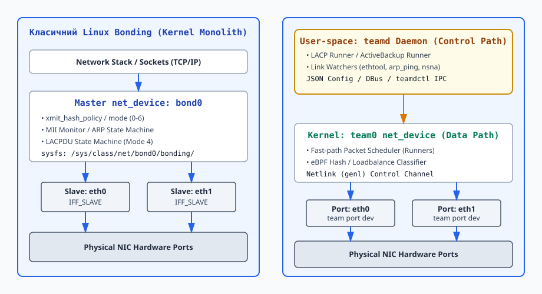
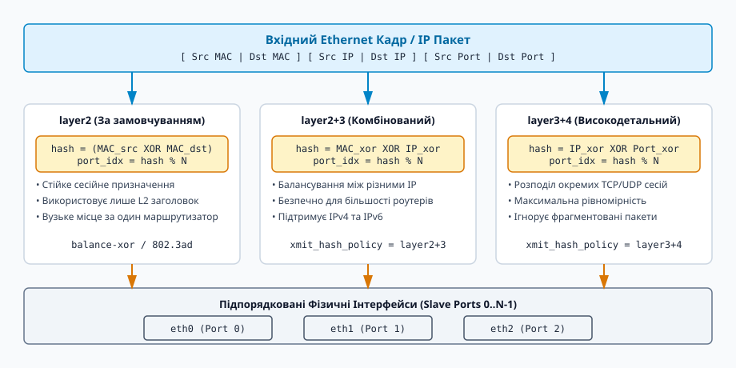

# Агрегація каналів: Bonding та Team

<preknowlist>
- [Мережеві інтерфейси та IP-адресація](topic:sys-unix/interfaces-and-addresses) — віртуальні й фізичні мережеві пристрої `struct net_device`, налаштування IP-адрес та таблиць MAC.
- [Протокол Netlink та rtnetlink](topic:sys-unix/netlink-protocol) — механізм взаємодії ядра з простором користувача через `NETLINK_ROUTE` для створення та керування мережевими пристроями.
</preknowlist>

У сучасній високопродуктивній мережевій інфраструктурі дата-центрів один фізичний мережевий кабель, порт комутатора або мережевий адаптер (Network Interface Card, NIC) є кричущою точкою єдиної відмови (Single Point of Failure, SPOF). Випадковий обрив оптичного кабелю, апаратний збій трансивера SFP+, вихід з ладу порту комутатора або переповнення внутрішнього буфера мережевої карти миттєво ізолюють сервер від зовнішнього світу, що призводить до простою критично важливих бізнес-сервісів.

Крім того, виникає проблема пропускної здатності. Навіть коли швидкість поодинокого гігабітного або десятигігабітного лінка є достатньою для звичайного робочого навантаження, під час періодичних піків (створення системних резервних копій, реплікація баз даних, міграція віртуальних машин або розподілене навчання нейромереж) фізичний інтерфейс стає вузьким місцем.

Технологія агрегації каналів (Link Aggregation) розв'язує обидві фундаментальні проблеми одночасно. Вона дозволяє об'єднати кілька фізичних мережевих інтерфейсів (наприклад, `eth0` та `eth1`) в один віртуальний логічний пристрій (наприклад, `bond0` або `team0`). Для мережевого стеку ядра Linux та застосунків простору користувача цей віртуальний інтерфейс виглядає як звичайний мережевий адаптер з власною IP- та MAC-адресою, але всередині операційної системи він прозоро розподіляє мережевий трафік між фізичними портами та забезпечує миттєву перекомбінацію трафіку в разі аварії.

У ядрі Linux розроблено дві підсистеми для реалізації агрегації каналів: класичний монолітний ядровий драйвер **Bonding** та новіша двошарова модульна архітектура **Team**.

---

## 1. Архітектура та функціонування підсистеми Bonding у ядрі Linux

Драйвер `bonding` реалізований як модуль ядра Linux, що створює віртуальні мережеві пристрої типу `ARPHRD_ETHER`. З точки зору внутрішньої системи ядра, кожен підпорядкований пристрій (slave) реєструється у загальній ієрархії пристроїв через механізм `netdev_master_upper_dev_link()`.

```
                  +-----------------------------------+
                  |   Мережевий стек ядра (IP/TCP/UDP) |
                  +-----------------------------------+
                                    |
                                    v
                  +-----------------------------------+
                  |  Master net_device (bond0)        |
                  |  - bond_start_xmit()              |
                  +-----------------------------------+
                                   / \
                                  /   \
                                 v     v
                 +-----------------+ +-----------------+
                 | Slave: eth0     | | Slave: eth1     |
                 | (IFF_SLAVE)     | | (IFF_SLAVE)     |
                 +-----------------+ +-----------------+
```

### 1.1. Ієрархія `struct net_device` та перехоплення кадрів

При прив'язці фізичного мережевого інтерфейсу (наприклад, `eth0`) до master-пристрою `bond0` драйвер виконує послідовність атомарних операцій під захистом блокування `rtnl_lock`:
1. Встановлює прапорець `IFF_SLAVE` у полі `eth0->flags`.
2. Реєструє внутрішній обробник вхідних кадрів `bond_handle_frame()` за допомогою виклику `netdev_rx_handler_register()`.
3. Копіює первинну MAC-адресу фізичного інтерфейсу у внутрішню структуру `struct slave` (для подальшого відновлення при вилученні) та присвоює фізичному інтерфейсу MAC-адресу логічного майстра `bond0`.

У результаті фізичний інтерфейс `eth0` припиняє самостійно передавати пакети безпосередньо до протоколів вищого рівня (L3 IPv4/IPv6). Усі вхідні Ethernet-кадри, які отримує фізичний адаптер, перехоплюються функцією `bond_handle_frame()` на етапі обробки SoftIRQ переривань (`NET_RX_SOFTIRQ`) та перенаправляються в обробник master-інтерфейсу `bond0`.

Передача вихідних пакетів відбувається через системну функцію `bond_start_xmit()`. Коли мережевий стек ядра надсилає пакет у логічний пристрій `bond0`, викликається метод `ndo_start_xmit()`. Драйвер Bonding аналізує заголовок кадру `struct sk_buff`, застосовує алгоритм обраного режиму агрегації, визначає конкретний slave-інтерфейс і пересилає пакет у його чергу передачі `dev_queue_xmit()`.

### 1.2. Внутрішні структури ядра: `struct bonding` та `struct slave`

У центрі керування драйвером знаходяться дві ключові структури ядра Linux, визначені у вихідних файлах `drivers/net/bonding/bonding.h`:

- **`struct bonding`**: Головна структура майстра, яка містить список підпорядкованих пристроїв (`struct list_head slave_list`), вказівник на поточний активний інтерфейс (`struct slave __rcu *curr_active_slave`), налаштування режимів (`struct bond_params params`), параметри LACP (`struct ad_bond_info ad_info`), а також блокування `spinlock_t mode_lock` та робочі структури `struct delayed_work mii_work` для відкладеного моніторингу.
- **`struct slave`**: Структура підпорядкованого пристрою, що зберігає вказівник на оригінальний пристрій (`struct net_device *dev`), зворотний вказівник на майстер (`struct bonding *bond`), стан зв'язку (`int link`), лічильник аварійних падінь (`u32 link_failure_count`), а також первинну MAC-адресу фізичного адаптера (`u8 perm_hwaddr[ETH_ALEN]`).

Для доступу до активного порту у високодетальних траєкторіях передачі даних використовується RCU-захист (`rcu_read_lock()` та `rcu_dereference()`), що дозволяє зчитувати поточний порт без захоплення важких м'ютексів.

### 1.3. Механізми моніторингу стану лінків: MII та ARP

Для забезпечення високої доступності драйвер повинен постійно перевіряти фізичний та логічний стан кожного підпорядкованого порту.

#### Моніторинг MII (Media Independent Interface)
MII-монітор спирається на фізичний статус носія (carrier status), який надається драйвером фізичної мережевої карти. Драйвер Bonding запускає регулярний ядровий таймер з інтервалом `miimon` (зазвичай 100 мс). Під час кожного спрацьовування таймера драйвер викликає функцію `netif_carrier_ok()` для кожного slave.

Щоб запобігти явищу мережевого нестабільного лінка (link flapping) — коли пошкоджений кабель чи порт комутатора швидко вмикається й вимикається десятки разів на секунду — застосовуються параметри затримки `updelay` та `downdelay`:
- `downdelay`: Час у мілісекундах, протягом якого MII-монітор повинен безперервно фіксувати відсутність несучої, перш ніж виключити порт із групи активних transmission-інтерфейсів.
- `updelay`: Час, протягом якого MII-монітор повинен фіксувати стабільну наявність несучої, перш ніж повернути порт до ладу.

#### Моніторинг ARP (Address Resolution Protocol)
MII-монітор фіксує лише фізичний обрив кабелю між сервером та найближчим портом комутатора. Якщо проблема виникла далі в мережі (наприклад, між комутатором доступу та маршрутизатором), MII-монітор вважатиме лінк працездатним, але мережеві пакети губитимуться.

ARP-монітор вирішує цю проблему на третьому рівні (L3). З інтервалом `arp_interval` драйвер формує бінарні ARP-запити до вказаних IP-адрес (`arp_ip_target`) і відправляє їх через slave-інтерфейси. Якщо відповідь не надходить протягом заданого інтервалу, лінк позначається як аварійний.

---

## 2. Глибинний аналіз 7 режимів Bonding (Mode 0–6)

Драйвер Bonding підтримує 7 різних алгоритмів обробки та розподілу трафіку.

```
                           +--------------------------------+
                           |  Вхідний пакет (sk_buff)       |
                           +--------------------------------+
                                           |
                                           v
                           +--------------------------------+
                           |  Обчислення xmit_hash_policy   |
                           +--------------------------------+
                               /           |              \
                              /            |               \
                             v             v                v
                     +---------------+ +---------------+ +---------------+
                     |  Layer 2 Hash | | Layer 2+3 Hash| | Layer 3+4 Hash|
                     |  (MAC XOR)    | | (MAC/IP XOR)  | | (IP/Port XOR) |
                     +---------------+ +---------------+ +---------------+
                               \           |              /
                                \          |             /
                                 v         v            v
                           +--------------------------------+
                           |  port_idx = hash % N_slaves    |
                           +--------------------------------+
                                           |
                                           v
                           +--------------------------------+
                           |   Вихідний порт (eth0..ethN)   |
                           +--------------------------------+
```

### Mode 0: `balance-rr` (Round-Robin)
Вихідні Ethernet-кадри передаються послідовно через кожен доступний slave-інтерфейс: перший пакет іде в `eth0`, другий у `eth1`, третій у `eth0` і так далі.

- **Переваги**: Забезпечує агрегацію пропускної здатності для одного TCP-з'єднання.
- **Недоліки**: Пакети одного TCP-потоку надходять до одержувача з різними затримками через фізичну розсинхронізацію лінків, спричиняючи зміну порядку пакетів (packet reordering). Мережевий стек приймача сприймає це як втрату пакетів, надсилає повторні підтвердження (ACK) та різко зменшує розмір ковзного вікна TCP, що призводить до падіння продуктивності.
- **Вимоги до комутатора**: Вимагає налаштування статичного агрегованого каналу (Static EtherChannel / Trunk) на порту комутатора.

### Mode 1: `active-backup` (Активний/Резервний)
У кожен момент часу трафік передається та приймається лише через один активний slave-інтерфейс. Інші порти знаходяться у режимі очікування (backup).

- **Переваги**: Максимальна надійність та відсутність вимог до комутатора. Інтерфейси можна підключати до абсолютно різних, не пов'язаних між собою комутаторів (наприклад, двох незалежних Top-of-Rack комутаторів).
- **Недоліки**: Відсутність збільшення пропускної здатності; швидкість обмежена параметрами одного порту.
- **Механіка Failover**: При падінні активного лінка драйвер обирає новий активний порт і надсилає у мережу серію незапитаних ARP-відповідей (Gratuitous ARP), щоб оновити CAM-таблиці MAC-адрес комутаторів.

### Mode 2: `balance-xor`
Вибір вихідного порту виконується на основі математичного хешу від параметрів кадру.

Формула за замовчуванням (`layer2`):
```
hash = (MAC_src[5] ⊕ MAC_dst[5])
port_idx = hash mod N_slaves
```

Формула Layer 2+3 (`layer2+3`):
```
hash = ((MAC_src[5] ⊕ MAC_dst[5]) ⊕ (IP_src ⊕ IP_dst))
port_idx = hash mod N_slaves
```

Формула Layer 3+4 (`layer3+4`):
```
hash = (((IP_src ⊕ IP_dst) ⊕ (Port_src ⊕ Port_dst)) & 0xFFFF)
port_idx = hash mod N_slaves
```

- **Стійкість сесій**: Усі пакети одного TCP-потоку між двома конкретними MAC/IP-адресами та портами завжди прямують через один і той самий фізичний порт, що повністю ліквідує проблему зміни порядку пакетів.
- **Вимоги до комутатора**: Вимагає налаштування статичного EtherChannel.

### Mode 3: `broadcast`
Драйвер дублює кожен вихідний пакет і надсилає його одночасно через усі підпорядковані інтерфейси.

- **Сфера застосування**: Спеціалізовані системи високої надійності (фінансові транзакції, системи авіаційного моніторингу), де втрата навіть одного пакета є неприпустимою.

### Mode 4: `802.3ad` (Dynamic Link Aggregation / LACP)
Стандартизований режим IEEE 802.3ad. Драйвер реалізує протокол Link Aggregation Control Protocol (LACP) і періодично обмінюється з комутатором контрольними кадрами LACPDU (EtherType `0x8809`).

```
  +-------------------+                      +-------------------+
  |   Linux Server    |                      |   Network Switch  |
  |  (Actor System)   |                      | (Partner System)  |
  |                   |   LACPDU (Fast/Slow) |                   |
  |  [eth0] ---------+---------------------->+--------- [Port 1] |
  |                   | <--------------------+                   |
  |  [eth1] ---------+---------------------->+--------- [Port 2] |
  +-------------------+                      +-------------------+
```

- **Автоматичне узгодження**: Сервер (Actor) та комутатор (Partner) автоматично узгоджують швидкість, дуплекс та ідентифікатори агрегаторів.
- **Вибір агрегатора**: Драйвер групує порти з однаковою швидкістю й дуплексом у логічні агрегатори та обирає активний агрегатор згідно з політикою `ad_select` (`bandwidth`, `count`, `stable`).
- **Автомат станів LACP**: Стан порту визначається прапорами у LACPDU: `LACP_ACTIVITY`, `LACP_TIMEOUT`, `AGGREGATION`, `SYNCHRONIZATION`, `COLLECTING`, `DISTRIBUTING`.

### Mode 5: `balance-tlb` (Adaptive Transmit Load Balancing)
Балансування вихідного трафіку на основі поточного завантаження портів без спеціального налаштування комутатора.

- **Механізм**: Драйвер перехоплює вихідний трафік, розподіляє його між портами відповідно до їхньої швидкості та поточного навантаження. Вхідний трафік надходить лише на один активний порт.

### Mode 6: `balance-alb` (Adaptive Load Balancing)
Включає в себе балансування вихідного трафіку (TLB) та додає балансування вхідного трафіку (Receive Load Balancing, RLB) для IPv4.

- **Перехоплення ARP**: Драйвер перехоплює ARP-відповіді, які сервер надсилає у мережу.
- **Підміна MAC у ARP**: Драйвер змінює MAC-адресу джерела у ARP-відповіді для різних клієнтів. Клієнт A отримує MAC-адресу `eth0`, а клієнт B — MAC-адресу `eth1`. У результаті вхідний трафік від різних клієнтів розподіляється між різними фізичними портами на рівні L2.

Деталізований висвітлений історичний шлях розробки та кризу монолітного коду винесено в окремий матеріал:
📜 [Історія агрегації каналів у Linux: від Beowulf до teamd](topic:sys-unix/bonding-and-team-drivers/hist-bonding-to-team.md).

---

## 3. Двошарова архітектура Team: відокремлення Data Path від Control Path

Незважаючи на гнучкість драйвера Bonding, його монолітна реалізація всередині ядра ускладнювала відлагодження, розширення та реалізацію складних сценаріїв. У 2012 році в ядрі Linux 3.3 з'явилася підсистема **Network Teaming** (`team`).


*_Рис. 1. Порівняння монолітної архітектури Bonding та розділеної архітектури Team з демоном teamd в просторі користувача_*

### 3.1. Kernel Space: Модуль `team.ko` (Fast Data Path)

Модуль `team.ko` реалізує виключно швидкісний тракт передачі даних. У ньому відсутня логіка автоматів станів LACP, моніторингу лінків та розбору конфігураційних параметрів.

Модуль `team.ko` надає:
- Віртуальний пристрій `team0`.
- Обробник `team_handle_frame()` для виклику швидких процедур перехоплення пакетів.
- Механізм вибору портів на основі прив'язаних логічних обробників (Runners).
- Інтерфейс Generic Netlink (`genl`) для обміну даними з простором користувача.

### 3.2. User Space: Демон `teamd` (Control Path)

Уся складна логіка керування винесена в демон простору користувача `teamd`. Демон виконує:
- Зчитування JSON-конфігурації та розбір параметрів.
- Обробку та надсилання кадрів LACPDU у режимі LACP.
- Моніторинг стану лінків за допомогою плагінів `link_watch` (`ethtool`, `arp_ping`, `nsna_ping`).
- Комунікацію з ядром через сокет Generic Netlink для додавання/вилучення портів та оновлення таблиць маршрутизації.

### 3.3. Виконавці (Runners) та BPF-балансування

Замість фіксованих режимів Bonding у Team використовуються плагіни-виконавці (Runners):
- `roundrobin`: Кругове обслуговування.
- `activebackup`: Активний/резервний порт.
- `broadcast`: Дублювання пакетів.
- `lacp`: Повна реалізація IEEE 802.3ad у юзерспейсі.
- `loadbalance`: Динамічне балансування трафіку.

Виконавець `loadbalance` підтримує завантаження класичних BPF-фільтрів (Berkeley Packet Filter) у ядро. Це дозволяє системному інженеру писати власні правила балансування трафіку на основі будь-яких полів пакета (VLAN ID, порти TCP/UDP, прапори IP):

```
  +---------------------------------------------------+
  | Вхідний sk_buff                                  |
  +---------------------------------------------------+
                            |
                            v
  +---------------------------------------------------+
  | Код BPF інструкцій (loadbalance runner)           |
  | e.g. hash = (vlan_id ^ ip_src) & 0xFF             |
  +---------------------------------------------------+
                            |
                            v
  +---------------------------------------------------+
  | Вибір порту у масиві team->val_ports[hash % size] |
  +---------------------------------------------------+
```

---

## 4. Порівняльний аналіз: Bonding проти Team

Обидві підсистеми вирішують задачу агрегації каналів, але спираються на різні архітектурні принципи.

| Критерій | Класичний Bonding (`bonding.ko`) | Архітектура Team (`team.ko` + `teamd`) |
| :--- | :--- | :--- |
| **Місце розташування логіки** | Монолітно в ядрі Linux (Kernel Space) | Розділено: Data Path у ядрі, Control Path у юзерспейсі (`teamd`) |
| **Формат конфігурації** | Модульні параметри, sysfs, `ip link` | Формат JSON, утиліти `teamdctl`, DBus |
| **Гнучкість моніторингу** | Фіксовані MII та ARP монітори | Модульні `link_watch`: `ethtool`, `arp_ping`, IPv6 `nsna_ping` |
| **Балансування трафіку** | Фіксовані політики `xmit_hash_policy` | Програмоване BPF-балансування (eBPF filters) |
| **Надійність ядра** | Помилка у LACP може викликати Kernel Panic | Збій `teamd` не валить ядро; тракт даних продовжує працювати |
| **Продуктивність Data Path** | Висока, але обтяжена RCU/rtnl локами | Максимальна за рахунок лаконічності `team.ko` |

> 🔧 **Навіщо це у реальній розробці.**
> Обираючи між Bonding та Team у промислових системах, керуйтеся наступними правилами:
> 1. Якщо потрібне максимально надійне та універсальне рішення без фонових демонів юзерспейсу — обирайте **Bonding Mode 4 (802.3ad LACP)** або **Mode 1 (active-backup)**.
> 2. Якщо ви будуєте інфраструктуру на базі RHEL/CentOS/Rocky Linux або вимагаєте складної логіки моніторингу через IPv6 (Neighbor Solicitation) чи спеціального BPF-балансування — використовуйте **Team**.

---

## 5. Простеження та діагностика в Linux


*_Рис. 2. Алгоритм обчислення хешу xmit_hash_policy для вибору активного інтерфейсу slave_*

Для діагностики агрегованих інтерфейсів у Linux використовуються наступні інструменти:

### 1. Перевірка стану Bonding через procfs
```bash
cat /proc/net/bonding/bond0
```
Вивід містить поточний режим, MAC-адресу агрегатора, стан MII-монітора, кількість збоїв лінків (Link Failure Count) та партнерські параметри LACPDU.

### 2. Перевірка атрибутів через sysfs
```bash
cat /sys/class/net/bond0/bonding/mode
cat /sys/class/net/bond0/bonding/active_slave
```

### 3. Діагностика Team через teamdctl
```bash
teamdctl team0 state
teamdctl team0 config dump
```

Для глибшого вивчення структур даних, низькорівневих бінарних атрибутів `rtnetlink` та викликів системного API зверніться до спеціалізованого довідника:
📋 [Інтерфейси керування Bonding та Team: sysfs, rtnetlink та teamd JSON/DBus](topic:sys-unix/bonding-and-team-drivers/api-bonding-team-netlink.md).

Для практичної розробки власних мережевих контролерів мовами C та C++, які виконують автоматичне створення bonding-пристроїв через сокети `AF_NETLINK`, підготовлено практичний проект:
⚙️ [Практична реалізація: керування bonding-інтерфейсом через rtnetlink у C та C++](topic:sys-unix/bonding-and-team-drivers/proj-netlink-bond-controller.md).
