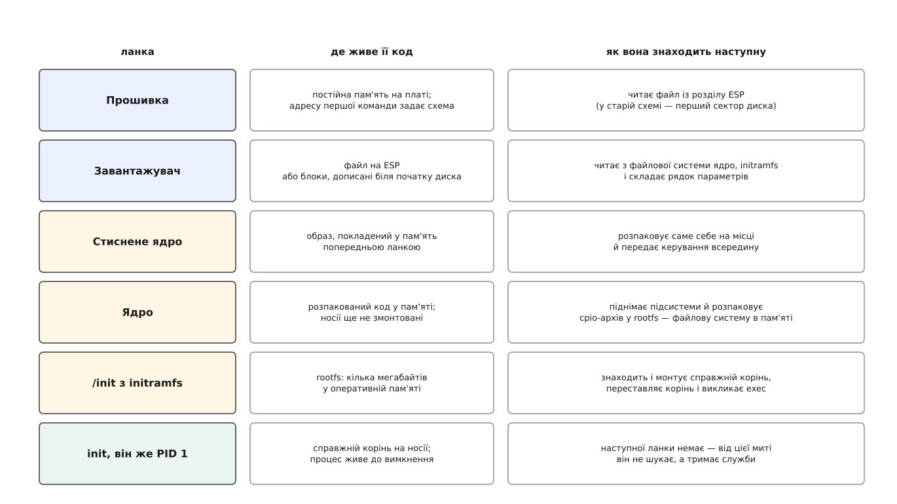
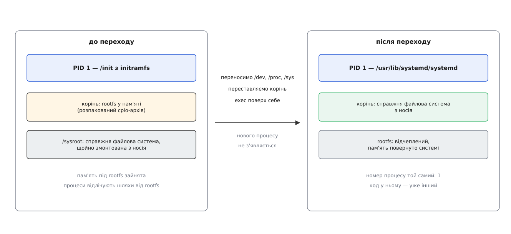
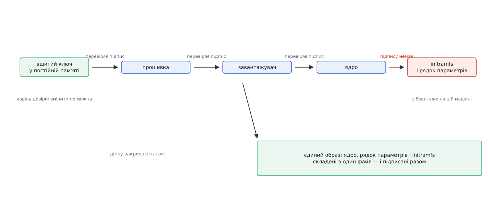

# Ланцюг завантаження: від прошивки до init

<preknowlist>
- [Ядро й простір користувача](root:sys-unix/kernel-and-userspace) — ядро і звичайні програми виконуються в різних режимах процесора, і межу між ними перетинають лише в чітко визначених місцях.
- [Процес: що це насправді](root:sys-unix/process-model) — процес є набором ресурсів ядра (адресний простір, таблиця дескрипторів, обліковий запис) з номером-ідентифікатором.
- [exec: заміна образу](root:sys-unix/exec-semantics) — виклик підміняє код і дані всередині вже наявного процесу, не створюючи нового: номер процесу лишається той самий.
- [PID і дерево процесів](root:sys-unix/pid-and-hierarchy) — процеси шикуються в дерево, а процес із номером 1 займає в ньому особливе становище.
- [Монтування й дерево монтувань](root:sys-unix/mount-model) — «корінь» є не каталогом, а вузлом окремого дерева монтувань, і цей вузол можна переставити.
- [Псевдо-ФС: procfs, sysfs, tmpfs, devtmpfs](root:sys-unix/pseudo-filesystems) — файлова система не зобов'язана лежати на носії: буває така, що цілком живе в пам'яті.
- [Модулі ядра](root:sys-unix/kernel-modules) — частина драйверів не вбудована в образ ядра, а лежить окремими файлами й довантажується вже під час роботи.
</preknowlist>

Натиснули кнопку живлення. За кілька десятків секунд на екрані запрошення до входу. Між цими двома подіями машина встигає кілька разів повністю змінити те, чим вона є: код, який зараз виконується, живе спершу в мікросхемі на платі, потім в оперативній пам'яті, потім на диску — і кожен наступний виконавець нічого не знав би про попереднього, якби той його не привів.

Причина, чому це не один крок, лежить у самій природі процесора. Процесор уміє рівно одне: прочитати команду за адресою й виконати її. У мить, коли подали живлення, читати нема звідки — оперативна пам'ять не тримає вміст без струму, та й контролер пам'яті ще не налаштований, тож звертатися до неї фізично нема чим. Отже, перша команда мусить прийти з чогось, що не забуває вміст і що з'являється за потрібною адресою без участі будь-яких програм. Таку річ роблять залізом: мікросхему постійної пам'яті приєднують так, щоб її вміст був видний саме за тією адресою, яку процесор читає після скидання.

Код усередині цієї мікросхеми — **прошивка**. Її пише виробник плати, і вона одна на всю плату. А от систему на цю плату потім поставлять яку завгодно і коли завгодно. Тобто прошивка мусить передати керування коду, якого в момент її написання ще не існувало.

Оце і є пружина всього ланцюга. Кожна його ланка — **домовленість між двома програмами, які нічого не знають одна про одну**: перша обіцяє шукати наступну в певному місці й у певному вигляді, друга обіцяє в цьому вигляді там лежати. Ланок стільки, скільки таких домовленостей потрібно, щоб дійти від коду, вшитого в залізо, до коду, що лежить файлом на зашифрованому томі.

*Кожен рядок дістає більше можливостей за попередній — і саме тому попередній не міг зробити його роботу сам. Останній рядок вибивається з ряду: він нікого не шукає.*

## Перша домовленість: де лежить наступний код

Перш ніж когось шукати, прошивка мусить зробити машину придатною для роботи. Це не формальність: контролер пам'яті треба налаштувати під ті модулі, які насправді вставлені в роз'єми, і до цієї миті звичайної пам'яті в машині немає взагалі — ранній код прошивки виконується, використовуючи як тимчасову пам'ять кеш процесора. Далі піднімають достатньо шин, щоб дістатися до носія, і на цьому обов'язкова частина закінчується.

Тепер — де шукати наступного. Історично на це відповіли двічі, і різниця між відповідями визначає форму всього ланцюга.

Стара відповідь дісталася нам від BIOS (англ. Basic Input/Output System — базова система вводу-виводу), прошивки перших персональних комп'ютерів IBM. Прошивка читає **найперший сектор** носія — 512 байтів — перевіряє, що два останні байти дорівнюють `0x55 0xAA`, і стрибає на його початок. Про файлові системи вона не знає нічого; вона знає лише «сектор номер нуль». Але в 512 байтах треба ще й розмістити таблицю розділів, тож коду лишається 446 байтів. У 446 байтів завантажувач не вміщається — туди вміщається лише код, який завантажує решту завантажувача. Звідси й бралися додаткові півланки: перший шматок носив у собі жорстко записаний список номерів блоків, де лежить другий. Список складали під час встановлення; варто було файлу переїхати на інші блоки — і машина переставала завантажуватися, хоча всі файли на місці. Як ланцюг доростав до цих милиць і як потім їх позбувався — [окрема розповідь про форму ланцюга](root:sys-unix/boot-chain/hist-chain-shape.md).

Нова відповідь прибирає цю крихкість, піднявши планку того, що вміє прошивка. Прошивка сама розуміє файлову систему FAT, сама вміє прочитати з неї файл і сама вміє виконати програму в узгодженому форматі. Для цього на диску заводять окремий розділ службового призначення, а список того, що можна завантажити, прошивка тримає у власній енергонезалежній пам'яті — як записи «назва, диск, шлях до файлу» плюс порядок перебору. Наступна ланка перестала бути сектором і стала **файлом з іменем**. Цю схему звуть [UEFI](root:sys-unix/uefi-firmware) (англ. Unified Extensible Firmware Interface — уніфікований розширюваний інтерфейс прошивки), а той службовий розділ — системним розділом EFI.

Наслідків два, і другий важливіший за перший. Перший: зник цілий шар хитрощів із номерами блоків. Другий: файл можна підписати. Сектор із 446 байтів коду підписати нема куди й нема кому — а файл має розмір, формат і місце під підпис, тож прошивка може перевірити його, перш ніж виконати. Саме на цій зміні стала можливою [перевірка всього ланцюга завантаження](root:sys-unix/secure-boot) — прошивка тримає набір довірених ключів і відмовляється запускати непідписаний код.

> 🔧 **Навіщо це.** Коли машина не завантажується, перше корисне питання — не «що зламалося», а «хто зараз зі мною говорить». Екран налаштувань прошивки означає, що до диска ще не дійшли. Запрошення завантажувача — що диск читається, а ядро ні. Паніка ядра — що ядро працює, а кореня немає. Кожен екран вказує на конкретне ребро ланцюга, і половина діагностики — це впізнати, на якому ти ребрі. Пройти всі ребра на власній машині — від записів завантаження в пам'яті прошивки до розкладки часу старту служб — допоможе [покроковий розбір](root:sys-unix/boot-chain/proj-walk-the-chain.md).

## Завантажувач, якого може й не бути

Прошивка знайшла файл і виконала його. Зазвичай цей файл — **завантажувач**. Його робота вміщається в чотири дії: показати вибір, якщо систем чи ядер кілька; прочитати з файлової системи образ ядра; прочитати початковий образ пам'яті, про який мова далі; скласти текстовий рядок параметрів і разом із ним передати керування ядру.

Передача ця — знову домовленість, і дуже конкретна. Образ ядра не є просто кодом: на початку в нього лежить заголовок із номером версії протоколу й полями, які завантажувач мусить заповнити — куди він поклав початковий образ пам'яті і якого той розміру, де лежить рядок параметрів, яка в машині карта пам'яті. Ядро й завантажувач розвиваються окремими командами й окремими темпами, тож цей заголовок — стабільний двійковий інтерфейс між ними, зі своїми правилами розширення. Що саме в ньому лежить і як складають рядок параметрів — [окрема тема](root:sys-unix/bootloader-and-cmdline).

І тут з'ясовується, що ця ланка не священна. Якщо вибирати нема з чого — машина робить одну роботу й має одне ядро, — то посередник між прошивкою й ядром не потрібен. Тому в ядро вбудували здатність виглядати для прошивки звичайною програмою її формату: воно саме приймає керування від прошивки, саме питає в неї карту пам'яті й саме себе запускає. На x86 така збірка з'явилася в ядрі 3.3 (2012 рік), згодом і на інших архітектурах. Тоді прошивка виконує ядро прямо з того службового розділу, а завантажувача в ланцюзі просто немає.

Це добра перевірка розуміння: ланка існує не тому, що «так заведено», а тому, що комусь треба зробити крок, який попередній зробити не може. Заберіть потребу у виборі — і ланка зникає.

## Ядро піднімає себе й упирається в замкнене коло

Образ ядра лежить у пам'яті стиснутим — так він менший і швидше читається з носія. Перше, що виконується, — маленький розпаковувач, приліплений до початку образу: він розкладає справжнє ядро в пам'яті й передає керування йому.

Далі ядро налаштовує себе: таблиці сторінок, обробники переривань, планувальник, розподільник пам'яті. Потім по черзі викликає функції ініціалізації всіх вбудованих підсистем і драйверів — вони реєструють шини, знаходять пристрої, створюють записи в дереві пристроїв. Порядок цих викликів не випадковий і сам по собі є [окремим механізмом](root:sys-unix/kernel-initcalls).

І ось ядро готове, а працювати ні з чим: **кореневої файлової системи немає**. Здавалося б, хай змонтує вказаний у параметрах диск і на цьому все. Але тут ядро впирається в коло, з якого не виходить власними силами.

Коло таке. Щоб прочитати диск, потрібен драйвер контролера. Драйвер може бути не вбудований в образ ядра, а лежати окремим файлом — і лежить він на тому самому диску, який без нього не читається. Всередину образу все підряд не вбудуєш: тоді кожне ядро мусило б нести драйвери всіх контролерів світу.

Друга половина кола ще цікавіша. Навіть коли контролер відомий, «справжній корінь» може виявитися логічним томом усередині зашифрованого контейнера на масиві з трьох дисків, і щоб дійти до нього, треба зібрати масив, спитати пароль у людини, розгорнути шифр і лише тоді монтувати. Це не робота ядра: тут потрібні розмова з користувачем, читання налаштувань, політика — а ядро свідомо не тримає в собі політики.

Обидві половини кола розриває той самий прийом: дати ядру **тимчасовий корінь, який не потребує ні драйвера носія, ні файлової системи на носії**. Такий корінь у ядра вже є від народження — крихітна файлова система, що цілком живе в пам'яті й існує з першої секунди. Завантажувач кладе в пам'ять архів, ядро **розпаковує** його вміст у цю файлову систему й дістає готове дерево каталогів із програмами.

Слово «розпаковує» тут головне, і саме на ньому найчастіше помиляються. Ядро не монтує образ як диск — воно розгортає архів у вже наявну файлову систему пам'яті, тому ні блокового драйвера, ні коду якоїсь конкретної файлової системи для цього не треба взагалі. Формат архіву обрали найпростіший із можливих саме тому, що розбирати його доводиться коду ядра. Такий образ називають [initramfs](root:sys-unix/initramfs) — від «initial RAM filesystem», початкова файлова система в пам'яті; і назва точна, на відміну від старішого initrd, де «d» від «disk» позначала якраз образ диска, який справді монтували.

Далі ядро робить те, заради чого все й було: запускає з цього тимчасового кореня програму `/init` — і вона стає першим процесом у системі, з номером 1.

## Тимчасова система, чия мета — стати непотрібною

Усе, що діялося досі, було справою ядра. Тепер уперше виконується звичайна програма у звичайному режимі — і робить вона рівно одне: **перетворює «десь на цій машині є корінь» на «корінь змонтовано»**.

Список її справ виводиться з того самого кола, яке вона розриває. Довантажити модулі під те залізо, яке справді знайшлося. Дочекатися, поки [підсистема іменування пристроїв](root:sys-unix/udev-rules) розбереться з тим, що з'явилося, — диски виникають не миттєво, і поспішити тут означає не знайти те, що за секунду буде на місці. Зібрати масив, розгорнути шифрування, активувати логічні томи. Витлумачити те, що записано в параметрах як `root=`: там може стояти не ім'я пристрою, а мітка чи ідентифікатор тому, і його ще треба знайти серед усього під'єднаного. Нарешті — змонтувати знайдене.

Лишається пересісти. Це найтонше місце всього ланцюга, і робиться воно в три ходи.

*Перехід не породжує нового процесу: номер 1 лишається за тим самим процесом, у якому просто замінили код.*

Спершу службові файлові системи, які вже підняті й якими вже користуються, **переносять** із тимчасового кореня в новий — відмонтовувати й монтувати заново їх не можна, бо на них уже тримаються відкриті дескриптори. Потім переставляють сам корінь: не «перевести процес в іншу точку відліку», а зробити змонтовану з носія систему кореневим вузлом дерева монтувань, а тимчасову — звичайним піддеревом, яке відчіпляється й звільняє пам'ять. Різниця між цими двома діями зовсім не косметична, і саме на ній [окремий виклик ядра](root:sys-unix/pivot-root) відрізняється від простої зміни точки відліку.

Третій хід — `exec` поверх себе. Тимчасова програма не запускає справжній init як дитину й не завершується сама: вона **замінює власний код** кодом справжнього init. Причина в номері. Ядро дає процесові з номером 1 особливий статус, а всі інші процеси системи вже є або стануть його нащадками; породити нового першого процесу неможливо, бо номер уже зайнятий, а звільниться він лише зі смертю носія — тобто з паданням системи. Тому перехід роблять єдиним способом, який зберігає номер: у тому самому процесі міняють образ.

Три ходи разом — перенести службові монтування, переставити корінь, замінити свій образ — і звуть `switch_root`: це не системний виклик, а усталена послідовність, яку виконує остання команда сценарію в initramfs.

## Ланцюг змінює природу

Якщо початкового образу пам'яті в машині немає — така конфігурація цілком жива, коли всі потрібні драйвери вбудовані, а корінь простий, — ядро монтує корінь само й шукає першу програму за списком: `/sbin/init`, `/etc/init`, `/bin/init`, `/bin/sh`. Не знайшовши жодної, воно зупиняється з повідомленням «No working init found» і порадою передати параметр `init=`. Цей параметр, до речі, і є найкоротшим шляхом полагодити систему, у якій зламався запуск: ним просять ядро замість штатного init виконати оболонку.

А далі ланцюг міняє природу, і це важливіше за будь-яку окрему ланку. Досі кожен виконавець робив свою справу й помирав, передавши керування наступному, — це естафета. Починаючи з першого процесу естафети немає: цей процес мусить жити, поки жива система. Він більше нікого не шукає — він **тримає**. Ядро й ставиться до нього інакше: типові дії сигналів на нього не діють, тож випадково вбити його не вийде, а якщо він усе-таки завершиться, ядро зупиняє систему панікою. Йому ж дістаються всі осиротілі процеси, чиї батьки померли раніше, — і він мусить їх поховати, інакше в системі накопичуватимуться мертві записи. Чому саме так і що з цього випливає для того, хто пише свій init, — [окрема тема](root:sys-unix/init-and-pid1).

## Чому старт служб виявився окремою задачею

Здавалося б, тепер усе просто: перший процес по черзі запускає все, що має працювати. Так і робили — набором сценаріїв із номерами в назві, які виконувалися один за одним.

Проблема виявилася не в кількості, а в природі часу. Служба стартує довго не тому, що багато рахує, а тому, що чогось чекає: відповіді від диска, адреси від мережі, готовності бази. Поки один сценарій чекає, машина простоює, хоча решта служб могла б стартувати паралельно. Виправити це «в лоб» не вийде: якщо запустити все одночасно, частина впаде, бо звертатиметься до того, чого ще немає.

Отже, потрібне не «швидше», а **знання про залежності**. Якщо кожна служба сама оголошує, що їй потрібне і що вона дає, то порядок перестає бути записаним у номерах файлів і стає властивістю, яку виводять з оголошень. Тоді все, між чим залежності немає, стартує одночасно — а система працює рівно стільки, скільки триває найдовший ланцюжок справжніх залежностей. Це і є [модель, на якій побудований systemd](root:sys-unix/systemd-model): описи-юніти, залежності між ними й іменовані стани системи як цілі.

Залишалася ще одна щілина: залежність «мережа має бути готова» майже завжди означає «має існувати сокет, у який можна писати». Але сокет вміє створити не сама служба, а той, хто нею керує, — і створити наперед. Тоді клієнт, що звернувся, просто чекає в черзі з'єднань, поки служба піднімається, і черговість зникає як задача: [активацію за сокетом](root:sys-unix/socket-activation) можна вважати способом взагалі не впорядковувати те, що впорядковувати не хочеться.

І окремо — те, що робить слово «тримає» точним. Служба зазвичай не один процес, а дерево процесів, і колишній прийом «запам'ятати номер головного» ламався від першого ж форку. Тому службу обмежують не номером, а [групою обліку ресурсів](root:sys-unix/cgroups-resource-model): усе, що вона породить, лишається в тій самій групі, тож її можна виміряти, обмежити й вимкнути повністю. На цьому ж тримається і політика перезапуску — [що вважати падінням і як реагувати](root:sys-unix/service-lifecycle) — бо без надійного «хто саме належить цій службі» перезапускати наосліп небезпечно.

## Ті самі ребра тримають довіру

Тепер видно другу властивість ланцюга, яку неможливо побачити, дивлячись на будь-яку ланку окремо. Кожне ребро — це місце, де одна програма **вирішує виконати** іншу. А отже, це єдине місце, де можна поставити перевірку.

*Довіра передається лише вперед і лише від того, кого вже перевірили; початок ланцюга мусить бути незмінним, інакше перевіряти нема від чого.*

Перевірка ця має неприємну властивість: вона транзитивна тільки в один бік. Якщо ланка перевірила наступну, а її саму ніхто не перевіряв, то весь ланцюг нижче нічого не вартий — зловмиснику досить підмінити першу неперевірену ланку, і далі все підпишеться саме собою. Тому початок ланцюга мусить лежати там, де його не можна переписати: ключі вшивають у постійну пам'ять або в перепалювані перемички процесора.

І тут добре видно, де в типовій системі щілина. Ядро приходить із дистрибутива підписаним. А от початковий образ пам'яті збирають уже на цій машині, з тутешніх модулів і налаштувань, — його ніхто ззовні підписати не міг. Рядок параметрів так само складає завантажувач із локального файлу. Виходить, що перевірений ланцюг обривається рівно перед тими двома речами, які визначають, що ядро вважатиме коренем і який код виконає першим у просторі користувача. Звідси й рішення: скласти ядро, рядок параметрів і образ пам'яті в **один файл** і підписати їх разом — тоді ребро, яке лишалося неперевіреним, стає таким самим перевіреним, як усі попередні.
