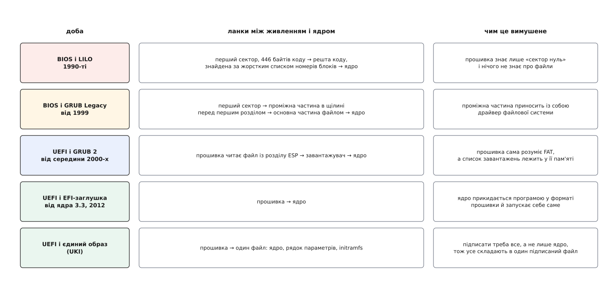

# 📜 Як ланцюг завантаження то видовжувався, то коротшав

Кількість ланок між кнопкою живлення й ядром ніхто ніколи не проєктував: вона щоразу виходила такою, якої вимагала різниця між тим, що вміла прошивка, і тим, чого потребувало ядро. Варто цій різниці змінитися — і ланки або дописували, або викидали. Історія форми ланцюга — це історія трьох окремих ниток: як звужувалася перша щілина (прошивка ↔ ядро), як мінявся тимчасовий корінь і як переродилася остання ланка.



*Ланцюг найдовший там, де прошивка вміла найменше; кожне нове вміння прошивки викреслювало ланку.*

## 446 байтів, з яких усе почалося

Уся дивна форма старого ланцюга виводиться з одного числа. Прошивка персонального комп'ютера читала перший сектор носія — 512 байтів, — переконувалася, що два останні байти дорівнюють `0x55 0xAA`, і стрибала на початок прочитаного. Коли до персональних машин дійшли жорсткі диски, у той самий сектор довелося покласти ще й таблицю розділів: чотири записи по 16 байтів. Порахуймо, що лишається коду:

```
512 − 2 (сигнатура) − 64 (таблиця розділів) = 446 байтів
```

446 байтів — це кількадесят машинних команд. У них не вміщається програма, що вміє читати файлову систему: сам лише розбір каталогів і таблиці блоків будь-якої з тодішніх файлових систем більший за весь цей простір. Отже, у першому секторі може лежати рівно одне: код, який завантажує решту коду. Звідси всі подальші милиці — вони не примха авторів, а прямий наслідок арифметики вище.

## LILO: список номерів блоків замість імені файлу

Перший загальновживаний завантажувач Linux, **LILO** (англ. LInux LOader), написав Вернер Альмесбергер; він вів проєкт з 1992 по 1998 рік, далі його підхоплювали Джон Коффман (1999–2007) і Йоахім Відорн (2010–2015), а наприкінці 2015-го розробку припинили — останній випуск має номер 24.2 *(усталений факт, підтверджений сторінкою проєкту та її хронологією супроводу)*.

Розв'язок LILO прямо випливав із браку місця: якщо прочитати файл нема чим, то читаймо не файл, а **сектори**. Окрема програма-встановлювач (`/sbin/lilo`) заздалегідь проходила по файлу ядра, виписувала номери всіх його блоків у службову «карту» й записувала цю карту туди, де до неї дотягнеться крихітний код першого сектора. Під час завантаження ніякого пошуку не відбувалося — просто читання за списком адрес.

Ціна цього рішення пам'ятна всім, хто тоді оновлював ядро. Файлова система має право пересунути вміст файлу; збірка нового ядра створює новий файл на інших блоках. Карта в цю мить перестає відповідати дійсності — і машина не завантажується, хоча всі файли на місці, цілі й правильні. Тому кожна зміна ядра мусила закінчуватися повторним запуском встановлювача. Ланка була не «зайвою», а надто **ранньою**: вона фіксувала фізичне розташування даних тоді, коли ще ніхто не знав, чи воно збережеться.

## GRUB: половина ланки, що принесла драйвер

Наступний крок зробили не збільшенням першого сектора — його збільшити не можна, — а вставлянням між ним і завантажувачем ще однієї, проміжної частини. **GRUB** (англ. GRand Unified Bootloader) почав Еріх Болейн у межах робіт над завантаженням системи GNU/Hurd; 1999 року Ґордон Мацікейт і Йошінорі К. Окуджі зробили його офіційним пакетом проєкту GNU й відкрили розробку *(задокументовано в історії проєкту)*.

Класичний GRUB завантажувався в три ступені. Перший ступінь сидів у першому секторі. Другий, «півтора», лежав у щілині між першим сектором і початком першого розділу — і саме він ніс у собі драйвер файлової системи. Третій ступінь був уже звичайним файлом, який попередній ступінь знаходив **за іменем**. Список номерів блоків не зник — але скоротився до одного короткого стрибка всередині ланцюга, а все, що читалося далі, читалося по-людськи. GRUB 2, що починався як окремий проєкт PUPA і був повним переписуванням, вийшов версією 2.00 26 червня 2012 року.

Форма ланцюга в цю добу була найдовшою за всю історію — і кожна ланка в ній існувала лише для того, щоб компенсувати ті самі 446 байтів.

## UEFI: коли прошивка навчилася читати файли

Милиці стали непотрібними тоді, коли їхню роботу взяла на себе прошивка. Робота над заміною BIOS почалася в Intel 1998 року під назвою Intel Boot Initiative, згодом перейменованою на EFI (англ. Extensible Firmware Interface); робочі станції на Itanium, що вийшли 2000 року, несли реалізацію EFI 1.02. У липні 2005-го Intel припинив власну розробку на версії 1.10 і передав специфікацію об'єднанню Unified EFI Forum, а версію 2.0 вже під назвою UEFI оприлюднили 31 січня 2006 року *(дати з опублікованої хронології специфікації)*.

Змінилося рівно три речі — і кожна викреслила частину старого ланцюга. Прошивка навчилася читати файлову систему FAT, тож проміжний ступінь із драйвером став зайвим. Для завантажуваних програм узяли готовий виконуваний формат PE, той самий, що й у виконуваних файлах Windows, — і завантажувач із «набору секторів» став файлом із заголовком, розміром і місцем під підпис. А сам перелік того, що можна завантажити, переїхав із диска в енергонезалежну пам'ять плати: записи «назва, пристрій, шлях» плюс порядок їх перебору. Чому саме файл, а не сектор, зробив можливою перевірку підписів, — [окрема тема про прошивку](root:sys-unix/uefi-firmware) та [про ланцюг довіри](root:sys-unix/secure-boot).

## Друга нитка: диск, який монтували, проти архіву, який розпаковують

Паралельно міняв природу тимчасовий корінь. Спершу він був буквально **диском**: файл `initrd` містив стиснений образ файлової системи — скажімо, ext2, — і ядро підключало його як блоковий пристрій у пам'яті, монтувало та запускало звідти програму. Звідси й наслідки: код відповідної файлової системи мусив бути вбудований у ядро назавжди, а розмір образу задавали наперед, бо це таки диск.

Заміну спроєктував Ал Віро: замість монтувати образ — **розпакувати архів** у файлову систему, що вже живе в пам'яті від першої секунди роботи ядра. Тоді ні блокового драйвера, ні коду конкретної файлової системи не потрібно взагалі. Що з цього виходить на практиці — в [окремій темі про initramfs](root:sys-unix/initramfs).

Найцікавіше тут — вибір формату архіву, бо розбирати його доводиться коду всередині ядра. Узяли `cpio` — точніше, його різновиди `newc` і `crc`. Причина проста й неромантична: tar існує в буквально десятках несумісних варіантів, тоді як обраний формат cpio простіший і чистіший для створення й розбору. Ал Віро висловився про альтернативу коротко: tar «is ugly as hell» — і не буде підтримуваний з боку ядра *(цитата з документації ядра `ramfs-rootfs-initramfs.txt`, автор тексту Роб Ландлі, 17 жовтня 2005 року)*.

Коли саме відбувся перехід — питання, у якому джерела розходяться. Документація ядра каже, що новий протокол приходить на зміну старому «починаючи з 2.5.x», тобто в тодішній гілці розробки; довідники ж часто називають 2.6.13 як версію, від якої механізм доступний у звичному вигляді. Розумно вважати датою не точку, а відтинок: механізм з'явився у 2.5.x і став типовим протягом 2.6.x *(розбіжність у джерелах, точна версія не встановлена)*.

## Третя нитка: остання ланка перестає бути сценарієм

Третя зміна не чіпала довжини ланцюга — вона змінила природу його кінця. Класичний init системи System V запускав служби набором сценаріїв, порядок яких був записаний у номерах їхніх назв: сценарії виконувалися один за одним, а «рівень виконання» просто вибирав, який набір посилань перебирати. Такий порядок легко читати й неможливо розпаралелити: номер у назві не каже, чому саме цей сценарій має йти після того.

30 квітня 2010 року Леннарт Пьоттерінг (тоді в Red Hat) опублікував допис «Rethinking PID 1», де запропонував іншу основу: описувати не порядок, а залежності й те, що кожна служба дає та потребує. У самому дописі він зазначає, що задум у всіх подробицях є результатом тісної співпраці з Каєм Зіверсом (тоді в Novell) *(перевірено за первинним джерелом — авторським блогом, дата публікації вказана в ньому)*. Що з цього задуму виросло — в [темі про модель systemd](root:sys-unix/systemd-model).

## Ланцюг знову коротшає

Останні два кроки повертають форму до найпростішої з можливих.

Перший: ядро навчили прикидатися звичайною програмою у форматі прошивки. Заголовок образу підганяють так, щоб прошивка бачила в ньому виконуваний файл PE, а всередині з'являється окремий вхід для неї — цей код і звуть EFI-заглушкою. Для x86 його додали в ядро 3.3, що вийшло 18 березня 2012 року; у переліку змін це описано просто: образ ядра можна завантажити й виконати прошивкою напряму *(перевірено за списком змін випуску)*. Завантажувача в ланцюзі не лишається взагалі.

Другий крок зроблено вже не заради швидкості, а заради підпису. Ядро приходить від постачальника підписаним, а рядок параметрів і initramfs складають на цій машині — і саме вони визначають, що система вважатиме коренем і який код виконає першим. Тому їх складають разом із ядром в **один** файл PE, де кожна частина лежить своєю секцією: `.linux` — ядро, `.initrd` — початковий образ пам'яті, `.cmdline` — рядок параметрів; такий файл звуть єдиним образом ядра (англ. Unified Kernel Image, UKI), а еталонною реалізацією потрібної заглушки є `systemd-stub`.

Виходить симетрія, помітна лише в історичній перспективі. Ланцюг видовжувався, поки початкова ланка була безпорадною: 446 байтів не вміли нічого, тож усе доводилося добудовувати наступними ланками. Ланцюг коротшає, відколи початкова ланка вміє достатньо: прочитати файл, перевірити підпис, виконати. І кожна ланка, що зникла, зникла не тому, що застаріла, а тому, що зникла різниця, заради подолання якої вона колись з'явилася.
