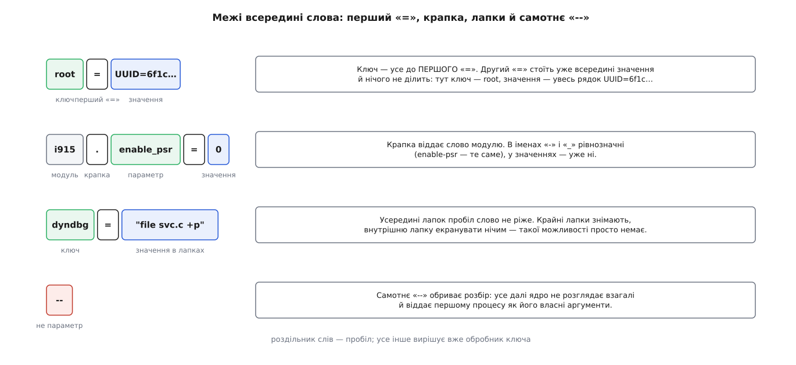
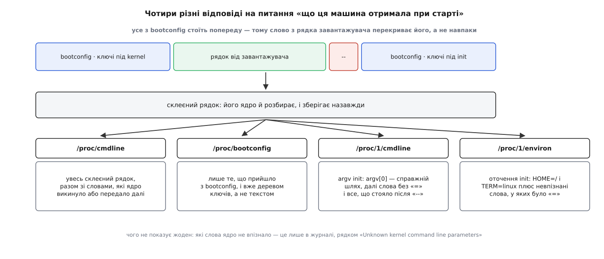

# 📋 Контракт командного рядка ядра

Це формальний бік рядка, який завантажувач кладе ядру в пам'ять: за яким правилом його ріжуть на слова, у якому порядку слово пропонують обробникам, що стається при повторенні ключа, скільки байтів рядок узагалі має право займати й які ключі варто знати напам'ять. Довідка потрібна тому, що інтерфейс цей мовчазний: помилковий ключ не заважає машині завантажитися й не дає попередження в ту мить, коли воно потрібне, — слово просто викидають, і система стартує так, ніби ви нічого не писали.

Усе нижче звірено з мейнлайновим кодом (`lib/cmdline.c`, `kernel/params.c`, `init/main.c`, `kernel/printk/printk.c`) і документацією ядра (`Documentation/admin-guide/kernel-parameters.txt`, `Documentation/arch/x86/boot.rst`, `Documentation/admin-guide/bootconfig.rst`).

---

## 1. Синтаксис слова

Слова розділяє пробіл. Усередині подвійних лапок пробіл слово не ріже. Лапку не можна екранувати нічим — у `lib/cmdline.c` це записано прямим текстом: «You can use " around spaces, but can't escape "».



*Ядро знає лише чотири межі всередині слова; усе інше — уже справа обробника ключа.*

| Форма | Приклад | Що з нею робить ядро |
| --- | --- | --- |
| голе слово | `ro`, `quiet`, `nomodeset` | ключ без значення; обробник дістає порожній вказівник замість значення |
| `ключ=значення` | `loglevel=7` | ключ — усе до **першого** `=`, решта слова — значення дослівно |
| `модуль.ключ=значення` | `usbcore.autosuspend=-1` | слово адресоване названому модулю, а не ядру |
| лапки навколо значення | `dyndbg="file svc.c +p"` | крайні лапки знімають, пробіли всередині зберігають |
| лапки навколо всього слова | `"dyndbg=file svc.c +p"` | те саме; обидва місця однаково дозволені |
| перелік через кому | `console=ttyS0,115200n8` | ядро коми **не** розбирає — це робить обробник ключа |
| `--` | `-- verbose` | межа розбору: далі ядро не дивиться взагалі |

Три дрібниці, на яких спотикаються найчастіше.

**Дефіс і підкреслення в іменах — те саме.** Ключі порівнюють через `dash2underscore`, тож `enable-psr` і `enable_psr` — один ключ. На значення це правило не поширюється.

**Кома — не синтаксис ядра, а домовленість обробників.** Ядро віддає обробникові усе значення цілим шматком, а той уже кличе `get_option`, `get_options` (перелік чисел і діапазони через дефіс) або `memparse` (суфікси `K`, `M`, `G`, `T`, `P`, `E` — степені двійки). Тому в одного ключа кома розділяє список, а в іншого нічого не означає.

**Порожнє значення й відсутнє значення — різні речі.** `ключ=` дає обробникові порожній рядок, `ключ` — узагалі жодного, і обробники ці випадки розрізняють.

---

## 2. Порядок: два проходи, чотири таблиці

Рядок обходять **двічі**. Перший прохід — ранній, до підняття керування пам'яттю; другий — у загальному ході запуску. Слово перевіряють за таблицями згори вниз, і перше влучання вирішує його долю.

| # | Прохід і таблиця | Що забирає | Приклад |
| --- | --- | --- | --- |
| 1 | ранній прохід `parse_early_param()` | **лише** ключі, зареєстровані `early_param()` | `earlycon`, `loglevel`, `quiet`, `debug` |
| 2 | основний прохід, таблиця `__param` | параметри, оголошені `module_param`/`core_param`, зокрема крапкові — для вбудованих в образ модулів | `i915.enable_psr=0` |
| 3 | псевдоніми sysctl (`sysctl_is_alias`) | коротка жменя ключів, що дублюють вузол sysctl | `hung_task_panic=`, `numa_zonelist_order=` |
| 4 | навмисний виняток | `BOOT_IMAGE=` (його дописує сам завантажувач) і `kexec` викидають, щоб вони не осіли в оточенні `init` | — |
| 5 | таблиця `__setup` (`obsolete_checksetup`) | класичні ключі підсистем ядра | `root=`, `init=`, `console=`, `ro` |
| 6 | у ключі є крапка — і його ніхто не взяв | **тихо викидають**; у коді це рівно один рядок із коментарем `/* Unused module parameter. */` | `systemd.unit=rescue.target` |
| 7 | усе, що лишилося | є `=` → змінна оточення `init`; немає `=` → аргумент `init` | `FOO=bar`, `verbose` |

Слова після `--` не проходять жодного з цих семи кроків: їх розбирає окремий виклик, який лише складає аргументи першого процесу.

Рядок 6 — головна пастка інтерфейсу. Параметр модуля, якого в цьому образі немає, не викликає ані помилки, ані попередження: ядро вважає, що модуль просто ще не завантажений, і мовчить. Про модулі та їхні параметри — [модулі ядра](root:sys-unix/kernel-modules): частина коду ядра живе окремими шматками, кожен має власний набір параметрів, і той самий параметр вбудованого модуля застосовують одразу, а завантажного — у мить завантаження.

Що ядро при цьому все-таки каже в журнал:

| Повідомлення | Коли |
| --- | --- |
| `Malformed early option '<ключ>'` | обробник із першого проходу відмовився розібрати значення |
| `Parameter <ключ> is obsolete, ignored` | ключ у таблиці лишили, а обробник із нього прибрали |
| `Unknown kernel command line parameters "<…>", will be passed to user space.` | підсумок кроку 7 — найкорисніший рядок з усіх трьох |

---

## 3. Повторений ключ

Правила «перемагає останній» в ядрі немає. Слова обходять зліва направо й кличуть обробник ключа стільки разів, скільки разів ключ трапився; що з цього вийде — вирішує сам обробник.

| Поведінка | Хто так робить | Наслідок |
| --- | --- | --- |
| перезапис | більшість ключів: `loglevel=`, `root=`, `init=`, `rootfstype=` | діє останнє входження |
| накопичення | `console=` | кожне входження додає ще один запис |
| перезапис на місці | невпізнані ключі зі знаком `=` | повторний ключ заміщає попередній у тому самому місці оточення `init` |

`console=` — єдиний широко вживаний накопичувальний ключ, і його поведінка складніша, ніж «останній виграв». Кожне входження додає запис у таблицю з вісьмома місцями (`MAX_CMDLINECONSOLES`); повторно названий той самий пристрій нового запису не створює, а оновлює наявний. Вивід ядра йде на **всі** названі консолі різних типів, а `/dev/console` дістається останній зареєстрованій; коли ж двічі названо той самий тип, вивід отримає лише перший пристрій цього типу. Формат опцій — `BBBBPNF`: швидкість, парність (`n`/`o`/`e`), кількість бітів, керування потоком (`r`); типово `9600n8`.

---

## 4. Межа довжини

Рядок кладуть у буфер сталого розміру, оголошений сталою `COMMAND_LINE_SIZE`.

| Архітектура | `COMMAND_LINE_SIZE` |
| --- | --- |
| x86 (32 і 64 біти) | 2048 |
| arm64 | 2048 |
| ARM, 32 біти | 1024 |
| по всіх архітектурах | від 256 до 4096 |

Задовгий рядок не спричиняє ані помилки, ані паніки — його обрізають. Машина завантажиться, більшість параметрів подіє, а хвіст рядка просто не існуватиме.

**Скільки місця з'їдає буденний рядок.** Візьмімо 32-бітну ARM-плату з перевіреним коренем і порахуймо байти — жодної екзотики, кожен ключ тут із потреби:

```
root=PARTUUID=8a7b1f2c-02 rootfstype=ext4 rootwait ro           →   53
console=ttyS0,115200n8 console=tty1 earlycon                    →   44
loglevel=7 systemd.log_level=debug systemd.log_target=console   →   61
isolcpus=2,3 nohz_full=2,3 rcu_nocbs=2,3 irqaffinity=0,1        →   56
cma=128M coherent_pool=2M vmalloc=512M                          →   38
ip=192.168.7.2::192.168.7.1:255.255.255.0::eth0:off             →   51
                                      плюс 5 пробілів на стиках →    5
                                                          разом →  308

додаємо один том dm-verity, описаний одним dm-mod.create=:
самі лише два хеші SHA-256 у шістнадцятковому запису — це
2 · 32 · 2 = 128 байтів, а ще ідентифікатори двох розділів,
розміри блоків, кількість блоків і назва алгоритму      →  243

308 + 1 + 243 = 552 із 1024 — лишилося 472
```

Другий такий том доводить рядок до 796, і на решту — ключі `rd.*` для зашифрованого тому, де самий лише UUID займає 36 символів, — місця вже майже немає. Обрізання станеться посеред слова, і жодного попередження про це не буде.

Тому корисне правило: рядок — канал для того, що потрібно знати, доки не існує ще жодного файлу. Усе, що можна виставити з уже працюючої системи, туди класти не варто — для більшості налаштувань ядра є [sysctl](root:sys-unix/sysctl-tunables), який діє на ходу, не має межі довжини й не вимагає перезавантаження.

### Поля протоколу x86

На x86 рядок передають через заголовок образу, і його довжина обмежена двічі: сталою в ядрі й тим, що оголошує сам заголовок.

| Поле | Зсув / розмір | З протоколу | Хто пише | Що це |
| --- | --- | --- | --- | --- |
| `version` | 0x206 / 2 | 2.00 | ядро | версія протоколу у вигляді `(major << 8) + minor` |
| `type_of_loader` | 0x210 / 1 | 2.00 | завантажувач, обов'язково | ідентифікатор завантажувача |
| `ramdisk_image` | 0x218 / 4 | 2.00 | завантажувач | адреса initramfs; нуль, якщо його немає |
| `ramdisk_size` | 0x21c / 4 | 2.00 | завантажувач | довжина initramfs |
| `cmd_line_ptr` | 0x228 / 4 | 2.02 | завантажувач, обов'язково | лінійна адреса рядка |
| `cmdline_size` | 0x238 / 4 | 2.06 | ядро | максимальна довжина рядка без завершального нуля |

Два наслідки з номерів версій. До протоколу 2.06 (ядро 2.6.22) поля `cmdline_size` не існувало, стеля дорівнювала 255 символам, і завантажувач мусив знати це напам'ять. А сам рядок можна класти не будь-де: протокол вимагає розмістити його між кінцем купи завантажувального коду (setup heap) і адресою 0xA0000.

---

## 5. Ключі за призначенням

**Корінь і його монтування** ([монтування](root:sys-unix/mount-model) — приєднання файлової системи до дерева; кореневе приєднання найперше, і робить його ще саме ядро):

| Ключ | Значення |
| --- | --- |
| `root=` | пристрій кореня: `/dev/sda2`, `UUID=…`, `PARTUUID=…`, `LABEL=…` |
| `rootfstype=` | не перебирати всі файлові системи, а взяти названу |
| `rootflags=` | рядок опцій монтування кореня |
| `ro` / `rw` | змонтувати корінь лише для читання або одразу на запис |
| `rootwait` / `rootdelay=` | чекати появи пристрою: без обмеження часу або задану кількість секунд |

**Перший процес** ([роль init і PID 1](root:sys-unix/init-and-pid1) — перша програма простору користувача, і запускає її безпосередньо ядро):

| Ключ | Значення |
| --- | --- |
| `init=` | повний шлях до програми замість `/sbin/init`. Якщо вона не запуститься — **паніка**: `Requested init … failed`, без жодного запасного варіанта |
| `rdinit=` | програма всередині initramfs; типово `/init` |
| *(нічого)* | ядро пробує `/sbin/init`, `/etc/init`, `/bin/init`, `/bin/sh` по черзі, а тоді панікує: `No working init found.` |

**Консоль і журнал:**

| Ключ | Значення |
| --- | --- |
| `console=` | `console=ttyS0,115200n8`, `console=tty1`; накопичувальний (див. §3) |
| `earlycon` | без значення — узяти опис із дерева пристроїв або таблиці ACPI SPCR; зі значенням — `earlycon=uart,mmio32,0x…,115200n8` чи `earlycon=<ім'я>,0x<адреса>` |
| `loglevel=` | поріг: у консоль ідуть повідомлення важливіші за вказане число |
| `quiet` | підняти той самий поріг одним словом, без числа |

**Пам'ять і графіка:**

| Ключ | Значення |
| --- | --- |
| `memmap=` | правити карту фізичної пам'яті ще до того, як ядро її прийме. Форма архітектурна; у мейнлайні документована як `<розмір>@<початок>`, `<початок>-<кінець>`, `<початок>:<розмір>[!<прапорці>]` та `[eE]xactmap` (забути карту прошивки й узяти рівно цю). На x86 давно вживані форми з символом-роздільником: `$` — позначити ділянку зарезервованою (класичний обхід збійної планки), `#` — як дані ACPI, `!` — як постійну пам'ять |
| `nomodeset` | не давати драйверам відео перемикати режим — лишити той кадровий буфер, який налаштувала прошивка |

**Вимкнути підозрюване** (`initcall_blacklist=` вимикає окремі [ініціалізації підсистем](root:sys-unix/kernel-initcalls) — функції, які ядро на старті викликає у наперед визначеному порядку):

| Ключ | Значення |
| --- | --- |
| `module_blacklist=` | не завантажувати перелічені через кому модулі |
| `initcall_blacklist=` | не виконувати перелічені через кому функції ініціалізації |

**Не ядру взагалі:**

| Ключ | Кому |
| --- | --- |
| `systemd.*` | `systemd`: `systemd.unit=`, `systemd.log_level=`, `systemd.mask=`, `systemd.setenv=`, а також короткі `1`, `3`, `5`, `single`, `rescue`, `emergency` |
| `rd.*` | те саме, але діє **лише** доти, доки система працює в initramfs: `rd.systemd.unit=`, `rd.udev.log_level=`, `rd.break` |

Ці два сімейства ядро мовчки викидає на кроці 6 — у них є крапка, а модулів з іменами `systemd` і `rd` не існує. Працюють вони тому, що systemd і скрипти initramfs самі читають сирий рядок із `/proc/cmdline` і виловлюють звідти своє.

---

## 6. bootconfig: як обійти межу довжини

Рядок обмежений кількома кілобайтами й живе одним текстовим рядком у конфігурації завантажувача. Коли параметрів справді багато, з ядра 5.6 (2020 рік) є другий канал: файл конфігурації, дописаний до [initramfs](root:sys-unix/initramfs) — архіву, який працює коренем, доки не змонтовано справжній.

| Властивість | Значення |
| --- | --- |
| Формат | дерево `ключ.підключ = значення`, дужки `{ }` для спільного префікса, перелік через кому, коментарі з `#` |
| Куди йде | ключі під `kernel` — у командний рядок ядра; ключі під `init` — в аргументи першого процесу |
| Як чіпляється | дописують у хвіст initramfs: `[initrd][конфіг][вирівнювання][розмір][контрольна сума][#BOOTCONFIG\n]`, інструментом `tools/bootconfig` (`bootconfig -a конфіг initrd.img`) |
| Як увімкнути | `CONFIG_BOOT_CONFIG` при збірці **і** ключ `bootconfig` у командному рядку (або `CONFIG_BOOT_CONFIG_FORCE`) |
| Межі | 32 КіБ на весь конфіг, не більше 1024 вузлів дерева |
| Видно в | `/proc/bootconfig` — вже деревом ключів, а не текстом |

Найважливіше тут — порядок склеювання, бо він неочевидний:

```
[bootconfig · kernel] [рядок від завантажувача] -- [bootconfig · init] [аргументи init із рядка]
```

Те, що прийшло з bootconfig, стоїть **попереду**. Разом із правилом §3 («обробник кличуть щоразу, і для більшості ключів діє останнє входження») це дає потрібну властивість: ключ, дописаний у меню завантажувача, перекриває той самий ключ із bootconfig. Постійні налаштування машини — у файлі, разова правка — у меню, і правка виграє.

---

## 7. Що показує `/proc/cmdline`, а що ні



*Одні й ті самі слова видно в чотирьох різних місцях — і в жодному з них не видно, що ядро з кожним словом зробило.*

`/proc/cmdline` — це збережена копія **склеєного** рядка, а не того, що передав завантажувач. Коли задіяно bootconfig, у цьому файлі буде й те, чого в меню не писали. Псевдофайлова система, у якій він живе, описана окремо: [/proc](root:sys-unix/proc-reading-process-and-kernel-state) — каталоги й файли, які нічому на диску не відповідають, а породжуються ядром на запит.

Справжні аргументи першого процесу — річ інша, і збігаються з рядком лише частково:

| Де дивитися | Що там насправді |
| --- | --- |
| `/proc/cmdline` | увесь склеєний рядок, разом зі словами, які ядро викинуло |
| `/proc/1/cmdline` | `argv[0]` — справжній шлях запущеної програми, далі невпізнані слова без `=` і все, що стояло після `--` |
| `/proc/1/environ` | `HOME=/` і `TERM=linux`, які ядро кладе завжди, плюс невпізнані слова, у яких був `=` |
| `/proc/bootconfig` | лише частина з bootconfig, деревом ключів |

Кількість того, що можна передати першому процесу, теж обмежена: аргументів — не більше `CONFIG_INIT_ENV_ARG_LIMIT` (типово 32), і рівно стільки ж окремо для змінних оточення. Переповнення тут, на відміну від задовгого рядка, мовчазним не буває — ядро панікує.

> 🔧 **Навіщо це.** Коли ключ «не подіяв», порядок перевірки випливає прямо з таблиць вище. Спершу `/proc/cmdline` на живій машині: чи слово взагалі доїхало й чи не обрізало хвіст. Далі журнал ядра на початку завантаження: рядок `Unknown kernel command line parameters` показує, що ядро слова не впізнало. Якщо слова немає ні там, ні там, а в ньому є крапка — його викинули на кроці 6, і шукати треба назву модуля.
