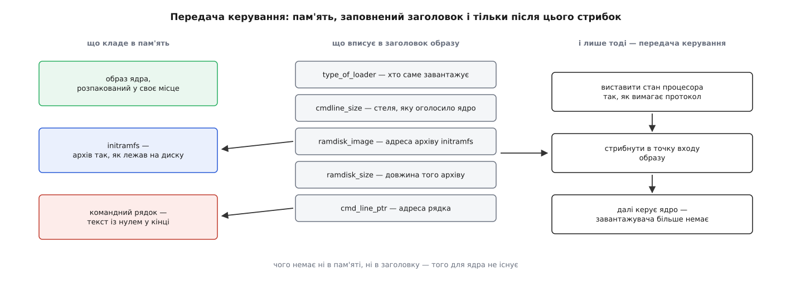
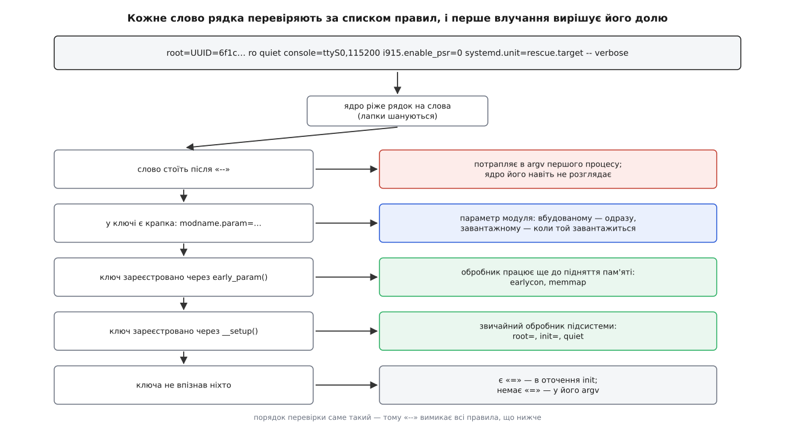
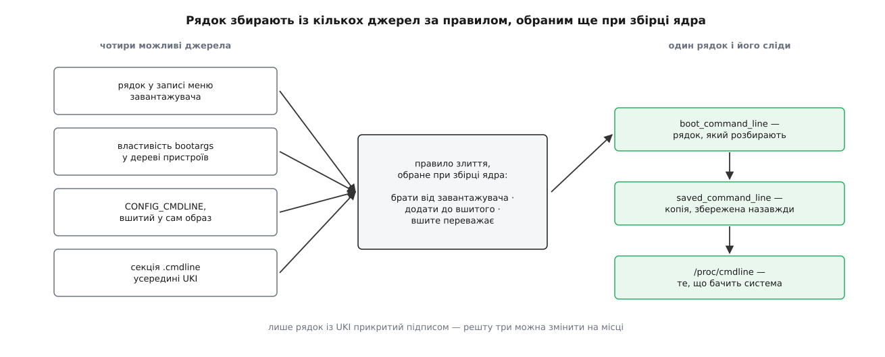

# Завантажувач і командний рядок ядра

<preknowlist>
- [Ланцюг завантаження](topic:sys-unix/boot-chain) — від прошивки до першого процесу керування передають по черзі, і кожна ланка знає лише свого наступника.
- [Ядро й простір користувача](topic:sys-unix/kernel-and-userspace) — ядро й програми розділені межею; усе, що вони знають одне про одного, проходить крізь оголошені інтерфейси.
- [initramfs: тимчасовий корінь](topic:sys-unix/initramfs) — архів, який працює коренем доти, доки не змонтовано справжній.
- [Монтування й дерево монтувань](topic:sys-unix/mount-model) — файлову систему треба приєднати до дерева, і найперше приєднання — кореневе.
- [Модулі ядра](topic:sys-unix/kernel-modules) — частина коду ядра живе окремими шматками, які довантажують, і кожен має власні параметри.
- [Конфігурація й збірка ядра](topic:sys-unix/kernel-config-and-build) — частину рішень замкнено в `.config` ще до компіляції образу.
- [Роль init і PID 1](topic:sys-unix/init-and-pid1) — перша програма простору користувача, яку запускає ядро, і вона теж отримує аргументи.
- [Secure boot](topic:sf-security/firmware-secure-boot) — перевірка підпису перед запуском коду, ланцюг довіри від незмінного кореня.
</preknowlist>

Машину щойно ввімкнули. У пам'яті немає нічого, працює лише код, вшитий у мікросхему на платі. За секунду-другу вже крутиться повноцінна система. У цьому проміжку хтось мусив знайти на диску потрібний файл і покласти його в пам'ять — але це лише половина роботи, і не найцікавіша.

Друга половина така. Образ ядра, який лежить на цій машині, побайтно той самий, що й на мільйонах інших. У ньому не записано, на якому розділі шукати кореневу файлову систему, у який порт виводити повідомлення, коли екрана немає, і чи хоче адміністратор саме цього разу завантажитися інакше, ніж завжди. Ці відповіді різні для кожної машини й навіть для кожного вмикання — отже, всередині образу їх бути не може. Хтось мусить сказати їх ядру ззовні, і сказати рівно в мить старту, коли жодної файлової системи, жодного налаштувального файлу й жодного процесу ще не існує.

Обидві половини — знайти образ і повідомити змінне — робить одна програма, яку звуть завантажувачем. Друга половина набуває вигляду одного рядка тексту: командного рядка ядра.

## Чому між прошивкою і ядром стоїть окрема програма

Логічно було б покласти обов'язок на прошивку: вона й так уже виконується, вона й так має доступ до диска. Питання в тому, що для цього прошивці треба вміти.

Образ ядра лежить не «на диску», а у файлі всередині файлової системи — а їх десятки, і кожна має власний формат каталогів. Файл може бути стиснений, розділ — на програмному масиві або під шифруванням. Формат самого образу з роками змінюється. Прошивка ж записана в мікросхему на заводі: оновлюють її рідко, часто ризиковано, а на багатьох платах не оновлюють ніколи. Вимога «прошивка мусить розуміти всі файлові системи, які колись з'являться» означає, що плата старіє швидше за програми, які на ній працюють.

Тому межу провели інакше: прошивка вміє одну маленьку річ, і ця річ незмінна роками. У класичній схемі персонального комп'ютера — прочитати перший сектор диска, 512 байтів, і виконати їх. У сучасній схемі UEFI — знайти на спеціальному розділі виконуваний файл наперед відомого формату й запустити його. Усе, що складніше, робить програма, яку в ті 512 байтів або в той файл поклали і яку можна оновити разом із системою.

Звідси й дивна на перший погляд будова завантажувачів: крихітний перший шматок, єдина робота якого — витягти більший другий, а вже той вміє читати файлові системи, малювати меню й розпаковувати образи. Обмеження, яке породило цю будову, — саме ті 512 байтів. Як із наміру завантажувати вільне ядро на чужому залізі виріс і Multiboot, і GRUB, і чому «другий ступінь, що розуміє файлові системи» переміг усе інше, розказано окремо: [звідки взявся GRUB](topic:sys-unix/bootloader-and-cmdline/hist-multiboot-and-grub.md) — про Multiboot, про спробу переробити чужий завантажувач і про те, чому її кинули.

UEFI цю схему помітно спростив. Ядро Linux, зібране з підтримкою власної заглушки EFI, саме є виконуваним файлом того формату, який прошивка вміє запускати, — отже, прошивка здатна завантажити ядро безпосередньо, без посередника. Завантажувач при цьому не зникає, але худне до меню: `systemd-boot`, наприклад, майже нічого не робить, крім показу списку варіантів і виклику прошивчастої функції запуску для обраного. На вбудованих платах усе навпаки: там роль і прошивки, і завантажувача часто грає одна програма на кшталт U-Boot, яка ініціалізує пам'ять, підіймає мережу й лише потім бере образ — з флеші, з картки чи по TFTP.

## Що саме передають ядру

Передача керування — не просто стрибок на початок файлу. Образ ядра має заголовок, і завантажувач мусить його заповнити, бо інакше ядро не знайде нічого з того, що для нього приготували.



*Завантажувач кладе в пам'ять три речі, вписує в заголовок їхні адреси й лише після цього передає керування; поза заголовком ядро нічого з цього не знайде.*

Розберімо на прикладі протоколу x86, бо він найдокладніше описаний. У заголовку образу є поле `cmd_line_ptr` — адреса, за якою завантажувач поклав рядок; є пара `ramdisk_image` і `ramdisk_size` — адреса й довжина initramfs; є `type_of_loader`, куди завантажувач вписує свій ідентифікатор, щоб ядро знало, з ким має справу. Є й зустрічне поле: `cmdline_size` заповнює не завантажувач, а саме ядро — це стеля довжини рядка, яку образ згоден прийняти. Поля з'являлися поступово, і це видно з номерів версій протоколу: `cmd_line_ptr` існує з версії 2.02, а `cmdline_size` додали лише у версії 2.06 — доти рядок не міг перевищувати 255 символів, і завантажувач мусив просто це знати.

На платах з деревом пристроїв канал інший. Там завантажувач кладе в пам'ять ще й [дерево пристроїв](topic:sys-unix/device-tree) — структуру, що описує, яке залізо є на цій платі й за якими адресами воно відгукується. Командний рядок їде всередині цієї ж структури, властивістю `bootargs` у вузлі `/chosen`, і завантажувач її туди вписує перед стрибком. Механізм зовсім інший, суть та сама: одна текстова стрічка, покладена так, щоб ядро її знайшло.

## Як ядро розбирає рядок

Ядро отримало текст. Далі відбувається річ, яка пояснює більшість подальших несподіванок: рядок ріжуть на слова й кожне слово проводять через список правил, де перше влучання вирішує його долю.



*Слова перевіряють по черзі згори вниз, тому «--» відрізає все, що йде далі, а невпізнане слово має шанс дожити аж до першого процесу.*

Розбір іде двома заходами, і поділ між ними не формальний. Перший захід — рання обробка: ядро шукає лише ті ключі, які зареєстровано через `early_param`, і викликає їхні обробники ще до того, як підніметься керування пам'яттю. Саме тому `earlycon` працює: щоб побачити повідомлення про крах, який стався за десять рядків від початку, консоль треба вмикати до всього іншого. Другий захід — загальний: обробники, зареєстровані через `__setup`, спрацьовують уже в основному ході запуску.

Реєстрація виглядає буквально так — це справжній код ядра, макрос кладе пару «ім'я, функція» в окрему секцію образу, а ядро її обходить:

```c
static int __init loglevel(char *str)
{
        int newlevel;

        /* значення міняємо лише тоді, коли рядок справді розібрався:
           тихий нуль замість рівня журналу дуже важко потім знайти */
        if (get_option(&str, &newlevel)) {
                console_loglevel = newlevel;
                return 0;
        }

        return -EINVAL;         /* у журналі буде «Malformed early option» */
}

early_param("loglevel", loglevel);
```

Ключ із крапкою обробляють окремо: `usbcore.autosuspend=-1` означає «параметр `autosuspend` модуля `usbcore`». Якщо модуль вбудований в образ, значення застосують одразу; якщо він завантажний — ядро запам'ятає пару й видасть її модулю тоді, коли той завантажиться. А от якщо такого модуля немає взагалі, слово тихо викидають: жодного попередження, жодної помилки.

І тут — найкорисніший наслідок усього цього розбору. Слово, якого не впізнав ніхто і в якому немає крапки, ядро не викидає, а передає далі: якщо в ньому є `=`, воно стає змінною оточення першого процесу, якщо немає — його аргументом. Усе, що стоїть після `--`, іде першому процесу без розгляду взагалі. Отже, командний рядок — це водночас і параметри ядра, і аргументи `init`, розділені не роздільником, а тим, чи знайшовся охочий.

Тепер видно, чому `systemd.unit=rescue.target` працює, хоча за правилами не мало б: у ключі є крапка, модуля `systemd` не існує, отже ядро це слово мовчки викидає й нікуди не передає. Спрацьовує воно тому, що systemd не покладається на своє оточення, а сам читає весь сирий рядок із [`/proc/cmdline`](topic:sys-unix/proc-reading-process-and-kernel-state) і виловлює звідти власні ключі. Так само поводяться скрипти всередині initramfs зі своїми ключами `rd.*`. Ядро зберігає повну копію рядка назавжди саме для цього — щоб простір користувача міг перечитати те, чого ядро не зрозуміло.

> 🔧 **Навіщо це.** Коли параметр «не подіяв», перевіряти треба не файл конфігурації завантажувача, а `/proc/cmdline` на живій машині: там видно рядок, який ядро справді отримало. Половина таких випадків — це слово, яке загубилося дорогою або яке ядро тихо викинуло як параметр неіснуючого модуля. Друга половина — параметр, що подіяв, але не так: журнал ядра на початку завантаження показує, які ключі виявилися невпізнаними.

Повний перелік правил синтаксису — лапки, повторення ключа, накопичувальні параметри на кшталт `console=`, поведінка при перевищенні довжини, найважливіші ключі за призначенням і формат `bootconfig` — зібрано окремо: [контракт командного рядка](topic:sys-unix/bootloader-and-cmdline/api-cmdline-reference.md). Тримати це в статті означало б перетворити її на таблицю.

**Розбір справжнього рядка.** Візьмімо типовий рядок настільної машини й проведімо кожне слово тим самим каскадом:

```
root=UUID=6f1c… ro quiet console=ttyS0,115200 i915.enable_psr=0 systemd.unit=rescue.target -- verbose

root=UUID=6f1c…          → __setup, код монтування кореня: де шукати корінь
ro                       → __setup: змонтувати корінь спершу лише для читання
quiet                    → __setup: підняти поріг важливості повідомлень консолі
console=ttyS0,115200     → __setup, накопичувальний: додає ще одну консоль
i915.enable_psr=0        → параметр вбудованого модуля i915
systemd.unit=rescue…     → крапка, модуля немає → ядро викидає; systemd бере з /proc/cmdline
--                       → відсікання: усе далі ядро не розглядає
verbose                  → argv[1] першого процесу
```

Зверніть увагу на `ro`. Здається дрібницею, а насправді це умова, за якої взагалі можливо перевірити файлову систему перед використанням: корінь підіймають лише для читання, проганяють перевірку, і аж потім перемонтовують на запис.

## Межа довжини, про яку не попереджають

Рядок кладуть у буфер сталого розміру, оголошений сталою `COMMAND_LINE_SIZE`. Розмір залежить від архітектури: на x86 і arm64 це 2048 байтів, на 32-бітному ARM — 1024, а загалом по архітектурах трапляється від 256 до 4096.

Важливий не сам розмір, а поведінка на межі. Задовгий рядок не спричиняє помилки — його обрізають. Машина завантажиться, більшість параметрів подіє, а хвіст рядка просто не існуватиме. Помітити це можна лише порівнявши `/proc/cmdline` з тим, що написано в конфігурації завантажувача. Реальні рядки доростають до цієї межі легше, ніж здається: параметри ізоляції ядер процесора, налаштування initramfs для мережевого кореня, довгі ідентифікатори розділів — і тисяча байтів набирається без жодної екзотики.

Це, до речі, добра підказка, коли параметр варто ставити в рядок, а коли ні. Рядок — канал для того, що потрібно знати до того, як існує хоч один файл. Усе, що можна виставити пізніше, з працюючої системи, туди класти не варто: для більшості налаштувань ядра є [sysctl](topic:sys-unix/sysctl-tunables), який працює на ходу й не має ані межі довжини, ані потреби в перезавантаженні.

## Звідки рядок береться насправді

Досі ми говорили так, наче рядок пише людина в меню завантажувача. Джерел насправді чотири, і ядро зводить їх в одне за правилом, обраним ще при збірці.



*Джерела зливають за одним із трьох правил; результат стає рядком, який розбирають, і копією, яку назавжди видно через /proc/cmdline.*

Перше джерело — власне завантажувач. Друге — властивість `bootargs` у дереві пристроїв; на вбудованих платах це часто єдине джерело. Третє — рядок, вшитий у сам образ параметром `CONFIG_CMDLINE` ще при компіляції. Четверте — секція `.cmdline` всередині єдиного образу ядра, про який далі.

Правил злиття три, і вибирають їх при збірці ядра. Типове — брати рядок від завантажувача, а вшитий використовувати лише як запасний, коли завантажувач не дав нічого. Друге — дописувати одне до одного, поєднуючи вшиту основу зі змінною частиною. Третє — вшите переважає над усім, і те, що передав завантажувач, ігнорується цілком. Третій варіант виглядає дивно, доки не згадати, навіщо він.

## Рядок як привілей

Параметр `init=/bin/sh` каже ядру запустити замість системи ініціалізації звичайну оболонку. Оболонка ця працюватиме з правами root, без жодного пароля, бо перевіряти паролі мала б програма, яка так і не запустилася. Це не діра — це передбачений і потрібний спосіб полагодити машину, у якої зіпсовано конфігурацію. Але з нього випливає точний висновок: **хто може дописати слово в командний рядок, той має повну владу над машиною.** Не пізніше, не з умовами — одразу.

Тому в GRUB є пароль на редагування записів меню, і тому фізичний доступ до машини традиційно вважають рівносильним доступу root.

Ця сама властивість ламає перевірку підпису, якщо її зробити наївно. Схема, у якій прошивка перевіряє підпис завантажувача, а завантажувач — підпис образу ядра, виглядає повним ланцюгом довіри. Але командний рядок у цій схемі не підписаний нічим: він живе в конфігураційному файлі завантажувача, який редагують текстовим редактором. Підписане ядро, запущене з дописаним `init=/bin/sh`, лишається підписаним ядром — і віддає машину. Те саме роблять параметри, що вимикають захисні механізми, і підміна initramfs, який теж класично не підписаний.

Відповідь на це — скласти все, що впливає на завантаження, в один файл і підписати його цілком. Такий файл звуть єдиним образом ядра: це виконуваний файл формату UEFI, у секціях якого лежать заглушка-запускач, саме ядро, initramfs і командний рядок. Підпис накриває файл повністю, отже жоден із чотирьох складників не можна підмінити окремо. Заглушка при старті дістає рядок зі своєї секції й подає ядру звичайним шляхом; коли перевірка підпису ввімкнена, вона ігнорує все, що їй передали ззовні, — саме щоб дописати слово було нікуди. Складання такого образу — робота на кілька команд і одну обережність: [зібрати єдиний образ ядра власноруч](topic:sys-unix/bootloader-and-cmdline/proj-uki-by-hand.md) показує, з чого він складається насправді, і що станеться, коли рядок у ньому виявиться неправильним.

> 🔧 **Навіщо це.** Перехід на єдиний образ ядра коштує зручності: рядок більше не можна виправити в меню, а кожна його зміна вимагає перескладання й перепідпису образу. Тому машину зазвичай тримають з двома записами — робочим підписаним образом і запасним варіантом для ремонту, доступ до якого обмежують окремо. Забути про запасний варіант — типовий спосіб отримати машину, яку неможливо полагодити, не витягнувши з неї диск.

Звідси й розділення, яке варто мати на думці, дивлячись на будь-який командний рядок. Одна його частина описує машину: де корінь, яку консоль вона має, які особливості її заліза треба обійти. Ця частина не змінюється роками — і саме їй місце всередині підписаного образу, де її не можна ані підмінити, ані загубити при обрізанні. Друга частина описує одне конкретне вмикання: завантажитися в аварійний режим, вимкнути підозрюваний драйвер, увімкнути ранню консоль, щоб побачити крах. Ця частина за визначенням мусить лишатися редагованою — і саме вона є тим механізмом, який робить систему ремонтопридатною.
