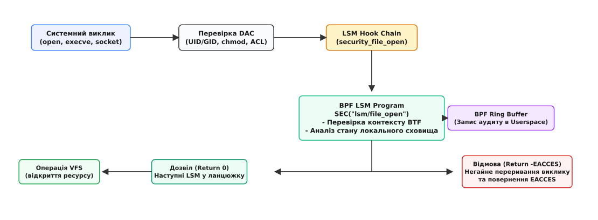
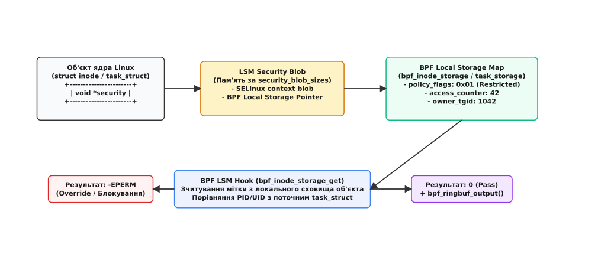

# Модифікація поведінки Security Modules через bpf_lsm (bpf_override_return)

<preknowlist>
- [LSM фреймворк](root:sys-unix/lsm-framework) — архітектура хуків безпеки в ядрі Linux та ланцюжок викликів.
- [eBPF кастомні політики](root:sys-unix/bpf-lsm-policy-authoring-libbpf-core) — завантаження eBPF-програм та верифікація ядра.
- [Права доступу та ID процесів](root:sys-unix/process-credential-checks-and-transitions) — структура `cred`, `task_struct` та `inode`.
- [Системні виклики та VFS](root:sys-unix/permission-bits) — базові перевірки DAC перед викликом LSM.
</preknowlist>

У традиційній системі мандатного контролю доступу (MAC) процес, який намагається виконати бінарний файл або відкрити файловий дескриптор, проходить перевірку через статичні політики SELinux або AppArmor. Якщо адміністратору потрібно негайно реагувати на загрозу — наприклад, заблокувати запуск файлів з каталогу `/tmp` тільки для конкретної групи контейнерів або призупинити підозрілу активність під час атаки — єдиним шляхом залишалося перекомпілювання текстових правил або перезавантаження профілів. Це займає час, вимагає привілейованого інструментарію та загрожує побічними збоями сусідніх сервісів через випадкові помилки у конфігурації.

Поява типу BPF-програм `BPF_PROG_TYPE_LSM` у Linux 5.7 повністю змінила цей підхід. BPF LSM дозволяє завантажувати в ядро програмований код, який підключається до тих самих точок контролю (LSM hooks), що й SELinux чи AppArmor. Програма аналізує контекст виклику у реальному часі, зберігає стан об'єктів у високоефективній пам'яті ядра та приймає рішення про дозвіл або заборону дії. Повернення від'ємного цілого числа (наприклад, `-EACCES` або `-EPERM`) безпосередньо зупиняє системний виклик, повертаючи користувачу помилку відмови у доступі, тоді як повернення `0` дозволяє продовжити перевірку іншими модулями безпеки.

## Обмеження статичних модулів безпеки та виклики динамічного середовища

Статичні модулі безпеки Linux розроблялися в епоху, коли конфігурація сервера залишалася незмінною протягом місяців. Політики SELinux складаються з тисяч строгих правил Type Enforcement, які описують дозволені взаємодії між доменами процесів і типами файлів. AppArmor спростив цей підхід, зв'язавши правила з абсолютними шляхами файлової системи.

Проте у хмарних середовищах та оркестраторах контейнерів (Kubernetes) виникають задачі, які неможливо виразити через статичні шляхи чи фіксовані типи:

1. **Контекстний контроль на основі стану**: Необхідно дозволити процесу відкривати конфігураційний файл лише у перші 10 секунд після старту контейнера, а після завершення ініціалізації — заблокувати доступ.
2. **Аналіз динамічних атрибутів процесів**: Необхідно перевіряти не лише PID або UID, а й ієрархію Cgroups v2, мережеве оточення, простір імен (namespaces) чи вміст BPF-карт.
3. **Вибірковий тихий аудит**: Потрібно збирати події про спроби доступу до чутливих файлів без заповнення системного логу `auditd`, фільтруючи шумові виклики безпосередньо у просторі ядра.

Традиційні підходи вимагали компромісу: або послаблювати статичні політики, ризикуючи безпекою, або створювати громіздкі модулі ядра на C, будь-яка помилка в яких загрожувала аварійним зупиненням усієї системи (`kernel panic`).

## Поетапне проходження перевірок у ядрі та місце BPF LSM

Коли процес звертається до системного виклику (наприклад, `openat`, `execve`, `connect` або `unlink`), ядро проводить перевірку в кілька послідовних етапів.


*Послідовність виконання перевірок: BPF LSM виконується на початку ланцюжка хуків LSM і може негайно зупинити виклик, повернувши від'ємний код помилки, або записати подію аудиту й передати керування далі.*

На першому етапі ядро виконує розпізнавання параметрів VFS та перевірку мандатів у межах вибіркового контролю доступу (DAC — Discretionary Access Control). Перевіряються біти дозволів `rwxrwxrwx`, приналежність до UID/GID та маски POSIX ACL, якщо файлова система їх підтримує. Якщо DAC забороняє дію, ядро негайно завершує виклик із помилкою `EACCES` або `EPERM`, навіть не звертаючись до підсистеми LSM.

Якщо DAC-перевірка пройшла успішно, ядро викликає відповідний LSM-хук — функцію вигляду `security_file_open()`, `security_bprm_check_security()` або `security_socket_connect()`. У сучасних ядрах із підтримкою LSM Stacking хук безпеки являє собою послідовний перелік викликів зареєстрованих модулів.

За замовчуванням BPF LSM реєструє свої обробники в цьому ланцюжку. Порядок модулів задає конфігурація ядра `CONFIG_LSM` і параметр завантаження `lsm=`; у типових збірках `bpf` стоїть у кінці переліку — після `apparmor` чи `selinux`. Хук обходить зареєстровані модулі по черзі й зупиняється на першому, що повернув від'ємне число. Тож повернення помилки з BPF-програми обриває обхід: керування не отримують ті модулі, які стоять у переліку ЗА `bpf`, а системний виклик повертає у простір користувача код помилки, еквівалентний повернутому значенню BPF. Щоб BPF-програма судила першою, `bpf` треба явно поставити на початок `lsm=`.

## Механізм Override: від `bpf_override_return` до природного повернення LSM

До появи BPF LSM для маніпуляції поведінкою ядра використовувався хелпер `bpf_override_return()`, розроблений для трасування за допомогою kprobes. Цей хелпер фізично підміняв лічильник команд процесора (Instruction Pointer) та регістр повернення результату, змушуючи ядро «вважати», що функція завершилася з помилкою.

Проте пряма підміна коду повернення через kprobes несе високі ризики: якщо функція встигла виділити ресурси чи захопити `spinlock`, примусове повернення минає етап звільнення пам'яті й зняття блокувань, що призводить до паніки ядра або взаємних блокувань. Через це ядро дозволяє `bpf_override_return()` тільки для вузького білого списку функцій, позначених макросом `ALLOW_ERROR_INJECTION()`.

Детальний опис цієї еволюції та ризиків kprobe-ін'єктування наведено у вставці [історія створення bpf_override_return та BPF LSM](root:sys-unix/bpf-lsm-deny-path-storage-and-audit/hist-bpf-lsm-override.md).

У BPF LSM механізм модифікації поведінки (override) реалізовано без використання `bpf_override_return()`. Програми типу `BPF_PROG_TYPE_LSM` є штатними обробниками хуків безпеки. Фреймворк LSM очікує від кожного хука повернення цілого числа (`int`):

```
Повернене значення > 0  → Невизначений стан (зарезервовано ядром).
Повернене значення == 0 → Дозвіл операції (Pass).
Повернене значення < 0  → Заборона операції (Deny / Override).
```

Коли програма BPF LSM повертає, наприклад, `-EACCES` (`-13`), ядро інтерпретує це як рішення модуля безпеки відхилити операцію. Фреймворк LSM зупиняє обхід решти модулів і трансформує це значення у результат системного виклику. Для процесу у просторі користувача це виглядає так, ніби операцію заблокувала сама ОС на рівні прав доступу.

Опис сигнатур BPF LSM, макросів `BPF_PROG` та таблицю кодів помилок можна переглянути у вставці [довідник BPF LSM хелперів та кодів повернення](root:sys-unix/bpf-lsm-deny-path-storage-and-audit/api-bpf-lsm-helpers.md).

## Збереження стану та контексту: BPF Local Storage та LSM Blobs

Для прийняття зважених рішень щодо блокування BPF-програмі недостатньо аналізувати лише статичні аргументи системного виклику. Необхідно зберігати стан між викликами: наприклад, підраховувати кількість невдалих спроб входу, відстежувати факт модифікації файлу або зберігати мітки безпеки процесів.

Традиційні BPF-карти (Hash Maps) вимагають використання глобальних блокувань або пер-процесорних масивів, що під час інтенсивного файлового введення-виведення створює значні накладні витрати на пошук елементів за ключем (`hlist_lookup`).

BPF LSM вирішує цю проблему за допомогою механізму BPF Local Storage (`BPF_MAP_TYPE_TASK_STORAGE`, `BPF_MAP_TYPE_INODE_STORAGE`, `BPF_MAP_TYPE_SK_STORAGE`).


*Прив'язка BPF Local Storage до структур inode та task_struct: зберігання динамічних міток безпеки поверх системних security blobs без використання уповільнювальних хеш-таблиць.*

Під капотом локальне сховище спирається на інфраструктуру LSM Blobs. Під час завантаження ядра кожен модуль безпеки запитує виділення додаткового обсягу пам'яті у структурі `security_blob_sizes`. Отриманий вказівник `void *security` додається безпосередньо до ядерних об'єктів `struct inode`, `struct task_struct` чи `struct sock`.

BPF Local Storage використовує цей вказівник для швидкого знаходження даних BPF-програми за розрахунковим зсувом (`offset`). Це забезпечує доступ за фіксований час `O(1)` без звернення до глобальних карт та без ризику гонитви даних, оскільки виділення та видалення пам'яті прив'язане до життєвого циклу відповідного об'єкта ядра під захистом RCU (Read-Copy Update).

Коли об'єкт ядра (наприклад, файл або процес) знищується, підсистема LSM автоматично викликає деструктори локального сховища BPF, звільняючи пам'ять без участі користувацьких демонів та без небезпеки витоків ресурсів.

## Послідовність викликів при виконанні системного виклику `execve`

Розглянемо детальний крок за кроком трасувальний шлях системного виклику `execve("/tmp/malware", ...)` при активному BPF LSM модулі безпеки:

1. **Вхід у ядро**: Процес звертається до системного виклику `sys_execve`. Ядро ініціалізує внутрішню структуру `struct linux_binprm` для зберігання аргументів та атрибутів бінарного файлу.
2. **Перевірка VFS та DAC**: VFS знаходить відповідний `struct inode` на файловій системі. Перевіряються біти дозволу на виконання (`S_IXUSR`). Якщо файл не має прапора виконання, повертається `EACCES`.
3. **Виклик LSM-хука**: Ядро викликає `security_bprm_check_security(bprm)`. Ця функція обходить список зареєстрованих обробників цього хука в порядку, заданому конфігурацією LSM.
4. **Виконання BPF LSM**: Передається керування BPF-програмі. Програма зчитує `bprm->file->f_path` за допомогою `bpf_d_path()`.
5. **Аналіз політики та перевірка сховища**: Програма перевіряє, чи містить шлях префікс `/tmp/`. Додатково перевіряється локальне сховище `task_storage` поточного процесу.
6. **Генерація події та повернення коду**: Програма заповнює структуру аудиту в Ring Buffer, після чого повертає значення `-EACCES`.
7. **Рішення фреймворку LSM**: Фреймворк LSM бачить повернене від'ємне число `-EACCES`, припиняє подальший обхід ланцюжка (модулі, що стоять за `bpf`, керування не отримують) і повертає `-EACCES` у VFS.
8. **Повернення в Userspace**: Системний виклик `execve` завершується з кодом помилки `-1`, а змінна `errno` встановлюється в `EACCES` (`Permission denied`).

## Аудит високої роздільної здатності без накладних витрат

Окрім прямого блокування дій (override), BPF LSM є потужним інструментом для аудиту безпеки. Класична підсистема аудиту ядра (`audit`) перехоплює системні виклики на вході та виході з ядра й віддає записи демонові `auditd` у просторі користувача через сокет netlink. Кожна подія перетворюється на текстовий рядок і копіюється назовні, що під час тисяч викликів `openat` на секунду створює відчутні накладні витрати на CPU та диск.

BPF LSM дозволяє реалізувати аудиторську логіку з нульовим копіюванням зайвих даних:

1. **Фільтрація у ядрі**: BPF-програма аналізує шлях файлу чи UID. Якщо дія не представляє інтересу (наприклад, читання файлів системними демонами), програма негайно повертає `0`, не витрачаючи ресурси на формування подій.
2. **Використання BPF Ring Buffer**: Якщо виявлено підозрілу дію, BPF-програма зарезервовує структуру в BPF Ring Buffer за допомогою `bpf_ringbuf_reserve()`, заповнює її безпосередньо в пам'яті ядра та публікує через `bpf_ringbuf_submit()`.
3. **Безпечне читання VFS**: За допомогою хелпера `bpf_d_path()` BPF LSM відновлює канонічний абсолютний шлях до файлу прямо зі структури `struct path`, минаючи маніпуляції з відносними шляхами у просторі користувача.

Це дає змогу створювати системи моніторингу загрози у реальному часі (SIEM/eDR агенти), які спостерігають за критичними вузлами системи з мінімальним впливом на продуктивність.

## Sleepable BPF LSM (`SEC("lsm.s/...")`) та перевірка пам'яті користувача

За замовчуванням BPF LSM-хуки виконуються в атомарному контексті під захистом RCU Read Lock. У цьому режимі програмі суворо заборонено «спати» — виконувати операції, які можуть призвести до блокування потоку, виділення сторінок пам'яті або очікування дисків.

Проте для деяких хуків безпеки (наприклад, перевірка аргументів системного виклику, які передаються через вказівники у пам'яті користувача) необхідно копіювати дані з пам'яті процесу. Якщо ця пам'ять вивантажена на диск (swapped out), спроба зчитати її в атомарному контексті призведе до помилки.

У Linux 5.10 з'явилася підтримка сліпабельних BPF-програм (Sleepable BPF) — саме там прапор `BPF_F_SLEEPABLE` і хелпер `bpf_copy_from_user()` уперше стали доступні програмам LSM. Для BPF LSM це позначається секцією `SEC("lsm.s/...")`.

Сліпабельні хуки дозволяють використовувати хелпер `bpf_copy_from_user()`, який безпечно копіює дані з пам'яті простору користувача в буфер BPF. Верифікатор ядра перевіряє, чи підтримує конкретний LSM-хук режим сліпабельності, перш ніж дозволити завантаження програми.

Повний приклад реалізації монітору аудиту та блокувальника небажаного коду на C та C++ подано у вставці [практичний проект модуля аудиту та блокування](root:sys-unix/bpf-lsm-deny-path-storage-and-audit/proj-bpf-lsm-override.md).

## Інтеграція з BTF та гарантії безпеки верифікатора

Ключовою технічною перевагою BPF LSM над традиційними kprobes або модулями ядра є використання BPF Type Format (BTF). BTF експортує повний точний опис усіх типів, структур та полів конкретного завантаженого ядра.

Коли BPF-програма завантажується в ядро, спрацьовує кілька рівнів захисту:

1. **Перевірка типів контексту**: Верифікатор перевіряє, що аргументи, передані у макрос `BPF_PROG(name, a, b)`, точно відповідають типам сигнатури відповідного LSM-хука у джерельному коді ядра.
2. **Стійкість до зміни розкладки структур**: Звернення до полів ядерних структур (наприклад, `bprm->file->f_path.dentry`) компілятор позначає релокаціями BPF CO-RE (Compile Once – Run Everywhere). Накладає їх не верифікатор, а `libbpf` у просторі користувача: перед завантаженням вона звіряє релокації з BTF поточного ядра й, якщо зсув поля змінився, переписує інструкції під це ядро.
3. **Захист від невалідних покажчиків**: Зчитування пам'яті через прямі покажчики контролюється верифікатором. Якщо покажчик може бути `NULL`, верифікатор вимагає явної перевірки перед використанням.

Ці гарантії унеможливлюють ситуації, коли помилка у BPF LSM програмі призводить до паніки ядра або пошкодження чужих об'єктів пам'яті.

## Простеження та діагностика BPF LSM через sysfs та bpftool

Адміністратори та розробники системи можуть контролювати стан завантажених програм BPF LSM за допомогою стандартних інструментів ядра:

1. **Перевірка увімкнених модулів LSM**:
   ```bash
   cat /sys/kernel/security/lsm
   ```
   Вивід повинен містити `bpf` серед переліку увімкнених модулів (наприклад, `lockdown,capability,landlock,yama,apparmor,bpf`) — порядок у цьому рядку і є порядком обходу ланцюжка.
2. **Інспекція завантажених програм через bpftool**:
   ```bash
   bpftool prog show type lsm
   ```
   Виводить список ID BPF-програм LSM, їхні назви, розмір байткоду та кількість прив'язаних хуків.
3. **Перевірка прив'язаних лінків (bpf_link)**:
   ```bash
   bpftool link show
   ```
   Показує точну назву LSM-хука ядра (наприклад, `attach_type lsm_file_open`), до якого приєднано програму.

## Порівняльний аналіз BPF LSM із суміжними технологіями пісочниць

Для вибору правильного інструменту безпеки в Linux необхідно розуміти архітектурні відмінності між BPF LSM та іншими механізмами розмежування прав:

- **Seccomp-BPF**: Працює на рівні системного виклику за допомогою класичних cBPF-фільтрів — того самого набору інструкцій, що й фільтри сокетів, але це не тип програм eBPF. Здатний перевіряти номери системних викликів та скалярні аргументи (наприклад, прапори `open`). Проте Seccomp не може розіменовувати вказівники у пам'яті користувача і не знає про об'єкти VFS (`inode`, `path`), що робить його непридатним для блокування за шляхами.
- **Landlock LSM**: Непривілейований механізм пісочниць (sandboxing), який дозволяє процесу самостійно обмежити свої права на рівні VFS та мережі. На відміну від BPF LSM, Landlock не вимагає прав `CAP_SYS_ADMIN` чи `CAP_BPF`, але спирається на фіксовані ABI і не дозволяє писати довільну програмовану логіку на C.
- **AppArmor / SELinux**: Класичні MAC-системи із декларативними правилами. Забезпечують базовий глобальний захист ОС, але поступаються BPF LSM у швидкості реагування на динамічні події та можливості збереження довільного стану у пам'яті.

## Практичні застереження, верифікація та ціна продуктивності

Незважаючи на гнучкість, використання BPF LSM вимагає дотримання суворих правил інженерної безпеки:

1. **Небезпека гонки у шляхах (TOCTOU)**: Якщо BPF LSM перевіряє ім'я файлу на основі текстового рядка з пам'яті користувача до того, як ядро виконає локалізацію dentry, зловмисник може підмінити шлях між перевіркою та відкриттям (Time-of-Check to Time-of-Use). Перевірки слід виконувати тільки на рівні вже сформованих ядерних структур `struct path` або `struct inode`.
2. **Обмеження верифікатора**: BPF-програми LSM повинні мати гарантовану зупинку. Всі цикли мають бути обмежені розгортанням (`#pragma unroll`), а розміри стек-буферів не повинні перевищувати 512 байтів.
3. **Життя політики після смерті демона**: Якщо демон простору користувача, що контролює BPF LSM, аварійно завершується, ядро закриває його дескриптори — разом із ними зникає `bpf_link`, і програма від'єднується від хука. Щоб політика пережила свого демона, лінк треба закріпити у `bpffs` (`bpftool link pin`); тоді від'єднання станеться лише після явного зняття закріплення.
4. **Режим Lockdown**: У системах з увімкненим Linux Lockdown Mode (у режимі `confidentiality`) завантаження кастомних BPF LSM програм, які модифікують поведінку ядра або читають чутливу пам'ять, може бути заблоковано для збереження цілісності ядра.

Завдяки використанню JIT-компіляції BPF-інструкцій у рідний машинний код x86_64 чи ARM64, накладні витрати на виконання одного BPF LSM хука вимірюються наносекундами, що робить цей інструмент ідеальним вибором для побудови сучасних динамічних систем захисту в Linux.
