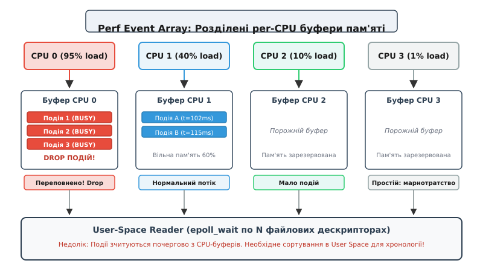
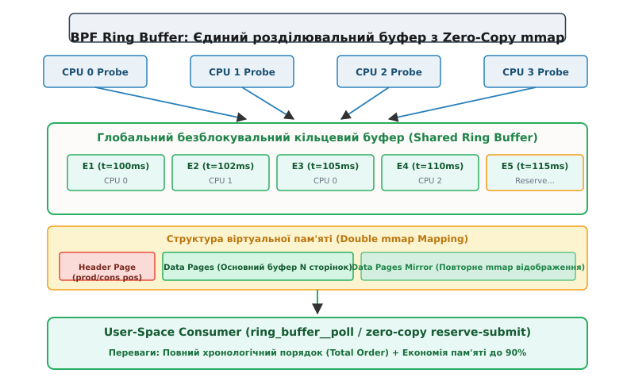

# Порівняльний аналіз механізмів доставки подій BPF Ring Buffer vs Perf Event Array

<preknowlist>
- [Архітектура eBPF](root:sys-unix/ebpf-programming-model-and-toolchain) — виконання байт-коду в ядрі Linux, структури карт (BPF maps) та обмеження стека в 512 байт.
- [Підсистема perf events](root:sys-unix/perf-events) — підсистема ядра для збору подій продуктивності та профілювання.
- [Відображення пам'яті mmap](root:sys-unix/mmap-model) — відображення сторінок ядра у простір користувача без копіювання.
- [Мультиплексування epoll](root:sys-unix/select-poll-epoll) — сповіщення про наявність даних у файлових дескрипторах.
</preknowlist>

Сервер бази даних або мікросервісний вузол зі 128 логічними ядрами CPU під навантаженням у 500 000 системних викликів на секунду потрапляє у критичну ситуацію: демон спостережливості eBPF втрачає до 25% трасувальних подій через переповнення локальних буферів декількох завантажених ядер, тоді як решта 120 ядер простоюють і марно утримують 256 МБ незаміщуваної оперативної пам'яті. Ця проблема виникає не через брак ресурсів сервера, а через фундаментальні обмеження архітектури доставки подій, у якій кожен CPU має ізольований кільцевий буфер.

Розуміння того, як дані передаються з контексту виконання ядра у простір користувача, є ключовим інженерним завданням при побудові сучасних систем спостережливості (observability), безпеки (runtime security) та мережевого аналізу у Linux.

---

## 1. Фундаментальна задача доставки подій з ядра у простір користувача

Програми eBPF (Extended Berkeley Packet Filter) виконуються безпосередньо в контексті ядра Linux — у моменти спрацьовування апаратних переривань, точок трасування (tracepoints), динамічних зондів (kprobes/uprobes) або обробників мережевих пакетів (XDP, Traffic Control). Контекст виконання ядра висуває суворі обмеження до обробки даних:

- Виконання BPF-програми мусить бути миттєвим та безблокувальним. Усередині зонда заборонено викликати функції, що можуть заснути (sleep), асинхронно очікувати на зчитування з диска або захоплювати важкі блоки виключного доступу (mutexes).
- Простір пам'яті ядра та простір віртуальних адрес процесів користувача є строго ізольованими. BPF-програма не може безпосередньо записати результат у довільний вказівник пам'яті користувацького процесу без використання захищених механізмів мапінгу пам'яті.
- Потік подій є асинхронним та високоінтенсивним. Генерація подій ядром під час сплесків мережевого трафіку або системних викликів відбувається набагато швидше, ніж демон у просторі користувача встигає їх проаналізувати, відфільтрувати чи зберегти на диск.

Для подолання цієї межі потрібен асинхронний безблокувальний буфер пам'яті, який працює за принципом «один або кілька виробників у ядрі (kernel producers) — один споживач у просторі користувача (user-space consumer)».

Класичні типи карт BPF, такі як `BPF_MAP_TYPE_HASH` або `BPF_MAP_TYPE_ARRAY`, не підходять для потокової доставки подій. Запис у хеш-таблицю вимагає обчислення хеш-функції, пошуку ключа, викликає межядерну конкуренцію і заміщує наявні записи при переповненні. Для потокового трасування потрібен кільцевий буфер (ring buffer), у якому нові дані послідовно дописуються у хвіст, а демон користувача вичитує їх із голови через механізми відображення пам'яті `mmap`.

Історично першим стандартним механізмом потокової доставки подій стала карта `BPF_MAP_TYPE_PERF_EVENT_ARRAY` (`perfbuf`). З виходом ядра Linux 5.8 з'явився новий, оптимізований механізм — `BPF_MAP_TYPE_RINGBUF` (`ringbuf`).

---

## 2. Архітектура Perf Event Array (perfbuf): N ядер — N буферів

Механізм `perfbuf` спирається на наявну підсистему ядра `perf_event`. При створенні карти `BPF_MAP_TYPE_PERF_EVENT_ARRAY` ядро виділяє окремий кільцевий буфер для кожного логічного процесора (CPU) в системі.


*Архітектура Perf Event Array: кожен логічний процесор має ізольований кільцевий буфер. Незбалансоване навантаження призводить до втрат подій на завантажених ядрах та марнотратства пам'яті на простих.*

Детальну історію появи та прийняття `perfbuf` у ядрі Linux розглянуто у вставці [📜 Історія еволюції доставки подій eBPF](root:sys-unix/bpf-ringbuf-vs-perfbuf/hist-perf-to-ringbuf.md).

### 2.1 Переваги per-CPU підходу

Головна перевага цієї архітектури — **абсолютна відсутність межядерної конкуренції (Write Contention)** під час запису. Коли BPF-програма виконується на CPU 0, вона викликає хелпер `bpf_perf_event_output()`, який записує дані виключно у буфер CPU 0. Оскільки BPF-програми на одному CPU виконуються послідовно (з вимкненим витісненням для даного обробника), ядру не потрібно використовувати атомарні інструкції блокування або спин-локи. Це гарантує мінімальні накладні витрати на виконання самого зонда та максимальну локальність кешу L1/L2 даного ядра.

### 2.2 Три фундаментальні дефекти `perfbuf`

Незважаючи на простоту запису, per-CPU архітектура демонструє серйозні обмеження у сучасних багатоядерних системах.

#### 1. Фрагментація та марнотратство оперативної пам'яті

Розмір кільцевого буфера в `perfbuf` задається однаковим для всіх ядер CPU (наприклад, у сторінках пам'яті `page_cnt`). У реальних серверах навантаження між ядрами розподіляється вкрай нерівномірно через прив'язку переривань мережевих карт (IRQ affinity), підсистеми NUMA або особливості планировщика задач.

Припустимо, ми маємо сервер із 128 ядрами CPU. Для згладжування сплесків навантаження ми виділяємо по 2 МБ пам'яті на кожне ядро:

```
Загальна_Пам'ять = Кількість_CPU × Розмір_Буфера_на_CPU
Загальна_Пам'ять = 128 × 2 МБ = 256 МБ RAM
```

Якщо 4 ядра обробляють 95% мережевих пакетів, їхні буфери розміром 2 МБ швидко переповняться і почнуть втрачати події (event drops). Водночас інші 124 ядра будуть утилізовані лише на 1%, а зарезервовані для них 248 МБ пам'яті ядра залишаться порожніми. Пам'ять буферів `perf` виділяється з незаміщуваної (unswappable) області ядра, тому це призводить до значної перевитрати системних ресурсів. На багатсокетових системах із 256 логічними ядрами витрати RAM досягають 512 МБ–1 ГБ лише під буфери спостережливості.

#### 2. Порушення глобального часового впорядкування (Loss of Total Ordering)

Оскільки кожне ядро пише у свій ізольований буфер, події виявляються розкиданими по 128 незалежних чергах. Коли демон у просторі користувача викликає `epoll_wait()`, ядро повертає список готових до зчитування файлових дескрипторів. Демон зчитує події послідовно з буфера CPU 0, потім з CPU 1 і так далі.

Якщо подія `A` сталася на CPU 0 у момент часу `t = 100ns`, а подія `B` сталася на CPU 1 у момент `t = 102ns`, демон у просторі користувача може зчитати подія `B` раніше за `A`, якщо буфер CPU 1 було опитано першим під час поллінгу.

Для відновлення хронологічного порядку простір користувача змушений:
- Додавати 64-бітну часову мітку (`bpf_ktime_get_ns()`) у кожну структуру повідомлення.
- Будувати в пам'яті демона сортувальну чергу за пріоритетом (min-heap або priority queue).
- Затримувати обробку подій на певний квант часу (наприклад, 10–50 мс), очікуючи на прихід можливих запізнілих подій з інших ядер.

Це створює додаткові накладні витрати CPU на сортування, збільшує затримку (latency jitter) та вимагає виділення додаткової пам'яті у просторі користувача під сортувальні буфери.

#### 3. Накладні витрати поллінгу та міжпроцесорних переривань (IPI)

Для сповіщення простору користувача про наявність нових даних підсистема `perfbuf` випромінює міжпроцесорне переривання (Inter-Processor Interrupt, IPI). При інтенсивному потоці подій на багатьох ядрах це призводить до шторму переривань, частих перемикань контексту (context switches) та високої утилізації CPU процесором споживача.

---

## 3. Анатомія BPF Ring Buffer (ringbuf): єдиний безблокувальний буфер

Розроблена Андрієм Накрийком карта `BPF_MAP_TYPE_RINGBUF` (включена у ядро Linux 5.8) кардинально змінює підхід: замість N буферів для N ядер створюється **один спільний кільцевий буфер**, розшарений між усіма процесорними ядрами.


*Архітектура BPF Ring Buffer: єдиний безблокувальний буфер із двома послідовними відображеннями mmap у віртуальній пам'яті для нульового копіювання при досягненні межі.*

### 3.1 Безблокувальний алгоритм синхронізації (Lockless Multi-Producer)

Головний інженерний виклик спільного буфера — забезпечення можливості одночасного запису з десятків ядер без використання важких блокувань (locks), які б порушили вимоги швидкодії eBPF.

Цю задачу розв'язано за допомогою двох 64-бітних лічильників позицій та атомарних інструкцій:
- **`producer_pos`** (абсолютний зсув зарезервованої пам'яті): монотонно зростаючий лічильник байтів, у який пишуть BPF-програми ядер.
- **`consumer_pos`** (абсолютний зсув прочитаної пам'яті): монотонно зростаючий лічильник байтів, який просуває простір користувача після обробки подій.

Процес резервування пам'яті та публікації події відбувається у три кроки:

1. **Атомарне резервування (`bpf_ringbuf_reserve`):**
   BPF-програма запитує виділення `N` байтів під подію. Ядро атомарно збільшує `producer_pos` на значення `N + sizeof(struct bpf_ringbuf_hdr)` за допомогою атомарної інструкції `fetch-and-add` (`__sync_fetch_and_add`). Цей крок триває буквально один так сучасної інструкції процесора і є єдиною точкою потенційної конкуренції між ядрами. Отриманий діапазон адрес стає ексклюзивною власністю даного ядра.

2. **Прямий запис (Payload Population):**
   У зарезервованому слоті встановлюється прапор `BPF_RINGBUF_BUSY_BIT` у заголовку запису. BPF-програма безпечно заповнює поля структури події безпосередньо за отриманою адресою пам'яті ядра.

3. **Публікація (`bpf_ringbuf_submit`) або скасування (`bpf_ringbuf_discard`):**
   Після завершення запису BPF-програма скидає прапор `BPF_RINGBUF_BUSY_BIT`. Якщо виникла помилка заповнення, програма викликає `bpf_ringbuf_discard`, встановлюючи прапор `BPF_RINGBUF_DISCARD_BIT`, що вказує читачеві простору користувача пропустити цей слот. Для впорядкування читання на системних шинах ARM64 та x86_64 застосовуються бар'єри пам'яті ядра `smp_wmb()`.

Повний опис структур даних, заголовків та прапорів наведено у вставці [📋 Довідник API та структур даних BPF Ring Buffer](root:sys-unix/bpf-ringbuf-vs-perfbuf/api-ringbuf-vs-perfbuf.md).

### 3.2 Трюк із подвійним відображенням віртуальної пам'яті (Double mmap Mapping)

Класична проблема будь-якого кільцевого буфера — обробка зациклення (wrap-around), коли подія розміром 100 байтів мусить бути записана в кінець буфера, де залишилося лише 40 вільних байтів. У звичайних буферах розробники мусять або розривати подію на дві частини, або заповнювати залишок порожнечею і переносити всю подію на початок. Це вимагає складних перевірок меж та додаткового копіювання.

У BPF Ring Buffer цю проблему розв'язано на рівні блоку управління пам'яттю процесора (MMU):
- Фізичні сторінки даних кільцевого буфера (`Data Pages` розміром `N` байтів) відображаються у віртуальний простір адрес простору користувача **двічі поспіль**.
- У віртуальній пам'яті адреси від `0` до `N-1` вказують на ті самі фізичні сторінки, що й адреси від `N` до `2N-1`.

Завдяки цьому, якщо запис починається наприкінці основного буфера і перетинає межу `N`, процесор та BPF-програма продовжують читати або писати пам'ять як єдиний суцільний кусок за адресою `N + offset`. Апаратне забезпечення MMU прозоро транслює ці віртуальні адреси на початок тих самих фізичних сторінок пам'яті! Це повністю усуває потребу в перевірочних розгалуженнях коду та забезпечує справжній zero-copy доступ.

---

## 4. Двокроковий Zero-Copy (Reserve → Submit) проти Copy-to-Stack

Окрім економії пам'яті, BPF Ring Buffer усуває фундаментальне обмеження розміру об'єктів, притаманне `perfbuf`.

### 4.1 Обмеження BPF-стека у `perfbuf`

У коді підсистеми `perfbuf` передача події виглядає так:

```c
// BPF-код для perfbuf (копіювання зі стека)
SEC("tracepoint/syscalls/sys_enter_openat")
int trace_openat_perfbuf(void *ctx) {
    struct event_t event = {}; // Виділення структури на стеку BPF!
    
    // Заповнення полів...
    event.timestamp = bpf_ktime_get_ns();
    event.pid = bpf_get_current_pid_tgid() >> 32;

    // Копіювання 288 байтів зі стека у буфер perf
    bpf_perf_event_output(ctx, &pb_map, BPF_F_CURRENT_CPU, &event, sizeof(event));
    return 0;
}
```

Стек BPF-програми жорстко обмежений **512 байтами**. Якщо структура події містить шлях до файла (`char path[4096]`) або мережевий пакет, вона не поміститься на стеку. Розробникам доводилося створювати додаткові карти типу `BPF_MAP_TYPE_PERCPU_ARRAY` як тимчасові скретчпади, що сповільнювало виконання й ускладнювало код.

Крім того, виклик `bpf_perf_event_output()` робить **друге копіювання пам'яті** (`memcpy`) зі стека/скретчпада в кільцевий буфер `perf`.

### 4.2 Модель Zero-Copy у BPF Ring Buffer

З `ringbuf` BPF-програма резервує місце безпосередньо у кільцевому буфері:

```c
// BPF-код для ringbuf (Zero-Copy)
SEC("tracepoint/syscalls/sys_enter_openat")
int trace_openat_ringbuf(void *ctx) {
    struct event_t *event;

    // 1. Резервування пам'яті безпосередньо в буфері ядра
    event = bpf_ringbuf_reserve(&rb_map, sizeof(*event), 0);
    if (!event)
        return 0; // Буфер переповнено

    // 2. Прямий запис за адресою буфера (без стека BPF!)
    event->timestamp = bpf_ktime_get_ns();
    event->pid = bpf_get_current_pid_tgid() >> 32;

    // 3. Публікація події
    bpf_ringbuf_submit(event, 0);
    return 0;
}
```

Оскільки виклик `bpf_ringbuf_reserve` повертає прямий вказівник у пам'ять буфера, BPF-програма записує дані за місцем (in-place). Це усуває навантаження на стек BPF і позбавляє ядро від необхідності повторного копіювання пам'яті.

---

## 5. Простеження через sysfs/procfs та інструменти bpftool

Інженер спостережливості має можливість інспектувати стан кільцевих буферів eBPF у реальному часі за допомогою стандартних системних утиліт Linux.

### 5.1 Інспекція карт за допомогою `bpftool`

Утиліта `bpftool` дозволяє отримувати точні метадані завантажених карт `ringbuf` та `perfbuf`:

```bash
# Перелік завантажених карт eBPF у системі
bpftool map show

# Отримання детальних параметрів карти ringbuf за її ID
bpftool map show id 42 -j
```

Вивід для карти `BPF_MAP_TYPE_RINGBUF` містить інформацію про розмір `max_entries` та прикріплені BTF-типи:

```json
{
    "id": 42,
    "type": "ringbuf",
    "name": "rb_events",
    "flags": 0,
    "max_entries": 524288,
    "bytes_memlock": 528384,
    "btf_id": 15
}
```

### 5.2 Перевірка використання пам'яті через `/proc/meminfo`

Пам'ять під карти `ringbuf` виділяється за допомогою механізму `vmalloc` або `page_alloc` і фіксується в лічильниках ядра:

```bash
# Перевірка обсягу заблокованої пам'яті під BPF
cat /proc/meminfo | grep BpfMem
```

На відміну від `perfbuf`, у якому виділена пам'ять розподіляється по per-CPU слабах, `ringbuf` відображається як єдиний безперервний регіон у `/proc/vmallocinfo`, що спрощує моніторинг витоків пам'яті.

---

## 6. Практична реалізація та порівняння API в libbpf

Розглянемо реалізацію споживачів простору користувача мовами C та C++20.

Повний сирцевий код еталонного зонда трасування та демона у просторі користувача з описом пасток реалізації наведено у вставці [⚙️ Практична реалізація та бенчмарк доставки подій eBPF](root:sys-unix/bpf-ringbuf-vs-perfbuf/proj-bpf-ringbuf-benchmark.md).

Зауважте, що код ядра eBPF завжди пишеться мовою C (відповідно до винятку §5 AUTHORING для простору ядра Linux). Простір користувача демонструє обробку мовами C та C++ у вкладках `:::tabs`.

:::tabs
```c
// C Implementation (libbpf)
#include <stdio.h>
#include <bpf/libbpf.h>

static int handle_ringbuf_event(void *ctx, void *data, size_t size) {
    const char *msg = (const char *)data;
    printf("Отримано подію в хронологічному порядку: %s\n", msg);
    return 0;
}

int run_c_consumer(int map_fd) {
    struct ring_buffer *rb = ring_buffer__new(map_fd, handle_ringbuf_event, NULL, NULL);
    if (!rb) return -1;

    while (1) {
        // Поллінг подій з адаптивним спинням
        int err = ring_buffer__poll(rb, 100 /* ms */);
        if (err < 0) break;
    }

    ring_buffer__free(rb);
    return 0;
}
```
```cpp
// C++20 Idiomatic Implementation (RAII, std::span, std::expected)
#include <iostream>
#include <memory>
#include <span>
#include <string_view>
#include <expected>
#include <bpf/libbpf.h>

class RingBufferConsumer {
public:
    static std::expected<RingBufferConsumer, std::string> create(int map_fd) {
        auto raw_cb = [](void *ctx, void *data, size_t size) -> int {
            auto *self = static_cast<RingBufferConsumer*>(ctx);
            auto bytes = std::span<const std::byte>(
                reinterpret_cast<const std::byte*>(data), size
            );
            self->process_event(bytes);
            return 0;
        };

        ring_buffer *rb = ring_buffer__new(map_fd, raw_cb, nullptr, nullptr);
        if (!rb) {
            return std::unexpected("Failed to allocate libbpf ring_buffer");
        }
        return RingBufferConsumer(rb);
    }

    ~RingBufferConsumer() {
        if (rb_) ring_buffer__free(rb_);
    }

    RingBufferConsumer(RingBufferConsumer&& other) noexcept 
        : rb_(std::exchange(other.rb_, nullptr)) {}

    void poll(int timeout_ms) {
        ring_buffer__poll(rb_, timeout_ms);
    }

private:
    explicit RingBufferConsumer(ring_buffer *rb) : rb_(rb) {}
    
    void process_event(std::span<const std::byte> data) const {
        std::string_view msg(reinterpret_cast<const char*>(data.data()), data.size());
        std::cout << "[C++ RAII Consumer] Event received: " << msg << '\n';
    }

    ring_buffer *rb_{nullptr};
};
```
:::

---

## 7. Кількісний аналіз продуктивності, затримок та споживання ресурсів

Порівняльні вимірювання ядра Linux під навантаженням демонструють чіткі закономірності між двома архітектурами.

### 7.1 Ефективність використання пам'яті (Memory Footprint)

При навантаженні з високою піковою інтенсивністю BPF Ring Buffer досягає аналогічного рівня захисту від втрати подій (drop rate < 0.001%) при значно меншому обсязі виділеної пам'яті:

```
Набір даних: 64 ядра CPU, розмір події 128 байтів, сплеск 50 000 подіб/сек на 2 ядрах

Perfbuf (потрібно 4 МБ на кожне ядро): 64 × 4 МБ = 256 МБ RAM
Ringbuf (спільний динамічний буфер):   1 × 8 МБ = 8 МБ RAM

Економія оперативної пам'яті: (256 - 8) / 256 × 100% ≈ 96.8%
```

### 7.2 Адаптивне придушення міжпроцесорних переривань (Notification Throttling)

При виклику `bpf_ringbuf_submit(event, 0)` ядро перевіряє стан споживача у просторі користувача:
- Якщо демон зараз виконує цикл поллінгу `ring_buffer__poll` і знаходиться у процесі зчитування сторінок, ядро **не надсилає міжпроцесорне переривання (IPI)** та не розбуджує `epoll`. Демон самостійно побачить нові дані на наступній ітерації циклу.
- Переривання випромінюється лише тоді, коли споживач заснув у системному виклику `epoll_wait()`.

Це адаптивне придушення знижує споживання процесорного часу демоном спостережливості на 60–80% у порівнянні з `perfbuf`, який надсилає переривання при кожному заповненні локальних сторінок.

---

## 8. Стратегія міграції та зворотна сумісність

Оскільки Enterprise-дистрибутиви Linux (наприклад, RHEL 7/8 з ядрами 3.10/4.18) досі зустрічаються у виробничих середовищах, універсальні агенти моніторингу застосовують паттерн динамічного фолбеку (fallback pattern):

1. **Динамічне зондування ядра:** Під час старту демон намагається створити карту `BPF_MAP_TYPE_RINGBUF` за допомогою виклику `bpf_map_create()`.
2. **Переключення режимів:** 
   - Якщо ядро повертає `0` (успіх), демон завантажує eBPF-програму з `ringbuf`.
   - Якщо ядро повертає `-EINVAL` або `-ENOSYS` (старе ядро < 5.8), демон завантажує альтернативний eBPF-об'єкт із `BPF_MAP_TYPE_PERF_EVENT_ARRAY`.

Бібліотека `libbpf` спрощує цю логіку завдяки макросу `CO-RE` (Compile Once – Run Everywhere) та підтримці концепції `bpf_core_type_exists()`.

---

## 9. Матриця порівняння та інженерні висновки

Загальні технічні характеристики двох механізмів підсумково наведено у порівняльній таблиці:

| Критерій порівняння | Perf Event Array (`perfbuf`) | BPF Ring Buffer (`ringbuf`) |
| :--- | :--- | :--- |
| **Мінімальна версія ядра** | Linux 4.4+ | Linux 5.8+ |
| **Архітектура пам'яті** | Per-CPU (ізольовані буфери на кожне ядро) | Shared (єдиний спільний буфер для всіх ядер) |
| **Гарантія порядку подій** | Відсутня (потрібне сортування в user space) | Повний хронологічний порядок (**Total Order**) |
| **Передачі даних (Zero-Copy)** | Ні (копіювання зі стека BPF через `memcpy`) | Так (`bpf_ringbuf_reserve` входить прямо в буфер) |
| **Обмеження розміру події** | Обмежено стеком BPF (512 байтів) | До кількох мегабайтів (обмежено розміром буфера) |
| **Ефективність пам'яті** | Низька (фрагментація на простих ядрах) | Висока (динамічний розподіл загального обсягу) |
| **Навантаження від IPI/epoll** | Високе (сигнал на кожен потік) | Низьке (адаптивне придушення сповіщень) |
| **Конкуренція запису (Contention)** | Повністю відсутня | Мінімальна (одна атомарна інструкція `fetch-and-add`) |

### Висновок

Для всіх нових проєктів спостережливості, безпеки та мережевого аналізу на ядрах Linux 5.8+ вибір **BPF Ring Buffer є стандартом де-факто**. Він кардинально спрощує код простору користувача, усуває потребу в сортуванні подій за часовими мітками, знижує споживання оперативної пам'яті на 80–95% та запобігає втратам подій під час сплесків навантаження. 

Використання `Perf Event Array` залишається виправданим лише для забезпечення сумісності зі застарілими ядрами Linux (< 5.8).
